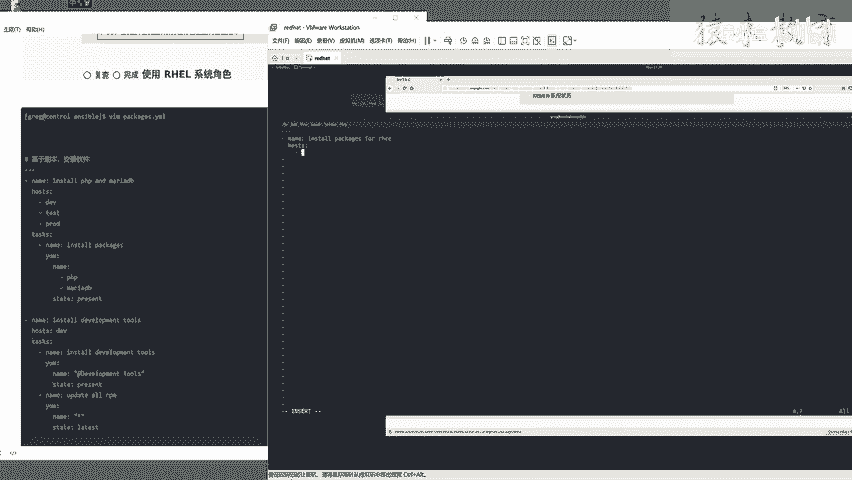

# Linux红帽认证教程、RHCSA、RHCE、RHCA认证【可预约考试】 - P9：9-03 安装软件包 - he_nio - BV1Db41197cx

好了我们再来看这个r h c一啊。

咱们看啊，刚才我们是做了第一道题，把这个unser的环境啊给它安装好了，配置好了对吧，他这个c考题啊，是完全的考察你answer wer用的怎么样，第二道题呢他考察你临时命令用的怎么样。

你会不会通过临时命令设置一个样仓库，而且他底下的题目啊都是有连贯性的，第三道题安装软件包，你想啊，你第二道题的样本仓库如果设置的不对，你第三道题的安装软件包能做好吗，是不是啊。

所以说第三来关于我们刚才所做的第二道题，简安装的这个软件包啊，我这里呢是已经登录到了任意一台一台机器上，然后咱们可以进入到这个etc样本reports，点d看一看。

这是不是就咱们刚才生成的两个仓库啊对吧，来cat ex 294 base，第一个仓库没问题，cat ex 294 string，第二个仓库都没问题。

以及你可以在这个机器本地啊执行young report list，看好它是不是列出你看有这俩仓库好使啊，所以说来咱们就exit回到你的管理啊，回到什么呀，看好了，host name。

这是我们的answer ver管理机啊，一定要注意你在哪台机器上啊，来而且呢啊来咱们换一个目录啊，ancier or杠m啊，来host那，你看一下，来杠n m执行这条命，大家会发现什么呀。

你p w d你现在搁哪儿啊，你现在是不是在来，咱们随便切到切到一个o p t目录，你再试试安server的临时命令，好使吗，不好使了，因为它提示你主机清单文件为空，什么意思啊。

也就是这道题它还是有个暗坑，他说要求你啊，你的剧本都得在这个指定目录下去执行啊，以及你的命令也都是通过greg用户，在这个指定的目录下运行，知道吧，所以说你在做题的时候啊，一定不能啊切到别的目录中。

host greg answer wer，一定要在这个目录下去操作，而且读取当前的一个inventory文件，知道吧，你在这个目录下安server杠n来n server or杠n ping。

你才会发现看一下它是好使的，看见了吧，而且这是咱们的ctrl机器。

好细节给大家说完了，我们来看下一道题，就是这个安装软件包怎么玩这道题啊，先分析一下需求来安装软件包，这是核心目标，先让你创建一个yml文件，很明显啊，ad hook考察完毕了。

考察剧本的压码语法会不会写，对不对啊，朋友们，所以说啊让你去写play book了，看你丫们会不会啊，你要不会你就把超哥的这个课呀，安斯文的课给他好好看一看啊，好具体的要求啊。

让你安装菲律宾和美若dp这两个软件，然后是指定安装到d v test proud这三个主机组，如果跟这仨没关的，那就不会去装，他，知道吧，指定主机的啊，来又装一个rpm的开发工具包。

指定装到d e v环境中啊，然后要求是还要要求你将dv主机组中，所有的软件更新为最新版本，看见吧，1233个要求你都得在这个剧本中给他写好，没问题吧，所以说这道题就看你剧本，就看你剧本会不会写了。

怎么玩呢，首先跟着人家要求指定的目录在这儿啊。

咱们打开这个文件啊，怕来再给大家明确一波，在home greg anciable packages。

点y m l ym文件，打开它，咱们就根据题意来啊。

来大家呢就跟着我这个啊，跟着我这个写法操作一波啊，首先进入编辑模式，写上三个档，表示这三个杠就表示这是一个普通的ym剧本，可以吧，然后杠一个空格啊，注意了，这是完全的压码的一个语法啊。

短横线空格表示定义的一个列表，对不对啊，来细节咱们就不说了啊，咱们呢就带着大家呃手写ym，把这道题给它搞定啊，来首先先定一个名字，这个名字他倒没有要求是什么啊，这里就是就是什么呀。

先指明这个剧本是什么作用，比如说install packages啊，for rhc，可以吧啊，这就是一个名字，你写什么都行，下一个要求就是指定主机组了，人家指定是dv test proud。

这三个机器对不对，所以说你要空格，空格俩空格和这个name对齐啊，house house是冒号啊，回车看好了，回车怎么回这么多呀，1234，在这个horse里面啊，来俩空格就行了，看好一二好吧。

然后短横线定义主这个主机组的一个列表了。

d1 v test proud。

注意了，写法是这样的啊，来回车再来一个短截线，d e v test，再来短斜线跳的，看明白吧，这是题目中要求的指定给这三个主机，所以说我这利用host，然后给这三个主机啊去安装啊。

就是先指定好主机的名字，下一步你呢依然是和这个horse是对齐，写上一个tasks啊，tasks这表示去定义任务了，任务是什么呀，是安装软件包p2 p和mo db，所以说来往前走啊，一二俩俩空格就行了。

大家注意我的一个规范写法，短横线空格name起名字了，叫install p p and maria db，没问题吧，这就是一个任务的一个说明，这个任务是干嘛的，干嘛的呢，装这俩包。

所以说和这个name评级写一个一样模块啊，冒号回车啊，来一二和这个样模块，这个样模块啊，换行之后俩空格就表示是一个缩进写法，ok吧，来name name是什么呢，装两个包，一个是p2 p。

一个是maria db，所以说继续的回撤依然是和这个name对齐，然后第二俩空格，第一个软件名字叫p2 p，第二个软件名字叫maria db，所以说这是定义了一个任务名字。

叫做他使用样模块去安装p2 p和mo db，可以吧，然后就具体安装的参数呢，就得用一个叫做state参数啊，你呢可以直接写在后头了，就是注意了一定有个空格啊，state冒号空格present。

这表示去安装这两个软件包，可以吧，所以说咱们这个剧本啊，第一道题是完成了，第二道题是指定给这个dv主机啊，去安装这个development rpm包，这个rpm开发工具组的一个包，好吧，来看我怎么写啊。

一直往前走，咱们第一个任务就搞定了，第二个任务和他的关系是零级的，所以说你要回到最前面啊，回到光标跑到最前面来一个杠name啊，install注意了啊，name冒号空格install装什么呢。

装这个包啊，你可以把它这就是一个注释写在这就行了，依然是这表示啊，指定了第一个剧本的一个任务啊，来这是第二个第二个一个剧本啊，这是先指定主机组post 12啊，操作哪台机器啊，是不是这个dv机器啊。

所以说短横线dv就可以了，来下一个就是tx具体的任务，给它起个名字啊，来test俩空格杠name啊，给它起个名字叫install，这个啊你可以写着和他名字一样就可以了，唉这就是个注释啊。

比如说因此到dv tse写的写的简单，一点也没人，也也语法也都是对的，好吧，来先指这名字，名字完了就是你具体要装什么，依然是一样，冒号回车啊，一二俩缩进写上一个name name是什么呢。

叫做rpm的一个就是development tools开发工具包，注意了，这里啊，如果说你单单装的装的是一个普通，单个的软件包，你就直接写这个软件包的名字就行了，而如果说你装的是一个工具包组。

你就得这么去写了，朋友们通过一个圈加上这个工具包的名字，看见吧，先有引号，加上一个圈，development tools好了，然后除了名字还在指定一个状态，你是想安装还是卸载。

安装的话写上present，这些啊，都考察你剧本语法熟不熟，以及样模块的参数熟不熟好吧。

来，然后要求关于这个dv这台机器啊，除了是要装这个开发工具包组，还有一个什么呀，给这个dv所有的软件啊，更新一下，所以说是不是同一个这个剧本中的俩任务啊。

所以说你就继续给他写就行了，呃，来tasks和这个name对齐就行了，杠那第二个任务叫update or rpm是吧，来依然是用样模块来一二俩空格。

name是什么的啊，升级所有软件。

你就直接引号星，他支持这个写法，然后state状态你可以不写present了，因为present它是安装，你得写latest这道题啊，咱们就把这三个要求完成了，而且注意了，你一定要他确保安装。

因为底下的题目，他依然会用到这个p2 p和m o d b明白吧，所以说来呃latest保存退出，咱们呢可以用answer ver gun，playbook杠c，先验证一下你写的这个剧本啊。

它的语法对不对，知道吧，这是一个实践性的技巧，如果说你发现他在这儿啊，注意了啊，杠c是测试这个剧本是否正确，不会真的执行他啊，来我给你，我给你写下来说，你可以先测试这个剧本语法对不对，而不会正确执行。

ok吧，来发现我们这里呢是操作了node，12344台机器呢都是有修改的一个状态的，说明是安装成功的是吧，那你会发现诶我们cat inventory，他唯独一234d1 v test proud都有了。

而唯独没有这个note 5 balance，是不是啊，所以说这道题是没问题的啊，来确认它正确，你一定要执行一下，你要不执行啊，那不还是等于等于空吗，看一下啊啊，叫检查的确还没安装。

咱们呢去查一下user呃，来指定，咱们随便挑一个吧，挑一个test组啊，test杠m share，杠a来让他去叫rpm啊，q a p p，你会发现note 2这台机器啊，它是没有装这俩软件mod。

对不对，所以说你enser gun playbook这一次啊，不要加任何参数了，直接运行它走，你，这里啊装软件时间还是比较长的，因为他要给这四台机器啊，都去装这个p2 p和mo db这俩软件啊，然后呢。

还要给这个node 1，这台机器去装一个开发工具包组啊，所以说咱们稍微等一会就行了。

具体的剧本写法，我我呢也给大家写在笔记中了，大家呢回头啊，可以照着我这个笔记去敲，可以吧，但是你一定不要复制粘贴，你要是复制粘贴的话，你永远学不会这个压门语法。

知道吧，好了，同学们，这里呢他已经全部的执行完毕了，你看就这四台机器，而没有note 5，对不对啊，那这一次是装完了，咱们可以去验证一下unsuper，加上answer ver or操作所有主机。

去检查一下这俩安装包是否有，来咱们会发现no 5没有，而no的1234是不是都有了呀，这道题呢咱们就已经带领大家把剧本写完了，也这个检查完毕了，对不对啊，好，那么还差一个。

这个第一位主机组中的开发工具包啊，这些信息咱们可以用这条命令啊，来试一下就可以了，大家看一下answer ver dv啊，表示操作dv组，然后去young grew li group list。

列出他的工具包组是否有这个这个develop，这个包是吧，然后加上了一个杠a让他忽略大小写，因为你会发现这个包名啊，它可能会有这个d字母是大写的，所以说回车看一下，检查一下。

我们会发现dev也就是node 1，这台机器是不是young group list，找出了这个工具包组啊，来以及这个rpm工具包组啊，没问题吧，好了。

