# Linux网络运维架构：第4章：Vim编辑器和恢复ext4下误删除的文件-Xmanager工具

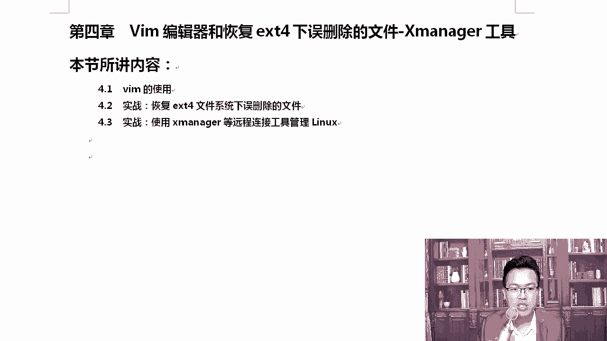

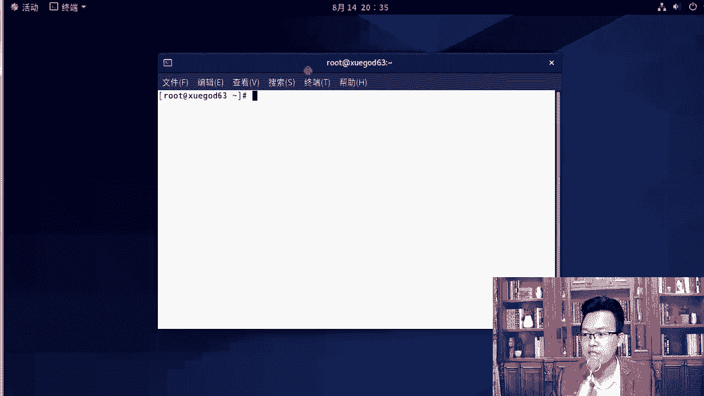

## 概述
在本节课中，我们将要学习三个非常实用的Linux运维技术：Vim编辑器的详细使用、在ext4文件系统下恢复误删除的文件，以及Xmanager工具。这些是从事Linux运维工作必须掌握的核心技能。首先，我们从Vim编辑器开始介绍。

---

## 4.1：在正常模式下做的操作

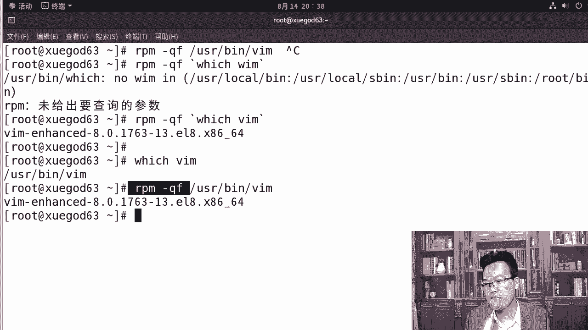

Vim是Linux系统中一个功能强大的文本编辑器。我们之前已经简单使用过它，这次我们将详细探讨它的各种使用方式。

首先，我们可以查看Vim命令的位置。使用 `which vim` 命令可以找到它的路径，通常在 `/usr/bin/vim`。此外，系统中还有一个 `vi` 命令，我们可以用 `which vi` 来查看它的位置。

**代码示例：**
```bash
which vim
which vi
```

那么，`vim` 和 `vi` 是什么关系呢？我们可以通过一个技巧来查看一个命令是由哪个软件包安装的。使用 `rpm -qf` 命令可以查询。

**代码示例：**
```bash
rpm -qf `which vim`
rpm -qf `which vi`
```

这里用到了反引号 `` ` ``。反引号的作用是：先执行反引号内的命令，并将其输出结果作为外部命令的输入。这是一种在Linux中常用的方法，在后续学习Shell脚本时会经常遇到。

从查询结果可以看出，`vim` 和 `vi` 并非由同一个软件包安装。`vim` 是 `vi` 的增强版，最明显的区别是 `vim` 支持语法高亮显示，并且完全兼容 `vi`。例如，用 `vi` 打开 `/etc/passwd` 文件时，内容是黑白的；而用 `vim` 打开时，内容则是彩色的，并带有语法高亮。

### Vim的运行模式
Vim主要有四种运行模式：
1.  **正常模式**：俗称命令模式。首次打开文件时即进入此模式。
2.  **插入模式**：俗称编辑模式。在此模式下可以像编辑普通文档一样输入和修改文本。
3.  **命令行模式**：在此模式下可以输入冒号 `:` 开头的命令来执行保存、退出等操作。
4.  **可视模式**：在此模式下可以用光标选择文本块进行操作。

刚打开文件时，我们处于正常模式。按下 `i` 键会进入插入模式，此时屏幕左下角会显示 `-- INSERT --`。在插入模式下，按下 `Esc` 键会返回正常模式。在正常模式下输入冒号 `:` 则会进入命令行模式。

### 进入插入模式的方法
从正常模式进入插入模式有多种方法，它们区分大小写，功能各不相同：

以下是几种常用的方法：
*   **i**：在当前光标位置之前插入。
*   **a**：在当前光标位置之后插入。
*   **o**：在当前行的下一行插入一个新行并进入插入模式。
*   **I**：移动到当前行的行首并进入插入模式。
*   **A**：移动到当前行的行尾并进入插入模式。

对于初学者，建议先熟练掌握 `i` 和 `o` 即可。

### 正常模式下的常用操作
上一节我们介绍了如何进入插入模式，本节我们来看看在正常模式下可以进行哪些快捷操作。这些操作无需进入插入模式即可执行。

以下是在正常模式下的一些实用快捷键：
*   **x**：删除光标所在位置的字符（相当于 `Delete` 键）。
*   **X**：删除光标前一个位置的字符（相当于 `Backspace` 键）。
*   **u**：撤销上一次操作。
*   **Ctrl + r**：恢复被撤销的操作。
*   **r**：替换光标所在位置的单个字符。按下 `r` 后，再输入要替换成的字符即可。

### 光标的移动
在正常模式下移动光标，除了使用方向键，还可以使用 `h`、`j`、`k`、`l` 键，它们分别对应左、下、上、右移动。

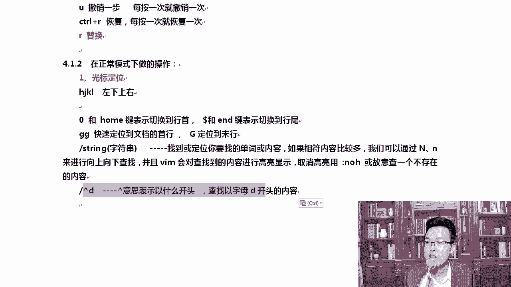

以下是一些快速定位光标的快捷键：
*   **0** 或 **Home**：快速移动到当前行的行首。
*   **$** 或 **End**：快速移动到当前行的行尾。
*   **gg**：快速移动到文件的第一行。
*   **G**：快速移动到文件的最后一行。
*   **:n**：跳转到第 `n` 行。例如，`:23` 跳转到第23行。

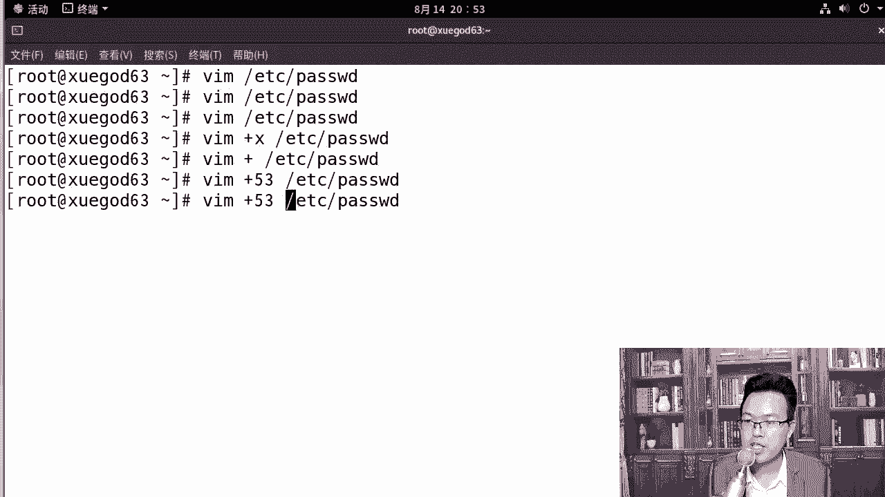

### 内容的查找
在文件中查找特定字符串是常见操作。在正常模式下，按下 `/` 键，然后输入要查找的字符串，再按回车即可开始查找。

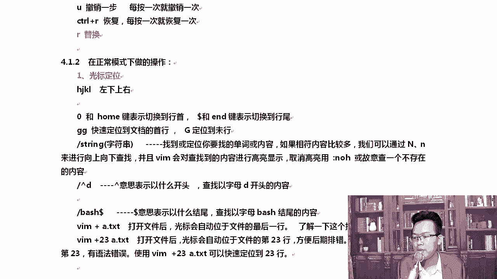

查找时，Vim会对匹配的内容进行高亮显示。使用 `n` 键可以跳转到下一个匹配项，使用 `N` 键可以跳转到上一个匹配项。

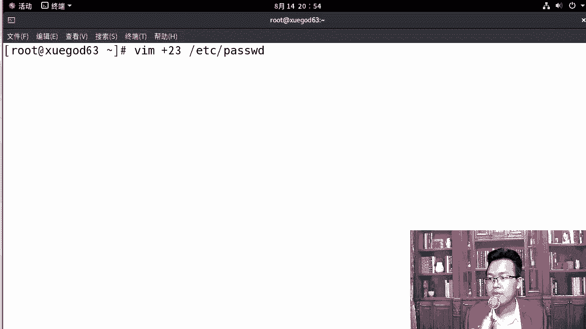

如果希望取消高亮显示，可以在命令行模式下输入 `:noh` 命令。

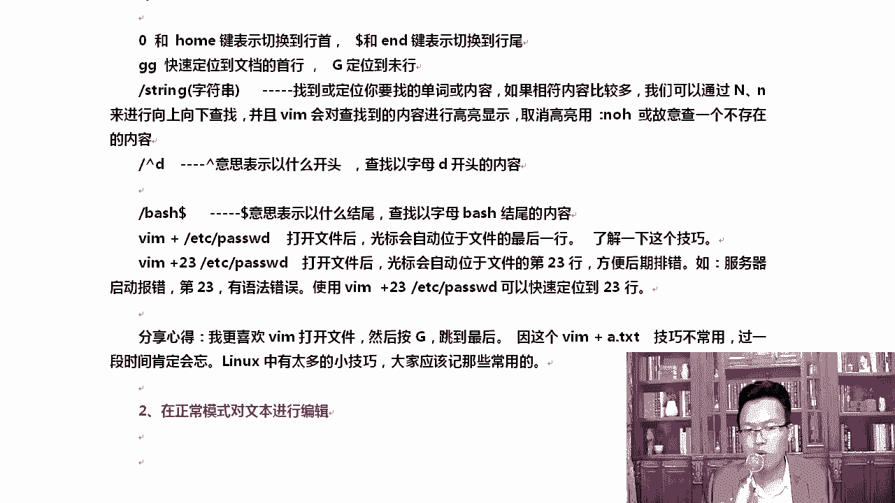

**代码示例：**
在正常模式下输入 `/root` 并回车，即可查找文件中所有的 “root” 字符串。

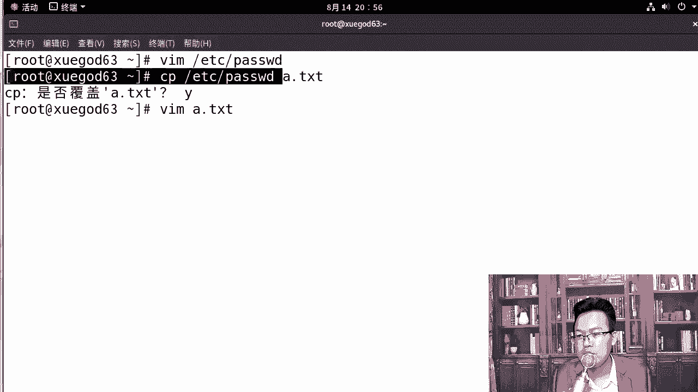

### 复制、粘贴与删除
在正常模式下，我们可以高效地进行文本的复制、粘贴和删除。

以下是相关操作：
*   **yy**：复制当前行。
*   **nyy**：复制从当前行开始的 `n` 行。例如，`2yy` 复制两行。
*   **p**：将复制或删除的内容粘贴到光标所在行的下一行。
*   **dd**：删除（剪切）当前行。被删除的内容可以使用 `p` 粘贴，因此它也起到了剪切的作用。
*   **ndd**：删除从当前行开始的 `n` 行。
*   **D**：删除从光标位置到当前行尾的所有内容。

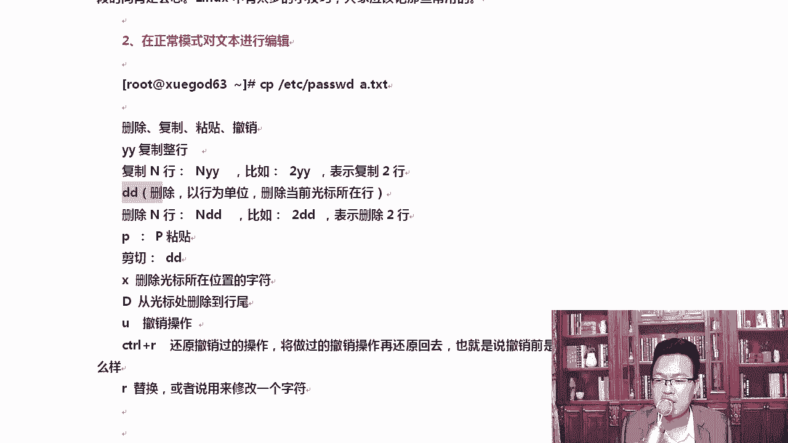

### 可视模式
在正常模式下，按下 `Ctrl + v` 可以进入可视块模式。在此模式下，可以矩形区域的方式选择文本，方便进行列块操作。

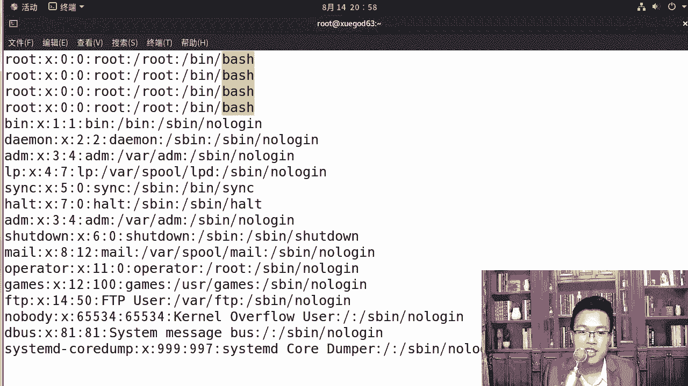

要退出任何模式（插入模式、可视模式、命令行模式），都可以按 `Esc` 键返回正常模式。

---

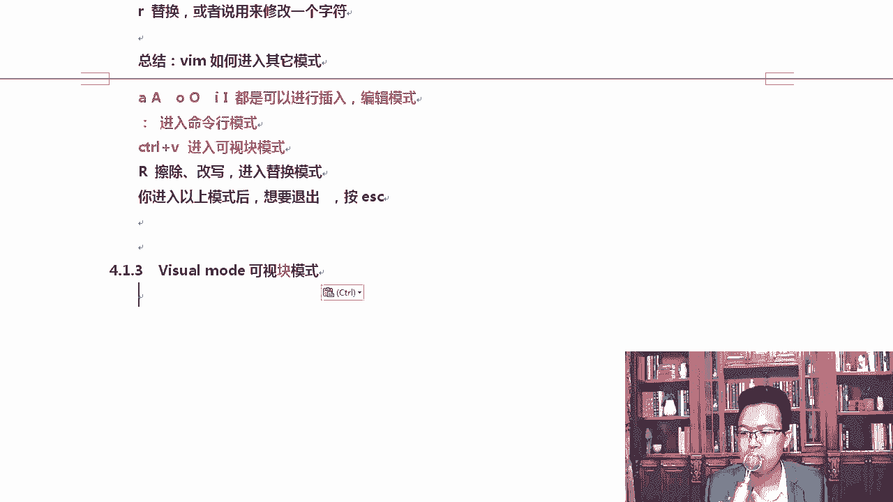

## 总结
本节课我们一起学习了Vim编辑器的核心概念和基本操作。我们了解了Vim的四种运行模式，重点掌握了在正常模式下进行光标移动、文本查找、复制粘贴删除等高效操作的方法。记住这些快捷键并多加练习，将极大提升你在Linux环境下的文本编辑效率。下一节，我们将继续学习Vim在命令行模式下的更多高级功能。