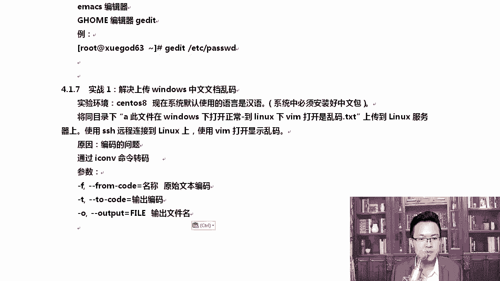
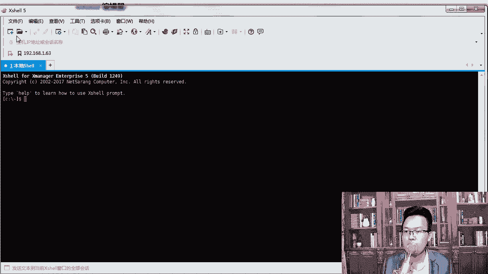
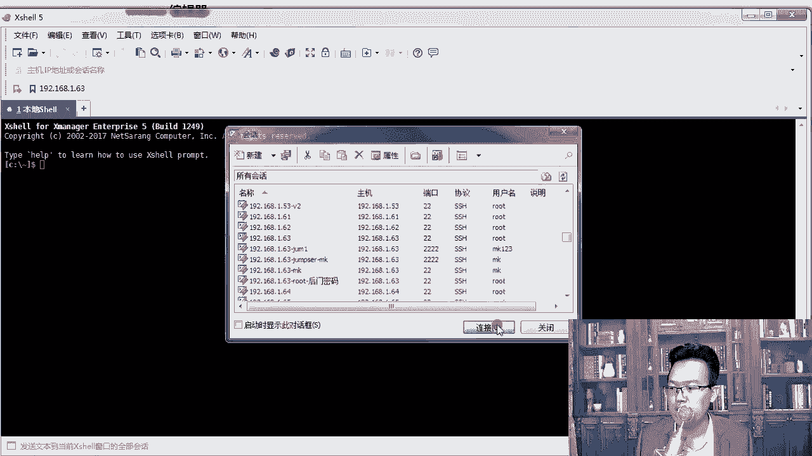
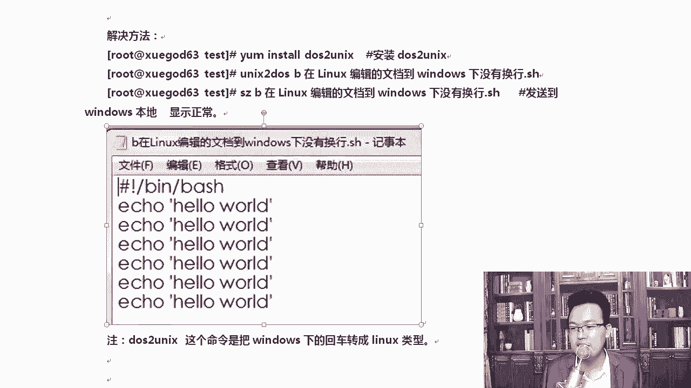

# Linux网络运维架构：第4章：Vim编辑器实战 - 解决中文乱码与换行问题 🛠️

在本节中，我们将通过两个实战案例，学习如何使用Vim及相关工具解决工作中常见的文件编码和格式问题。具体包括处理Windows中文文档在Linux下打开乱码，以及Linux脚本在Windows下打开无换行的问题。

上一节我们介绍了Vim的基本操作，本节中我们来看看如何应用这些知识解决实际问题。

---



## 编码转换：解决中文乱码问题





在Linux系统中打开从Windows上传的包含中文的文档时，常常会出现乱码。这主要是因为Windows和Linux系统默认使用的字符编码不同。

Windows系统通常使用`GB2312`或`GBK`编码，而Linux系统普遍使用`UTF-8`编码。因此，需要进行编码转换。

以下是解决此问题的步骤：

1.  **准备环境与文件**：首先，确保你的Linux系统已安装中文字体库，以便能正常显示汉字。然后，将存在乱码问题的文件上传到Linux服务器。
2.  **使用`iconv`命令转换编码**：`iconv`是一个用于转换文件编码的命令行工具。

其基本命令格式为：
```bash
iconv -f [原始编码] -t [目标编码] -o [输出文件] [输入文件]
```
3.  **执行转换**：针对从Windows上传的GB2312编码文件，可以运行以下命令将其转换为UTF-8编码：
```bash
iconv -f GB2312 -t UTF-8 -o output.txt input.txt
```
转换完成后，使用Vim打开`output.txt`文件，中文内容即可正常显示。

---

## 格式转换：解决换行符问题

在Windows和Linux/Unix系统中，文本文件使用的换行符标准不同，这会导致脚本等文件在跨系统查看时格式混乱。

*   **Windows**：使用回车符和换行符的组合，表示为`\r\n`。
*   **Linux/Unix**：仅使用换行符，表示为`\n`。

因此，当Linux脚本在Windows的记事本等工具中打开时，会显示为没有换行的一长行。

以下是解决此问题的步骤：

1.  **安装转换工具**：我们可以使用`dos2unix`和`unix2dos`工具进行换行符转换。在RHEL 8等系统中，如果未安装，系统可能会提示自动安装。
2.  **转换文件格式**：若要将Linux格式的文件转换为Windows可识别的格式，可使用`unix2dos`命令。
```bash
unix2dos linux_script.sh
```
3.  **下载文件**：转换完成后，可以使用`sz`命令将文件下载到本地Windows系统进行查看，此时换行将恢复正常。

---

## 文件传输小技巧

在实战中，我们使用了`rz`和`sz`命令进行文件的上传和下载。
*   `rz`：用于从本地Windows系统上传文件到远程Linux服务器。
*   `sz [文件名]`：用于将Linux服务器上的文件下载到本地Windows系统。

这些命令在Xshell、SecureCRT等终端工具中通常可以正常工作。

---



本节课中我们一起学习了两个实用的Vim周边技巧：一是使用`iconv`命令转换文件编码以解决中文乱码；二是使用`dos2unix`/`unix2dos`命令转换换行符以解决跨系统浏览的格式问题。掌握这些技能，能有效处理日常运维中遇到的文本文件兼容性问题。