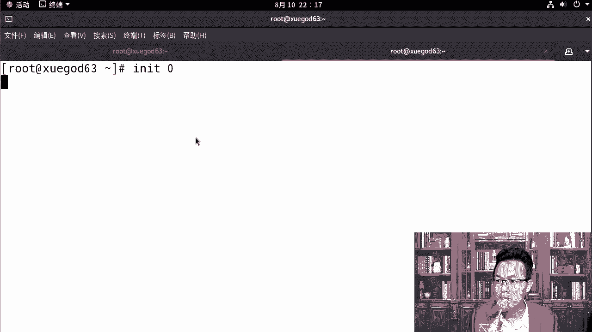
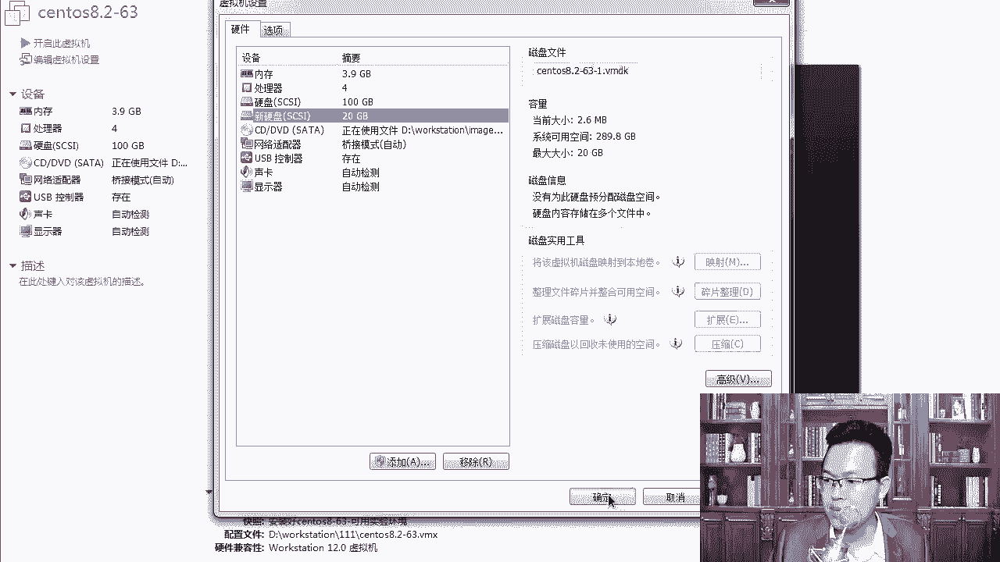
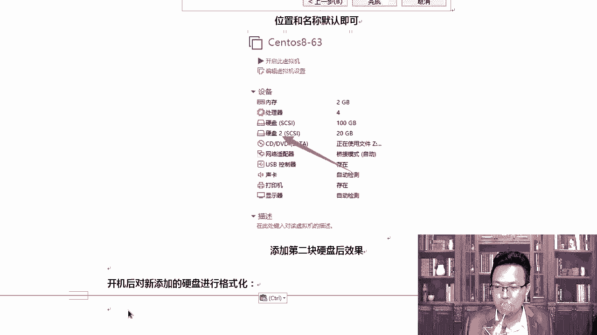

# Linux网络运维架构：第3章：xfs文件系统备份与恢复实战

## 概述
在本节课中，我们将学习xfs文件系统的备份与恢复方法。xfs是CentOS 7及之后版本的默认文件系统，它专为大数据设计，支持超大容量和高扩展性。与ext4不同，xfs文件系统在数据误删除后不易直接恢复，因此定期备份至关重要。我们将重点介绍xfsdump和xfsrestore工具，并演示完全备份与增量备份的操作流程。

## xfs文件系统简介
上一节我们介绍了文件系统的基本管理方法，本节中我们来看看xfs文件系统的特性。xfs是一个高性能的日志文件系统，特别适合处理大文件和大量数据。

以下是xfs文件系统的主要特点：
*   **大容量支持**：单个文件系统最大支持**8EB**，单个文件最大支持**16TB**。
*   **高扩展性**：其设计能够高效处理大量数据，满足大数据应用场景的需求。
*   **在线备份（热备）**：支持在文件系统挂载且正常运行的状态下进行备份，无需卸载或停机，类似于虚拟机快照功能。
*   **数据流导向**：备份时可以将数据流指向不同的存储目的地。

## 备份类型解析
了解xfs文件系统的特性后，我们需要掌握其备份策略。xfsdump工具支持两种主要的备份级别。

以下是备份级别的分类说明：
*   **完全备份（级别0）**：备份指定文件系统内的所有数据。
*   **增量备份（级别1-9）**：仅备份自上一次**任意级别**备份以来发生变化的数据。

为了更清晰地理解，这里对比三种常见的备份概念：
*   **完全备份**：每次备份全部数据。优点是恢复简单，缺点是耗时耗空间。
*   **增量备份**：备份自**上一次备份后**新增或改动过的数据。优点是备份速度快、占用空间小，缺点是恢复时需要按顺序还原所有增量备份。
*   **差异备份**：备份自**第一次完全备份后**所有新增或改动过的数据。恢复时只需要完全备份和最后一次差异备份。

## 实验环境准备
理论部分已经介绍完毕，接下来我们进入实战环节。首先需要为备份操作准备一块独立的磁盘。

1.  **关闭虚拟机**：在虚拟机软件中关闭Linux系统。
2.  **添加新磁盘**：编辑虚拟机设置，添加一块新的SCSI硬盘，容量设置为20GB。
3.  **启动虚拟机**：开启系统，准备对新磁盘进行分区和格式化。

## 磁盘分区与格式化
现在，我们来对新添加的磁盘进行配置，以便将其用作备份存储。

以下是配置新磁盘的步骤：
1.  使用 `fdisk -l` 命令查看新添加的磁盘设备，通常为 `/dev/sdb`。
2.  使用 `fdisk /dev/sdb` 命令对磁盘进行分区。
    *   输入 `n` 创建新分区。
    *   选择分区类型（主分区 `p`）。
    *   设置分区号（默认为1）。
    *   设置起始和结束扇区（通常使用默认值以占用全部空间）。
    *   输入 `w` 保存并退出。
3.  使用 `mkfs.xfs /dev/sdb1` 命令将分区格式化为xfs文件系统。
4.  创建一个挂载点，例如 `mkdir /backup`。
5.  将新分区挂载到该目录：`mount /dev/sdb1 /backup`。

## xfsdump完全备份实战
环境准备就绪后，本节我们开始进行第一次完全备份。假设我们要备份 `/data` 目录。



以下是执行完全备份的命令：
```bash
xfsdump -f /backup/data_full_backup.img -L full_backup -M "Backup for /data" /data
```
**参数解释**：
*   `-f`：指定备份文件存放的路径和名称。
*   `-L`：指定备份会话的标签。
*   `-M`：指定备份设备的标签。
*   最后一个参数 `/data` 是指定要备份的源目录。


## xfsdump增量备份实战
完成完全备份后，当数据发生变化时，我们可以使用增量备份来节省时间和空间。上一节我们创建了完全备份，本节中我们来看看如何进行增量备份。

首先，在 `/data` 目录中创建一些新文件或修改现有文件。
然后，执行增量备份命令：
```bash
xfsdump -l 1 -f /backup/data_inc_backup_lv1.img -L inc_backup_lv1 -M "Backup for /data" /data
```
**参数解释**：
*   `-l 1`：指定备份级别为1（增量备份）。数字1-9代表不同的增量级别，通常按顺序使用。




## xfsrestore恢复实战
备份的最终目的是为了在需要时能够恢复数据。本节我们将演示如何使用备份文件恢复数据。

假设需要将数据恢复到 `/restore_data` 目录。
1.  首先创建恢复目录：`mkdir /restore_data`
2.  执行恢复命令，先恢复完全备份：
    ```bash
    xfsrestore -f /backup/data_full_backup.img /restore_data
    ```
3.  如果需要恢复增量备份，则按备份顺序依次恢复：
    ```bash
    xfsrestore -f /backup/data_inc_backup_lv1.img /restore_data
    ```




## 总结
本节课中我们一起学习了xfs文件系统的备份与恢复。我们首先了解了xfs文件系统的特点及其对备份的需求，然后详细讲解了完全备份、增量备份和差异备份的概念与区别。通过实战演练，我们掌握了使用 `xfsdump` 命令进行完全备份和增量备份，以及使用 `xfsrestore` 命令恢复数据的完整流程。定期并正确地备份是保障数据安全的关键措施。