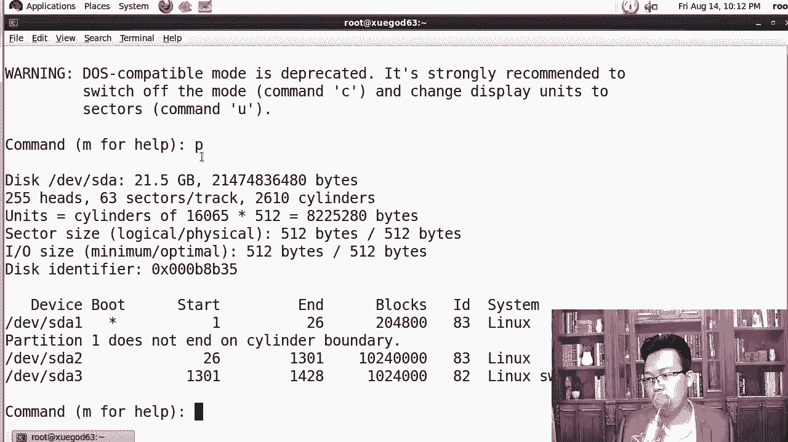
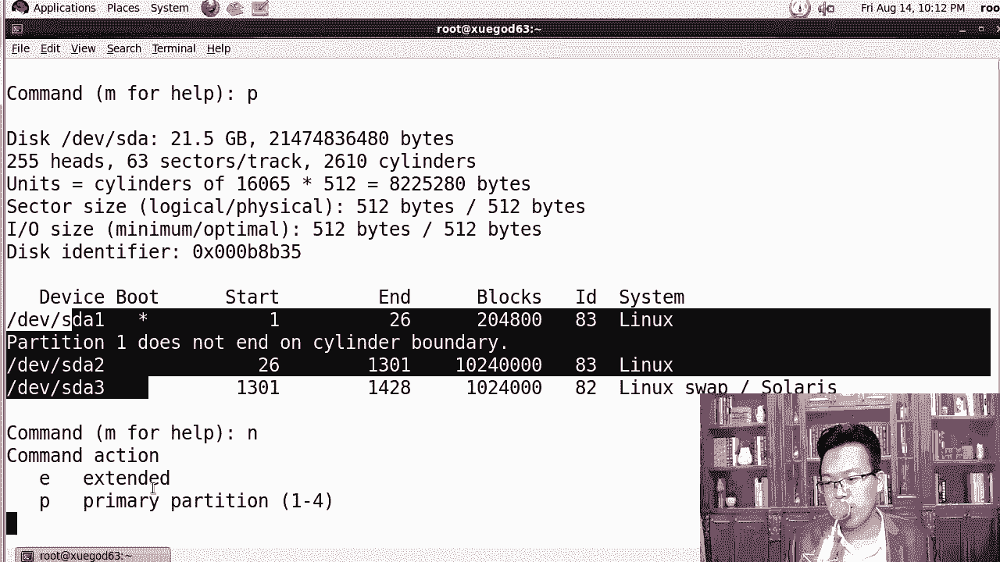
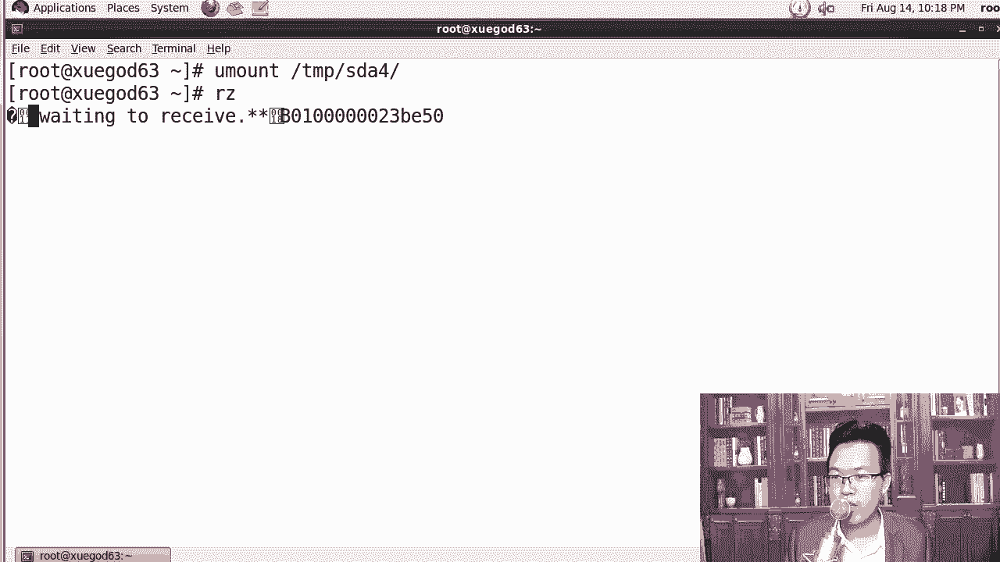
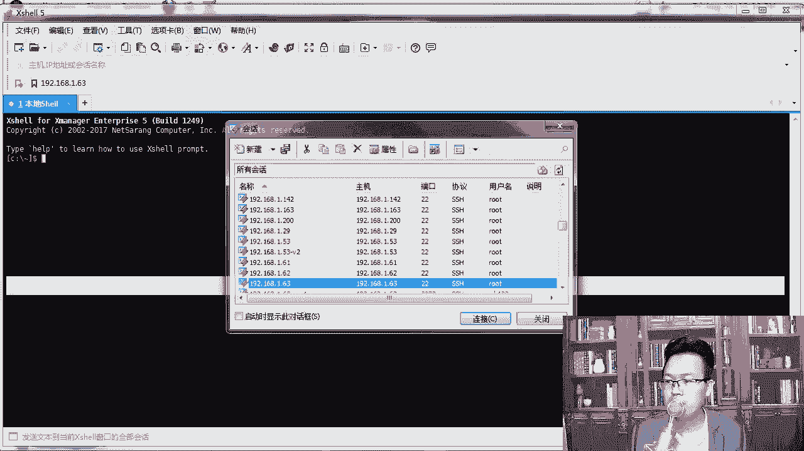
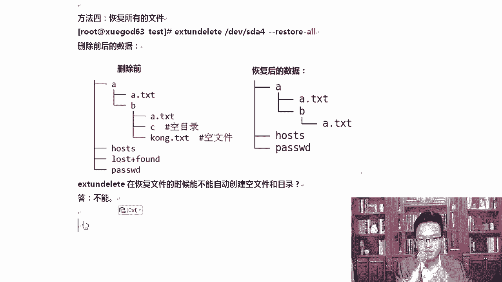

# Linux网络运维架构：第4章：Vim编辑器和恢复ext4下误删除的文件-Xmanager工具

## 概述
在本节课中，我们将学习如何在CentOS 6系统上恢复ext4文件系统下被误删除的文件。我们将了解文件删除的原理，并掌握使用`extundelete`工具进行数据恢复的完整流程。

---

## 4.4：实战-在CentOS 6上恢复ext4文件系统下误删除的文件

### 课程背景与原理
上一节我们介绍了Vim编辑器的使用，本节中我们来看看数据恢复。在企业环境中，误删除文件是运维人员可能遇到的棘手问题。在CentOS 6的ext4文件系统下，我们可以借助工具进行恢复，但在CentOS 7的xfs文件系统下，开源恢复工具的效果则不佳。

Linux文件系统主要由三部分组成：
*   **文件名**：如 `a.txt`
*   **inode**：存放文件的元数据信息（如权限、所有者、时间戳、大小等）
*   **block**：存放文件的实际数据

当我们执行删除命令 `rm -rf a.txt` 时，实际上只删除了**文件名**与**inode**的链接。inode和block中的数据并未被立即擦除，只是被标记为“可被覆盖”。因此，只要数据未被新数据覆盖，就有可能恢复。

**核心概念公式**：
```
读取文件：文件名 -> inode -> block
删除文件：断开 `文件名 -> inode` 的链接
```

### 恢复前的关键准备
一旦发现文件误删，第一要务是**防止数据被覆盖**。以下是必须立即采取的措施：

以下是关键操作步骤：
1.  **卸载文件分区**：立即卸载被删除文件所在的分区。
2.  **以只读方式挂载**：如果无法卸载，则应以只读方式重新挂载该分区。
3.  **使用外部介质**：将恢复工具安装和运行在U盘或移动硬盘上，恢复的数据也应保存到外部介质，避免对原分区进行写操作。





### 实验环境搭建
为了清晰演示，我们将在虚拟机中创建一个新的独立分区来模拟误删场景。

以下是创建和准备测试分区的步骤：
1.  使用 `fdisk /dev/sda` 创建一个新的主分区（例如 `/dev/sda4`）。
2.  使用 `mkfs.ext4 /dev/sda4` 格式化为ext4文件系统。
3.  使用 `mount /dev/sda4 /mnt/sda4` 挂载到指定目录。
4.  在挂载点创建测试文件和目录结构。

```bash
# 示例：创建测试数据
cp /etc/passwd /mnt/sda4/
mkdir -p /mnt/sda4/a/b
touch /mnt/sda4/empty.txt
```

### 模拟误删与安装恢复工具
现在，我们模拟误删除操作，并安装数据恢复工具 `extundelete`。





以下是操作步骤：
1.  删除测试数据：`rm -rf /mnt/sda4/*`
2.  卸载分区：`umount /mnt/sda4`
3.  上传 `extundelete` 软件包到系统。
4.  安装依赖包：`yum install -y e2fsprogs-devel`
5.  编译安装 `extundelete`：
    ```bash
    tar -jxvf extundelete-*.tar.bz2
    cd extundelete-*
    ./configure
    make -j4  # 使用4个进程并行编译，加快速度
    make install
    ```

**知识扩展**：`install` 命令与 `cp` 命令的区别在于，`install` 可以在复制时直接设置文件权限，例如 `install -m 755 source dest`。

### 执行文件恢复
`extundelete` 提供了多种恢复模式。我们创建一个干净的目录 `/root/test` 用于存放恢复出来的文件。

以下是几种常用的恢复方法：

**1. 通过inode号恢复**
首先需要查询被删除文件的inode号。
```bash
extundelete /dev/sda4 --inode 2
# 从根inode（通常为2）开始扫描，在输出信息中找到被删文件的inode号
extundelete /dev/sda4 --restore-inode <inode号>
# 恢复的文件会保存在当前目录的 `RECOVERED_FILES` 文件夹下
```

**2. 通过文件名恢复**
如果你知道被删除文件的具体名称。
```bash
extundelete /dev/sda4 --restore-file passwd
```

**3. 恢复整个目录**
```bash
extundelete /dev/sda4 --restore-directory a
```

**4. 恢复所有可恢复的文件**
```bash
extundelete /dev/sda4 --restore-all
```

**注意**：`extundelete` 工具通常无法恢复**空文件**和**空目录**。恢复完成后，建议使用 `diff` 命令对比恢复出的文件与原始文件，确认数据完整性。

### 安全启示
本实验不仅教授了恢复技术，也揭示了一个重要的安全风险：**普通删除操作并不能彻底擦除数据**。在处置旧硬盘、手机或送修设备前，必须使用专业的数据擦除工具进行多次覆写，以防隐私泄露。

---



## 总结
本节课中我们一起学习了在CentOS 6的ext4文件系统下恢复误删除文件的全过程。我们理解了文件删除的底层原理，掌握了在数据恢复前保护现场的关键步骤，并实践了使用 `extundelete` 工具进行恢复的多种方法。记住，**良好的备份习惯永远是数据安全的第一道防线**，而本课所学的恢复技能则是在紧急情况下的最后保障。