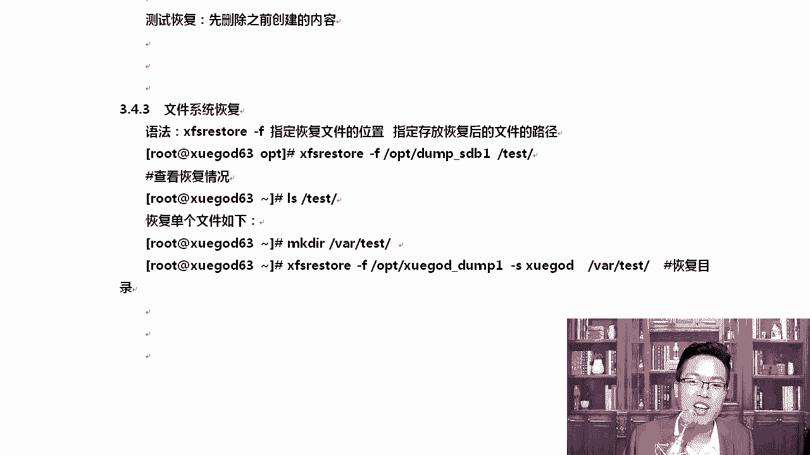
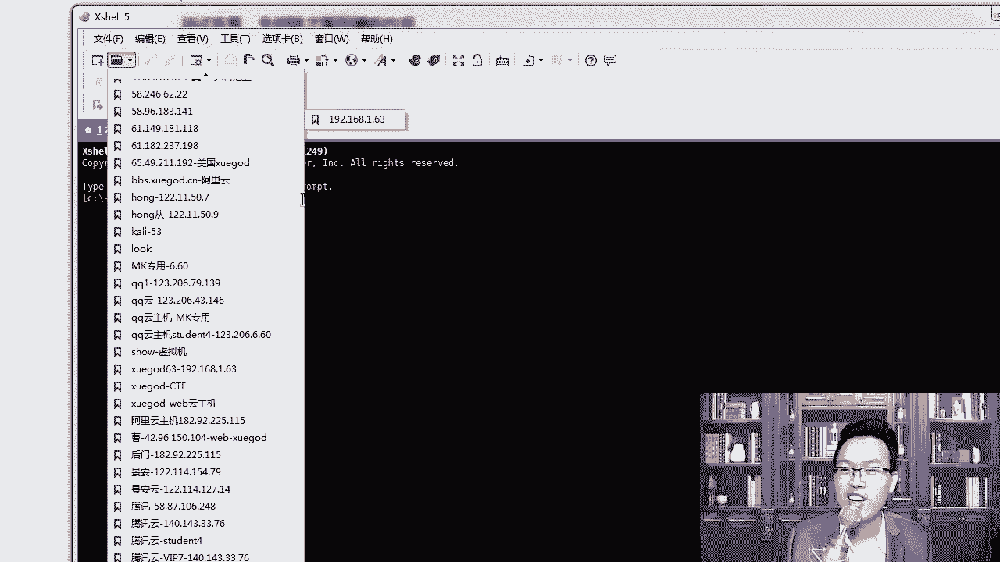
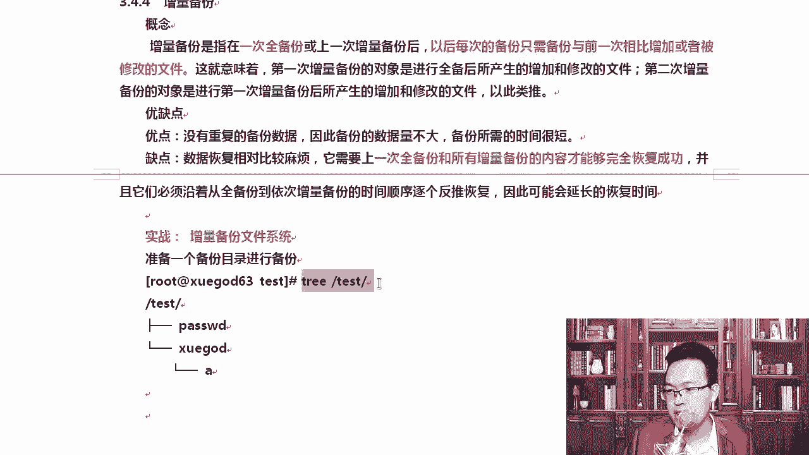
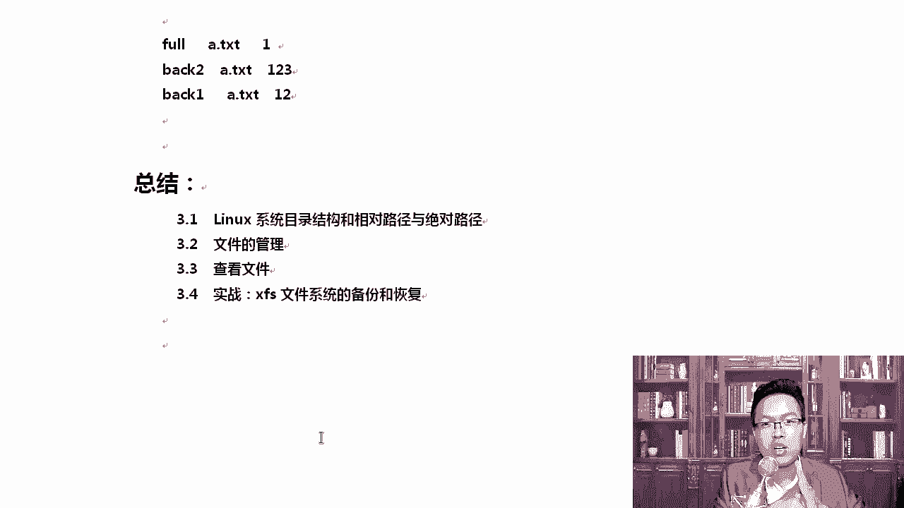

# Linux网络运维架构：第3章：实战 - xfs文件系统的备份和恢复

在本节课中，我们将要学习如何使用 `xfsdump` 和 `xfsrestore` 工具对 XFS 文件系统进行备份和恢复。我们将从磁盘分区开始，逐步完成完全备份、增量备份以及数据恢复的完整流程。

## 概述

XFS 文件系统提供了强大的在线备份与恢复功能。本节我们将通过一个完整的实验，学习如何对新磁盘进行分区、格式化、挂载，然后使用 `xfsdump` 命令进行完全备份和增量备份，最后使用 `xfsrestore` 命令恢复数据。掌握这些技能对于保障服务器数据安全至关重要。

---

## 3.5.1：准备备份环境 - 磁盘分区与格式化

上一节我们介绍了XFS文件系统的特性，本节中我们来看看如何为备份操作准备一个独立的测试环境。首先，我们需要一块新的磁盘并对其进行分区和格式化。

我们假设系统中新添加了一块磁盘 `/dev/sdb`。使用 `fdisk` 命令对其进行分区。

```bash
fdisk /dev/sdb
```

进入 `fdisk` 交互界面后，可以输入 `m` 获取帮助。所有操作均有中文提示。以下是创建新分区的主要步骤：

1.  输入 `n` 创建新分区。
2.  选择分区类型，输入 `p` 创建主分区。
3.  设置分区号，直接回车使用默认值 `1`。
4.  设置起始扇区，直接回车使用默认值。
5.  设置分区大小，例如输入 `+1G` 表示创建1GB大小的分区。
6.  最后，输入 `w` 将分区表写入磁盘并退出。

分区创建完成后，系统会多出一个设备 `/dev/sdb1`。

接下来，我们需要将这个新分区格式化为 XFS 文件系统，因为 `xfsdump` 的增量备份是 XFS 文件系统的特有功能。

```bash
mkfs.xfs /dev/sdb1
```

格式化完成后，需要挂载该分区才能使用。我们在根目录下创建一个挂载点并进行挂载。

```bash
mkdir /test
mount /dev/sdb1 /test
```

现在，我们就有了一个用于测试备份和恢复的独立环境 `/test`。

---

## 3.5.2：创建测试数据并执行完全备份

环境准备就绪后，我们首先需要在 `/test` 目录下创建一些测试数据，然后对其进行第一次完全备份。

进入 `/test` 目录并创建一些文件和目录作为测试数据。

```bash
cd /test
cp /etc/passwd ./
mkdir xuegod
touch xuegod/a
```

使用 `tree` 命令查看当前目录结构，确认数据已创建。

```bash
tree /test
```

输出应类似：
```
/test
├── passwd
└── xuegod
    └── a
```

现在，我们可以开始进行第一次备份。`xfsdump` 命令的基本语法如下：

```bash
xfsdump -f <备份文件存放路径> <要备份的路径或设备>
```

我们对 `/dev/sdb1` 设备进行完全备份，并将备份文件保存到 `/opt/dump_sdb1`。

```bash
xfsdump -f /opt/dump_sdb1 /dev/sdb1
```

执行命令后，程序会交互式地要求输入两个标签：
*   **`session label`**： 备份会话的标签，用于标识这次备份，例如输入 `dump_sdb1`。
*   **`media label`**： 存储设备的标签，描述对哪个设备做的备份，例如输入 `sdb1`。

备份完成后，可以在 `/opt` 目录下看到生成的备份文件。

---

## 3.5.3：使用高级参数与查看备份信息

上一节我们完成了基础的完全备份，本节中我们来看看如何通过参数简化操作，并查看已有的备份记录。

### 免交互备份

为了实现自动化或定时备份，我们可以使用 `-L` 和 `-M` 参数直接在命令行指定标签，避免交互式提问。

以下是免交互备份的示例命令：

```bash
xfsdump -f /opt/dump_sdb1_v2 -L dump_sdb1_v2 -M sdb1 /dev/sdb1
```
*   `-L`： 指定会话标签 (`session label`)。
*   `-M`： 指定介质标签 (`media label`)。

### 备份特定目录或文件

有时我们不需要备份整个分区，而只想备份其中的某个目录。这时可以使用 `-s` 参数指定相对路径。

例如，只备份 `/test` 目录下的 `xuegod` 子目录：

```bash
xfsdump -f /opt/dump_xuegod -s xuegod -L dump_xuegod -M sdb1 /dev/sdb1
```
**注意**：`-s` 参数后的路径是相对于备份源（这里是 `/dev/sdb1` 挂载的根）的相对路径，不能使用绝对路径。

### 查看备份信息

当备份文件增多时，可以使用 `xfsdump -I` 命令查看所有备份记录。

```bash
xfsdump -I
```

输出信息较多时，可以结合 `more` 命令分页查看。

```bash
xfsdump -I | more
```

在输出信息中，可以找到 `session label` 和 `media label`，这有助于我们识别和管理不同的备份。

---

## 3.5.4：数据的恢复操作

备份的最终目的是为了在需要时恢复数据。本节我们将学习如何使用 `xfsrestore` 命令恢复数据。

首先，我们模拟数据丢失的情况，删除 `/test` 目录下的所有内容。

```bash
cd /test
rm -rf *
```

### 恢复完全备份



现在，我们从之前创建的完全备份文件 `/opt/dump_sdb1` 中恢复所有数据到 `/test` 目录。

```bash
xfsrestore -f /opt/dump_sdb1 /test
```

恢复完成后，使用 `ls` 或 `tree` 命令检查，数据应该已完整恢复。



### 恢复特定目录

如果我们只想从备份中恢复某个特定目录（例如 `xuegod`），可以这样做：

首先，创建一个临时目录用于接收恢复的数据。

```bash
mkdir /tmp/restore_test
```

然后，执行恢复命令，并指定 `-s` 参数。

```bash
xfsrestore -f /opt/dump_xuegod -s xuegod /tmp/restore_test
```

这样，只有 `xuegod` 目录及其内容被恢复到了 `/tmp/restore_test` 中。

**重要提示**：`xfsdump/xfsrestore` 支持在线备份与恢复，无需卸载文件系统或停止服务，这对生产环境非常有用。

---




## 3.5.5：增量备份的原理与实战

完全备份虽然简单，但每次备份数据量较大。本节我们来学习更高效的增量备份方法。

### 增量备份概念

**增量备份** 是指在上一次备份（无论是完全备份还是增量备份）之后，每次只备份新增或改动的文件。其优点是备份数据量小，速度快。缺点是恢复时需要依赖上一次的完全备份和所有的增量备份，必须按顺序恢复。

### 实战：执行增量备份

我们继续在 `/test` 目录下操作。

**1. 执行完全备份 (Level 0)**
这是所有增量备份的基础。
```bash
xfsdump -l 0 -f /opt/test_full -L test_full -M sdb1 /test
```
*   `-l 0` 指定备份级别为 0，即完全备份。

**2. 创建新数据并执行第一次增量备份 (Level 1)**
在 `/test` 目录下创建两个新文件。
```bash
cd /test
touch a.txt b.txt
```
执行第一次增量备份：
```bash
xfsdump -l 1 -f /opt/test_back1 -L back1 -M sdb1 /test
```
*   `-l 1` 指定备份级别为 1。

**3. 创建更多数据并执行第二次增量备份 (Level 2)**
再创建一些数据。
```bash
touch c.txt
```
执行第二次增量备份：
```bash
xfsdump -l 2 -f /opt/test_back2 -L back2 -M sdb1 /test
```

### 实战：恢复增量备份

现在，我们再次清空 `/test` 目录，然后演示如何从增量备份中恢复数据。

恢复必须严格按照备份顺序进行：**先恢复完全备份，然后按顺序恢复增量备份（1, 2, ...）**。

```bash
cd /test
rm -rf *
# 1. 恢复完全备份
xfsrestore -f /opt/test_full /test
# 2. 恢复第一次增量备份
xfsrestore -f /opt/test_back1 /test
# 3. 恢复第二次增量备份
xfsrestore -f /opt/test_back2 /test
```

每执行一步恢复，都可以用 `ls` 命令查看当前数据状态。全部完成后，`/test` 目录下的所有文件（包括完全备份后新增的）都将被恢复。

**⚠️ 注意事项**：
如果不按顺序恢复，例如先恢复 Level 2，再恢复 Level 1，那么文件内容可能只恢复到 Level 1 时的状态，导致 Level 2 的修改丢失，数据不完整。

---

## 总结

本节课中我们一起学习了 XFS 文件系统备份与恢复的完整流程。
1.  我们首先学习了如何为新磁盘分区、格式化为 XFS 并挂载，创建测试环境。
2.  接着，我们使用 `xfsdump` 命令进行了完全备份，并通过 `-L`、`-M` 参数实现免交互备份，使用 `-s` 参数备份特定目录。
3.  然后，我们使用 `xfsrestore` 命令成功恢复了全部数据以及特定目录的数据。
4.  最后，我们深入探讨了增量备份的原理，并实战演练了执行多级别增量备份以及按正确顺序恢复增量备份的全过程。



通过本课的学习，你应该能够使用 `xfsdump` 和 `xfsrestore` 工具有效地规划和执行 Linux 服务器上 XFS 文件系统的数据保护策略。记住，定期备份是运维工作中最重要的事情之一。