# Linux网络运维架构：第4章：使用Xmanager远程连接工具管理Linux 🖥️

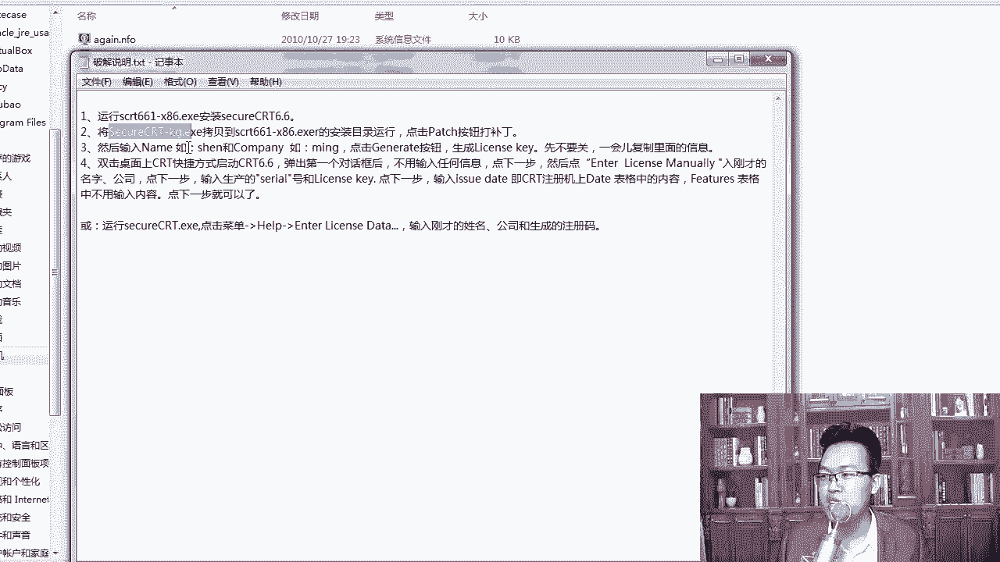

在本节课中，我们将学习如何使用Xmanager这一远程连接工具来高效、安全地管理Linux服务器。我们将涵盖工具的安装、基本配置、文件传输以及图形界面的调用等核心功能。

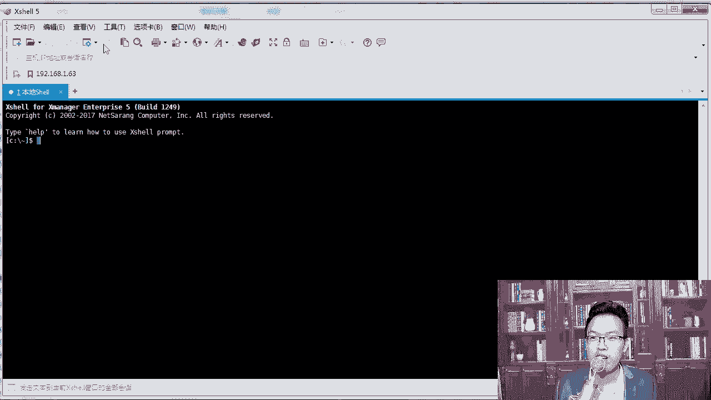

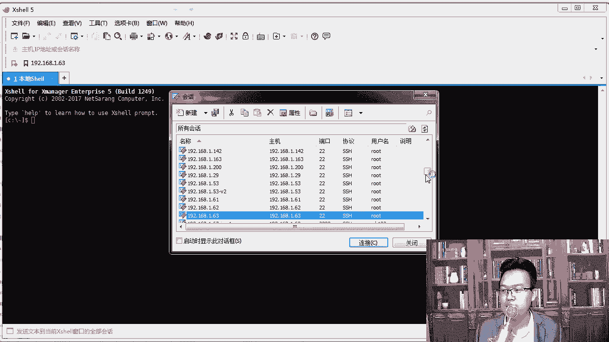

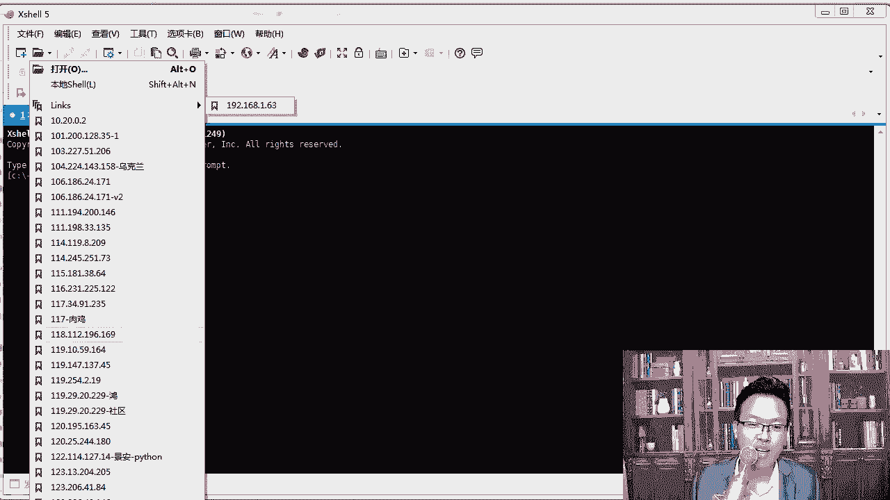

## 概述 📋

远程连接工具是Linux系统管理员日常工作中不可或缺的助手。市面上存在多种工具，但安全性是首要考虑因素。本节课将重点介绍Xmanager企业版，它集成了安全的连接、文件传输和图形界面调用功能，能帮助我们更便捷地管理多台服务器。

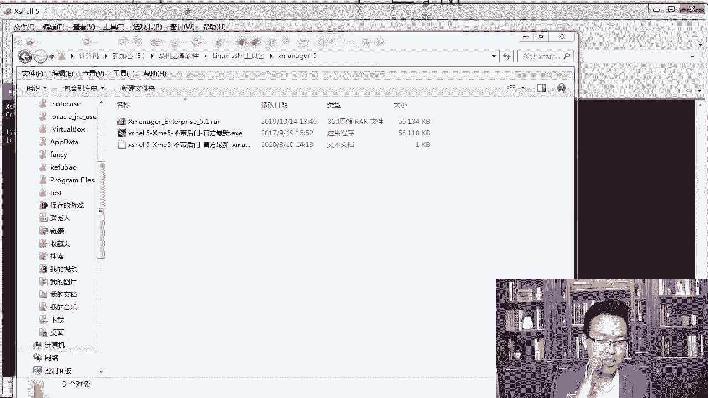

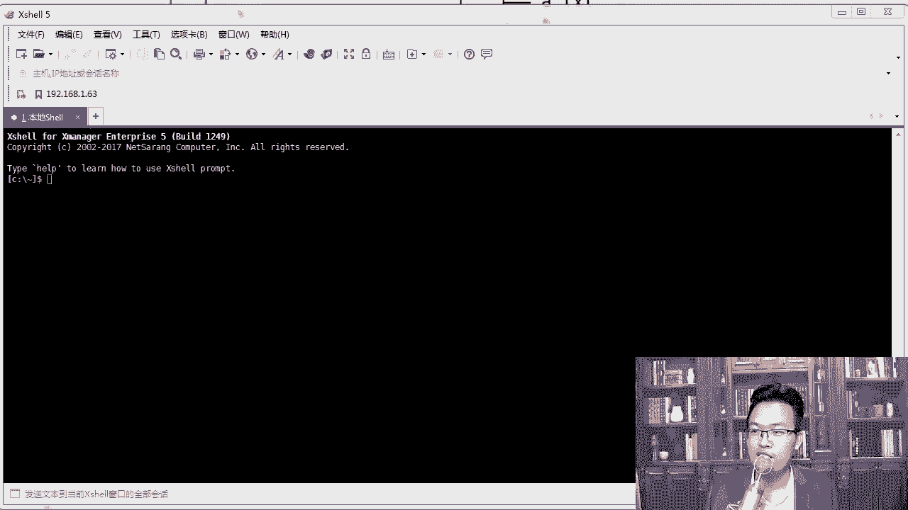

## 工具选择与安全性考量 🔒

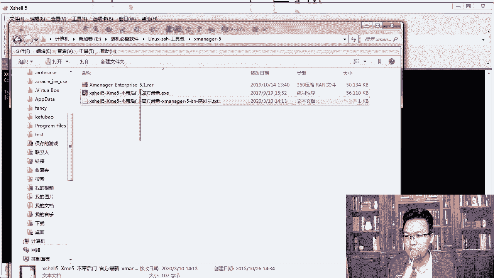

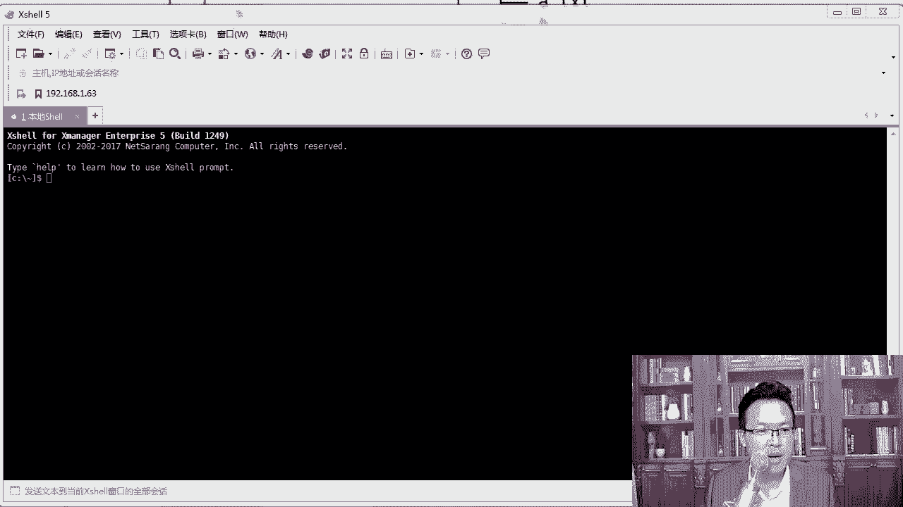

上一节我们介绍了远程连接工具的重要性，本节中我们来看看如何选择安全的工具。许多流行的远程连接工具（如SecureCRT、PuTTY、Xmanager）的某些版本曾被曝出内置后门，存在泄露账号密码的风险。

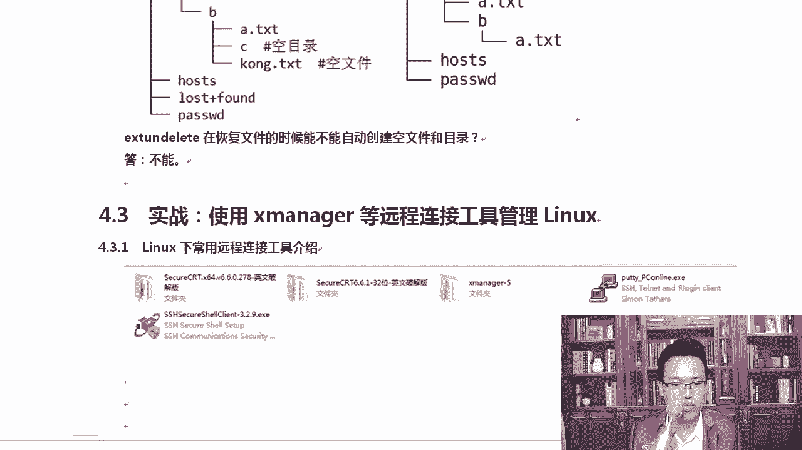

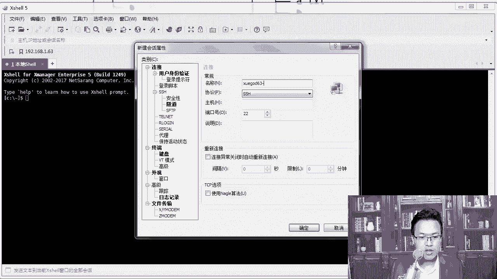

因此，选择工具时应遵循以下原则：
*   **避免使用来源不明的破解版**：破解补丁可能被植入病毒或后门。
*   **优先使用官方正版或已修复安全漏洞的版本**：例如，Xmanager 5在官方修复后门漏洞后的版本相对安全。
*   **推荐使用Xmanager企业版**：它不仅包含安全的SSH连接工具（Xshell），还集成了文件传输（XFTP）和图形界面支持（Xstart）等实用功能。

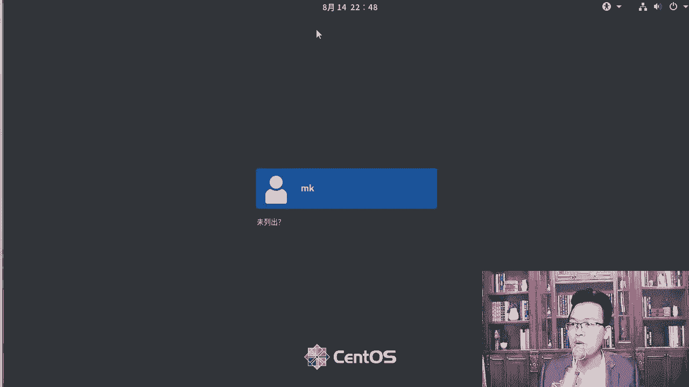

## Xmanager的安装与基本配置 ⚙️

了解了工具选择后，我们开始进行Xmanager的安装与基本配置。安装完成后，桌面会生成一个包含多个程序的文件夹。

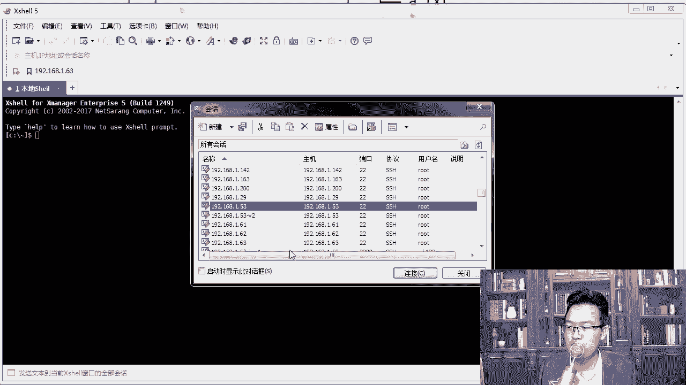

以下是创建SSH连接会话的步骤：
1.  打开Xshell。
2.  点击工具栏的“新建”按钮（或类似图标）。
3.  在“会话”属性窗口中，填写连接信息。
    *   **名称**：为此连接设置一个易于识别的名字，例如 `server-63`。
    *   **协议**：选择 `SSH`。
    *   **主机**：填写Linux服务器的IP地址，例如 `192.168.1.63`。
    *   **端口号**：默认为 `22`。
4.  点击“用户身份验证”。
    *   **方法**：选择 `Password`。
    *   **用户名**：输入Linux登录用户名，如 `root`。
    *   **密码**：输入对应用户的密码。
5.  点击“确定”保存会话。

为了提高使用体验，我们通常需要调整两个设置：
*   **调整字体大小**：在“文件” -> “属性” -> “外观”中，将字体大小调整为18号左右，使文字更清晰。
*   **设置文件传输路径**：在“文件” -> “属性” -> “终端” -> “高级”中，可以设置`ZMODEM`上传/下载的默认本地目录，方便文件管理。

配置完成后，在会话列表中双击保存好的名称即可连接到Linux服务器。首次连接时会提示主机密钥指纹，确认后保存即可。

## 高效管理技巧 🚀

成功连接服务器后，我们可以利用Xmanager的一些高级功能来提升工作效率。

### 1. 文件传输
*   **上传单个文件**：在Xshell终端中，输入命令 `rz`，会弹出窗口让你选择要上传到服务器的本地文件。
*   **下载单个文件**：在Xshell终端中，输入命令 `sz <文件名>`，可以将服务器上的文件下载到之前设置的本地路径。
*   **传输文件夹/批量文件**：点击Xshell工具栏上的“XFTP”按钮，会自动启动XFTP工具并连接到当前服务器。之后，你可以通过简单的拖拽操作，在本地和服务器之间传输整个文件夹或多个文件。

### 2. 批量命令执行
如果你同时打开了多个服务器连接会话，可以使用“发送键输入到所有会话”功能。例如，你想在连接的所有服务器上同时安装Apache，可以在此功能窗口输入命令 `yum install -y httpd` 并回车，该命令会同步发送到所有打开的终端中执行。

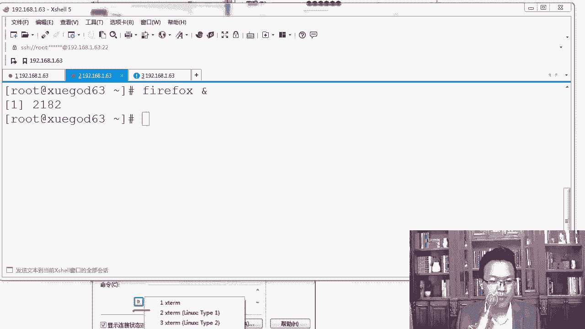


### 3. 调用Linux图形界面
如果Linux服务器安装了图形界面（如GNOME），你可以通过Xshell直接调用图形程序到本地Windows显示。
*   在Xshell终端中，输入图形程序命令，例如启动火狐浏览器：
    ```bash
    firefox &
    ```
*   命令执行后，Linux服务器的Firefox窗口将会在你的Windows桌面上弹出。这对于需要通过图形界面安装软件（如Oracle）或操作图形化工具的场景非常有用。

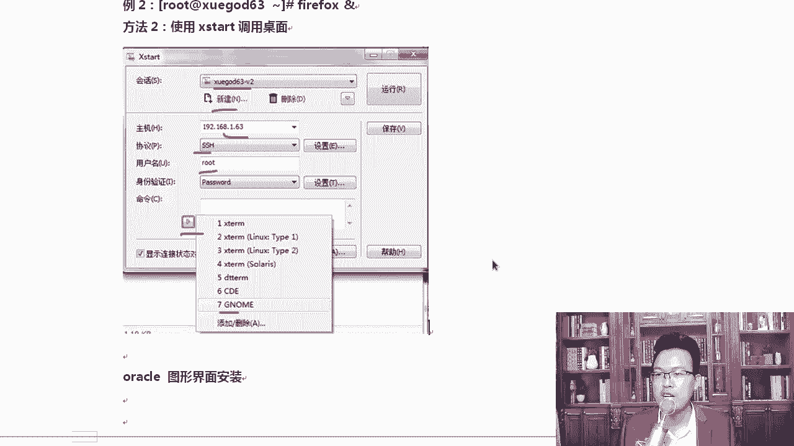

**注意**：此功能需要服务器已安装图形桌面环境，并且Xmanager套件中的Xstart服务正常运行。

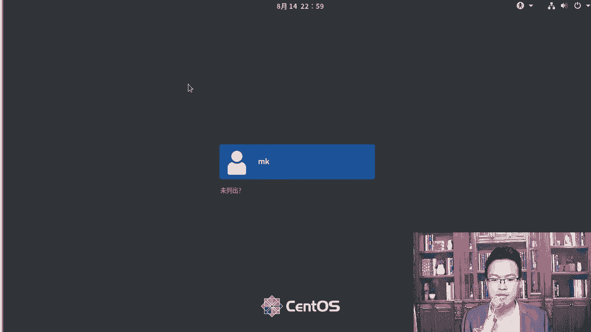

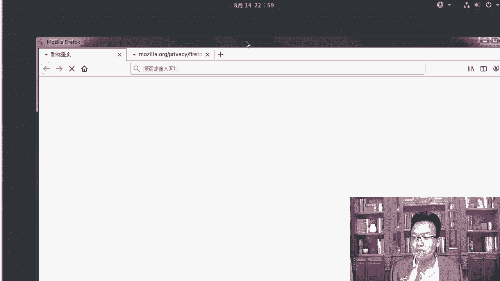

## 总结 📝

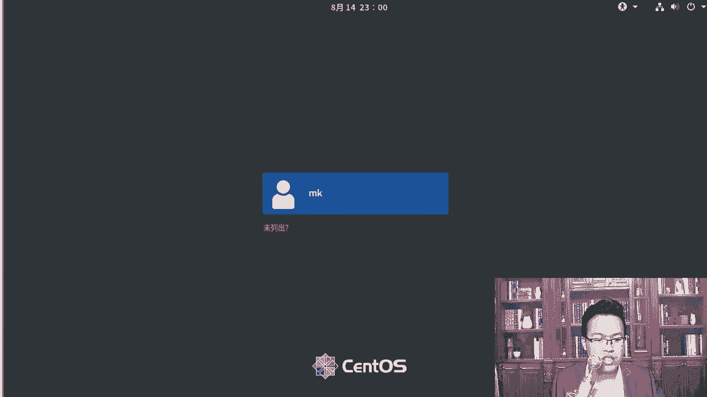

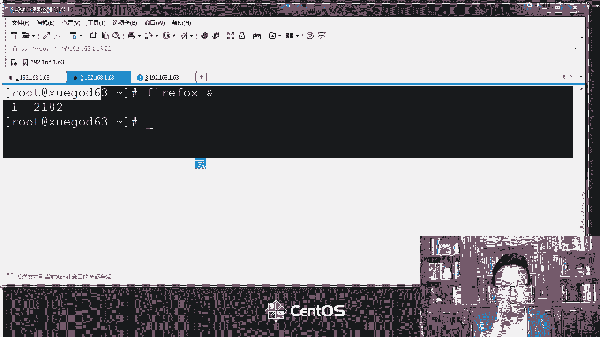

本节课中我们一起学习了如何使用Xmanager工具远程管理Linux服务器。我们首先强调了选择安全工具的重要性，然后逐步讲解了Xmanager的会话配置、字体优化和传输路径设置。接着，我们掌握了通过`rz`/`sz`命令和XFTP工具进行文件传输的方法，以及利用“发送到所有会话”功能进行批量操作的技巧。最后，我们学习了如何从终端调用Linux服务器的图形界面程序到本地显示，极大扩展了远程管理的灵活性。

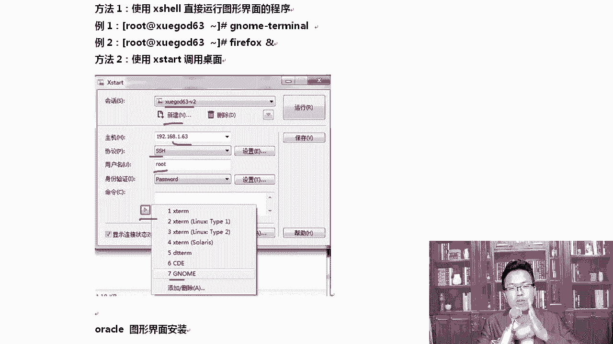

熟练掌握Xmanager的这些功能，将帮助你更安全、更高效地完成日常的Linux运维工作。