# Linux网络运维架构／RHCE红帽认证／云计算／第3章-文件系统的管理方法和xfs文件系统备份恢复 - P3：3.3-查看文件 - 乔治学院 - BV1ra4y1L7Bq

接下来我们一起看一下查看文件命令，这个查看文件命令还是很简单的，但是也非常常用。比如说我们刚才已经用过的cat cat，它的语法很简单，就是后面跟上文件的名字就可以了。它的作用就是一次性查看所有的内容。

所以如果你的文件很大的话，那你就不用使用cat了。

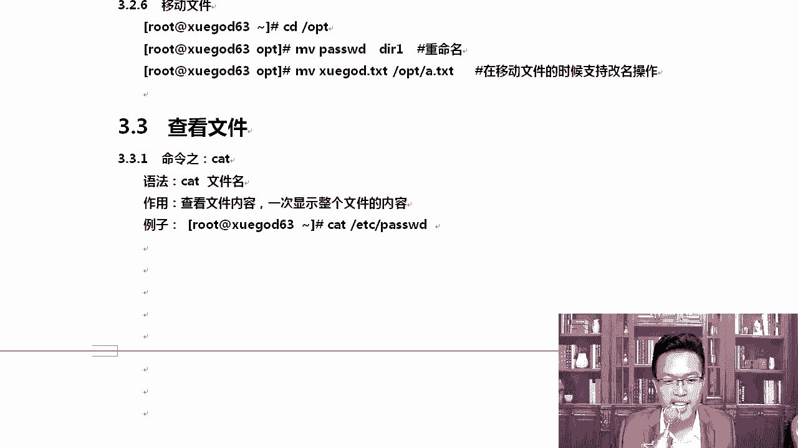

比如说cat ETC password。你告诉我，你看清了什么，啥也没看清。😡，对吧尤其是前几行的内容，你没有看清。所以我们希望能有一一瓶一瓶的翻。那谁可以一瓶一瓶的翻呢？

moremore和 less都可以。我们来看一下两者之间的区别。😊。

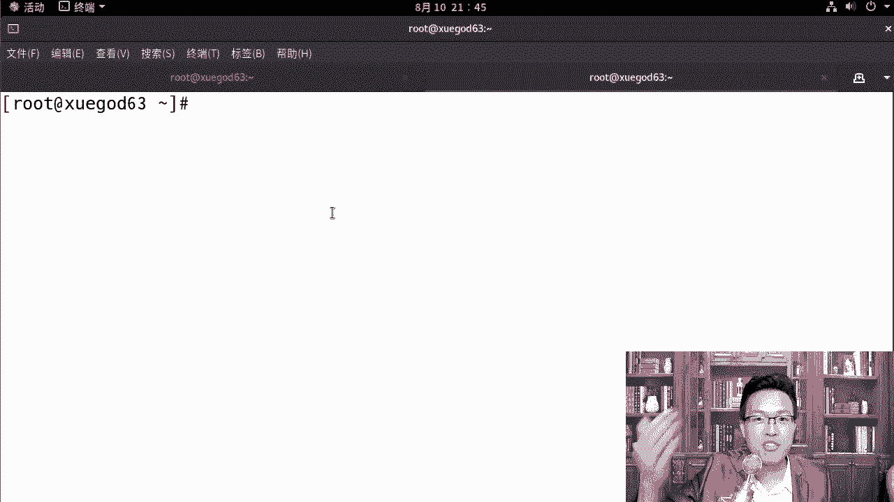

来。more more更多嘛，那么以分页的形式去显示内容，它的语法是more后面直接跟上文件的名字就可以了。按下回车是。翻译行，然后呢按下空格是翻译平，那输入Q以后就直接退出了。lesss的话是什么？

同样也是语法都一样。lesss后面跟文件那哥俩有什么区别呢？啊，区别是more是不支持后退的，你只能往前翻，只能往前翻啊，lesss是怎么样，是可以上下翻的。

你可以按配置 down page up给它上下去翻，它支持前后翻位， page up是向上。配置当是向下，而空格的话是向下，enter的话是一行。那有同学有 less more是不是就不用了？

不过通常情况下，我们用帽好像更多一些啊，不知道大家的习惯是怎么样，你们是怎么样，我一般用帽会更多一些啊。

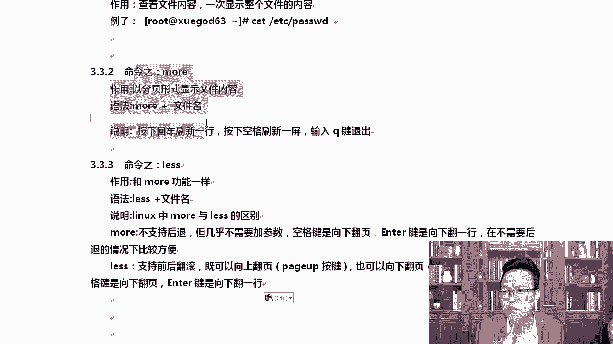

因为一般情况下，我们也不需要怎么样来回的翻。比如说我们。Cat。对吧我们看ETC下的呃password加个管道服务，然后跟上帽。就这样。看第一瓶哦，第一瓶有没有我需要的东西，没有没有摁下空格。

再来一瓶啊，这边还没有再来一瓶退出了。那如果你你看到一半的时候想退出，比如说我看到这个时候想退出摁下Q，它就直接退出了。😡，啊，它就可以直接推出来less的话，它就会上下去，它是可以上下去翻的啊。

那我们来自己简单的看一下E less ETC password那回一下车回完车以后呢，向下向下。😊，对吧即便你到最后他也不会退出的，而且你可以。往上翻或者说摁光标键或者摁回车键都可以上下翻，感受一下它。

摁下Q退出。

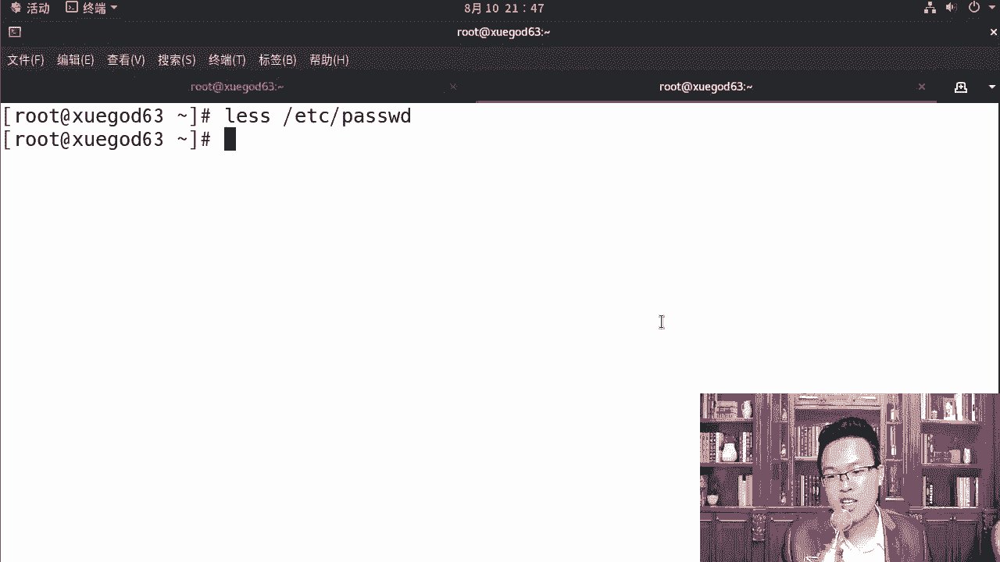

啊，less还有功能就是我可以查找啊，我觉得这个也挺好的。比如说我们在这里写上root。😊，你可以去查找斜杠斜杠后面跟上你要跟的内容。比如说我跟上并，那它可以去查找，查找到，还可以高量显示。显然。

lessice的命令会更强大一些。对吧你们用less多一点还是用more多一点？同老说，我从来没有用过，没用过的话，没关系，两个都用一下。😡，就是平常工作中，大家你们一般用的。两个命令哪个多一些？

如果我不需要上下翻的话，其实我还是用帽多一点。啊，有同说我用ca多一点。当然你可以用VIM啊，直接打开。😊，啊，mark和 less通常情况下是干嘛使的呢？就是这样的，就是我们。😊。

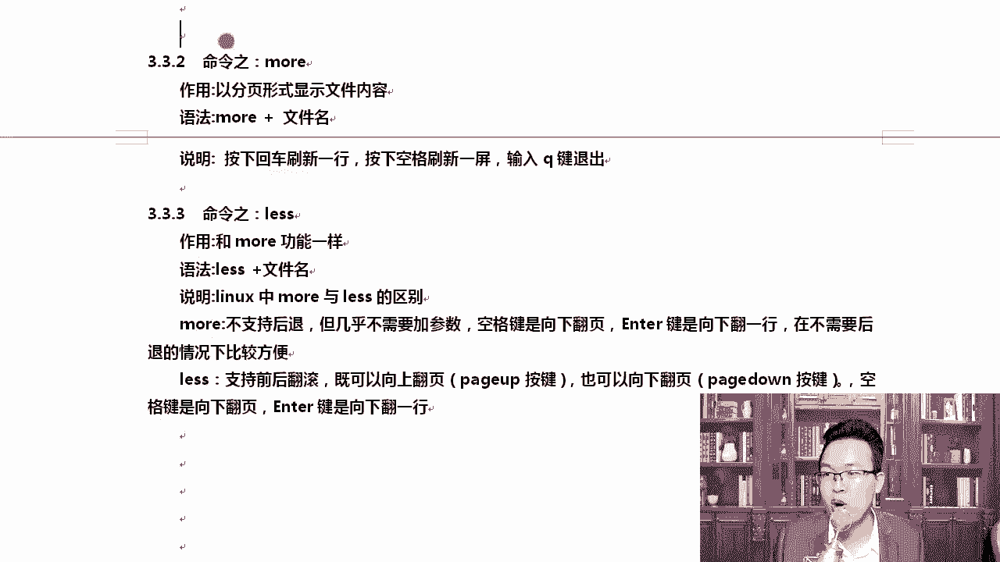

我们去看一些日志啊，或者说看一些对外输出的内容。会比较多一些，就是通常的情况，你看这样一幅 configurefi。回车一下子输出了好多。那有同学刚才对，有同学刚才说老师我用VM比较多一些。😡。

那是看真正的文件。如果我们想看这个呢，这一下子就输出出去了。那这个时候怎么办呢？if configurefi后面跟上more，显然这样是合理的。😊，哦，我看一下，这样的话，我就不用一下子看那么多了。哦。

看一下这个情况，再看这个情况，包括我刚才看到的什么cat PROC下CPU infer加个管道，管道的意思是什么？这一杠叫做管道服，管道服的是吧，本来你应该怎么样将信息输出到公屏上的，管道是把内容是吧。

扔到管道里，从另一个地方输出来，什么意思？画一张这张图让大家看一下啊。

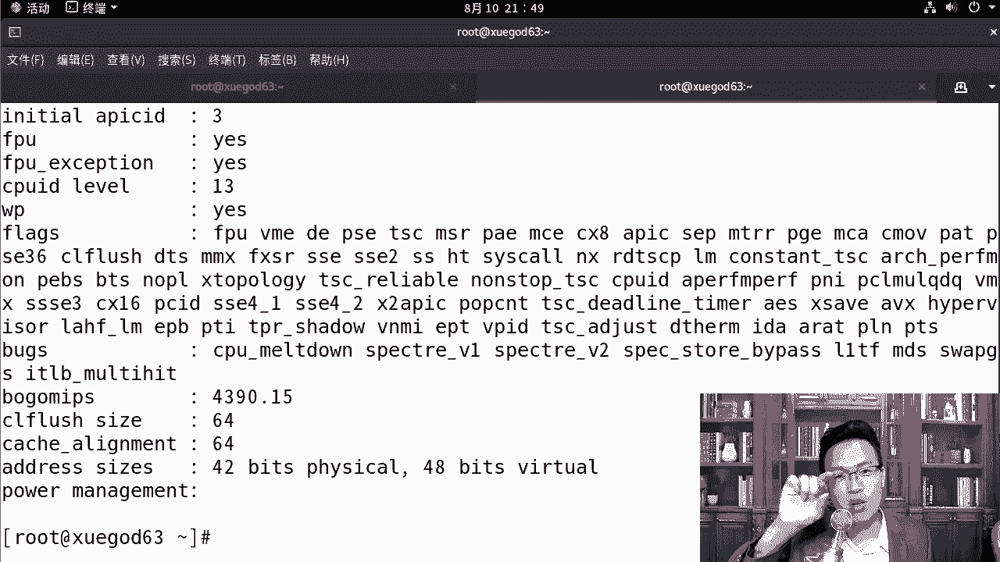

所有的管道就是这样的。然，我们来拿到它，然后呢里边输入点东西。在这里也。那，比如说我们去执行if configurefi这个命令，对吧？那它会显示很多的数据到屏幕上。那现在呢那些屏幕的那显示的信息。

网卡信息不显示啊，通过管道。这里进来输给谁呢？对，输给我们的冒命令，他作为冒命令的什么输入。前面命令的输出作为后面命令的输入，这就是管道，管道是怎么写的？就是。这个符号同时我也不知道这是什么符号。

你知道我这是这是怎么敲出来的？😡，摁呃，在你的回车键回车键上面有啊，它通常情况下跟我们这个反斜杠。😊，好，反向杠是在一起的。

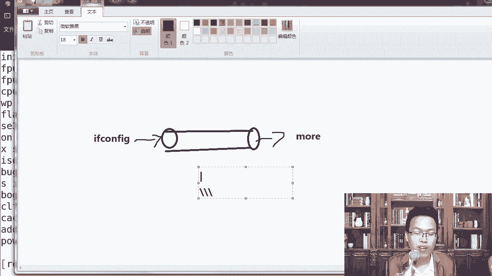

shift加那个回车键上面这个符号。所以说为什么我说more用的会更多一些？因为这种情况下，我们经常会用more到很少用lesss啊，因为就看一次就够了。😊，你看这样的话，我去看每1个CPU的状态。

或者看每个网卡的信息。他确实会方便一下。对我会这样去实现用这个方法。如果真正的大家说有同时老我说我真能看个文件，那你直接VM，尤其是那插起来更方便一些啊。😡。

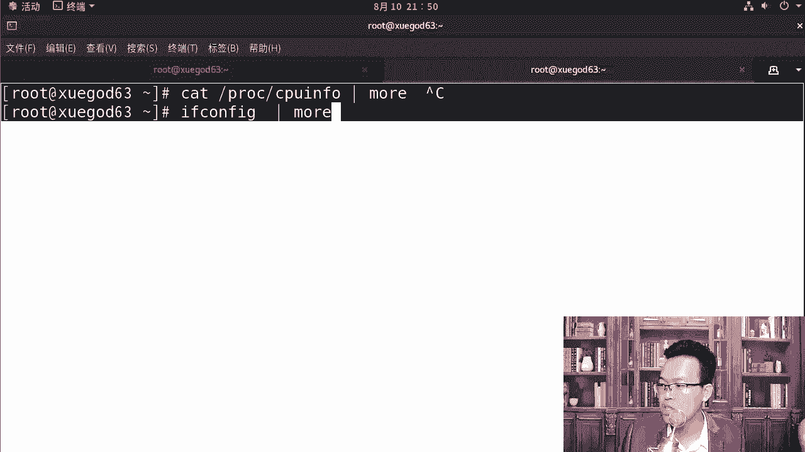

在这里来个小小的例子，行不行？

好，另外我跟大家说一下啊，你的鼠标选中它。😮。

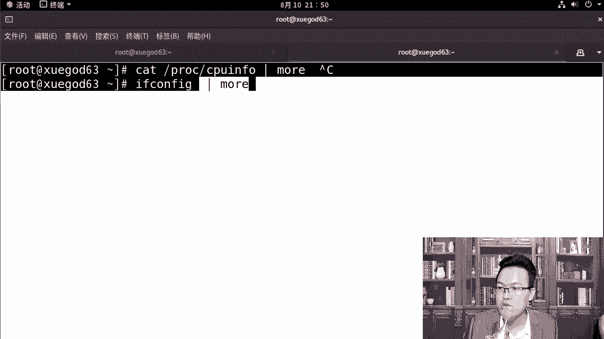

选完以后，直接在这里摁下ctrl V就这样了。选中就代表的是。对，复制成功了。好，在这里直接摁下cttrol V，在你的物理机上直接摁下ctrol V就可以直接粘上去了啊，这样挺好用的。😊，好。😔。

还有一个命令是hi啊。haide的话是用来显示文件的开头内容。默认情况下，hat只显示前十行。我们来看一下这个hat马上就结束了啊这。

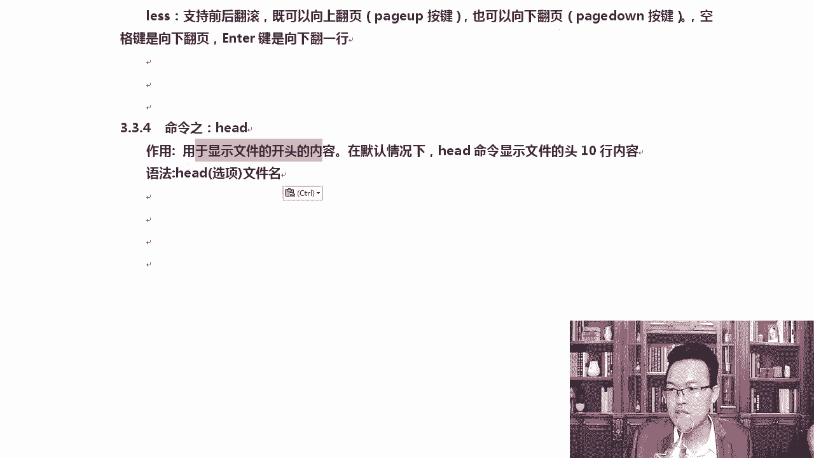

还有一个headide，还有一个te两个很简单的命令。headide ETC passwordword。那默认只显示前十行，有同说是十行吗？是不是？你自己去数一数这些印象最深的。好吧。

所以搞技术这个东西，大家我告诉你的。😡，中实浅的，只有你自己尝过了，才知道什么，才知道那个味儿是爽的。😡，是这意思吗？对吧就像我跟啊就像刚才我们说的那样是吧，搞对象多好，找个媳妇多好是吧？😊。

我说再多都没用，只有你自己找过了才知道啊。😊，开个玩笑啊，前面五行下面五行。

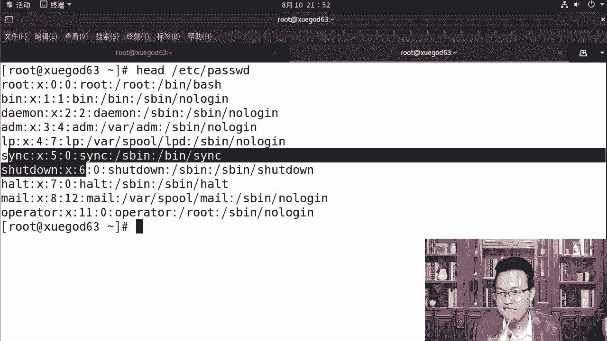

啊，当然女同学学lininux课程也没有问题啊。

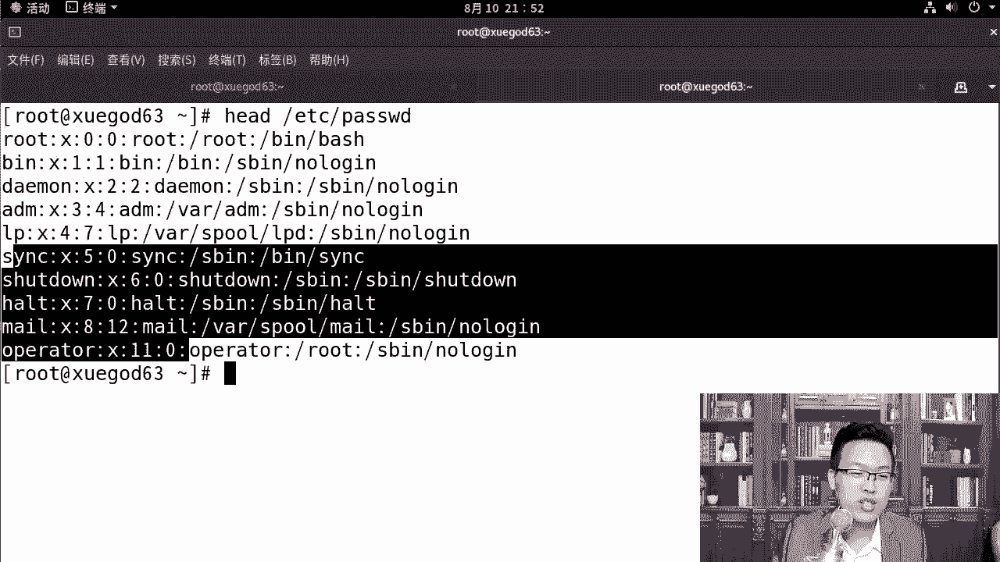

真的很吃香啊。如果你们公司有个女运维。三个男运维加一个女运维。出了锅是吧，那个女佣为也不会怎么背的啊，大家会照顾会会照顾一下的，是不是？😡，而通常情况下，那个公司的运维人员，如果越是越是这种大的公司。

他要他会给你配一些女同志。

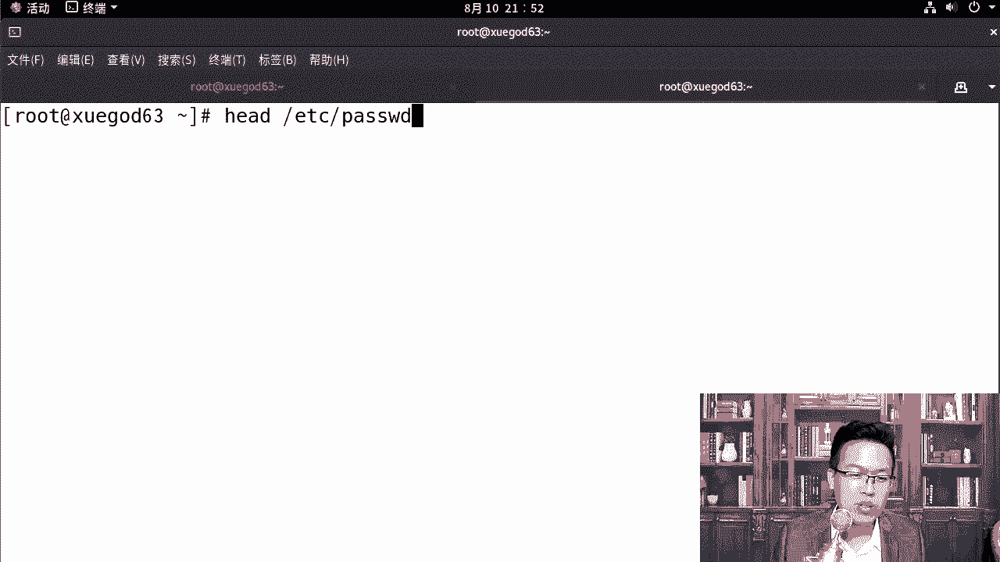

男女干活不累吗？对，人事会特意，比如说招了三个运维都是难的。第四个肯定要给你招一个女的。否则四个男子在一起干架了是吧？

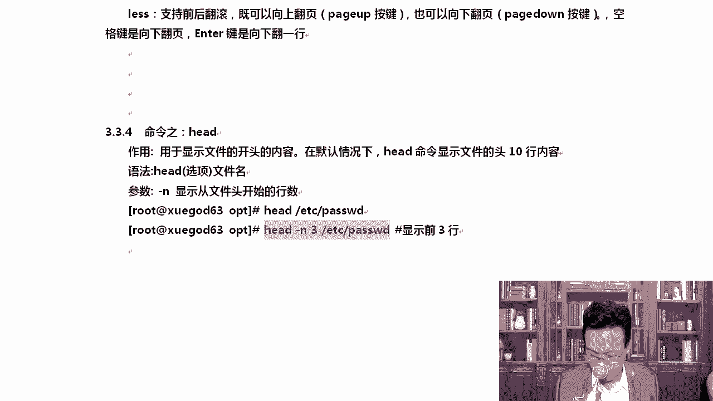

head杠N3ETC password这样的话可以只显示前三行啊，你想只显示第一行。比如说我只想看前三行，那就这样。

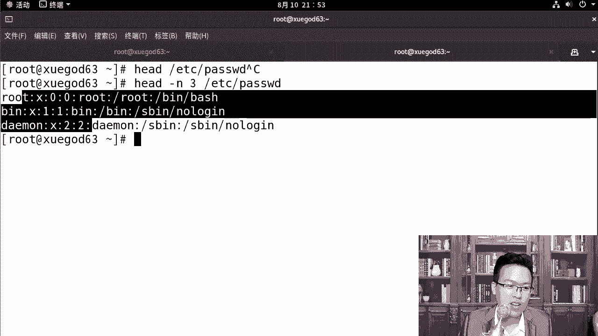

就可以了。而且咱们班通常情况下有好多就每一个班啊，假如一个班里面总会有三四个是女女同学。而且他们找工作的时候，说真的不比你们男同学找的待遇差，薪资都一样的，就是运维这个行业还是。没有什么那种。

什么重男轻女这一说的啊，在开发这个领域。是会的啊，因为开发经常是要熬夜，女童。女同学可能熬不过男同学是吧？在体力这块啊，运维还好，运维如果上项目了，那你就加加班。一旦一旦这个平台已经稳定运行了。

那你的工作量是比较轻松的。你还有大把的时间去研究研究这个新的技术。因为平台没什么问题是吧？又不又不上新的项目，所以你是可以有机会研究一些新的技术的。而开发这个地方功能没有完没有完的那一天。

就包括QQ微信，是不是现在还每是吧？不能说每个月至少每半年有一个大的版本升级吧。😊，所以没有完啊，开发这一块刚的话是显示啊t这个命令t命令用来显示文件的尾部内容，默认的话显示最后十行正好给它对着干是吧？

N的话是你指定一下，只显示最后的几行F的话是动态显示数据。

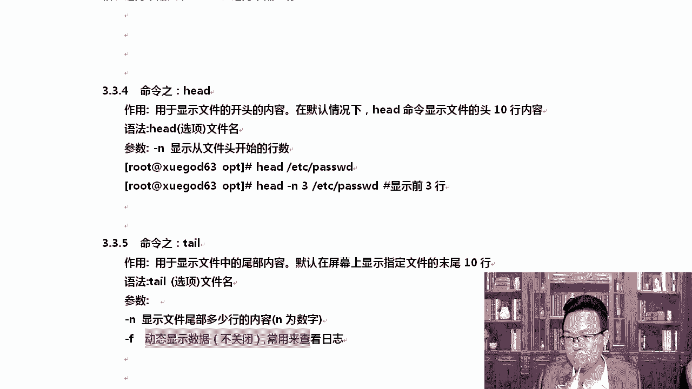

常用来看日志，这个很重要啊，这两个参数。tail杠N3ETC看谁能看日志吧。word下的log下，这些记住啊，secrearyecary是我们的日志。那你可以看一下，这是看最后三行，有同学这是好几行的。

是三行吗？是啊，这是一行这是一行，这是一行。😊，好。tailll默认是指看十行，无尔下的。当然你也可以这样去敲啊，你要觉得敲麻烦，你就这样感叹号到了上个命令的最后一行。回车回完车以后，有同学你看这么多。

我看不清啊那。😊。

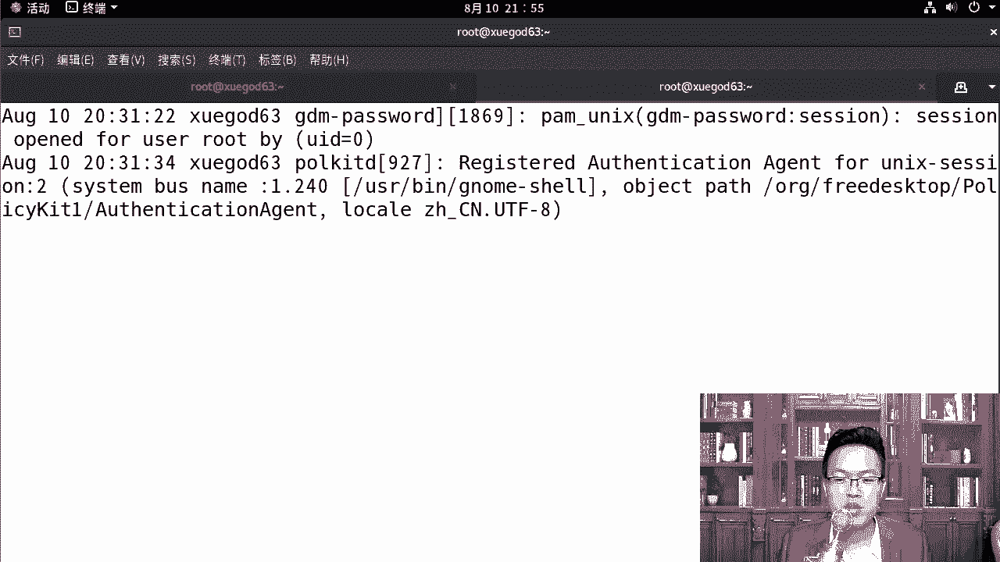

在你可以在这个时候再按点回车，拉出来一些空行。拉完这些空行以后呢，我们再找另一个终端。那，比如说我们SSH以如的身份去登录，你也可以其他身份登录啊。😊。

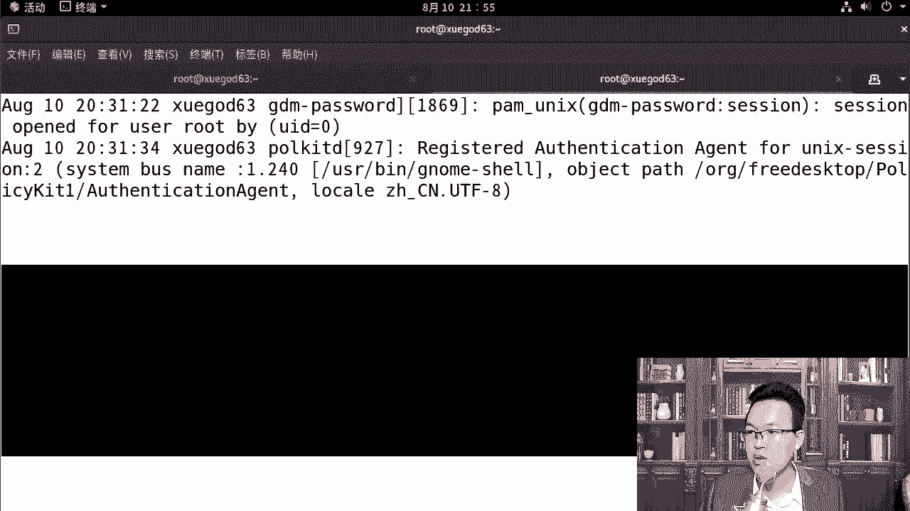

1921681。657啊，1。63，我自己登一下自己啊。😊。

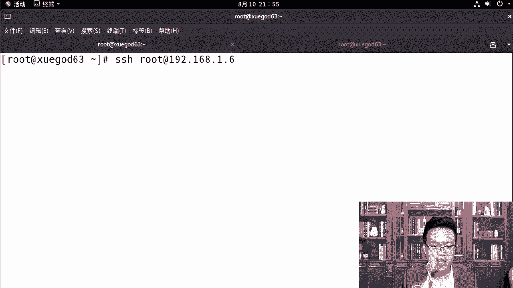

好，回车回来之下没有输密码，现在还没有什么日志是吧？当我们输入一下，这个要输入一下yes啊，他说啊有数，你确定要继续连接吗？😊。

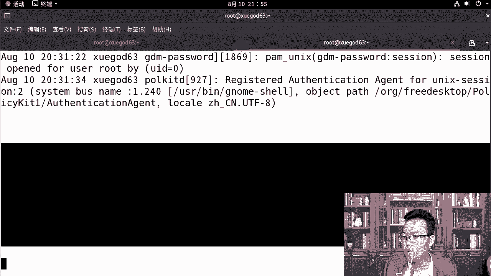

这里会产生一个K。finingerprint指纹。那这个指纹我是的，没有问题。我确定我要连接的是1。63，它会给你把这个1。63的指纹存起，有什么好处呢？万一你把你的IP地址当成了就改成了1。63。

让我去连一下。那他会给你个警告说，哎，这个指纹是不匹配的。😡，123456回撤。那这样我就连上去了，连上去以后，你看这上面写的很清楚access接收了password谁呢？root账号从哪儿从1。

63这台机箱登录登录的时候用的是这个端号连到我SSH啊，session open打开了好。哎，怎么退出呢？这个退不出不了了。Control C。好不好，你摁什么都不管用，ctrl C直接干掉它就行了。

😊，我来给你整理一下，挺重要的。后期我们排查的时候经常会这样，这边先监测动态，看上我们的日志，动态监测上，然后呢然后去执行一个命令。

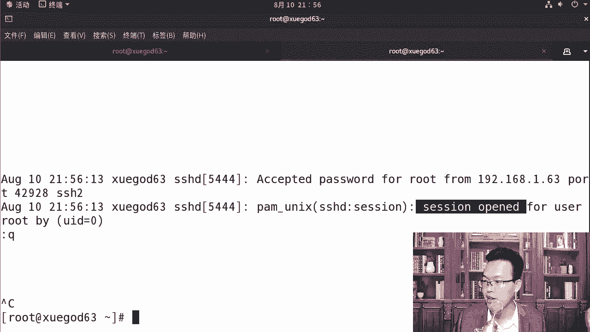

执行完了以后我去看，这是文件的查看，我们稍后见。

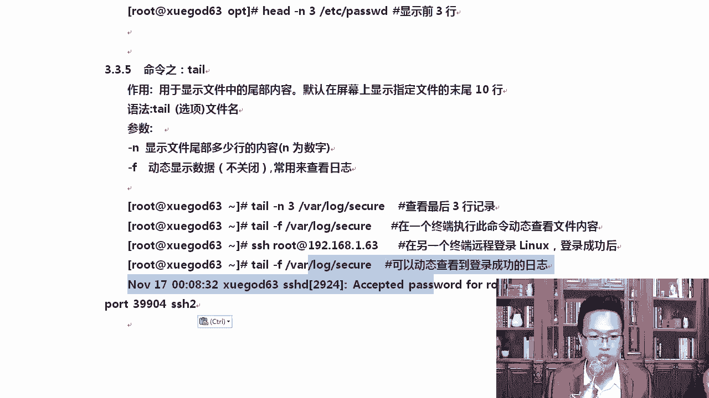