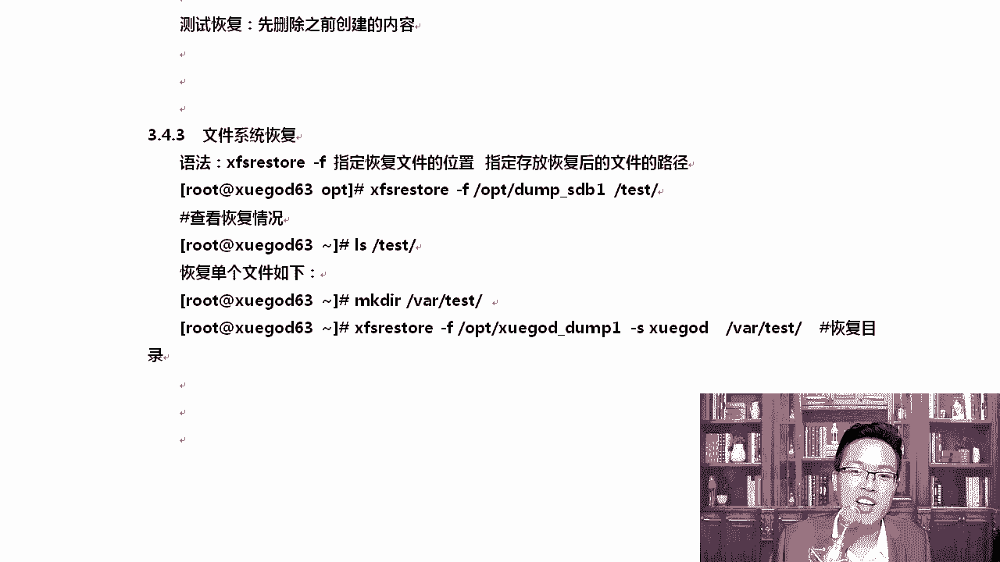
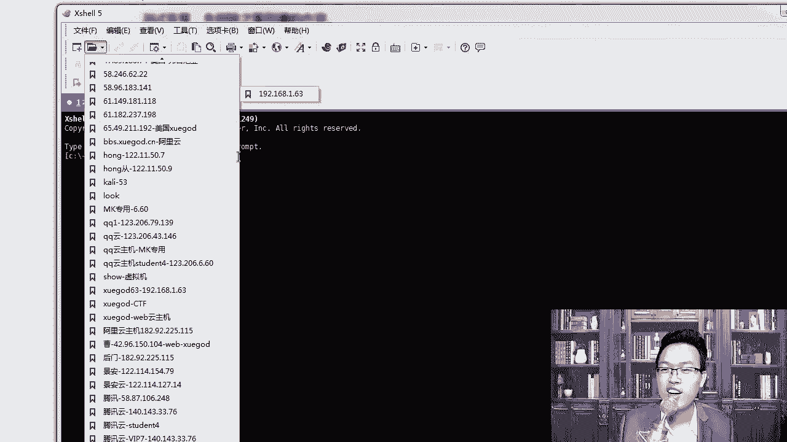
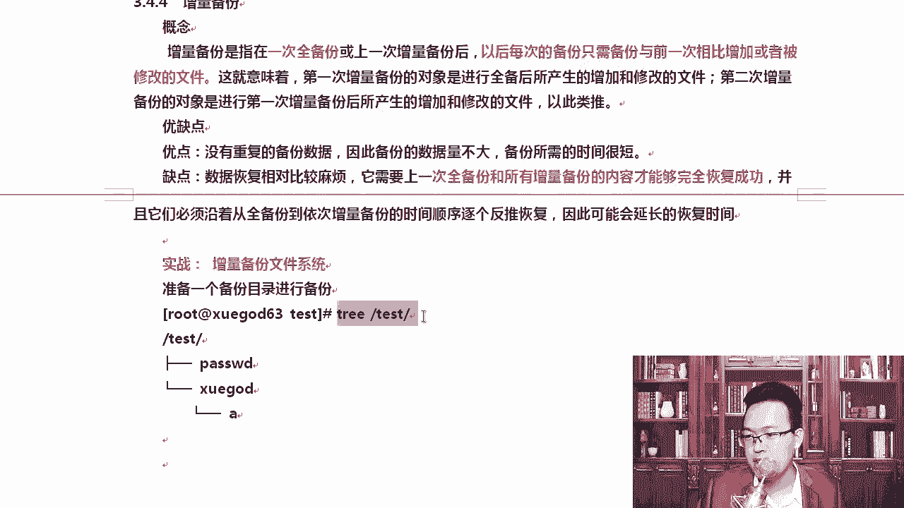
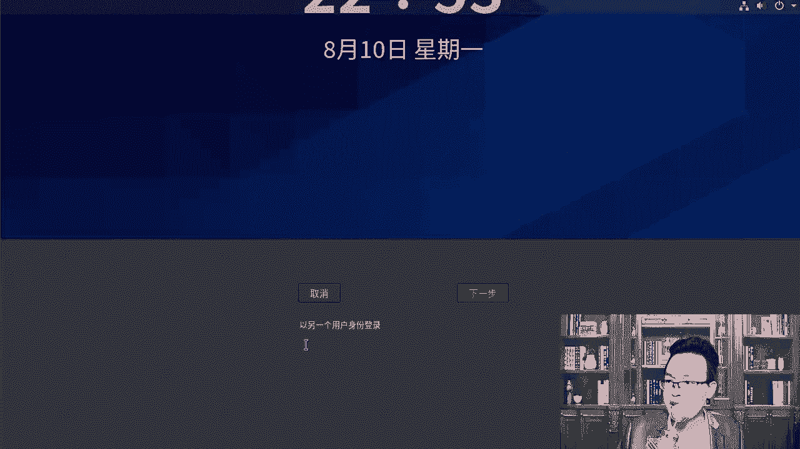
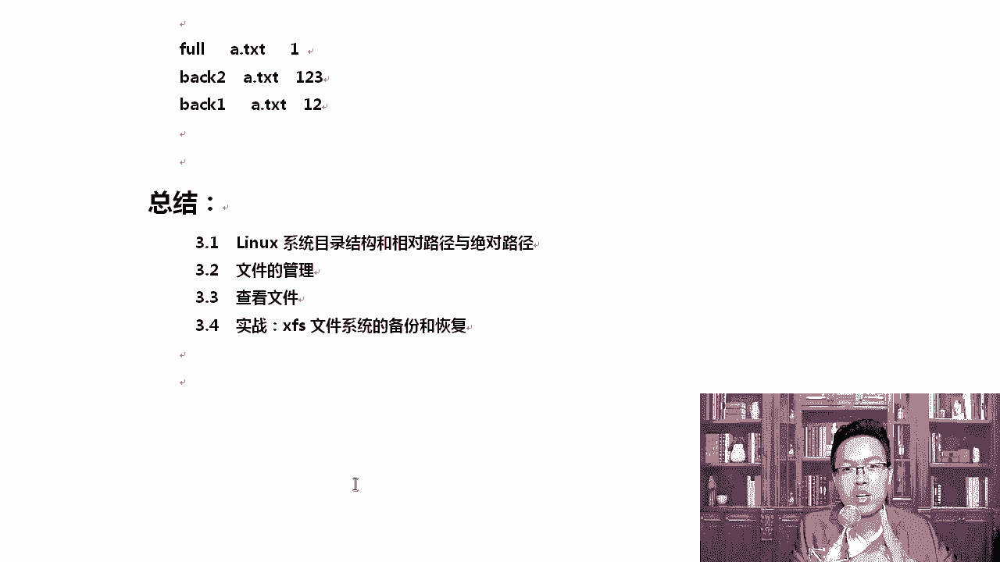

# Linux网络运维架构／RHCE红帽认证／云计算／第3章-文件系统的管理方法和xfs文件系统备份恢复 - P5：3.5-实战-xfs文件系统的备份和恢复-2 - 乔治学院 - BV1ra4y1L7Bq

我们等了一会儿，它启动成功了，启动成功。我们进到这里面我们来做第一件事情就是格式化，格式化用的是FD命令DV下SDB这些命令后期我倒是会给大家详细再讲啊。那大家可以按一下table啊。

数到SD以后按下table，你可以看到SDA是第一块磁盘。😊，新加的磁盘叫做SDB，你一定要加scar这种类型啊，NVME那种类型不是叫SDB啊。哦，我们这回车，回完车以后。😊。

如果你是以中文方式安装的这个lininux系统，那就非常好使了。先因为从生屠S8开始，连提示符都给你按中文搞了。看到了吗？更改将停留在内存，直到你将更改写入到磁盘啊，输入M获取帮助。输入M。

你就获取帮助，所有东西都是以中文方式跟你显示，你没有理由学不好lininux啊。对不啊？这就是所以大家不用担心linux啊，就是你就是英文界面也好说啊，常记这些就行了。

比如说我们输入PP的话是打印分居表，然后呢你想。😊，搞一个新的分区表，你就是属于N，就是添加新的分区表就可以了。那么最后呢，W就是保存了，然后。在这里啊，W是将分区表写入磁盘并保存。Q的话是不保存。

那我们先输入P查看一下我们当前的啊，我们去看一下啊。SDB输入了P以后，没有什么新的分区表。啊，没有新的分区表，那我们就需要创建一个新的分区。输入NN的话是创建P的话是主分区。E的话是扩展分区。

我们输入一下P创建一个主分区，主分区最多只能有4个MB2主分区最多只能有4个啊，只是规定。所以分级号从一开始去写默认一就行了。好不好？对，直接回车啊，默认就可以了啊。😊，好。直接回撤。

一会我给大家整理一下这个笔记啊。好，这边第一个山区的话默认从这里开始可以吗？可以直接回车，然后默认大小是多少？哎有。啊，默认大小的话，这个地方啊默认大小这块你是可以写数字的。好吧，大家可以写多少呢？

写一个G。你可以写一个D，也可以写多个几啊。😊，哎，我刚才窗口那挡了一下是吧，默认大小这个地方可以。😊，写一个G，它可以写一个G。如果你直接回车的话，你看默认大小是给你20个G，就是用所有的。听楚了吧。

我可以输入Q不保存退出，重新再来一次啊。ok。直这一次直接输入新分区P，然后呢默默认默认一。加一个G啊，可能挡了一下，加一个G，然后呢，W保存退出就行了。OK看一下。我在这里写了加一个G。

加完一个G以后，输入WQ保存退出，这样的话我就成功了。那所有的安装步骤我也会以文档的方式怎么样。写给大家啊，大家在看的时候说吧你就照着这个步骤一步步来就行。好，该回车的地方回车，该执行大小的时候。

你指定一下大小，你也可以输入P，看一下你新创建的这个分区。创建完了以后呢，我们可以看一下。DV像SDB芯，那这样就会多出来SDBE样。有了它以后，新的分区分完以后。

你得格式化这些命令呢大家可能第一次接触，你知道一下啊，你得格式成叉FS。你不能老说我格式化成EST4吧，不行，因为咱们这个是增量备份，是叉FS的一个新特性，不是所有的文件系统，它都支持增量备份的啊。😊。

OK这是人家系统里面自带的，就是操作文件系统类型，这种文件系统类型自带的啊。😊，DV像SDB。格式化啊，这就是格式化。格式化完了以后呢，你得用它MK以挂载一下，我们在根下创建个test。😊。

新的分区是要用一下。mount挂在这样的话，就把前面那些命令顺带着什么？通过这个小小的项目案例。带着大家把前面的命令串一下。好吧，CD的。😊，我稍后我要对这个新的分区是吧，进行备份啊。

CD到ETC下的test那什么都没有，那能行吗？所以正好把前面。关于文件管理的这些命令，咱都给他串一下，这是复制复制完了以后创建。在当前目录下，咱们创建一个叫学尬的，你可以这样去写。

也可以MKDR直接写学尬的。😊，这两个是一样的啊，默认就是在当前目录下。套s咱们在学挂的下面。OK创建一个A好吧，创建一个A。那接下来我们吹一下，看一下咱们那个状况。t的时候，这个时候看一下。

我们在这里面有password，还有一个目录，学gar的学gar的下面还有一个A，这就是我们的测试数据。有了这个测试数据，我们就可以进行备份了。好，我们来备份备份的时候，我我因为我们是增量备份。

大家知道吗？增量备份，所以所以你先得第一次增量备份，第一次是需要完全备份的啊，需要完全备份。你需要备份整个分区这个功能就像虚拟机的快照一样。服务器备黑了以后，你可以通过这种方式快速的进行恢复。😊。

听楚了吧？就像我们在这里啪给你拍一个快照，那增氧备份是快还是慢呢？😊，想想这个事儿。我要对整个地方做一下备份，备份完后以后，将数据存放到某一个问啊某一个路径上。OK备份的路径不能写成什么？

比如说我我要你看备份的路径，这里不能写成什么？😡，你可以试DV向SDBE或者是这个。也就是说我们的目录后面不能用什么。因为DV项的SDBE就是根下的test。因为我们把SDBE挂到了这下面，一句话。

这下面不能有这个。😊，跟好吧，你的写法是这样写的，你不能有这个啊语法是什么呢？它的语法就是这样的，叉FSdt杠F根式。好，备份。完备份完后数据存放的位置，我写的是大白话啊，这样的话。省着我写目标地址。

原地址你分不清。好，F后面就是我们备份完了以后，数数据要存放到哪个地方，这里写上要备份的路径好，清楚了吧？😊，对，有些老师会喜欢写成这里是比如说。原啊这是原，这是目的。

可能有一些同学就理解起来有点费事了是吧？所以我给你写的很清楚，数据要存哪儿F后面写上你要备份哪个地方，写到这后面。😊，那对应如果是对应我们这个来说是吧，我们要写的时候就这样写。叉FS杠F。

我希望备份完以后的数据放到哪儿呢？咱们希望放到这儿。放到OPT下叫做dump SDDE，然后呢，要备份谁要对DV下SDBE备份，这样就起火了。来复制粘贴一下。用卸载吗？不用卸载啊，我就在test下面。

不用卸载哦，备份完了以后呢，它会说please请输入一个label标签。this dump session就是当时当前绘画的时候。😊，你你写一个什么写一个标签，指定备份绘画的一个标签。

这个标签可以随便写吗？可以随便写，就是写明你这次备份要备份的是什么东西啊。我这一次我写dapSDBE我要对SDBE进行备份。😊，就这个意思写清楚就行。然后呢。

please enter请输入一个label，又是一个标签是吧？这个标签说media in driver0，就是其实这个地方是说媒介。😊，你这次是对谁进行备份的？我写SDB那有同学老师我就写成是吧。

我就随便写一下可以吗？可以，这只是一段描述而已。后期因为我们备份的次数比较多的时候，我怎么知道你这一次备份的是。😡，是哪些数据呀？所以我们要给它写一个备注，好吧？后期我们通过这个lave标签。

我们大概知道我这一次备份的是谁啊，我这一次备份的是SDBE这个地方是可以随便写的啊。😊，好，完事以后呢，那这样的话就备份成功了。来，我把备份的这个流程给大家写到这。这些绘画的。就是方便你后续去找的。

在这里啊，dump指定备份的绘画标签可以随便写，你就写一段描述。这一次我要对什么什么进行备份，就这个意思。然后media这个地方也是个label标签，指定设备的标签啊。

就是要对哪个设备做啊做备份做一个描述。😊，啊，你可以写成这是我们的web数据。SDBE是我的一个外部数据，或者说我这是对外网站的啊所有的磁盘做一个备份，可以写很长的一段描述啊。

你也可以单纯就写SDBE就行。好，拿到这些东西以后呢，我们来看一下。DF杠T回车。好不好？回车回上车以后呢，大家要TDDF是查看文件的类型呃，分区分区。第F是查看每个分区T的话是查看每个分区的。

文件系统类型。那大家可以看到SDAE是叉FSSDA3也是叉FS也就是我的不特分区是叉FS的。好不好，我的不的分区也是可以怎么样？如果你的不的分区怎么样？是不是的话，那不行啊。😡，大家知道吗？

因为有一些同学在分区的时候没有注意这个事情，就是。SD3。它上面写的什么？不比如说SDE吧啊，SDE是第一个不特分区SDE它写的是EST4。我看我这里。我的博务的分区哦，我的博特分区它叫SDA3啊。

没关系。啊，每个人分区的先后顺序是吧，分的先后顺序有点不一样。微博的分区是SD3是吧，我叫。好，没关系啊。那有的同学可能叫SDE，这也是可以的。好吧，另外这个原地址这个地方可以写SDBE。

你也可以写写什么，写test清楚了吧。但是如果写test的话，请test后面不能有根，不能有这些杠啊，也不知道根不能有这个杠，有这个杠就得报错啊，我在这里写的很清楚啊，都可以啊。😊，好。

那我们来支如果你的文件系统类型是ERT4啊，因为我们的不的分区在。呃，第一次安装系统的时候默认是ET4。如果是这个，那你是无法进行备份的啊。好，我们知道这个以后呢，我们来写点有意思的。

就是指定备份的时候是吧，免交互，这样方便做定时备份。你就不怕你的数据是吧？出问题了。😡，好吧好。那我们来试一下啊，我们要做一些定时备份。比如说我们对SDVE做一些定时备份。昌南凡丝挡篷。

叉FS啊叉FSdump杠F我要备份到哪指定一下，我要备份到OPD下。比如说我们叫dump谁呢？叫SDBE下划线V2好，V2啊，我要对谁进行备份，我要对SDBE进行备份。好。

然后你不是有那个label标签吗？绘画的标签，你就写杠L，那叫dump下划线SDBE下划线V2，这是我的绘画啊。第二次备份啊，然后呢，杠MM指的是media好吧，你要对哪个设备嗯，做备备份。

我写SDBE可以吧，可以，然后呢，你也可以描述一下。比如说SDBE是B大数据是个很大的一个磁盘。好，这样回车就行了。这样瞬间就可以成功了。你看一大家你们敲的时候，我是直接敲完就回车。😡，你敲完别回扯。

你敲完，你认真的对一下，你写的这个东西跟我写的那个是不是一样的。😡，好吧，我敲完是对的，你敲完可能就大报错了。😡，所以大家每次执行这种很长的参数的时候，敲完以后，你自己对于哦。😊，执行的我要背份到这里。

我要对SBDB啊，我label写对了。然后杠M后面我的这个media是吧，描述也写的没有什么问题。比如说你的media后面总不能给我来个空格嘛，很多同学就直接来个空格，那肯定报错啊，所以你要对比一下。

你写的跟我文档里的一样不一样，否则你在这肯定会报错。😊，不信的话，回去你自己做一下。因为那个参数很长，大家又第一次写，而且这个东西没有按没有办法按to又补齐。😊，来。这是。

第二种备份的使用方法就是免交互备份啊，免交互备份。那么L的话是每次筛省绘画的标头，好吧，M的话是存储设备门介的标签。啊，可以随意想啊。那还有一种方式，就我不想你看这种备份都是对整个分区进行了备份。

我不想对整个分区备份，我只是想备份其中某个目录或者某一个文件。对吧这个可以吗？可以啊。😊，SDBE代表的是第2块磁盘的第一个分区啊，哪个同学老师还有一个叫什么？叫SDAE呢。

SDA是代表第一个磁盘里的第一个分区，好不好？OK我们的这个地方是吧？呃，SDNE。😊，默认是吧，你第一次创建的，比如我创建的第一个分区是put，那就是put。挂当时创建就。安装系统你挂在到哪。

就是哪儿啊。😡，接下来指定备份分区中的某个目录S的话是文件的路径指。怎么样只对指定的文件进行备份。S的话是。OK指定一个路径啊指定一个路径，指定的时候路径写的是相对路径。有他说什么叫做相对路径？

我给你举个例子啊。大家看一下。你不能写绝对路径，正常，比如说我们写test的，我假如我要备份的时候，我要将test下学尬的时候做一下备份，我们是要写成绝对路径的，对不对？好吧，这个时候不行。

你得写相对路径，你只能写学嘎的。好，我把那个命令给大家写一下，大家看一下叉FS dumpump。杠F写全了，你就知道了。OPT下学。杠的下划线DUMP好不好？一吧，然后杠S。

刚S是指定我要对某一个文件夹进行备份。写学霸的。有同学为什么修修雅的，你不是应该写什么？你不是应该写。😡，诶嗯。test下的学打的吗？不能写绝对路径，听楚了吧？你要写相对路径，为什么？

因为我后边DV下SDB好吧，或者你写DV下test在这儿已经指定了。😊，我要从ts下面去。他下面的什么第一个学杠的。好吧，我要对他进行备份。清楚了吧？当然这个地方你也可以写成绝对路径D一V下。

就是我们在恢复数据或者备份数据的时候，都其实默认情况下已经把它当成了什么当成了。因为对于学杠的来说，我要从根开始部署，就是你就是我的根了。其实因为它是这个分区下的。😊，清楚了吧？

所以你你在写的时候说学干子前面不用写这个什么根下的test。😊，啊，因为我要从这下面去。我们在备份的时候是把DB啊SDBE作为一个什么作为一个开始。然后去去下面去做这个事情啊。去做这个备份。

同样看L写个标签，大棚下划线悬疙的。对吧然后呢杠MSDBE。描述一下。清楚了吗？所以你在写的时候备份到这里，学尬的目录，学挂的指的是就是这个目录啊，我之前面有这个目录，我单纯对某一个目录做一下，没法。

😊，那这样也是备份成功了。只是来。我们这个叫做。😔，只备份某个目录，这个就很有用了。因为你不可能总是对整个什么整个分区总是对整个分区做备份啊。那拿到这些东西，我就同时老是备份了那么多。

我也不知道谁是谁了是吧，可以查看吗？可以查看啊，你看OP地下已经有很多了啊，我们在这里有各种。😊，这些你可以这样删一下啊。我把没用的删一下啊。Fil。哎有有有。CD的OPT前吧。但哦。

down盘相关的这些文件，大家可以看到是。😊，有这个V2，还有他。啊，已经有了，我想看看里边的东西。啊，那可以怎么样呢？叉F dump。刚搭起来哎，它可以查看我们所有的。啊，所有的备份这个记录看到。

这就为什么我让你当时要写个session。😊，啊，你看这种情况下翻翻翻翻过来翻过去，这个时候你就适合加个管道跟上帽。知道了吗？那在这里我们可以，那这样的话，它就能从头看了啊。

大家可以看到帽帽后面第一个显示的就是这个。😊，呃，303审0这个地方。360。OPT是吧，备份的是dumpSDBE。然后呢，我们往下看，接下来有一个sction一session一这个地方。

他会给你写的很清楚，session后面是有一个session label的，看到了吧？这就是我们写的那个绘画的label。😊，好，这就是我们写的绘画的类部啊，然后dice对应的具体是哪个？😊。

3232也有绘画，我们主要靠这个绘画来怎么样？来看我们是需要用的是哪一些信息。因为备份的次数多了是吧，大家看不清了，你知道吧？当然下边还有啊。😡，呃，在下边media这一块还有个media label。

这个media label也就是我们写的这一块的东西，看到了SDBE。我们写的这个内容。啊，dump学的是吧，SDBE每一次都能看的很清楚。好，那我们来怎么样测试一下这个恢复。好吧，一般情况下。

其实大家自己备份的数据自己都知道啊，所以名字你可以起，反正这个名字可以随便起，你起的详细一下，几几月几号对什么做了什么样的备份，你可以写的描述的长一点啊，然后下划线是吧，做一下连接符就行。😊，好。

我要开始演示一下这个恢复数据啊，恢复数据。😊，CD的test下，那么在这里面你要先把它干掉。好吧，IM删掉当前目录下行，这个动作很危险。为什么？如果你少写点了，那就系统整个干完了。

所以说为什么说删除是个很危险的动作？现在我已经把它删掉了，删掉我们来恢复。😊，啊，怎么恢复呢？😊，那当年现里边什么东西都没有了啊。啊，只有点和点点是吧？恢复的时候是叉FS restorestore。😊。

杠F从你备份的那个地方，比如说大SDBE这是我们第一次做完整备份的，恢复到哪个地方，我要恢复到test下。这个时候写不写根是吧，无所谓啊，写上也行，不写也行。回一下车回上车以后。

他告诉你restore恢复成功了，真的成功了吗？可以看到。😊，确实也OK了，而且悬挂的后面也是有A的。好吧，这是没有任何问题的啊。好，那有同事说我我我只想恢复什么单个文件或者单个目录。怎么办？

我只想恢复悬崖的这个目录，我不想全都恢复。😡，也是可以的啊。MKDIR那word下创建一个test啊，或者其他的都可以啊。叉FS还是刚才这一条命令啊。😊，唱FS dumpump。

杠FOPT下学挂的拿到它以后，杠S。杠S指定目录，我要我要恢复什么呢？我要只恢复学挂的这个目录，恢复到哪儿，恢复到这下面。这样就可以了。清楚了吧哎呦。使用什么？我看啊。

我这个应该叫做叉FSd杠F学挂的恢复到这里。请输入label。哦。叉FS dump。看到了吗？知道哪儿了吗？我应该写restore啊。恢复吗？我又写成备份了是吧？看叉叉FSrestore恢复。

我要将什么呢？从当时备份的这个文件里面恢复出来这个地方恢复到哪，恢复到这里。😊，这样就恢复成功了。Alice word下的test。OK那只恢复了它里边数据也是OK的。😊，好，这是文件的恢复。

文件的恢复这个一定要做啊，而且它挺有用的，因为它不需要你关机啊。如果说我们正常EIT4，你要对EIT4某个分区进行怎么样？😡，进行这个备份，你得把服务停下来。好吧，比如说我上面跑着一个阿帕奇。

或者跑着一个N，我的阿帕奇最起码什么access点lo，这是访问日志。只要有人访问到我我的网站，这个日志里面的数据就会被人写。😊，你下有个东西不停的写着你的数据，你再去恢复。你你是那是不行的。好吧。

就像大家怎么样，那个传word文档一样，你这个word文档打开的时候，你通过QQ传给对方的时候，你是传不了的。你必须把word文档关了，你才能怎么样传给对方。😡，清楚了吧。所以这种挺有用的。

工作中是吧大家及时做一个什么做一个备份。一定要做备份啊。因为你的电脑或者你的系统，你的电脑可能很少被黑，清楚了吧？但是但是你的服务器是很容易被黑的。😊。

理解了吗？你所知知道的这些知名网站是吧，都被黑过。😡，京东被黑过吧，亚马逊被黑过啊呃。youtu呃youtube还有是吧？百度他们都被黑过，听楚了吧？包括顺丰，所以你可以看一下你看。😊。

123网上是不是都是外网的服务器？什么乌克兰的还啊，有的时候我就懒懒得去标这些服务器了。清楚了，但是我从来没有删过别人啊，只是因为你遇到一个好的。😊，遇到一个好人啊，洛杉矶荷兰的对吧？

所以那一你遇到一个坏人那不一定啊，就直接给你干掉了。😊，清楚了吧？哦，我在里边我顶多就看看有没有。😊，有没有苍老师的电影是吧？没有苍老师的电影，我就撤了，有苍老师电影，我就全校备份一份就行了。😊。

是这意思吧？啊，所以大家要知道你的服务器只要你上线了以后是很容易被黑的啊，另外大家要多敢于去尝试。😊，啊，赶紧去尝试啊。

嗯，千万不要删别人的数据啊。也不要恶意搞对方是吧把对方的那个网站的首页换成什么啊，换成苍老师的照片吧，没有意义啊，那个时代已经早就过去了。😊，啊，大家现在这个时间就是你好，我也好。😊，是吧。

那我们打开这个地方呃，这是系统的恢复。啊，这是系统恢复。那恢复的过程中，我们做一做一下这个注意事项啊。第一叉FS dumpump不支持没有挂载的文件系统备份，所以你得先挂载啊，你得挂挂了能挂得上。

然后呢必须用root。😡，只支持叉FS文件系统备份下来的数据，只能让restore来解析。它是通过文件系统UUID来备份的啊，不能具备啊不能备份两个具备相同UUIDUUID你也不可能是一样。

UUID的话是设备的唯一识别符。就像我的mac地址一样，除非你自己去给他改，否则他是不可能一样的。😊，好，那知道了这里，知道这些以后呢，我们来演示一下增量备份。说那么多，不如我给你演示一下增量辈分。

你就对增量备份有一个全新的理解了。大家能理解吗？就是后期大家学技术的时候，你总会遇到各种各样的新词儿，新的技术。😊，最好的理解方法就是上手操作一下。明白吗？就像你你回想一下，你以前用那种。😡。

是吧诺基亚的手机的时候，突然间有一个人跟你说，我我有一个智能手机。你是无法理解什么样的智能手机的。明白吗？那现在大家人手一个智能手机，还用还需要大家去解释什么样的智能手机吗？根本就不需要了。

所以搞技术也一样，上手摸一摸，你就知道行不行啊。😊，那我们来上手动手做一下啊，增量备份是指在一次完全备份或上一次增量备份以后，然后呢。一呃。是指在一次备份或上一次增量备份后。

以后每一次的备份只需要备份与前一次增加相比增加或者被删除的文件就可以。这样有好处吗？有就备份的数据量小了。好吧，这样子确实会好一好一些啊。这就意味着第一次增量备份的对象是进行完全备后后产生的新的文件。

为什么要有增量备份？就是备份的数据量小，备份的速度快。第二次增量备份啊是在第一次增量备份后产生的文件以此类推。所以他们有第一次备份，第二次、第二三次增两备份。你是不是想到了恢复的时候也是这样的。

不能随便，他得有顺序啊，缺优点优点是没有重复的。啊，没有重复备份的数据，数据量不大，需要备份的时间是很短的。缺点是数据的恢复比较麻烦，需要上一次完全备份和所有增量备份的内容才能完全的恢复出来。

如果不全呢，不全也行，也能恢复出来一部。啊，就是恢复的没有那么完全而已。并不是说就一点都恢复不传啊。好，那你必须沿着这个备份，以此来反复去反推一下这个恢复啊，其实这个时间会延长吗？其实我觉得也不会延长。

那个速度挺快的。只要你的数据都没丢失。知道吧？我来给你演示一下啊。来，我们同样啊。先准备一个资能量备份的东西，马上就结束了，我们认真听一下。😊。

快速的实验一下啊。我们当前这个数据还是全着的password的雪大的雪大的下有A，那我们先对它做一次完全的备份，好不好？完全备份啊。叉F dump叉F dumpump杠FOPT下好吧。

这一次起一个名字叫test目录杠 four four就是全部备份。我要对谁呢？我要对test，这一次我就不写DV下什么SDBE了啊，我给你写一个目录，多种方式都给你写，千万不能写杠。

因为这个时候有时候你按table自然就加了杠，所以你别摁table了，O杠le是给个标签。绘画的标签叫test for。me点 media点就要做SDBE。这样的话，完整的备份就OK了。好。

有了完整的备份以后，我们接下来来指定一下什么level一的备份。我给大家写到这儿啊。因为这个命令大家都是第一次看是吧？其实这个东西。😊，你只要按照MK老师的步骤，一点问题都没有。

第一次完全备份搞定搞定完了以后呢，你需要。通过杠 level去指定等级1到9吗？OK叉FS杠L1，然后呢指定一下我们备份完了以后就要test back一。然后呢，我要对哪个。好，对哪个地方进行备份。

备份完了标签叫backEM。所以我们直接复制一下嘛。多敲两遍就可以了啊，主要是他目录长那。第一次增量备份就成功了。好吧，这样的话我们的第一次增加贝分成功了。那这个时候如果我们产生了一些数据。我们在这里。

比如说又搞了一些数据。对吧可以搞一些数据吗？当然可以搞了。比如说我们来搞一些数据啊。😊，我们要进行第二次第二次。A点天加T和B点天加T啊，我们吹一下。test你可以看一下。

这一次我们就增加了两个新的文件，A点填加T和B点填加T。所以这一次我们要做一下level2的，好吧，level二怎么做呢？跟level一是一样的，只是你这个地方是吧？😊，第二次啊。好吧好。Lve2。

我就写个level2就可以了啊。然后呢，back at你叫一，那我就写二呗，然后呢，杠test test完了以后杠。绘画的标签我就叫2，然后呢哎还是SDB。回车回完车以后，两次都备分完了，备分完了以后。

我们把它给干掉。清空清空了以后恢复怎么恢复？告诉我。恢复现在我们要进行恢复了，想要恢复全部的数据，包括新添加的文件怎么恢复？😊，啊，备份的时候是怎么备份的？对，跟这个过程是一样的。你备份的时候。

跟恢复其实是这样的，你看啊先恢复完全的好吧，然后呢恢复最后一次备份的。😊，第一次先恢复完全备份的，接下来恢复什么？最后一次增量备份啊，如果两次增量备份都是一级，那只需要恢复最后一次就行了。接下来是吧。

如果你做的是第一次是一级，第二次是二级这个备份。OK那么你在恢复的时候，你需要先恢复完全在乎，然后是一级，然后是二。😊，其实就跟我们背份的顺序是一样的。😊，难吗不能吗？OK。😊，看清楚了吗？

对你恢复一下，主要是大家看的工作中，主要是第二种，就是因为你已经做了好几次备份了嘛，先恢复完全备分，然后恢一级二级，这层层递进嘛，一步步来嘛。😊，对吧先完全，然后呢再恢复一级，再恢复二级很正常。你想想。

假如我恢复了个二级，而二级里面的数据是吧，是需要用到一级里面的。😊，那你一级没有恢复过恢复出来的数据肯定是不完整的。是不是？😊，好，我们来恢复一下啊，叉现在里边什么东西都没有了。

那么叉FS的restore啊。😊，杠F从来到OPT向test放OK恢复到test下。好，恢复成功成功了以后呢，现在已经有数据了。😊，好，有完数据以后呢，接下来叉F restorestore恢复。

杠FOPT下test back一好不好？然后呢，到哪儿呢？到这下边。好，又恢复完，恢复完了以后，你应该吹一下啊。😊，我们在吹的过程中，大家可以看到学干的下面只有A的。😊。

因为一级那个时候还没有产生新的文件呢，所以这个时候我们要恢复二级叉FS restorestore。杠FOPT下。Test back2。Test。好，这次完了以后再次去吹。数据就完整了。啊，到此就OK了。

这是我今天给你分享的内容，笔记我给你整理一下啊。好，那么再往下，那句同说我就非得怎么样，我就没有按按照这个完全没分。好吧，我来说一下啊，注意一下。😡，OK必须按顺序去恢复啊，一级，然后二级这样去恢复。

不按顺序是可以恢复一部分的啊，但是不是完整的啊。比如说呢当每次备份前程序啊，然后每次备份前，我们程序都对A点TST文件都做了修改啊，先进行level2级别恢复。😊，大家能理解这个意思吗？

再进行leve一恢复，那么A的内容最终只是level一的。😊，好吧，你就丢失了一些内容啊，丢失了什么，丢失了leve一背后后被修改的内容，这样肯定是不完整的，能理解吗？先放完整备份。

假如说A点TNT里的内容是什么？是一。对吧，然后接下来什么？我们写。😊，我们备份一back一 back一备份的时候，我们的内容是2。对吧备份完了备份完了，这个时候我们VMA点填加T写了一下。

写了里边是数据3。然后这次做了back。2、那恢复的过程中，如果我先恢复的是啊，如果我们的顺序是先放放完了以后呢，back2back2恢复完了以后，那A的内内容是多少？A的内容是什么？😊，对。

我们写一2吧，这样的话能看的更清楚一些啊，它是12，这是123back2恢复的时候，恢复完了以后，A的内容是多少？因为我们back2备份的时候，它是123嘛，那这个时候如果我再怎么样，顺序不对。

我又恢复成了back一，那最终A点天加T，它的内容就变成了什么？😊，对，12了。看到了吗？显然这样是。不是我们真正的数据，我们真正的A点。PT的那种应该是123的。这就是告诉大家是吧，一定要按顺序来。

😡，好吧，一定要按顺序。好，这是我们今天的内容。感谢大家来听MK老师的课程，也希望你把我的课程推给你身边的朋友，让更多的人知道MK老师，加油啊。😊。

