# Linux网络运维架构／RHCE红帽认证／云计算／第4章-Vim编辑器和恢复ext4下误删除的文件-Xmanager工具 - P1：4.1-在正常模式下做的操作 - 乔治学院 - BV1sD4y197zZ

大家好，我是讲师MK，欢迎来听我的课程，今天MK老师要教你的是vim编辑器和恢复LINUX下，误删除的文件，以及x manager这一块的内容，三个内容都非常的实用。

是我们从事LINUX运维必会的这个技术，首先VM这个工具我们先做一下这个介绍。

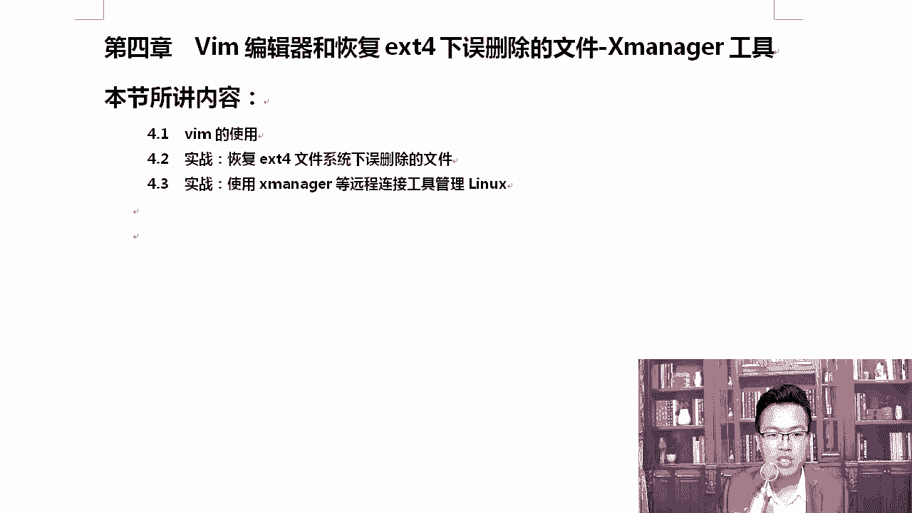

VIM前面我尝试的，咱们前面也用过这个VM。

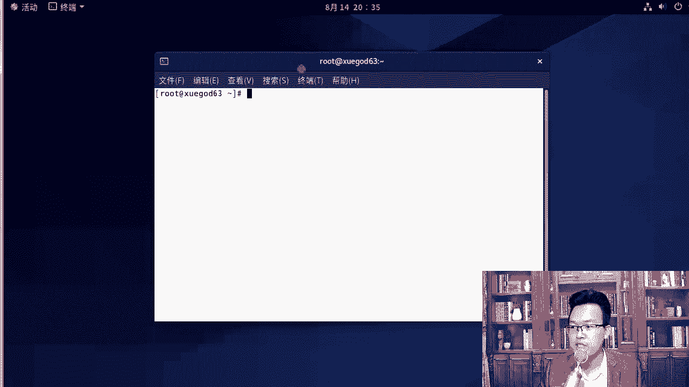

那这一次我们来详细说说它，它其实有很多使用方式啊，那我们首先位置查看一下VM，查看一下这个命令，这个命令在USR并向VM，它在这个位置上，除此以外还有一个vi，知道吗，来which。

我们可以看一下VIVI是在哪里，是在这里，那他俩之间是什么关系，我们可以另外我教你一招，你想怎么样，比如说我想查看这个包是有这个命令，是由哪一个软件包安装的，你可以这样rpm杠什么QF的方式去查一下。

这些小技巧，慢慢的大家都要记住啊，那我们可以通过这种方式来执行一下，rpm杠QF去查，那你们可以看到它是vm in hans，这个帮我安装的，除此以外，你要想看vi的话，我们来看一下。

这样你就知道他俩到底是不是一个包安装的，那你看V是VIM怎么样，minimal minimal它安装的，所以说他俩是一个软软件包吗，答案是什么，对我们从这个地方就能看出来，他俩并不是同一个软件包安装的。

它是两个独立的软件包啊，那想要知道怎么样，你想知道它是通过什么安装的，那么可以通过这个命令，rpm杠QF这种方式去查询，我们就能看到rpm杠QF的方式，我刚才是通过这种方式去执行的，对不对。

除此以外还可以怎么样呢，还有一招，你也可以通过这样把它两个命令结合起来，用这个反引号，反引号是哪的，就是table上面这个符号，ok which你可以通过繁衍号，然后跟上which。

which后面写上VM，这样也可以看到了，诶不好意思啊，我这写的有问题啊，好你要用反引号啊，VM大家遇到错误的时候说你别慌，你看他说NO dodo，i am在哪呢，在这里面，所以说大家遇到错了，你别慌。

你你去对比一下好吧，那通过这个命令可以怎么样，这一个命令就相当于我们前面两条命令，就这一条命令好不好，反引号是什么意思，代表先把这个命令先执行这条命令，把这条命令的输出作为作为这一条命令的输入。

OK这一条命令就等你两条命令，你可以写到一起啊，其实还是写了两次是吧，你看我们是这样的，rpm杠K平F，那如果你加了反引号以后，它会先执行反引号里的内容，也就是将反引号的输出，反引号输出的是什么。

输出的是这个值，把这个值作为前面这个命令的输入，这是LINUX的一种使用方法，后期我们在shell脚本里面会经常用。

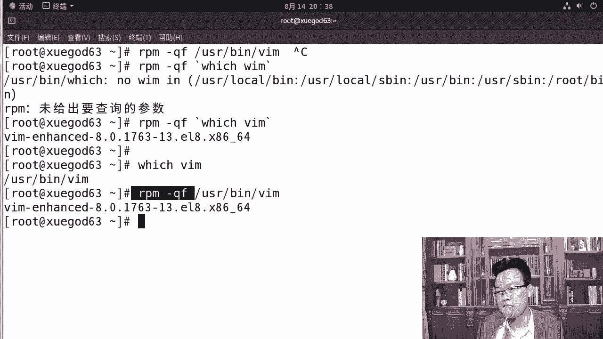

所以在这里我希望大家怎么样也能嗯看一下，好不好对，首先呢这样的话我们来看一下，所以说那我问一下是吧，VM和这个地方他们俩是不是同一个软件包，答案是什么，对答案是不是啊，他们不是同一个包来。

那么VM是vi的增强版，最明显的区别是VM是可以有语法加量的，而且他完全兼容VI怎么能看出来呢，etc打开vi打开etc上的password是黑乎乎的一片，然后退出，退出以后。

VM打开etc password，大家可以看到这是彩色的，有语法加量的，看出来了吧，这是二者的区别，然后呢查看扩展一个小技巧，查看一个命令对，查查一个命令是哪个软件包安装的好，那可以使用这个方法呢。

可以这样，你可以通过这种方式就能查看一个命令，它到底是怎么样，是哪个包装的，那我们刚才看到了他们俩，一个是v i in hands加强版，一个是minimal对吧，如此一来就OK了。

好咱们接着往下拿到这两个以后呢，我们来说说VIM的具体的使用方法，比如说VM有几种运行模式呢，VM的四种运行模式，第一种模式叫做normal，好吧，俗称命令模式，如果我们标准的说法应该叫做正常模式。

还有一个叫命令行模式，那就是command line命令行模式O还有个insert模式，插入模式，这里有一个俗称俗称叫编辑模式，为什么要有个俗称呢，各位为什么要有个俗称，俗称是编辑模式啊。

还有一个可视模式，也叫可视，怎么样可视块模式，因为这种俗称离的钱更轻松一些好吧，正常模式和插入模式，其实你们天天用这个插入模式，比如VM打开etc psa的N下I，典型的这里就有一个插入字样。

对这就叫插入模式，但一般情况下，我们呃很多情况下我们都习惯成为编辑模式，因为在这上面就可以随便进行编辑啦，就像我们啊编辑一个普通文档一样，上下左右可以随便去编辑对吧，那我们来详细的说说这几种模式啊。

好那你就打开啊，etc pad word还以它为例，直接打开打刚打开这个文件，首次进入的时候，有时候我们叫做命令模式，那其实这个时候是什么呀，准确来说它应该叫做正常模式好不好，正常模式啊。

首次进入文件的时候，我们称为正常模式，normal俗称命令模式，其实就是正常模式，刚进入这个文件叫正常模式，它也在这个正常模式下也有很多快捷键，稍后我给你说一下啊。

按下I出现insert就要编辑模式或者插入模式，你们习惯于叫什么模式，插入模式吗，还是编辑模式，很多情况下咱们国内都喜欢一觉，怎么样编辑模式啊，实际上在国外标准的说法是insert插入模式。

那按下ESC再输入冒号，这个叫做command linux，command line命令行模式啊，这个倒是都没什么区别，看到了吗对吧，按一下ESC，你要按下ESC啊。

好那在插入模式这个地方还有正常模式搞定了，接下来稍后我们说说，还有一个模式叫做可视模式是吧，或者可视块模式好，我们一会儿说一下啊，认识了大体上认识了以后，我们来说说从编辑模式切换到命令行，是怎么切的。

你在编辑模式好，或者说你在insert插入模式，那么按下ESC输入命令行啊，按下ESC的时候是在命令行模式啊，我们这个时候比如说按下ESC没有冒号的时候，只是命令好吧，命令模式，然后呢命令行的话。

你需要输入这个冒号，好知道了这个以后我们来看一下，有同学说老师我怎么进入编辑模式，我们先聊聊这个，这个是最简单的，你想进入编辑模式啊，有很多种方法，当然比如说I就是好吧，除了A的话，还有很多种。

这几个字母都可以，而且分大小写，我们来这里给大家详细的说明，说明我们这个作用好不好，我们说几个快捷键啊，这个进入编辑模式的时候，你可以按下I好不好，当前字符A是在当前字符之前插入，什么意思呢。

假如说M可以在数字一这个地方光标现在这里，如果我按下A，你看我插入的时候就会在一前面进行插入对吧，然后呢这几个东西大家慢慢的都记一下啊，A的话是在当前字符之后插入，O的话是下一行插入。

我一般用I和怎么样，I和O会多一些好不好，因为平常不就是一个字符吗，我光标移动一下就可以了，懂我意思了吧，其实所以大家记住I记住O就行了，X的话是向后删除，那么除此以外还有大写的I，大写I是在行首。

一般情况下我这时候会按下home键，直接就跳跳到行首了啊，你你摁一下大写的A也可以，你看他就在行首进行插入了两种方式都可以，A的话是大写的，A是在行为好不好，韩伟这个东西呢，大家需要找个本儿。

找个笔记下来，除此记下来以外，你还应该多去练习好，我建议大家记住I和A就够了啊，至于这两个，你用home和end也一样，键盘上按起来也挺舒服的对吧，你们这两个字符如果你用的不时间不多的话。

就是不常用的话，经常就会忘，而且很少情况下我们非得在行委去查，其实一般没有啊，都是改其中某一个配置文件的时候是直接改，X的话是向后删除，等同于delete，那么这个X是向前优势撤销R10恢复。

单纯输入一个二是什么，对单纯输入一个R是替换，当然这些命令是在哪呢，是在命令行下啊，好这是怎么进入编辑，然后呢还有命令模式下的一些快捷键，我们把这个命令下，对命令模式下的快捷键也给大家说一声。

演示一下吧，当然其实这些命令他们都属于命令行下的，就是命命令模式下的快捷键啊，都属于，只不过这几个是负责怎么样进入唉，咱们对这下面做一个说明，除此以外，我们以此演示一下吧。

给大家前面这几个A如果我们输入A的话，大家看一下EMC值，在命令模式下，如果我们输入O5官标，在这里输入O的话，你看他会在下面去插入一下，对吧好，它会在下面，如果我们按下大写的O呢一样。

它会在这个行的上面插入，我们再来聊聊这个X向后删除，字符串的一个地方啊，我们来删一下，X的话是这样的，向后删除，按下X看，就像按下delete一样，我挺喜欢用这个X的。

如OK如果按下大写的X是向前红色标记的，你用心记一下啊，UU是撤销，这个也很重要，万一有改错呢，我摁下UUUUU对吧，按下U就可以了，如果你彻底想恢复原始状态，那怎么办呢，E感叹号不保存。

直接恢复原来的状态啊，这个也挺好用的啊，还有一次假如删一下啊，在这里又删了一些，对吧就乱操作了一些，按下U你看before前面有29行是吧，二十九九处改变，你看你每按下U撤销一次，它就会变一次。

懂我意思了吧，那么我想恢复呢，恢复是CTRL加R，它可以就是用恢复好CTRL加就可以进行恢复了，好你想替换呢，比如说我想将这个D替换一个数字，按一下怎么样按一下R键，然后按一下你想替换的，我想替换成二。

他就替换了，来这里吧，比如说这里是一个零，我想将零替换成一，按下R再按下一就可以了，这是在命令模式下去执行这个操作，当然这些操作你也可以在什么编辑模式，EXCET模式下去做啊。

好那么在刚才我们插入的过程中，我们的光标又是如何移动的呢，咱们看一下我的光标可以按下什么，上下左右的光标键，除此以外，我再给你推荐一个挺好用的快捷键，叫HJKL，他们也挺好用的。

HJKL也可以光标上下左右的移动，大家看一下，上下上下他也是可以看得出来的，那看到这些东西以后呢，我们来再看这数字，零和home都是表示切换到行首，DOA和N都是切换到行为，妥妥的，你还是摁摁的吧。

因为dollar你还得看一下键盘是吧，去找一下那个数字键，shift加数字四，这才能切换到dollar上，OK啊，按下零就可以到行首，那home和end的也是可以的，好这些再往下。

我们想快速定位到怎么样，这些都是在正常模式下做的操作啊，也就是我们的命令模式下做的这些操作，我想快速定位到行首，GG两个GG是快速定位到行首，大写的G就定位到行为，比如说我想知道这个文件一共有多少行。

N两下GG它现在是一这个前面的一代表的行号，后面是代表这一行第几个字符，你看我光标往后移一个，它就变成二，然后再以一个光标往后又移了一下，它变成三了，而光标现在停留的就是第三，然后我的光标往下走一下。

这里就变成了二，然后再往下走，行号在变，所以当我们按下大写的G的时候，那你可以看到47行，我这里面一共47行，再按一下大写记，跳到行首好，那在这个模式下，如果我想查找一下内容呢对吧，这里面这么多内容。

我想查找一下，比如我想查找一下root，我想查找一下病，你可以这样斜杠加上字符串，它可以查找或定位你想要照找的单词，如果内容比较多的时候，就找到的数量比较多，我们可以按下大写的N和小写的N。

大写的N向上，小写的N是向下去查到小写的N用的会多一些，因为我们找到了以后，就希望往下翻嘛，并且VM会对查找的内容进行高亮显示，如果你想取消，可以使用NO hi NO h h high就是高的。

通过它可以去搞定试一下啊，NO high看到了吧，哦现在没有查到，我们现在查找一下，查找一下B你看满屏都是，并按下一个N，看到光标往下走了吗，我的光标现在在这里，我按一下以后，他应该调到这里，是不是。

对不对，如果按下大写的N的话，它会往上调，这个是什么意思呢，当我翻的次数比较多了，我现在又想往回翻好吧，那可以按一下N大写N他就往回翻了，如果而且一旦出现这个，你看我不保存，退出来以后。

下次VM再打开的时候，还是满屏都是黄，都是高亮显示，我不想高亮显示，NO h这就可以了，那如果你忘了这个NO high怎么办，有同学老师我忘了这个了，这就是工作和什么和专业人士。

专业人士是告诉你NO high能搞定，如果你实在忘了，那怎么办呢，你还不想让他高亮，你怎么办，对你可以整一个什么找不到的，比如说我思维TRA瞬间就没了，只要他找不到是吧，下次打开的时候。

你看就没有这个好吧，我就是专业人士啊，但是有时候你忘了，你确实可以通过那种搜一个搜不到的数据啊，这样是可以找得到的好，除此以外，还有我们这个尖括号怎么样向上的，尖括号D那它表示以什么开头。

在查找的过程中。

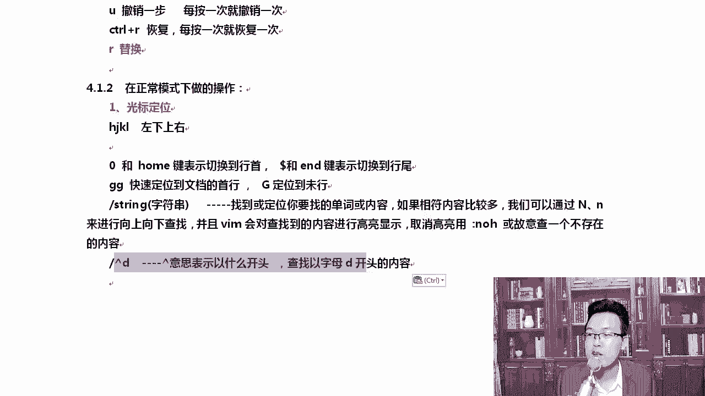

我们也可以加点符号，这个尖括号是在数字六上的啊，那比如说我们开一些以B开头的有哪些对吧，那我就能看出来，然后呢，比如说肩宽M开头的有谁对不对，那如果我想以什么结尾呢。

比如说大家可以看到这里有什么long NO long in了，或者by是结尾的，我想找到，但是结尾的那么可以这样，到了回车它就能将查找的都能查到，你看这这里在这里是吧，再按一下跳到最后。

第一个和最后都有，OK好退出，除此以外还可以这样加好，比如说我们拷贝个文件，etc下的password，哎呦加X了是吧，你可以加点东西，知道吧，如果我们直接什么也不加，什么也不加。

打开一个文档以后会直接跳到最后，那你也可以加个数字，比如说我想跳到第23行或者53行，53有利好吗，有好，那你可以啊，没有没有的话就跳到48了，那我可以跳小一点的。

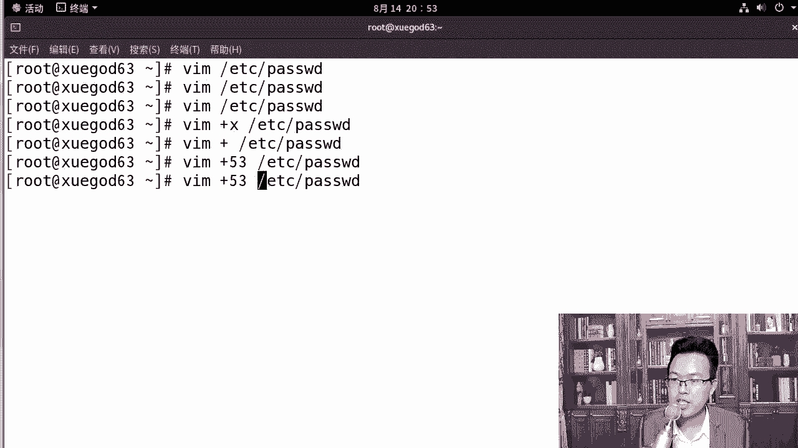

比如跳到23行，22行，他就到22了，好，这是查找这一块的内容，这些内容呢都挺好用的，平常的时候是吧，大家多用一下啊，当然用的最多的还是直接什么斜杠加上字符串，还是他最多啊，这个地方代表以什么结尾。

查找以字母BH结尾的内容，然后VM加A点T4T，打开后会直接到文件的最后一行，然后加53，我们加个23吧，加23的话，表示打开文件以后自动位于第23行，这个方便后期排错，因为服务器在排错的过程中它会爆。

比如说第23行是有错误的，那你通过这种方式就可以快速定位到，第23行，就方便很多了。

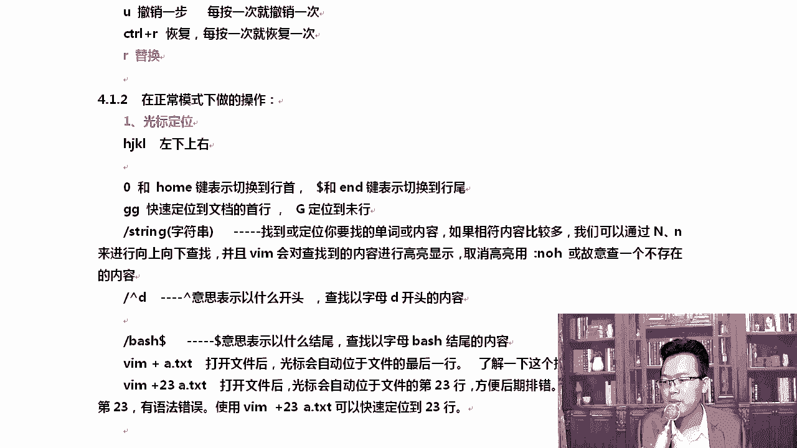

明白吗，同学们，我们用的是谁，是etc下的pass2的是吧。

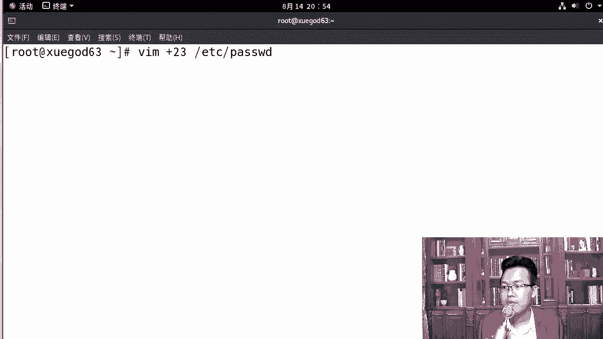

两种方式都可以，如果大家在看我的文档里，你没有这个文件的话，你自己随便起一个文件就可以了啊，各位对大家如果没有这个文件的话，你可以随便起一个文件，你要写这个绝对路径啊，因为我是在root下的。

除非你在etc下，你可以什么写相对路径，那咱们有了这两个步骤，你们还有关于VM还有什么问题吗，我来说一说啊，就是VM确实有很多的使用技巧，我更喜欢的是什么呢，按下大写的G，有时候就这个跳到行尾。

跳到最后这一行吧，像这种方式，说真的我其实一般VM打开以后，按下大写的G直接跳到最后，我更喜欢这样啊，因为这个技巧其实并不常用，而且过一段时间肯定会忘好一句话，LINUX中有太多的小技巧。

你只记住你永远不会忘的那一种方法就可以了，明白老师的意思了吧，因为这种方法确实时间一长是吧，他肯定会忘，不仅是你我也会忘啊，但是VM按下大写的G这个我已经觉得很熟了，我再也不会忘了。

所以我就可以这样去操作啊，那么稍后呢，我们在，我们还可以在正常模式下对它进行一些修改。

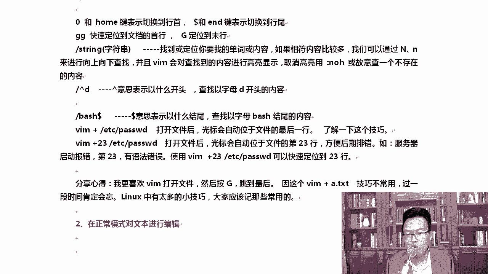

我们来正常模式讲完它etc下的password打开，在正常模式下，你要做一些操作的时候，有哪些操作呢，大家我一直改的是这个etc怕错的啊，我怕你搞，我怕你是不是搞不定啊，所以你要是实在搞不定的话。

你可以这样啊，c p e t c password a点TNT，别你一不小心保存退出了，清楚了吧，你可以在这里先对它复制一下。

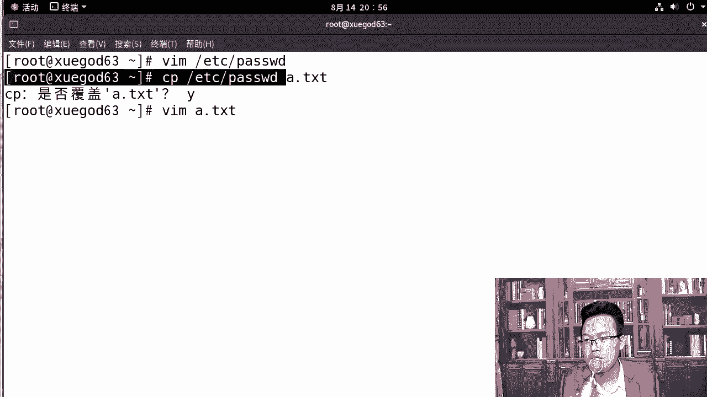

所有东西都上这上面去操作就行了，我怕真怕大家是吧，改过来改过去，改到最后是自己就改，把配置文件改坏了，而且你还没有做快照，那这个时候你就白搞了，所以大家一定要注意一下，你你在整个操作的过程中。

我是在etc password下的是吧，那大家在一开始的时候，你可以都可以搞一下啊，你可以去呃去改一下这个，OK我们扩到当前目录像，你可以通过这种方式，这样的方式对你们来说会更保险一些。

你们感觉呢有没有谁把那个password是吧，改乱了或者改错了有吗，有可能是你有可能把这个password改过来，改过去改得很乱啊，好我们来说说复制粘贴，打开A点TNT，我想对A点ta点TNT进行复制。

前面只是简单的看了一下，还好说复制粘贴这个地方肯定会有问题，复制是YY，我要复制N行，就NYY2YY代表复制两行D的话代表什么，dd是删除的意思吗，dd是删除是吧。

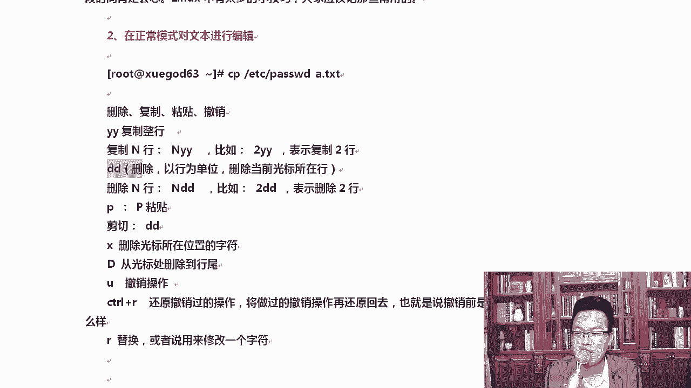

我们先看一下复制YY复制第一行，按下P那第一行就占了，再按一下P又占一行，再按一下右转一行，那我想复制两行呢，比如说我们在这里，我想把这两行复制出来，光标移动到这输入2YY输完以后呢。

我们在光标移动到这里，按下P它会在当前这一行下去插入，你看好不好，写的是不是很清楚啊，demon d m这两行复制下来了，删除的话也一样，dd这就删除了2dd就是删除光标，删除那两行呢。

它是删除这两行啊，删除了，如果你想粘贴，按下P就可以了，复制粘贴都会了是吧，告诉我剪切是什么，剪切删除dd大家已经知道了。

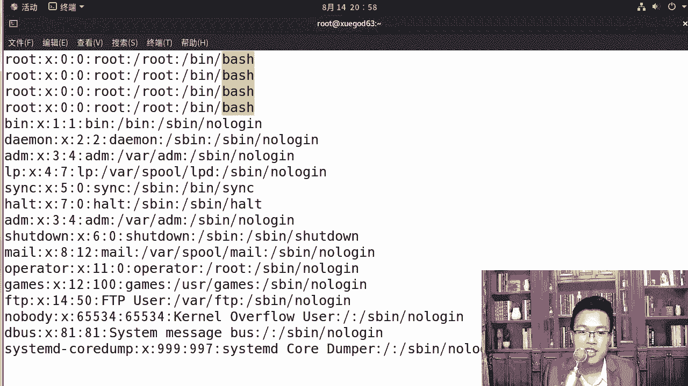

剪切呢我跟大家讲啊，在LINUX下dd其实也代表剪切啊，你弟弟玩的这些内容是吧，都是可以被粘出来的，你看比如mail我们就game这一行dd剪切了，剪切完了以后往下走，移动一下，按一下P。

那你可以看到games这一行已经被粘出来了，看到了吗，好大家知道一下，然后呢大写的D代表的是从光标处删到行为，这全部都在正常模式下去讲的啊，在这里面按下大写的D有时候我想删，我不想我从这往后都想删掉。

那就按下大写的DU的话是撤销挺好用的，CTRLR是还原，又还原回我删的这个如果我只想将零替换一下，按下R按下三，这样的话就可以啊，而且按按完以后，你可以看到这里会有一个标识的，当我按下R以后。

这个标识按下数字替换完了以后，这就没有这个标识了，看到了吗，这是不是你第一次注意这个操作，很多老师用了好多年，这个R他都没有注意过，这下面有这个标识啊，所以大家一定要用心，我用心讲。

你呢用心听绝对能搞定，说这么多，我们在这里简单的总结一下，A小小写的A小写的A小写的I，这是你必须会的，他们都是进入是吧，都可以进入插入模式，然后呢这个是进入命令行，CTRLV可以进入，怎么样。

在这种正常模式下，CTRLV看到了吧，control啊，VV的话就变成了可视框模式，什么意思呢，正常我们选择的都是一行一行的，你看在它里面可以一块一块的矩阵的方式是吧，一块一块去选，看到了吗，好吧。

先横向选中，然后呢再往竖选的过程中，横向先选，选中完了以后再往下走，一块一块的啊，这就是CTRLVR的话是擦出好不好，然后呢进入以上模式，想退出的时候都用ES就行了。

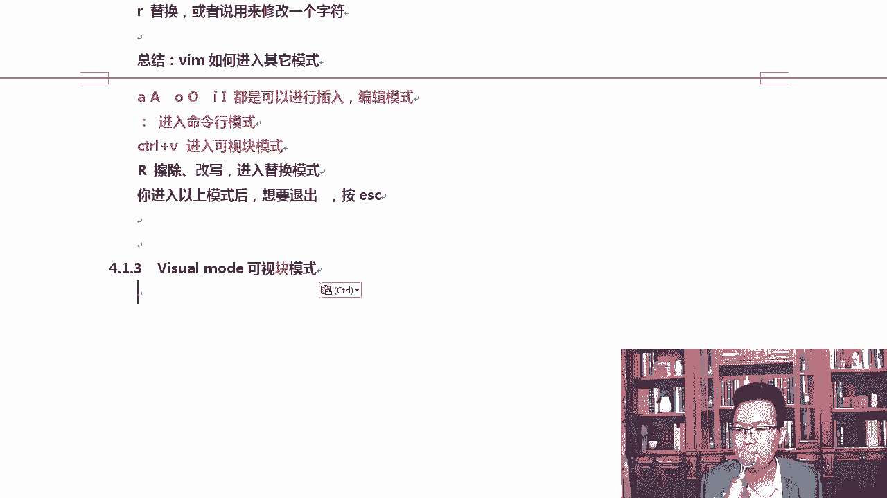