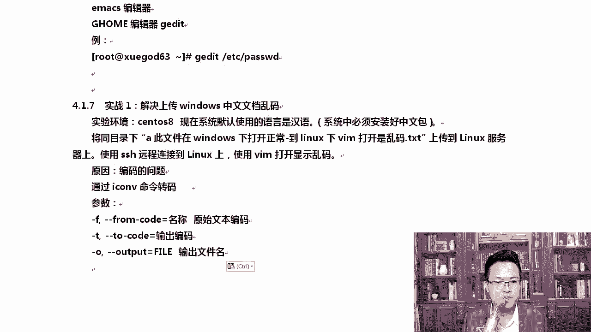
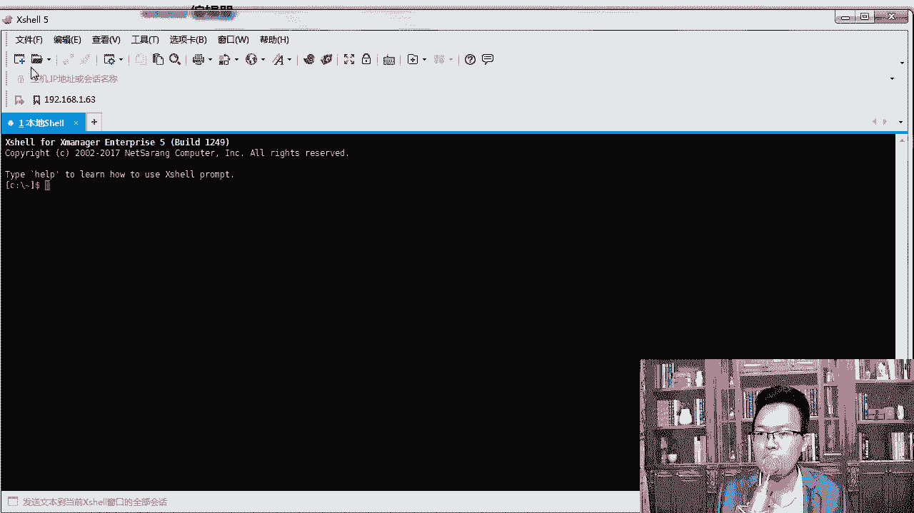
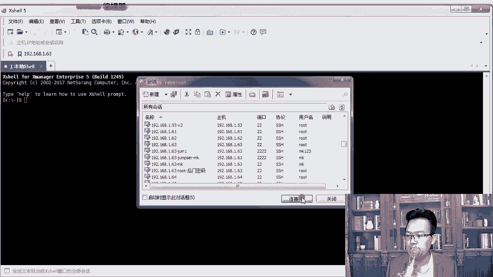
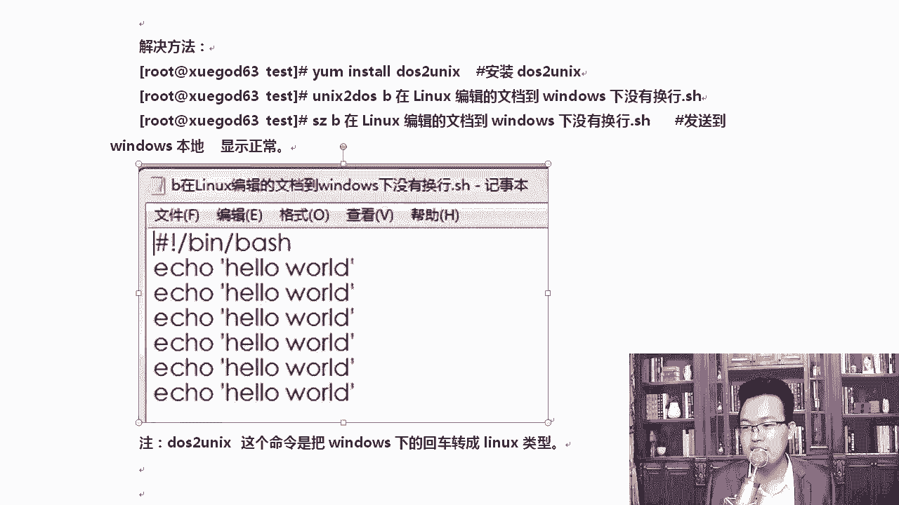

# Linux网络运维架构／RHCE红帽认证／云计算／第4章-Vim编辑器和恢复ext4下误删除的文件-Xmanager工具 - P3：4.3-实战-解决上传windows中文文档乱码和串行的问题 - 乔治学院 - BV1sD4y197zZ

咱们来看一下这个实战，说了那么多VM，我们聊一两个项目实战，让大家。接触一下这个工作中，VM应该如何使用。第一个就是乱码的问题。s S8现在里边默认是汉语吗？啊，当然你要想看汉字的话。

你必须得装好这个中文包。如果你不装中文包，你用我给你提供的这个模板文件看到的是一串方块的，就乱码啊，乱码，我们将将目录下有一个名字，这个名字是A开头。

叫此文件在windows下打开正常到lindows下VM打开是乱码。对吧上传到lininux服务器上OK你可以使用SSA远程连接到Llininux上。那这个远程不会连接。一会儿我教你啊。

我会呃教大家好不好？这个之所以会出现这个问题，主要原因其实就是什么？就是大家经常在lininux啊会遇到一些乱码的问题，包括windows下有时候也会浏览器上也会出现一些乱码的问题，主要就是编码的问题。

你了解一下这个我分享一个工作经验给你啊，从最开始第一天的基础，我就把工作经验和项目实战带给你。那你学完我这个lininux课程，未来找个好工作很轻松啊就。😊，那icon这个命令是吧，它可以进行转换啊。

有几个参数啊，from是原始文件的编码。T的话是输出的编码，O的话是输出文件。呃，我们创建一个普通文件给大家去做一下这个操作啊。

好，我们先打开这个叉c。当然这个叉C接下来一会儿我就要给你讲它怎么用了啊。叉C1。653打开打开以后。

接收并保存。那我们可以把文件上传上去，上传的时候有很多种方法，阿Z就是一种方法，一会。啊，如果没有这个RZ命令怎么办呢？没有RZ命令的话，在stoS8里面是非常好使的。什么意思呢？如果你没有什么命令。

stoS8能够自动猜到这个命令是哪个包提供。你看软件包LRZSC可以为你提供RZ命令，你要不要安装，我要安装这个在7下是没有的，旗下直接告诉你哦，这个命令找不到。😡，那我们待会回车，回完车以后。

它自动就帮你装上了。好，你要不要装？yes ，我要装。可以敲个6吧。那么在呃3S8上是吧，你缺哪些命令的时候，它能自动帮你补上。😊，啊，八里面是有这样的功能的，在7里面是没有的啊。啊。

我们让它自动去装着。除此以外呢，还可以有这样的一种。好，已经装完了啊。装完这个RZ以后，我们就可以将我们所需要的文件上传上去了。等他安装一下啊。好，你看我已经安装好了，安装好了以后，它自动就能就能用了。

😊，啊，我可以点一下取消啊。阿Z输这个RZ命令，有同学老师，我在这里面输入阿Z可以吗？😡，啊。不行啊，你要在这里面输入，你看就就就就乱乱套了。那这个时候你contrl C的话不只有把这个叉啊。

只有把整个终端给关掉才行。😊，所以大家要知道一下。这种RV命令只能在这块来实行啊。只能在叉el或者CRT啊，这种终端上是可以的。我们将这两个文件上传上去。好。MS看一下。

这就是为什么我让大家装系统的时候，按照中文的方式去装。这样的话，你能看到我这个字母。如果你是以英文的方式装的那可能这个字汉字你是显示不了的，你得再装一下汉字的字体库才行。好吧，还有解码编码。好。

我们打开这个地方啊，看一下。😊，为了方便大家去复制，我特意A开头有A开头的，你可以按table补齐。好吧，因为我这里那还有一些。那我可以这样啊，我可以创建一个文件夹test。MK。电二。

test cD的test下。好吧，RZ上传一下。来，我们快速的上传一下。输入这两个文件。点打开。好的。😔，看到了吗？VNANtable补齐啊，你敲一个字母，按table补齐，你看这就是乱码。

这种乱码应该怎么解决？😡，大家想想这个问题。对啊，在这里A开头这块直接就是乱码。好，这种问码怎么解决呢？是这样的啊，我们可以转化一下，转化的时候是怎么转呢？这样。这命令稍微有点。呃，命令还好啊。

就这个e杠F默认的是GB2312，就是你在windows下打开的，默认的编码都是GB2312转成UTR8UTM8格式。然后呢，后面跟上这个文件的名字，名字稍微有点长啊，跟上输出AA点TIT输完以后。😊。

就可以了，这样就可以转外码了。你知道有这样一个过程，就windows下通常这个编码都是GB2312的。啊，当然现在你像你使用word去另存为进行转化等等，其实也是可以的。好，这是一个小技巧，学到手了吗？

😊，学要手的话，请敲个一。记住上传上来上传来给它转转完以后能看到。好，除此以外，还有一个是解决公司linux服务器上脚本导到windows上打开窗码的问题。看到。假如我有一个脚本。

是吧在linux下编译的文档到linux呃到windows下是没有换行的。看到啊cat。我们看我们这个脚本，假如说你在lininux下写了个脚本挺好的，你想存到windows上后期是吧？

大家在windows上做个备份嘛，是吧？在本地做个备份。😊，在windowuxs上打开是正常的那我们到windows上打开正常吗？到windows上打开是不正常的。大家看一下。我给大家截个图啊。

就不给你打开了。你可以在你自己的电脑上把我给你提供的这个文件打开一下，它就是这样没有换行。😊，为什么没有换行？原因是什么？其实主要原因就是因为windows和linux处理回车的方式是不一样的。啊。

一个是杠R杠N。懂我意思吧？一个对他们是不一样的。好吧，他们不一样的处理这个方式是不一样的。所以说那这个时候怎么办呢？我们可以把它的换行模式给它转一下，转怎么转呢？

用这个dos to unix这个命令就行了。好，如果你没有的话，还有一个是unix to到上。OK默认这个包已经安装上了。那我们在这里进行转换就行了。比如说假如说你打不开这个，那你可以unix。😊，呃。

to do就是将linux换行格式转成windows可以识别的格式，回一下车就行。好，这样的话就转看刚好它已经转换为dos格式了。然后呢。你可以把它发到我们的文件。下方文件是怎么样的？SZ。

RZ是上传SZ是下载。那在这里SZD点，它直接回车就可以了。委托哎，我下到哪了，我也忘了从哪呢从哪看的，从这儿好，文件属性。属性里面有一个文件传输，在这里，你可以指定它存哪个路径。

像我的都是存到E盘software这个路径下了。okK好，如果你实在不知道，你从新点开。😊，好吧，去找就行了。OK我来打开你看一盘software。😊，啊，B开头的是吧，已经有这个文件了。看到了吧？

没用了，我就删掉了啊。这样的话我们就。把换行给解决了，这是2个VI里边的工作案例啊，工作的经验。大家想跟着MK老师学，就是想学一些工作经验。

所以后期我经常在这个课程体系里跟你分享一些我在当年上班时的一些工作经验。那你吸收了我的工作经验。听完我的课，你就拥有2到3年linux运维的。能力了，出去找个好工作就很轻松了。好。

我们稍后看另一个项目时。

