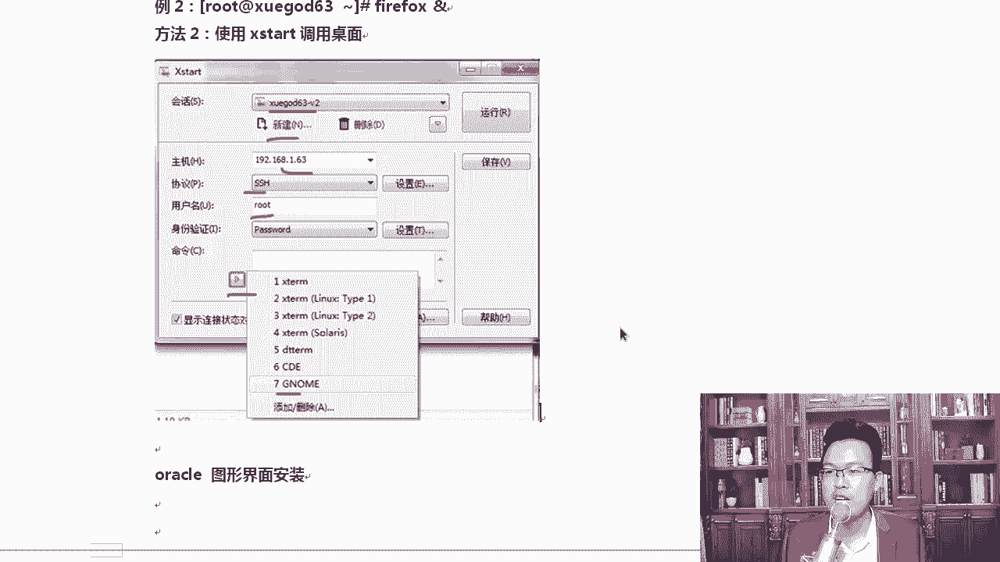
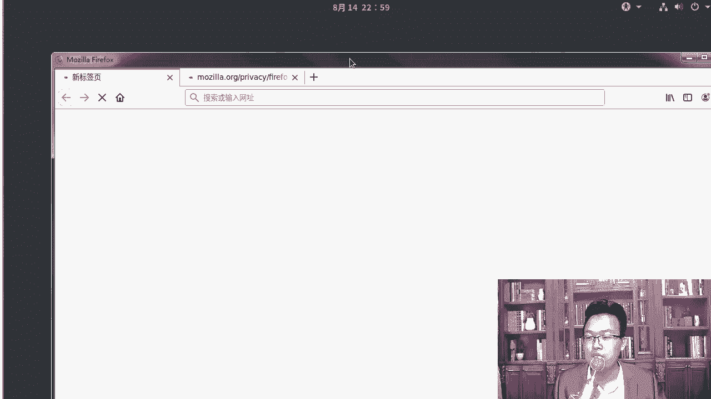

# Linux网络运维架构／RHCE红帽认证／云计算／第4章-Vim编辑器和恢复ext4下误删除的文件-Xmanager工具 - P5：4.5-实战-使用xmanager等远程连接工具管理Linux - 乔治学院 - BV1sD4y197zZ

大家好，我是MK老师。接下来我来使用X manager等远程工具。我们去管理一下linux。在linux常用的连接linux工具，其实有很多啊什么CIT的X managerpty啊。

我几乎这些工具我都用过。那我在这里推荐大家使用的是X manager这个工具。为什么呢？看一下啊，我有很多种版本啊。第一，比如说这个破解版CRTCRT破解版的时候有个问题。啊，什么问题呢？

这个东西你要不要用？你看破解说明时是怎么写的？你先运行它进行安装，安装完了以后，将这个软件拷贝到它的安装目录，然后点补丁包去打。啊，打完以后输入一些账号和密码就可以了。这个时候我问大一个问题啊。

如果在打补丁包的时候，杀毒软件给你报了个错，说啊说这个程序可能有漏洞，或者是可能有后门，那你到底是打还是不打？或者当我们把这个文件双击运行的时候，杀毒软件不好说可能有病毒。你不运行，然后呢就激活不了。

运行就有可能被中毒。如果你连接limux的工具都被中了毒，都被埋了后门。就像MK老师这一台机器样。

我上面可以连接这么多台服务器，是不是？😮。

对不对？对我可以连接这么多台服务器。那这些我的工具都有问题。😊，那自然是吧他就可以把这个账号密码这些东西全部都怎么样，轻轻松松拱手送给别人。所以在这个时候大家用工具的时候，第一不要用这种大后门的。

你怎么知道这个后门有没有问题？对吧何更何况CIT本身是吧有一个版本就有问题，包括X manager，包括我们的PUT，就是它官方版本里面都带了后门。😊，能理解吗？

就是它的官方版本里面就带着后门的X manager，其实还有putty这几个软件都出过啊，大家可以从去网上去搜一下什么pity带后门CRT带后门，X manager带后门X manager是近期。😊。

啊，Xmin5的时候带过一次后门。知道吧？后来后来官方就紧急修复了一下嗯。那CNT和Pauty那就更早了啊，更早的时候它的官方版本里面就带了后门。为什么习惯一在这里面带个后门呢？😊，为了挖手机是吧？

因为我们用这种叉1L的时候，账号密码都得写进去。

啊，所以我在这里给大家推荐了一个版本。

呃，我用的是这个版本，就是X managerX manager5这个是正好官方把后门那个补丁给官方里面，把后门补丁给怎么样补上了，补上以后，我从官方下载了一下，下载完了以后双击安装安装完了以后。

为什么喜欢用这个。因为它只要输入一个序列号就行了。那时候X manager在中国还没有限制的那么严格。明白吧？所以你只要输一个序列号，然后就OK了。我又从官方下的输入了个序列号，我就不用担心是吧。

真正的。真的是怎么样？真正的里边有问题了。好，所以我建议大家用这种方式啊，而且用的是X manager，不是叉 shell啊，因为叉 shell只有一个简单的功能。X manager有好多功能。

XX manager安装完了以后，会是以什么样的一个情况？我来给大家说一说，它会在你的桌面上起一个文件夹，文件夹里面会有好多图标，大家可以看一下。😊。

叉线只是其中的一个啊，里边还有什么XLPD这个也用的少Xstar和什么呢？和叉FFTP这个用的倒是挺多的。好不好？这两个用的挺多的，所以我建议大家要用这种方式，一看要破解，你就妥妥妥的就别用了。好。

我们来聊一聊这个Xman的使用方法。那我们双击叉el打开。😊。

打开以后呢，点一下这个加号，它常见的使用方法还是比较轻松的啊。你在这里可以写名称，这个地方可以写。比如说我们写学挂的63杠，我看学霸63开机开机了没有？

好，我们把这个机器啊，这边已经开了是吧？好，学盖的63。😊。

可以写名字，也可以写IP我一般都把名字写上，然后把IP地址再写上。真正写IP的时候，其实是下边这个地方，1921681。63SSH协议啊，走的是这个主机的话要写1。63。

前面上面名称可以随便写端口号22端口，然后点身份认证。😊，啊，这个已经存在了是吧，请插入其他名词，我就后面。前面加个一吧。好，然后点用户身份认证，输入用户名是root密码是123456。

就是你root账号和密码，写完这些，其实点确定就可以了。明白了吧？但是呢一般情况下，我会怎么样，我会调整一下这个叉射，因默认它的字体太小了，你看像这个眯着眼。😊，看不清啊，你可以在在哪里调呢？

在它的外观啊，外观外观字体的话，大家可以选择18号左右的字体，那就很不错了。😊，啊，18号左右的字体。除此以外。😊，调好外观以后，还会调一个东西叫做文件的传输。啊，文件的传输在这里你可以选择一下路径。

就是rZ用的是Z mode这个协议啊，就是RZ从这里可以选一个路径，你喜欢将它存放到哪儿？比如说我喜欢通常喜欢把它存放到E盘oft下。那我可以选一下这个路径啊。我在干嘛是吧？有同说我在选路径啊。好。

我选soft。那加载下载是把文件下载到什么呀？对，还有一个是加载，相当于上传路径了。那根据你自己的这个需求去选啊，我我还是喜欢选择software，我的所有的开源软件包都在这个目录下。好。

然后点确定你就可以用了。上传协议用的是Z mode的啊。Z mode算是最好的这个协议了，它有好几种协议，我们用ze mode默认的ze modeode协议就可以了。😊，好，知道了这个我就先关了它了。

因为我已经创建好了，运行的时候，你可以点一下它点一下这个按钮啊，点开这个按钮，从这里面去选啊，你想连接哪一台机器，比如说我想连1。63。😊。

那就连上去了。那同学老师，你知道为什么是白色呢？你看不能保证安全的链接，因为我连过好几次1。63啊，就不同的虚拟机的1。63，所以它会弹一个这样的窗口。当然你第一次连的时候，它也会弹这个窗口，这上面会。

😡，有一个主机密钥指纹，他怎么知道安不安全呢？每次连接的时候，他都会验证这个指纹。好，只要保存一次以后，下次再连的时候，如果发现指纹不对，他就会告诉你。给你踏个窗，防止你连到其他地方。

我这个白色是因为我调了一下颜色啊，大家后期根据自己的属性，你也可以去调。啊，在外观这个地方啊，你可以从这里选黑色还是白色啦，可以选这种风格。好，拿到这个以后，RZ我们可以怎么样。来。

你比如说我这里RZ上传上传的时候，你看它自动会找到这个路径下，下载的时候也会放到E盘这个路径下。我觉得这个方法还是挺好使的。除此以外呢，大家双击一下它。好吧，双击以后的你能看到什么，它就能再开一个。

你不用每一次都从上面去打。😡，啊，我们在这里直接双击行，或者你点这个下拉三角，从这里面去快速的选我要连接哪一台肉机。都可以啊。好，还有一个好工具，看见了吗？发送文本到当前叉se所有规话。

看这你可以选择你想发到哪个绘画上，我默认我选的是全部绘画。假如我这里连的是1。63，这一台连的是1。64，然后呢。😊，这边连的是1。65。对吧我三台机器我三台机器上都想执行某一个命令。

比如说我三台机器上都想yinst去安装app帕奇，我要搭一个集群，这个集群需要有3台阿帕7，那你可以把yinsstore阿帕7。😊，把它往上执行，往这儿执行一下，然后回车三台机箱都会去执行。好吧。

因为样么命令只能同时执行一个，所以我换成ac命令。回车回完车以后，所有打开的终端都会去执行这个命令，看到了吗？都会去执行。呃，这样的话批量操作就相当于自动化运维一样。挺好用的啊，你可以往这儿敲。

当然你在这上面敲敲三遍也是可以的。😊，这招学到手了吧？这个挺好用的，尤其是后期我们部署集群的时候。那知道了这些我问大家个问题，如果我想传一个文件夹的时候怎么办？RZ只能传单个的文件，它不能传文件夹。

你想传一个文件夹到linux上，那这个时候需要用XFTP。好不好？我挺喜欢用这个的，我们在这里点一下这按钮，它就能自动调出来XMTP就很多同学连接Lux用的是叉ll啊。

然后上传文件的时候可能用用另一个软件，其实没有必要X manager本身就可以帮你包含所有的了。你只要点一下这儿，它自动根据你当前的绘画区域怎么样。😊，去调出来XFTP啊。好，我们等他反应一下。

你看自动就掉出来，调完以后呢，我们就可以怎么样，从这边往linux上去拖。比如说西瓜影音往过拖一下，那西瓜影音就到这上面，真到上面了吗？当然啊。对吧西瓜已经真的到上面了。

OKlinux的文件想往这方涂呢，你也可以你就拿到它比说往一拽。😊，好吧，已经包含了是吧，你可以选择覆盖。它就真的是拖到lininux，就来回一拖就行。重点主要是推拖什么拖这种文件夹。

因为文件夹有时候不太方便。好，比如说我们想将快播这个软件涂上去。可以吗？可以。啊，我这里面很多开源的软件啊，还有内网渗透的一些。比如我们想将这个linux啊删完以后，自动生成病毒这个病毒是吧。

给它搞过来。可以吗？也可以，那你可以把文件夹整个拖过来。想研究的时候很方便啊。O。😊，那有同学说我想将图形界面调出来怎么办？还有一招，我觉得也挺好用的，就是图形界面。但是它这个图形界面调用的时候。

有时候可能会卡住啊，你可以使用叉el直接运行图形程序的调动。比如说我运行一个Gome或者运行一个five f。我在这个地方，这是一个什么？这是一个终端，我运行genal回车。好不好？回原车以后呢。

它会弹出一个这样的窗口。因为我有多个显示器嘛，我随便点一个啊，机插几用一和二都可以。呃，选择要使用的显示器选一个就行了啊。选完以后，它会把linux下的图形界面调到我的windows上去执行。

这个就方便很多了。啊，我们稍微等等他啊。啊，他报了一个小ar是吧？虚拟设备没找到，没关系。那我们就让他默认那个就可以了。我这样我调用一个firefox。当然前提是什么呢？前你想把图形界面这个调出来。

前提是你已经安装了图形界面。如果你连图形界面都没装，那肯定不行。😡，明白了？柳同，你说这个有什么用呢？😡。

你看像我这个我这个是安装着图形界面的啊，你别你这儿直接最小化安装的，你去调用这个firefox啊或者genome，那肯定不行。😊。

OK这个有什么好处啊？嗯，另外你还可以运行这个X大的去调用对应的图形桌面。这个好处是什么呢？呃，我们在安装什么linux，假如我们在lininux服务器上去安装oracle。二口是通过图形界面安装的。

明白了吧？我们安装op的时候都是一般去通过图形界面去安装。你没有图形界面，或者说你自己又不在服务器跟前。😡，你不可能接个显示器上去安装，所以这个时候我们就可以通过咱们这个方式搞定它。

我们可以通过这种把图形界面调出来，调出来，然后去愉快的去使用它就可以了。好。大家要学会了吧。这是MK老师今天给大家分享的内容啊，它启动的时候稍微有点慢啊，另外我这边也要登录上去啊，我登一下。😊。

我给大家看一下我的图形界面。启动的时候但哎。用户名root密码是123456。稍微有点慢啊。稍稍微有点慢啊。那我不登录它了啊，不登录它的时候，我给大家展示个好东西，看这。这就是我刚才运行的这个图形界面。

嗯。

呃，OK好，大家看到这个界面了吗？😮，这个就是我们刚才在fire呃，ffox已经运行起来，它调途径界面的时候掉的有点慢，实际上它是linux下的啊。他是linux思下的。啊。

我在叉CL想调运行的这个图形界面。

包括D它也是一样可以调出来的。

就是说我执行的这个firefox，它能自动把linux。下载图形界面掉到我们的windows上，这不是我本机的啊，这不是我本机的。😡，所以后期大家想要运行一些图形界面的工具。

你也不想啊整个VNC远程桌面，那你就直接用叉1就行。单纯的叉1是不可以的啊，你得安装X manager这个版本好，这叫企业版。

因为企业版里面有一个功能叫XstarXX star能帮你呃调出来这个图形界面。

好，大家知道一下就可以啊。那，我建议大家敲的时候，就用上边这种方法，你直接敲就行。嗯，直因为用用这个Xstar去调用这个图形界面的时候，有时候兼容性不太好，它调不出来啊，所以大家直接用上边去。

这个相当于把整个gen桌面都调出来了。工作量太大。好不好？你就调你普通的这个就行啊。你像我这个地方看网址生腾SORG。😊，我本机肯定不会出现什么生动SG这一说。StoSORD直说。好。

这就是今天的内容啊，大家回去好好的练习练习。😊。

加油。