# Linux运维培训教程：15：用户管理、用户信息文件详解 👨‍💻

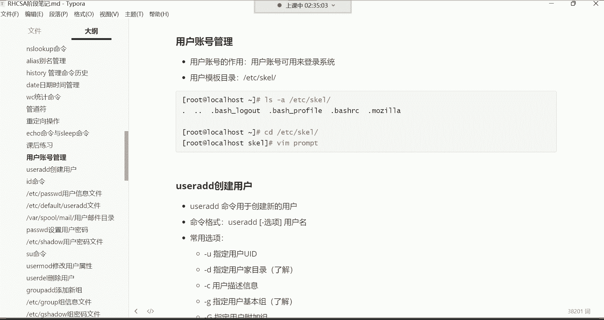

在本节课中，我们将要学习Linux系统中的用户管理，包括用户账号的作用、分类，以及如何创建和管理用户。我们还将深入解析存储用户核心信息的 `/etc/passwd` 文件，理解其中每一列的含义。

## 用户账号概述

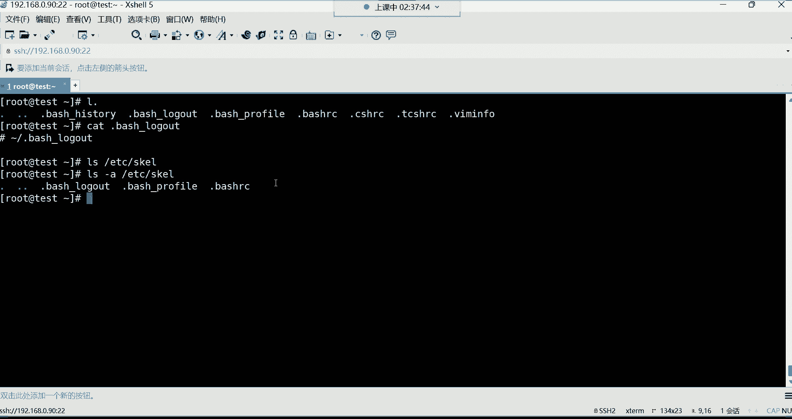

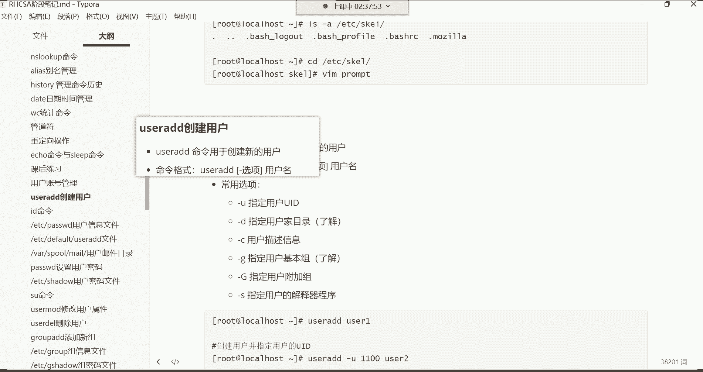

用户账号是登录系统所必需的凭证。在Linux系统中，主要存在两类用户：**超级管理员（root）** 和 **普通用户**。root用户拥有系统的最高权限，而普通用户由管理员创建，权限受到限制。

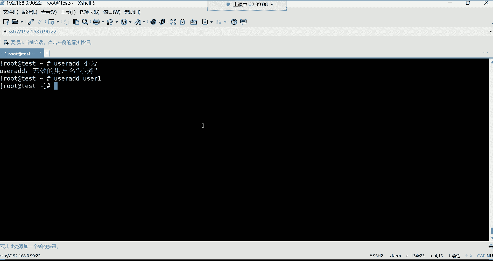

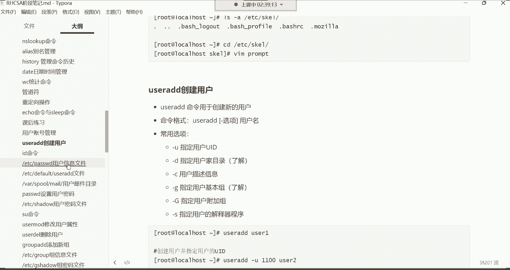

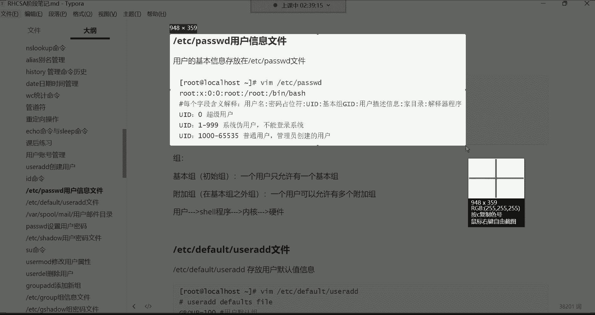

在企业环境中，root权限通常只授予核心运维人员或部门领导，因为其权限过大，一条命令就可能对系统造成严重破坏。普通员工则使用普通用户账号，以降低操作风险。

## 用户的模板目录

在深入了解用户创建之前，我们先简单了解一个概念：用户的模板目录 `/etc/skel`。这个目录存放着一些隐藏的配置文件（如 `.bashrc`、`.bash_profile`）。

当使用 `useradd` 命令创建新用户时，系统会自动将此目录下的文件复制到新用户的家目录中。这些文件为用户提供了初始的命令别名、环境变量等配置。了解此目录的存在即可，它不影响日常使用。

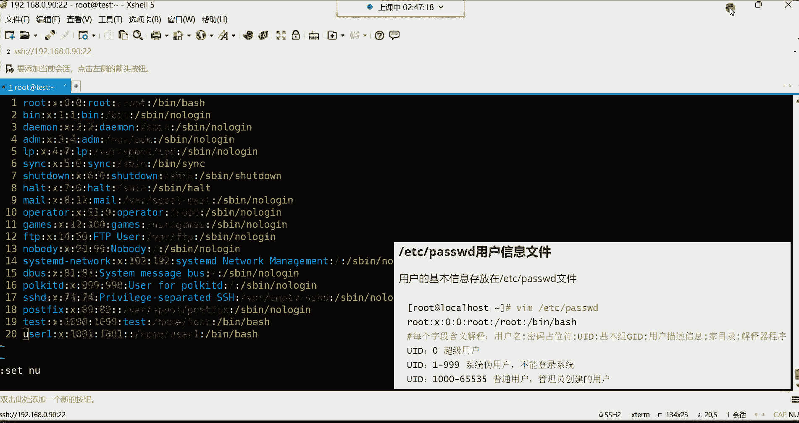

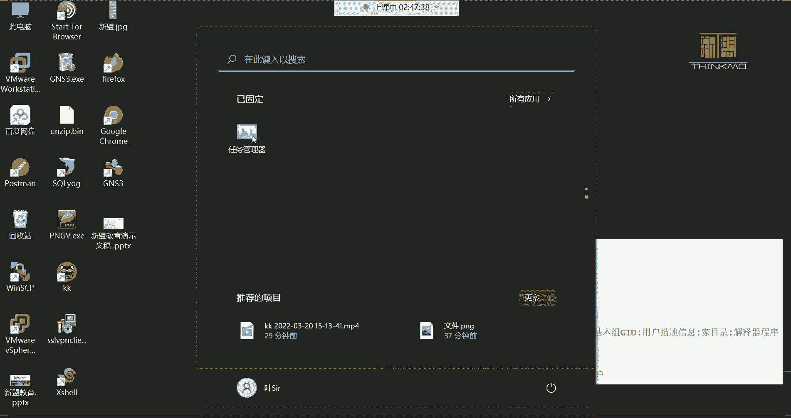

## 创建用户：`useradd` 命令

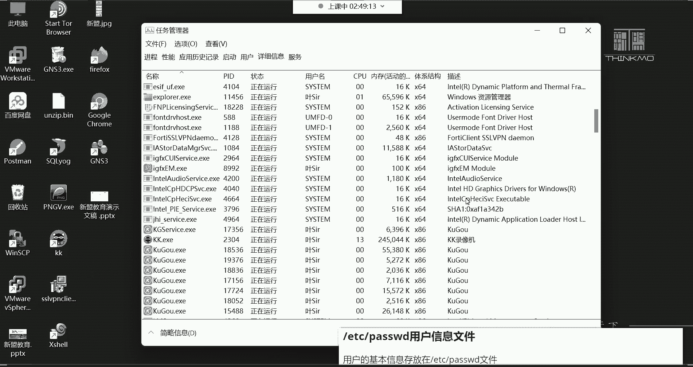

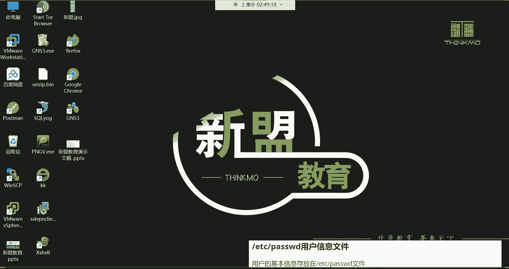

创建用户的命令是 `useradd`，此命令只有root用户有权执行。其基本语法非常简单：

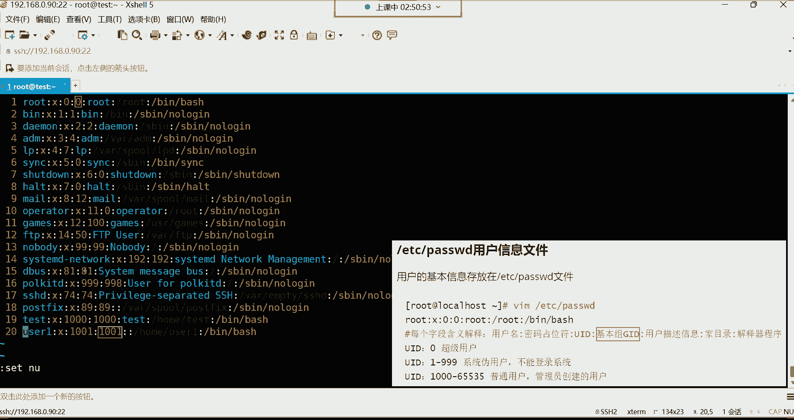

```bash
useradd [选项] 用户名
```

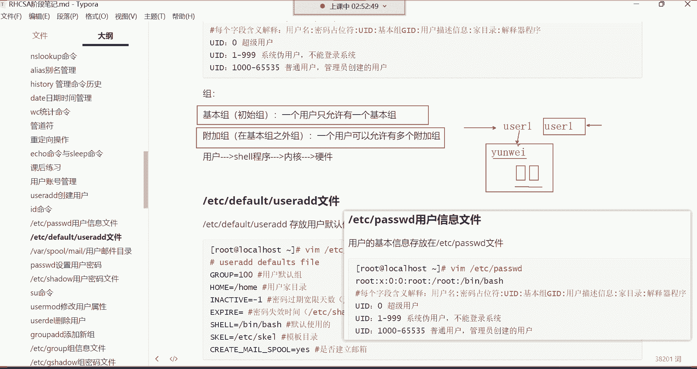

例如，创建一个名为 `user1` 的用户：

```bash
useradd user1
```

用户名应使用英文，不支持中文。创建用户后，需要为其设置密码才能用于登录系统。

## 用户信息文件：`/etc/passwd`

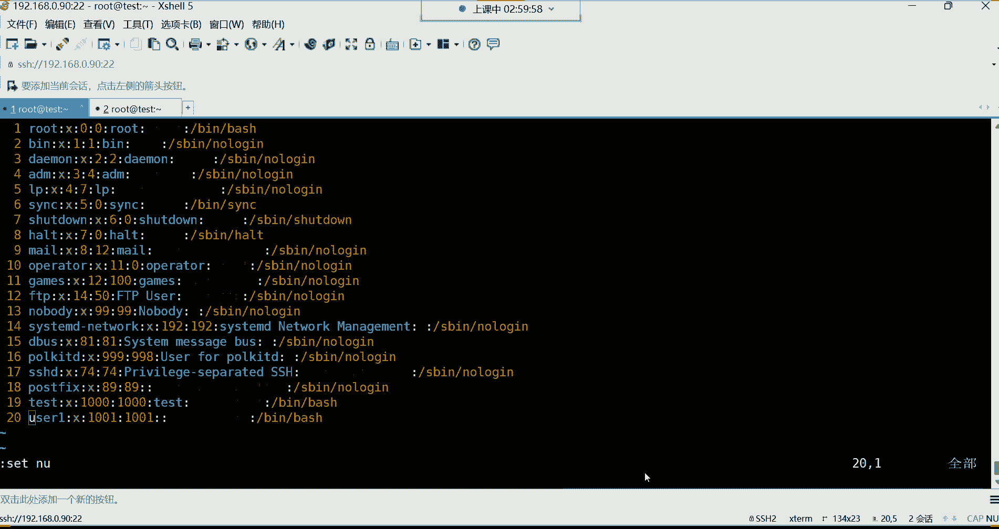

用户创建后，其基本信息存储在 `/etc/passwd` 文件中。这个文件至关重要，每一行代表一个用户，每行内容以冒号 `:` 分隔，共分为7个字段（列）。

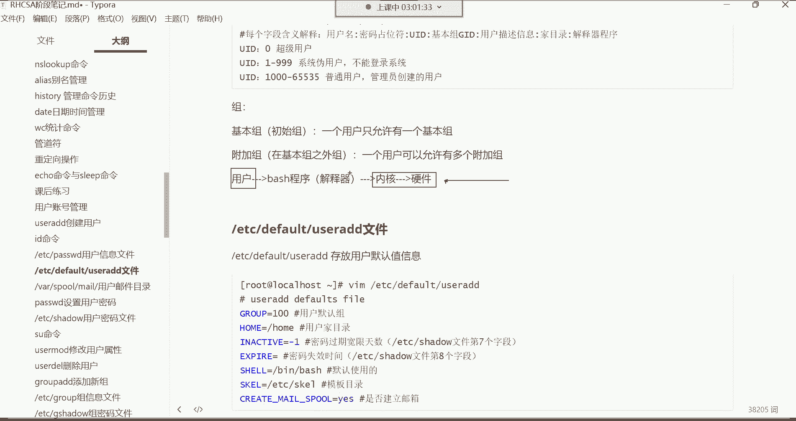

以下是每一列的具体含义：

1.  **用户名**：用户登录时使用的名称。
2.  **密码占位符**：历史上用于存放加密密码，现在密码已移至 `/etc/shadow` 文件。此处统一用 `x` 表示。
3.  **用户ID (UID)**：用户的唯一身份标识号。
    *   **UID = 0**：超级管理员（root）。
    *   **UID = 1~999**：系统伪用户，通常用于运行系统服务进程，不能用于登录。
    *   **UID = 1000~65535**：普通用户，由管理员创建。
4.  **基本组ID (GID)**：用户所属初始组的ID号。通常与UID相同。
5.  **描述信息**：用户的备注信息，如部门、联系方式等，可为空。
6.  **家目录**：用户登录后的默认工作目录。
7.  **解释器程序**：用户登录后使用的命令解释器（Shell）。默认为 `/bin/bash`。如果设置为 `/sbin/nologin`，则该用户无法登录系统。

**核心概念解析**：
*   **UID是用户的真正标识**：系统判断用户是否为超级管理员的依据是UID是否为0，而非用户名是否为root。
*   **伪用户的作用**：系统服务或进程在运行时需要一个身份，伪用户就是为此准备的，它们存在但不用于交互式登录。
*   **组的概念**：用户除了有一个**基本组（初始组）**，还可以加入多个**附加组**。用户会继承其所在组对文件的访问权限，这是Linux权限管理的重要基础。

## `useradd` 命令的常用选项

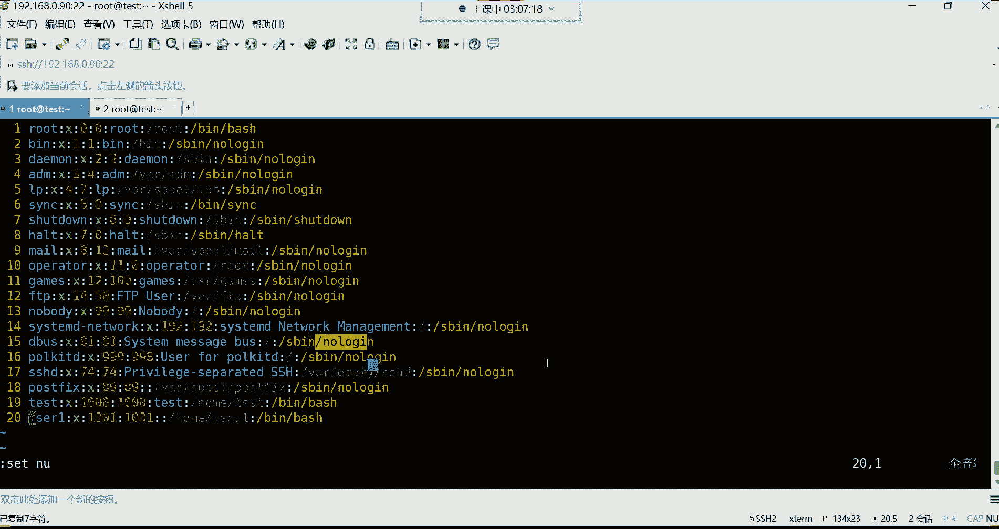

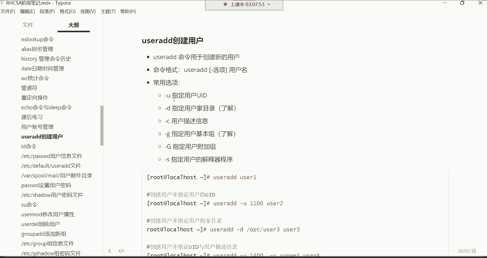

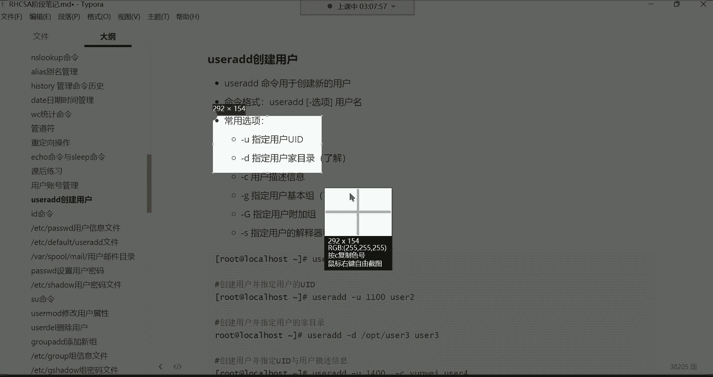

`useradd` 命令支持多种选项，用于在创建用户时指定特定属性。以下是一些常用选项：

*   `-u UID`：手动指定用户的UID。
    ```bash
    useradd -u 6666 user6
    ```
*   `-d 目录`：指定用户的家目录路径。
    ```bash
    useradd -d /user3 user3
    ```
*   `-c “描述”`：添加用户的描述信息。
    ```bash
    useradd -c “运维部，admin@example.com” user2
    ```
*   `-g 组名`：指定用户的基本组。
*   `-G 组名1,组名2,...`：指定用户的附加组。
    ```bash
    useradd -G dev,test user5
    ```
*   `-s Shell路径`：指定用户的登录解释器。
    ```bash
    useradd -s /sbin/nologin user8 # 创建无法登录的用户
    ```

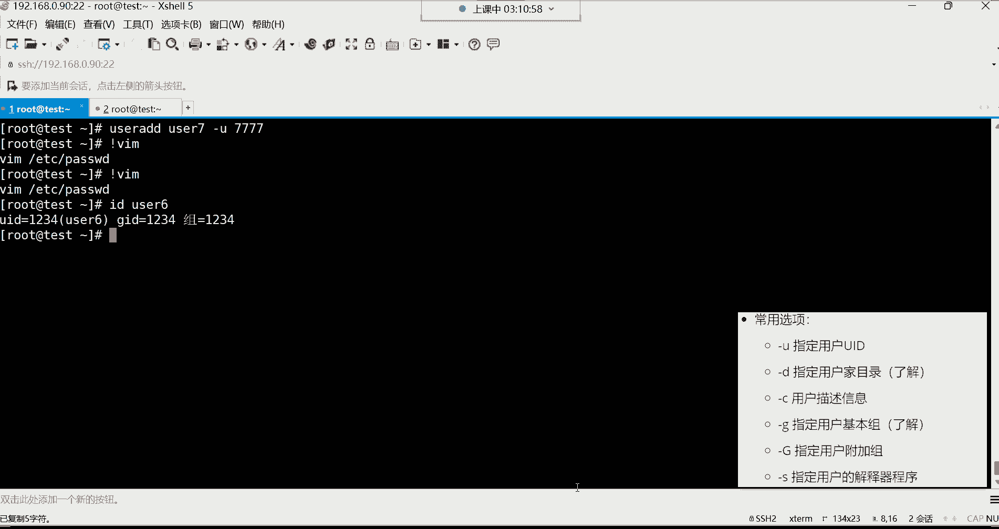

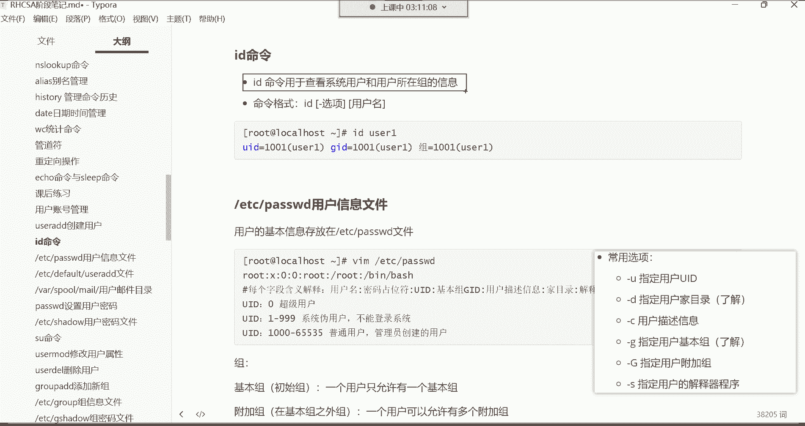

这些选项可以组合使用，且顺序没有严格要求。在实际工作中，最常用的是 `-G` 选项来管理用户的附加组权限。

## 查看用户和组信息：`id` 命令

创建用户后，可以使用 `id` 命令查看用户的UID、GID以及所属的所有组。

```bash
id username
```

例如，`id user5` 会显示user5的UID、基本组GID以及它所属的所有附加组。

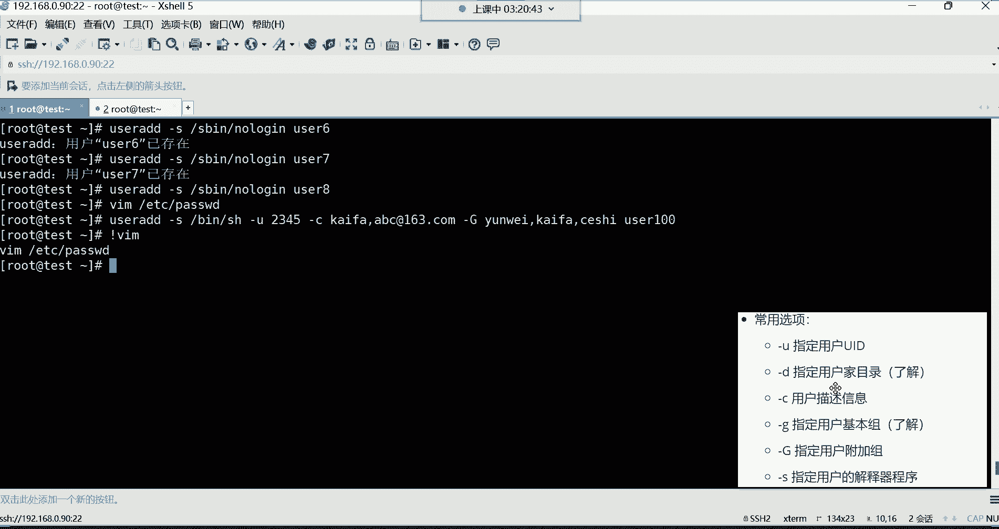

## 总结

本节课中我们一起学习了Linux用户管理的基础知识。我们了解了用户账号的分类和作用，掌握了使用 `useradd` 命令创建用户的方法，并深入剖析了核心配置文件 `/etc/passwd` 的结构与含义。我们还学习了 `useradd` 命令的常用选项来定制用户属性，以及使用 `id` 命令查看用户信息。

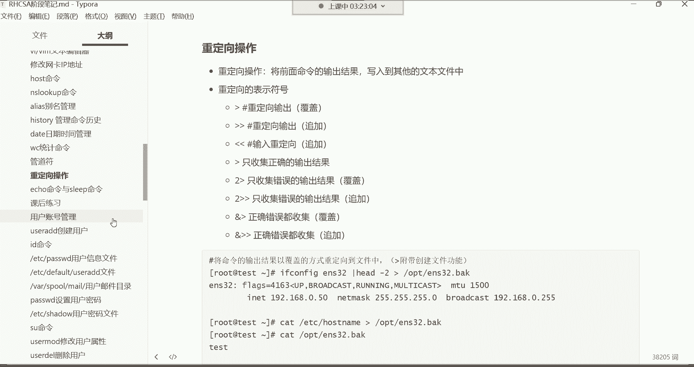

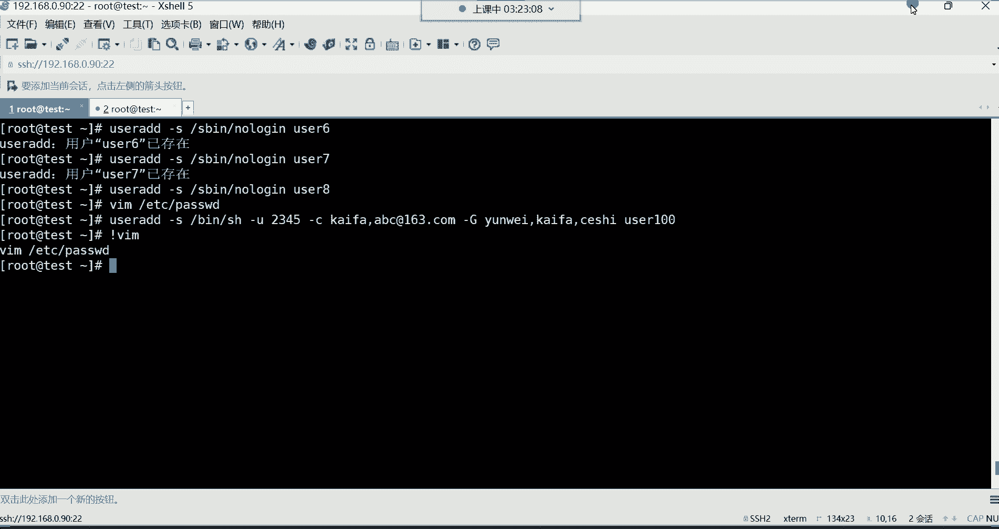

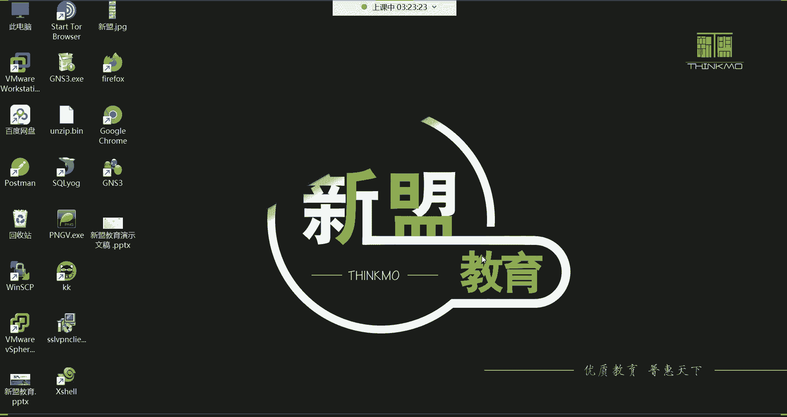

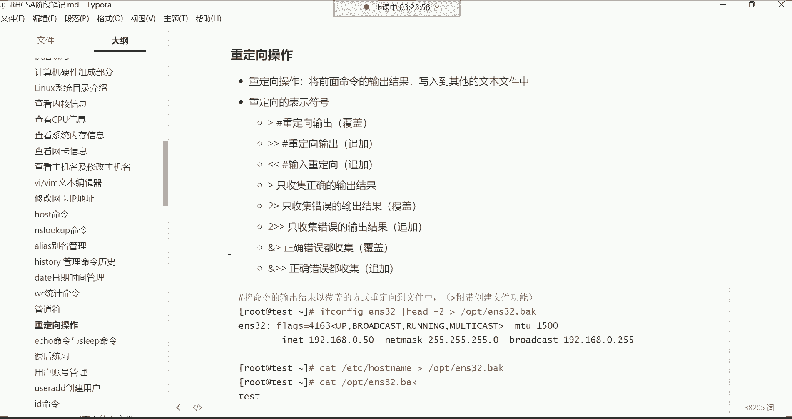

理解用户和组的概念是后续学习文件权限与归属管理的基础。对于初学者，重点在于理解 `/etc/passwd` 文件的7个字段和 `useradd`、`id` 命令的基本用法，无需死记所有选项，在实践中查阅即可。