# Linux运维培训教程：1：云计算与Linux系统介绍 🚀

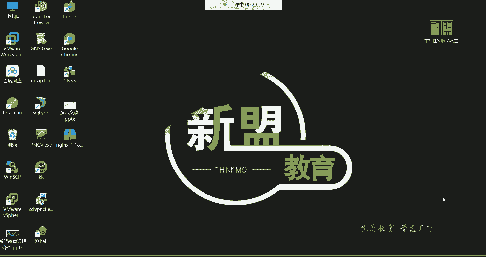

在本节课中，我们将要学习云计算的基本概念、Linux系统的起源与核心知识，以及它们在现代IT行业中的角色和应用。通过本课，你将建立起对后续学习内容的宏观理解。

## 什么是云计算 ☁️

云计算在20年前是一个相对模糊的概念。如今，它已成为互联网基础设施的核心。简单来说，**云计算的本质是网络资源的出租**。

这类似于日常生活中的租房或网吧消费。云厂商（如阿里云、AWS）建立并维护大型数据中心，用户无需自建机房、购买物理服务器，只需按需租用云平台上的资源（如云主机）来运行自己的网站或应用。用户按使用量（开机时长）或包年包月的方式付费，而硬件维护、电力、网络等底层设施均由云厂商负责。

## 云计算的三种服务模式

云计算主要提供三种层次的服务，以满足不同用户的需求。

以下是三种主要的服务模式：

*   **IaaS（基础设施即服务）**：为用户提供最基础的计算资源，如CPU、内存、磁盘和网络。这就像租用了一台“裸机”，用户需要自己安装操作系统并部署应用。
    *   **核心公式/概念**：`IaaS = 基础硬件资源（CPU， 内存， 存储， 网络）`
*   **PaaS（平台即服务）**：在IaaS的基础上，为用户提供一个现成的软件开发和运行平台环境，包含中间件、数据库、开发工具等。用户只需专注于自身业务的开发与部署。
    *   **核心公式/概念**：`PaaS = IaaS + 软件平台/框架（如运行环境、监控工具）`
*   **SaaS（软件即服务）**：这是最顶层、最完整的服务模式。用户直接使用云上现成的软件应用（如企业邮箱、在线办公套件），无需关心任何底层的技术细节，包括软件的安装、维护和升级。
    *   **核心公式/概念**：`SaaS = 完整的、可直接使用的软件服务`

上一节我们介绍了云计算的服务模式，本节中我们来看看这一切运行的基础——Linux系统。

## 什么是Linux 🐧

Linux是一个**类Unix的操作系统内核**。内核是操作系统的核心，如同人的大脑，负责管理计算机的所有硬件资源（CPU、内存、磁盘等）和软件协调工作。

*   **读音**：常读作“Li-nucks”或“Lie-nucks”，两者皆可。
*   **起源**：由林纳斯·托瓦兹于1991年开发。它继承了Unix的许多特性，但关键区别在于Linux是**开源且免费**的。
*   **吉祥物**：企鹅（Tux）。选择企鹅象征着Linux像南极一样，不属于任何商业公司，是全世界共享的开源项目。

一个完整的Linux操作系统发行版，是**Linux内核**加上**GNU项目**提供的众多自由软件（如Shell、编译器、工具集）组合而成的，因此也被称为GNU/Linux系统。

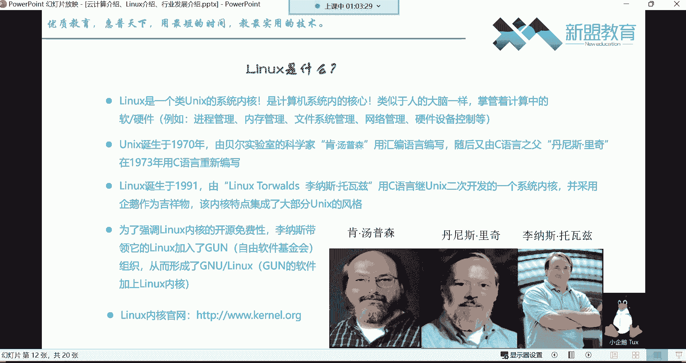

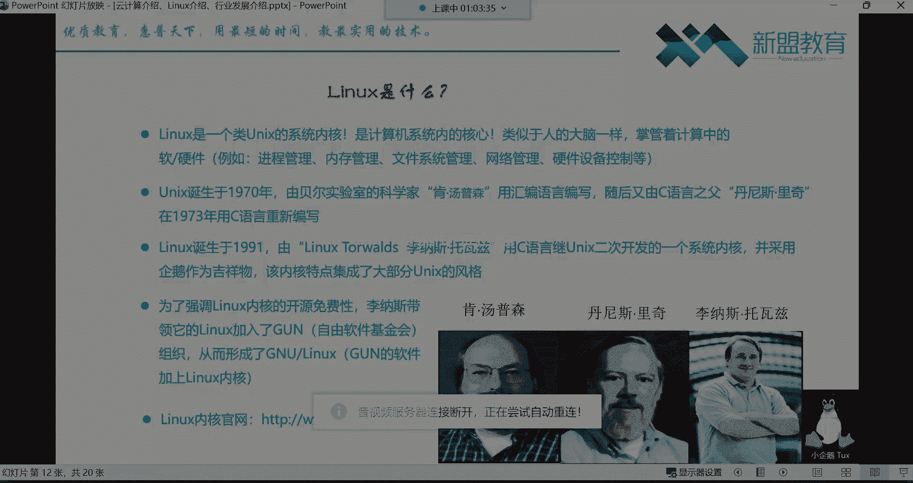

## 基于Linux内核的发行版系统

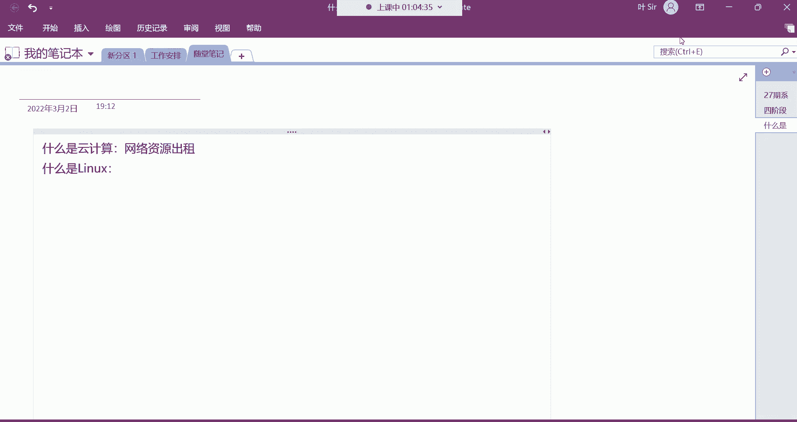

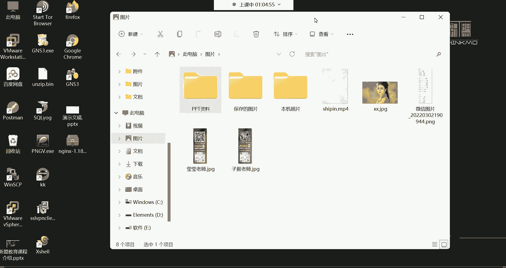

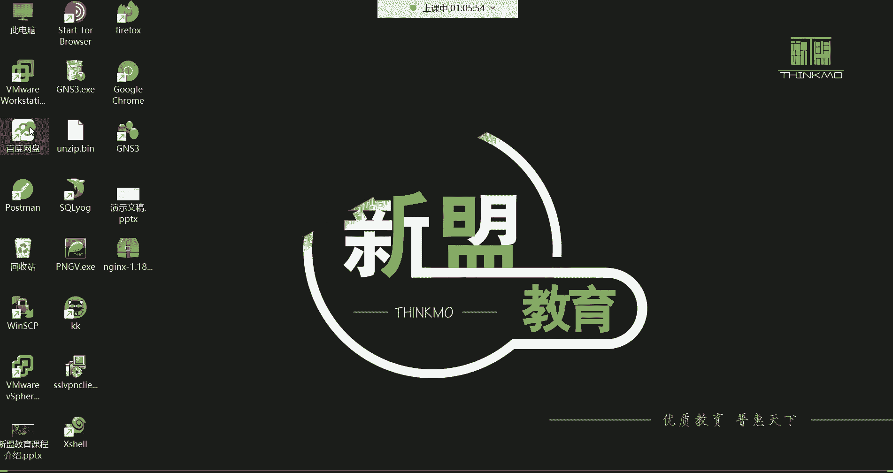

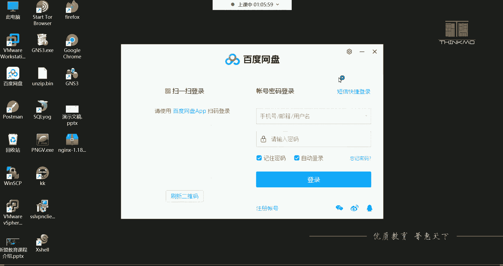

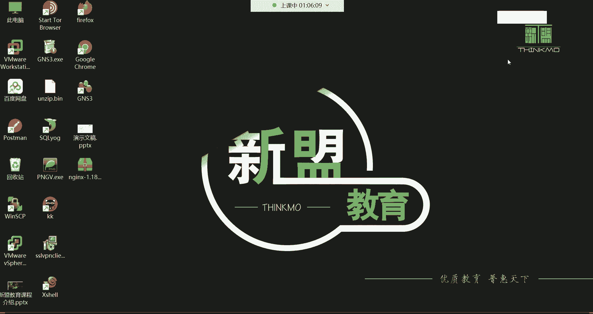

Linux只是一个内核，基于它衍生出了众多各具特色的操作系统发行版。

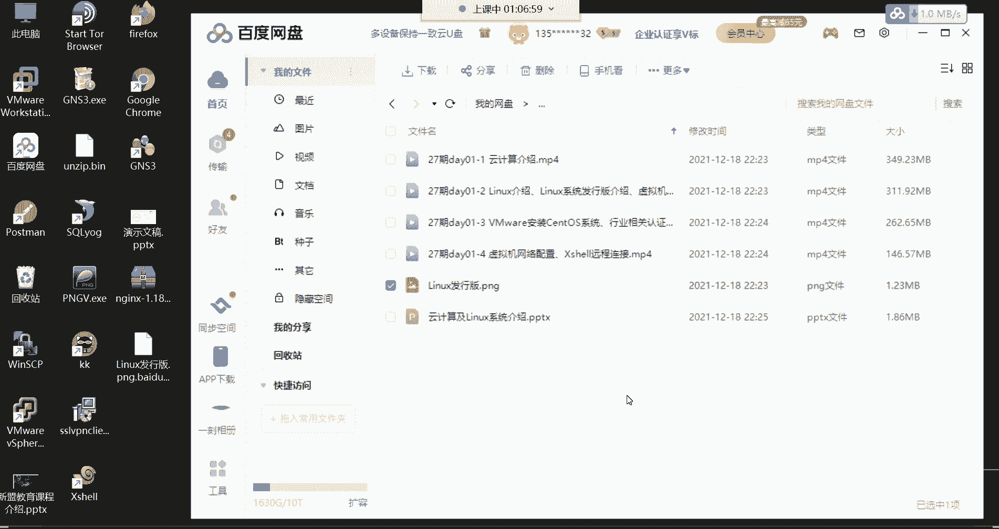

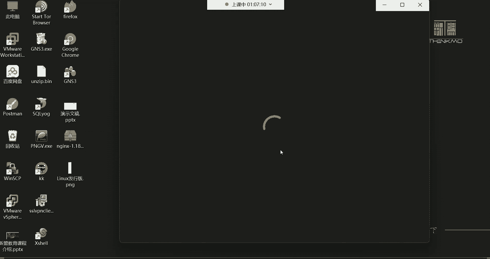

以下是几个常见且重要的Linux发行版：

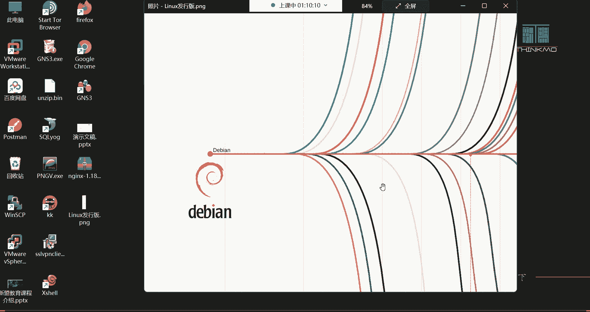

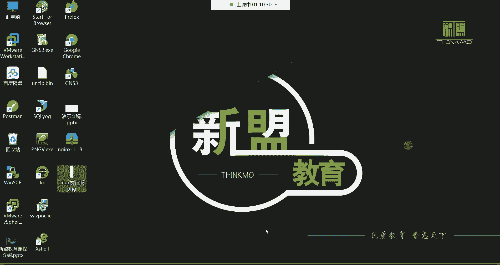

*   **Red Hat Enterprise Linux (RHEL)**：红帽企业版Linux。主要应用于企业服务器领域，性能稳定，提供付费的技术支持服务。
*   **CentOS**：社区企业操作系统。可以看作是RHEL的免费克隆版，同样稳定，广泛应用于服务器，但由社区提供支持。
*   **Fedora**：红帽赞助的社区发行版，以集成最新技术为特点，是RHEL和CentOS新功能的“试验田”。
*   **Ubuntu**：基于Debian，以桌面环境友好易用著称，深受开发者喜爱，也常用于嵌入式开发领域。
*   **Debian**：以稳定性闻名，是许多发行版（包括Ubuntu）的基础。

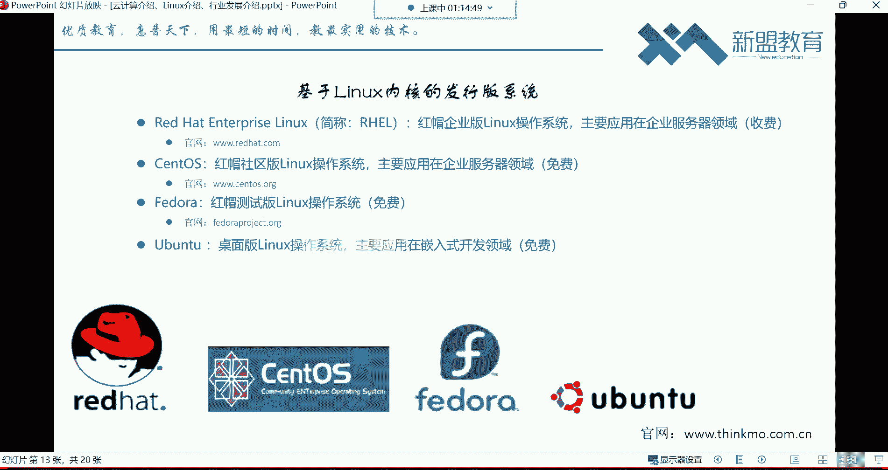

对于服务器运维而言，我们主要学习和使用**RHEL/CentOS**这类没有图形界面或图形界面精简的系统。因为它们更稳定、更节省资源（CPU、内存），所有管理工作主要通过命令行完成，效率更高。

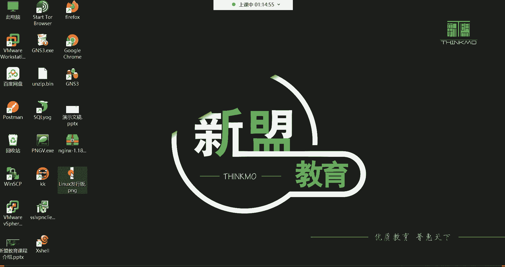

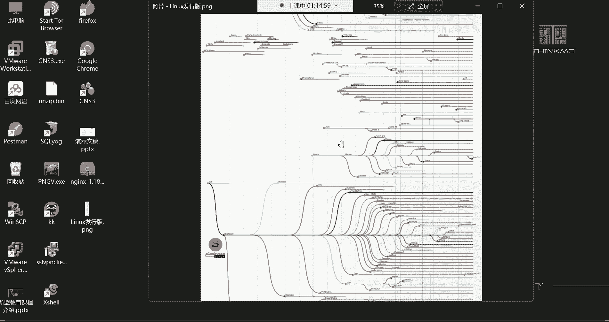

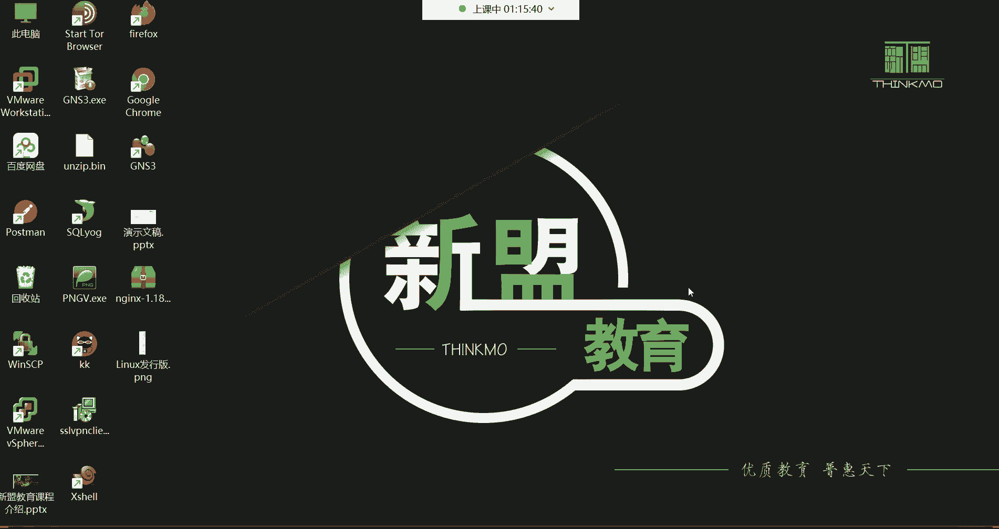

---

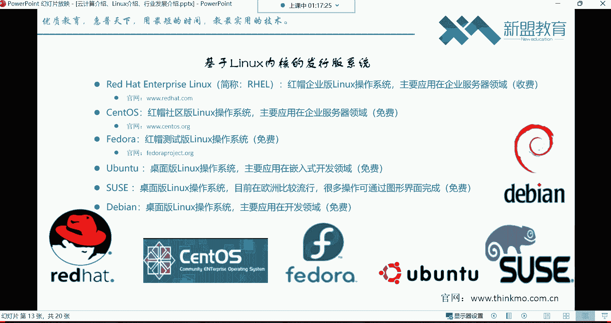

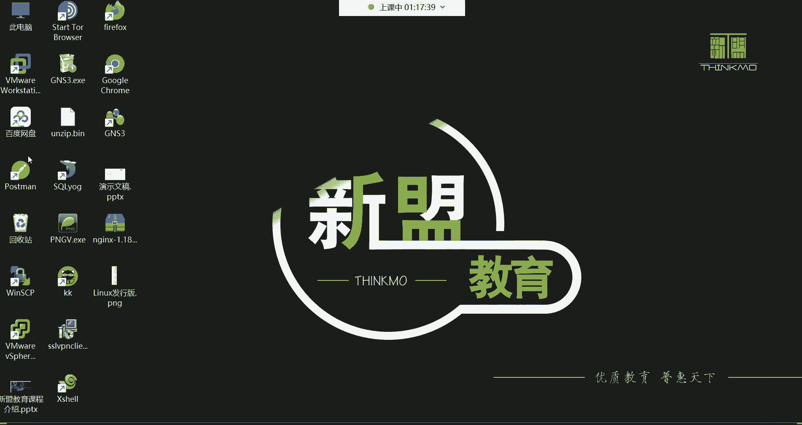

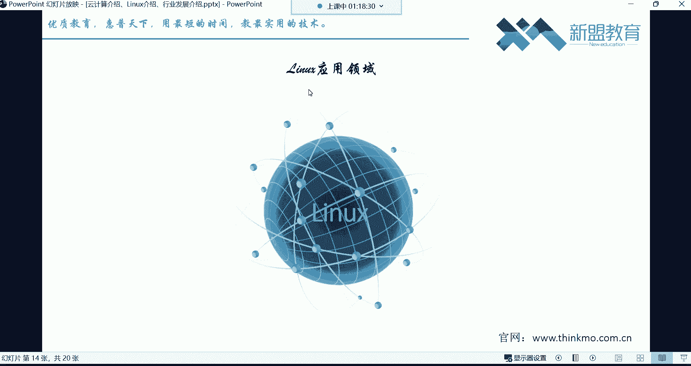

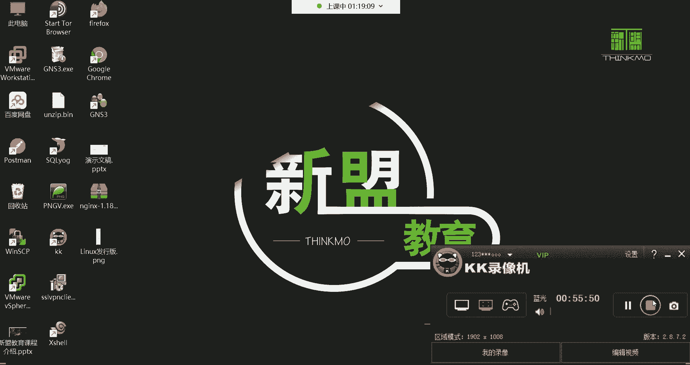

本节课中我们一起学习了云计算的核心概念及其三种服务模式（IaaS， PaaS， SaaS），了解了Linux系统的本质、起源以及主要的发行版。这些基础知识将帮助我们理解后续课程中技术操作的背景和意义。接下来，我们将开始动手安装一个Linux系统。