# Linux运维培训教程：P26：开机自动挂载、GPT分区、LVM逻辑卷 📚

在本节课中，我们将要学习Linux系统中关于存储管理的三个核心主题：如何实现开机自动挂载、GPT分区格式以及LVM逻辑卷的管理。逻辑卷管理是高级存储方案，它能灵活地扩展存储空间，非常适合应对数据增长的需求。

## 概述

我们将从逻辑卷的基本概念讲起，理解其工作原理和优势。然后，通过实际操作演示如何创建卷组和逻辑卷，并将其格式化、挂载使用。最后，我们会配置开机自动挂载，确保系统重启后逻辑卷依然可用。

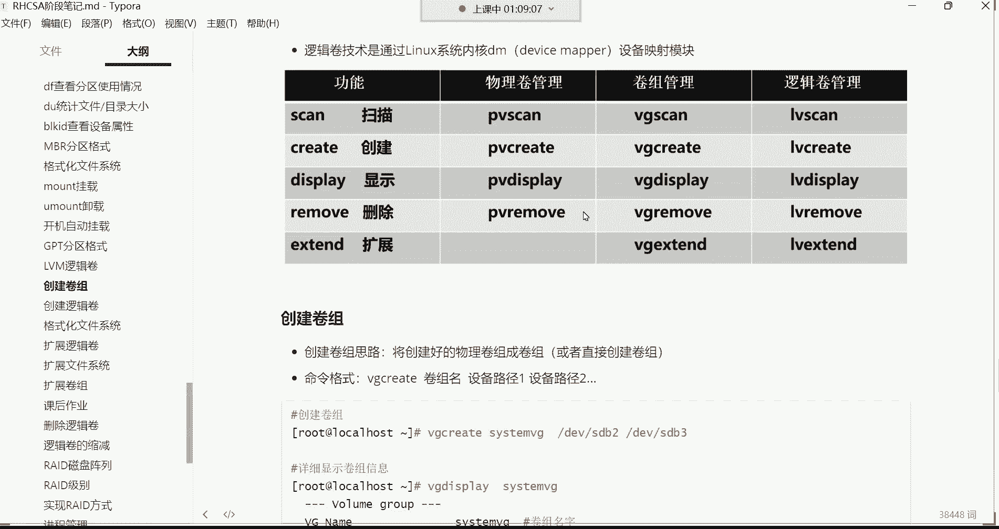

---

## 逻辑卷的核心概念与优势 🧠

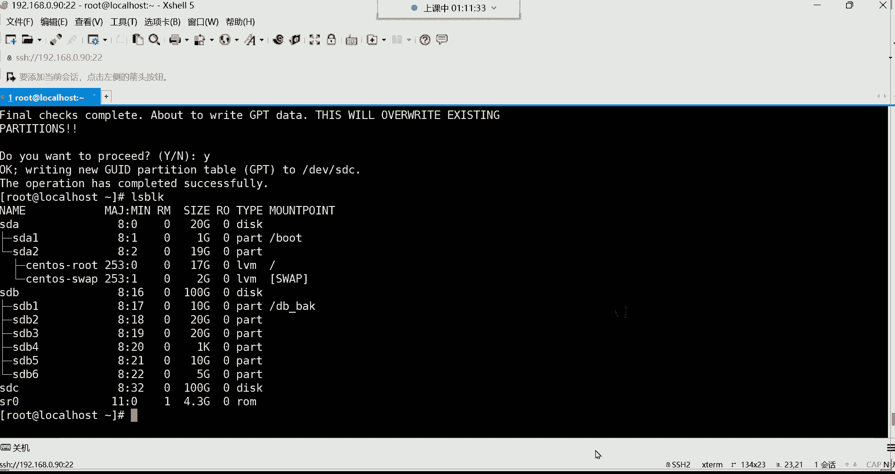

上一节我们介绍了分区的基本管理，本节中我们来看看更灵活的存储管理方案——逻辑卷。

逻辑卷管理（LVM）的核心优势在于**动态扩展存储空间**。你可以将其想象成一个“虚拟硬盘”，这个虚拟硬盘的空间由底层的一块或多块物理硬盘（或分区）提供。当这个虚拟硬盘的空间不足时，我们可以向其中添加新的物理硬盘或分区来扩容，而**整个过程通常不需要格式化现有数据或重启服务**。

**核心流程公式化描述如下：**
```
物理分区/硬盘 -> （组合成） -> 卷组 (VG) -> （从卷组中划分） -> 逻辑卷 (LV) -> （格式化并挂载） -> 目录使用
```

这意味着，即使最初只分配了较小的空间，后续也可以根据需求轻松增加。例如，系统根目录（`/`）通常就采用逻辑卷格式，以便在空间不足时进行在线扩容。

---

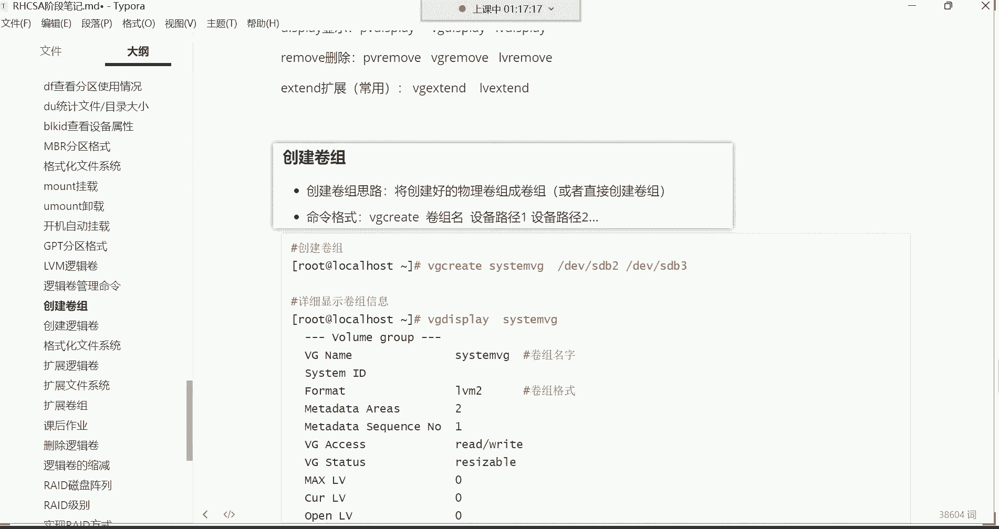

## 逻辑卷管理命令 📝

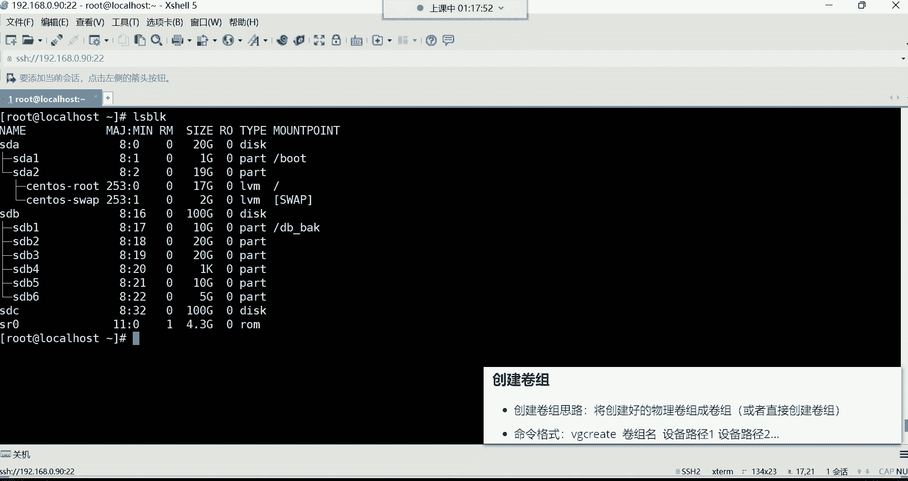

以下是管理LVM所需的常用命令，它们非常有规律，易于记忆。

**命令规律：**
*   `pv*` 命令用于管理**物理卷**。
*   `vg*` 命令用于管理**卷组**。
*   `lv*` 命令用于管理**逻辑卷**。
*   后缀 `create` 代表创建，`display` 代表显示详细信息，`extend` 代表扩展，`remove` 代表删除。

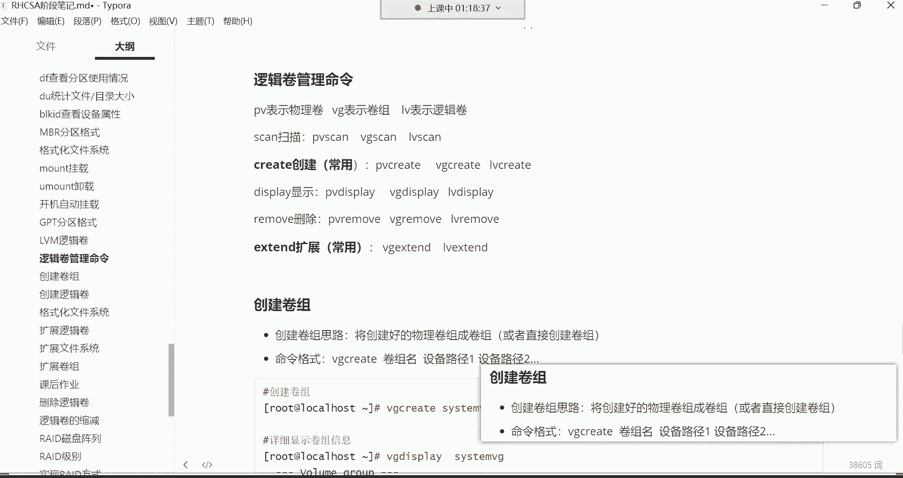

**常用命令列表：**
*   **创建卷组**：`vgcreate [卷组名] [设备路径1] [设备路径2] ...`
*   **创建逻辑卷**：`lvcreate -L [大小] -n [逻辑卷名] [卷组名]`
*   **查看卷组简要信息**：`vgs`
*   **查看逻辑卷简要信息**：`lvs`
*   **扩展逻辑卷**：`lvextend -L +[增加的大小] /dev/[卷组名]/[逻辑卷名]` (需结合 `xfs_growfs` 或 `resize2fs` 命令扩展文件系统)

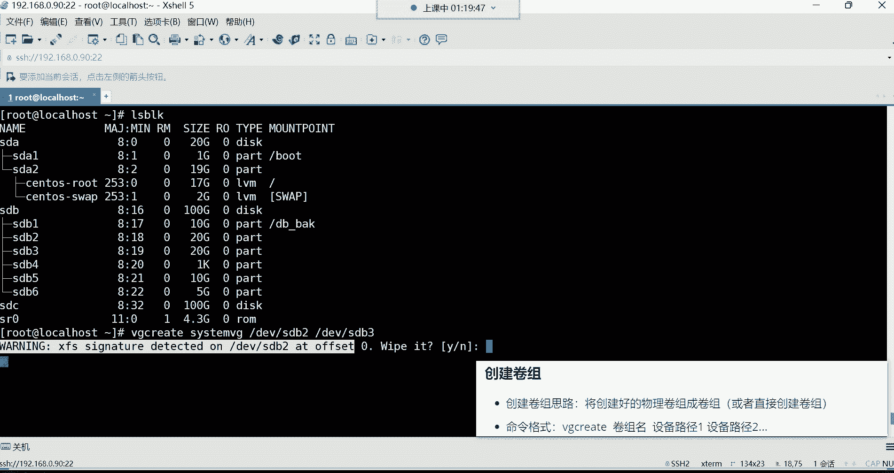

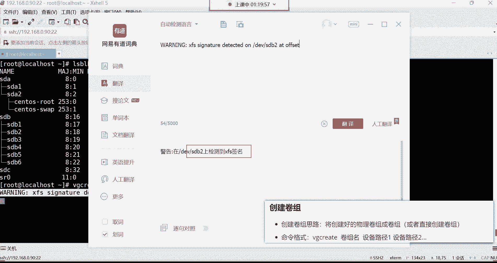

> **注意**：在 CentOS/RHEL 7 及更高版本中，创建卷组时系统会自动将分区初始化为物理卷（PV），因此我们通常无需手动执行 `pvcreate` 命令。

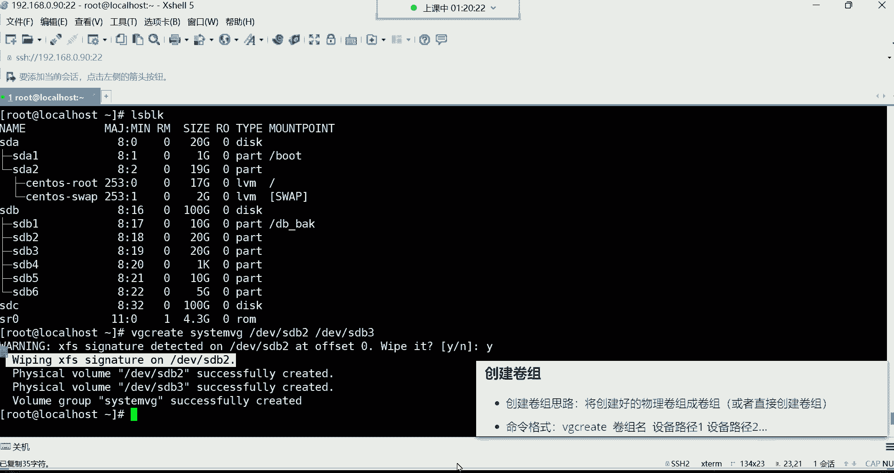

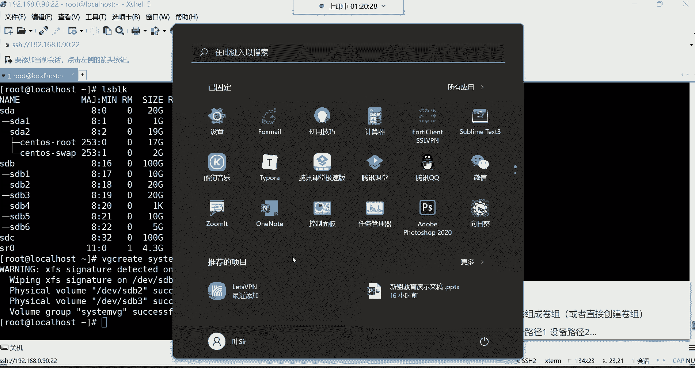

---

## 实战：创建并使用逻辑卷 🛠️

现在，让我们通过一个完整的例子来实践逻辑卷的创建和使用。假设我们有两块空闲分区 `/dev/sdb2` 和 `/dev/sdb3`，我们将它们组成一个卷组，并从中创建一个逻辑卷。

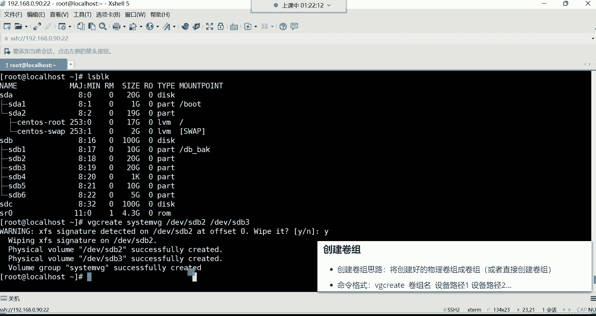

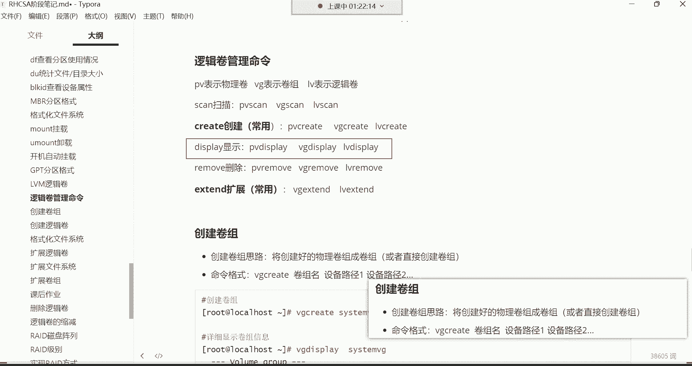

### 第一步：创建卷组 (VG)

我们使用 `vgcreate` 命令创建一个名为 `system_vg` 的卷组，并将两个分区加入其中。

```bash
vgcreate system_vg /dev/sdb2 /dev/sdb3
```
执行命令时，系统可能会提示检测到现有文件系统签名并询问是否擦除，输入 `y` 确认即可。命令成功后，会显示卷组创建完成的信息。

我们可以使用 `vgs` 命令简要查看卷组信息：
```bash
vgs
```
输出会显示卷组名、包含的物理卷数量、逻辑卷数量、总大小和剩余空间。

### 第二步：创建逻辑卷 (LV)

接下来，我们从 `system_vg` 卷组中划分一个大小为20G、名为 `my_lv` 的逻辑卷。

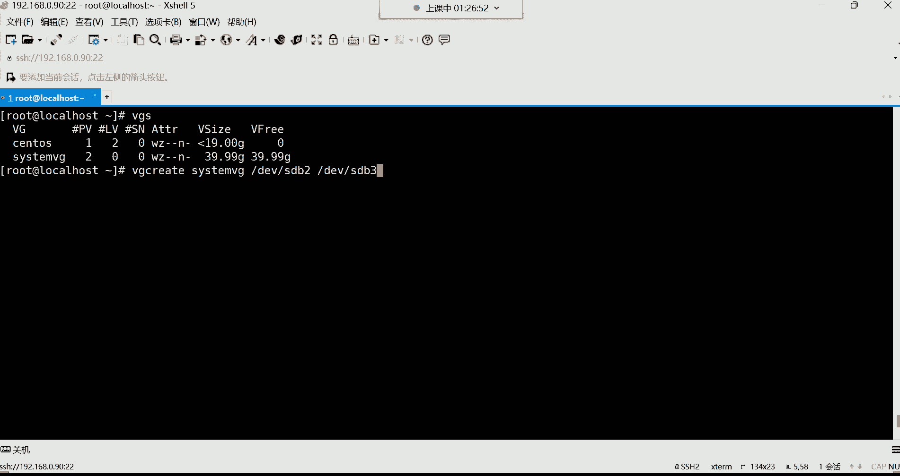

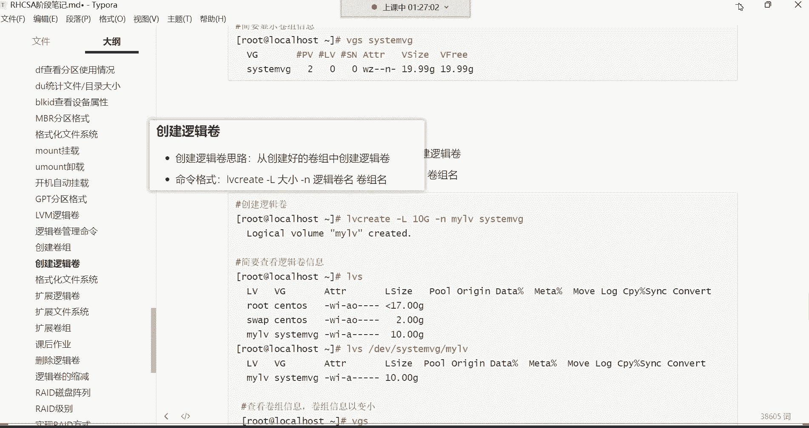

```bash
lvcreate -L 20G -n my_lv system_vg
```
创建成功后，逻辑卷的设备文件路径为 `/dev/system_vg/my_lv`。

使用 `lvs` 命令可以查看逻辑卷的简要信息：
```bash
lvs
```

### 第三步：格式化并挂载逻辑卷

逻辑卷创建后，就像一个普通的分区，需要格式化为具体的文件系统（如XFS）才能使用。

1.  **格式化逻辑卷**：
    ```bash
    mkfs.xfs /dev/system_vg/my_lv
    ```

2.  **创建挂载点并挂载**：
    ```bash
    # 假设挂载到 /web_back 目录
    mount /dev/system_vg/my_lv /web_back
    ```

3.  **验证挂载**：
    ```bash
    df -h /web_back
    ```
    此时应能看到 `/web_back` 目录已挂载，空间约为20G。

---

## 配置开机自动挂载 🔄

为了确保系统重启后逻辑卷能自动挂载，我们需要编辑 `/etc/fstab` 文件。

1.  使用文本编辑器打开配置文件：
    ```bash
    vi /etc/fstab
    ```

2.  在文件末尾添加一行配置：
    ```
    /dev/system_vg/my_lv /web_back xfs defaults 0 0
    ```
    *   第一列：设备路径（`/dev/system_vg/my_lv`）。
    *   第二列：挂载点（`/web_back`）。
    *   第三列：文件系统类型（`xfs`）。
    *   第四列：挂载参数（`defaults`）。
    *   第五列：是否备份（`0` 表示不备份）。
    *   第六列：是否检查文件系统顺序（`0` 表示不检查）。

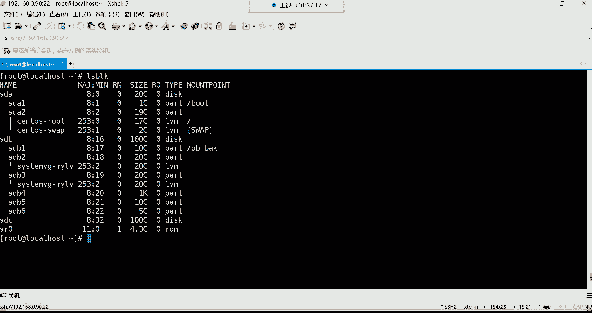

3.  保存并退出编辑器后，测试配置是否正确：
    ```bash
    mount -a
    ```
    如果该命令没有报错，则说明配置成功。你也可以再次使用 `df -h` 命令确认挂载是否生效。

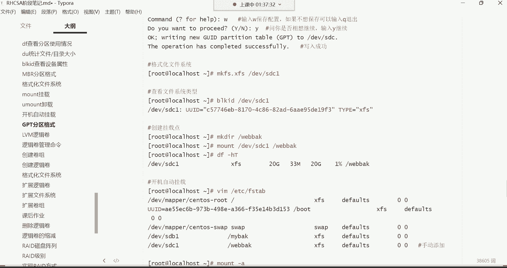

---

## 总结

本节课中我们一起学习了Linux存储管理中的三个重要技能。

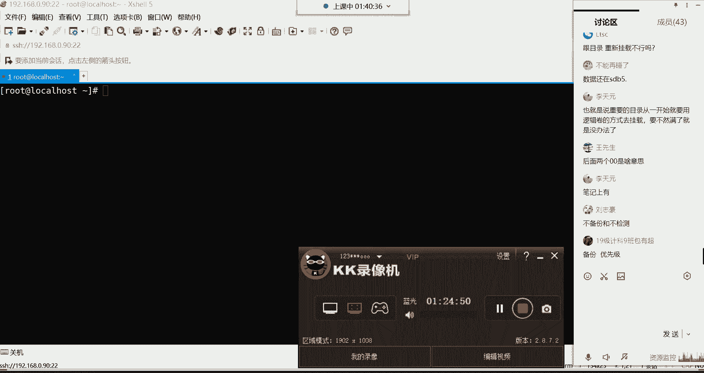

首先，我们理解了**逻辑卷（LVM）** 的工作原理和动态扩容的巨大优势，这是管理可变数据存储需求的利器。接着，我们掌握了LVM的**核心管理命令**，其规律化的前缀（pv/vg/lv）使学习变得轻松。然后，我们通过实战演练了**创建卷组、逻辑卷、格式化及挂载**的完整流程。最后，我们通过编辑 `/etc/fstab` 文件，实现了逻辑卷的**开机自动挂载**，确保了服务的持久性。

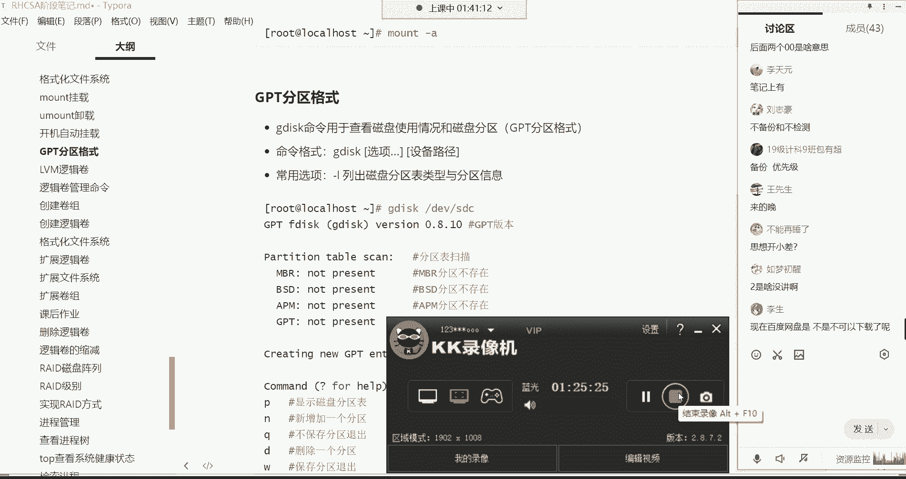

记住，对于像根目录这样重要的、数据量可能持续增长的位置，使用逻辑卷是明智的选择。希望本教程能帮助你建立起对LVM的信心，并在实际运维工作中灵活运用。