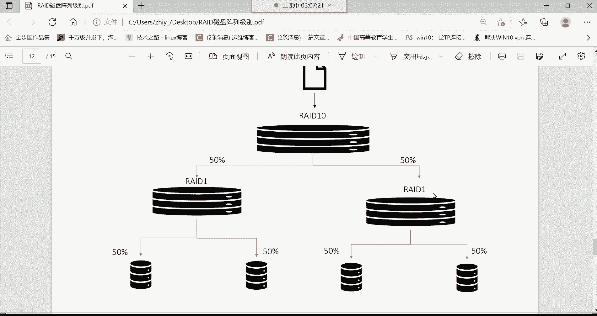
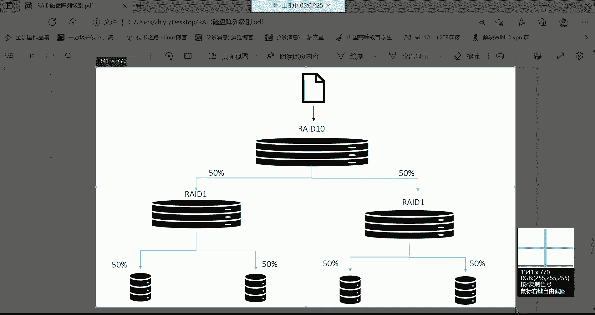
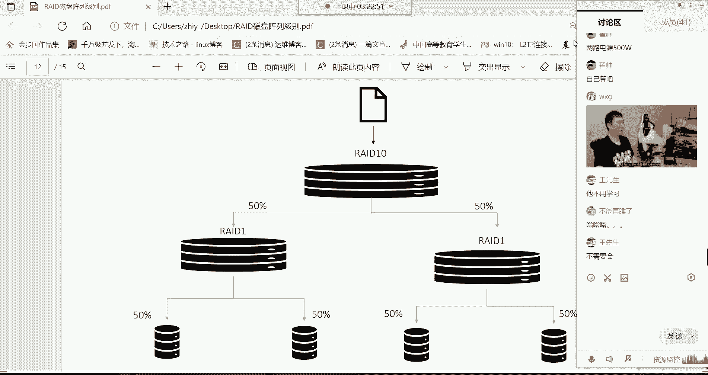
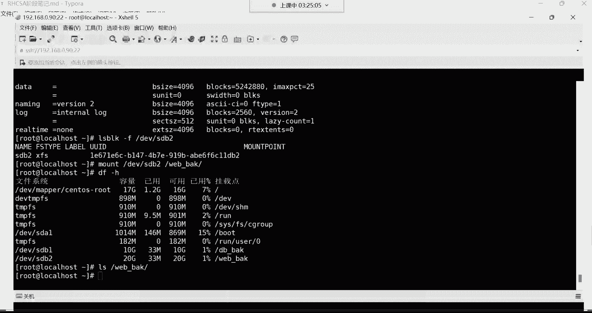

# Linux运维培训教程：1：P28：逻辑卷扩容与RAID磁盘阵列

在本节课中，我们将学习磁盘管理的两个核心高级主题：逻辑卷的扩容和RAID磁盘阵列技术。逻辑卷管理提供了灵活的磁盘空间管理方式，而RAID技术则关乎数据存储的性能与安全。理解这些概念对于构建稳定、高效的服务器环境至关重要。

## RAID磁盘阵列概述

上一节我们介绍了逻辑卷的基本操作，本节中我们来看看如何通过RAID技术提升磁盘的性能和可靠性。RAID（独立磁盘冗余阵列）是一种将多个物理磁盘组合成一个逻辑单元的技术，以实现数据冗余、性能提升或两者兼得。

### RAID 0：条带化

RAID 0至少需要两块磁盘。其工作方式是将一份文件等量拆分，并行写入到不同的磁盘中。

**核心概念**：并行写入。
*   优点：读写速度显著提升。例如，一个10GB的文件，存入单盘需4分钟，在RAID 0中并行写入两块盘，理论上只需2分钟。
*   缺点：无冗余备份功能。任何一块磁盘故障，都会导致数据部分丢失，因此**不安全**。

### RAID 1：镜像

RAID 1同样至少需要两块磁盘。其工作方式是将同一份文件完整地复制并存储到每一块成员磁盘中。

**核心概念**：完全备份。
*   优点：提供完全的数据冗余，安全性高。一块磁盘损坏，数据不会丢失。
*   缺点：读写速度无提升，且可用空间仅为总磁盘容量的一半（另一半用于备份）。存储一份10GB文件，总耗时可能翻倍。

### RAID 5：分布式奇偶校验

RAID 5至少需要三块磁盘。它将数据与校验信息（用于数据恢复）条带化地分布 across 所有磁盘。

**核心概念**：平衡性能与安全。
*   **数据存储方式**：一份文件被拆分后并行写入多块磁盘（提升速度），同时每块磁盘会存储一部分校验信息。
*   优点：兼顾读写速度提升和数据冗余。允许损坏**一块**磁盘而不丢失数据（利用其他盘上的校验信息恢复）。
*   缺点：可用空间为总容量减去一块磁盘的容量（用于存储校验信息）。通常需要配置一块热备盘，以便在成员盘故障时自动替换并重建数据。

### RAID 6：双重分布式奇偶校验

RAID 6是RAID 5的扩展，至少需要四块磁盘。它使用双重校验算法。

**核心概念**：更高的容错能力。
*   优点：允许同时损坏**两块**磁盘而不丢失数据，安全性更高。
*   缺点：校验信息占用更多空间（相当于两块盘的容量），读写开销比RAID 5大。

### RAID 10：镜像+条带化

RAID 10（也称RAID 1+0）至少需要四块磁盘。它先两两组成RAID 1（镜像），再将两个RAID 1组组成一个RAID 0（条带化）。

**核心概念**：RAID 1与RAID 0的结合。
*   优点：既通过RAID 0提升速度，又通过RAID 1保证冗余。允许每组RAID 1中各坏一块盘（共两块）而不丢数据。
*   缺点：成本高，可用空间仅为总容量的一半。

### RAID实现方式

了解各级别的特性后，我们来看看如何实现RAID。

以下是三种主要的实现方式：

1.  **软RAID**：通过操作系统层面的软件实现。成本低，但性能较差，稳定性依赖主机系统，服务器故障可能导致RAID功能失效。
2.  **硬RAID（阵列卡）**：通过专用的RAID控制卡实现。性能好，稳定，且高端阵列卡自带缓存和电池，可在服务器意外断电时保护缓存中的数据。这是企业中最常见的方案。
3.  **外置磁盘阵列柜**：大型独立设备，用于高端或大型服务器，提供极高的性能和扩展性，但成本非常昂贵。

**阵列卡配置**：服务器开机时，根据阵列卡型号按特定快捷键（常见如`Ctrl+R`）进入配置界面，按照说明书选择磁盘和RAID级别进行创建即可。

## 课程总结与作业

本节课中我们一起学习了逻辑卷扩容的后续步骤以及RAID磁盘阵列技术。我们详细探讨了RAID 0、1、5、6、10等常见级别的原理、优缺点及适用场景，并介绍了软RAID、硬RAID和外置阵列柜三种实现方式。

**本周重点掌握**：
1.  `tar`命令进行打包和压缩。
2.  磁盘分区（MBR/GPT）、格式化与挂载的命令。
3.  逻辑卷的完整生命周期管理：创建卷组（`vgcreate`）、创建逻辑卷（`lvcreate`）、格式化、挂载，以及扩展卷组（`vgextend`）和逻辑卷（`lvextend`）。
4.  理解各级别RAID的核心特性。

**课后作业**：
请在你的实验环境中，为系统的根分区（通常是一个逻辑卷）扩容40GB空间。这需要你综合运用添加物理磁盘、创建物理卷、扩展卷组、扩展逻辑卷以及扩展文件系统等一系列操作。