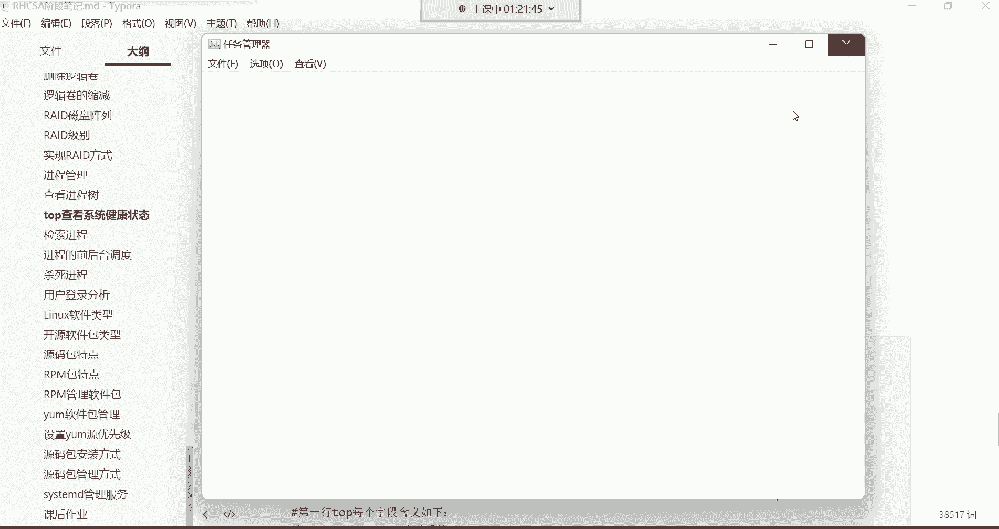
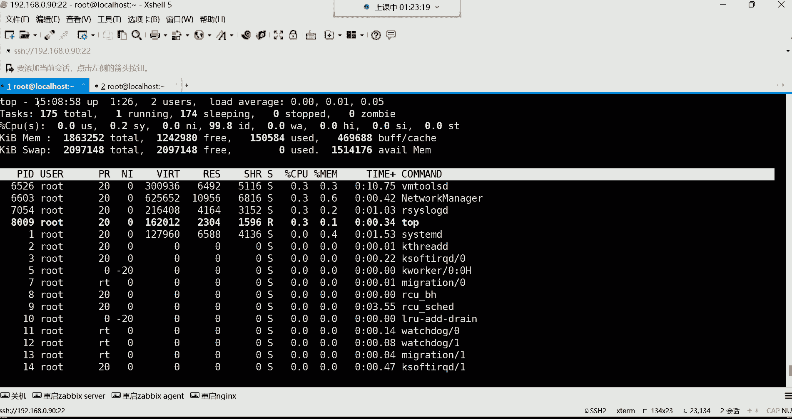
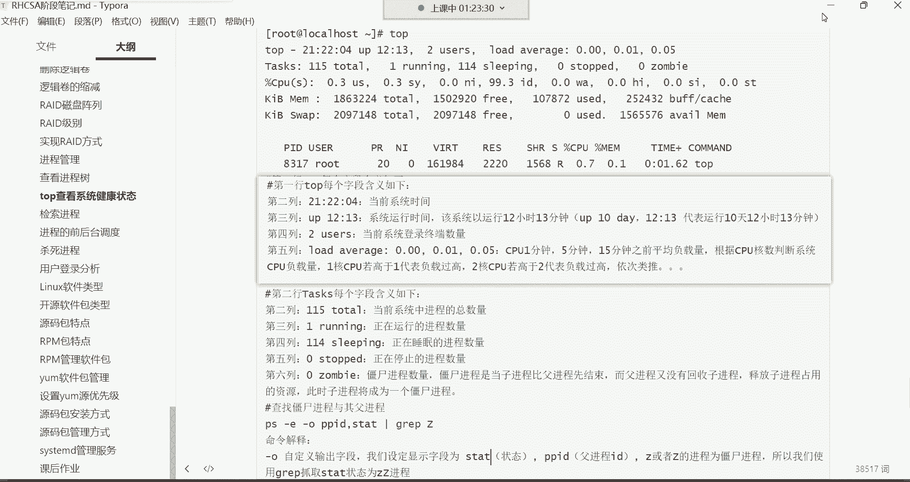
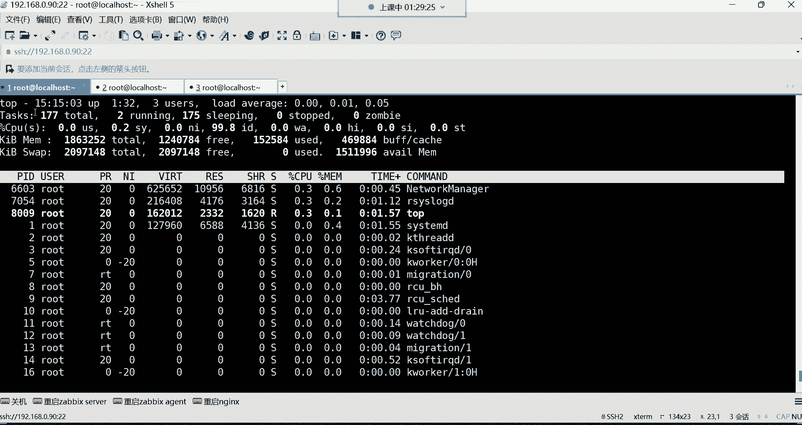
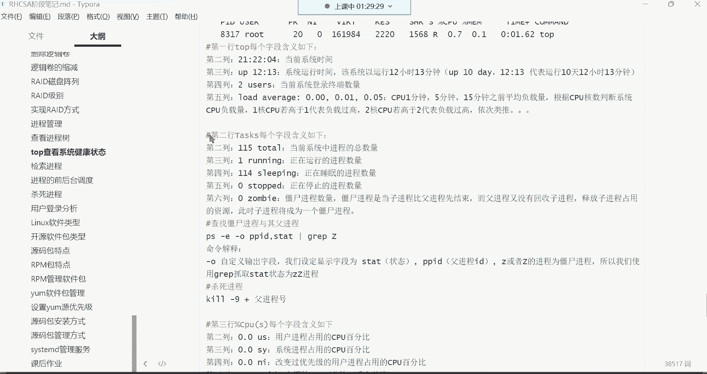
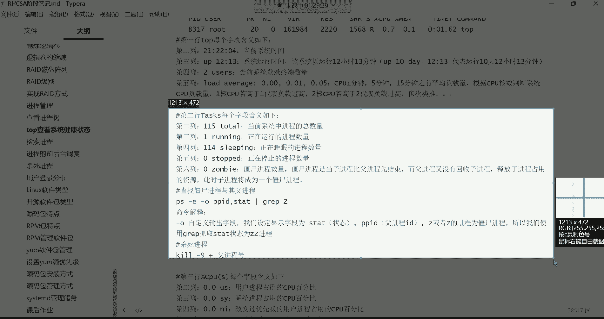
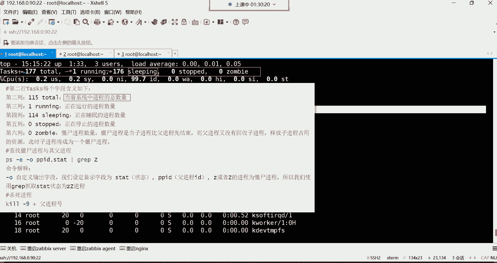
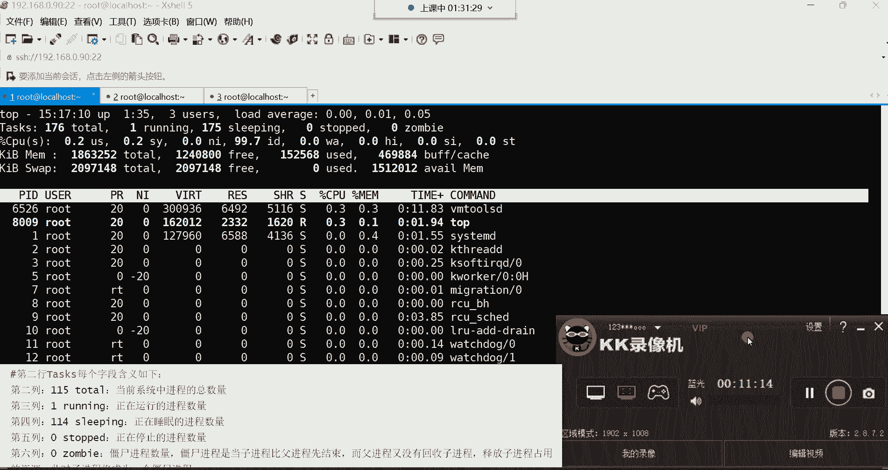

# Linux运维培训教程：1：P29：红帽RHCSA-29.top系统健康检查 🔍

在本节课中，我们将要学习 `top` 命令。`top` 命令是一个强大的工具，用于动态监控系统的性能和运行状态，类似于 Windows 系统中的任务管理器。我们将详细解析 `top` 命令输出界面的每一行信息，帮助你理解如何实时查看 CPU、内存和进程等关键系统指标。

---

## 第一行：系统概况与负载

上一节我们介绍了 `top` 命令的基本概念，本节中我们来看看其输出界面的具体含义。首先，我们从第一行开始。

第一行显示了系统的概况信息，从左到右依次为：

*   **当前系统时间**：例如 `15:04`。
*   **系统运行时间**：`up` 后面的时间表示系统自启动后已运行了多久。例如 `1:27` 表示 1 小时 27 分钟。在生产环境中，常用天数表示，如 `365 days`。
*   **当前登录终端数**：`2 users` 表示当前有 2 个终端登录到系统。此数字统计的是终端会话数量，而非用户数量。
*   **系统平均负载**：`load average` 后的三个数值分别表示系统在最近 1 分钟、5 分钟和 15 分钟内的平均负载。这个数值需要结合 CPU 核心数来解读。例如，对于一个 4 核 CPU，负载为 `1.0` 意味着有 1 个核心的负载达到 100%；负载为 `4.0` 则意味着所有核心均满负荷运行。

## 第二行：进程摘要信息

了解了系统整体负载后，我们来看第二行，它提供了进程的摘要信息。

第二行 `Tasks` 显示了系统中进程的状态统计，各列含义如下：

*   **总进程数**：`total` 表示系统中当前存在的进程总数。
*   **运行中进程数**：`running` 表示正在 CPU 上运行或等待运行的进程数。
*   **休眠进程数**：`sleeping` 表示处于休眠（等待事件）状态的进程数。
*   **已停止进程数**：`stopped` 表示已被停止的进程数。
*   **僵尸进程数**：`zombie` 表示“僵尸”进程的数量。这是一种已终止但未被其父进程清理的进程，少量僵尸进程通常无害，但数量过多可能表明有问题。

---

本节课中我们一起学习了 `top` 命令输出界面的前两行信息。第一行帮助我们掌握系统的运行时间和负载情况，第二行则概括了系统中所有进程的基本状态。理解这些信息是进行系统健康检查和性能分析的基础。在接下来的课程中，我们将继续深入解读 `top` 命令的其他输出行。