# Linux运维培训教程：1：Linux系统软件包类型介绍、源码包与RPM包特点、RPM命令管理软件包


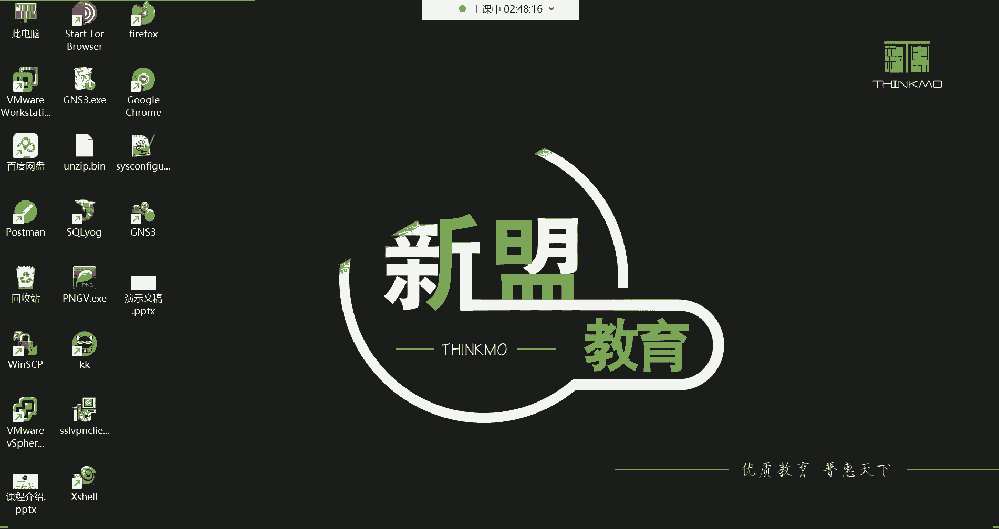


## 概述
在本节课中，我们将要学习Linux系统中软件包管理的基础知识。软件包管理是运维工作的核心技能之一，因为服务器上的所有应用，如网站、数据库等，都需要通过安装和管理软件包来实现。我们将了解软件包的类型、源码包与RPM二进制包的区别，并初步学习如何使用RPM命令来管理软件包。


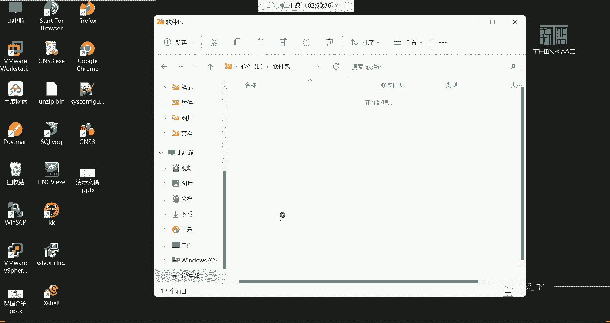


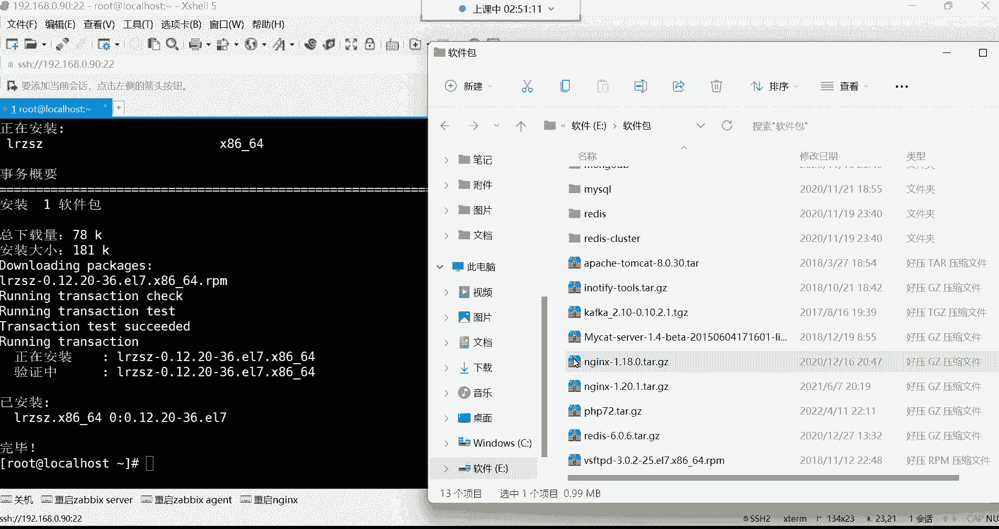

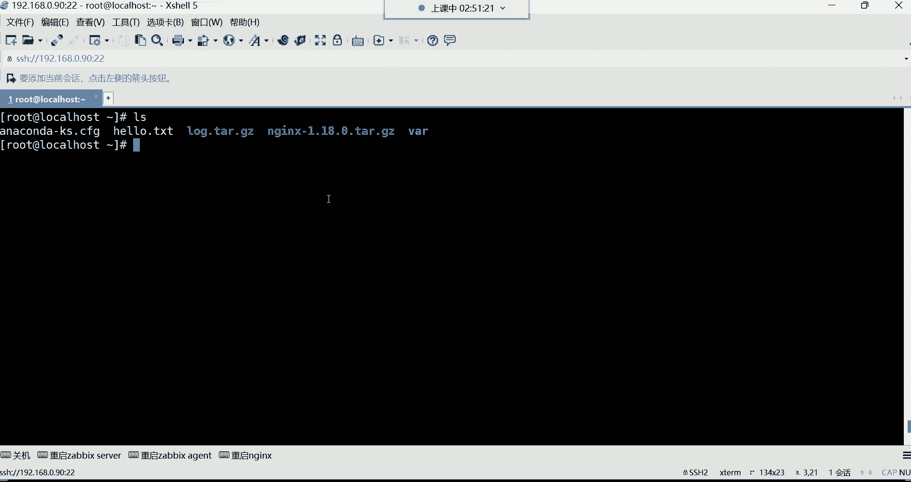

## 软件包类型与开源概念
在开始学习具体的管理命令之前，我们需要先理解Linux系统中软件包的基本概念。Linux世界中的软件主要分为开源软件和闭源软件。

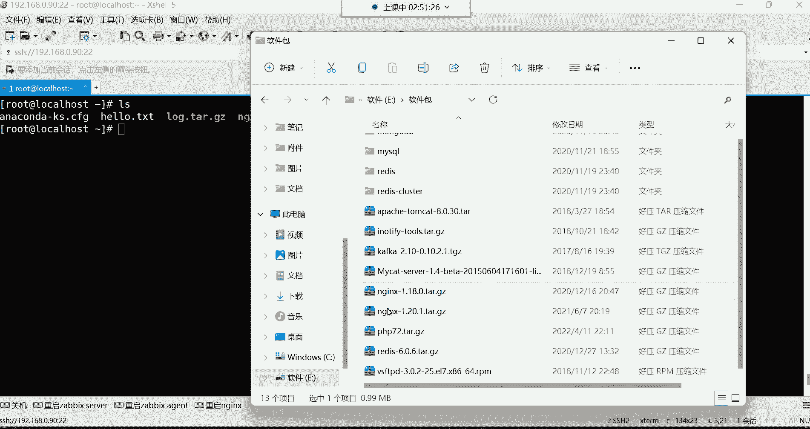

开源软件意味着软件的源代码是公开发布的，用户可以获取并查看，甚至进行二次开发以满足特定需求。例如，淘宝网基于开源的Nginx服务器，开发了更适合自身大访问量需求的Tengine。开源软件的优势在于用户使用放心（代码公开可审查），并且即使原开发者停止维护，社区也可能会继续维护和更新。


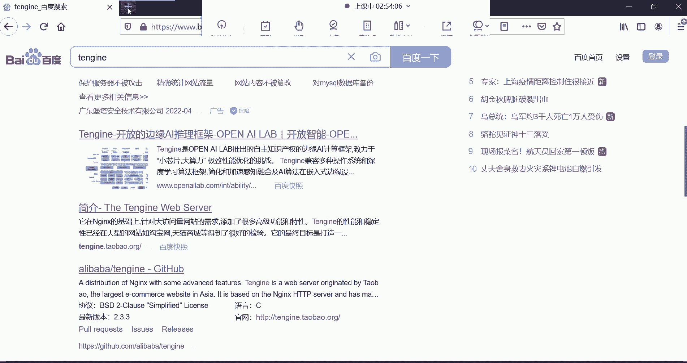

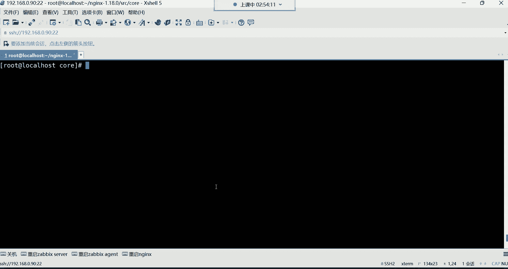


闭源软件则相反，其源代码不公开，用户无法查看和修改。例如，Windows操作系统就是闭源软件。如果闭源软件停止维护，用户将很难自行解决问题。

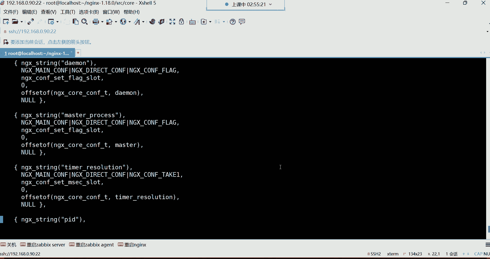


需要注意的是，开源并不完全等同于免费。有些开源软件可能会对高级功能、技术支持或特定服务收费。


## 源码包与RPM包的特点
Linux下的开源软件包主要有两种形式：源码包和二进制包（在Red Hat系列系统中常称为RPM包）。它们各有特点，适用于不同的场景。


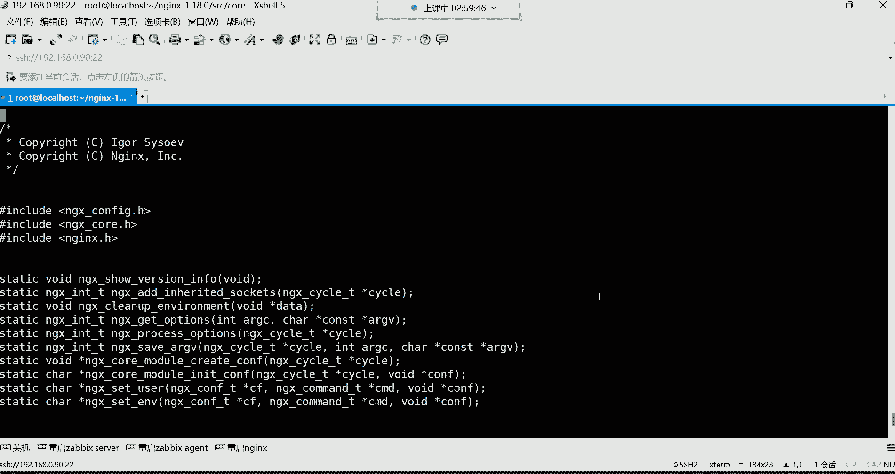

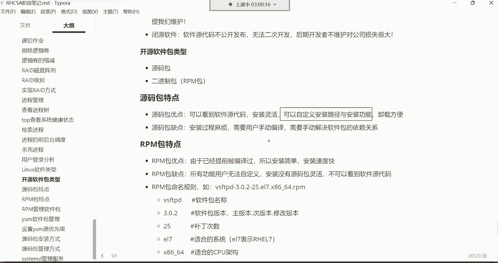

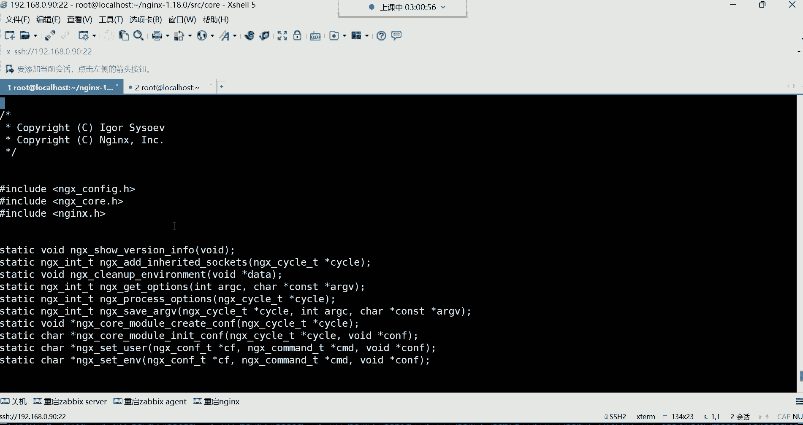

### 源码包
源码包是直接包含软件原始代码的压缩包，例如 `nginx-1.18.0.tar.gz`。解压后，你可以在 `src` 目录下看到用编程语言（如C语言）写成的源代码文件（如 `.c` 文件）。

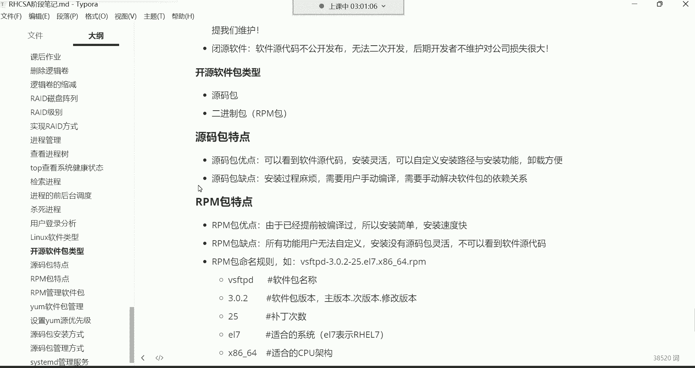


**源码包的特点如下：**
*   **优点：**
    1.  **开放源代码：** 用户可以查看和修改源代码。
    2.  **安装灵活：** 在将源代码“编译”成计算机可执行的二进制文件时，用户可以自定义安装路径（如 `/opt/nginx`）和选择需要安装的功能模块。
    3.  **卸载干净：** 由于文件集中安装在自定义目录，卸载时直接删除该目录即可，没有文件残留。
*   **缺点：**
    1.  **安装过程复杂：** 需要用户手动执行编译步骤。
    2.  **依赖关系复杂：** 需要自行解决软件所需的依赖库问题。


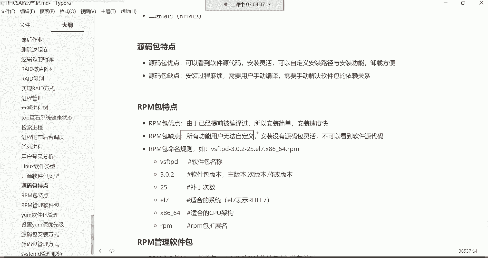

**公式/代码示例：** 一个典型的源码包编译安装过程可能包含以下步骤：
```bash
./configure --prefix=/opt/nginx  # 配置安装路径和功能
make                            # 编译源代码
make install                    # 安装到系统
```

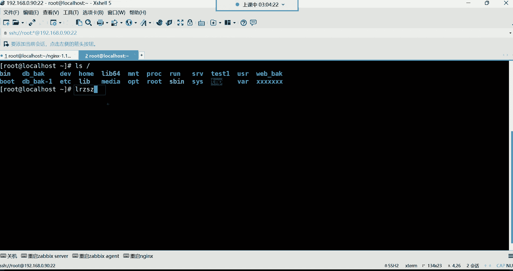

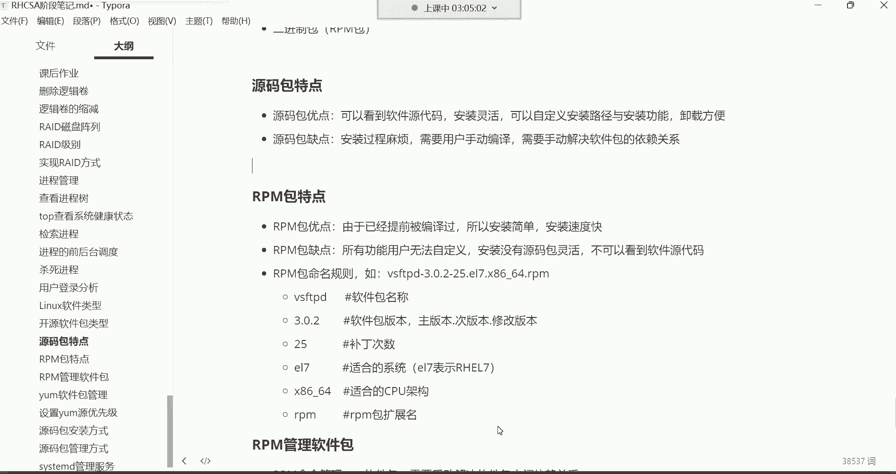

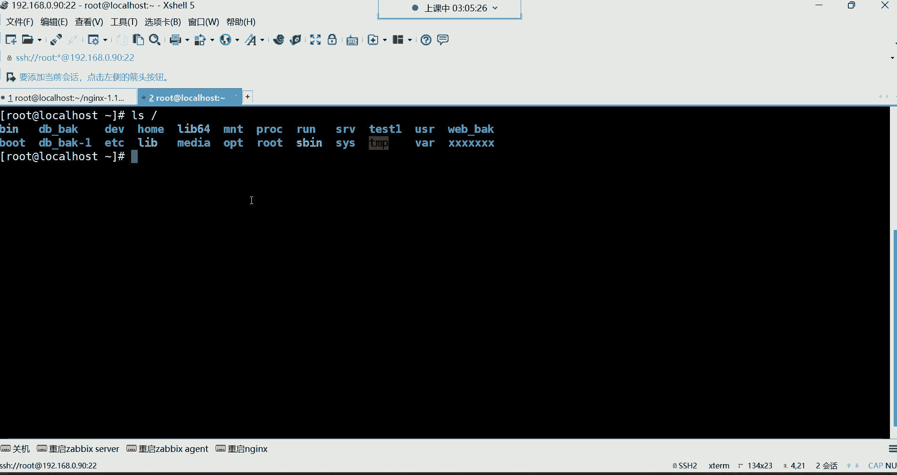

### RPM包（二进制包）
RPM包是已经由软件发行商预先编译好的二进制文件，其后缀名通常为 `.rpm`，例如 `vsftpd-3.0.2-25.el7.x86_64.rpm`。我们之前使用 `yum install` 命令安装的软件都是RPM包。

**RPM包的特点如下：**
*   **优点：**
    1.  **安装简单快捷：** 因为已经编译好，可以直接安装，无需手动编译。
    2.  **安装速度快：** 省去了编译的时间。
*   **缺点：**
    1.  **无法自定义功能：** 安装的是官方预编译的版本，包含了几乎所有功能，用户无法选择。
    2.  **无法自定义安装路径：** 安装位置由包定义，用户无法指定。
    3.  **看不到源代码：** 因为是二进制格式。

**选择建议：** 对于简单的软件或快速部署，使用RPM包更为高效。如果企业对软件功能、路径或安全性有严格的自定义要求，则可能需要选择源码包安装。

## RPM包的命名规则与依赖关系
上一节我们了解了两种软件包的特点，本节我们来看看RPM包具体的命名规则以及安装时可能遇到的“依赖关系”问题。

一个典型的RPM包名称包含了丰富的信息：
`vsftpd-3.0.2-25.el7.x86_64.rpm`
*   `vsftpd`：软件包名称。
*   `3.0.2`：软件版本号（主版本.次版本.修订版本）。
*   `25`：发行号，代表该版本软件被打过补丁的次数。
*   `el7`：适合的操作系统平台（`el7` 代表 Red Hat Enterprise Linux 7 / CentOS 7）。
*   `x86_64`：适合的CPU架构（64位）。
*   `rpm`：文件扩展名，表明这是一个RPM包。


使用 `rpm` 命令安装软件时，一个主要的挑战是处理**依赖关系**。依赖是指一个软件包正常运行需要其他软件包或库文件的支持。主要依赖类型有：
1.  **树形依赖：** A包依赖B、C、D包，需要先安装B、C、D，再安装A。
2.  **环形依赖：** A依赖B，B依赖C，C又依赖A，形成一个循环，手动解决非常麻烦。
3.  **模块依赖：** 软件包依赖某个特定的库文件（如 `.so` 文件），而这个文件由另一个未知的软件包提供，需要用户自行查找。


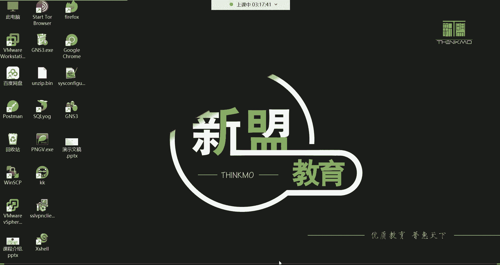


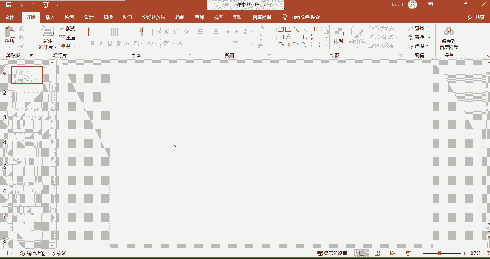

手动使用 `rpm` 命令安装时，需要自行解决这些依赖，这是其不便之处。

## 软件包来源与挂载
在开始使用 `rpm` 命令前，我们还需要知道软件包从哪里来。软件包主要有两个来源：网络下载和系统安装镜像。

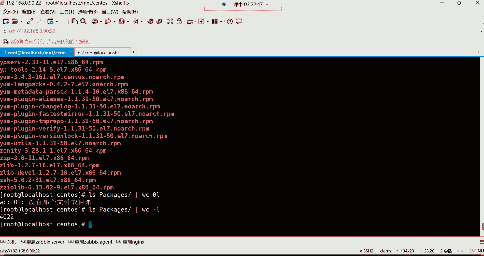


系统安装镜像（如CentOS 7的ISO文件）本身就是一个巨大的软件仓库，里面包含了数千个RPM包。在Linux系统中，光盘或镜像文件被识别为设备文件，例如 `/dev/sr0`（通常有一个软链接 `/dev/cdrom`）。


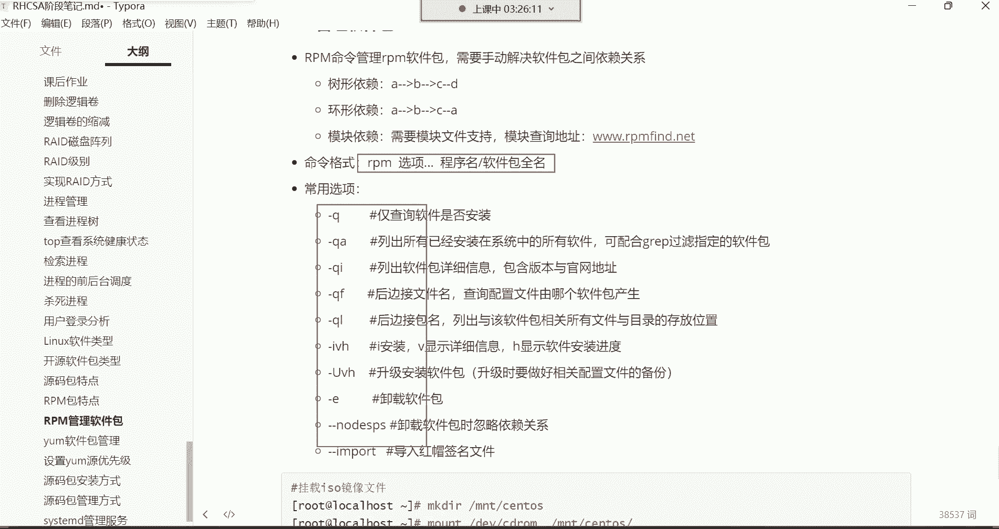

由于设备文件无法直接访问，我们需要将其**挂载**到系统目录树中的一个空目录（挂载点）上。`/mnt` 目录常被用作临时挂载点。

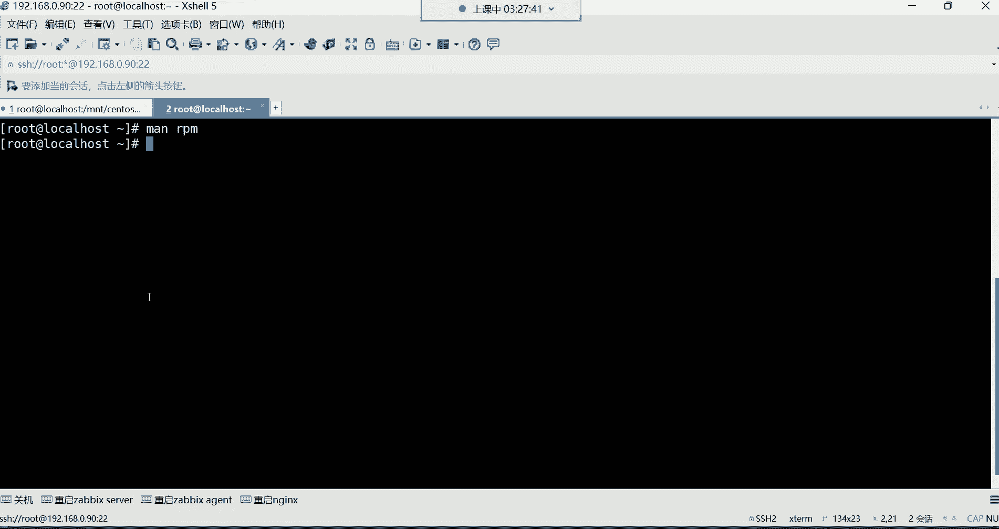


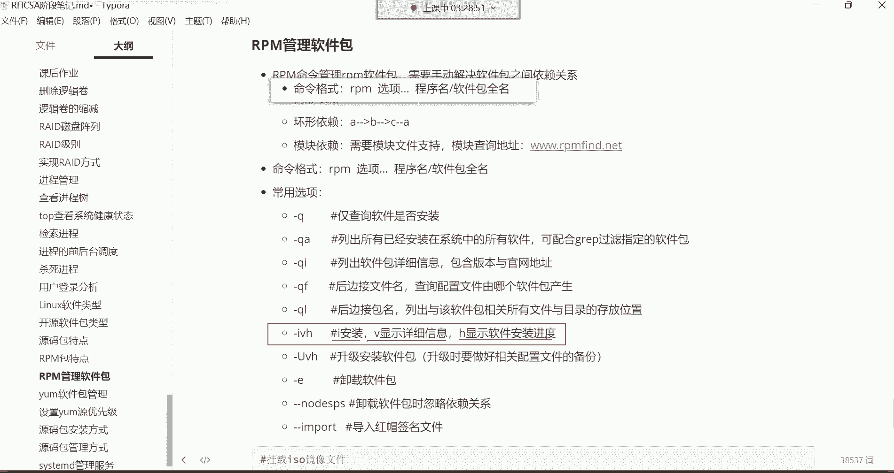

以下是挂载光盘镜像并查看其中软件包的步骤：
```bash
mkdir /mnt/cdrom                     # 创建挂载点目录
mount /dev/cdrom /mnt/cdrom          # 挂载设备到目录
ls /mnt/cdrom/Packages/              # 进入Packages目录查看所有RPM包
ls /mnt/cdrom/Packages/ | wc -l      # 统计软件包数量
```
操作完成后，你就可以访问 `/mnt/cdrom/Packages/` 目录下的所有RPM软件包了。


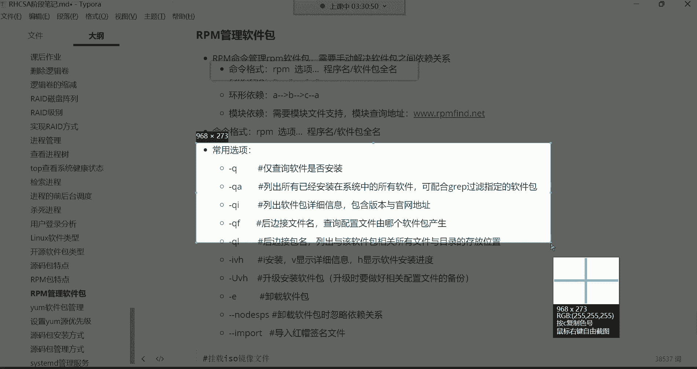

## RPM命令基础：安装与查询
现在我们已经准备好了软件包，可以开始学习最核心的 `rpm` 命令了。`rpm` 命令功能强大，选项繁多，我们首先掌握最常用的安装和查询功能。


### 安装软件包
使用 `rpm` 命令安装软件包时，需要指定软件包文件的**完整路径和全名**。如果当前终端已在软件包所在目录，则可以直接使用文件名。

安装时的常用选项组合是 `-ivh`：
*   `-i`：安装（install）。
*   `-v`：显示详细信息（verbose）。
*   `-h`：显示安装进度哈希标记（hash）。

**命令格式：**
```bash
rpm -ivh 软件包全名.rpm
```
**操作示例：** 安装 `vsftpd` 软件包。
```bash
cd /mnt/cdrom/Packages/              # 进入软件包目录
rpm -ivh vsftpd-3.0.2-25.el7.x86_64.rpm  # 安装vsftpd
```
**注意：** 安装时必须使用完整的包名（可通过按 `Tab` 键自动补全）。如果遇到依赖错误，需要先手动安装所有依赖包。

### 查询软件包
查询是 `rpm` 命令非常强大和常用的功能。安装后，管理软件使用的是**程序名**（通常与包名相同，但也有例外）。

以下是核心的查询选项：
*   `-q`：查询指定软件包是否安装。
    ```bash
    rpm -q vsftpd  # 查询vsftpd是否安装
    ```
*   `-qa`：列出系统中所有已安装的RPM软件包。常与 `grep` 命令结合进行过滤。
    ```bash
    rpm -qa | grep vsft  # 过滤名称中包含“vsft”的已安装包
    ```
*   `-qi`：查询已安装软件包的详细信息（版本、开发商、安装时间、描述等）。
    ```bash
    rpm -qi vsftpd
    ```
*   `-ql`：列出某个软件包安装的所有文件及其安装位置。
    ```bash
    rpm -ql coreutils  # 查看coreutils包安装的文件，里面包含很多基础命令
    ```
*   `-qf`：查询某个文件是由哪个软件包安装的。
    ```bash
    rpm -qf /etc/passwd     # 查询/etc/passwd文件来自哪个包
    which cat               # 先查找cat命令的路径
    rpm -qf /usr/bin/cat    # 再查询该路径对应的软件包
    ```


## 总结
本节课中我们一起学习了Linux软件包管理的基础知识。我们首先区分了开源与闭源软件，然后深入探讨了源码包和RPM二进制包各自的优缺点及适用场景。接着，我们了解了RPM包的命名规则和令人头疼的依赖关系问题，并学习了如何挂载系统镜像来获取软件包。最后，我们重点讲解了 `rpm` 命令的安装（`-ivh`）和一系列强大的查询功能（`-q`， `-qa`， `-qi`， `-ql`， `-qf`）。掌握这些查询命令对于日常的系统管理和故障排查至关重要。下节课我们将继续学习 `rpm` 命令的升级、卸载和校验等功能。