# Linux运维培训教程：1.34：软件包管理进阶：版本升级、网络仓库与优先级设置 📦

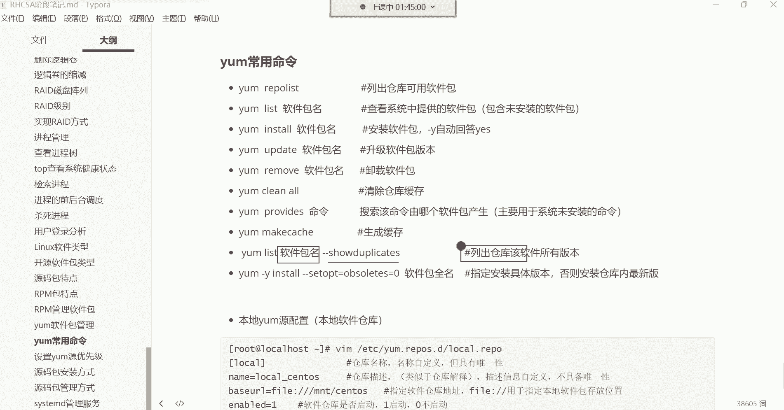


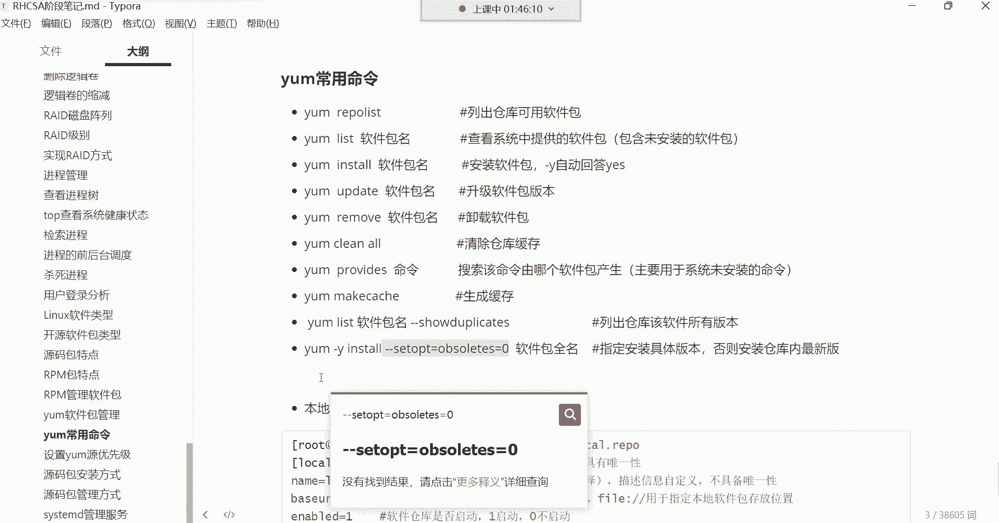

在本节课中，我们将深入学习YUM包管理器的进阶操作。主要内容包括如何指定版本安装与升级软件、配置网络YUM仓库以提高下载效率，以及设置仓库优先级来控制软件包的下载来源。掌握这些技巧，能让你在复杂的运维环境中更灵活地管理软件。

## 软件版本升级与指定版本安装 🔄

上一节我们介绍了YUM的基本安装与卸载。本节中，我们来看看如何安装特定版本的软件包，以及升级时如何保留原有配置。

### 列出仓库中软件包的所有版本
首先，我们需要知道仓库中某个软件包有哪些可用版本。可以使用以下命令格式：
```bash
yum list --showduplicates <软件包名>
```
例如，要列出 `nginx` 的所有版本，命令如下：
```bash
yum list --showduplicates nginx
```
执行后，会显示仓库中所有可用的nginx版本列表。

### 安装指定版本的软件包
如果我们需要安装一个特定的稳定版本（例如 `nginx-1.18.0`），而不是默认的最新版，可以使用以下命令：
```bash
yum install -y nginx-1.18.0
```
通过这种方式，可以精确控制生产环境中软件的版本。


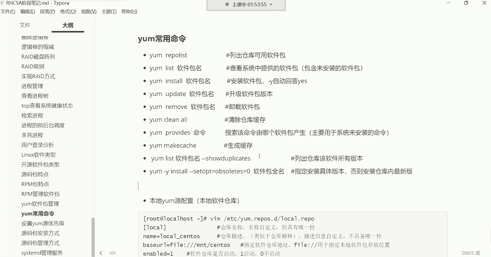

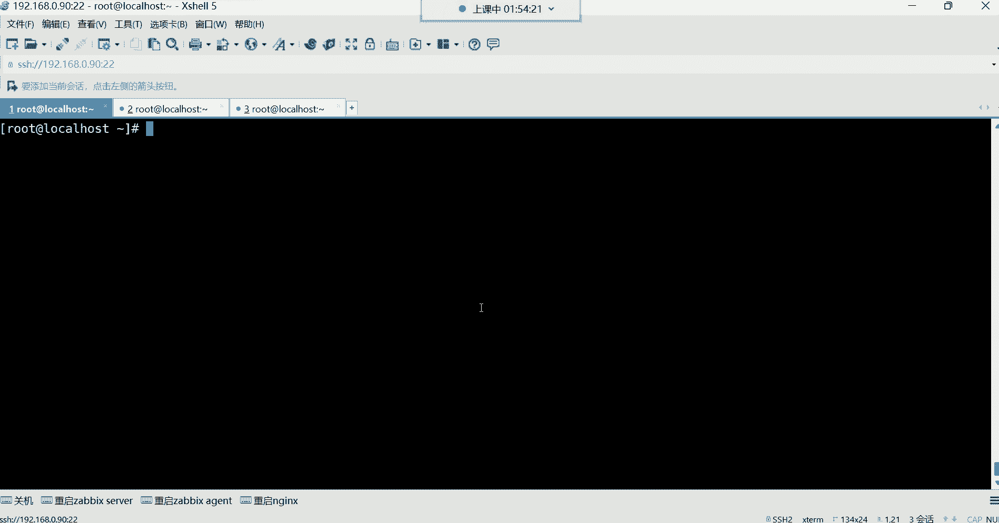

### 升级软件包并验证配置保留
在升级软件时，一个常见的担忧是原有的配置文件是否会被覆盖。现代软件包管理器（如YUM）通常具备智能的升级机制。


1.  **修改配置文件**：在升级前，先对软件的配置文件（例如 `/etc/nginx/nginx.conf`）进行一些自定义修改。
2.  **执行升级命令**：使用 `yum update` 命令升级到新版本。
    ```bash
    yum update nginx
    ```
3.  **验证配置**：升级完成后，再次检查配置文件。你会发现，之前的手动修改通常会被保留下来，而不会被新版本的默认配置覆盖。


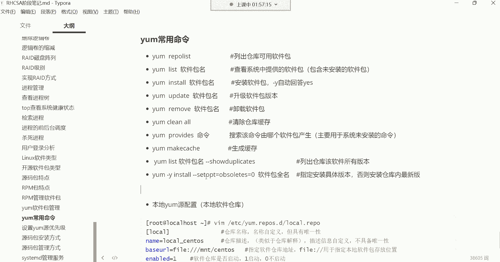

**注意**：虽然现代包管理器很智能，但为了保险起见，在升级关键软件前，**务必手动备份重要配置文件**。

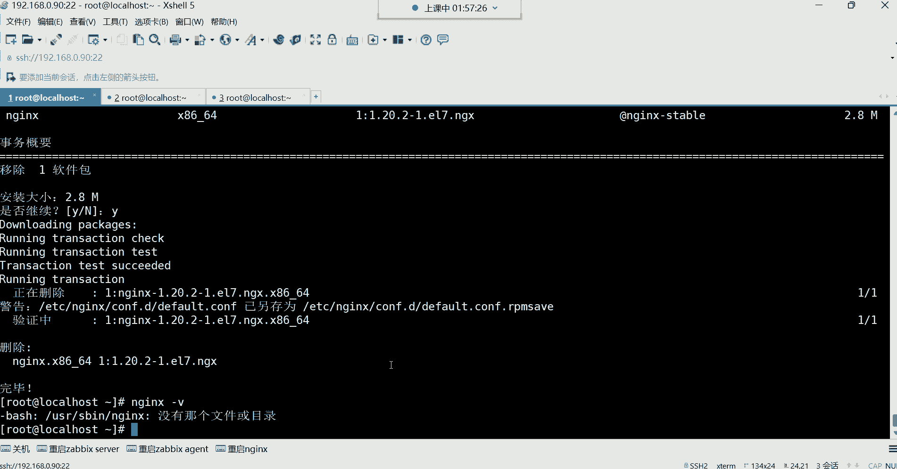


### 卸载软件包
卸载软件包非常简单，使用 `yum remove` 命令即可。现代的YUM在卸载时通常只移除主程序包，而不会自动删除其依赖项，这避免了误删其他程序所需库文件的风险。
```bash
yum remove nginx
```


---

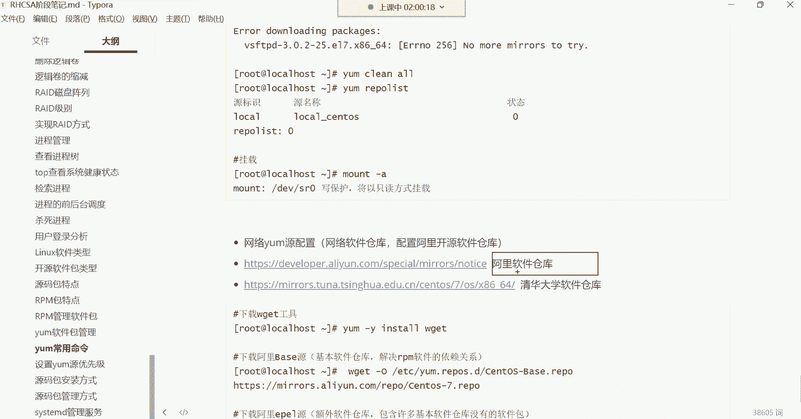


## 配置网络YUM仓库 🌐


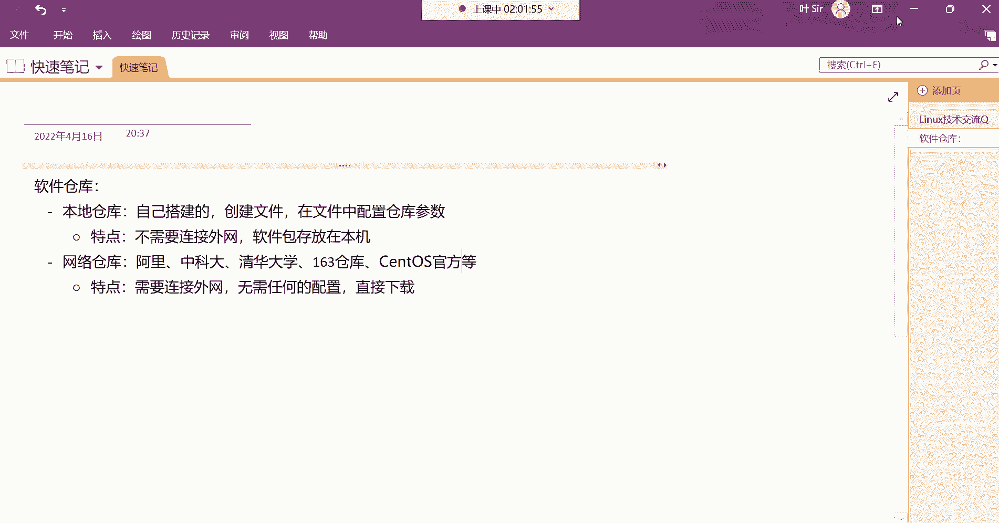


本地仓库的软件包可能不全或不是最新。接下来，我们学习如何配置网络YUM仓库，以获取更丰富的软件资源。

网络仓库（如阿里云、清华大学镜像站）同步自官方源，下载速度更快，软件包更全。配置网络仓库非常简单，通常只需下载其提供的仓库配置文件即可。

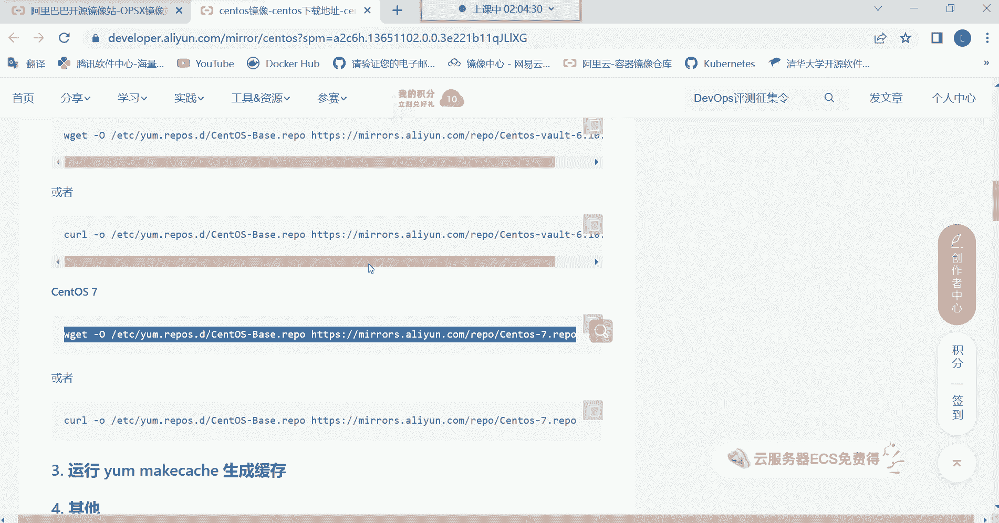

以下是配置阿里云CentOS 7仓库的步骤：

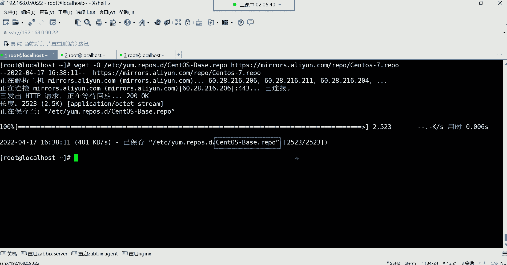

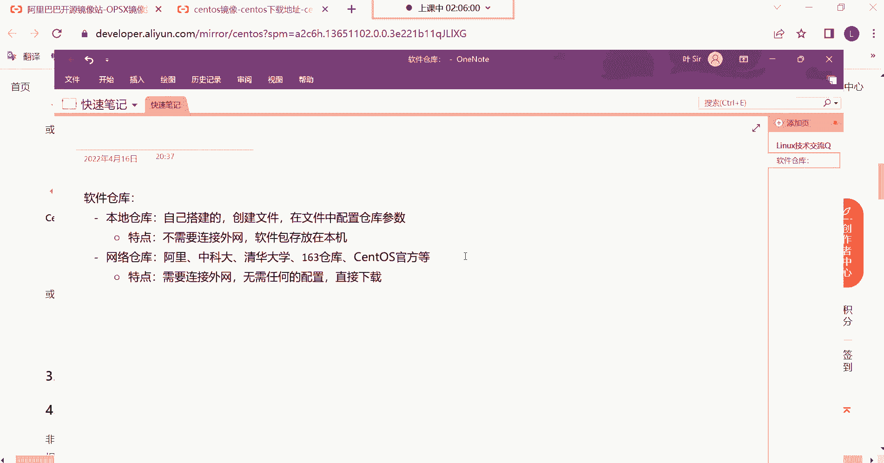

1.  安装下载工具 `wget`（如果尚未安装）：
    ```bash
    yum install -y wget
    ```
2.  使用阿里云提供的命令，下载仓库配置文件到系统默认目录：
    ```bash
    wget -O /etc/yum.repos.d/CentOS-Base.repo https://mirrors.aliyun.com/repo/Centos-7.repo
    ```
    这条命令会从阿里云镜像站下载仓库文件，并保存为 `/etc/yum.repos.d/CentOS-Base.repo`。

配置完成后，你可以使用 `yum repolist` 命令查看新增的网络仓库及其包含的软件包数量。网络仓库文件内部通常定义了多个子仓库（如 `base`、`updates`、`extras`），分别存放不同类型和用途的软件包。

---


## 设置YUM仓库优先级 ⚖️

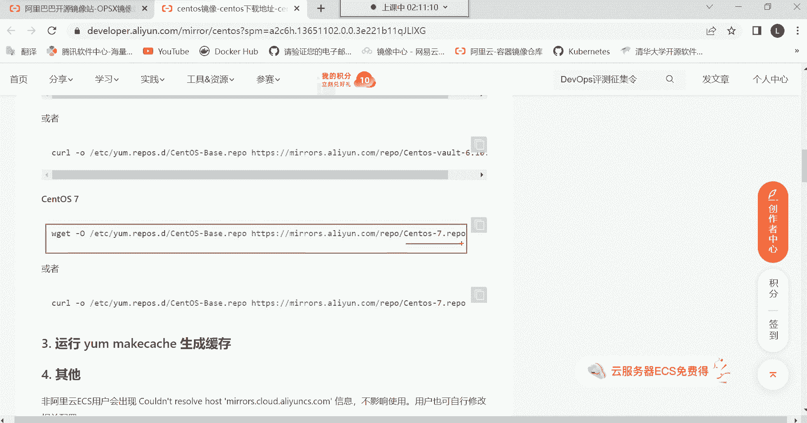


当我们同时配置了本地仓库和多个网络仓库后，YUM在安装软件时会按照一定顺序搜索这些仓库。为了优化下载速度（优先使用本地源）或确保软件来源，我们需要设置仓库优先级。

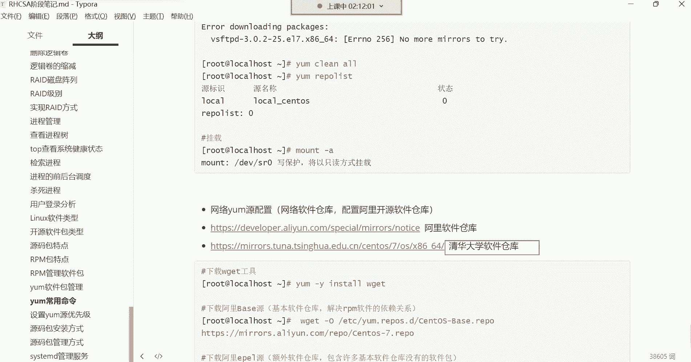

### 为何要设置优先级？
*   **速度**：从本地光盘安装远比从网络下载快，且无网络流量消耗。
*   **稳定性**：可以强制某些软件只从指定的、经过测试的仓库安装。


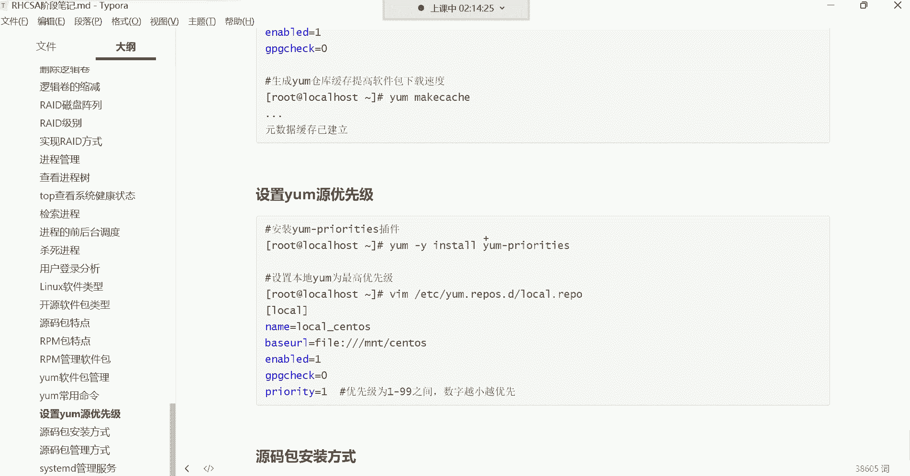

### 如何设置优先级？
1.  **安装优先级插件**：
    ```bash
    yum install -y yum-plugin-priorities
    ```
2.  **编辑本地仓库配置文件**：为你希望设置优先级的仓库文件（例如 `/etc/yum.repos.d/local.repo`）添加优先级参数。
    ```bash
    vim /etc/yum.repos.d/local.repo
    ```
    在 `[local]` 段落中添加一行：
    ```
    priority=1
    ```
    **优先级数字范围为1-99，数字越小，优先级越高。** 这里设置为1，表示最高优先级。

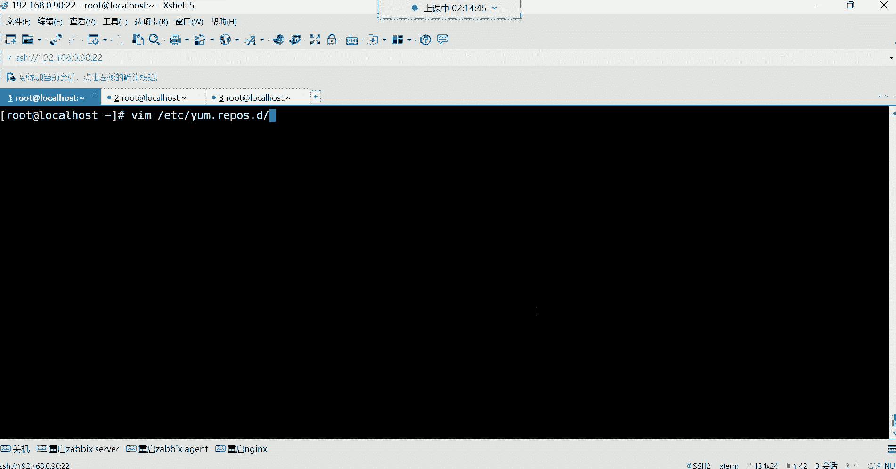


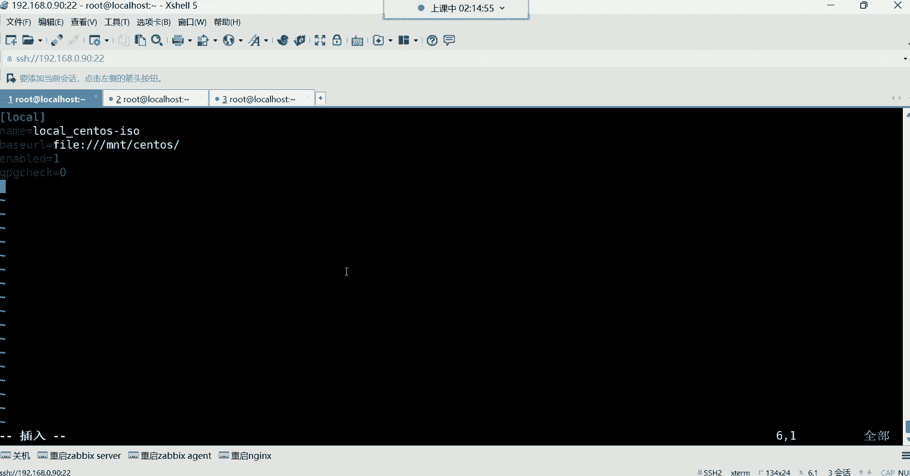


3.  **验证效果**：设置完成后，当你使用 `yum install` 安装一个软件时，YUM会优先从优先级高的仓库（本地）寻找软件包。如果找不到，才会去搜索优先级低的网络仓库。

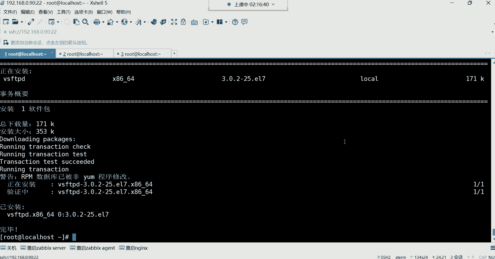


---

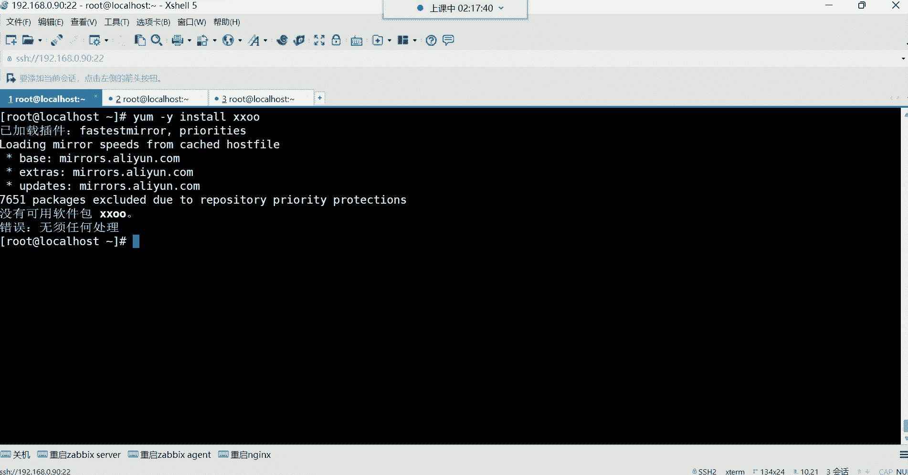

## 缓存管理 🧹

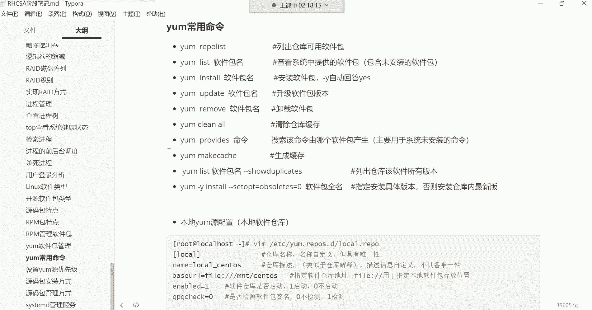

YUM会将仓库的元数据（如软件包列表、依赖关系）缓存到本地，以加速后续操作。但有时缓存信息过时会导致问题，这时就需要清理缓存。

### 生成缓存
首次使用新仓库或更新仓库后，可以手动生成缓存以加速后续查询：
```bash
yum makecache
```


### 清除缓存
当出现以下情况时，需要清除YUM缓存：
*   仓库源已更改（例如，光盘挂载点失效或更换了镜像源）。
*   使用 `yum repolist` 显示仓库有包，但 `yum install` 却失败报错。

清除所有缓存的命令是：
```bash
yum clean all
```
清除缓存后，YUM会重新从配置的仓库地址读取最新的元数据，确保信息的准确性。

### 查询命令由哪个软件包提供
如果你知道一个命令，但不知道它属于哪个软件包，可以使用 `yum provides` 来查询：
```bash
yum provides *<命令名>*
```
例如，查找 `ab` 命令（Apache Bench）由哪个包提供：
```bash
yum provides */ab
```
查询到结果后，即可安装对应的软件包来获得该命令。

---


## 总结 📝

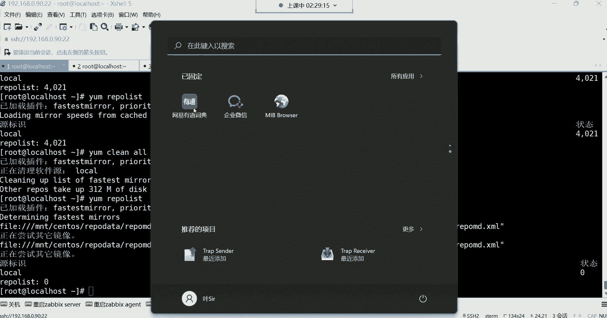


本节课中我们一起学习了YUM包管理器的进阶功能：

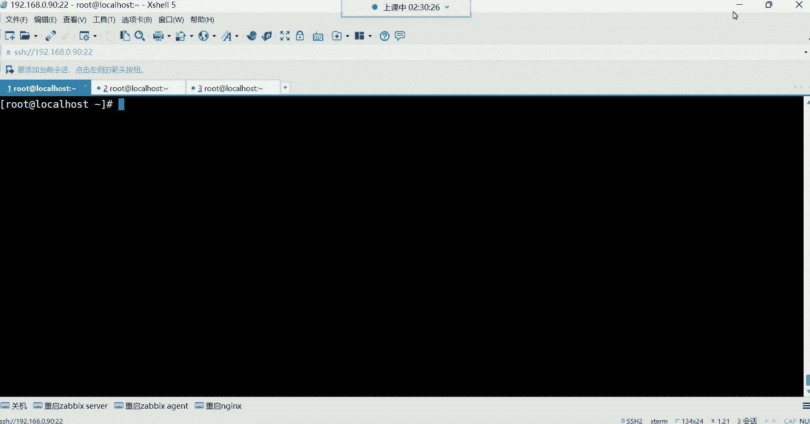


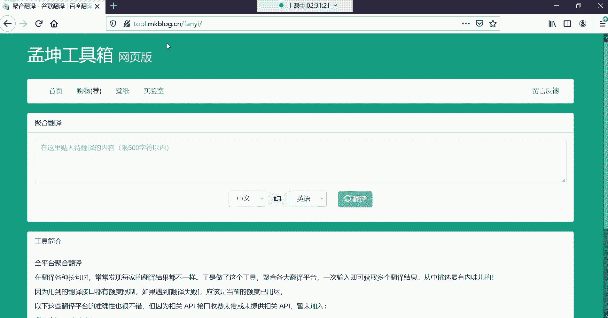

1.  **版本控制**：学会了如何列出和安装指定版本的软件包，以及进行升级操作。
2.  **网络仓库**：掌握了配置阿里云等网络YUM仓库的方法，极大地扩展了可用软件源。
3.  **优先级设置**：通过配置仓库优先级，可以智能控制软件包的下载来源，优先使用本地高速源。
4.  **缓存管理**：理解了缓存的作用，并学会了在必要时清除缓存以解决依赖问题。
5.  **实用命令**：使用了 `yum provides` 来查找命令所属的软件包。


这些技能使得软件包管理更加灵活和高效，是Linux系统运维中不可或缺的一部分。下一节，我们将进入一个新的领域：源码包的编译与安装。