# Linux运维培训教程：P39：常用特殊符号补充 📝

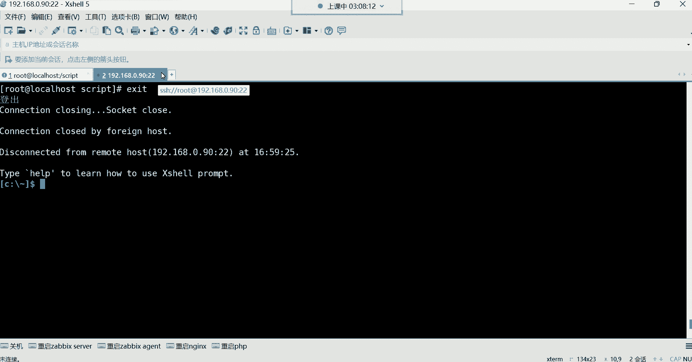

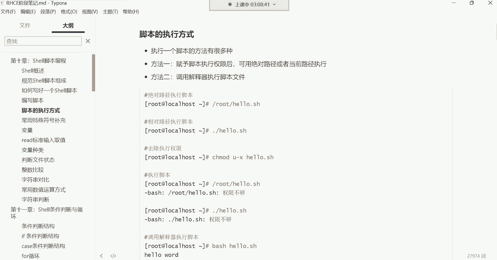

在本节课中，我们将学习Shell脚本中几种常用的特殊符号及其功能。这些符号对于编写和理解脚本至关重要，它们能帮助我们处理文本、进行计算以及动态地获取命令执行结果。

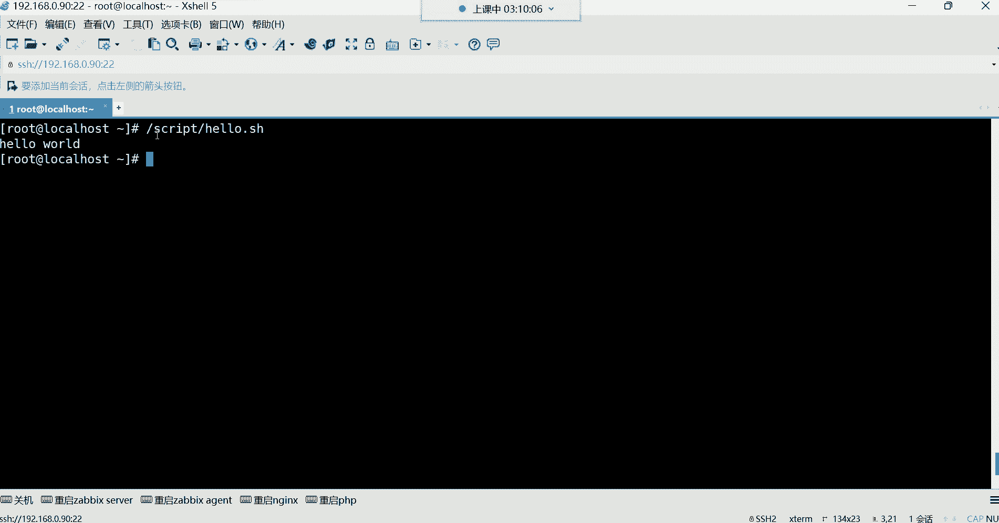

---

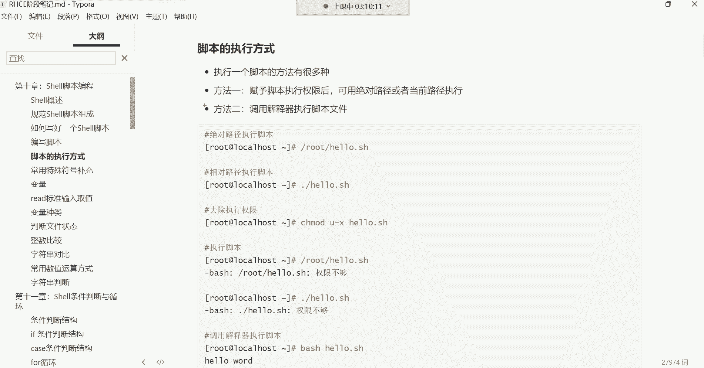

## 脚本的执行方式 🚀

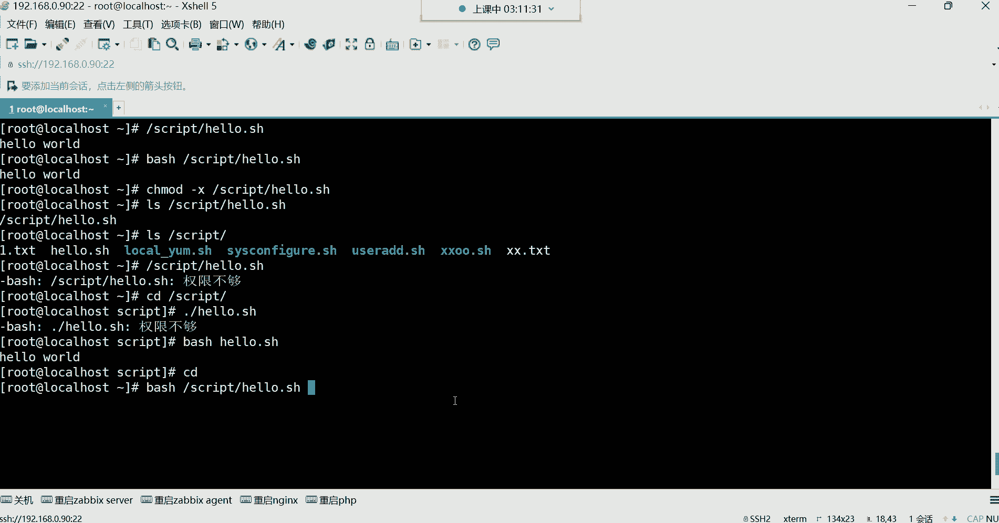

上一节我们介绍了如何编写Shell脚本，本节中我们来看看如何执行一个写好的脚本。脚本的执行方式主要有两种。

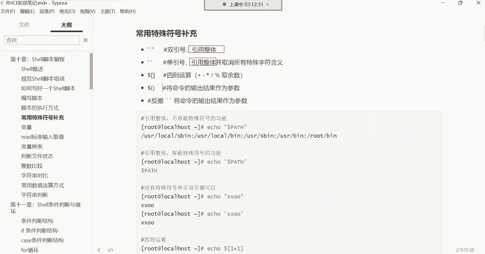

以下是两种主要的执行方法：

1.  **赋予脚本执行权限后执行**
    *   首先，使用 `chmod +x` 命令为脚本文件添加执行权限。
    *   然后，可以通过**绝对路径**（如 `/root/script/hello.sh`）或**相对路径**（如 `./hello.sh`）来执行脚本。注意，使用相对路径时，必须在脚本名前加上 `./`，以告诉系统在当前目录下寻找该文件。

2.  **调用解释器直接执行**
    *   无需赋予脚本执行权限，可以直接使用 `bash` 解释器来执行脚本。
    *   命令格式为：`bash /脚本路径/脚本名.sh` 或 `bash ./脚本名.sh`。这种方式下，脚本文件本身不需要拥有执行权限。

通常，我们更倾向于使用第一种方法，即赋予权限后执行。

---

## 引号的作用：引用整体 📌

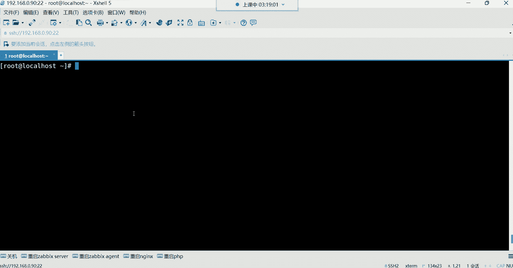

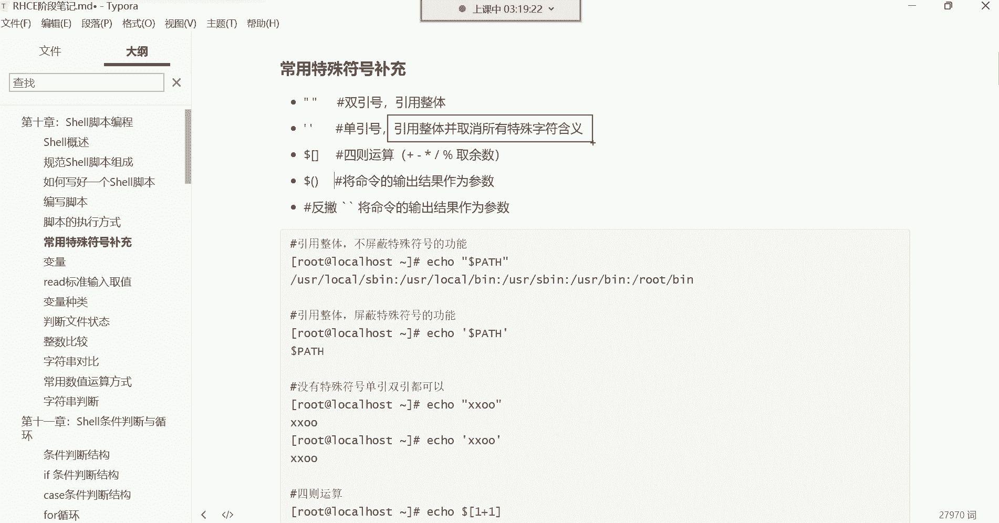

在Shell中，引号的主要功能是“引用整体”，即将引号内的所有内容（包括空格等特殊字符）视为一个不可分割的整体。


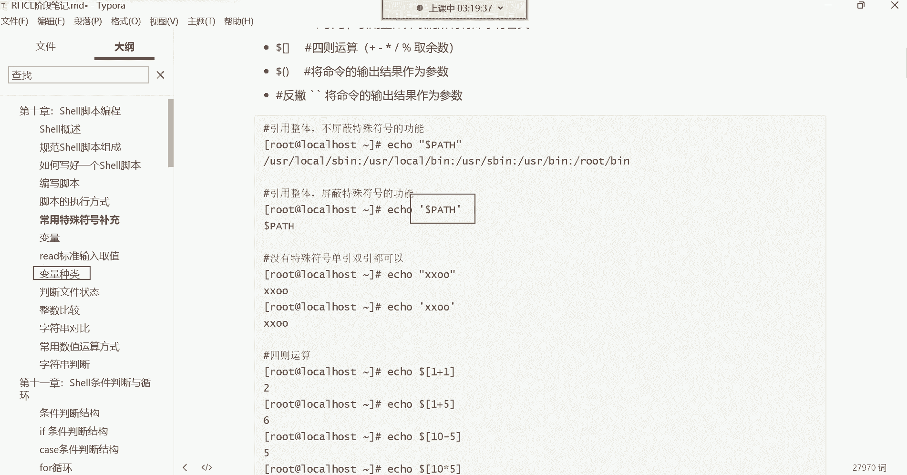

以下是引号使用的核心要点：

*   **整体性**：例如，`touch “a b.txt”` 会创建一个名为 `a b.txt`（中间有空格）的单个文件，而不是两个文件。如果不加引号，`touch a b.txt` 则会创建 `a` 和 `b.txt` 两个文件。
*   **删除陷阱**：如果文件名包含不易察觉的空格（如 ` hello.txt`），直接使用 `rm hello.txt` 可能无法删除，因为系统认为你要删除的是名为 `hello.txt` 的文件，而不是 ` hello.txt`。这时需要使用引号或转义字符来指定完整文件名，例如 `rm “ hello.txt”`。

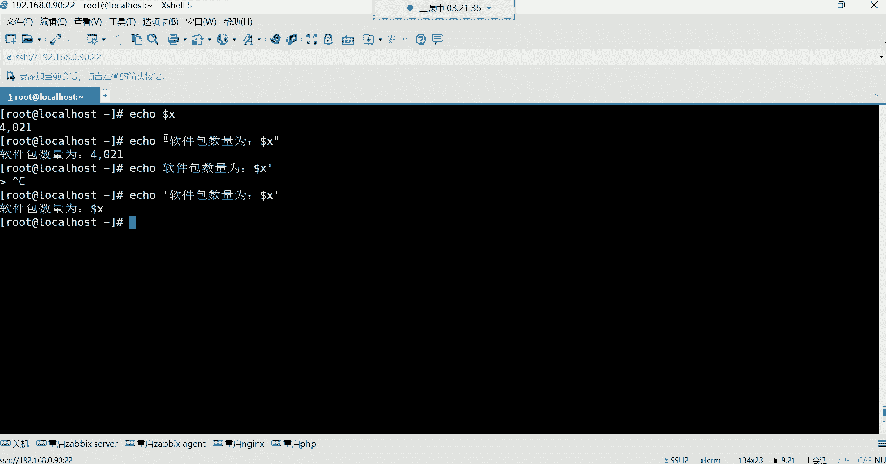

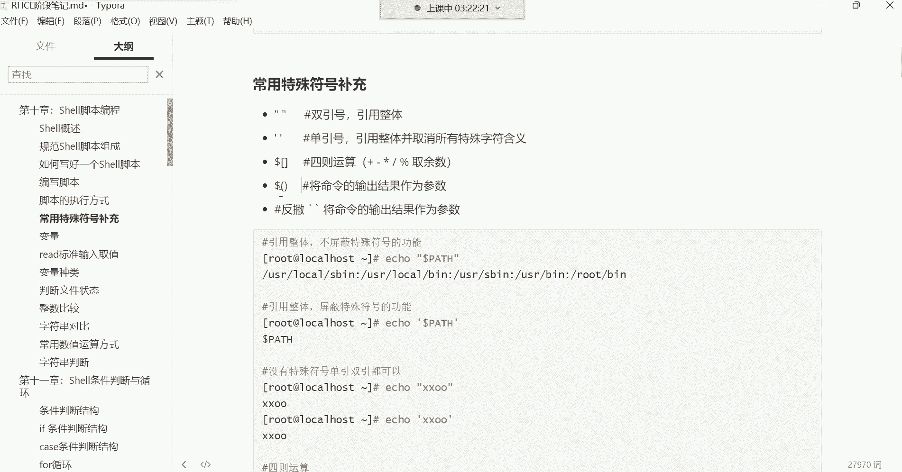

单引号 `‘’` 和双引号 `“”` 在“引用整体”这一点上是相同的。它们的核心区别在于对**特殊符号**的处理方式。

---

## 单引号与双引号的区别 🔍

虽然两者都能引用整体，但在处理美元符号 `$`、反引号 ``` 等具有特殊功能的字符时，行为完全不同。

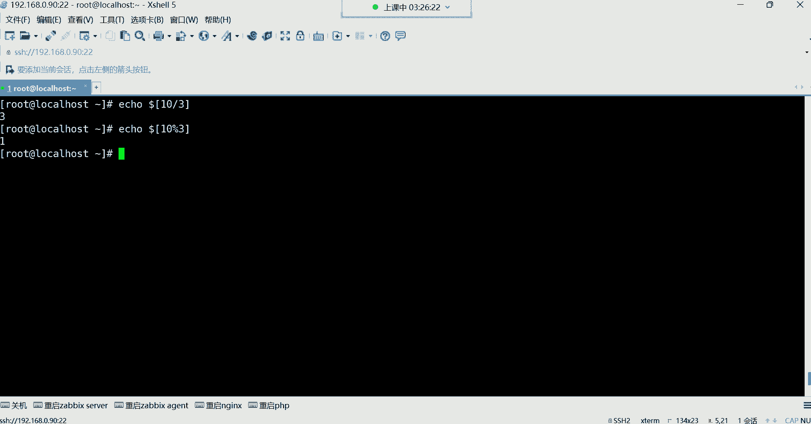

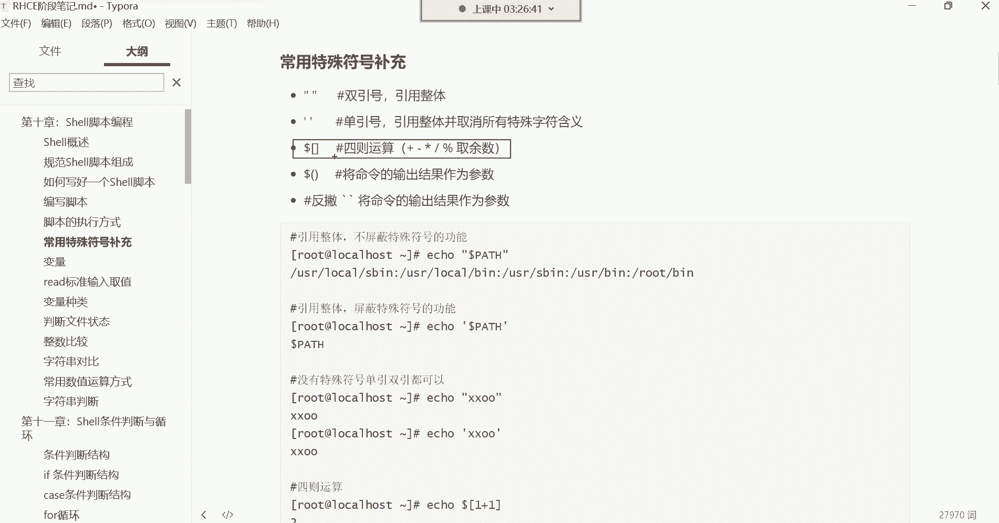

它们的区别可以通过一个变量引用的例子来理解：
*   **双引号**：会识别并解析其中的特殊符号。例如，如果变量 `X=10`，那么 `echo “数量是 $X”` 的输出结果是 `数量是 10`。
*   **单引号**：会取消其中所有特殊符号的特殊含义，将其视为普通字符。同样对于 `X=10`，`echo ‘数量是 $X’` 的输出结果将是字面字符串 `数量是 $X`。

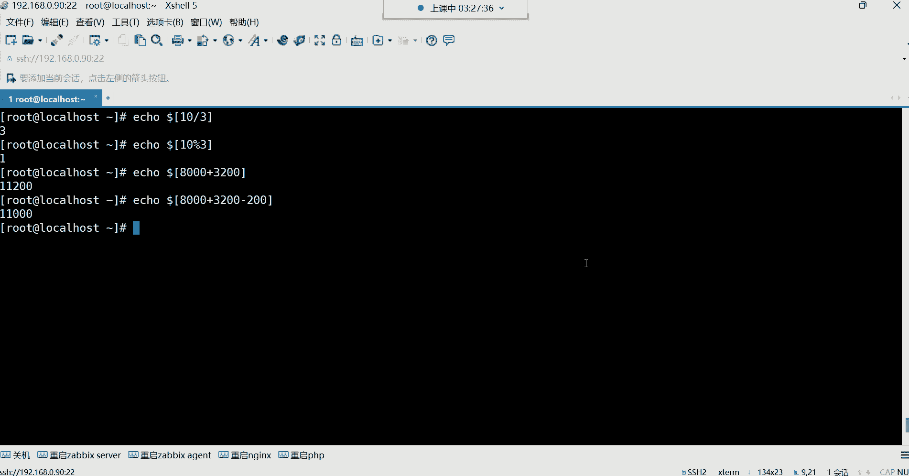

**简单总结**：需要让变量、命令替换等特殊功能生效时，用**双引号**；需要纯粹地保护所有字符原样输出时，用**单引号**。


---

## 四则运算 ➕➖✖️➗

在Shell脚本中，我们经常需要进行数学计算。使用 `$[]` 结构可以方便地进行四则运算。

基本运算格式如下：
```bash
echo $[1 + 1]   # 加法，输出 2
echo $[5 - 2]   # 减法，输出 3
echo $[3 * 4]   # 乘法，输出 12 (注意乘号是 *)
echo $[10 / 3]  # 除法，输出 3 (整除，舍去小数)
```

此外，还有一个重要的运算符：取余（模运算）。
*   **取余运算**：使用百分号 `%` 可以计算除法运算后的余数。
    *   例如：`echo $[10 % 3]` 的结果是 `1`，因为10除以3等于3余1。
    *   这个运算在后期控制循环、生成范围数字等场景中非常有用。

---

## 反引号与 $()：命令替换 ⚙️

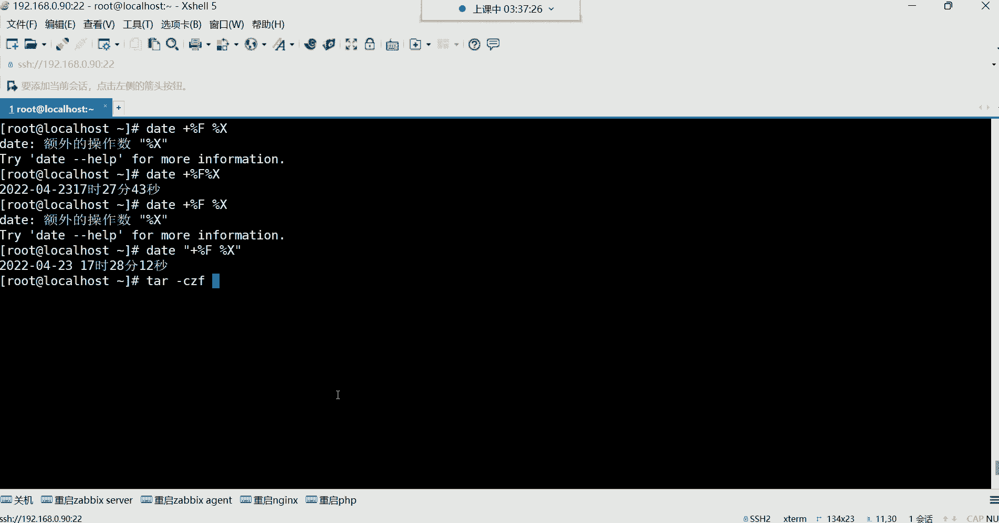

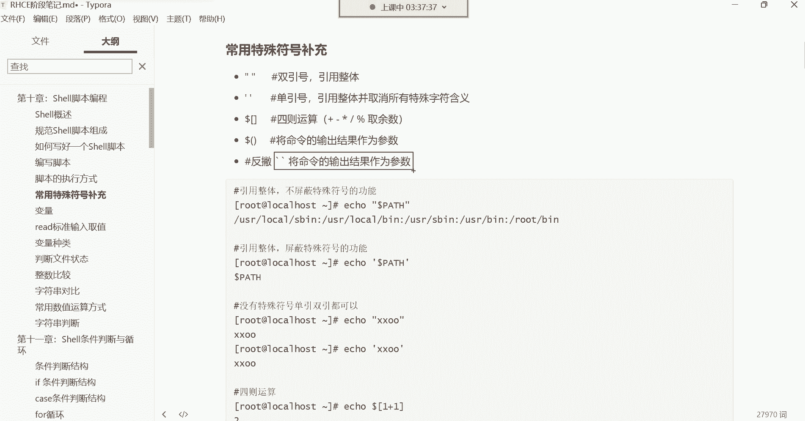

这是Shell脚本中一个极其强大的功能，称为“命令替换”。其作用是将**一条命令的输出结果**，作为另一条命令的**参数**或**变量值**。

假设我们想在创建备份文件时，将当前系统时间自动添加到文件名中，手动输入时间既不准确也麻烦。这时就需要命令替换。

**传统语法（反引号）**：
```bash
touch backup_`date +%F`.tar.gz
```
执行后，会生成一个类似 `backup_2023-10-27.tar.gz` 的文件。反引号 ``` 内的 `date +%F` 命令先被执行，其输出的日期结果被替换到 `touch` 命令的文件名参数中。

**现代推荐语法（$()）**：
```bash
touch backup_$(date +%F).tar.gz
```
`$()` 的功能与反引号完全相同，但更易于阅读和嵌套使用，是现代脚本中的首选写法。

**应用示例：自动备份日志**
为了避免多次备份时文件名重复导致旧备份被覆盖，可以在备份命令中使用时间戳：
```bash
tar -czf /backup/log_$(date +%F_%H-%M-%S).tar.gz /var/log/*.log
```
这样每次备份都会生成一个带有精确时间的唯一文件名（如 `log_2023-10-27_14-30-15.tar.gz`）。

---

## 课程总结 🎯

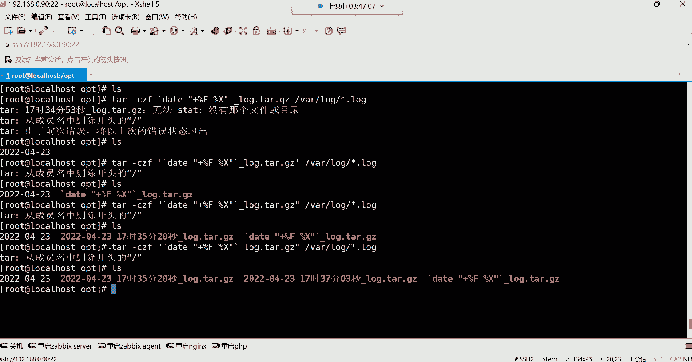

本节课中我们一起学习了Shell脚本中几个关键的特殊符号：
1.  **脚本执行**的两种方式：赋予权限后执行和调用解释器执行。
2.  **引号（单/双）** 的核心作用是“引用整体”，区别在于双引号会解析特殊符号，而单引号会将其原样输出。
3.  使用 **`$[]`** 进行简单的**四则运算和取余运算**。
4.  **命令替换（反引号 `` ` ` ` 或 `$()`）** 的用法，它能够将一个命令的输出作为另一个命令的输入，是实现脚本自动化和动态化的关键技巧。

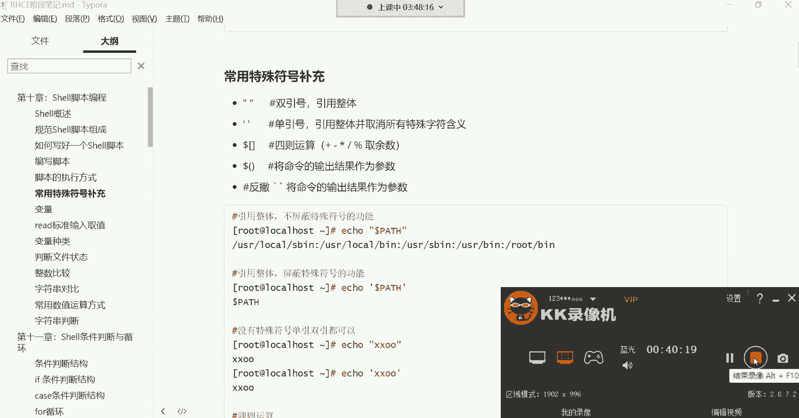

熟练掌握这些符号，是编写高效、灵活Shell脚本的基础。