# Linux运维培训教程：P3：虚拟机网络配置、远程连接与Linux岗位介绍 🖥️

在本节课中，我们将学习如何配置虚拟机的网络，以便使用远程连接工具进行管理。同时，我们也会介绍Linux系统的应用领域以及相关的IT岗位，帮助你了解未来的职业发展方向。

---

## 系统登录与初始界面

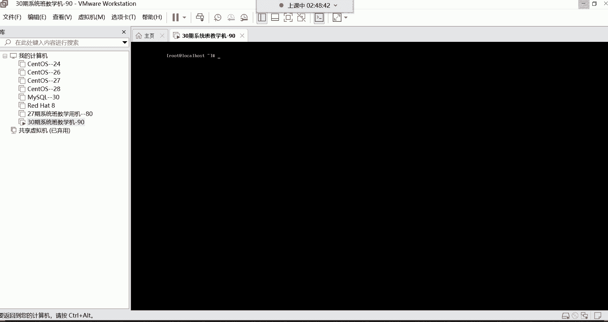

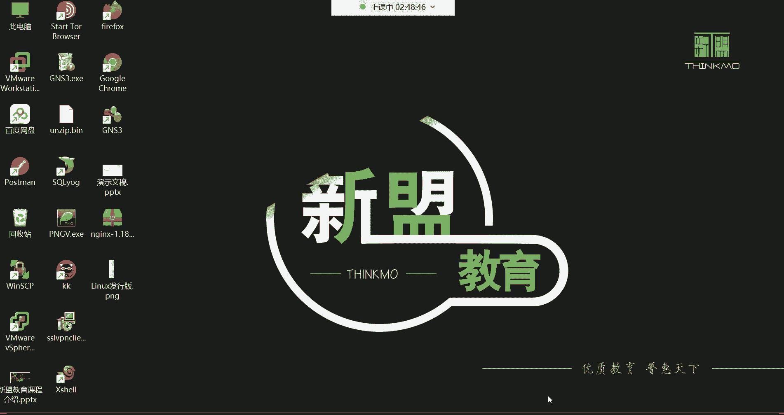

系统安装完成后，需要重启。重启后，会进入一个命令行登录界面，提示 `localhost login:`。

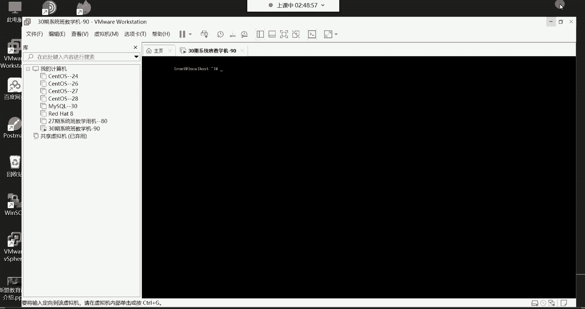

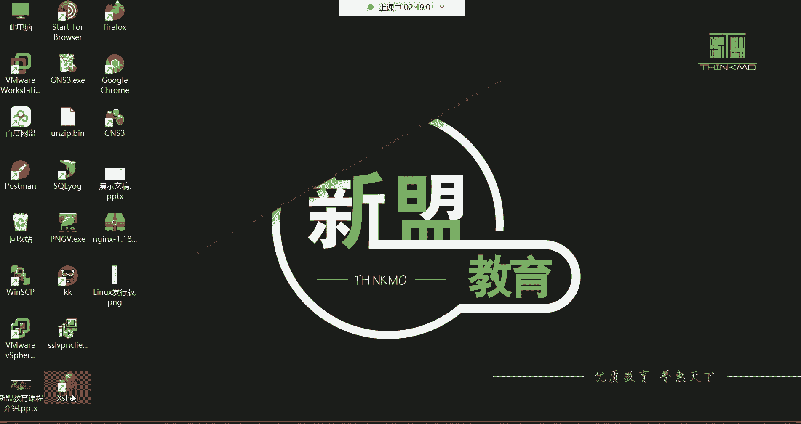

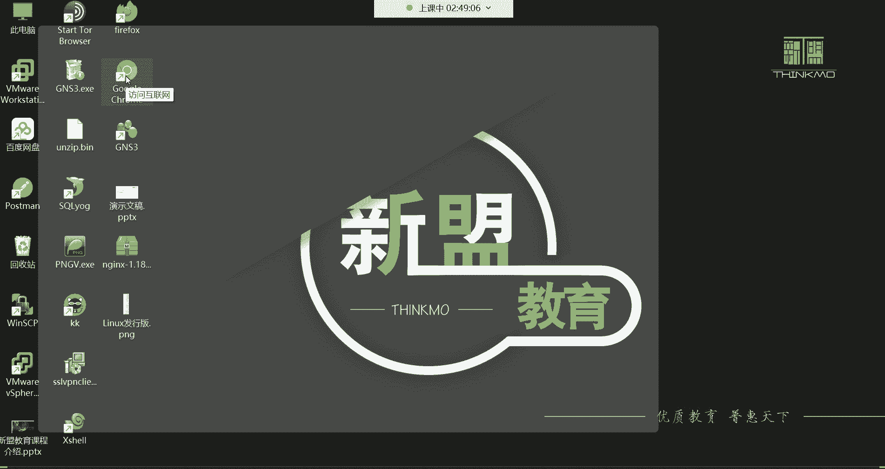

在登录界面输入用户名 `root`，然后输入密码。输入密码时，屏幕不会显示字符，这是为了保护密码安全。输入完成后按回车键即可登录系统。

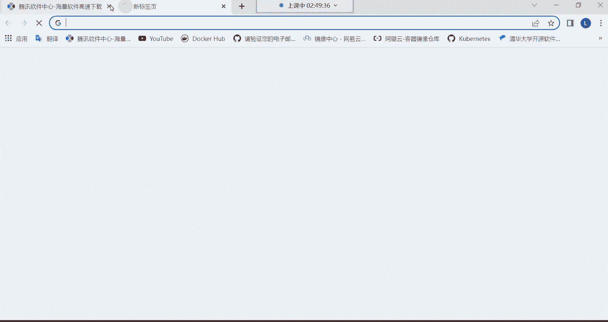


登录成功后，命令行提示符会发生变化，显示为 `[root@localhost ~]#`，这表示已成功以root用户身份进入系统。

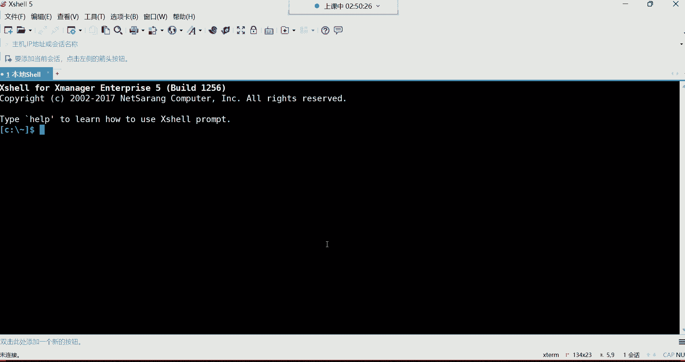


---

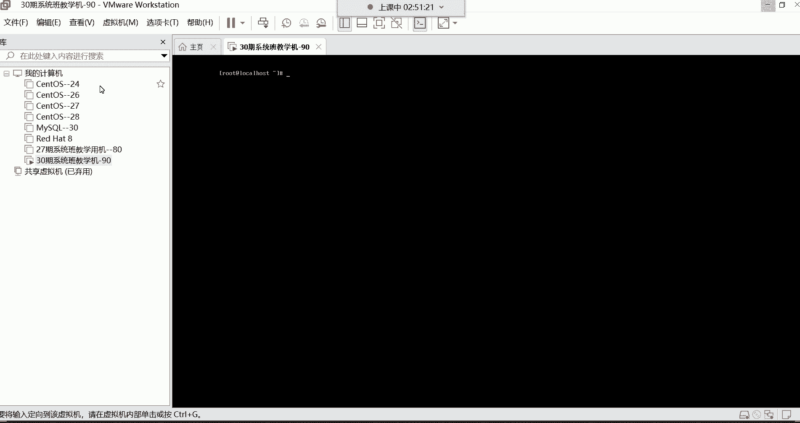

## 配置虚拟机网络 🔧

为了能够从本地计算机远程连接到虚拟机，需要正确配置虚拟机的网络设置。如果配置错误，可能导致无法连接。

### 步骤一：配置VMware虚拟网络编辑器

首先，需要在VMware软件中配置虚拟网络。

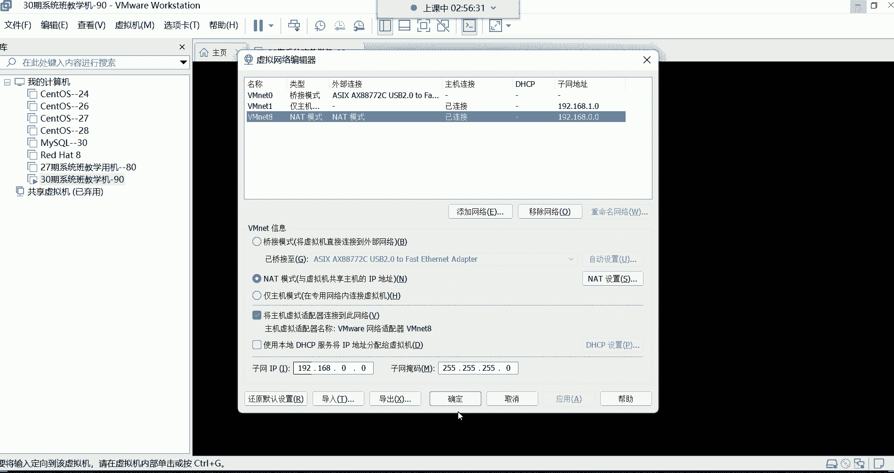

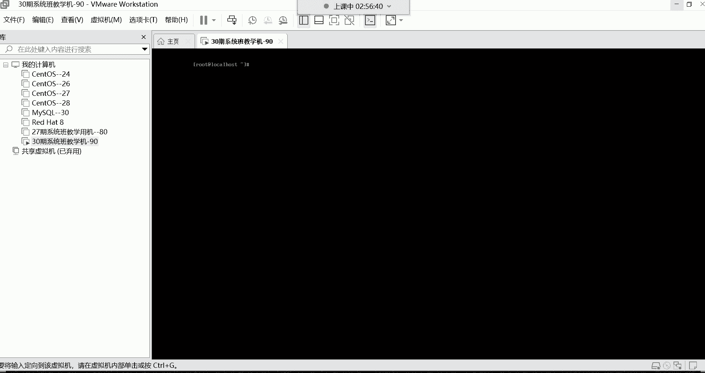

1.  打开VMware，点击顶部菜单栏的 **“编辑”**，选择 **“虚拟网络编辑器”**。
2.  在弹出的窗口中，选择 **`VMnet8 (NAT模式)`**。
3.  取消勾选 **“使用本地DHCP服务将IP地址分配给虚拟机”** 选项。这一步很重要，可以防止虚拟机IP地址自动变化，导致无法连接。
4.  查看并记录 **“子网IP”** 地址，例如 `192.168.0.0`。子网掩码通常为 `255.255.255.0`。
5.  点击 **“NAT设置”** 按钮，查看并设置网关地址，例如 `192.168.0.254`。设置完成后点击确定。

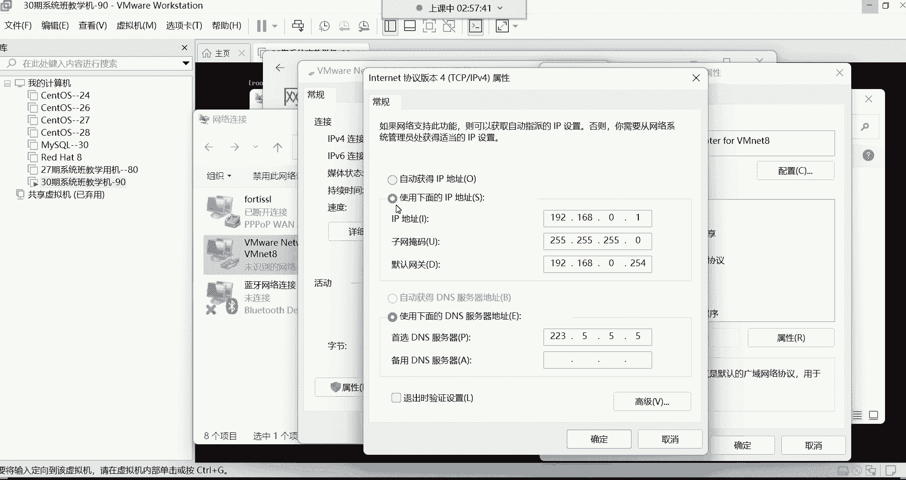

**核心配置公式：**
*   子网网段：`192.168.0.0/24`
*   网关地址：`192.168.0.254`

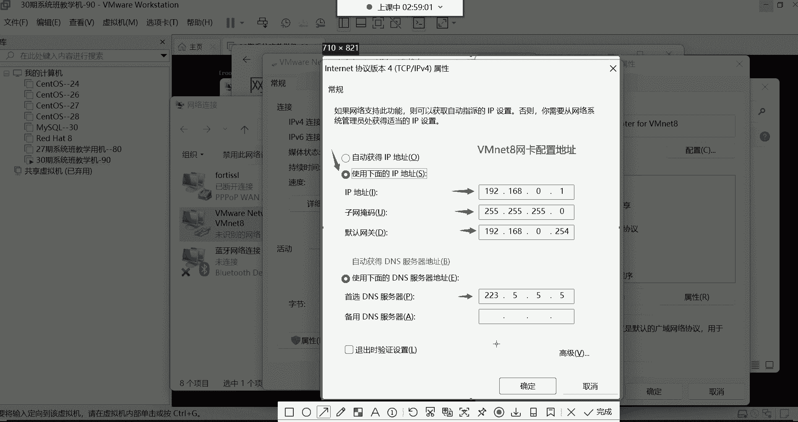

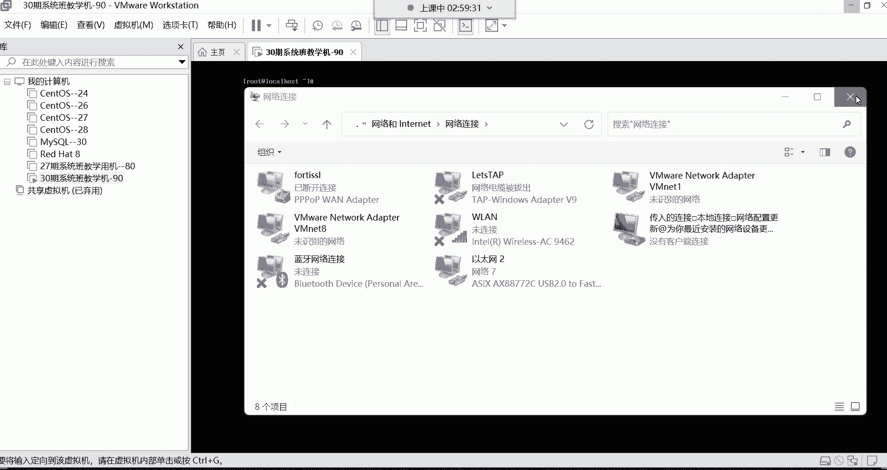

### 步骤二：配置主机VMnet8网卡

接下来，需要在你的Windows电脑上配置对应的虚拟网卡。

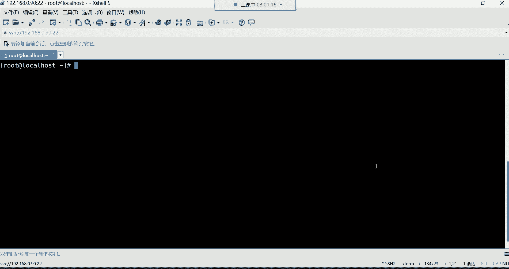

1.  打开Windows系统的 **“控制面板” -> “网络和 Internet” -> “网络连接”**。
2.  找到名为 **“VMware Network Adapter VMnet8”** 的虚拟网卡，右键选择 **“属性”**。
3.  双击 **“Internet协议版本 4 (TCP/IPv4)”**。
4.  选择 **“使用下面的IP地址”**，并填写信息：
    *   IP地址：`192.168.0.1` (需与虚拟机在同一网段)
    *   子网掩码：`255.255.255.0`
    *   默认网关：`192.168.0.254` (需与虚拟机网关一致)
    *   首选DNS服务器：例如 `223.5.5.5`
5.  点击确定保存设置。

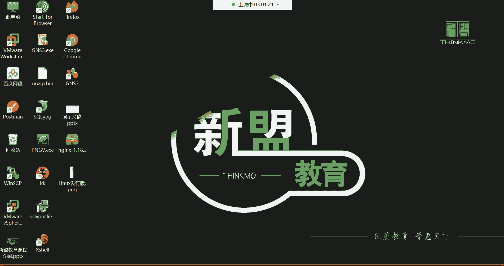

完成以上两步配置后，你的主机和虚拟机就处于同一个网络环境中，可以相互通信了。

---

## 使用远程连接工具 🔌

在企业中，服务器通常不在本地，需要通过远程连接工具进行管理。我们将使用 **Xshell** 这款工具。

*   **获取工具**：Xshell可以在VIP资料包中找到，也可以从腾讯软件中心等网站搜索“Xshell”进行下载安装。

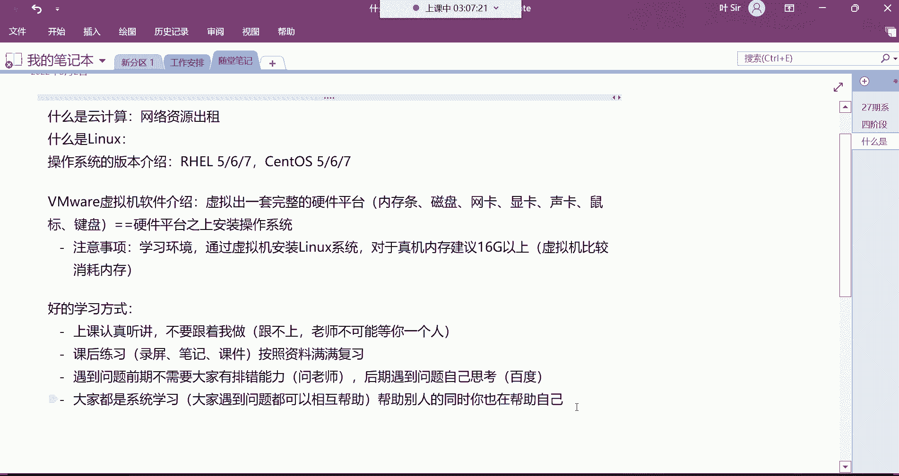

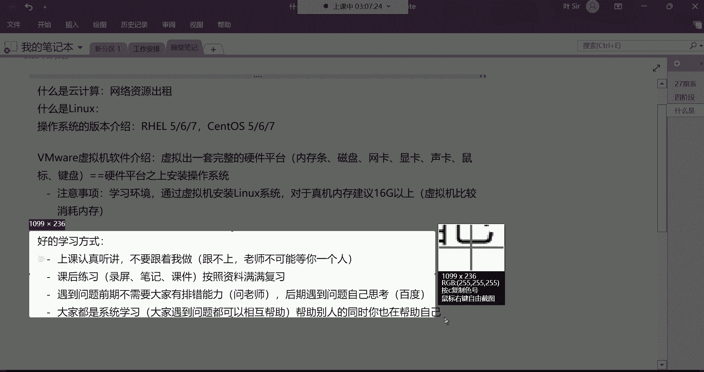

使用Xshell连接虚拟机的步骤如下：

1.  打开Xshell，点击新建会话。
2.  在“主机”栏中输入虚拟机的IP地址，例如 `192.168.0.90`。
3.  协议选择 **`SSH`**，端口为 `22`。
4.  点击连接，首次连接时会弹出“SSH安全警告”，选择 **“接受并保存”**。
5.  在弹出的登录窗口中，输入用户名 `root` 和密码，即可成功登录到虚拟机的命令行界面。

**连接命令示例：**
```bash
ssh root@192.168.0.90
```

登录后，你可以使用 `Ctrl + L` 快捷键来清屏，让界面更整洁。今后所有的Linux系统管理和学习，都将在这个命令行界面中通过输入命令来完成。

---

## Linux应用领域与岗位介绍 💼

上一节我们配置好了学习环境，本节中我们来了解一下Linux系统的广阔天地和未来的职业道路。

Linux系统已经深入到我们生活和科技的方方面面。

### 无处不在的Linux

以下是Linux系统的一些关键应用领域：
*   **基础服务**：金融、政务、交通、医疗、通信等行业的后台服务器。
*   **前沿技术**：云计算、大数据、人工智能领域的核心平台。
*   **超级计算**：全球500强超级计算机中，绝大多数都运行Linux系统。中国的“神威·太湖之光”、“天河二号”也使用基于Linux的麒麟系统。
*   **互联网服务**：我们日常使用的网站、App（如微信、淘宝、外卖、打车软件）、游戏服务器，其后台几乎都运行在Linux服务器上。
*   **移动设备**：Android系统的底层就是Linux内核。

### 可从事的技术岗位

学习Linux运维后，你可以向多个方向发展：

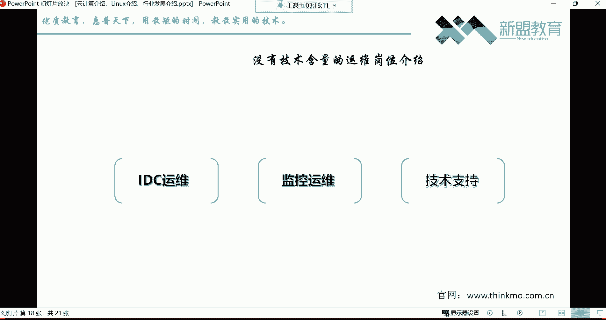

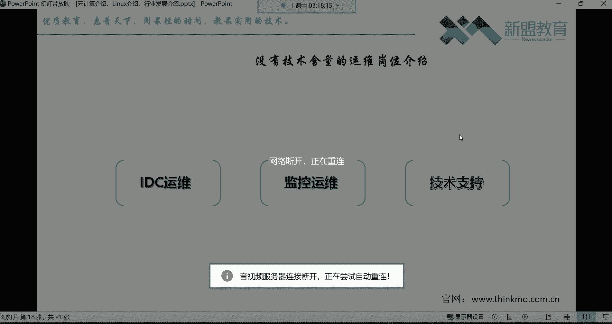

1.  **Linux运维工程师**：入门首选岗位，负责服务器的日常维护、监控、故障处理。
2.  **云计算运维工程师**：专注于公有云（如阿里云、AWS）或私有云平台的管理和维护。
3.  **容器运维工程师 (K8s)**：负责基于Docker和Kubernetes的容器化平台运维。
4.  **数据库管理员 (DBA)**：专门负责数据库（如MySQL、Oracle）的安装、配置、优化和备份。
5.  **运维开发工程师/自动化运维**：通过编写脚本或工具，实现运维工作的自动化。
6.  **系统架构师**：负责设计整体系统架构，通常需要丰富的经验和开发能力。

**薪资参考**：初级运维工程师薪资普遍在8000元/月起，平均薪资可达10000元/月左右。

### 需谨慎选择的岗位

对于初学者，有些岗位技术含量较低，发展有限，需要谨慎选择：

*   **IDC运维**：主要在数据中心机房进行巡检工作（检查温湿度、电力等），多为外包岗位，技术提升空间小。
*   **监控运维**：负责盯着监控系统，发送告警信息，技术含量低，多为倒班制的外包岗位。
*   **技术支持/客服**：处理用户工单，解决基础使用或费用问题，涉及复杂技术问题时需转交他人，技术成长有限。

---

## 运维、开发、测试岗位对比 ⚖️

为了让大家对IT行业有更清晰的认识，这里简单对比几个常见岗位：

*   **开发岗位**：
    *   **优点**：薪资水平高。
    *   **挑战**：门槛高（通常要求本科及以上学历，计算机相关专业），需要较强的逻辑思维能力和持续学习能力，工作压力大，职业生命周期相对较短（常面临“35岁危机”）。

*   **测试岗位**：
    *   **优点**：在大公司是重要岗位。
    *   **挑战**：需要一定的编程能力来开发测试工具，门槛同样不低，且很多中小公司不设专职测试岗位。

*   **运维岗位 (我们的方向)**：
    *   **优点**：入门门槛相对较低，大专学历即可，零基础友好。职业生命周期长，岗位需求量大，就业相对容易。
    *   **核心**：需要耐心、细心和强大的排错能力，贵在坚持。

---

## 学习方法与建议 📚

成功的关键在于正确的学习方法和持之以恒的态度。

以下是一些重要的学习建议：
*   **上课以听和理解为主**：课堂上不要急于跟着操作，以免跟不上节奏。应先确保听懂原理。
*   **课后反复练习**：利用录屏、笔记和课件，在课后时间自己动手操作，巩固知识。
*   **合理解决问题**：学习初期遇到问题可及时询问老师。后期应培养自己解决问题的能力，先思考、查阅资料（如百度、谷歌），再提问。
*   **保持积极心态**：转行学习不易，会遇到疲劳期，务必坚持下去。同时，鼓励同学间互帮互助，在解答他人问题的过程中，也能加深自己的理解。

---

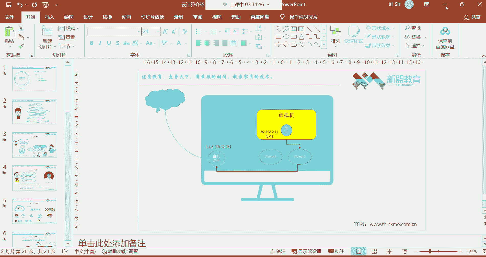

## 总结

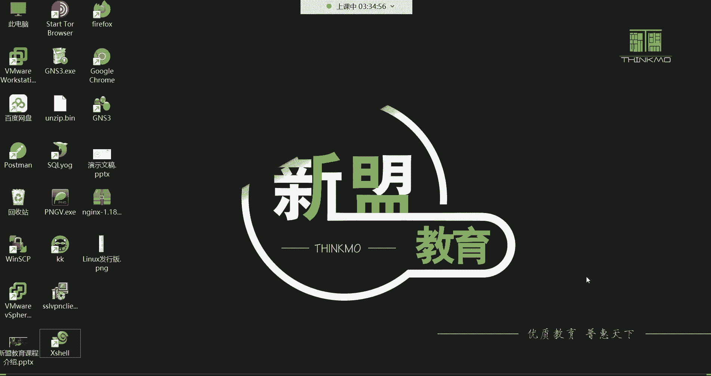

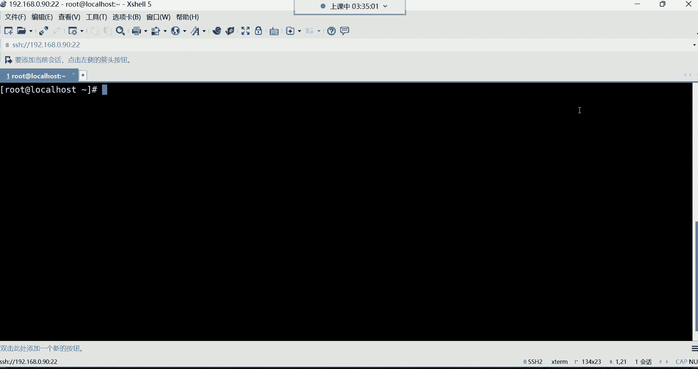

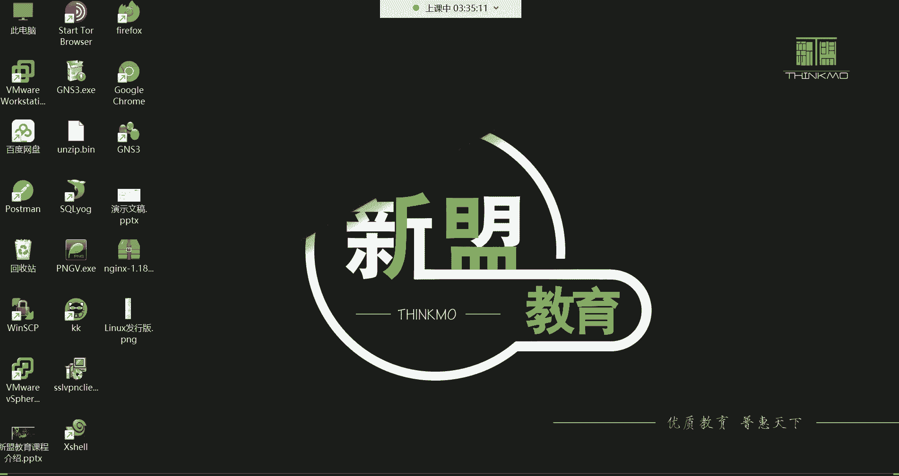

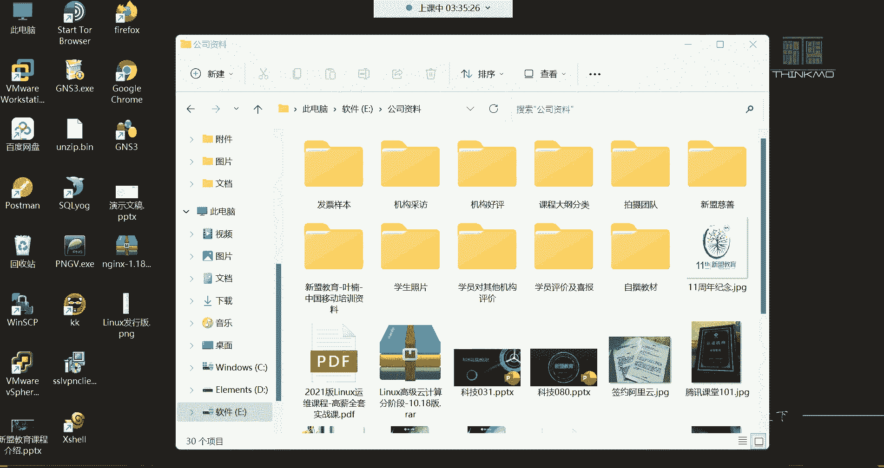

本节课中我们一起学习了三个核心内容：
1.  **配置虚拟机网络**：通过设置VMware虚拟网络编辑器和主机VMnet8网卡，为远程连接做好准备。
2.  **使用远程连接工具**：使用Xshell通过SSH协议连接到Linux服务器，这是日后管理服务器的主要方式。
3.  **了解行业与岗位**：认识了Linux广泛的应用领域，明确了运维工程师的职业发展路径，并对比了IT行业内不同岗位的特点，帮助我们树立了清晰的学习目标。

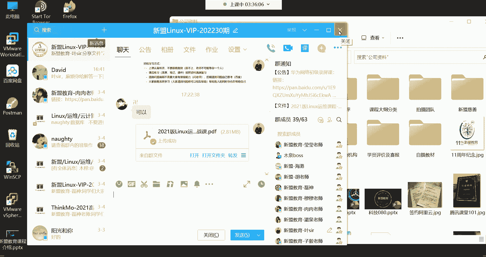

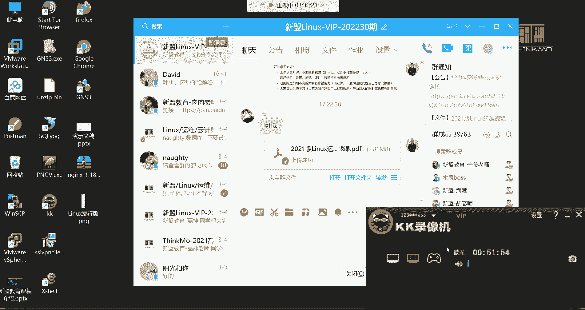

学习Linux运维是一个积累的过程，从系统安装、网络配置到命令学习，每一步都至关重要。请大家保持热情，坚持练习，我们下节课再见！