# Linux运维培训教程：P40：判断文件状态、整数比较、字符串对比、常用数值运算方式、字符串判断


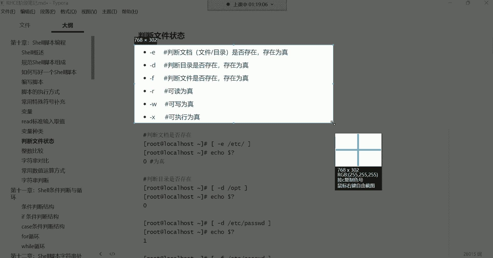


在本节课中，我们将学习Shell脚本中几种重要的判断和运算方式。内容包括如何判断文件的状态、如何进行整数和字符串的比较、常用的数值运算方法，以及如何判断字符串是否为空。这些是编写条件判断脚本的基础知识。

## 判断文件状态

上一节我们介绍了Shell的基本概念，本节中我们来看看如何判断文件的状态。Shell提供了一系列单字母选项，用于判断文件是否存在、类型以及权限。

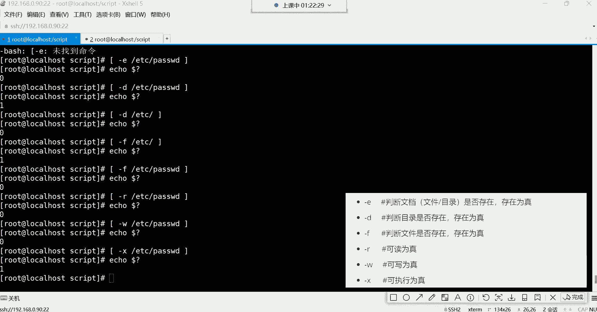

以下是判断文件状态的常用命令格式，它们都需要放在中括号 `[ ]` 内，并且各部分之间需要空格隔开：


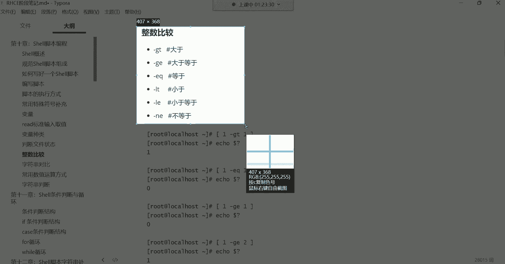

*   **`-e`**：判断文件或目录是否存在。
    ```bash
    [ -e /etc/passwd ]
    ```
    执行后，使用 `echo $?` 查看返回值，若为 `0` 则表示存在。


*   **`-d`**：判断是否为目录。
    ```bash
    [ -d /etc ]
    ```

*   **`-f`**：判断是否为普通文件。
    ```bash
    [ -f /etc/passwd ]
    ```

*   **`-r`**：判断当前用户是否对该文件有读权限。
    ```bash
    [ -r /etc/passwd ]
    ```

*   **`-w`**：判断当前用户是否对该文件有写权限。
    ```bash
    [ -w /etc/passwd ]
    ```

*   **`-x`**：判断当前用户是否对该文件有执行权限。
    ```bash
    [ -x /etc/passwd ]
    ```

这些命令本身不输出结果，需要通过 `echo $?` 来检查上一条命令的退出状态码（`0` 表示真/成功，非 `0` 表示假/失败）。现阶段，你只需要认识这些选项的含义，在阅读脚本时能理解其作用即可。

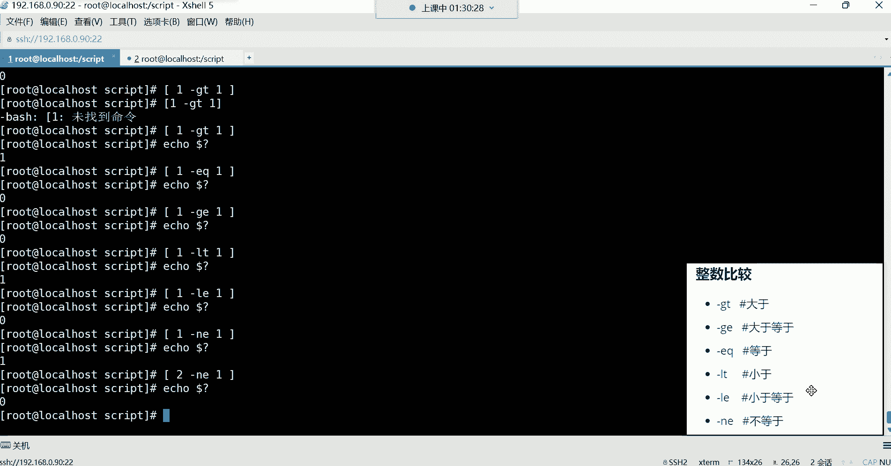

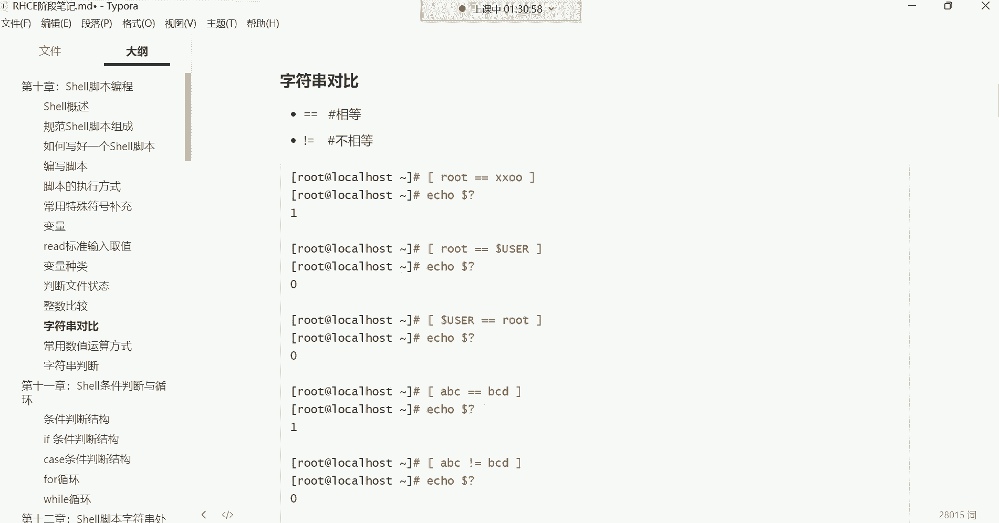


## 整数比较

了解了文件状态判断后，我们进入数值运算领域。首先学习如何进行整数比较。在Shell中，进行纯数字对比需要使用特定的操作符，如果直接使用 `=` 会被系统理解为字符串对比。


以下是整数比较的操作符，同样需要放在中括号 `[ ]` 内并注意空格：


*   **`-eq`**：等于（Equal）。
    ```bash
    [ 1 -eq 1 ]  # 判断1是否等于1
    ```

*   **`-ne`**：不等于（Not Equal）。
    ```bash
    [ 2 -ne 1 ]  # 判断2是否不等于1
    ```

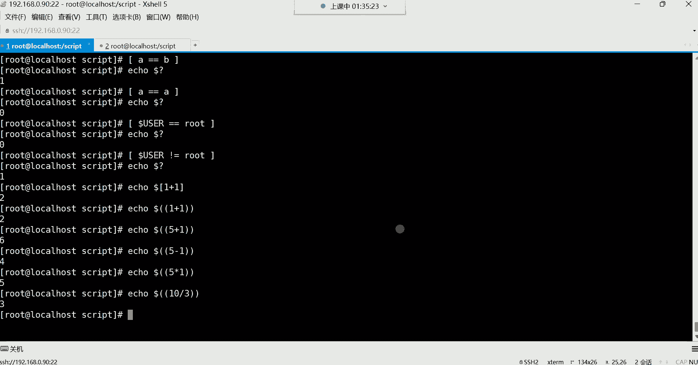

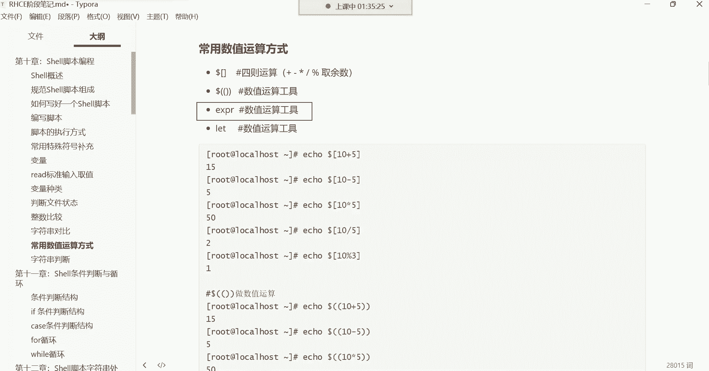

*   **`-gt`**：大于（Greater Than）。
    ```bash
    [ 2 -gt 1 ]  # 判断2是否大于1
    ```


*   **`-lt`**：小于（Less Than）。
    ```bash
    [ 1 -lt 2 ]  # 判断1是否小于2
    ```

*   **`-ge`**：大于等于（Greater or Equal）。
    ```bash
    [ 1 -ge 1 ]  # 判断1是否大于等于1
    ```


*   **`-le`**：小于等于（Less or Equal）。
    ```bash
    [ 1 -le 1 ]  # 判断1是否小于等于1
    ```

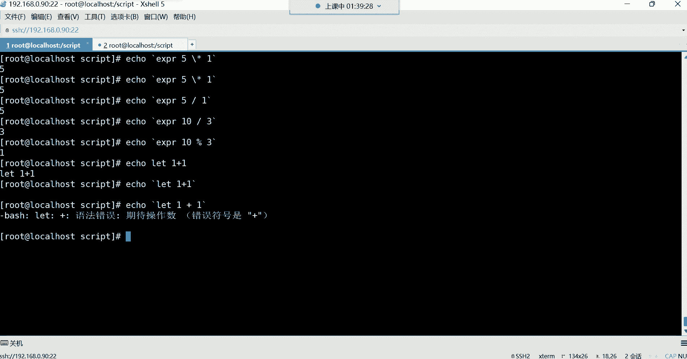


## 字符串对比


与整数比较不同，字符串对比使用另一套操作符。它不仅可以比较明确的字符串，也可以比较包含数字的字符串（系统会将其当作字符处理）。

以下是字符串对比的常用方法：

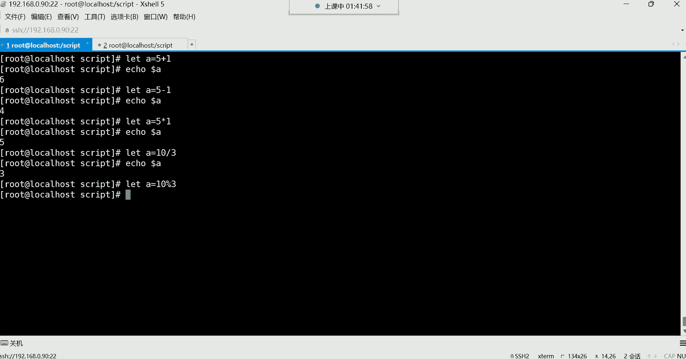


*   **`==` 或 `=`**：判断两个字符串是否相等。
    ```bash
    [ "$USER" == "root" ]  # 判断当前用户是否为root
    [ "A" = "A" ]          # 判断A是否等于A
    ```


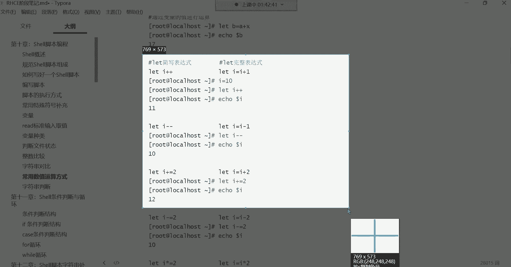

*   **`!=`**：判断两个字符串是否不相等。
    ```bash
    [ "A" != "B" ]  # 判断A是否不等于B
    ```

## 常用数值运算方式


在脚本中，我们经常需要进行数学运算。Shell提供了多种数值运算的方法，各有特点。


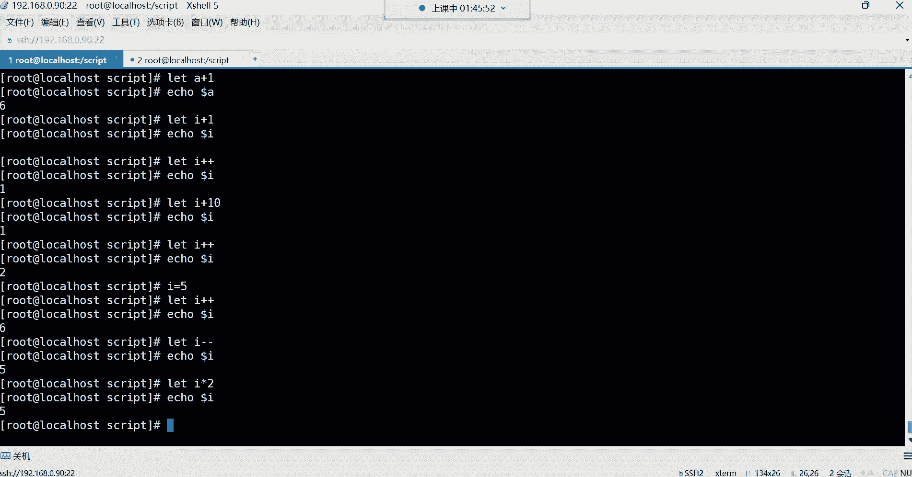

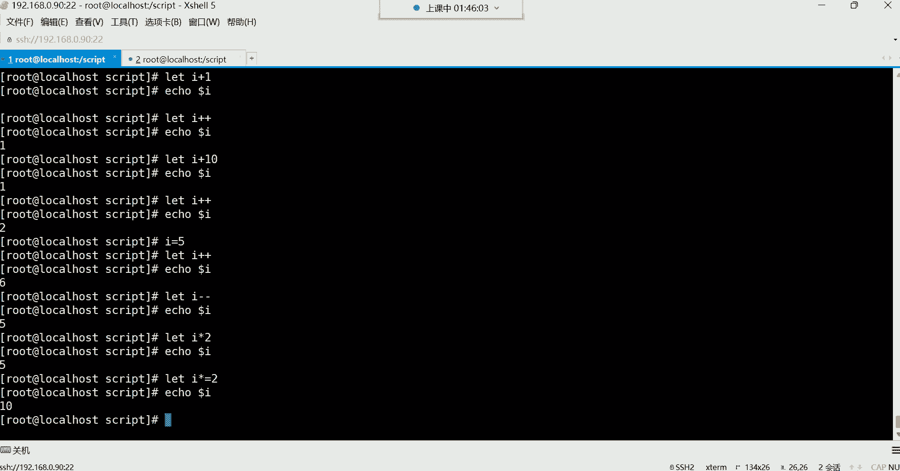

以下是几种常用的数值运算方式：


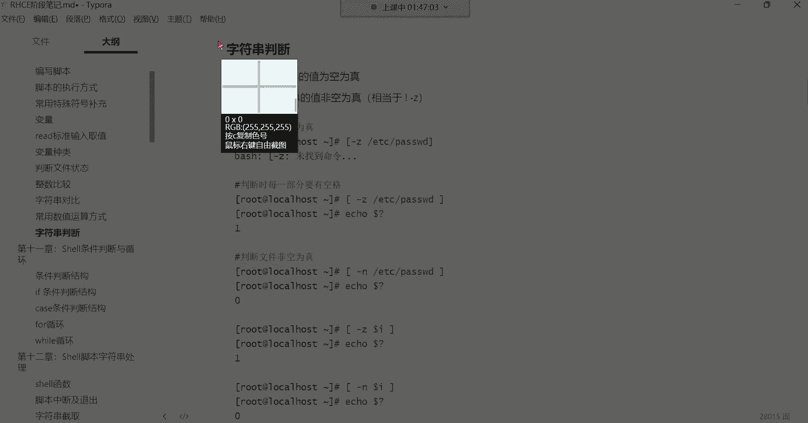

*   **`$[ ]`**：这是一种简洁的算术运算方式。
    ```bash
    echo $[1 + 1]    # 输出 2
    echo $[5 * 2]    # 输出 10
    echo $[10 / 3]   # 输出 3 (整数除法)
    echo $[10 % 3]   # 输出 1 (取余)
    ```

*   **`$(( ))`**：这是C语言风格的算术运算，功能与 `$[ ]` 类似。
    ```bash
    echo $((1 + 1))  # 输出 2
    ```


*   **`expr`**：一个外部命令，用于表达式求值。需要注意操作符两边的空格，并且乘法符号 `*` 需要转义。
    ```bash
    expr 1 + 1       # 输出 2
    expr 5 \* 2      # 输出 10 (星号需转义)
    expr 10 % 3      # 输出 1
    # 通常使用反引号或 $() 获取结果
    result=`expr 1 + 1`
    ```

*   **`let`**：一个内置命令，通常用于将算术运算的结果赋值给变量，在脚本中很常见。它支持一些简写形式。
    ```bash
    let a=1+1        # 将 1+1 的结果赋值给变量 a
    echo $a          # 输出 2

    i=5
    let i++          # i 自增1，等价于 i=i+1
    echo $i          # 输出 6
    let i+=2         # i 加2，等价于 i=i+2
    echo $i          # 输出 8
    let i*=2         # i 乘2，等价于 i=i*2
    echo $i          # 输出 16
    ```


对于初学者，掌握 `$[ ]` 和 `let` 的基本用法即可。`let` 的简写形式（如 `i++`）在阅读他人脚本时会经常遇到。


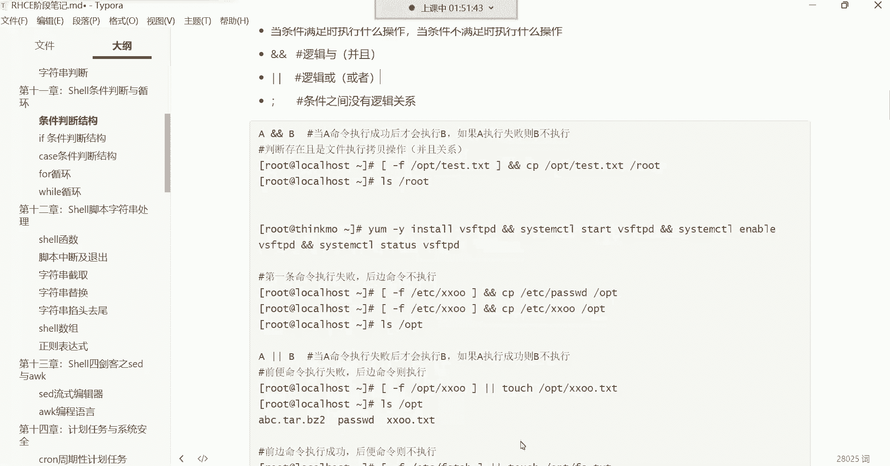

## 字符串判断

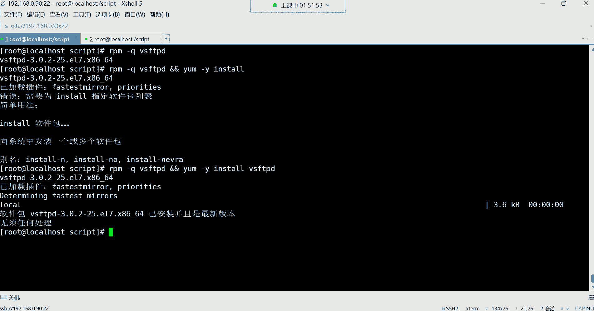

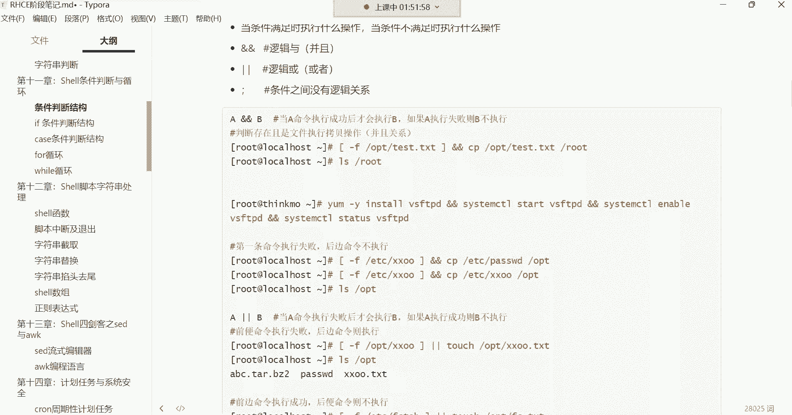

最后，我们学习如何判断一个字符串或变量的值是否为空。这与前面的“字符串对比”不同，这里是判断“有”还是“没有”。

以下是字符串判断的两个操作符：

*   **`-z`**：判断字符串长度是否为零（Zero）。如果为空，则返回真（`0`）。
    ```bash
    [ -z "" ]        # 判断空字符串，为真
    [ -z "$var" ]    # 判断变量var是否为空
    ```

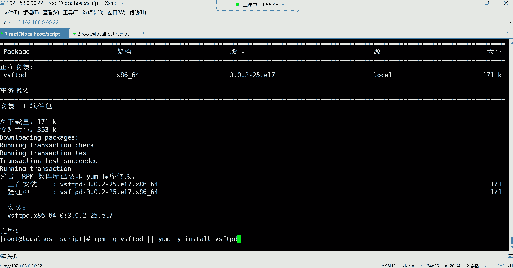

*   **`-n`**：判断字符串长度是否非零（Non-zero）。如果不为空，则返回真（`0`）。
    ```bash
    [ -n "hello" ]   # 判断非空字符串，为真
    [ -n "$USER" ]   # 判断当前用户名变量是否非空，通常为真
    ```

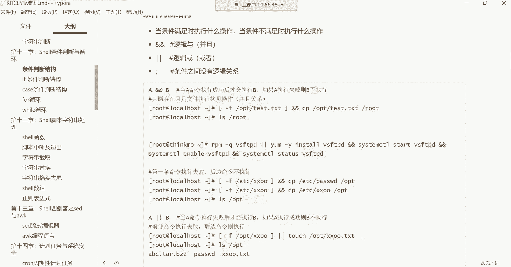

## 条件判断的简单应用：命令连接符

学习了以上基础后，我们可以将它们与命令连接符结合，实现简单的条件判断逻辑。这允许我们根据前一个命令的执行结果来决定是否执行后一个命令。

以下是三种常用的命令连接符：

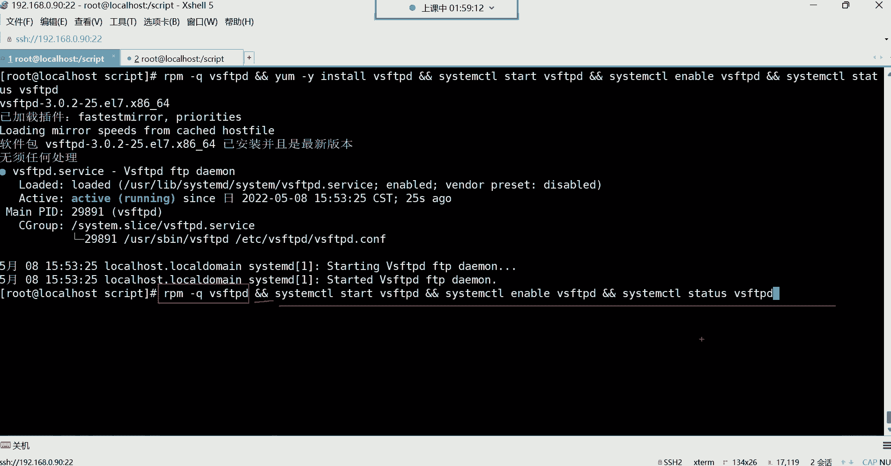


*   **`&&`（并且）**：只有前面的命令执行成功（返回状态码 `0`），后面的命令才会执行。
    ```bash
    # 如果 /etc/passwd 文件存在，则将其拷贝到 /opt 目录
    [ -f /etc/passwd ] && cp /etc/passwd /opt/

    # 如果查询到vsftpd软件包已安装，则启动该服务
    rpm -q vsftpd && systemctl start vsftpd
    ```

*   **`||`（或者）**：只有前面的命令执行失败（返回状态码非 `0`），后面的命令才会执行。
    ```bash
    # 如果查询不到vsftpd软件包，则安装它
    rpm -q vsftpd || yum install -y vsftpd
    ```


*   **`;`（分号）**：仅用于分隔命令，没有逻辑关系。无论前面的命令成功与否，后面的命令都会按顺序执行。
    ```bash
    # 依次执行三条命令，互不影响
    touch /opt/test.txt; ls /root; cd /opt
    ```


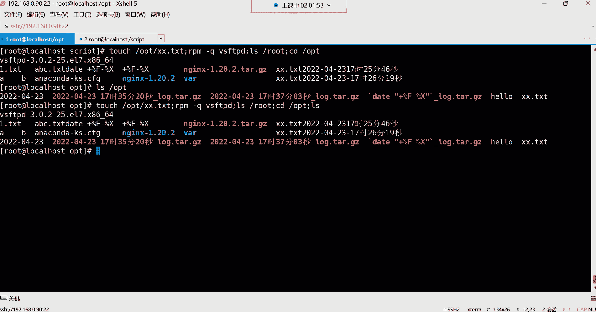

这种 `&&` 和 `||` 的组合，为编写简单的条件判断脚本提供了极大的便利。


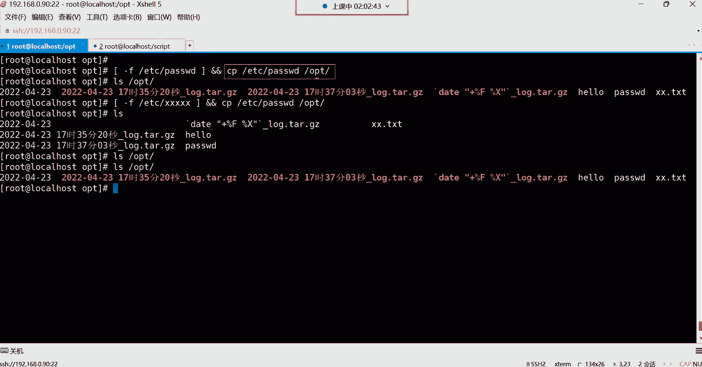

---

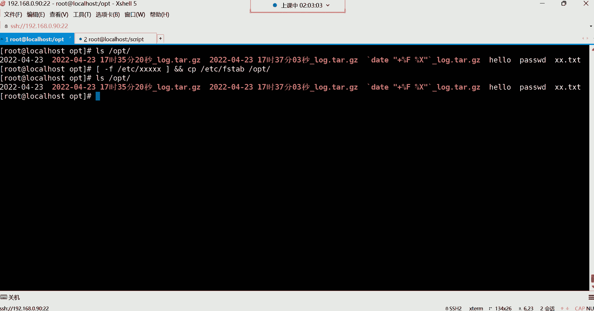

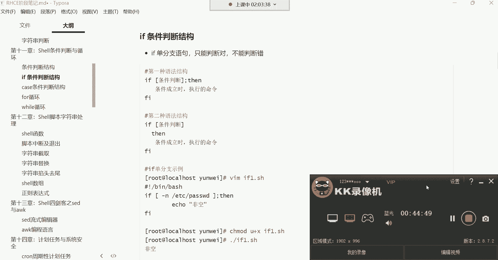

本节课中我们一起学习了Shell中判断文件状态、比较整数和字符串、进行数值运算以及判断字符串是否为空的多种方法。同时，我们还了解了如何利用 `&&` 和 `||` 实现命令间的条件执行。这些是构建更复杂逻辑判断和脚本的基石，虽然内容有些琐碎，但认识并理解它们至关重要。在后续的脚本编写实践中，我们会反复应用这些知识点。