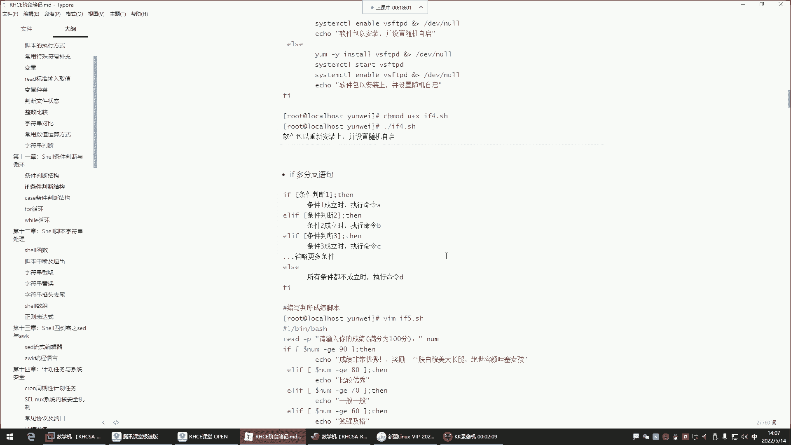
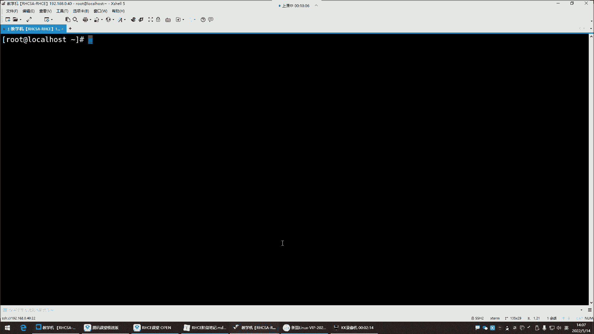
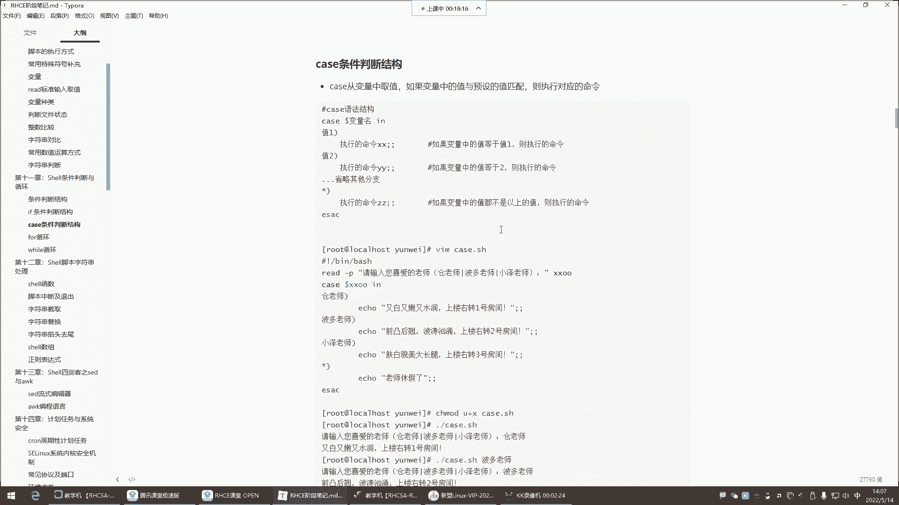
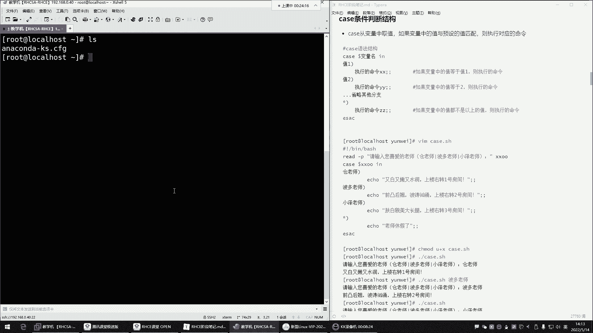
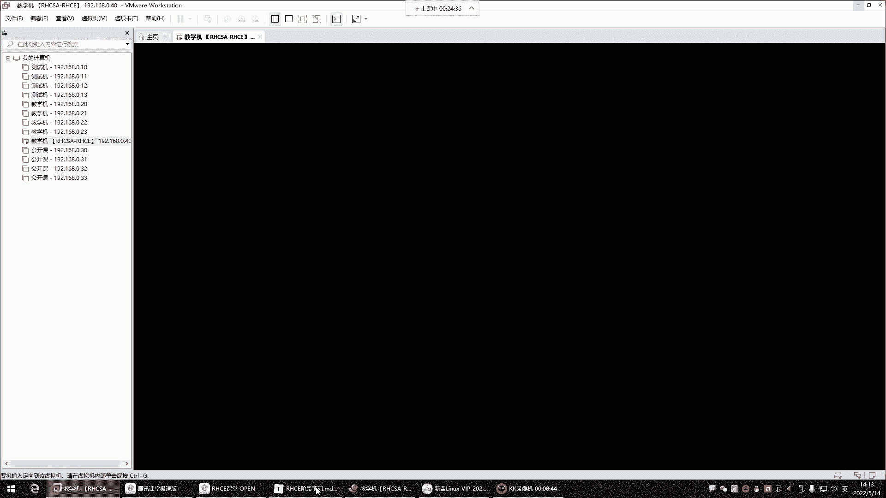
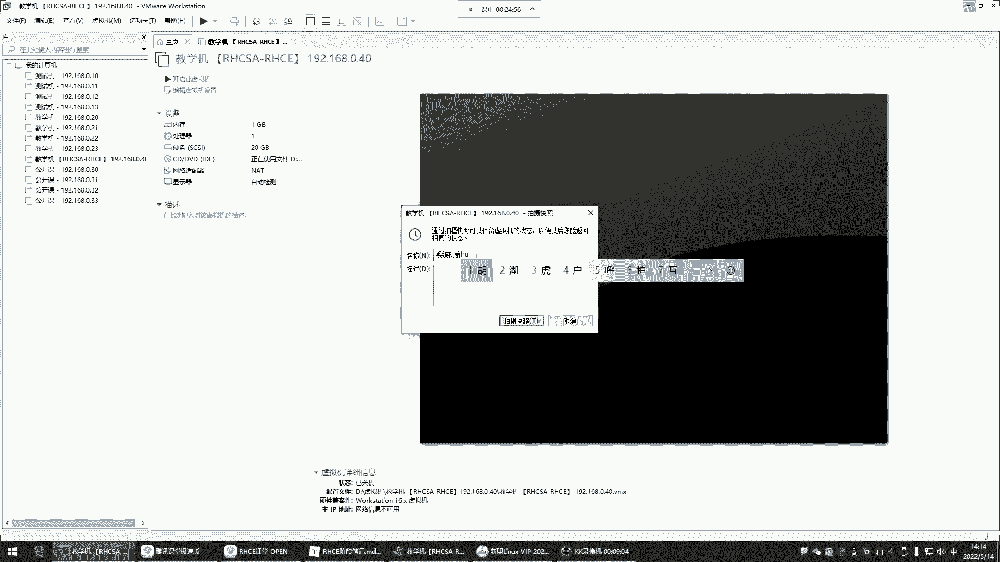
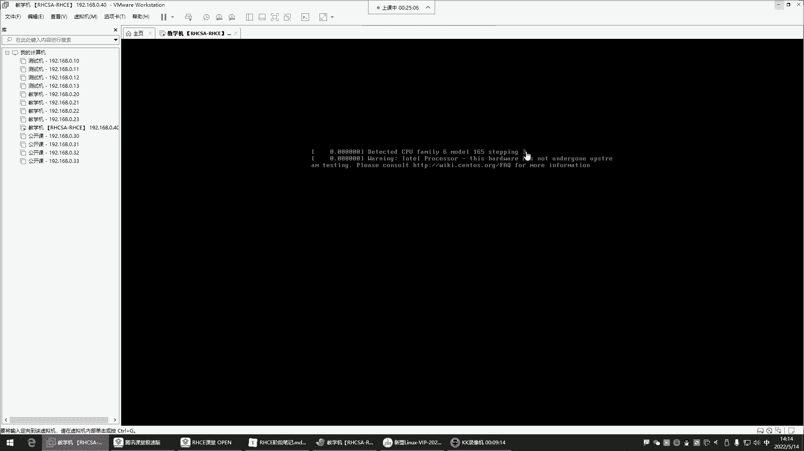
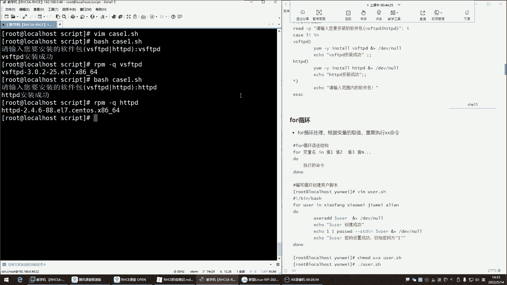
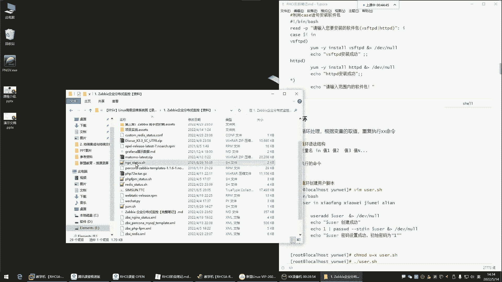
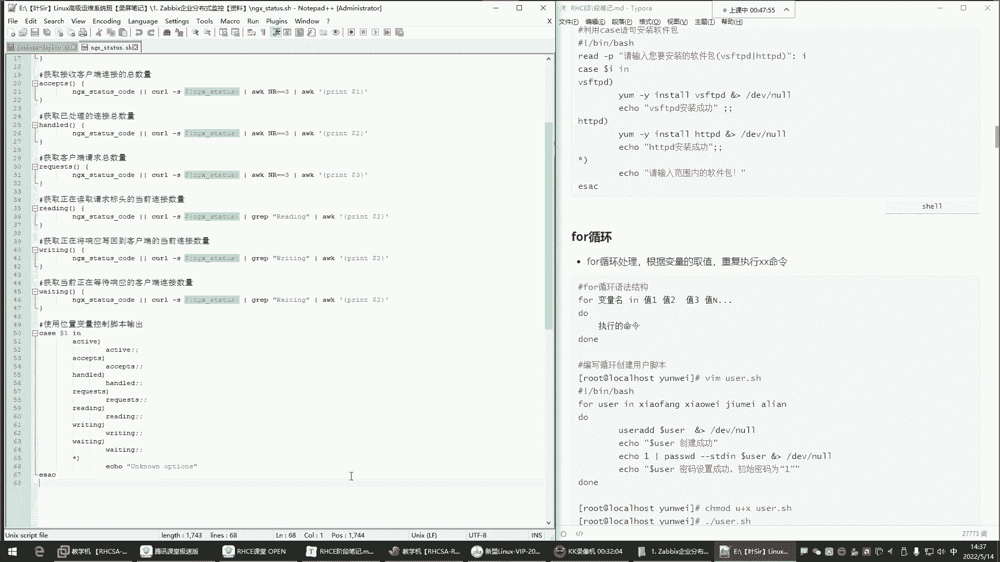

# Linux运维培训教程：1.7：case条件判断与for循环





## 概述
在本节课中，我们将学习Shell脚本编程中的`case`条件判断语句和`for`循环语句。`case`语句提供了一种更简洁的多分支条件判断方式，而`for`循环则用于重复执行一系列命令。我们将通过具体的例子来理解它们的语法和应用场景。



---

## case条件判断语句

上一节我们介绍了`if`条件判断，本节中我们来看看`case`条件判断。`case`语句的功能与`if`类似，都是根据条件执行不同的命令，但它的语法更简洁，适用于对单一变量进行多种固定值匹配的场景。

### 语法结构
`case`语句的基本语法如下：
```bash
case 变量名 in
"值1")
    命令序列1
    ;;
"值2")
    命令序列2
    ;;
*)
    默认命令序列
    ;;
esac
```
它的工作原理是：从变量中取值，然后依次与预定义的值（如“值1”、“值2”）进行匹配。一旦匹配成功，就执行对应的命令序列，然后结束整个`case`判断（匹配即停止）。如果所有预设值都不匹配，则执行默认（`*`）分支的命令。

以下是`case`语句的一个简单应用示例：
```bash
#!/bin/bash
read -p "请输入你喜欢的老师名字：" teacher
case $teacher in
    "苍老师")
        echo "苍老师特点：又白又嫩又水润。上楼右转一号房间。"
        ;;
    "波多老师")
        echo "波多老师特点：前凸后翘，波涛汹涌。上楼右转二号房间。"
        ;;
    "小泽老师")
        echo "小泽老师特点：肤白貌美大长腿。上楼右转三号房间。"
        ;;
    *)
        echo "该老师今天休息，没上班。"
        ;;
esac
```
在这个脚本中，用户输入的值会与`case`中预设的老师名字进行匹配，并输出相应的描述。









### 注意事项
1.  每个分支的命令序列必须以双分号 `;;` 结束，这代表该分支的结束。
2.  最后一个分支 `*)` 是默认分支，可以匹配任何值，通常用于处理未预料到的情况。
3.  匹配是**大小写敏感**的。

---

## for循环语句

在掌握了条件判断后，我们常常需要让某些操作重复执行多次，这时就需要用到循环。本节我们来学习`for`循环，它特别适合用于遍历一个已知的列表。

### 语法结构
`for`循环的基本语法有两种常见形式：

**形式一：遍历值列表**
```bash
for 变量 in 值1 值2 值3 ...
do
    命令序列
done
```
循环会依次将“值1”、“值2”等赋值给变量，并执行循环体内的命令。

**形式二：类C语言风格**
```bash
for ((初始值; 循环条件; 变量变化))
do
    命令序列
done
```
这种形式更接近其他编程语言中的`for`循环。

### 应用示例

以下是`for`循环的几个典型应用：

**示例1：遍历固定列表**
```bash
#!/bin/bash
for package in vsftpd httpd mariadb
do
    yum install -y $package &> /dev/null && echo "$package 安装成功。"
done
```
这个脚本会依次安装列表中的三个软件包。

**示例2：遍历命令执行结果**
```bash
#!/bin/bash
for user in `cat /etc/passwd | cut -d: -f1`
do
    echo "系统用户：$user"
done
```
这个脚本会列出系统中所有用户的用户名。

**示例3：类C风格循环**
```bash
#!/bin/bash
for ((i=1; i<=5; i++))
do
    echo "这是第 $i 次循环。"
done
```
这个脚本会循环5次，每次输出当前的循环次数。

**示例4：遍历位置参数**
```bash
#!/bin/bash
for param in $@
do
    echo "输入的参数是：$param"
done
```
执行脚本时，在脚本名后面输入的参数都会被这个循环遍历并打印出来。





---

## 总结
本节课我们一起学习了Shell脚本中两个重要的结构：`case`条件判断和`for`循环。
*   `case`语句提供了一种清晰、简洁的方式来处理多分支条件匹配，特别适合对固定值进行判断。
*   `for`循环则用于重复执行任务，无论是遍历一个固定的列表、文件内容，还是执行特定次数的操作，它都能高效完成。



理解并掌握这两种结构，将极大地增强你编写自动化脚本的能力。