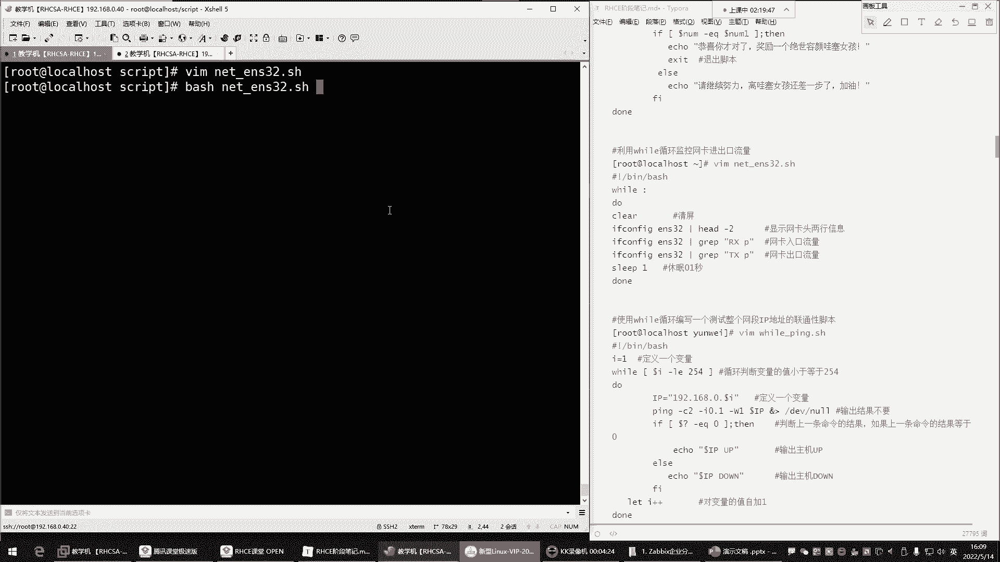
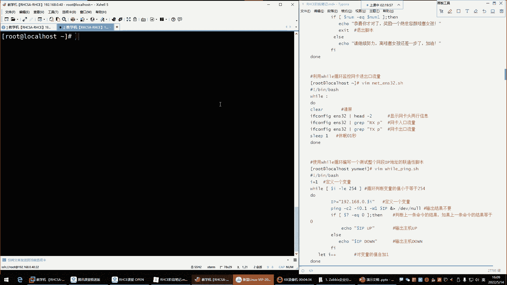
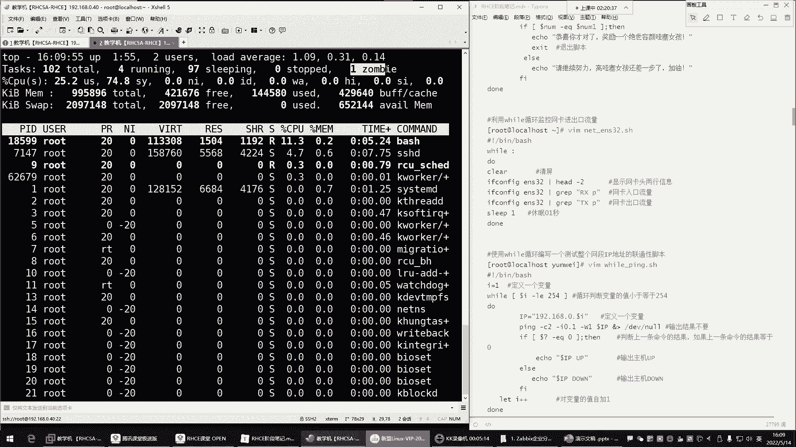
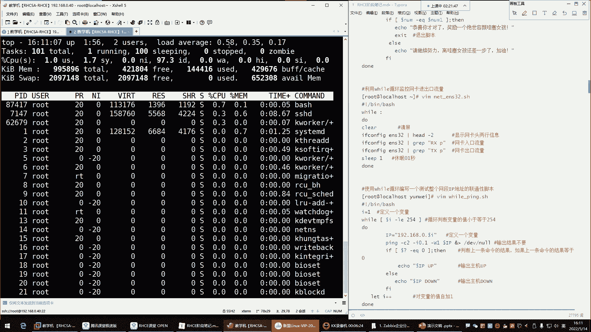
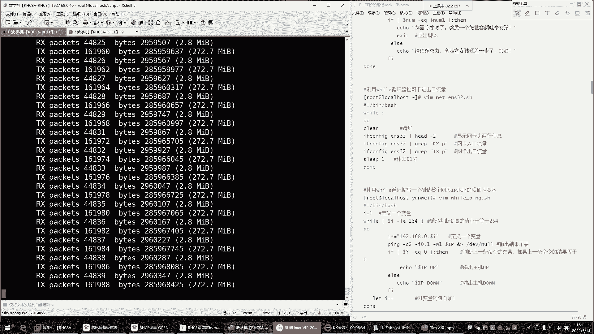
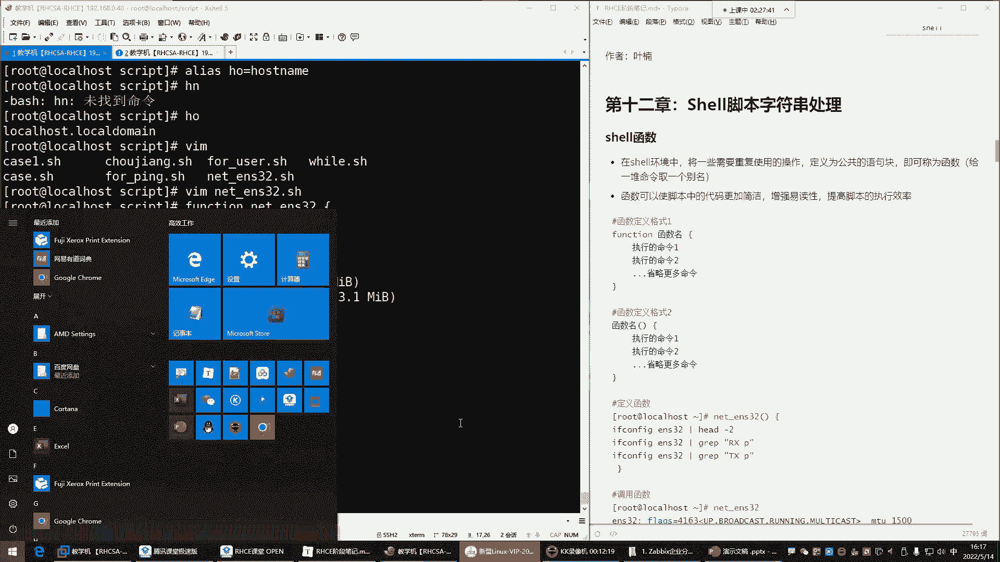
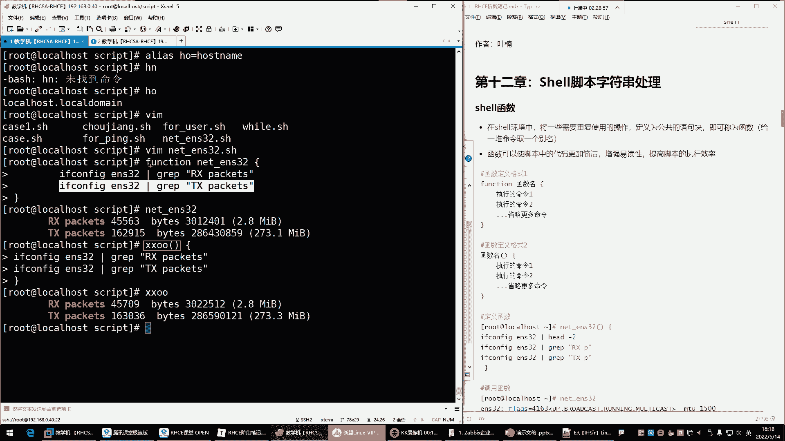

# Linux运维培训教程：45：shell函数、脚本中断及退出、字符串处理 🐧

在本节课中，我们将学习Shell脚本编程中的三个重要概念：**函数**、**脚本中断与退出**以及**字符串处理**。这些知识能帮助我们编写更高效、更智能的脚本。

---

## 利用while循环进行持续监控






上一节我们介绍了循环结构，本节中我们来看看如何利用`while`循环来执行持续性的任务，例如监控系统资源。



`while`循环可以创建“死循环”，持续执行某些命令。其基本语法如下：


```bash
while :
do
    # 要执行的命令
done
```
或者使用 `while true`，效果相同。






例如，我们可以编写一个脚本来持续监控网卡流量：

```bash
#!/bin/bash
while :
do
    clear
    ifconfig ens32 | grep "RX packets"
    ifconfig ens32 | grep "TX packets"
    sleep 0.2
done
```

**核心概念解释**：
*   `while :` 或 `while true`：创建一个无限循环。
*   `clear`：清空终端屏幕，使输出更清晰。
*   `sleep 0.2`：让脚本暂停0.2秒，避免过度消耗CPU资源。

**注意**：纯粹的`while`死循环会大量占用CPU。通过加入`sleep`命令可以显著降低CPU使用率。

---

## Shell函数：给一组命令取别名




函数可以将一系列需要重复使用的命令封装起来，使脚本结构更清晰、易读，并提高代码复用率。


定义函数有两种常用格式：



**格式一：使用 `function` 关键字**
```bash
function 函数名 {
    命令1
    命令2
    ...
}
```

**格式二：简化格式（更常用）**
```bash
函数名() {
    命令1
    命令2
    ...
}
```

以下是一个定义并调用函数的例子：

```bash
#!/bin/bash
# 定义一个名为sys_info的函数
sys_info() {
    hostname
    cat /etc/redhat-release
    free -h
    df -h /
}

# 调用函数
sys_info
```


**核心概念解释**：
*   **函数名()**：定义函数，`()`是固定格式。
*   **{ ... }**：花括号内包含函数要执行的所有命令。
*   **调用函数**：在脚本中直接写入函数名即可执行其内部的所有命令。


函数就像给**一组命令**起了一个别名（`alias`是给**单个命令**起别名），在复杂的脚本中，通过调用函数名来执行一系列操作，能极大简化代码。

---


## 脚本的中断与退出控制


在循环或条件判断中，我们有时需要控制脚本的执行流程，例如在满足某个条件时跳过本次循环、结束整个循环，甚至直接退出脚本。

以下是三个控制流程的关键字：

1.  **`continue`**：结束**本次**循环，直接进入下一次循环。
2.  **`break`**：结束**整个**循环，执行循环体之后的命令。
3.  **`exit`**：直接**退出整个脚本**。

我们可以通过一个例子来理解它们的区别：

```bash
#!/bin/bash
for i in {1..5}
do
    if [ $i -eq 3 ]; then
        # 尝试分别替换为 continue, break, exit 观察效果
        continue
    fi
    echo "循环次数: $i"
done
echo “循环外的命令”
```

**执行效果对比**：
*   使用 **`continue`**：输出 `1, 2, 4, 5` 和“循环外的命令”。当`i=3`时跳过，继续后续循环。
*   使用 **`break`**：输出 `1, 2` 和“循环外的命令”。当`i=3`时直接跳出整个`for`循环。
*   使用 **`exit`**：输出 `1, 2`。当`i=3`时整个脚本立即停止，“循环外的命令”也不会执行。

这个功能非常实用，例如在“猜数字”游戏中，一旦猜中，就可以用`exit`让脚本直接结束。

---

## 字符串处理：截取操作

在处理命令输出或进行判断时，经常需要从字符串中提取特定部分。字符串截取是基础操作之一。

首先，定义一个字符串变量并查看其长度：
```bash
phone="13800138000"
echo ${#phone} # 输出：11，表示字符串有11个字符
```

**字符串截取语法**：
```bash
${变量名:起始位置:截取长度}
```
**注意**：起始位置从 **0** 开始计算。

以下是字符串截取的示例：
```bash
phone="13800138000"
echo ${phone:0:3}   # 输出：138，从第0位开始，截取3位
echo ${phone:3:4}   # 输出：0013，从第3位开始，截取4位
echo ${phone:7}     # 输出：8000，从第7位开始，截取到末尾
```

**核心概念解释**：
*   **`${#变量名}`**：获取字符串变量的长度（字符数）。
*   **`:`**：用于指定截取的起始位置。
*   若不指定截取长度，则默认截取到字符串末尾。

虽然字符串处理在初期使用不多，但在进行日志分析、数据提取等高级脚本编写时是必备技能。

---

## 总结

本节课我们一起学习了Shell脚本编程中的三个核心技巧：
1.  **`while`死循环**：用于编写持续监控类脚本，并通过`sleep`控制频率。
2.  **Shell函数**：通过`函数名() { ... }`的格式封装命令集合，提升脚本的简洁性和可读性。
3.  **流程控制**：使用`continue`、`break`和`exit`精确控制脚本在循环中的执行与退出。
4.  **字符串截取**：使用`${变量名:起始位:长度}`的语法从字符串中提取所需部分。


掌握这些知识，将使你编写的Shell脚本更加灵活、强大和高效。