# Linux运维培训教程：P46：Shell字符串处理与脚本实践

在本节课中，我们将学习Shell脚本中的字符串处理技巧，包括截取、替换和掐头去尾等操作。同时，我们也会探讨一个重要的理念：在实际工作中，学会借鉴和修改现有脚本往往比从零开始编写更为高效。

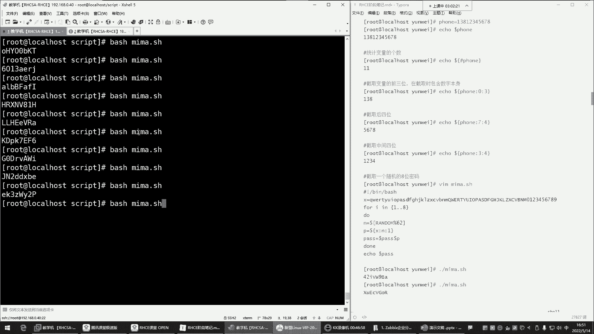

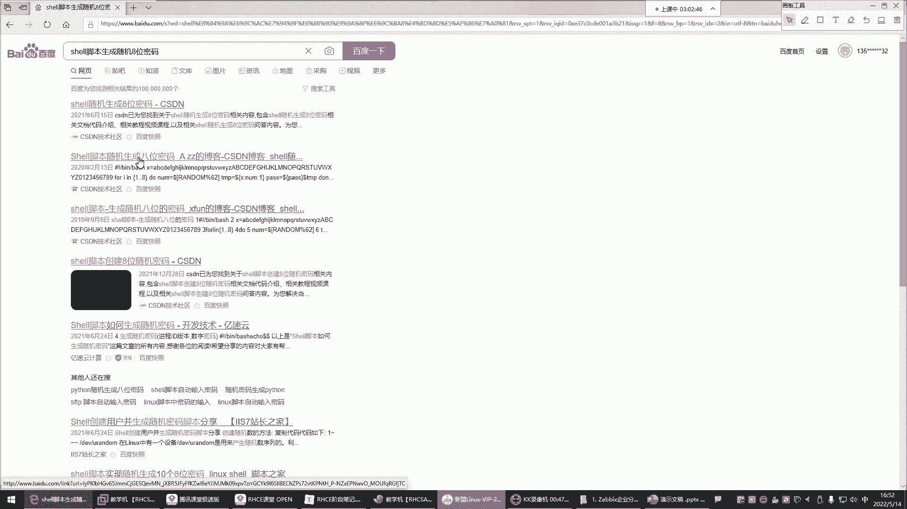

## 字符串截取

上一节我们介绍了Shell脚本的基础概念，本节中我们来看看字符串处理。字符串截取是指从一个字符串变量中提取指定部分的内容。其核心语法是使用 `${变量名:起始位置:长度}` 的格式。

**公式**：`${变量名:起始位置:长度}`

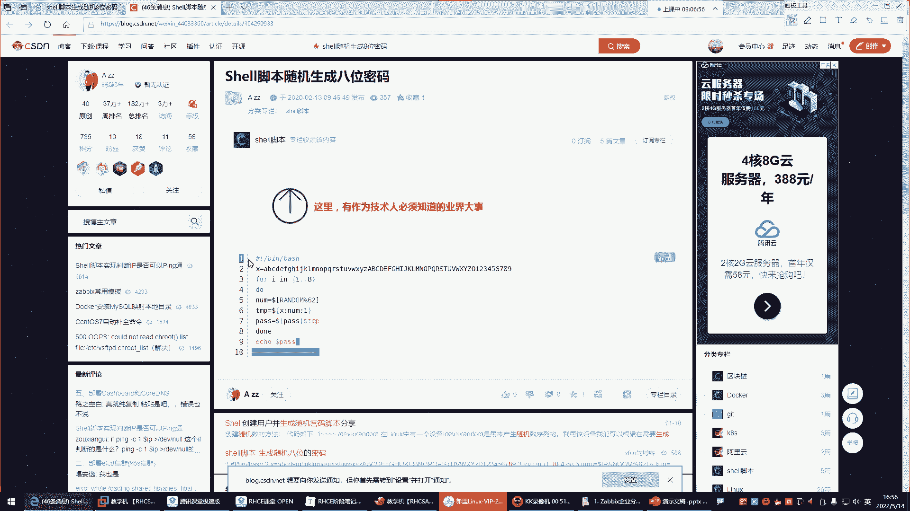

例如，我们有一个变量 `phone="13812345678"`，想要截取后四位“5678”。
```bash
phone="13812345678"
echo ${phone:7:4}
```
执行上述命令会输出“5678”。这里的起始位置“7”是从0开始计数的，表示从字符串的第8个字符开始截取，长度为4个字符。

字符串截取功能不仅限于数字，也可以用于处理文件内容等文本数据。了解这个功能的存在即可，无需死记硬背语法。

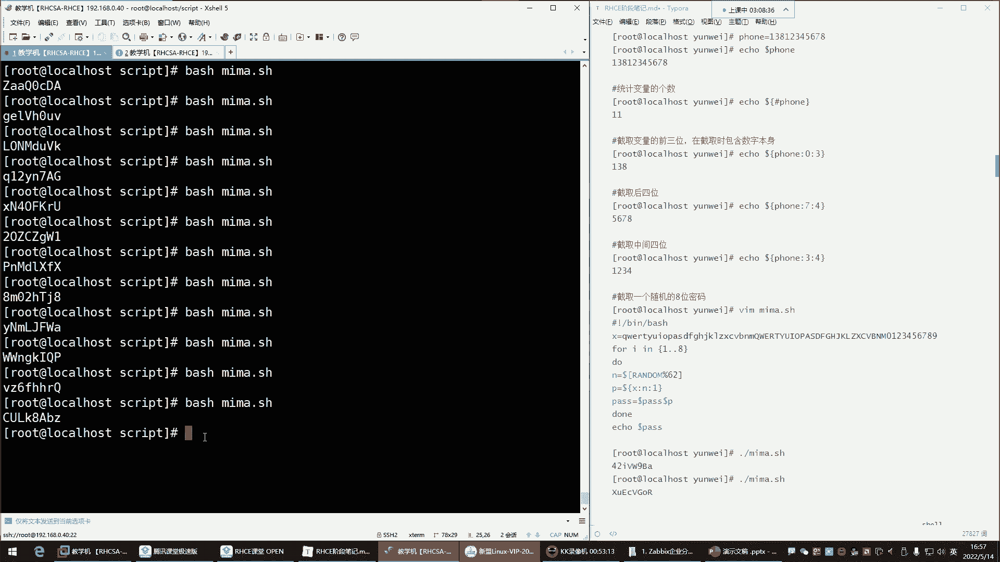

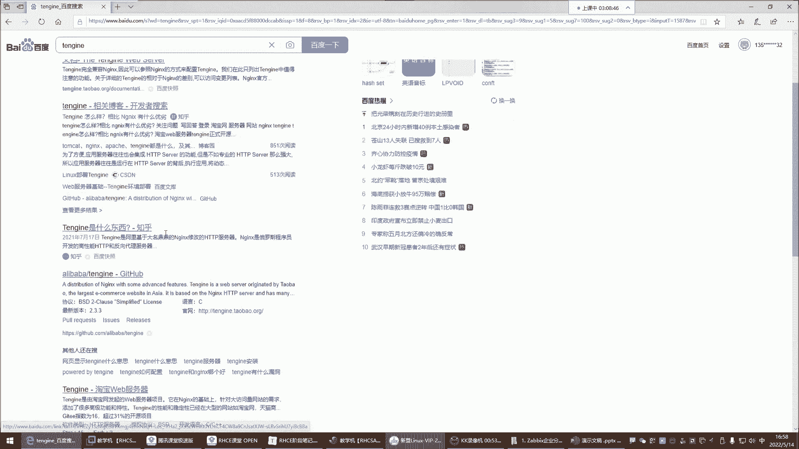

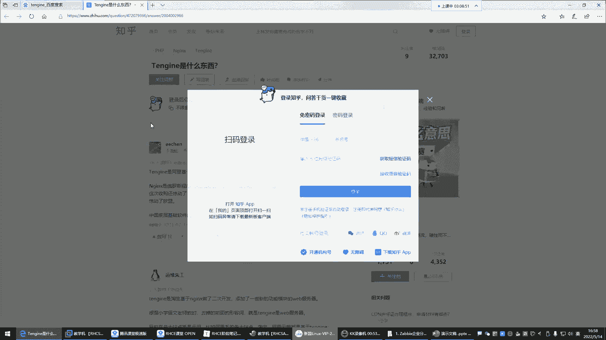

## 生成随机密码示例

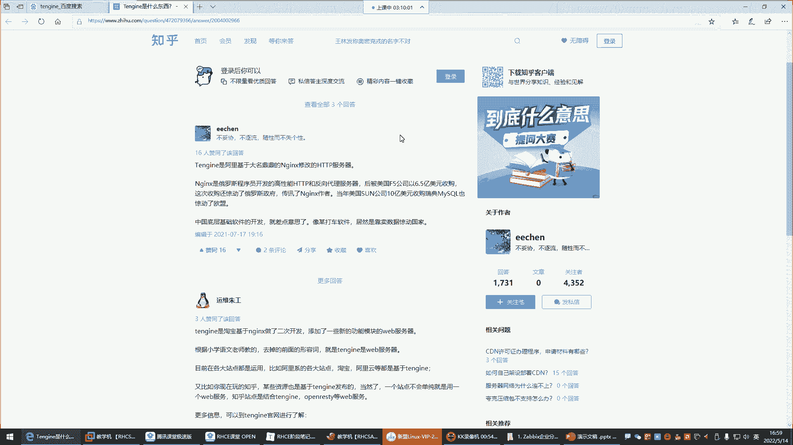

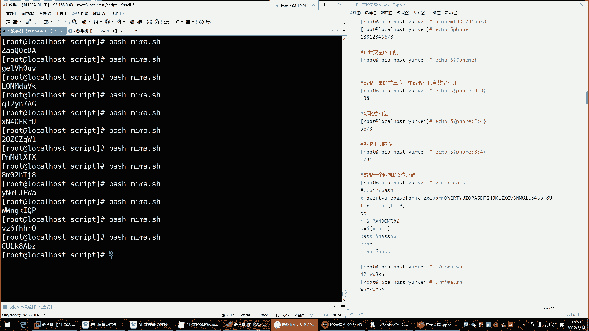

字符串截取的一个实用场景是生成随机密码。以下是实现随机生成8位密码的一个脚本示例：

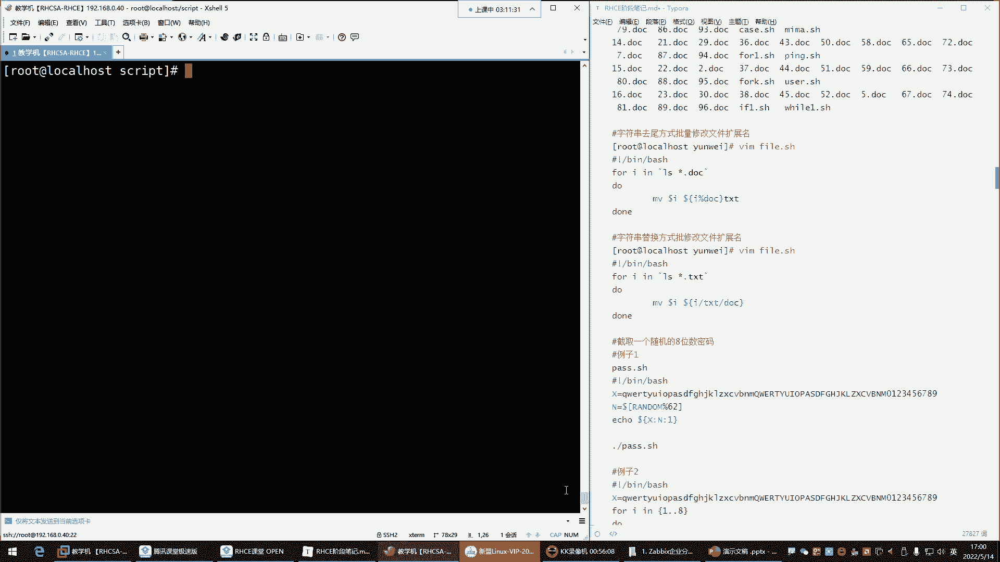

```bash
#!/bin/bash
# 定义包含大小写字母和数字的字符串
str="abcdefghijklmnopqrstuvwxyzABCDEFGHIJKLMNOPQRSTUVWXYZ0123456789"
pass=""
# 循环8次，每次随机选取一个字符
for i in {1..8}
do
    index=$[RANDOM%62]  # 生成0-61的随机数
    tmp=${str:index:1}  # 从字符串中截取一个字符
    pass=${pass}${tmp}  # 将字符拼接到密码中
done
echo $pass
```

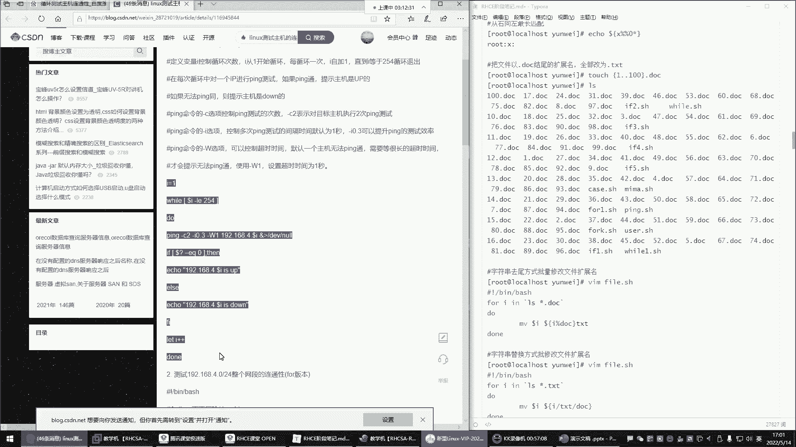

这个脚本的思路是：
1.  将所有可能的字符（62个）定义在一个字符串变量中。
2.  通过循环8次，每次利用 `$RANDOM` 生成一个随机数，并对62取余，确保索引在0到61之间。
3.  使用字符串截取语法 `${str:index:1}` 从字符池中取出一个字符。
4.  将每次取出的字符拼接起来，最终形成8位随机密码。

**核心思想**：在实际工作中，遇到类似需求时，我们不必自己从头构思和编写所有代码。善于搜索并借鉴他人成熟的解决方案，是快速解决问题的重要能力。

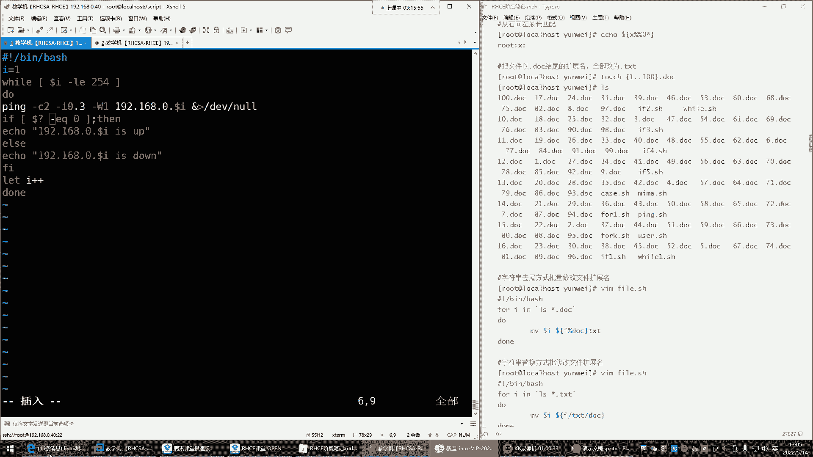

## 字符串替换

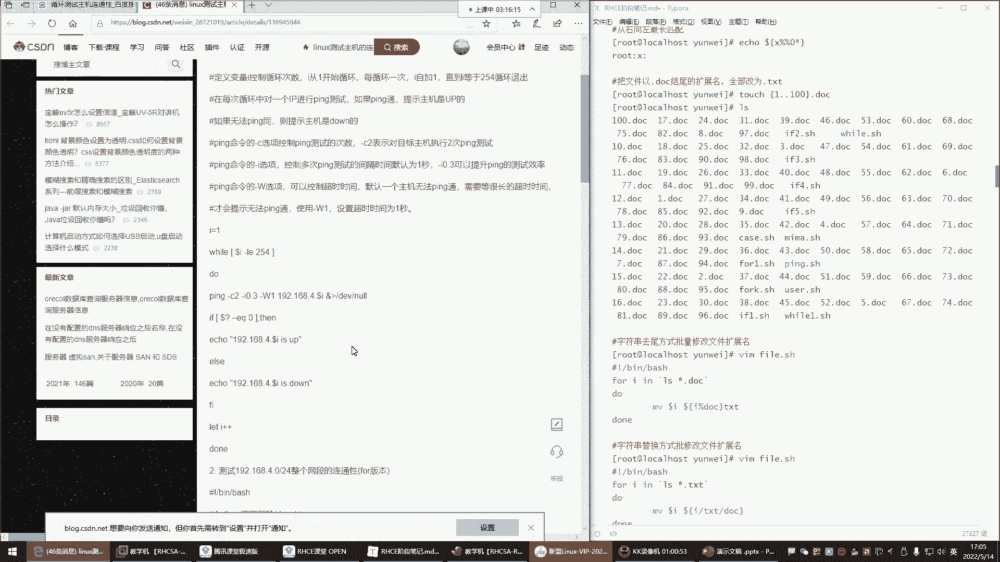

字符串替换是指将字符串中的某些内容更改为新的内容。其语法格式为 `${变量名/旧内容/新内容}`。

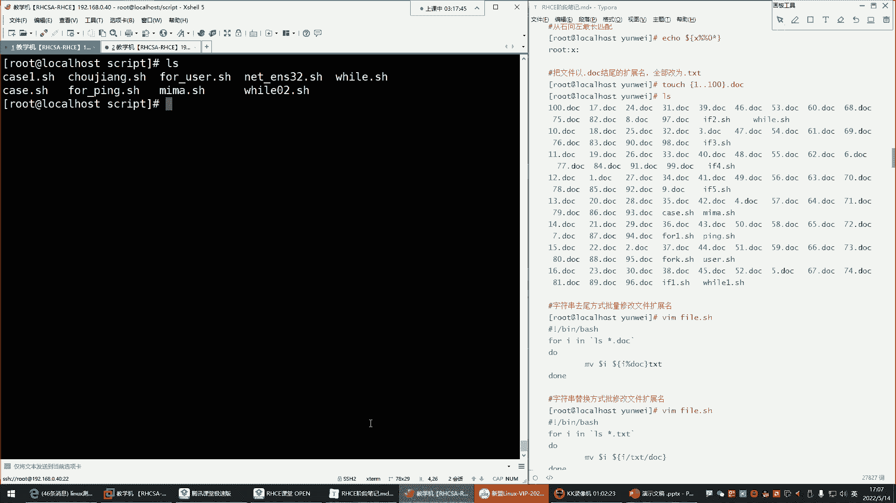

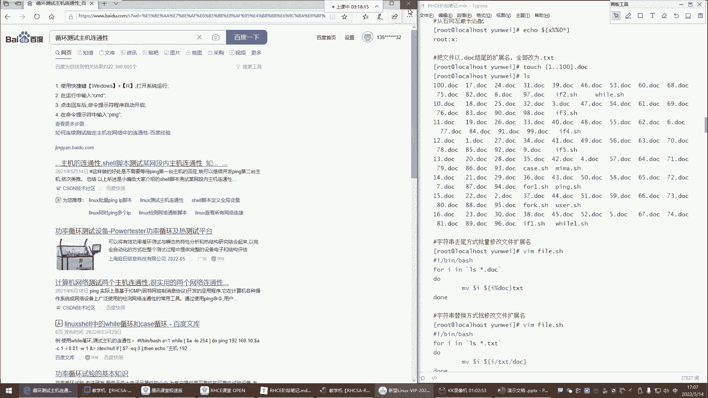

**公式**：`${变量名/旧内容/新内容}` 或 `${变量名//旧内容/新内容}`

单斜杠 `/` 表示只替换**第一个**匹配到的旧内容，而双斜杠 `//` 表示替换**所有**匹配到的旧内容。

例如，对于变量 `info="abc123abc456"`：
```bash
info="abc123abc456"
echo ${info/abc/XYZ}   # 输出：XYZ123abc456，只替换了第一个abc
echo ${info//abc/XYZ}  # 输出：XYZ123XYZ456，替换了所有的abc
```

这个功能类似于文本编辑器（如Vim）中的替换操作，但它是针对变量中的值进行的。

## 字符串“掐头去尾”

“掐头去尾”是指删除字符串开头或结尾的指定部分。这主要通过特定的符号组合来实现。

**公式**：
*   **掐头（删除开头匹配的部分）**：
    *   `${变量名#关键词}`：最短匹配删除。
    *   `${变量名##关键词}`：最长匹配删除。
*   **去尾（删除结尾匹配的部分）**：
    *   `${变量名%关键词}`：最短匹配删除。
    *   `${变量名%%关键词}`：最长匹配删除。

这里的“最短匹配”和“最长匹配”是正则表达式中的概念。简单来说，“最短匹配”会尽可能少地删除字符，而“最长匹配”会尽可能多地删除字符。

例如，对于变量 `path="/usr/local/bin/app"`：
```bash
path="/usr/local/bin/app"
echo ${path#/*/}        # 输出：local/bin/app (删除到第一个`/`之后)
echo ${path##/*/}       # 输出：app (删除到最后一个`/`之后)
echo ${path%/*}         # 输出：/usr/local/bin (删除最后一个`/`之后的部分)
echo ${path%%/*}        # 输出：(空，删除第一个`/`之前的部分，但第一个字符就是`/`，所以全删了)
```

## 实践案例：批量修改文件扩展名

学习了字符串处理的基本操作后，我们来看一个综合应用案例：批量修改当前目录下所有文件的扩展名。

假设我们有很多 `.txt` 文件，需要将它们批量改为 `.doc`。

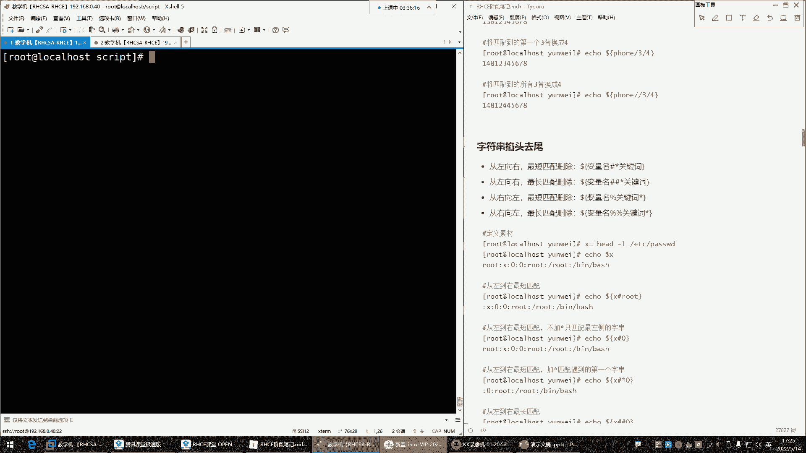

**方法一：使用字符串“去尾”和拼接**
```bash
#!/bin/bash
for file in *.txt
do
    # 去掉原文件的 .txt 后缀，然后加上 .doc
    mv "$file" "${file%.txt}.doc"
done
```

**方法二：使用字符串替换**
```bash
#!/bin/bash
for file in *.txt
do
    # 将文件名中的 .txt 替换为 .doc
    mv "$file" "${file/.txt/.doc}"
done
```

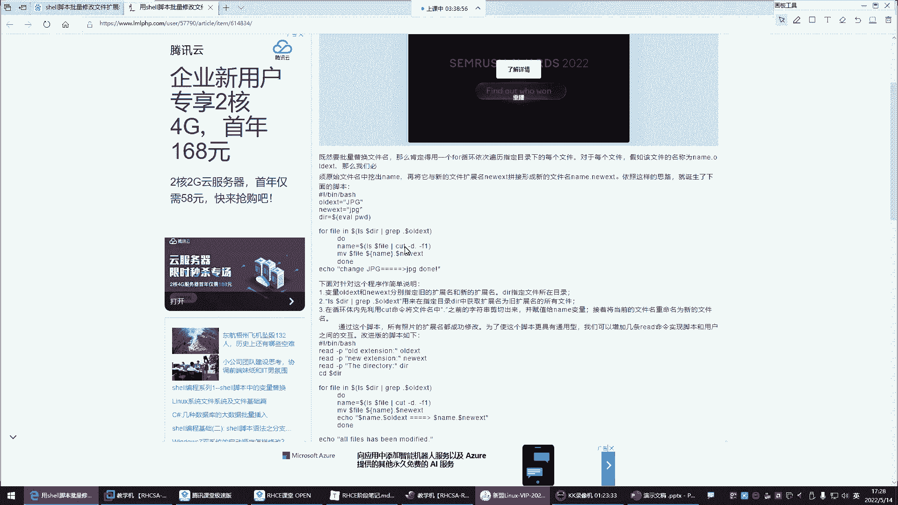

**方法三：借鉴网络上的脚本（并优化）**
有时在网上找到的脚本可能包含不必要的步骤（例如排序），我们可以理解其思路后进行简化：
```bash
#!/bin/bash
# 原脚本可能包含排序，但此处不需要
for file in *.txt
do
    mv "$file" "${file/.txt/.doc}"
done
echo "文件扩展名已从 .txt 批量修改为 .doc"
```

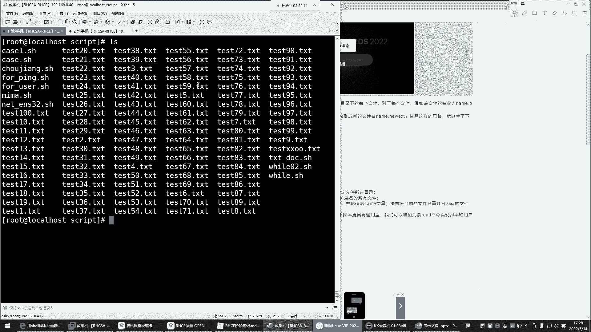

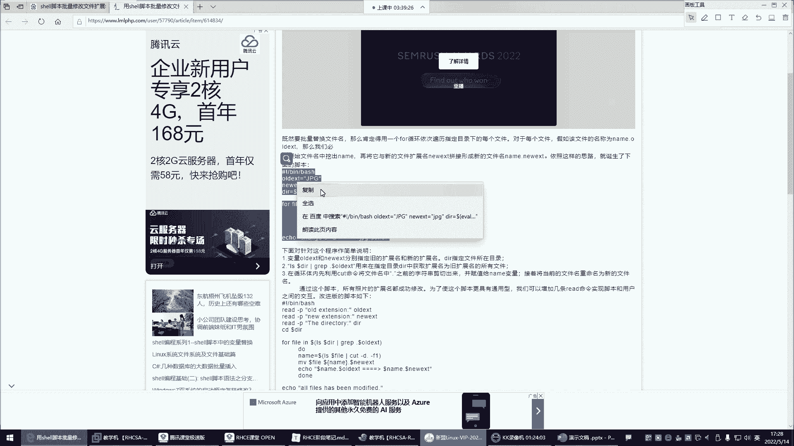

这个案例清晰地展示了如何将字符串处理技巧应用于实际任务。更重要的是，它印证了本节课的核心观点：**掌握Shell脚本的关键不在于记忆所有命令的复杂语法，而在于理解其核心逻辑，并具备搜索、阅读、理解和修改现有脚本的能力。**

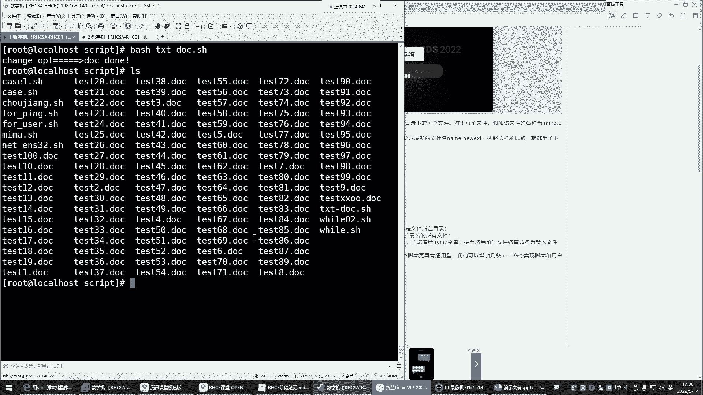

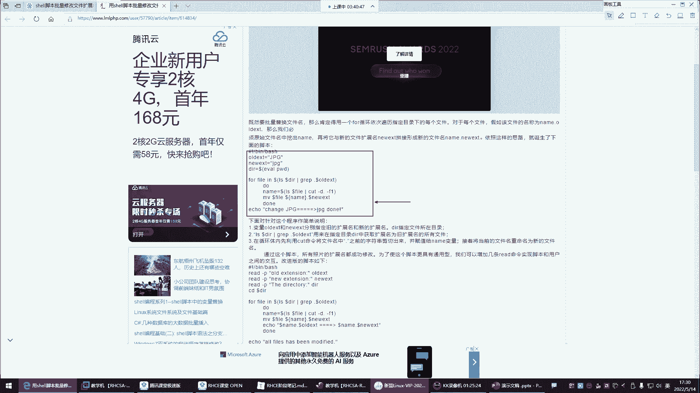

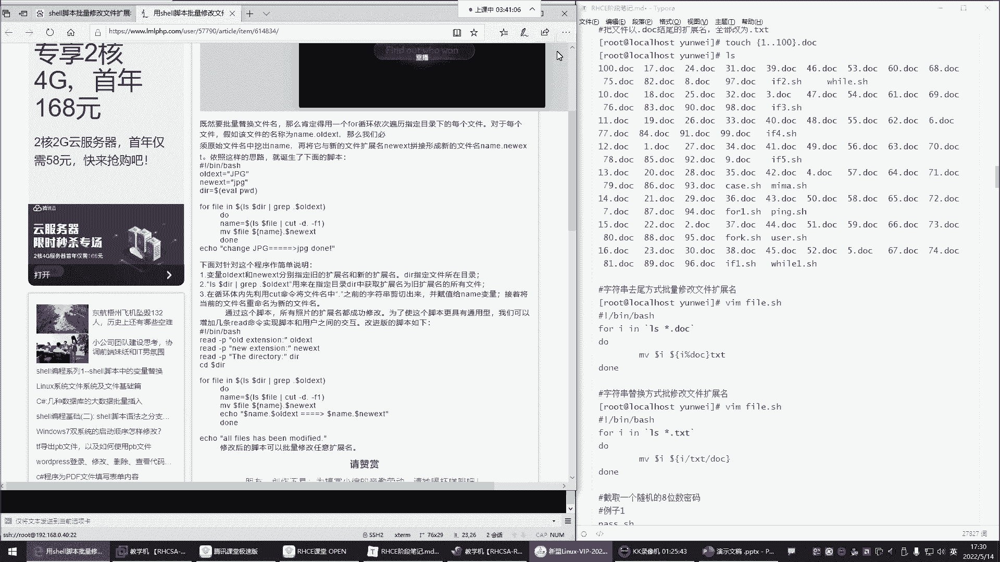

## 总结

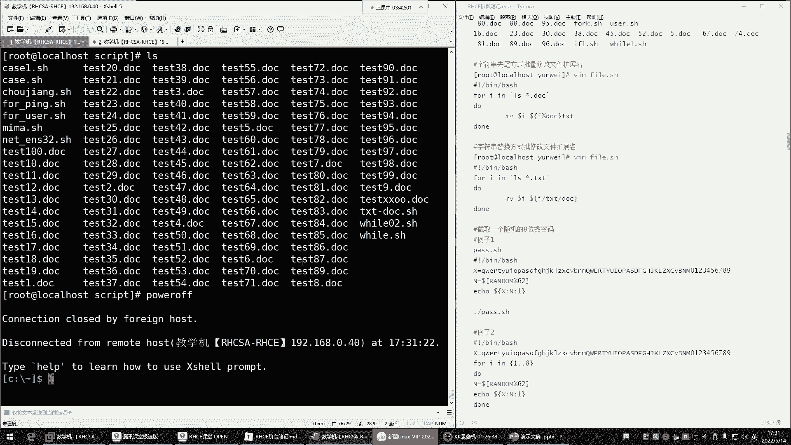

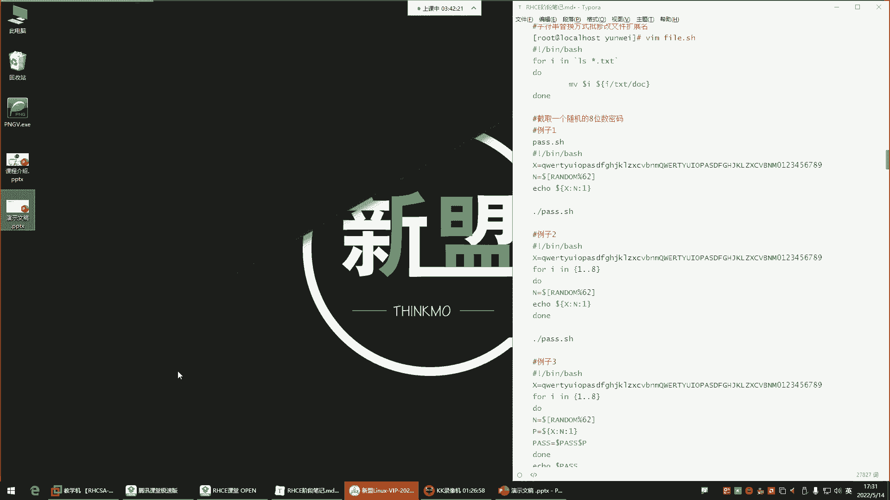

本节课中我们一起学习了Shell脚本中的字符串处理，包括：
1.  **字符串截取**：使用 `${变量:起始位:长度}` 格式提取子串。
2.  **字符串替换**：使用 `${变量/旧/新}` 或 `${变量//旧/新}` 进行局部或全局替换。
3.  **字符串掐头去尾**：使用 `#`, `##`, `%`, `%%` 符号组合删除字符串首尾部分。

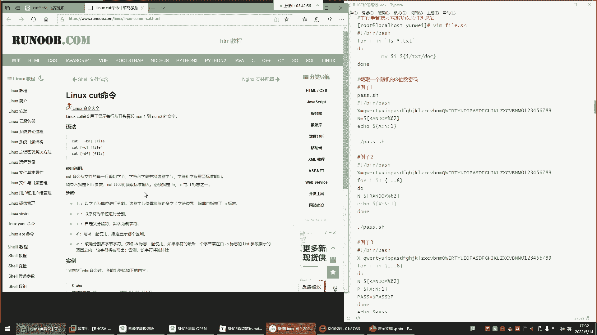

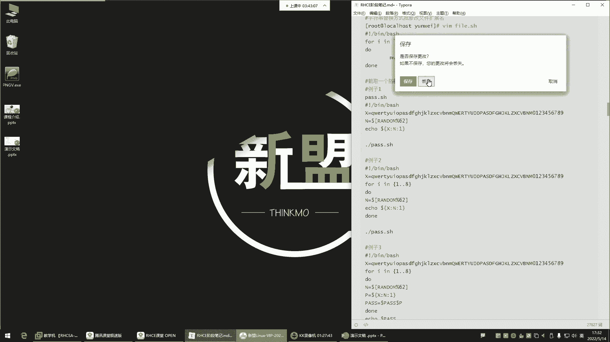

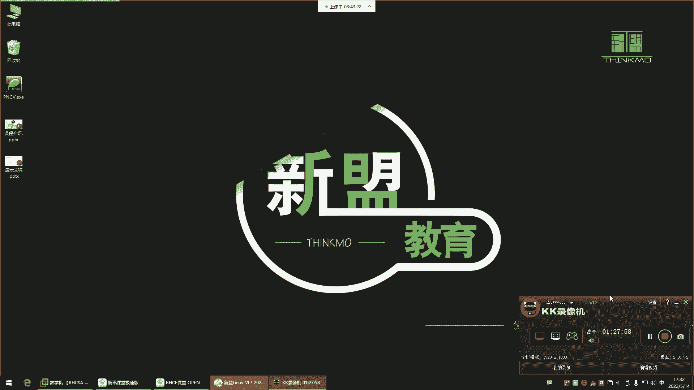

通过这些知识，我们可以完成诸如生成随机密码、批量重命名文件等任务。然而，比这些具体语法更重要的是我们树立了一个高效的学习和工作理念：**在开源和共享的互联网时代，善于“站在巨人的肩膀上”，通过搜索、借鉴和修改来解决问题，是运维工程师的一项核心技能。** 学习Shell脚本，首要目标是能看懂别人的代码并知道如何为己所用，其次才是自己动手编写。