# Linux运维培训教程：1.47：Shell数组与正则表达式

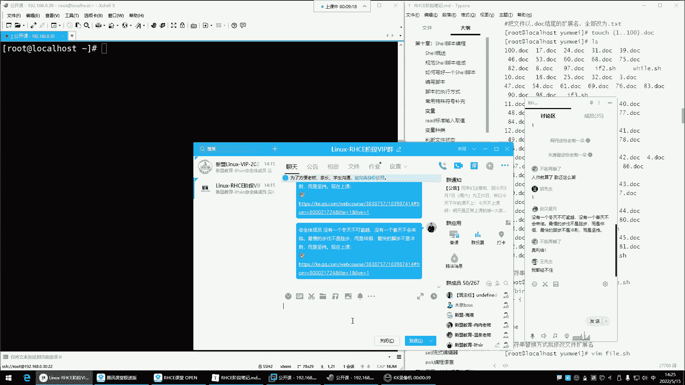

在本节课中，我们将要学习Shell脚本中的两个重要概念：数组和正则表达式。数组是变量的高级形式，允许在一个变量名中存储多个值。正则表达式则是一套用于匹配和处理文本的强大工具，通过一系列特殊符号来表达复杂的搜索模式。掌握这两者对于编写高效脚本和进行文本处理至关重要。

## Shell数组

上一节我们介绍了变量的基本用法，本节中我们来看看Shell数组。数组可以理解为一种特殊的变量，它允许你在一个变量名中存储多个值，而不是单个值。这使得在处理列表数据时更加方便。

### 数组的定义与取值

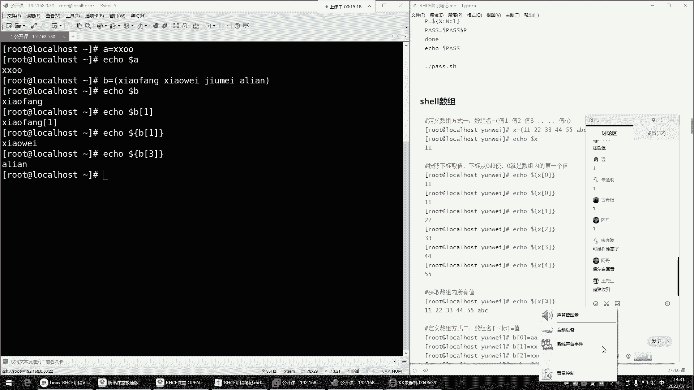

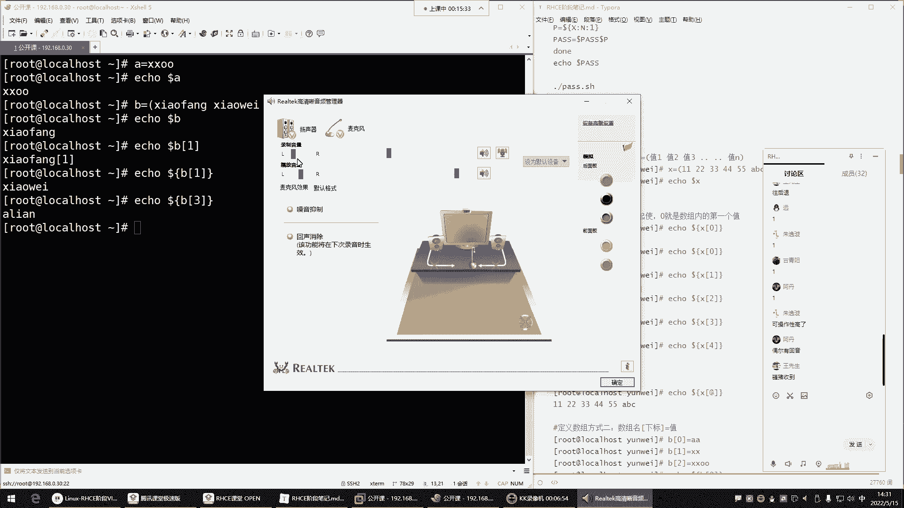

定义数组的语法与定义变量类似，但值需要用小括号 `()` 括起来，值之间用空格分隔。

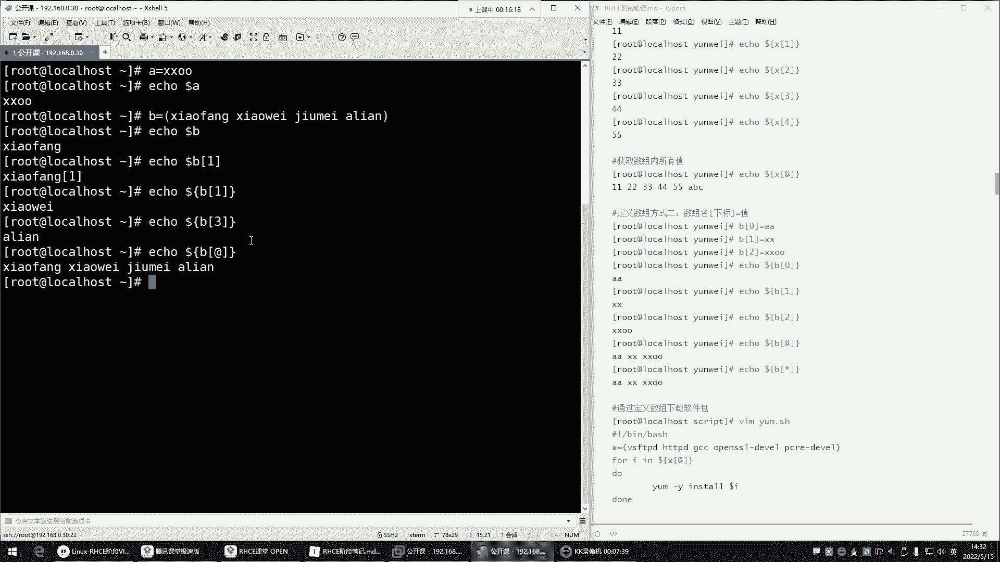

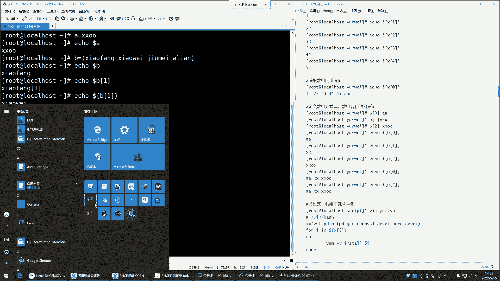

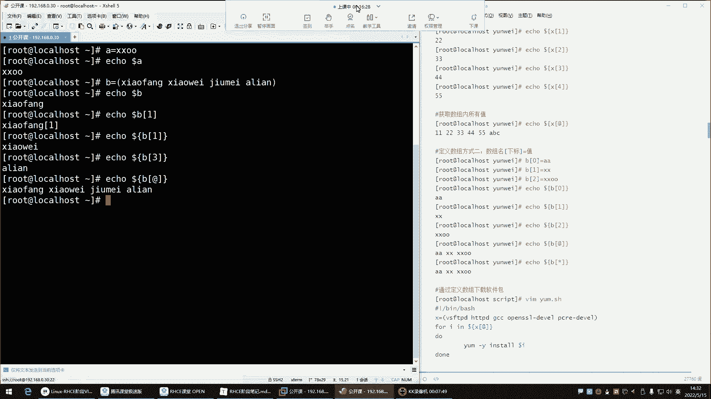

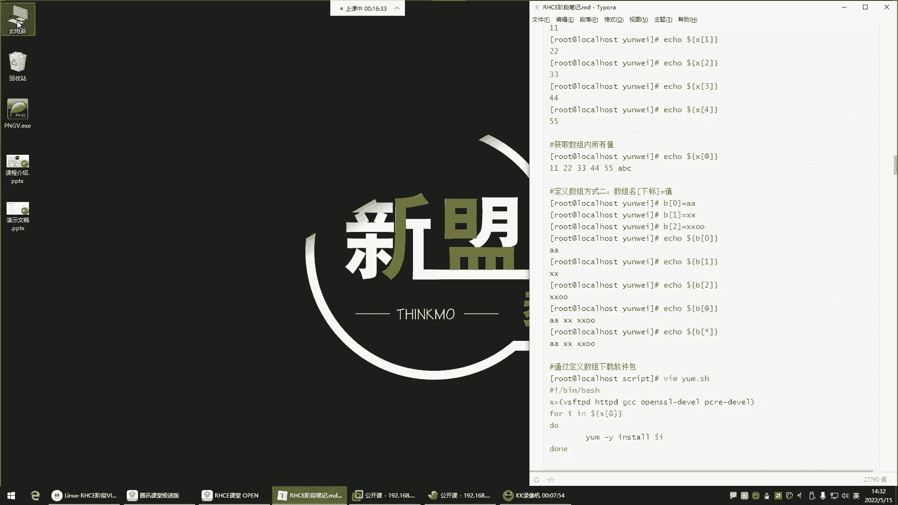

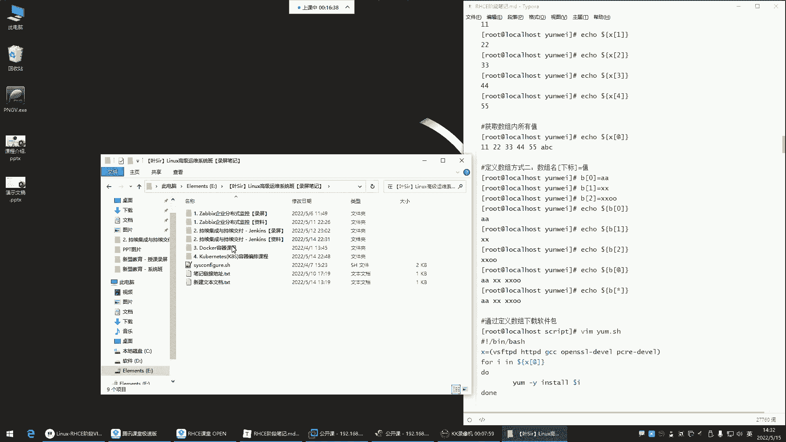

```bash
数组名=(值1 值2 值3 ...)
```

例如，我们定义一个名为 `B` 的数组：

```bash
B=(小芳 小V 9妹 阿莲)
```

要输出整个数组的内容，可以使用 `${数组名[@]}` 或 `${数组名[*]}`。

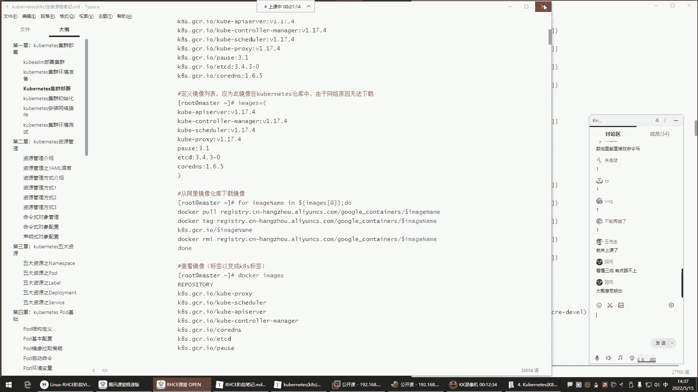

```bash
echo ${B[@]}
```

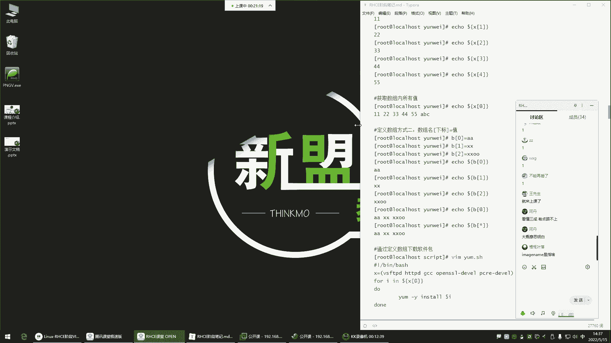

数组中的每个值都有一个对应的“下标”（索引），用于访问特定的值。**Shell数组的下标从0开始**。即第一个值的下标是0，第二个是1，依此类推。

取值时，需要使用 `${数组名[下标]}` 的格式。

```bash
# 取第一个值（下标0）
echo ${B[0]}
# 取第二个值（下标1）
echo ${B[1]}
# 取第四个值（下标3）
echo ${B[3]}
```

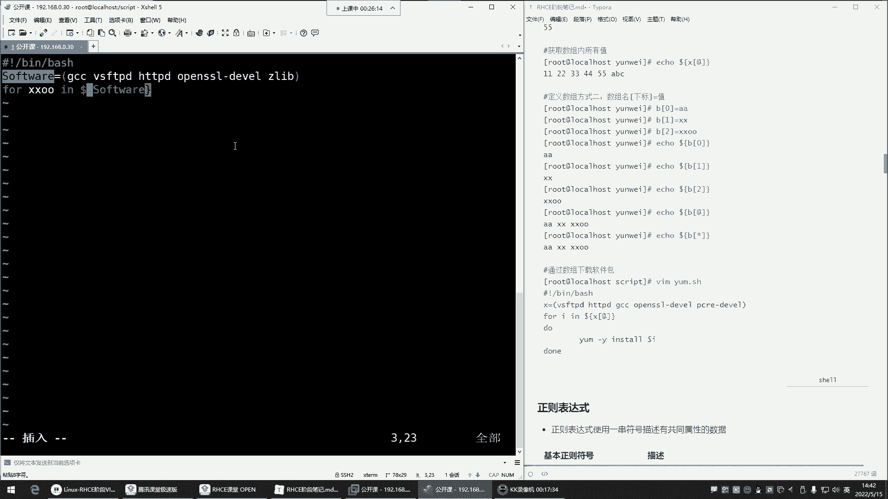

### 数组的实用场景

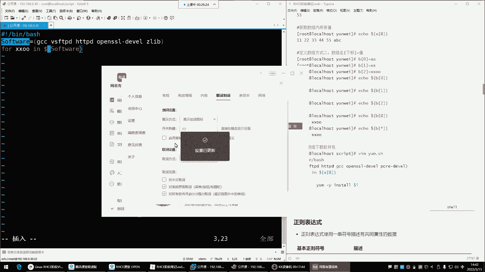

数组常与循环结构（如 `for` 循环）结合使用，以批量处理列表中的项目。以下是一个实际脚本示例，用于批量安装软件包：

```bash
#!/bin/bash
# 定义一个包含多个软件包名称的数组
SOFTWARE=(gcc vsftpd httpd)
# 使用for循环遍历数组并安装每个软件包
for pkg in ${SOFTWARE[@]}
do
    yum install -y $pkg
done
```

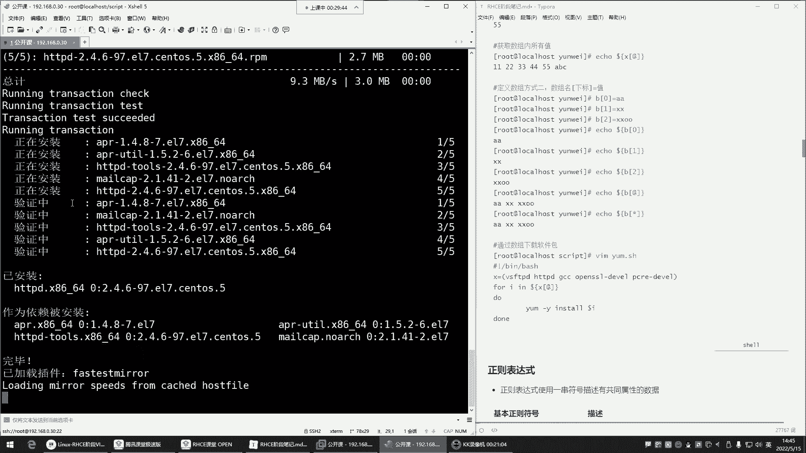

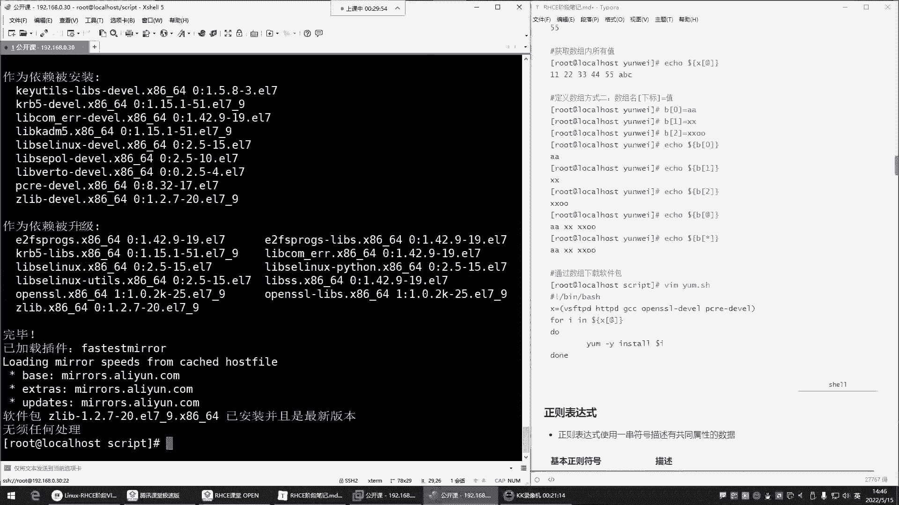

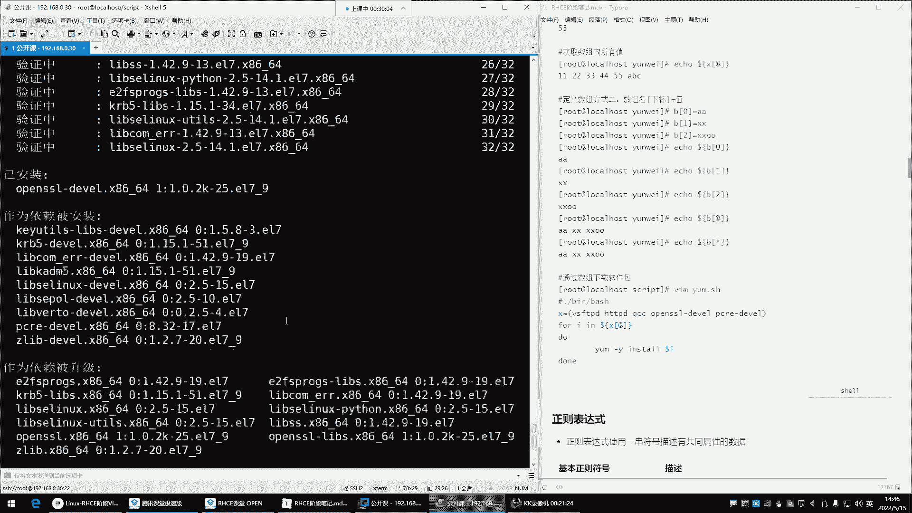

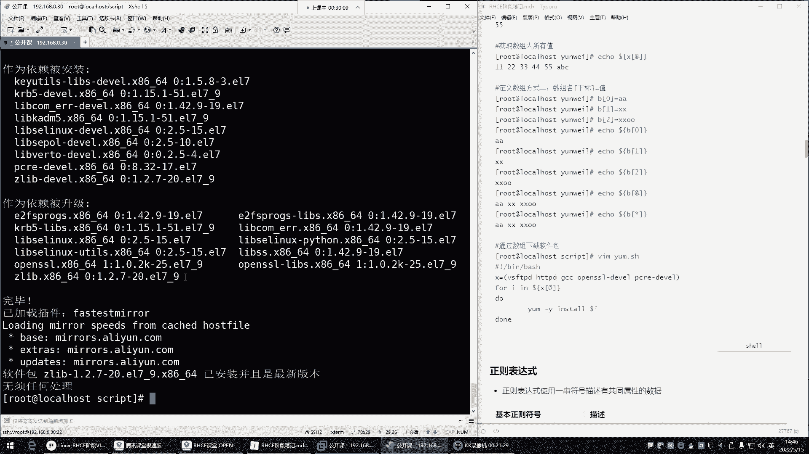

在这个脚本中：
1.  `SOFTWARE` 数组存储了需要安装的软件包列表。
2.  `for pkg in ${SOFTWARE[@]}` 会依次将数组中的每个值（软件包名）赋给变量 `pkg`。
3.  循环体 `yum install -y $pkg` 则执行安装命令。

### 向数组中添加元素

如果数组已经定义，我们还可以向其中追加新的元素。方法是直接为新的下标赋值。

```bash
# 假设原数组B有4个元素，下标为0,1,2,3
# 添加第五个元素（下标4）
B[4]="波多"
# 此时再输出所有元素，会看到“波多”已被添加
echo ${B[@]}
```

需要注意的是，如果给一个已存在的下标赋值，则会覆盖该位置原来的值。

## 正则表达式

上一节我们学习了如何用数组组织数据，本节中我们来看看如何用正则表达式来匹配和过滤文本数据。正则表达式使用一系列特殊字符来描述字符串的匹配模式，是文本处理中不可或缺的工具。

### 基本正则表达式符号

以下是几个最常用且核心的正则表达式符号及其功能：

1.  **`^` (尖角号)**：匹配行首。
    *   **公式**：`^pattern`
    *   **示例**：`grep "^root" /etc/passwd` 只匹配以 `root` 开头的行。

2.  **`$` (美元符)**：匹配行尾。
    *   **公式**：`pattern$`
    *   **示例**：`grep "bash$" /etc/passwd` 匹配以 `bash` 结尾的行，常用于查找使用bash shell的用户。

3.  **`[]` (中括号)**：匹配括号内的任意单个字符。
    *   **公式**：`[abc]` 匹配字符 `a`, `b`, 或 `c`。
    *   **示例**：`grep "[Rr]oot" file.txt` 匹配包含 `Root` 或 `root` 的行。

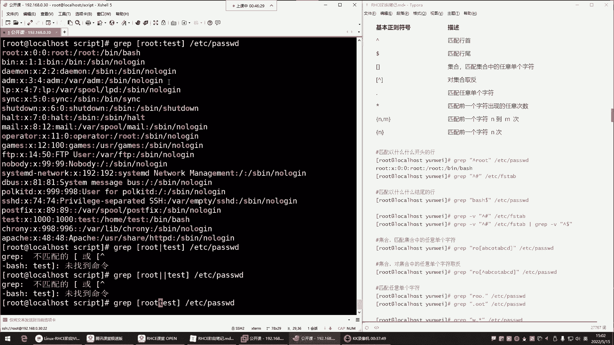

4.  **`[^]` (中括号内加尖角号)**：对集合取反，匹配不在括号内的任意单个字符。
    *   **公式**：`[^abc]` 匹配任何不是 `a`, `b`, 或 `c` 的字符。
    *   **示例**：`grep "[^0-9]" file.txt` 匹配包含非数字字符的行。

5.  **`.` (点号)**：匹配任意单个字符（除了换行符）。
    *   **公式**：`.` 
    *   **示例**：`grep "r..t" file.txt` 可以匹配像 `root`, `rapt`, `r123t` 这样的字符串。

6.  **`*` (星号)**：匹配前一个字符出现0次或多次。
    *   **公式**：`a*` 匹配0个或多个 `a`。
    *   **示例**：`grep "go*d" file.txt` 可以匹配 `gd`, `god`, `good`, `gooood` 等。

### 扩展正则表达式

基本正则表达式（BRE）的功能有时不够用，因此有了扩展正则表达式（ERE）。要使用ERE，需要在 `grep` 命令后加上 `-E` 选项，或者直接使用 `egrep` 命令。

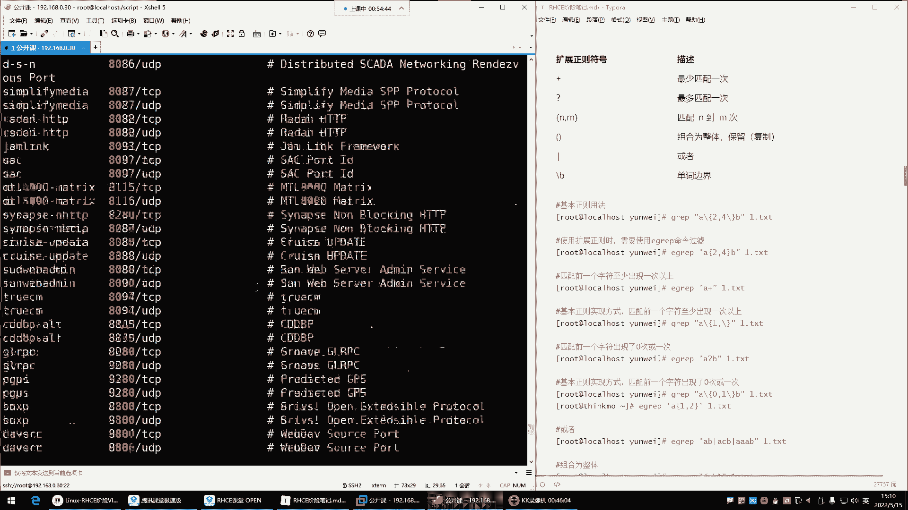

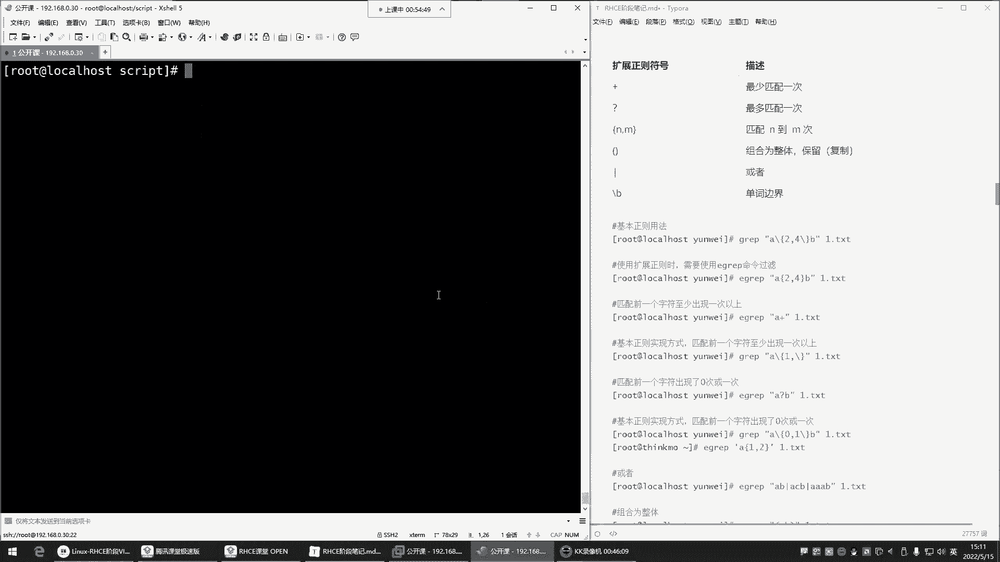

以下是扩展正则表达式中两个有用的符号：

1.  **`+` (加号)**：匹配前一个字符出现1次或多次。
    *   **公式**：`a+` 匹配1个或多个 `a`。
    *   **示例**：`grep -E "go+d" file.txt` 可以匹配 `god`, `good`，但不会匹配 `gd`。

2.  **`|` (竖线)**：表示“或”，匹配竖线左边或右边的模式。
    *   **公式**：`pattern1|pattern2`
    *   **示例**：`grep -E "root|admin" /etc/passwd` 匹配包含 `root` 或 `admin` 的行。

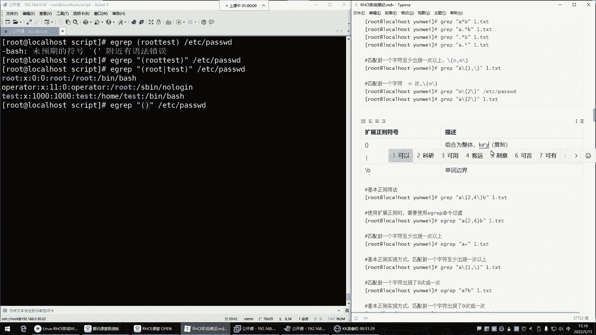

3.  **`()` (小括号)**：将模式组合为一个整体，常用于与 `|` 结合，或用于后向引用（高级用法）。
    *   **公式**：`(pattern)`
    *   **示例**：`grep -E "(root|admin):" /etc/passwd` 匹配以 `root:` 或 `admin:` 开头的行。

### 正则表达式的应用

正则表达式主要与文本搜索和处理命令（如 `grep`, `sed`, `awk`）结合使用。例如，在自动化配置工具Ansible的主机清单文件中，就经常使用正则表达式来匹配一组主机名：

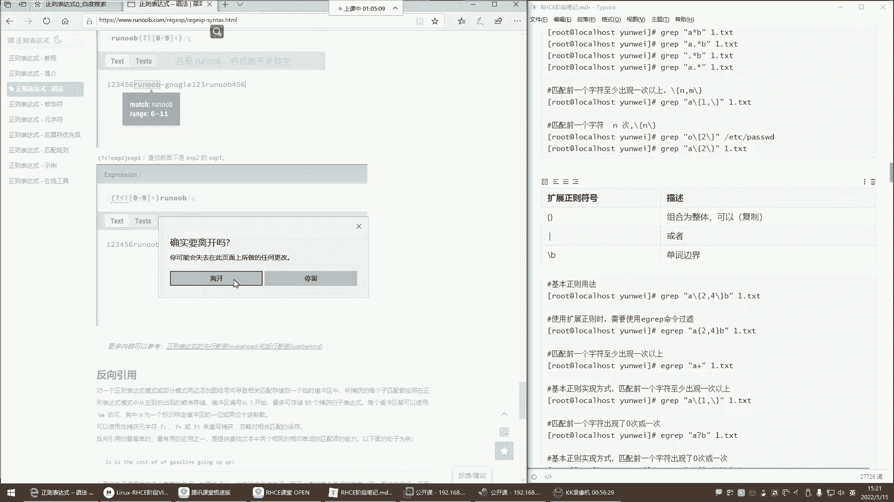

```ini
# /etc/ansible/hosts 文件示例
[webservers]
www[001:006].example.com
```

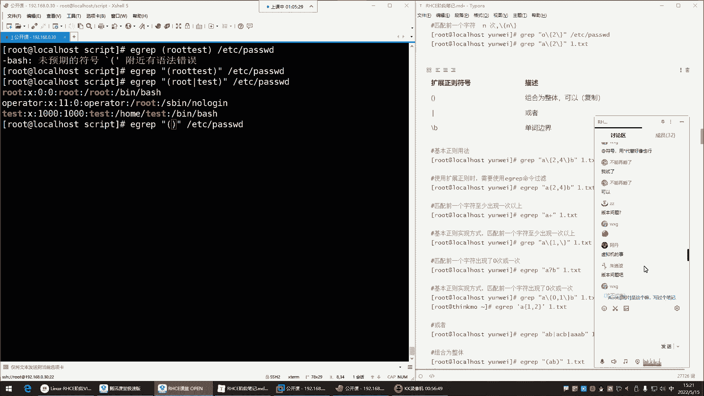

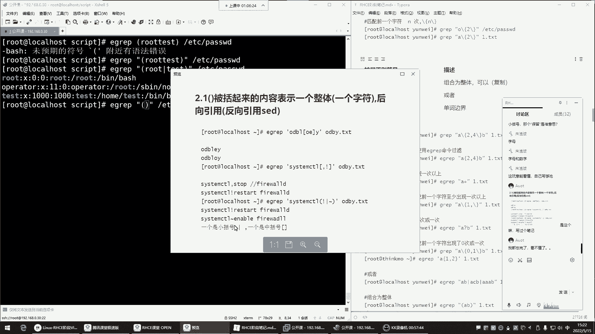

这里的 `[001:006]` 是一个简写，等价于正则表达式 `(001|002|003|004|005|006)`，用于匹配 `www001.example.com` 到 `www006.example.com` 这六台主机。

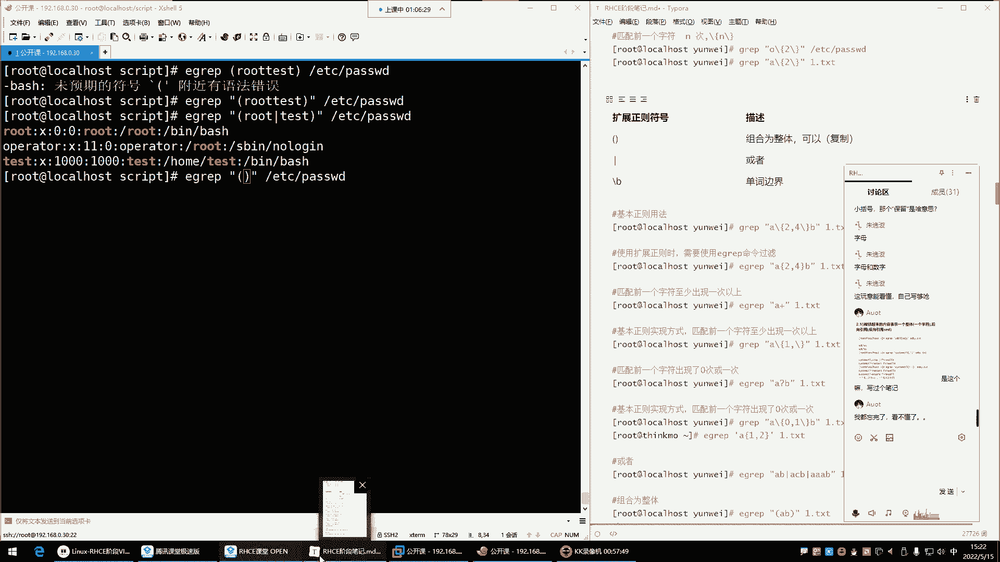

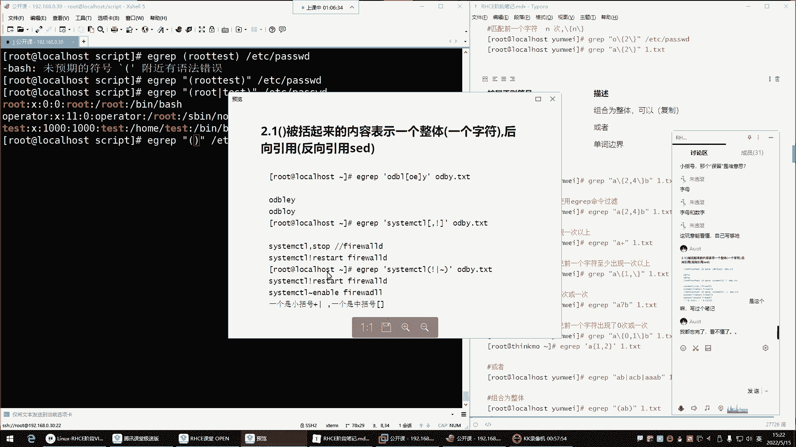

## 总结

本节课中我们一起学习了Shell数组和正则表达式。
*   **Shell数组** 是一种可以在一个变量中存储多个值的数据结构，通过下标访问，常与循环结合用于批量操作。
*   **正则表达式** 是一套用于描述和匹配文本模式的符号系统。我们学习了 `^`、`$`、`[]`、`.`、`*` 等基本符号，以及 `+`、`|`、`()` 等扩展符号的用法。它们是与 `grep`、`sed`、`awk` 等命令配合，进行高效文本过滤和处理的利器。

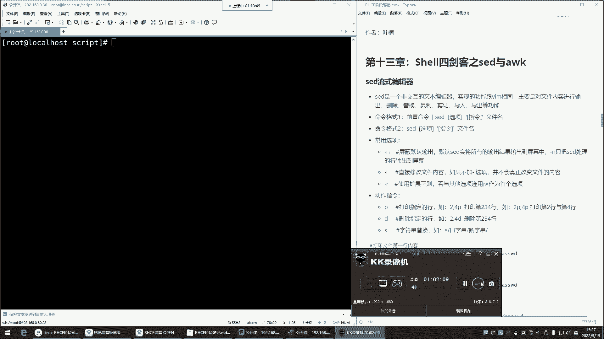

理解这些概念并熟悉其基本用法，将极大地提升你在Linux环境下进行脚本编写和日志分析等工作的能力。