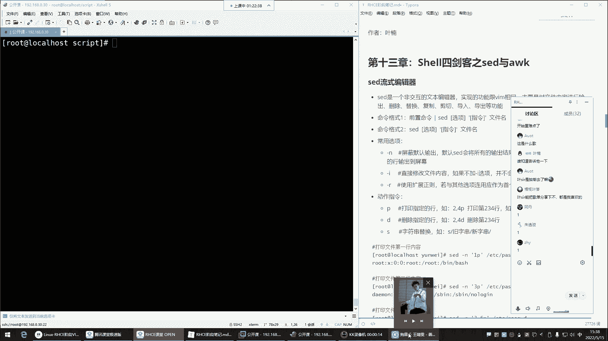
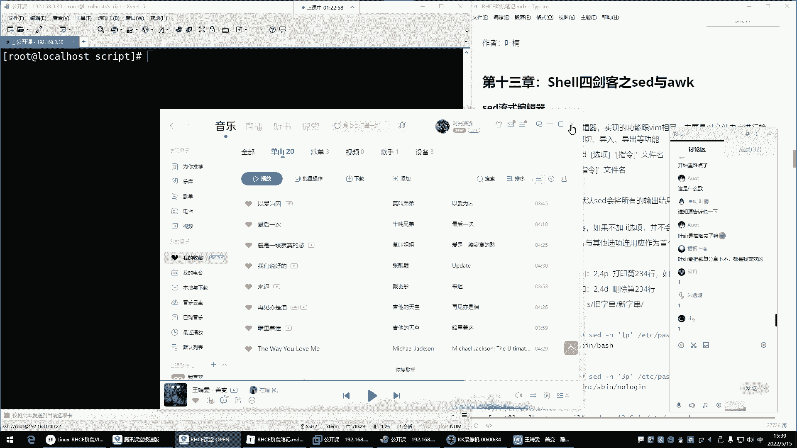
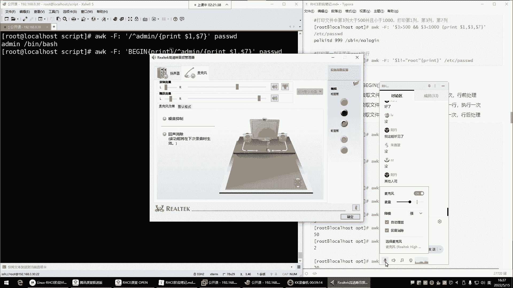

# Linux运维培训教程：13：Shell四剑客之Sed与Awk编辑器 🛠️






在本节课中，我们将学习Shell文本处理中的两个强大工具：Sed流式编辑器和Awk编程语言。它们能够以非交互的方式高效地对文件内容进行增删改查和复杂的数据过滤，是自动化脚本和日常运维的得力助手。

## Sed流式编辑器 📝


上一节我们介绍了文本处理的重要性，本节中我们来看看Sed编辑器。Sed的全称是“Stream Editor”，即流式编辑器。你可以将其理解为命令行的、非交互式的Vim。它主要用于对文件内容进行增删改查，并且可以直接在脚本中调用，实现自动化文本处理。

Sed的命令格式主要有两种：
1.  前置命令通过管道传递给Sed处理：`前置命令 | sed [选项] ‘指令’`
2.  Sed直接处理文件：`sed [选项] ‘指令’ 文件名`

以下是Sed常用的选项：
*   `-n`：屏蔽默认输出，只显示经过Sed处理的行。
*   `-i`：直接修改源文件内容（慎用，建议先测试）。
*   `-r`：支持扩展正则表达式。

以下是Sed常用的指令：
*   `p`：打印指定内容。
*   `d`：删除指定行。
*   `s`：替换文本，格式为 `s/旧内容/新内容/[修饰符]`，例如 `s/root/admin/g` 中的 `g` 表示全局替换。

### 打印内容

使用Sed查看文件时，通常结合 `-n` 选项和 `p` 指令来精确控制输出。

**示例：打印文件特定行**
```bash
# 打印文件第3行
sed -n ‘3p’ /etc/passwd

# 打印文件第2到第4行
sed -n ‘2,4p’ /etc/passwd

# 打印文件第1行和第5行
sed -n ‘1p;5p’ /etc/passwd
```

### 删除内容

删除操作需要结合 `-i` 选项才能真正生效。安全做法是先使用 `-n` 和 `p` 确认要删除的行，再使用 `-i` 执行删除。

**示例：删除文件特定行**
```bash
# 1. 先确认要删除的第5行内容
sed -n ‘5p’ demo.txt

# 2. 确认无误后，删除第5行
sed -i ‘5d’ demo.txt
```

### 替换内容

替换是Sed最核心的功能之一，其语法与Vim中的替换非常相似。

**示例：替换文件中的文本**
```bash
# 1. 测试性替换，查看效果（不修改源文件）
sed -n ‘s/root/admin/gp’ /etc/passwd

# 2. 确认无误后，执行替换并修改源文件
sed -i ‘s/root/admin/g’ /etc/passwd
```

**示例：结合正则表达式进行替换**
```bash
# 将所有数字替换为 ‘X’
sed -i ‘s/[0-9]/X/g’ file.txt

# 将以 ‘bash’ 结尾的行中的 ‘demo’ 替换为 ‘test’
sed -i ‘/bash$/s/demo/test/g’ file.txt
```

---

## Awk数据过滤与报告生成 📊

上一节我们掌握了Sed的基础编辑功能，本节中我们来看看Awk。Awk不仅仅是一个命令，更是一门功能强大的文本处理编程语言。它擅长对结构化文本（如表格数据）进行按列处理、数据提取和统计报告生成，功能远超简单的`grep`过滤。

Awk的基本命令格式为：`awk [选项] ‘条件 {指令}’ 文件名`

以下是Awk的核心概念：
*   **选项 `-F`**：指定输入字段的分隔符，默认为空格或制表符。例如 `-F:` 表示用冒号分隔。
*   **内置变量**：
    *   `$1， $2， … $n`：表示当前行的第1， 2， … n个字段。
    *   `NR`：当前处理的行号（Number of Records）。
    *   `NF`：当前行的字段总数（Number of Fields）。
*   **指令 `print`**：打印输出，是最常用的指令。
*   **特殊模式 `BEGIN` 和 `END`**：
    *   `BEGIN{指令}`：在处理任何输入行之前执行一次。
    *   `END{指令}`：在处理完所有输入行之后执行一次。

### 基础字段提取

Awk的强大之处在于能轻松处理按特定分隔符排列的列数据。

**示例：提取`/etc/passwd`文件的用户名（第1列）和使用的Shell（第7列）**
```bash
# 以冒号‘：‘为分隔符，打印第1列和第7列
awk -F: ‘{print $1， $7}’ /etc/passwd

# 让输出更美观，在两列之间加入制表符
awk -F: ‘{print $1 “\t” $7}’ /etc/passwd
```

### 结合条件过滤

Awk可以在指令前添加条件，只处理符合条件的行。

**示例：打印UID大于等于1000的用户名（第1列）和UID（第3列）**
```bash
# 假设UID在第3列
awk -F: ‘$3 >= 1000 {print $1， $3}’ /etc/passwd

# 打印使用 ‘/bin/bash’ 作为Shell的用户
awk -F: ‘$7 == “/bin/bash” {print $1}’ /etc/passwd
```

### 使用BEGIN和END生成报告

`BEGIN`和`END`块常用于生成报告的表头和表尾。

**示例：生成一个格式化的用户报告**
```bash
awk -F: ‘BEGIN {print “用户名\t\t解释器\n===================”} {print $1 “\t\t” $7} END {print “===================\n总用户数: ” NR}’ /etc/passwd
```
**代码解释**：
1.  `BEGIN`块先执行，打印报告标题和表头分隔线。
2.  中间没有条件的`{print}`块对每一行执行，打印用户名和解释器。
3.  `END`块最后执行，利用`NR`变量打印总行数，即总用户数。

---




本节课中我们一起学习了Shell四剑客中的Sed和Awk。Sed是一个强大的流式文本编辑器，擅长对文件进行非交互式的行级编辑，如替换、删除和打印。而Awk是一门文本处理编程语言，特别适合处理结构化的列数据，能够进行复杂的数据提取、过滤和报告生成。掌握这两个工具，将极大提升你在Linux命令行下的文本处理能力和脚本编写效率。