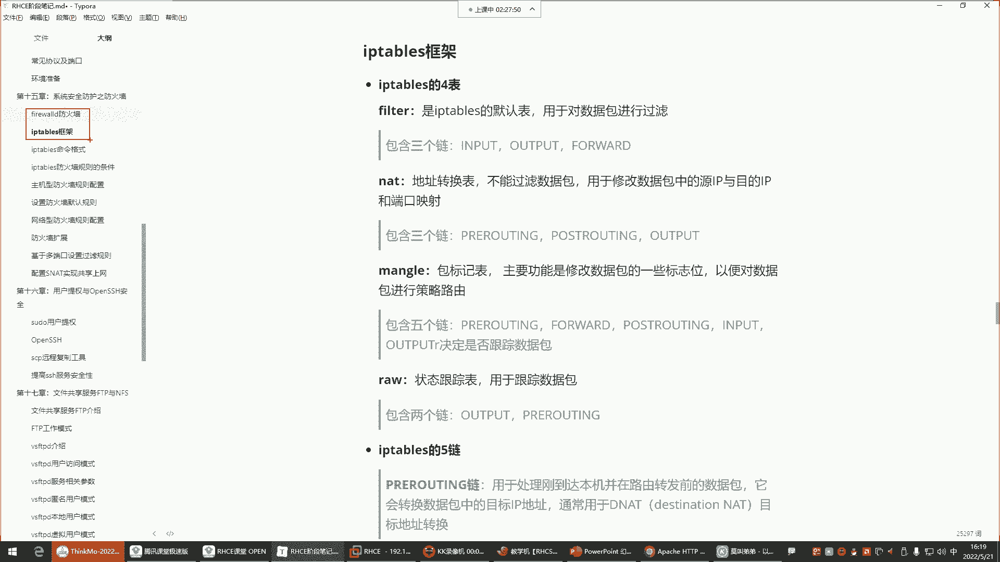
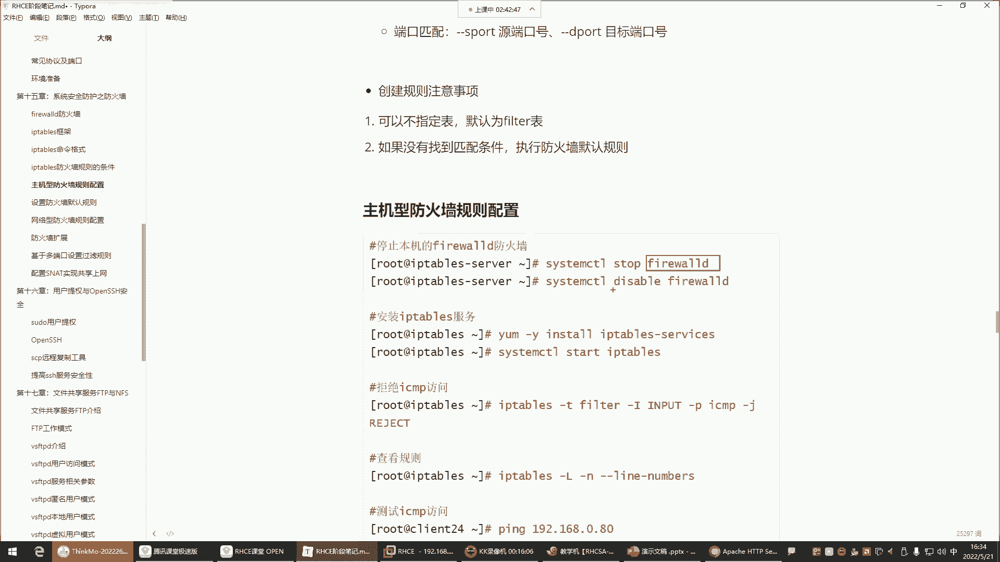
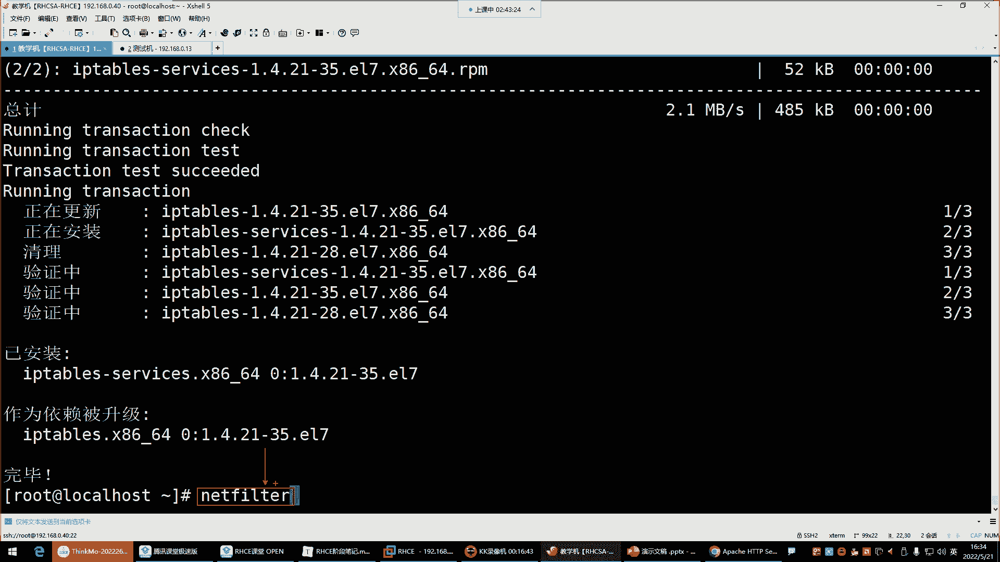
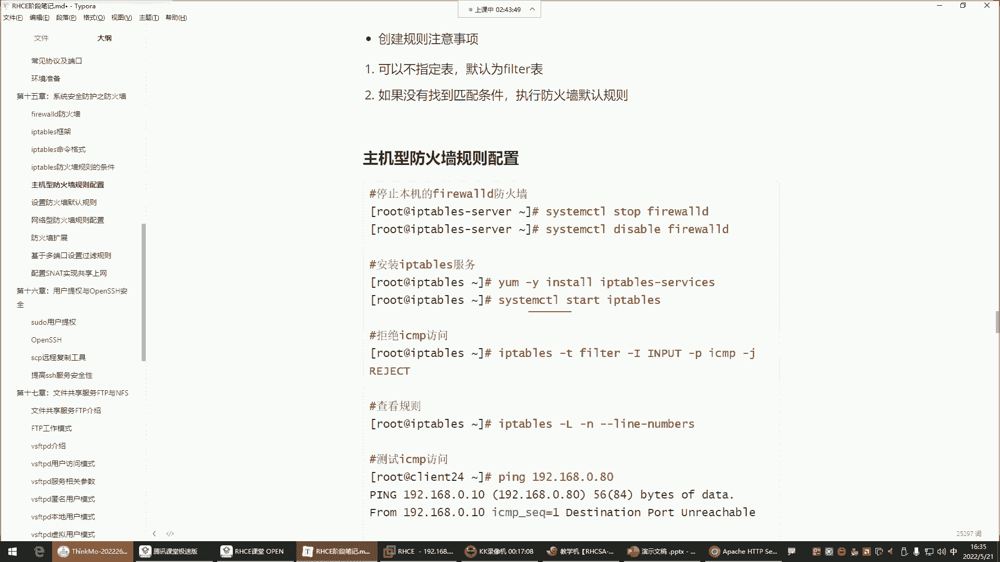
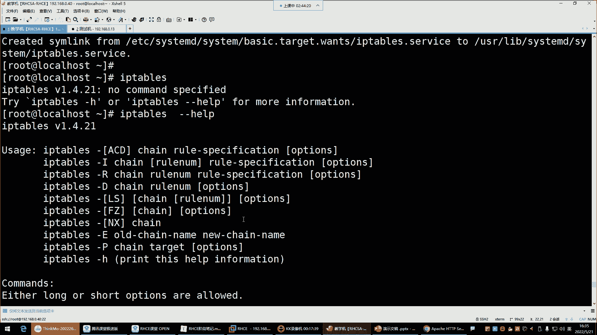
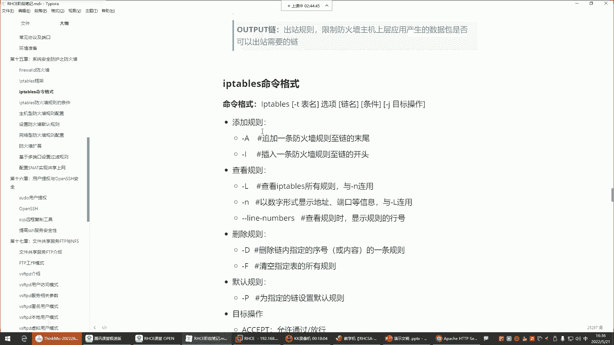
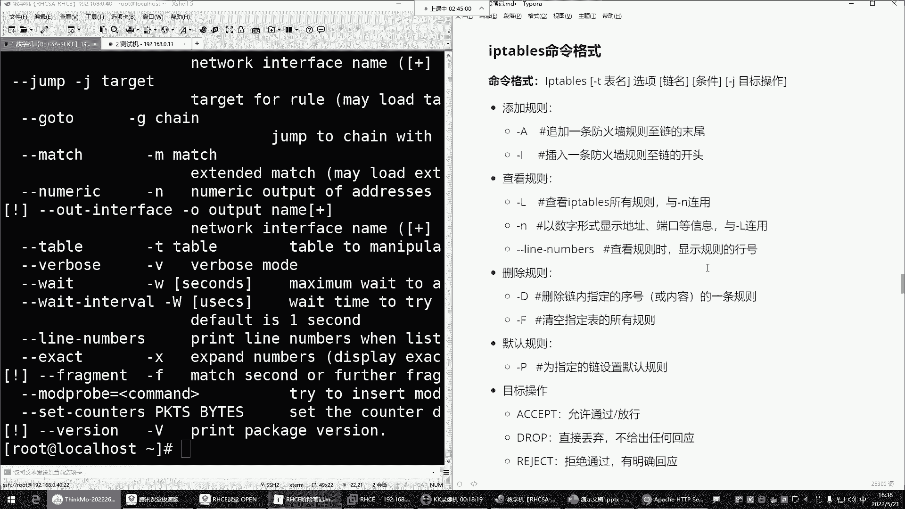

# Linux运维培训教程：1：iptables防火墙四表五链 🔥

在本节课中，我们将学习iptables防火墙的核心概念——四表五链。iptables是Linux系统中一个强大的防火墙管理工具，它通过定义规则来控制网络数据包的流动。理解其“表”和“链”的结构是掌握iptables的关键。我们将从基础概念入手，逐步解析其工作原理和常用配置。



## 概述 📋


iptables和之前学习的firewalld一样，都是用于管理Linux内核中`netfilter`模块的工具。它们本质上是操控同一个内核模块，因此通常只需选择其中一个使用即可。本节课我们将重点学习iptables，并首先关闭可能冲突的firewalld服务。

## 四表与五链：防火墙的骨架

上一节我们提到了iptables和firewalld的关系，本节中我们来看看iptables自身的核心架构。

iptables的规则体系建立在“表”和“链”的基础上。简单来说，“表”定义了规则的功能类别，而“链”则是规则生效的具体位置（数据包传输路径上的检查点）。规则被配置在特定的“链”中。

### 四个核心表

以下是iptables中的四个主要表及其功能：

*   **filter表**：这是iptables的**默认表**，也是最常用的表。它的核心功能是**对数据包进行过滤**，决定数据包是允许通过还是被拒绝。可以将其想象成地铁站的安检口。
*   **nat表**：此表用于**网络地址转换**。它的功能是修改数据包中的**源IP地址**或**目的IP地址**，常用于端口映射、共享上网等场景。
*   **mangle表**：此表主要用于**修改数据包的标志位**，以实现一些高级功能，如策略路由（决定数据包从哪块网卡进出）。在企业日常运维中较少使用。
*   **raw表**：此表用于**数据包的状态跟踪**。由于全程跟踪数据包会消耗大量系统资源，在企业生产环境中通常不启用。

对于初学者和大多数运维场景，我们主要学习和使用 **`filter`表** 和 **`nat`表**。

### 五个关键链

链是数据包传输路径上的“关卡”。以下是五个核心链及其作用：

*   **INPUT链**：处理**进入本机**的数据包。例如，当外部用户访问本机的Web服务时，数据包会经过此链的规则检查。**主机型防火墙**主要配置此链。
*   **OUTPUT链**：处理**从本机发出**的数据包。例如，本机Web服务给用户返回数据时，数据包会经过此链。通常此链很少配置严格规则。
*   **FORWARD链**：处理**经过本机转发**的数据包。当服务器作为网关或网络防火墙，需要将数据包转发给内部其他服务器时，数据包会经过此链。**网络型防火墙**主要配置此链。
*   **PREROUTING链**：在数据包**进入路由决策之前**进行处理。通常用于**目的地址转换**。
*   **POSTROUTING链**：在数据包**离开路由决策之后**进行处理。通常用于**源地址转换**。

### 表与链的关系

表与链是包含关系。一个“表”中包含若干个“链”，而规则则配置在具体的“链”里。

*   **filter表** 包含：`INPUT`, `OUTPUT`, `FORWARD`
*   **nat表** 包含：`PREROUTING`, `OUTPUT`, `POSTROUTING`

一个重要的规律是：**一个“表”中的所有“链”，都服务于该表的核心功能**。例如，`filter`表的所有链（`INPUT`/`OUTPUT`/`FORWARD`）都用于数据包过滤；`nat`表的所有链都用于地址转换。

## 核心工作流程图解 🖼️

为了更直观地理解，我们通过一个场景来说明`INPUT`、`FORWARD`和`OUTPUT`链的工作位置。

假设我们有一台Linux服务器，它可能运行着自己的服务（如Web），也可能作为网关转发流量到内部其他服务器。

1.  **数据包进入服务器**：所有来自网络的数据包首先到达服务器。
2.  **路由决策**：系统内核判断这个数据包是发给本机的，还是需要转发给其他机器。
    *   **如果目标是本机**：数据包将流向 **`INPUT`链**。`INPUT`链中的规则将决定是否允许该数据包访问本机的应用程序（如80端口的Web服务）。如果允许，数据包交给本机处理；如果拒绝，则丢弃。
    *   **如果目标不是本机（且服务器开启了转发功能）**：数据包将流向 **`FORWARD`链**。`FORWARD`链中的规则决定是否允许转发该数据包到内部网络的其他服务器。如果允许，则转发；如果拒绝，则丢弃。
3.  **本机产生的数据包发出**：当本机应用程序（如Web服务器）需要响应请求或主动对外通信时，产生的数据包会经过 **`OUTPUT`链**。`OUTPUT`链的规则决定是否允许该数据包发送出去。

**简单总结**：
*   想保护**本机服务**，规则配在 **`INPUT`链**。
*   想保护**内部其他服务器**，规则配在 **`FORWARD`链**。
*   `OUTPUT`链通常保持默认允许状态。

## 实践准备：安装与基础命令 ⚙️

在开始配置规则前，我们需要确保环境中只运行一个防火墙管理工具，并安装好iptables。

以下是必要的准备工作：

1.  **停止并禁用firewalld**（如果之前在使用）：
    ```bash
    systemctl stop firewalld
    systemctl disable firewalld
    ```
2.  **安装iptables服务**：
    ```bash
    yum install -y iptables-services
    ```
3.  **启动并设置iptables开机自启**：
    ```bash
    systemctl start iptables
    systemctl enable iptables
    ```
4.  **查看iptables帮助**：了解命令格式。
    ```bash
    iptables --help
    ```



iptables的基本命令格式通常如下：
`iptables -t <表名> <操作命令> <链名> <匹配条件> -j <动作>`
例如，`-t filter`指定操作filter表（可省略，因为它是默认表），`-A INPUT`表示在INPUT链末尾追加规则，`-j ACCEPT`表示动作为允许。



## 总结 🎯



本节课我们一起学习了iptables防火墙的基石——四表五链。



*   **四表**定义了规则的功能：`filter`（过滤）、`nat`（地址转换）、`mangle`（包修改）、`raw`（跟踪）。我们重点掌握`filter`和`nat`表。
*   **五链**定义了规则的生效位置：`INPUT`（入站）、`OUTPUT`（出站）、`FORWARD`（转发）、`PREROUTING`（路由前）、`POSTROUTING`（路由后）。
*   理解了**表与链的对应关系**以及**数据包的基本流转路径**：保护本机用`INPUT`链，保护内网其他机器用`FORWARD`链。
*   完成了iptables服务的**安装与启动**，为后续具体的规则配置做好了准备。





记住这个核心模型，在后续学习具体规则配置时，你就能清楚地知道每条规则的作用目标和范围。