# Linux运维培训教程：P56：FTP服务排错与权限配置详解 🔧

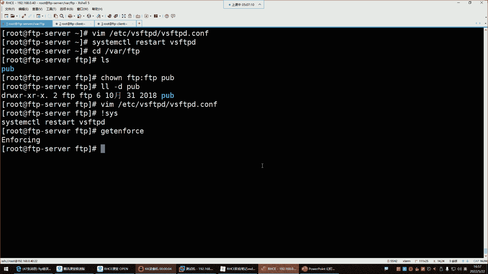

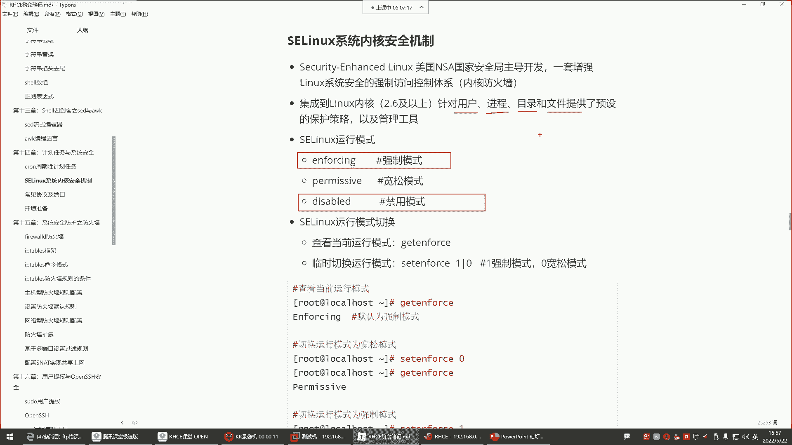

在本节课中，我们将学习FTP服务在实际使用中可能遇到的典型问题及其解决方法，特别是SELinux安全机制对FTP操作的影响，以及如何正确配置匿名用户的访问权限。我们将通过具体的操作演示，帮助你理解并掌握FTP服务的排错思路和权限管理。

## SELinux强制模式导致的文件创建失败

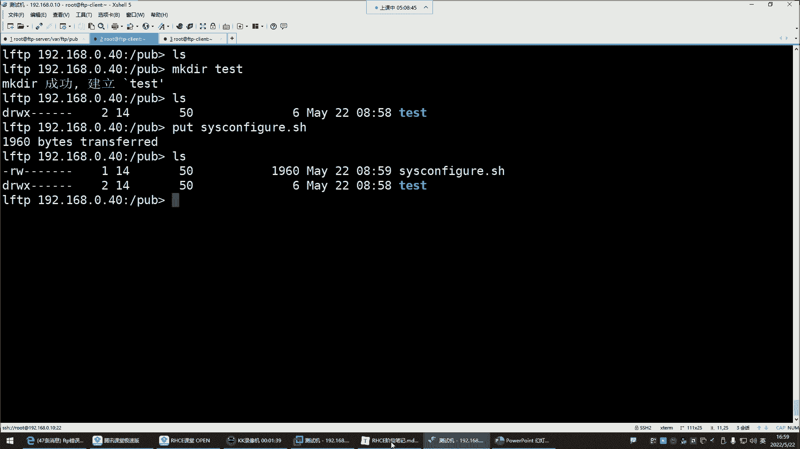

上一节我们介绍了FTP的基本配置，本节中我们来看看一个常见的隐蔽问题——SELinux。

SELinux在企业环境中常被禁用，因为它在强制模式下会严格管控所有资源，包括用户、进程、目录和文件。

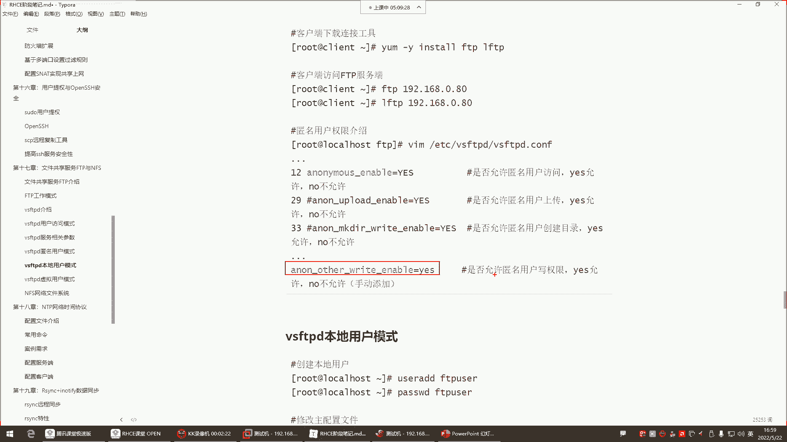

当前系统SELinux处于**enforcing**（强制）模式。在此模式下，即使用户对目录拥有完整的文件系统权限（如`rwx`），SELinux策略也可能阻止其创建文件。这会导致用户权限充足但操作依然失败的情况。

解决方法是将SELinux模式改为宽容或禁用模式。可以通过以下命令临时修改：

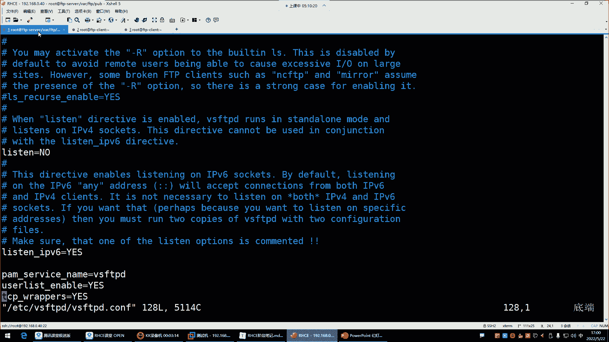

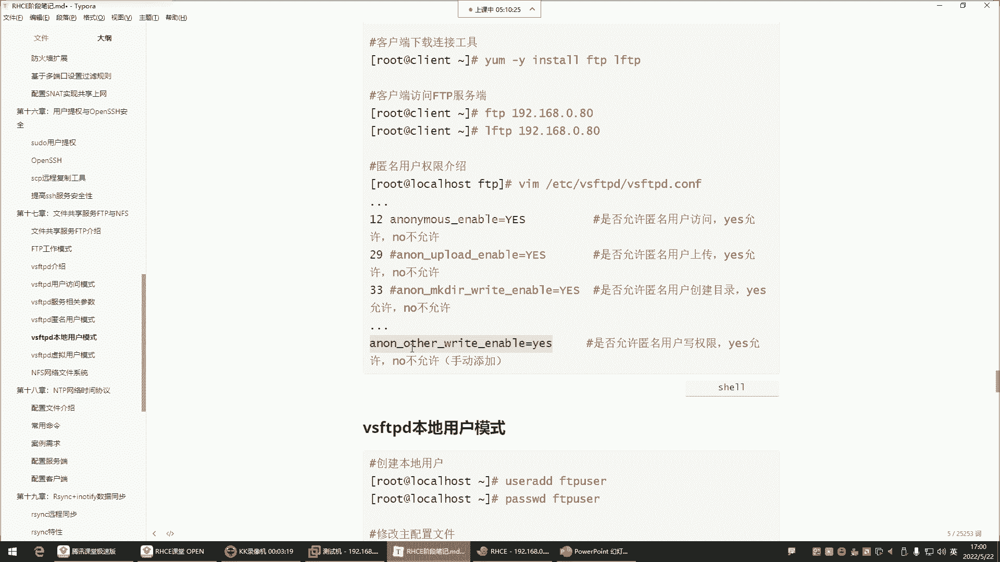

```bash
setenforce 0
```

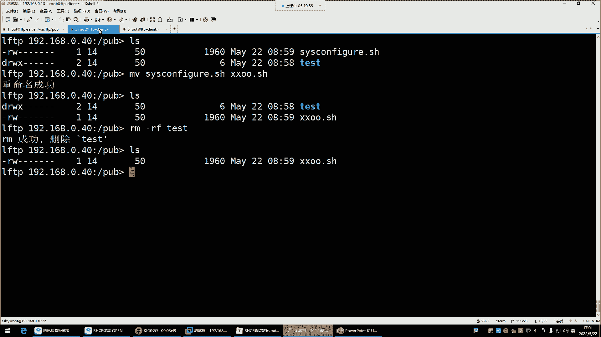

或通过编辑配置文件 `/etc/selinux/config` 永久修改，将 `SELINUX=` 的值改为 `permissive` 或 `disabled`，然后重启系统。

关闭SELinux后，之前失败的FTP文件创建操作即可成功。这个问题提醒我们，在配置无误但操作失败时，需要检查防火墙和SELinux状态。

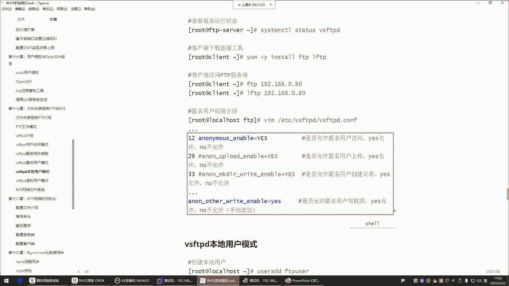

## 配置FTP匿名用户的写权限

解决了SELinux问题后，我们来看看如何为FTP匿名用户配置更高级的权限。

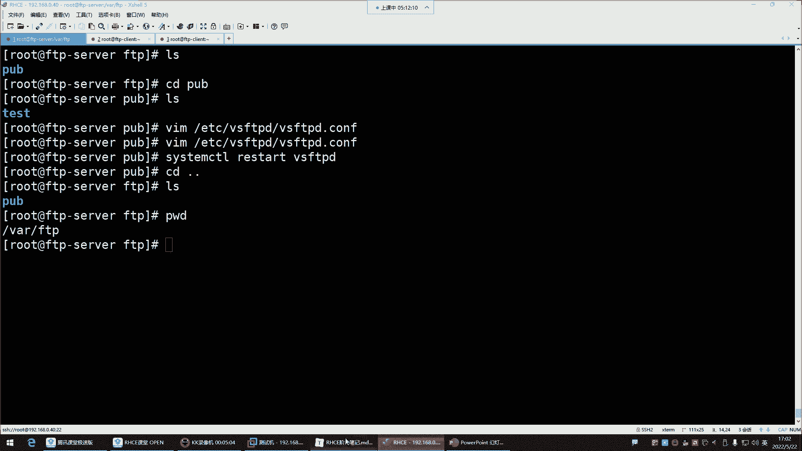

默认情况下，匿名用户仅有查看和下载文件的权限。若希望其具备上传、创建目录、删除或重命名文件的能力，需要在FTP服务的配置文件中显式开启。

以下是需要配置的权限参数及其作用：
*   **`anon_upload_enable=YES`**：开启匿名用户的上传权限。
*   **`anon_mkdir_write_enable=YES`**：允许匿名用户创建目录。
*   **`anon_other_write_enable=YES`**：允许匿名用户执行删除(`rm`)、重命名(`mv`)等写入操作。此参数默认未开启。

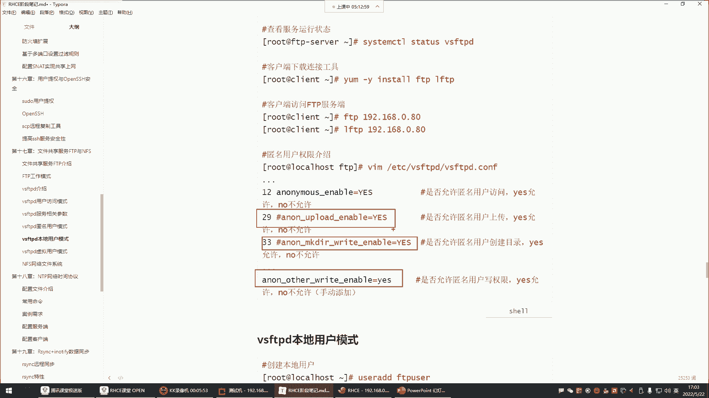

配置方法为编辑FTP服务的主配置文件（通常是`/etc/vsftpd/vsftpd.conf`），添加或修改上述参数值为`YES`，然后重启FTP服务使配置生效。

开启`anon_other_write_enable=YES`后，匿名用户即可成功执行文件重命名和删除操作。

## FTP服务权限配置总结与实践建议

经过一系列的配置与测试，我们对FTP服务器的匿名访问模式有了更深入的理解。

FTP服务器默认启用匿名访问模式。此处的“匿名”并非完全无身份，实际上是使用系统内置的`ftp`用户账号来访问服务。其默认权限仅限于浏览目录列表和下载文件。

若需赋予匿名用户上传、创建、删除等权限，必须在配置文件中手动开启。但在此之前，有一个重要的安全实践：我们通常不会直接对FTP的默认根目录（如`/var/ftp`）开放写权限，而是在其下创建一个子目录（例如`/var/ftp/pub`）专门用于匿名用户的数据共享。所有高级权限仅针对此子目录开放，而根目录保持只读，以提升系统安全性。

以下是针对企业环境FTP匿名访问的权限配置建议：
*   **仅提供下载服务**：企业环境中的公共FTP服务器通常只提供文件下载服务，如同百度网盘共享文件。
*   **限制高风险权限**：基于安全考虑，一般**不赋予**匿名用户上传(`anon_upload_enable`)、创建目录(`anon_mkdir_write_enable`)以及删除/重写(`anon_other_write_enable`)的权限。
*   **恢复安全配置**：建议将配置文件中为匿名用户开启的写权限参数注释掉，然后重启服务。这样，匿名用户将无法再进行修改、删除或上传操作，但下载功能不受影响。

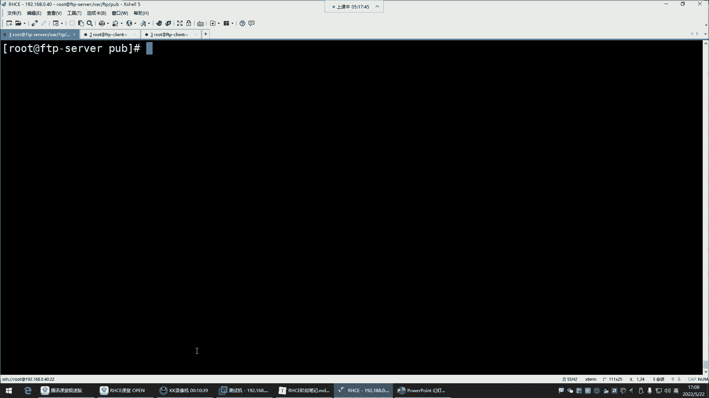

关于文件下载，还有一个注意事项：共享的文件需要至少对“其他用户”(others)具备读(`r`)权限，匿名用户才能成功下载。通常，由系统管理员放置的共享文件默认权限即可满足要求，无需特意设置为`777`权限。之前遇到的下载失败问题，是由于文件在重命名操作后权限发生了变化导致的。

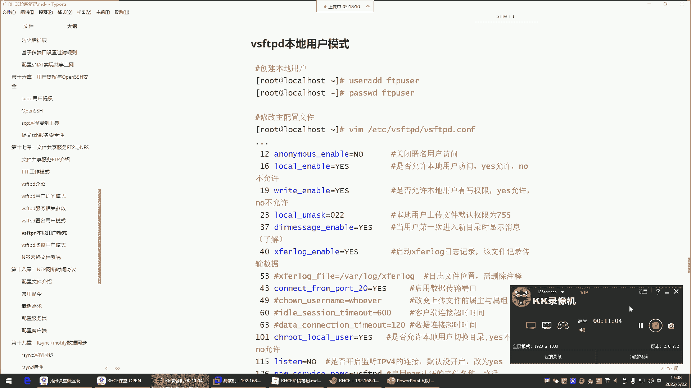

本节课中我们一起学习了FTP服务因SELinux策略导致的操作排错方法，详细探讨了匿名用户各种写权限的配置参数，并最终给出了符合企业生产环境安全规范的权限配置建议。理解并正确配置这些权限，是管理一个安全、可用FTP服务的关键。