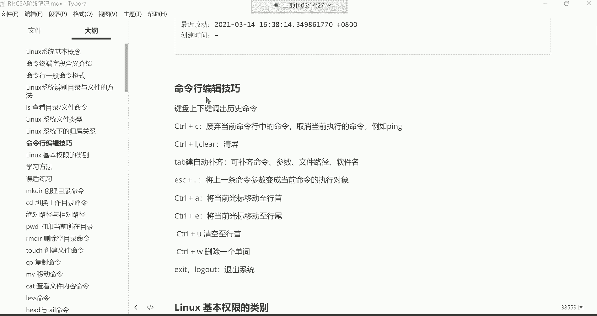
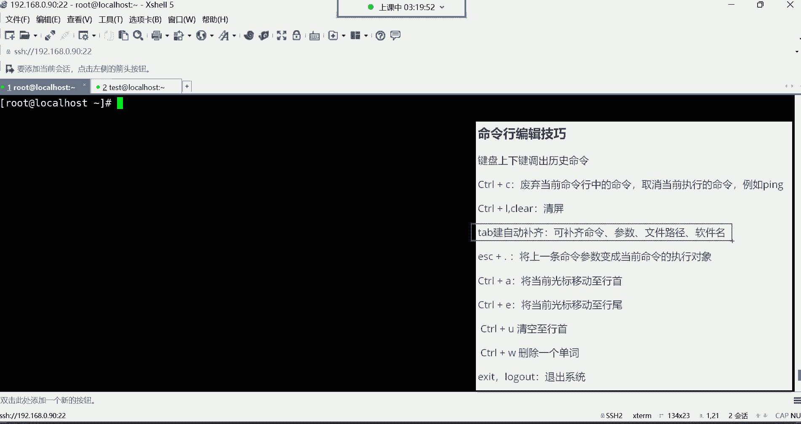
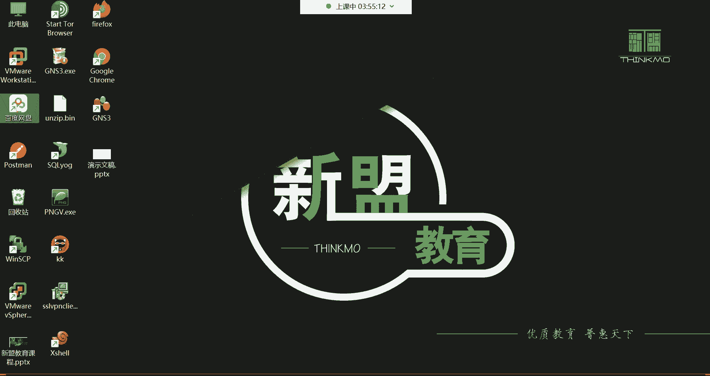
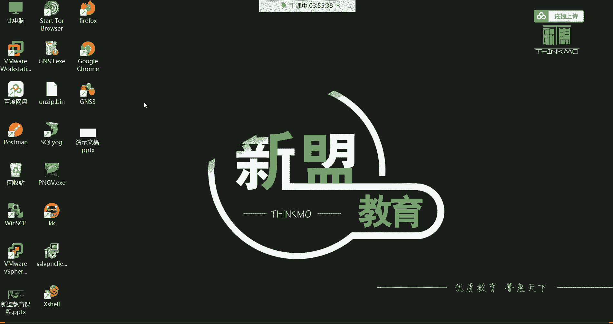
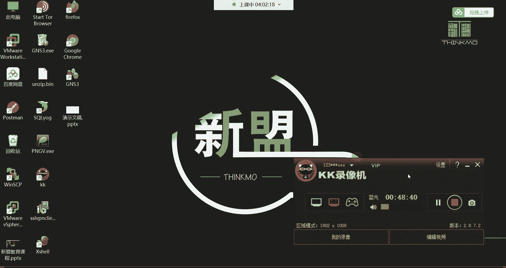

# Linux运维培训教程：P6：命令行编辑技巧与学习方法 📝

在本节课中，我们将学习Linux命令行的高效编辑技巧，并探讨一些重要的学习方法，帮助你提升学习效率和解决问题的能力。

## 命令行编辑技巧 🎯

上一节我们介绍了`ls`命令的基本用法，本节中我们来看看如何更高效地在命令行中操作。掌握这些技巧可以显著提升你的工作效率。

### 常用快捷键操作

以下是几个必须掌握的常用快捷键：

*   **上下方向键**：调出历史命令。上键向上翻看，下键向下翻看。通常只用于查看最近执行过的几条命令。
*   **`Ctrl + C`**：有两个主要功能。
    1.  废弃当前命令行中已输入但未执行的命令。
    2.  强制终止当前正在运行的命令（例如，终止一个持续运行的`ping`进程）。
*   **`Ctrl + L`** 或 **`clear`命令**：清空当前终端屏幕，使界面变得整洁。
*   **`Tab`键**：自动补齐。这是最常用的技巧之一，主要用于补齐**文件/目录路径**和**软件包名**。
    *   按一下`Tab`：如果只有一个匹配项，则自动补齐。
    *   按两下`Tab`：如果有多个匹配项，则列出所有选项供你选择。
*   **`Esc + .`**（先按`Esc`键，再按`.`键）：快速输入上一条命令的最后一个参数。例如，上一条命令是`ls /etc/passwd`，按`Esc + .`后，当前命令行会立刻出现`/etc/passwd`。

### 其他有用快捷键

以下快捷键作为了解，可以在特定场景下使用：

*   **`Ctrl + A`**：将光标快速移动到当前命令行的行首。
*   **`Ctrl + E`**：将光标快速移动到当前命令行的行尾。
*   **`Ctrl + U`**：删除从光标当前位置到行首的所有字符。
*   **`Ctrl + W`**：删除光标前的一个“单词”（以空格为分隔符）。

### 退出系统命令

以下是两种退出当前登录会话的方法：

*   **`exit`命令**
*   **`logout`命令**

两条命令功能相同，任选其一即可。执行后，你将退出当前的SSH或终端登录。

## 学习方法与建议 💡

掌握了操作技巧，我们再来看看如何更有效地学习。正确的学习方法能让你的学习之路事半功倍。

### 遇到问题怎么办？

在学习过程中，遇到问题是常态。以下是解决问题的建议路径：

1.  **初期（小白阶段）**：遇到不理解的问题，可以直接在课程群内提问，有专门的答疑老师（如磊神老师）和班主任（木木老师）提供帮助。
2.  **中后期（入门后）**：应开始培养独立解决问题的能力。首先尝试自己分析，并利用搜索引擎（如百度、谷歌）寻找答案。**精准地描述问题**是高效搜索的关键。
3.  **最终阶段**：将无法独立解决的问题再向老师或社区求助。这种“先己后人”的解决问题习惯，正是运维工程师的核心能力。

### 学习态度与习惯

以下是关于学习态度和习惯的一些重要建议：

*   **主动学习，不要被动接受**：老师讲授的内容是基础，课后应主动探索命令的更多选项和用法，进行知识扩展。
*   **专注与坚持**：学习周期（例如5个半月）是短暂的，但却是改变未来的关键投资。在此期间，需要集中精力，减少无效社交，全力以赴。
*   **不要死磕一个知识点**：如果某个问题在当前阶段无法解决，可以先记录下来，继续向后学习。很多时候，后面的知识会帮助你理解前面的难题。要“低头拉车”，也要“抬头看路”。
*   **善用学习资料**：课程提供的笔记（Markdown源码和PDF版）、常见单词表等都是宝贵的学习资料。可以利用碎片时间（如通勤时）用手机复习PDF笔记。

### 课后关机操作

对于使用VMware等虚拟机的同学，正确的关机方式是：

1.  在虚拟机窗口的菜单或标签页上右键点击。
2.  选择“电源” -> “关闭客户机”。
3.  等待系统关闭后，再关闭虚拟机软件窗口。

---

本节课中我们一起学习了Linux命令行的核心编辑技巧，包括调取历史命令、终止进程、自动补齐等高效操作。同时，我们也探讨了至关重要的学习方法，包括如何解决问题、保持主动学习的态度以及合理利用学习资源。掌握这些技巧和方法，将为你的Linux运维学习之路打下坚实的基础。下一节课，我们将开始学习更多实用的系统命令。