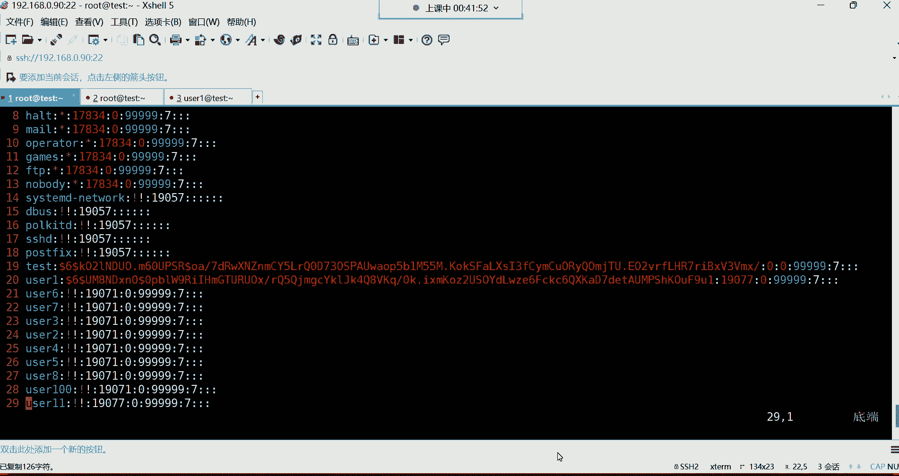
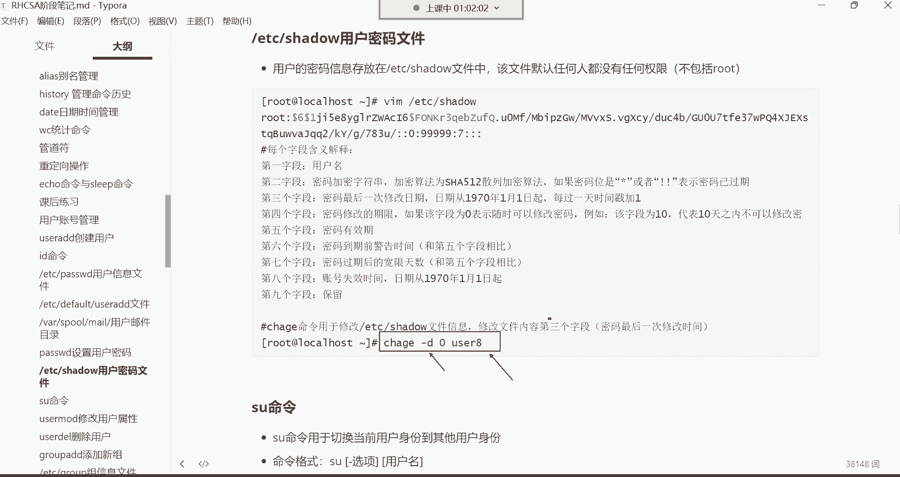
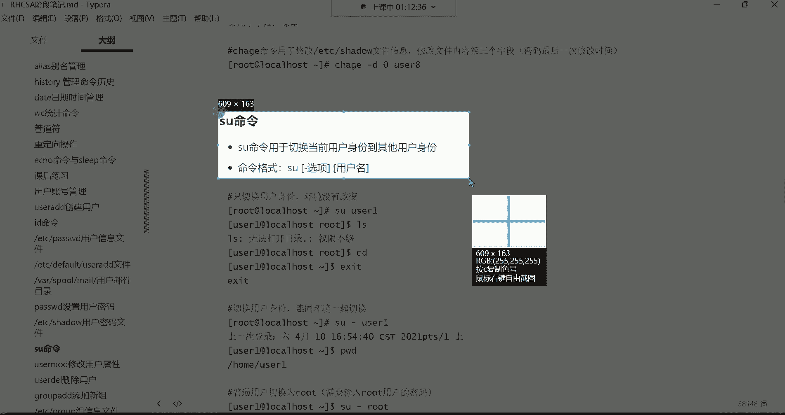

# Linux运维培训教程超全合集，通俗易懂，适合小白，带你从入门到精通1 - P16：红帽RHCSA-16.passwd用户密码设置、密码文件详解 - 洋洋得IE - BV1qX4y177j1

啊，我们接下来呢还是按照上节课的内容继续往下讲哈。我们上节课是讲到了哪里呢？我们上节课是讲到了一些就是我们平时用的不是很多的一些命令。然后呢，讲完之后呢，我们就给大家讲解了这个用户的管理。😊，呃。

用户管理的话呢，这里边主要是讲解如何去创建系统里面的用户。没错，然后我们先连到我们这个机器上面哈，已经连上来了。连上来之后呢，我们上节课我们讲了哪些呢？我们是不是上节课给大家讲了UCI的这条命令啊。

然后呢又给大家讲了什么呢？又给大家讲了这个它的一些常用的选项以及这个配置文件啊，是给大家讲了ETCpaWD这个配置文件的详细内容了，我们都给大家讲了。😊。

然后呢。哪里没有讲呢？就这个位置没有讲，就是像。啊，差点忘了上课是吧？啊，没关系哈。😊，嗯，然后这两个呢给大家说一说哈，就是ETC default useI的这个文件。这是我们上节课并没有讲到的内容。

然后呢，咱们就是直接从这儿讲哈。但前面的内容呢都是相对比较简单创建用户嘛是吧？UI的命令。然后呢，如果有一些特殊的需求，大家可以结合它常用的选项去使用就可以了。然后对于这个文件的话呢。

我们简单给大家来复习一遍哈，复习一遍。😊，这个ETC下的passWD文件是存放用户基本信息的这也是我们系统里面非常重要的一个文件。然后我们的用户呢，它的基本信息都在这个文件里面放着。

这个文件呢是每个字段呢都有一定的含义。如果我们拿这个文件里面的root这个行来给大家来讲解的话呢，就第一个字段就代表是用户名字了。就是这个用户叫什么名字，叫root。然后第二个字段呢叫做密码战位符。

这个密码战位符没有什么特殊的含义哈，主要就是一个密码标识符而已，永远都是X。😊，第三个字段，这个叫用户的UID这个UID呢就是我们系统当中每一个什么呢？账号的ID号，就像我们每个人的身份证号一样。

s态命令跟弯图通用吗？不通用啊不通用啊，但这个基本命令是通用的，但它会有略微的区别。OKUID就是每个账号的一个什么呢？一个身份证号。然后UID为0呢是我们系统里面的超级用户。

这个UID呢如果是从1到999的是系统里的伪用户，主要就是不能登录系统给我们系统里的程序提供怎么说呢？运行的一个身份。然后还有UID是1000往上的，都是管理员啊，大多数都是管理员创建的用户。啊。

这是UID然后第四个字段，第四个字段叫做用户的基本组ID就是每个用户的初始组，它有个ID号，也都是在这个什么呢？在UID的右边跟UID啊相同啊，然后用户的描述信息。

这个呢上面给大家讲的是其实就是一个用户的备注而已。没错吧，然后我们可以手动去改它。然后用户的加目录加目录的话呢，就是这个每个账号它属于自己的目录，我们称之叫加目录。

在系统哪个位置都在这个文件里面给它记录着呢。还有用户的解释器啊，OK这是对于这个文件的每个字段的一个含义解释。😊，嗯，然后下边呢我们来说一说哈这个usI的 default这个文件。

啊，出去玩玩有学习快乐吗？玩怎么可能有学习快乐，是不是啊，咱们说说这个ETC下边。😊，啊。来说这个文件哈。ETC default use side的这个文件，这个文件呢叫做存放用户默认值的一个信息文件。

啊，我们前面啊你看创建了很多用户，咱们打开ETC下的passWD的文件。😊，看到了吗？是不是这些用户的信息都在这个里边呢啊，然后呢，如果说我们在创建用户的时候，我们直接这样优色I的。

我们指定一个优色1一，什么都没有指，就指定一个用户名了，其他都没指，是不是？😊，好，那这个时候呃跟这个用户相关的什么，比如说我们来再打开那个文件哈，再打开那个文件。打开以后呢，你看跟这个用户相关的。

比如说它的什么。😊，加目录啊，还有它的解释器啊，这些为什么默认会系统给它分配到home下边，或者说解释器。为什么是默认它败出这个解释器呢？就是因为啊这个文件它决定着这个用户的一些默认值。

就我们在建用户的时候。😊，呃，在最早期的时候，lin斯这个系统啊，它是分为什么呢？分为这个。两种模式。第一种叫做公有模式。第二种叫做私有模式啊，但是现在没有了，现在都是属于私有模式啊。

在以前的公有模式下边这个系统呢就是我们在创建一个账号，比如说我建立一个一个优色一。那这个优色一啊，它的这个组注意哈，我们来退出说一下它的这个组啊，我们ID优色11这个用户。

它的组默认是不是系统给它分配一个同名的组啊，然后组ID呢跟UID默认也是相同的呀。在早期不是在早期呢系统会把这个用户的基本组给它分配成那个ID号为100的，作为这个用户的一个初始组或者说默认组啊。

但早期公有模式下，现在都是私有模式了。所以说呢这个大家就了解一下就行啊。这个配置已经失效了。😊，然后第二行啊第二行home等于home，这是用户的加目录。那这个呢就是我们在创建用户的时候。

为什么系统会把每个用户的加给它分配到根下的home下边呢？那是因为这个文件里面指定了，就是用户的加目录默认就在跟下的home下边存放着啊，所以说我这个home目录就是给所有的普通用户准备的一个什么呢？

存放加目录的地方，看到了吗？都在这个里面哈，用户的加。然后。😊，当然这些东西没有需要你去任何没有需要你做任何改动的哈，你只需要了解就行。其实你不了解的话，也不会影响你对这个系统的一个任何使用。

所以这种东西只需要了解，不需要你花精力去备它哈，你只需要知道。😊，那这两行呢是跟密码相关的那我们现在还没有讲密码，所以咱们先不用去管它哈。我们先从再说这个shalls的话呢。

大家可以看一下等于并下的bittch。就是说为什么每个用户的解释器都是并下的bitch那个解释器。😊，默认情况下哈，为什么都是bin batchch呢？

那是因为这个文件里面就指定了每个用户默认使用的解释器是batch这个标准解释器啊，所以说呢系统才会给它分配这个解释器。😊，还有这个模板目录ETCSKEL啊，这个呢我们就没有什么太多可啰嗦的了哈。

这就不说了。然后是否建立邮箱。这个呢我呃我记着我们前面好像讲过呀，在哪儿呢？嗯是不是讲过呀？对，今天讲用户管理哈。😊。

在这个位置，在va mail这个目录下边。

在这个目录下边呢存放的是什么呢？咱们来看一下哈，我们打开这个目录，在va下的。😊，sport下边有一个mailile，这个目录里面存放的是每个用户的收邮件的地方，就是每个账号都可以去接收邮件去发送邮件。

那它的邮件在哪呢？啊，你看比如说us色一，它的收邮件的文件就在这儿，就是它的邮件内容就会存放在这个文件里面。到时候呢UCE想看自己的文件，有一条命令叫m回车啊，但是没有找没有找到这条命令是吧？啊。

可以使用这条命令去查看邮件啊，当然没有人给他发邮件，所以说呢这时候他看也看不到，但是也没有这条命令，是不是啊？没关系啊，我前面给大家讲过一条命令，叫做y。😊，啊。

privapri呢后边跟上一个什么mail，就是我想使用这条命令，但是啊没有这条命令，我可以搜索一下，看看这条命令是怎么来的。😊，啊，报错了啊，大家可以看到我这个报错了，我这个嗯我看一眼哈。😊。

我这个机器好像是无法访问外网了。我看一下，我拼一下3W点百度点儿com啊，能拼通，能拼通的话，host。嗯。渗透S点儿。OO OD。好。呃，对NET模式哈NET模式。啊，也能拼通。也也能拼通。

这些命令这这些命令应该都不陌生吧，前面是不是都讲过呀，还有一些快捷操作。😊，是不是都不陌生？我刚刚那个快捷操作是不是ctrolW是不是controrlW啊，嗯，controrlW哈就删除一个单词儿。😊。

没网是吧？然后host的host的干什么用来着？就是解析一个域名的对应IP啊，这些都讲过哈。😊，OK渗托S那个圣陶OSORG是圣托S的官方网站。这个这是一个地址，后色命前面上面不是讲过了吗？呃。

解析一个域名的IP的。😊，然后呢，我现在我再用一下y。嗯。我再测试一下哈。因为刚刚显示没有连上啊，这时候好像可以了，这时候可以了哈，刚刚网络问题。嗯，有些慢。叹号是干啥的是吧？

叹号就是后边跟上一个字符串，可以帮我们去调取历史命令中我最近执行过的这个亚目命令。😊，哈哈是这个意思哈。对。😊，就是我曾经执行过这个亚母，但是呢我用叹号的话呢，后边跟个亚母这个关键字啊。

他就帮我重复去调取了呃，没有哈没有这个。😊，没有收到没有收到。其实就是这包我跟你们讲啊，其实其实就是这个包哈叫。😊，mail后边多个X。咱们这样，虽然说没有学习软件包管理。

但是咱们先用一用ym杠外ins把这个包给它安装上，叫mailile。😊，后面多个X看到了吗？规车。嗯，偷个S翻车了是吧？这么喜欢看我翻车是吧。😊，啊，安装好了是吧，嗯，安装好了之后呢。😊，安装好了之后。

我们就直接这样敲m回车啊，m多扫一个L回车啊，这样就是看我们的邮件哈，看邮件。当然你发现他说这个no mail for rootot，就是root没有邮件。😊，没有邮件哈，要么是不是安装什么都都能安装。

呃，只要是仓，只要是我们后面讲软件包管理的时候，我再给你们讲这些东西吧。你先你先不用去理会哈，先不用去理会这些东西啊，这查看邮件，如何查看自己的邮件内容。OK这知道一下就行。😊。

好了，那。😊，下边呢我们开始讲密码呃，就是给用户设置密码。我们前面呢。给大家讲用户管理的时候，并没有给大家讲如何去设置用户的密码。而你如果说不设置密码的那这些账号他也没有办法登录系统。

我们前面创建了非常多的账号是吧？

我们用t，然后呢直接看ETC下的passWD看这个文件的最后十行尾1行，这都是说我们自己手动建的用户是吧？从UCE一直这么多啊，都是我们自己建的。但是呢这些用户呢他们无法登录系统，无法登录系统的话。😊。

那你把这个账号发给别人，别人说你可以使用UCE这个账号去登录系统，但是它没有密码，没有密码也不行。所以接下来呢给他设置密码。那设置密码呢，我们用的命令是这个。😊。

passWD啊，全名叫pass word。那这条命令的话呢，是用于设置用户的密码的，命令格式也非常的简单。咱们来说说它命令格式哈。

他的命令格式啊呃，你们来看一下。非常非常的简单，我放这儿吧哈。😊，判长。帕sWD。后边呢你看这条命令。你后边可以什么都不加，也不用加选项，也不用加用户名，你可以直接用回车。😡，你看如果直接用的话。

它是改谁的密码呢？如果你要是直接用啊，他就是改root自己的密码。能列吧。哈改自己的密码。那也就是说如果你想修改自己的密码的话呢，那你就。对当前用户啊，你用谁登录的就改谁的密码。

所以这时候呢你就输入密码就可以了。比如我输入一个多少呢？一回车。然后他说这是一个无效的密码，密码是一个回文。什么叫回文呢？其实这个所谓的回文就是不符合他的一个密码的一个规范。没关系哈。

再重新输入一遍新的密码就可以了。一回车OK这时候呢他告诉你了，说所有的身份验证令牌已经成功的更新了看到了吧？啊，已经成功更新了吧。好。😊，那这个对于设置密码来讲呢啊这是给自己设置密码，就是你用谁登录的。

然后呢，你就直接敲这条命令就可以了。那如果说我想给别的用户设置密码呢，比如我们我要给us色一设置密码，那我就这样。passWD然后呢这样哈给usCE那后边你得跟上用户名了哈。对。

你得跟上用户名usCE回车。这时候呢就是更改usCE的密码了。那这时候呢我们给它设置密码。比如说我也给他设置一个比较简单的一回车，然后一回车，你看它也是说什么是一个回文，是不是啊？啊，然后呢。

我们又重新输入一遍，没关系哈，这个密码也设置成功了。😊，这是设置密码。那这时候呢我们再再开一个终端，我们再开一个终端，再用us色E登录，还是同一个机器哈，90。然后呢我们。😊，输入用户名是us色一。

这个不就是普通用户了吗？然后我们呢输入确定点确定，然后密码一。然后确定在这儿。好，那大家可以看一下啊，我清个屏。那这时候右色一是不是就登录到系统上面来了呀？😊，没错哈，那有了密码，他就可以登录。😊，好。

那这是我们所说的这个密码的设置，比较简单吧，想给自己设置密码呢，就直接敲啊。因为你用谁登录的，你就是给当前用户设置密码。那右边这终端，比如UCE，我也想改自己的密码，可不可以啊？😊，可以啊。

他也可以改自己的密码，就普通用户啊也可以使用这条命令，改自己的密码回车。你看这时候呢他就可以改了，更改自己的密码。但是呢作为一个普通用户啊，他如果想改自己的密码，这时候他得干嘛呢？嗯。

对他只能改自己的哈。因为普通用户嘛那他没有权限改别人的密码。😊，然后他得需要知道自己当前的密码。对，知道自己当前的那当前密码是一，然后回车。那这时候呢它才能输入新的密码。比如说新的密码。

我们改成一个什么呢？比如说123456。😊，啊，我已经输入完了哈，这密码就是不显示的。注意哈，我们在这个位置输入密码，它是不显示的。因为它为了什么呢？为了保证你的密码的安全度，所以是不显示的。然后回车。

😊，这时候呢他又提示了说你这个密码啊无效，密码少于8个字符。看到了吗？就是密码长度不够哈嗯不够。那这时候呢我们再来一遍可不可以啊，我们再确认一遍，像root一样。

你看root它也提示了说你这是一个无效的密码，什么密码是一个回文，是不是啊？而后你重新输入一遍，那root重新输入一遍以后，你发现root就可以就能够把密码给它修改成功。😊，那这些用户呢。

我们再来一遍123456，我已经输入完了哈，我再回车回车。哎，你发现怎么说还是不行啊，还是少于8个字符是吧？哎，我们再来一遍，123456回车。😊，好，大家看一下。他说什么已超出服务器重事的最多次数了。

你看到了吗？哼。所以发现像这种情况的话。是。什么情况呢？就是普通用户啊，他不能像root一样。虽然说你说我改的说我设置的密码呢不符合你的规范，但是呢我只要再确认一遍，你也拦不住我。😡，能列吧。

那root牛逼，没错。而这个普通用户来讲呢，他是不行的。这个普通用户啊，你要知道，哎呦他在改一个密码的时候，你首先他得知道自己当前的密码。只有输入当前密码以后，才能去输入新的密码。

而且他在改新密码的时候，这对密码规范，大家可以看一下。第一呢长度不能少于8个字符。因为我们输入的密码是多少呢？我们输的是这个123456，是不符合它的这个规范的。而复杂度的话呢，大家也可以能够看得到。

😊，就是他得要求你这个密码里面要有数字，还有字母，而且字母还区分大小写，就是有大写，还有小写，而且还要有一些特殊字符在里边，你这个密码才属于它的一个什么密码规范。能理解吧。

那你比如说我现在我在设这个密码，比如说我这个长度如果符合它的条件，你看我会车。😊，旧密码一，新密码12345678回车。你看这时候他还是提示说什么无效的密码，他说你这个太简单了，太系统了。啊。

密码太太简单了哈，然后再重新来一遍呢，12345678仍然不行，你看到了吗？然后你再来一遍，12345678，这就完了，超过3次。啊，看到吗？就不让你设置了哈。所以说呢我们对于这个普通用户来讲。

他想设置自己的密码，一定要遵循这个密码规范的。所以这时候咱们给他来一个比较复杂的密码，什么密码呢？我们来一个哈。😊，回车。旧密码一新密码123，然后呢，ABCD点点点。大写的。X。回车，哎。

你看这个时候。他就并没有提示说什么无效的吧，让我们再重新输入一遍吧。好，再来哈1234ABCD点儿点点儿。哎呦，我好像输入错了。😊，点点大写X面不匹配是吧？再来一遍哈。

1234ABCD点儿点点大写的X走你。😊，再来一遍哈，1234，然后ABCD点点点大写的X好了，这密码设置成功了哈，你看我这密码设置的是不是非非常复杂呀？😊，很很复杂吧，1234ABCD点点点大起来X。

这密码里边就有什么有数字，没错吧，是不1234是数字啊，满足他的条件了吧。😡，嗯，符合他条件。还有什么呀？是不是还有字母啊，那你看我这个字母是不是ABCD就是字母啊。😡，是不是啊哎ABCD是字母。

然后呢，还要有特殊字符吧，这特殊字符三个点其实就是特殊字符，这属于特殊字符哈。然后还有什么呢？还有这个X大写的X大写S就是。😊，在英文字母里面呢就是旧小写，还有大写，这样就满足他的条件了。😊，哎呦。

你看这密码复杂度是吧，其实。😊，在我们这个学习计算机的时候，就大部分的密码，它的复大度其实都是这样一个等级，都是这样一个等级哈。就是有数字有字母，而且字母里面要大写，还有小写，而且呢还有有一些特殊字符。

长度不能少于8位。这大多数都是这个密码规范。包括后期你们学习数据库的时候，学习数据库的时候，数据库的密码规范也是遵循这个规范。😊，能列吧。OK所以这样呢他们才能够把这个密码修改成功。

还有这个密码规范里边，另外一个啊，你本次修改的密码不能跟上次的密码太相近。比如说我咱们上次是1234ABCD是吧？这密码大家可以看一下啊。😊，是不是1234ABCD点点点点大写的X啊。

那如果我现在再改改个密码，我改多少呢？我比如说我改它改成4321，然后呢，ABCD点点点大写的X。😊，这个是不是就把这个1234给他调过来了呀？那咱们看看可不可以哈，咱们再来一遍。😊，嗯，pasWD。

旧密码1234，然后呢，ABCD点点点大写X新密码我改成4321。然后呢，ABCD点点点大写X。你们看他怎么提示的，它是不是直接提示说你的密码与原来的太相似了呀？😡，没错吧。这个就不让你改了哈。

不让你改，看到吗？因为太相似了哈，这是第二个密码的规范。所以大家在设置密码的时候呢，也一定要注意这个密码的规范哈。然后再来给大家说一下，我我看你们刚刚有人说这个密码如果记不住，是不是啊太复杂，记不住。

记不住的话呢，怎么说呢？😊，你可以重置一下，但是这个重置得让root重置哈。对这个root他在给任何一个用户，包括给自己改密码的时候，你们看一下它的特点哈，回车。😊，你看root。

它就是给自己改密码的时候，他都不需要知道自己的原来的密码是多少，直接就输入新的密码，看到了吗？😡，这叫新的密码哈，不需要输入旧密码的。而而改别的用户也一样。比如说他要改优CE的密码。😡。

回车他也不需要知道UCE的原形的密码是多少，直接给他改就行了。一回车一。😊，说了吗？就改成功了，是不是？😊，所以说呃如果说你这个这些用户的密码忘了之后呢，也没有关系哈。root呢直接给你重置就行了啊。

给你重置哈。😊，嗯，能查历史密码吗呃。这密这密码没有历史没有密码没有历史哈。嗯OK。😡，好，这就是设置密码。这个大家注意一下哈。😊，而这些普通用户呢，我们拿UC一来说，比如说这个UC一。

他想给别的用户改密码，比如我想给谁呢？我想给UC2改密码。你们看一下哈，U一他想使用passWD命令。😊，想给U42改密码回车。这会就直接提示了，说什么呢？哎，说。只有跟用户才能指定用户名。也就是说。

只有root才能够在这条命令后边跟上用户名。😊，能理解吧？也就是说这条命令也只有root用户才可以给别的账号去改密码。😡，那而你这些普通用户呢，在使用这条命令的时候，后边是不能跟任何东西的。如果跟的话。

不允许。啊，也就是说不不能让你去改别人的密码。😡，好。啊，能查UC机的密码可以查查是可以查的哈。嗯啊查查查可以。但是呢查的话，你看不到它的密码的。因为对于passWD这个命令有一个杠S选项，杠S哈。

杠S可以看你看到吗？这有个杠S叫查看密码信息的这个选项。这时候呢我们可以这样。😊。

在。你这样你杠大S哈，大SUCE回车看到吗？这就是看UCE这时候呢你可以看到它的一些密码，告诉你密码已经设置了，看到吗？然后并且呢什么加密算法，哎呦这个有些复杂了是吧？加密算法以及前面这些东西。

这个用户名设置密码的时间，哎呦，这个都代表什么意思啊？😊，这个呢我们得什么呢？得给他说说这个密码相关的文件。😊。

我们改完密码以后啊，这个密码存放存放在一个文件里面，这个叫ETCs叫用户密码文件。在这个文件里面呢是用户的密码信息存放在这个ETCs文件里面。这个文件的特点任何人都没有任何的权限去看。当然哈当然。😊。

比如说usCE，我想打开这个ETCETCsha这个文件会车，你看权限不够，为什么呢？因为对于这个文件来讲，它的权限大家可以看一下，我们LL看ETCsha。😊，你看到了吗？他这个文件的权限啊。

几乎就是任何人都没有任何权限的。包括root也一样，root也没有任何权限。😡，你想看的话也没有权限，但是没关系啊，root来讲，他想打开这个文件，这是也是允许的啊，没有任何问题哈。😊，没有什问题啊。

我这个咱们就来说一下这个文件。这个文件它跟那个ETCsha这个文件跟ETCpaWD这个文件，那一个是叫用户信息文件，一个是用户的密码文件，这两个文件都是息息相关的哈。

就是你这个文件里面是存放用户的基本信息的。这个文件里面是存放每个用户的密码信息的。能理解吧。所以这两个文件都是息息相关的啊，这是ETCsha。😊。

然后呢，我们打开以后呢，咱们来看一看这个文件里的内容。针对于这个文件啊，大家看一眼呢也是感觉这个眼花缭乱的是吧？呃，这个文件也非常的有规律。我们前面在解读ETCpassWD这个文件的时候。

是不是每个这个文件里面每一行总共有7个字段啊，以冒号作风格吧。😊。

好，咱们我再复制一个终端哈，右击复制，这样是复制一个什么呢？就是一模一样的终端出来，看到吗？也是root。😊，也是root哈，就是我现在想用两个终端来什么呢？来管理这个系统也是可以的哈。

然后就像在叉里面可以右击复制，就一个一模一样的终端就出来了。好，那这时候呢我们再干嘛呢？我们再打开EPC下的passWD的文件，这给大家打开。然后呢，咱们再回顾一下这个文件。

这个文件是不是每一行每一行啊都代表一个用户的信息啊。把行号打开。😊，每一行代表一个用户信息，你想看你文件里面有多少有多少个用户，那是不是就看这个文件里面有多少行就可以了。

那我告诉你这个文件里面这个文件里面有多少个用户，那你这个密码文件里面也是有多少个用户。😊，放到最后29看到了吗？是不是2十9行，这里面也一样是吧？2十9行OK然后每一行代表一个用户的信息，没错吧。

然后呢，这个文件的特点是以冒号作为风格，然后呢，每一个字段都有自己的含义，这个文件里面总共是7个字段是吧？好，那这个密码文件呢，它也是。😊，每一行都代表一个用户的密码信息，知道吧？

那这每一行也是以冒号作为风格的。注意哈，也是以冒号作为风格哈那。😊，这里边可不是7个字段了，这里边是9个字段，这里面总共是9个字段。😡，知道吧？这文件怎么有颜色是吧？啊。

这是我们VIMVIM哈它自带颜色的。😊，因为VM是适合编程的一个什么呢？一个编辑器。所以你用它打开一些文件的时候，它会给你显示一些颜色。但如果你换做VI的话，就不用颜色的哈这个用VI没有颜色。😊。

OK那9个字段，那9个字段我们怎么去解读呢？所以这是我们今天要对于这个文件要详细。😊，这个讲的一个重点，嗯，看冒号几个字段比冒号多一个是吧？呃，这个里面就是每一行都有9个字段哈。

然后每一行是一个用户的密码信息。所以接下来我来给你们讲讲。😊。

这个密码信息文件怎么去解读它？

当这个呢我们。解读的时候啊，可能说你们不太好理解。

但没关系啊，如果不好理解，可以多听两遍哈，多听两遍。

来看这儿哈，我们先咱们就拿这个UCE这个用户来说吧。好吧，UCE这个用户。那UCE这个用户呢，它的每个字段我们怎么去解读？😊，来哈第一个字段叫用户名。😊，就这个用户叫什么。

那这个没有什么太多可解释的了哈。大家可以看一下这个优色一是吧，这就是他的用户了啊，这个颜色。😊，啊，换联颜色哈，用户名。OK第二个字段呢。😊，第二个字段叫做密码加密字符串。也就是说这个用户的密码了。

看到了吗？第二个字段在这儿，但是他这个密码有些长，你看从冒号开始一直到哪儿，一直到这儿，一直到这儿哈。😊，看到了吗？这第二个字段就是密码加密字符串了。那你看他这密码。😊，我们在设置的时候。

UCE的密码是多少啊？UCE的密码是一。没错吧。但是他有加密啊，他是通过这个叫SHA512的这个加密算法，把这个密码给加密了。加密以后呢，这个密码呢就变得非常的复杂。哈这个可是不可能被人给破解的哈。

这个密码因为什么呢？因为它这个算法就是都是唯一的。就是我们这个系统里面，比如说你别的用户以后，你再给他设置密码也是一的话，你放心，他的这个密码加密字符串也不可能是一模一样的。😊，🤧啊。这是加密算法。

而这个SHA51512这种加密算法，你不用去研究它啊，这种就是一种数学家，是数学家，他们研究出来的，针对于密码进行加密的一种机制啊，保护密码安全的。所以你这个密码甭管是多简单，多复杂。

加密以后呢都是这个样子。😊，别人也破解不了能力吧，然后你们也不要手欠，你说我用VM打开，我可以改不改嗯，我能不能把这个密码改一改？😡，改不了，注不啊？你改的话，你比如说你一旦把某一个字母。

你哪怕你哪怕把这个点儿给它改删掉的话，我告诉你这个密码都不能用了，知道吧？就这个你哪怕删一个点的密码都不能用了哈。所以这个不要去修改就可以了。然后这个第二个字段呢，我这儿还有。😊，给大家写了。

如果你这个密码的这个位置是星或者叹号叹号，表示密码也过期啊，其实你看我们下边哪些用户呢，像UC像除了UCE以外，别的用户都没有设置密码吧。你看他们第二个字段就是这个叹号叹号，其实就证明这个用户没有密码。

😊，星号呢大多就这个密码不能用啊，已已就是已过期。其实就这含义。就这含义哈。好，然后这第二个字段就是密码加名字段，这个没有需要你去做改动的哈，所以你只需要知道就行。接下来第三个字段。😊，在这儿呢。

这第三个字段它代表什么意思呢？第三个字段代表是叫密码最后一次的修改日期。啊，最后一次的修改日期，然后他这个日期从1970年的1月1号开始，每过一天时间戳加一啊，什么意思呢？就是。嗯。这个密码啊。

我们说1970年哈啊考你数学是不是啊？对这1970年是什什么日期呢？1970年1970年是这个unix。😊，啊，是unic这个系统的一个诞生日期啊unix诞生日期啊就1970年的1月1号。😊。

每过一天时间出来加一，所以你算一算，1970年到这个用户修改密码中间过了多少天是，你还没出来呢，是吧？所以说啊他这已经告诉你了，他这个数字已经告诉你了，其实就是过了多少天呢，就是过了这个19077天。

你就不用算哈，就是这个账号。😊，就这个账号UC1。他修改密码，从1970年1月1号。到改密码那天啊，对，其实就是今天咱们不就是今天给他改的密码嘛？这中间就过了19000多天啊，19000多天能列解吧。

这叫密码最后一次的修改日期。😊，好。所以这个呢第三个字段我们怎么说呢？后期这这个字段我们后期可以改哈，这个可以改。😊，然后我我们稍后再说怎么改。或者说我们再说说改它的用处是什么啊。然后这个字段，这是第。

😊，四个字段了，在这儿大家看一下第四个字段。叫做密码的修改期限。什么意思呢？密码修改期限。但是呢这个字段为0是吧？那如果该字段为零表示这个账号随时可以修改自己的密码。😊，比如说我想限制一下这个账号啊。

你多长时间不能改自己的密码，可不可以呢？可以。如果这个字段，你看例如该字段如果为十的话，就代表这个账号10天之内是不可以改自己的密码的。所以这时候你把它咱们来演示一下哈啊，我这样我用每刀啊。

我跳转到行尾每刀OK跳过来以后呢，你看我在这个位置，我比如说我加一个十。那我我给它改成十哈，改成十以后。😊，这时候这个账号就10天之内都不能去改自己的密码了啊，就限制他多长时间不能改自己密码。

但是这个一般我们不会限制哈，一般限制它没有意义啊，这位置我们不用管知道一下就行。好，然后第五个字段，这叫密码的有效期。这个呢我们会什么呢？会去限制它。什么叫密码有效期呀？

其实说白了就是你这个密码可以用多久多久呢？是。99999什么呀？😡，天注意哈，就是这个密码。😡，它的有效期是99999天，9万多天，这人也活，这人也活活不了那么多天呢，是不是啊啊？😡，你能活到那时候吗？

你不可能活到你你可你可能活到9万多天吗？是啊，100多岁才3万多天，是不是，你得你得活300多岁啊。😊，对对，活将近300多岁才可以哈。嗯，你才能活到这1个9万多天。所以对于对于这种的密码的话呢。

怎么说呢？你可以用它传宗接代哈传宗接代。但是这种东西怎么说呢？你想想。😊，你说这这一个密码在咱们这一台服务器里边，注意啊，是在我们这一个服务器里边，咱说它可以这个使用这个将近300来年是吧？

但是你这一台服务器说白了它也不能。😊，正常的去使用300多年的，没错吧，因为在企业里边就这一台服务器，你想想它跟我们的个人电脑没什么区别，只不过比我们个人电脑的配置呢会高一些。😡。

那什么CPU内存什么比我们的电脑配置要高一些。😡，整体来讲呢，就是跟我们的个人家用电脑其实也没有太大区别，都是一堆硬件。😡，那，你最主要是这服务器它活不了那么多年。

这服务器一般在企业里边用个几年就淘汰了呢，用个最多用5年。😡，就像我们的个人电脑一样，你想想你现就即便你现在你花钱去买一个电脑。😡，你这电脑你能用5年吗？你如果能用5年，你这电脑说白了。

那真的是非常不错了。而且。😡，你用5年以后，你发现你这个电脑也不行啊，配置跟不上了，是吧？😡，所以说呢在企业里边也一样，服务器也都是几年一更新，几年一淘汰的哈。😊，所以对于这种东西呢。

在企业里面可以改怎么改呢？就是比如我希望这个账号的密码是多少呢？呃，是俩月，有效期就俩月就给它改成60就行了。😊，啊，就让这个密码呢可以用俩月。😊，用俩月哈，那超过两个月以后呢。😊，嗯。啊。

2012年的是吗？那超过两个月以后，这个密码就过期了，知道吧？啊，这个密码就不能用了哈，就限制这限制一下这个密码的有效期。😊，O。啊，那先上有效息以后，那你说那两个月以后，两个月以后这密码不能用了。

那这个账号是不是就不能登录系统了呀？不是。😡，不是哈，他是怎么回事呢？就是。他可以再把这个密码改一改。😡，再改一个再改一个新的密码，只要这个密码呢再改成一个新的，它就又能再用两个月。知道吧啊。

再用两个月。其实是这个意思啊，并不是说这个密码用两个月以后，这个账号就不能登录系统了，不是那么回事啊，你再换个新的就行了。因为在企业里边，企业服务器为了保证这个账号的安全。

一般得要求你每个账号隔多长时间要改一次自己密码，你不能说你这一个密码。😊，一直用下去，这不行哈不行。都得限制你多长时间改一次密码，多长时间改一次密码。嗯，对。这是按照天数来的哈，按照天数来的。😊。

所以像这种东西。怎么说呢？呃，你就得限制一下限制一下哈。但是对于用户来讲，你比如说对于UCE这个账号的使用者来讲，他可能不是很清楚的知道。😊，我这个日期从哪天开始计算吧。是不是？他可能不会去记啊。

我这个密码总共可以用60天，但是从哪天开始到哪天结束，一般不会记，那怎么办？哎，一般呢我们有提示，所以这第几个字，第六个字段，第六个字段就叫做什么呢？叫做密码到期前的警告时间，它跟第五个字段。

他们都是有关系啊，就这个第五个第六个第7个这三个哈都有关系。😊，什么关系呢？咱们拿第六个字段来说，比如说我限制这个账号的密码可以用俩月。好，那俩月以后它不就过期了吗？😊，那这跟他没关系。

如果用户你记不住什么时候改密码，我在这儿啊，你看这位置不是7吗？😡，是吧这是个七，这七是什么意思啊？这七就是我密码到期前的警告的一个什么一个天数。我前7天我通知你一下，你密码还有7天就过期了。

所以你也不用记，我会在前7天通知你就行了。这样就跟你没事，你充个会员，你充个会员，你发现你这会员马上到期的时候，他就干嘛，他给你发通知啊，你这个会员还有多长多长多长时间就到期了，是吧？嗯。

然后请请您尽快续费之类的。😊，就这意思哈就这意思，所以就是到期前给你发送一个警告消息啊，这是第六个字段。😊，前7天啊可以哈，挺合理的。😊，然后呢，这第七个字段第七个字段叫密码过期后的宽限天数。

这个过期后的宽限天数默认是空的，你看到了吗？你看这是不是个空的呀，这里边什么都没有哈。😊，呃，是这样的哈，就是你可以往里面写。比如我写个几呢，我写一个7，里面加个7哈，在这儿。😊，啊，加个7呃。

加个7以后，这个期就是什么呢？密码过期以后，我给你宽限7天。你就假设这个账号的使用者。我限制你这个密码，你可以用60天。然后呢，我前7天呢给你发送一个密码过期的警告。

但是呢这个人呢他就是仍然没有改自己的密码。可能说由于比如说出差了，出差了的话呢，没有办法登录服务器去改自己的密码，那怎么办呢？这时候呢你可以告诉管理员啊，我在外地，我现在改不了自己的密码。

你你干嘛呢给我宽限几天，那你可以把这个位置给他改成7啊，我再给你宽限7天啊，然后比如说在这个7天之内注意啊，在7天之内。😊，他仍然可以使用这个密码去登录这个系统。但是他登录系统的时候呢。

你每次只要一登录系统就直接让你去改密码，能理解吧？如果你不改，你用你原先的旧密码不让你登录的。😡，啊，是这个意思啊，就是过期以后的宽限天数。好了，然后呢还有这个第八个字段，第八个字段叫账号的失效时间。

这个账号的失效时间。呃，就是我比如说我希望这个账号可以最多使用多久的话，嗯，对，只有root可以改哈，只有root可以改。因为这个文件也只有root才能打开。😊，然后我们再来说这这个账号失效时间。

你比如说我希望这个账号明天就失效，那咱们今天改的密码，那到明天是不是就是78呀？😊，没错吧，今天改的密码，因为他这个日期就是从1970年开始算哈，1970年的1月1号开始。😊。

比如我希望这个账号明天就失效，那到明天就是19078天，那这个账号明天就不能用了。😊，那你说那我前面什么搞的什么密码的宽限天数啊，密码有效期啊，这还有用吗？就没用了，到明天就失效了哈，能理解吧？啊。

但是这个我们一般不不会去设置哈，不会去设置。😊，知道一下就行。然后第九个字段第九个字段现在你。😊，看到了吗？这最后一个字段是第九个字段哈，空的就是现在属于一个保留的状态。

保留哈就是还没科学家们可能正在努力的研究，我第九个字段应该去。😊，放些什么功能呢？可能现在还没有哈。等一下可以看一下失效期的提醒是啥失效期。嗯。账号失效时间是吧啊。哈19。😊，078行吧。

那么改成19078，然后保存退出啊，等一下啊，你看这儿呢，他说我在保存退出的时候，当然我是用快捷键哈，我是那个用两个大写的ZZ。我保存退出的时候，大家看到吗？他说这是一个什么read only。

是一个只读的文件，你得加一个叫叹号，是不让你强制保存退出，这样才可以。😊，看到了吧？所以这时候呢咱们得量，因为你是只读权限，不能改。😊，那咱们就这样。叹号啊，当然是WQ叹号就强制保存退出。

然后我们回车O。我们改的是U色E的是吧？好，那UCE呢退出系统，然后再登录。😊，用户名优色E啊us色E回车密码回车。

嗯。这个。看一下好像也没有什么提示，是不是啊啊，这个确实是。嗯。呃。没有什么提示啊，这就是一个。登录的一个时间。70。嗯，last这是登录时间。没有提示，你发现他这个账号失效时间确实是没有任何的提示哈。

但是呢这个没有任何提示。😊。

啊，密码到期前的警告有提示啊啊，对，时效没有哈。😊，啊，不是那你说错了哈，是这个你如果说要是改这个的话呢，它是有提示的。😊，不是说是改这个不是改这个密码，这个密码这个什么呢？有效期是不是啊。

是到期前警告，是不是？😡，到期先警告。那你这个你比如说我给它改成几天的两天。是吧两天你这密码有效期就两天，然后呢钱这这不合理哈，这不合理，这不合理哈，这没有这么玩的哈。😊，啊。

这个这个它是肯定会提示的哈，你们可以自己去尝试一下。😊，这个哈你们自己尝试一下。你比如说呃，我就前三天，比如我希望你这个密码有效期是7天7天啊，你可以给它改成7。😊，在这位置哈。

你比如说你我可以给他改成7，然后我在前三天警告你。啊，但这个你们可以去尝试一下哈尝试一下。😊，到时候呢你再登录系统的时候，你看看这个账号有没有一些提示。嗯，OK。😊，然后这些的话呢。

我们一般嗯不会去设置啊，我们一般会设置什么呢？😊，这个我们可能会设置，就这个密码多长时间它改一次。俩月改一次密码，这是很正常的。因为我们要保证这个账号，它这个密码的一个安全性。

你不能一直使用一个密码永远不改。还有一个就是。比如说呀还有一种需求哈，什么需求呢？我先保存退出哈。😊，嗯，保存退出。你看我们见了那么多的用户。咱们见了这么多用户啊，但是这些用户并没有密码吧。

是不是啊并没有设置密码吧。那我们刨掉谁呢？我们刨掉这个U色8这个用户，因为它的解释器压根就不能登录系统是吧？咱们刨掉这个U色8这个用户，别的用户。😊，是不是都可以正常登录系统啊？好。

那我们现在给它设置密码，因为你不设置密码，别人无法登录。但是我们作为一个root来讲。😊，你说我们给比如us色6设置密码。是吧那我们可能给他想一个什么呢？就是一个。😊。

非常复杂的密码嘛？我一般不太现实吧。😡，是不是啊？我们可能给每个账号都想一个非常复杂的密码嘛，就长度也要符合。然后那个复杂度也要符合密码的规范嘛，这不太现实，是不是啊？而我们一般怎么回事呢？

我们一般就是给它设一个初始密码，比如123啊，我已经设置好了，123123是不是啊这是右侧几右侧6吧，然后再来右侧7，右侧7呢，我也给他设置一个123。😊。

123是吧，123演示好了，然后呢，优色3优色3也给他来1个123。😊，123123好了，咱们就拿这三个用户来给大家演示哈。你说这三个用户密码都一样。

那你如果把这三个用户us色6优色7优色3这三个账号下发给你们公司的员工的时候，比如说你把优色6给谁了？你把优色6给了你们公司的这个。😊，比如说小张啊。小微吧。小微了，然后你把U47呢给了这个小方了啊。

把U43呢给了这个什么这个阿莲了啊，这个我们中国的四大村花是吧？啊，女秘书吧？对，给了这三个人了。那你怎么就敢保证？😊，这小微呀。他会不会使用这个谁呢？这个阿联的。这个账号去登录服务器做一些事情呢。

你怎么敢保证呢？为什么呢？因为他们密码都一样啊，初始密码嘛是吧，123。😡，123这大家心里都清楚，密码都一样，是不是啊，都可以登录，所以这就不行。你把账号发给别人的时候，你告诉别人，这是初始密码。😊。

你得改你不能用初始密码登录系统啊，这密码你必须得改成你自己的这样才行，是不是啊？😡，但是你怎么就敢保证他们就能够。😡，首次登录他就必须得改自己的密，都得改成自己的密码呢。😡，你没办法保证。

所以一般怎么办呢？一般啊我们就通过这种这种方式哈。😊。

这种方式就是改密码的第三个字段，第三个字段叫做密码最后一次的修改日期。啊，他这个不是从1970年开始算吗？是不是啊？你把这个位置给它改成零，系统就会认为这个账号。他从来都没有改过自己的密码。😡。

那从来没有改过密码的话呢，那我们来看效果哈，我们用这条命令叫称着杠D0。😊，后面跟上用户名就行了。杠D杠D这个选项就是改这个文件的第三个字段的。😊。

把那个字料给它改成0。正常来讲，那个字段是不是什么19070777天呢，给它改成0。称至杠杠D0。后边指定用户名啊指定用户几了，我们前面是哪些用户来着？是优色6优色7优色三是吧，那就优色3啊，优色6。

然后优色7OK。好，改好了，改好以后呢，咱们打开那个文件，直接看它的第三个字段。😊，你发现。你看优色6跟优色7这两个用户它的第三个字段。变成什么了？是不是变成零了呀？第三个字段是不是变成零了呀？哎。

而你看U色一呢，它就不是零，是不是啊人家是是什么呢？就是从1970年到今天为止啊，我今天改的密码，那系统就认为它改过密码了。😊，而这个呢系统就会认为他没有改过密码，那没有改过密码，那最终的结果是什么呢？

我们来看效果哈，我们再开终端用优色3登录系统。😊，90。好，us色3回车输入密码，123初始密码回车。哎，你看。这时候登录系统啊，这系统就直接干嘛呀？直接让你更改us43的密码，你看到了吗？😡。

就是你拿着初始密码登录的时候，系统就强制要求你必须把你的密码给它改了。😡，嗯，那这个你是不是就可以怎么说呢？给每个账号发一个初始密码以后，你就可以很好的判断每个用户肯定会把密码都改成自己的了。他不改。

你比如说我contr C结束，那不好意思，你无法登录，你看到了吗？你不改就不能登录哈，你必须得改，你改完以后呢，要我来验证一下哈，user3。😊，密码123回车好，这时候改密码。改过之后。

下一次登录还要改吗？不用了哈不用了，那就首次首次登录才会改哈那这时候呢咱们改一个，比如123QQQ啊。😊，sorry哈，得先输入什么，得先输入你的当前密码，123回车。说错了说错了哈。😊，那么。

优色3密码123，先输入当前密码，123回车再改新密码。那这样我们改123。叉叉OO点点点大写的A回车啊，再来一遍哈，123叉叉OO点点点大写的A回车好了，改好了哈，改好了。这时候呢咱们在干嘛呢？

咱们再用新密码登录用户名优色3新密码，123叉叉OO点点点大写的A回车。😊，好了，U13登录了，看到了吗？用新密码登录了。那以后再退出呢，再登录。还是那个密码哈U43密码123叉叉OO点点点大写的A。

啊，没有任何问题，看到吧？然后像什么优色6啊，优色7啊都一样哈，他要登录系统必须得干嘛呀，必须得首次就要改密码了。😊，嗯，优色6啊，然后密码123，这初始密码吧，回车你看是不是效果就都一样了呀啊。

这不演示了哈，知道一下就行。😊，OK这就是什么？这就是我们所说的那个。😊，为什么要什么呢？要把它的第三个字段，你看现在。😊，等会儿啊，你看U43，这时候U43第三个字，它可不是零了。😡。

是不是可不是零了哈嗯。😊，这样系统就认为这个账号呢改过密码了。能理解吧。OK是这么回事。好了，那这是对这个密码文件，我们能改的有哪些呢？就是这个密这个就这个哈第第几个字段来着。

这是第啊1234第五个字段啊，密码有17第五个字段哈跟第三个字段。😊，就是第三个字段跟第五个字段。是我们所需要改的。我希我希望这个账号首次登录系统必须改改自己的密码。然后呢。

我希望这个账号隔多长时间就要重新再去修改一次自己的密码，这样就可以了。好了，那我们就退出哈，退出OK这密码说清楚了是吧？以及这个文件呢我们也解释清楚了。OK。😊。

然后下面还有一条命令叫诉啊，诉这条命令的话呢，是用于欠换用户身份的。大家可以看一下哈，这条命令。😊，啊，我们一会儿再说这个素哈，对于这个passWD这条命令我们还没有讲完看这个选项还没有给大家讲。😊。

长的选项。

常用的选项的话呢，咱们来给大家说第一个。passWD杠大S指定优色E回车。这个呢是查看用户的密码信息的这时候他会给我们显示哪些信息呢？啊，这个信息的话呢。

我们再把这个文件拿过来哈。

好，来说一下。这条命令呢，首先它会显示这个用户的名字。好，然后这PS后面呢，它显示的是这个用户的设置密码的一个什么呢时间，哪天设置的密码，3月26号、2022年3月22、3月26号啊。

其实这就一个最后的密码的修改时间啊，什么时候改过密码？然后这个零是对应的第几个字段，这个零对应的是这个第四个字段，文件里的第四个字段叫密码的修改期限。如果该字段为零，表示这个账号随时可以改自己的密码？

😊，好，这是0。然后这个60对应的是什么呢？对应的是第五个字段叫密码的有效期。默认情况下，有效期不是99999嘛，是吧？然后我们给它改成60了。😊，O60天，这个三是什么呢？啊，这三我们自己改的。😊。

就是你这个密码到期前的警告时间，我前三天会警告你，你密码到期了啊，这个期呢是密码过期后的宽限天数。所以它这几个信息显示的。😊，从这开始就是。4567啊对应这个文件呢是4567这几个字段哈。

这几个字段O然后告诉你密码已经设置了，然后算法是。😊，SHA52的加密算法。PSPS就是后边显示的是你这个密码的设置时间啊，密码哪天改的？好，这是看看密码。然后这个杠L是锁定密码。

比如说呀我现在想干嘛呢？我现在。不是显示的意思啊，就是PS就是告诉你这个账号他什么时候改过密码。😡，嗯，对对对哈。可以这么理解。对密码的设置时间。啊，或者说修改时间应该是修改时间。OK然后呢。

我们说说这个杠L叫锁定用户的密码。这个锁定密码的话呢，就是我不希望这个这个账号的密码。怎么说呢？生效啊，我想给它锁上，不让他用，那就可以这样。杠L跟上U色E啊，这时候呢就锁定用户密码了。

只要一旦锁定密码，那这时候它首次推出。当然哈他退出以后呢，他再登录的话，你看输入用户名，再输入密码密码是多少，密码是一吧，是吧，一回车。😊，无法登录哈。因为密码被锁上了。看到了吗？嗯，对。

然后我然后我又希望他可以使用这个密码怎么办呢？解锁杠U。杠U就解锁了，看到了吗？这时候它再登录的话呢，又没有问题了。我们输入用户名user一密码一回车，你看了吗？现在是不是就可以又又可以登录了呀。

userE哈，这是解锁杠D是删除密码。如果我想把它密码给它删掉，那就杠D。😊，上地清除了，一旦清除，你直接看文件，你看ETCsha。你看UC一。他的第二个字段是不是就没有密码了呀，是不是哎。

就把密码给清除了哈OK。😊，这是如何去对它的密码做一些什么呢？控制OK然后下面还有一个这个长选项啊，对于这条命有个长选项叫杠杠STDIN。这种是通过管道方式。设置用户密码。

但是呢它叫做非交互的去设置密码。什么意思呢？你看我们前面设置密码的时候是亮样子的。passW跟上用户名，比如us色。8、回撤是不是啊这种得需要我们是不是跟他交互啊，就是我他跟我要密码，我给他输入密码。

比如一，然后再确认一遍一是吧？这样子的这种属于交互式的设置密码。但这种设置密码的方式呢，在命令行里边它比较安全。因为你即便输入密码的话，别人也不知道，能理解吧，别人说不知道的。

别人就即便是调取你的历史命令。😡，那他调取你的历史命令的话，他只能看到你给优给这个U48设置过密码。但是呢。哎，但是呢就是他看不到密码是多少，能理解吧，他看不到这个设置的密码是多少哈。但如果呢。😊。

你要是通过这种方式呢，它不是交互的。你看我们通过ic命令一个密码，比如123，然后呢管道给这条命令passWD然后杠杠STDIN跟用户名就是us6回车。那你看这是不是就直接把密码给设置成功了呀。

没有那什么提示了是吧？也没有什么交互的。但是呢你这种方式呢不安全在命令行。你知道在民脑行别人调取你历史命的时候，可以清楚的看到你给这个优色6设置的密码是多少，能理解吧啊，那你说那这种方式我们学它干嘛呀？

这种方式后期写脚本。😡，比如说我们后期学习一个叫设有脚本的东西，那时候呢我们会用到这个叫做非交互的去设置密码。所以大家先有一个印象。有一个印象哈OK那这是在设置密码的时候，一些选项。😊。

好，然后我们再来给大家讲讲这个速这条命令。速这条命令呢是切换用户身份的。

这个一般用的不多，用的不多哈。😡，呃，然后我们说这个怎么切换用户身份哈。😊，那哈诉命令用于切换当前身份到其他身份。然后呢，能听一下，等会儿把速讲完哈，这速很快，憋不住了是吧？😊。

你看哈我咱系统里面是不是有很多的账号啊？😊，ETC的passWD是吧？有很多的账号是吧？比如我现在想随便切换到某一个用户身份上面，哪个呢？比如us色5优色5哈，那这时候你就可以这样。😊，你就这样速。

然后呢，后边跟上用户名，U45回车。看到了吗？那现在你的身份就变成什么呢？看这个结尾服，你就变成普通用户了，看用户名，你就变成UC5了。😊，从root直接切换到U侧5，这种切换注意哈。😊。

这个UC5即便没有密码，你也可以直接切换上去的，能理解吧？😡，root账号想切换别的身份，这个账号即便没有密码，它也能切换。😡，而且他切换别人也是不需要输入密码的。能列吧，不需要输面直接切换上去哈。

因为root嘛。OK但是呢这种你你发现它的加目录并没有改变，是不是啊？就是它在切换的时候，虽然说用户身份变成us色5了，但是呢它在哪？它在root加里边。😊，那你优5对root的家肯定没有任何权限。

看到了吧？你在里面敲命令都没有任何的意义哈，没有权限，能理解吗啊，所以这你得CD一下，回到自己的家才可以啊，这种就是于说环境并没有真正的切换。然后想退出这个身份怎么办呢？叫X的。😊，退出了。啊。

所以说在切换的时候就速空格杠注意加个杠就行了，跟上比如U色5规车，哎，这才是真正的连环境都切换了。你看用户名以及加目录都直接切换到U色5的这个环境上面来了。😊，嗯，这是切换用户身份，然后退出就是X的。

又退到了自己的一个身份上面来了。以上就是切换账号。😊。

啊，这个没有什么太多可讲的了哈。行，歇会儿吧。歇会儿的话呢，我们一会儿再来给大家讲讲这个user mode啊，去怎么去修改用户的一些相关属性。然后咱们本节课是不是给大家讲了。😊，这个用户的密码啊。行。

休息一会儿啊，休息一会儿休息一会儿休息。😊。

