# Linux运维培训教程超全合集，通俗易懂，适合小白，带你从入门到精通1 - P19：红帽RHCSA-19.特殊权限SUID、SGID、SBIT、ACL - 洋洋得IE - BV1qX4y177j1

OK我们把录屏打开，打开以后呢，我们来连上我们这个虚拟机。

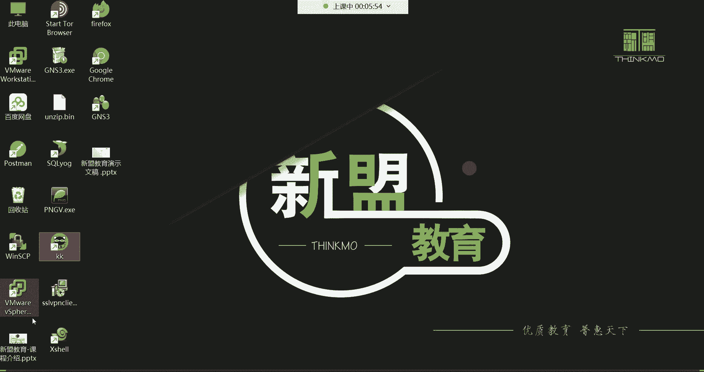

连接一下，啊九零嗯，如果是新进班的同学哈，嗯亮子的哈，就是这个如果是新进班的呢，咱们这个以前讲过的录屏，还有笔记呢都在咱们这边的群公告里边。

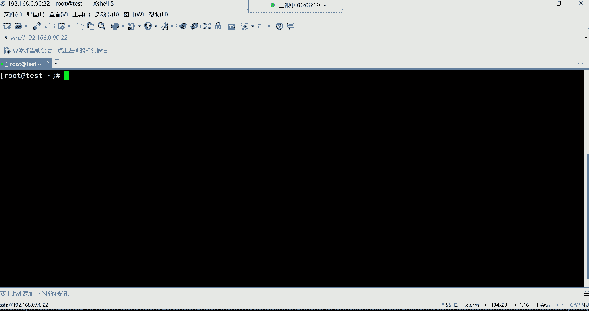

看来给大家说一下哈，我们以前讲过的都在群公告里面，如果是近期就是这两天新进班的同学啊，大家可以先干嘛呢，可以先从群公告，先从这个群公告里面，把我们这个以前讲过的这个录屏呢，先去复习一遍，OK吧。

然后呢包括我们上课用到的笔记软件，看到了吗，也都在这里边，还有没有网络基础的同学，这里面呢也可以去抽空去看一看，网络相关的课程啊，补一补网络方面的知识，OK然后还有咱们的这个学习工具都在哪里呢。

都在我们这个第一个啊置顶的这个群公告，这里边有一个什么呢，有一个VIP的学习大礼包，这里面有镜像，有系统安装教程，网络教程等等等等，然后呢大家可以去怎么说呢。

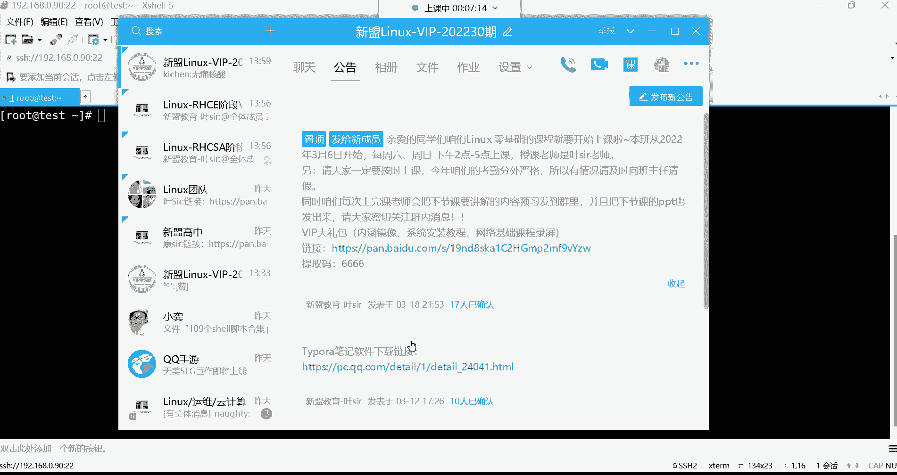

去复习哈，把前面的课程给补一补，时间过得真快是吧没错又一天过去了，再一会儿呢这一个月就过去了，这一晃又到年底了，哼哼好了，那我们来说一说。

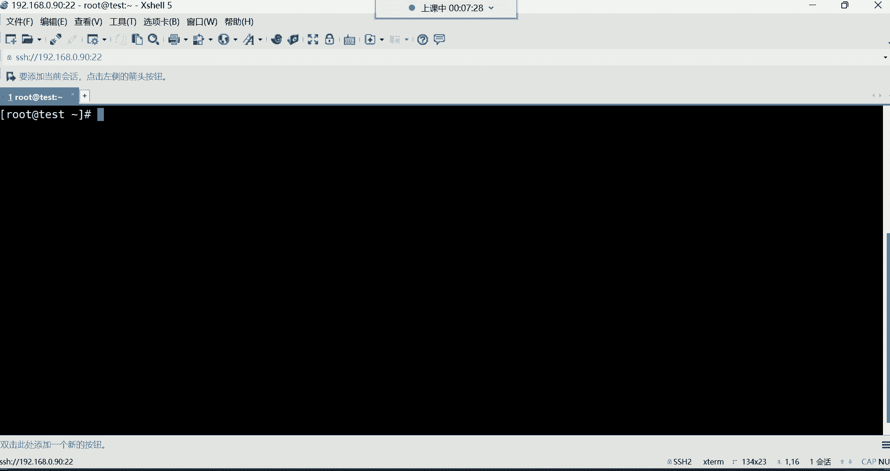

我们今天需要给大家讲解的课程内容，都有哪些呢，我们今天先把这个特殊权限啊，设计四个特殊权限呢先给大家讲一讲啊，然后这四个特殊选项呢，前两个特殊选项呢，大家不需要去太浪费脑细胞去，必须要掌握啊。

然后呢后边这两个呢大家到时候在学的时候呢，是后期我们能够常用的啊，这个是必须要掌握的哈，所以前两个呢，大家可以先作为一个什么一个了解啊，不是必须要掌握的内容哈，我们先来看第一个，当然这也是权限啊。

因为我们昨天是不是一直在给大家讲权限呢，沉默的这条命令啊，一直给大家讲权限怎么去设置权限，以及用户的归属关系等等等等，那这个权限呢，我们昨天给大家讲的叫什么权限呢，我昨天给大家讲的叫做基本权限，注意啊。

这RWX啊，这些呢都属于基本权限啊，但基本权限就是最常用的权限，我们这个根本离不开这个基本权限的，但是呢在基本权限之外也有一些什么呢，特殊的这些权限我们就叫特殊权限，然后一般有一些特殊需求的情况下呢。

哎我们会用到这个特殊权限，然后第一个特殊权限呢叫做set uid，这个特殊权限我们简称叫su id，注意哈就简称叫SU，那这个干什么用的呢，你看他这个set设置的意思，然后U呢是用户的意思。

其实这个全名啊就是我要设置一个优秀的id啊，就是用户的id权限啊，就是一个特殊权限，然后呢它的功能啊，主要看一下对于一个可执行的文件，如果我们用了SU以后，那普通用户在执行该文件以后。

临时拥有文件所有者的身份，该权限只在程序执行过程中，有效程序执行完毕以后恢复原有的身份啊，这句话读了以后呢，你发现跟没读没什么区别是吧，这个到底什么意思啊，也没听过12345来没有感冒啊，没有感冒。

就是这个可能是这个我也不知道为什么，可能就是这沧桑了是吧，这一过了一晚上哈，然后呢，我们说一说这个SUID，它主要的功能干什么用的啊，或者说为什么会有这个权限的存在，首先呢它是对于一个可执行的文件。

去设置的一个特殊权限，然后这个权限一旦设置之后呢，那普通用户呢就可以去什么呢，去执行这个文件了，去执行这个文件哈，那一执行的话，那临时拥有文件所有者的一个身份。

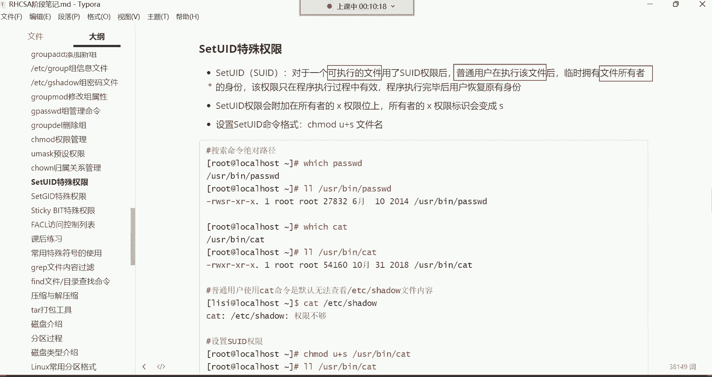

那我先给大家说一说，在这个系统当中，我们就看哪个文件看哪个目录呢，看etc这个目录，看etc这个目录啊，其实你看到吗，其实这个文件啊，在这个系统里边，可以说是99。999%的文件，大部分都是谁的呀。

都是root的啊，包括我们在这个bin这个目录，看到的这些程序文件，看看我们看这些程序文件，看这个闭目录，嗯啊啊这样啊，我们这样还不行，我们直接这样吧，LLLL看user下的be好吧，哎大家可以看一下。

这里面是不是都是程序文件呢，就是说我们用的命令什么VIVIM看到了吗，是不是是不是都是都是在这个目录里边的呀，啊，那其实这些命令的，也都是，最终会有一个文件来给我们提供它的功能的好。

那这个时候你就可以看一看这些文件，它的所有者是谁是谁呀，是root，也就是说这些命令它的拥有者就是超级用户，而有的命令呢就是怎么说呢，你发现它有一个背景颜色，你看到了吗，这种背景颜色黄色的，红色的。

那这些是什么意思啊，唉其实这些就是我们要给大家讲的那个什么呢。

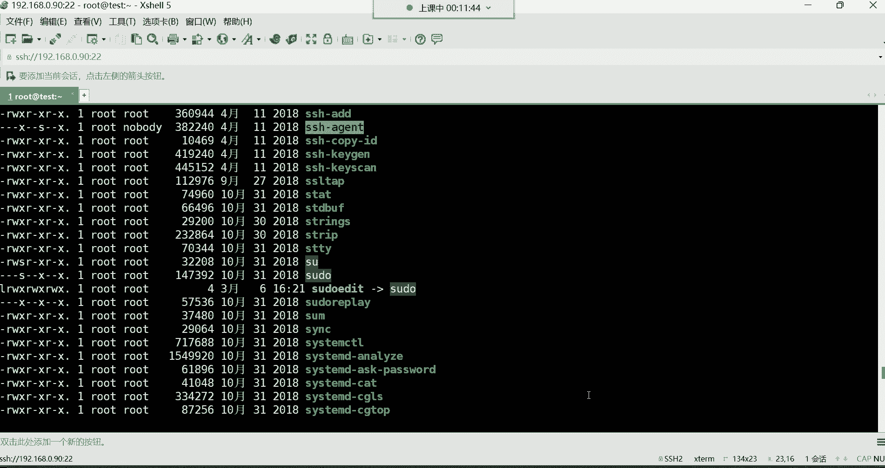

SUID这个特殊权限，特殊权限在系统当中会有一些特殊的颜色啊，告诉我们，然后它主要的功能干什么用的啊，咱们给大家先嗯说哪条命令呢，啊先说这个pass w d这条命令。

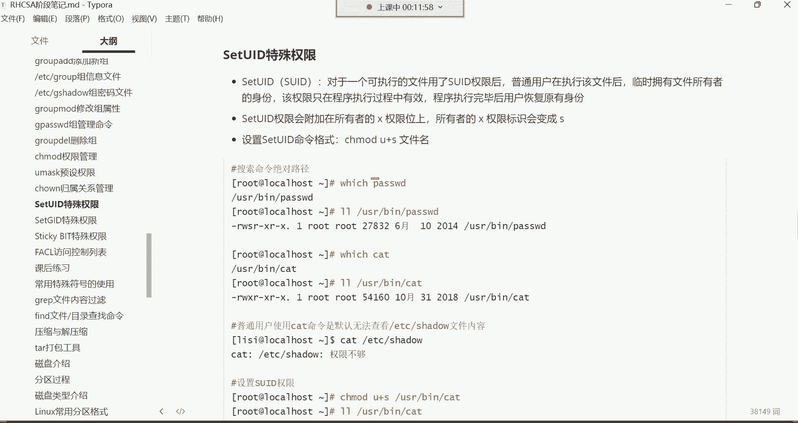

我们用普通用户登录系统，咱们说普通用户可以做什么事情啊，我们用优色一登录系统，密码还啊，我们系统里面有优色一这个用户吗，我看一下哈，IDUS1没有优色一了是吧，id汤姆有汤姆，那我们用汤姆登录系统。

汤姆密码一好。

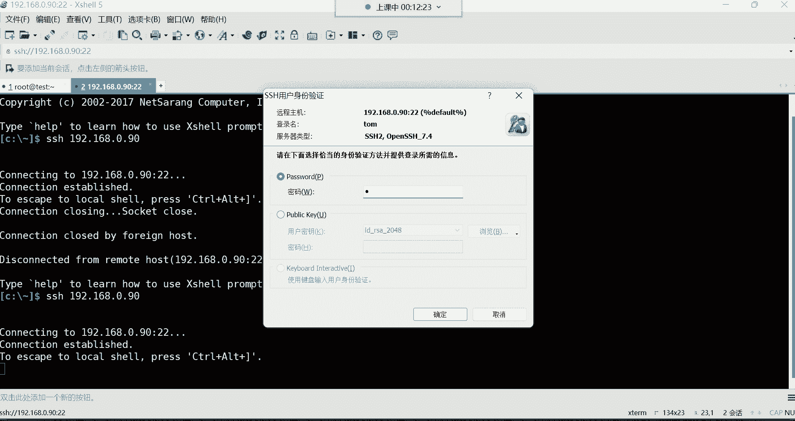

你看tom现在是不是登录系统了呀，那接下来呢咱们讲讲这个SUID。

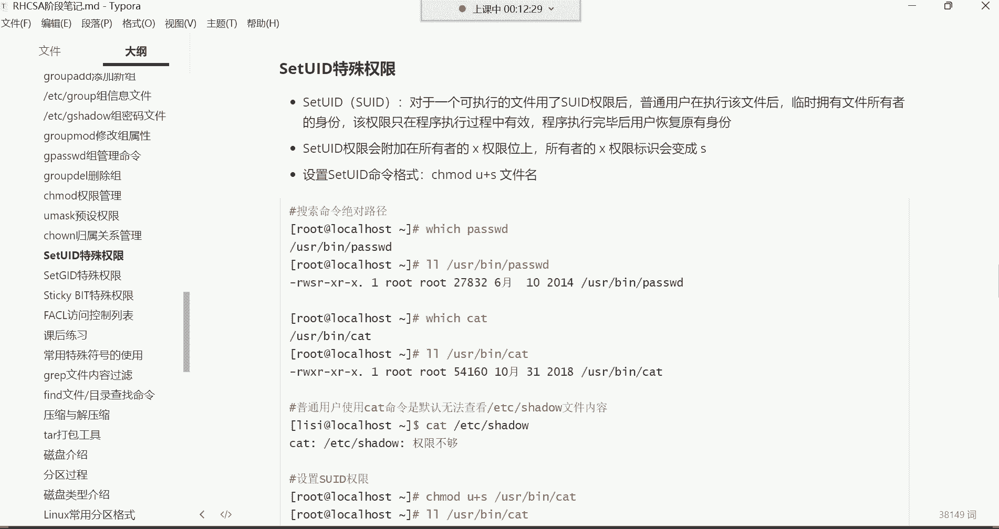

它权限到底应用在哪里啊。

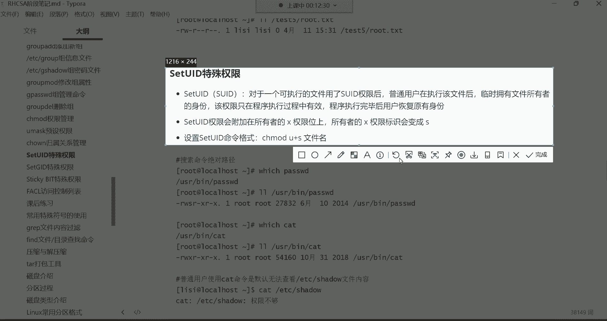

把这个拿过来，好我们来看一下呃，这条命令存在的意义呢，就是普通用户是不是可以使用pass wd，去改自己的密码啊，但是呢他需要知道自己当前的密码是多少，然后才能改新的密码，没错吧。

那为什么普通用户它可以改密码呢，这就是一个非常奇怪的事情，它奇怪在哪里呢，它奇怪在你每次改完密码，其实最终咱们说密码是不是有个文件存放着呢，哪个文件呢，我们上次给大家讲的时候。

是不是说在etc有个shadow这个文件，这个文件里面是不是存放用户的密码的呀，那你说这些普通用户他在使用pass wd这条命令，在改自己密码的时候，最终它的密码，是不是会存放在这个文件里面去啊。

但是奇怪的事情就是，这个文件对于普通用户来讲，它没有写权限，他没有写权限，他怎么能够修改这个文件里边的，那个自己的密码字段呢，因为你要知道他一改密码就等于说改了谁呀，是不是就等于改了这个第二个字段啊。

没错吧，密码这个字段吧，但是你想象一下他对这个文件它没有那个权限，他怎么改，这是不是一个很奇怪的事情啊，所以说奇怪的事情就是因为对于pass wd这条命令，我给你们搜一下，有一条命令叫which。

which这条命令呢是可以搜索什么呢，是可以搜索一个文件的所在位置，什么文件呢，注意啊，是命令是命令所对应的文件，搜这个pass wd这条命令所对应的文件，在USB上有一个命令叫pass wd。

咱们来看看这个文件，首先你看它的颜色，颜色呢是有一个背，注意这是背景的红颜色哈，这是背景的红颜色，然后呢我们再看它的权限位，它的权限位啊，注意看所有者的什么呢，执行权限位哈，注意，多了一个什么呀。

小S正常来讲，你说这个位置是什么呀是吧，X直行哎没错，正常是X啊，因为这是一个什么程序文件呢，他得拥有执行权限，但是你发现为什么变成一小S了呢是吧，这哼有些奇怪，是没错，对SUID啊。

它的权限就会附加在所有者的那个，X直行权限位上面，它会让所有者的那个执行权限就变成小S了，那一旦变成小S，那这个时候普通用户在执行这个pass wd，这个文件的时候，他就临时拥有了文件的所有者的身份。

那这时候你看这文件所有者是谁啊，是root哎，那汤姆他这个时候在使用pass wd的时候，就等于说是谁在使用这条命令呢，root所以他才可以使用这条命令修改自己的密码，听懂了吗，听懂了，给我刷个一。

没听懂的刷杆啊，没听懂的刷杆哈，没关系，啊这个包包的，还是有些同学没有听懂，是不是啊，没关系啊，嗯没关系，没有听懂呢也无所谓，这样这种东西呢对于我们来讲呢，你不需要去深入去研究它。

你可以在课后呢再多听两遍，你就怎么说呢，可能一遍不太好理解啊，下去多听两遍，看录屏的时候，然后你就能够理解我说的含义了，就是对一个执行文件啊，可以让注意啊，你这么去理解，就是正常来讲。

这条命令只有谁可以用，这条命令只有root超级管理员才可以用，但是为什么说普通用户可以改自己的密码，就是因为这条命令被设置了SUD了，你说为什么这条命令只有普，只有超级用户可以用呢。

因为只有超级用户才可以对etc shadow，这个密码文件进行什么呢，增删改查没错吧，你看普通用户，咱们就拿tom来说，tom他对这个文件它有权限吗，它的权限在这呢，它没有任何的权限，他想改密码。

最终你想想那密码，你改密码，密码得保存到一个文件里面，不就存在这个文件里了吗，你改自己的密码，说白了你就等于说修改了这个文件里的内容了，知道吧，你虽然说是通过命令去改的，但是你最终是等于通过命令。

改了这个文件里的内容，但这个文件你发现tom他没权限，他没权限没权限，他怎么改呀，但是你发现他能改，他为什么能改呀，就是因为这条命令啊是pass wd，这条命令汤姆在用的时候，它直接变成谁了呢。

变成root的身份再去干嘛呀，再去改这个文件里的内容呢，所以这就所谓的SUIT，就让普通用户临时拥有文件所有者的身份，如果你再不理解哎，我给你们再举个这个，我们平时的看电视的一个例子。

咱说这古代呢有一个皇帝是吧，这是皇帝哈，这皇帝呢，一般你可以把它列成我们这个系统当中的root，root啊，咱们画一个结构图吧，好吧，咱们画一结构图，不然这事儿啊，我看很多同学不太好理解皇帝，皇上啊。

皇帝K皇上呢，你可以把它理解成我们系统里面的那个谁啊，那个root啊，一点不过分哈，还有什么那个这个那个的哈，咱们就就这样吧，就这样吧哈，这样，皇帝皇帝下边有，咱们就拿这个人来说啊，他是谁呢。

就是那个嗯汤姆啊，就是那个汤姆，这个这个例子呀不太好举，这个例子确实不太好举，OK然后那下面呢就是一些小老百姓了，一个一个的小老百姓嗯，这小老百姓呢一般他看见大臣的时候，他一般不下跪，没错吧，小老百姓。

他不跪，他一般看到谁的时候他下跪呢，看到皇上的时候他下跪，是不是啊，哎那这个SUID你把它理解成是什么呢，这个SUID你可以把它理解成皇上，一个圣旨啊，或者说尚方宝剑啊，这是一个圣旨哈，圣旨。

这这是一奏圣旨啊，这个设置，你可以把它理解成那个就是SUD权限，SUID这个权限，OK这个权限是什么意思呢，你现在拿着圣旨就等于什么呢，拥有了我的身份了，知道吧，直接就对着这个小老百姓在读的时候。

那你想想这小老百姓，是不是就等于皇帝亲临一样啊，但是你说他是皇帝吗，他不是他是谁呀，他是汤姆，他是普通用户，他不是root，但是呢由于那皇帝希望他什么呢，拥有我的权限，不是不是啊，那这时候怎么办呢。

这时候我就赋予你一个权限，唉，我复印一个权限哈，那这时候你在执行的时候，是不是就临时变成了我的身份了呀，啊注意这是临时的哈，你要明白这个他这个你看这句话，它是普通用户在执行这个文件的时候。

你就等于普通用户在执行这个圣旨的时候，他是临时拥有文件所有者入他的身份啊，临时拥有皇帝的身份，但是这个你执意执行完毕以后呢，是不是就恢复到自己原有的身份了呀，啊回到自己原有身份了哈。

那恢复到自己原有身份的话，嗯不就又恢复到普通身份了吗，是不是，那这个例子，如果放到我们这个SUD里面来理解的话，那就是说这个汤姆汤姆他想干嘛呀，他想改密码诶，他想改自己的密码，他想改自己密码呢。

他没那个权限，那咋办，哎，root呢，我可以允许你改密码，使用这条命令啊，但是正常来讲呢，你说你还没没有办法对这个文件啊，具备一个写，没关系是吧，我给你设置一个SUID，这样呢你在用这个命令的时候。

就等于说是我root亲自在使用这条命令，再去帮你去改密码对吧，嗯就这意思哈行了，这个不能再解释太多了哈，然后对这个SUID这个选项呢，我们一般用不到，一般我们是用不到的哈，但是呢你如果一旦发现。

比如说我们看B下边，你一旦看到，比如说像这些命令，一旦有个背景的红颜色，看看一旦有个背景红颜色，就证明这些命令，普通用户在用的时候都是什么呀，都是临时变成了root，超级管理员的身份去执行这些命令。

看到了吗，就这些啊，一旦拥有这个背景的红颜色的，然后你说我们可不可以设置呢，比如说我现在咱们就拿这个我们取消掉哈，cat来说cat tom在使用cat的时候，那是以汤姆的身份在执行这条命令，注意哈。

tom是个普通用户，他使用cat想看这个文件，那他对这个文件呢没有任何权限啊，所以这个时候怎么办呢，啊，这个时候，如果我希望普通用户在使用cat这条命令的时候，也可以变成什么呢。

这个文件的所有者文件所有者是谁呀，你看看cat我们维持一下，当然我们得用root去wish哈，which cat好，cat这条命令所对应的文件是在这个位置，然后咱们看一下哦，哦等一下啊，等一下看到了吗。

你看到了吗，这个cat呢，首先这个程序文件是属于root用户的，没错吧，但是普通用户呢也可以用，也可以执行它，因为普通用户也需要使用这条命令去看文件呢，但是普通用户，如果汤姆使用这条命令去看文件的话。

那它就是汤姆的权限能理解吧，所以汤姆呢他想看一些自己无法查看的，这些文件，他就看不了，那如果你希望所有的普通用户都可以使用cat，就等于是root在使用的话，那这时候你就这样称之mode命令都一样啊。

都是设置权限的命令，然后呢就U加小S后面跟上文件名，哪个文件名是user，并且的cat，这时候你再来看一下好，是不是多了一个背景的红颜色呀，那你看多了一个背景，红颜色主要看它的执行权限。

你发现变成一个小S了是吧，变成小S了吧，一旦变成小S，那这时候汤姆再使用cat命令诶，我问一下你们他现在能不能看这个文件的内容，能不能觉得能的来给我刷个一，觉得不能的给我刷，能了是吧，OK那能了之后呢。

咱们看一下哎这就没有任何问题了，为什么呀，因为TT这条命令现在普通用户在使用的时候，它也不是以普通用户的身份去执行了，是以谁呢，是以root超级管理员的身份在执行了，对有圣旨了，有圣旨了哈。

就现在你把cat就比喻成是一把尚方宝剑了是吧，谁拿着这把尚方宝剑去执行，就等于是皇帝在什么呢，皇帝麒麟就等于皇帝在执行，知道吧，就等于我现在要赋予KAT这条命令，一个上方宝剑啊。

当然这只针对于那些可以执行的文件哈，啊是可执行的文件，对懂了是吧，对就是cat命令，我想让普通用户去使用，但是让普通用户可以什么，可以拥有我超级用户的身份，那我就给你赋予到圣旨啊，他有了圣旨以后。

普通用户拿着这个就在使用这条命令的时候，就等于说是拥有圣旨哈，是这个意思哈，拥有圣旨好了啊，但是呢不能瞎设置啊，我们就拿什么来说，我们就拿这个VIM来说啊，你看我们正常来讲这个VIM啊，我们维持一下。

which这个VIM在user并向VM是吧，我们来看这个VIM哈哈这个vi啊，这个权限如果不去掉是对，一直能用哈，一直能用，我们来看这个VMVM，正常来讲呢，也没有这个被设置SUID这个权限是吧。

好就是一个绿色的程序文件啊，那这时候呢如果你也想给他设置一下，也可以让普通用户通过VM可以什么呢，拥有root的身份的话，那这时候你就趁着mod就U加S好，这时候我们再来看它。

你发现是不是多了一个小S啊，好，那VM现在普通用户在用的时候也有圣旨了啊，我现在就给VNM命令给它赋予了一个圣旨，好，那这时候普通用户在用的时候，就等于说我拥有圣旨的权限了。

拥有拥有这个root的身份了，那这个时候怎么办呢，这时候普通用户就可以干一件事情，打开etc的pass wt文件，这个时候你看正常来讲，他对这个文件，你看他自己的权限哈。

etc的pass w d正常来讲，他对这个文件是不是R只读权限的，看看不是临时的永久的哈，他是不是只读权限好，但是他现在想改，想改这个文件，因为他什么呢，因为他现在在使用vim的时候。

就等于说是root在使用这条命令，因为这条命令现在有圣旨了，然后啊对普通用户使用VM10，拥有root用户的权限是对所有对没错，是所有文件哈，VM这条命令现在谁使用就等于是root在用，甭管谁用哈。

注意哈，甭管谁用VM，现在都是等于root在执行，知道吧，那root打开这个文件以后，是不是诶，那想干嘛不就干嘛，不就是汤姆是吧，我做一个操作什么操作呢，我删一删哈哈，删一删删什么呢。

就把自己的这个UID给它删一删啊，让它变成零好，那一旦变成零，这时候我们WQ保存退出啊，你看这时候他说什么read only是吧，只读文件没关系啊，加一个叹号，WQ叹号诶，写入成功，看这个文件内容好。

自己的UID秒变成零了，是不是啊，好免费，你说这改这东西有什么用啊，是吧好是没什么用，但是我现在给你们退出系统，注意哈，看我现在是汤姆退出系统了，好，我再登录，但是你们看看我现在输入的用户名是谁呢。

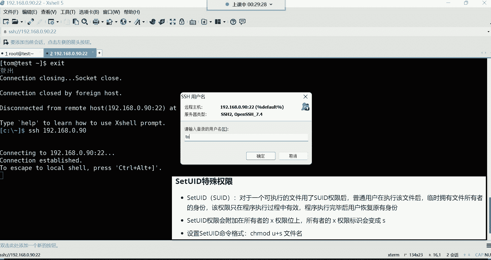

我现在输入的用户名是汤姆，注意哈，是不是汤姆看啊。

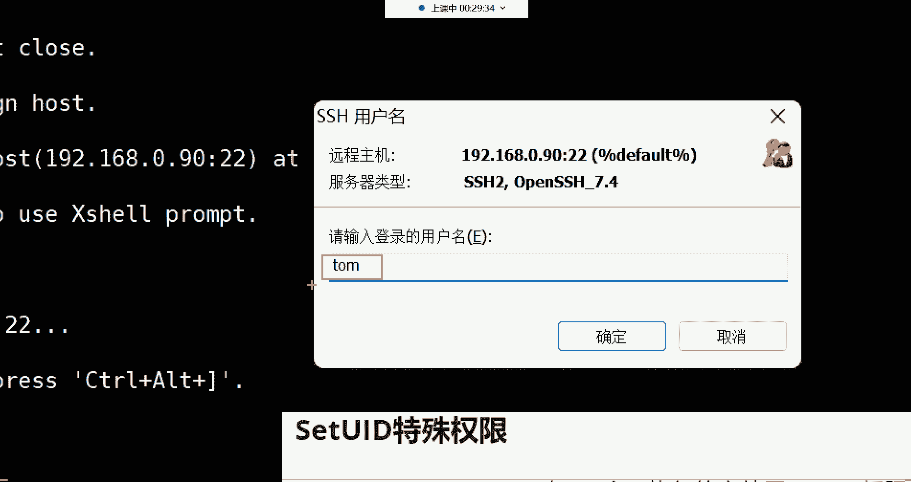

看清楚用户名是汤姆，好，确定密码，tom的密码一确定好，你们看这是还是汤姆吗，你们看这还是汤姆吗，你们看这还是汤姆吗，你发现我说嘿嘿嘿，这又是什么呀，造反了是不是造反了哈对这就属于造反了哈。

就是我们说汤姆直接变成root了，看到了吧，就这效果哈，所以说对于SUID，你说你能瞎，这你能瞎设置吗，你不能瞎设置，你如果一旦下车，这系统还怎么管理啊，是不是啊，啊root不能改成别的名字。

不能不能哈，不能这是系统的一个机制好，然后呢这个大家知道就行了，怎么取消呢，称之mod叫U减S，注意U减S就把他的这个SUID给它去除了，能理解吧，还有那个cat也一样，你说那个cat我也想给它去除掉。

那就U减STT，然后你再看一下啊，这就去除了，OK那个test如何修改的呀，哪个test，哪个test的呀，嗯我们没有改太子啊，名字吗，是主机名吗，啊主机名前面在学习这个修改主机名的时候。

我们就已经改了哈，就已经改了，用host name这条命令，His host name control，然后set host name，set杠host name，嗯后面跟上一个主机名。

让他叫test就可以了啊，这是，这种话，行了哈，那这个时候呢你还得干嘛，你还得去把那个他的那个什么呢，UID给他改回来哈，把这个汤汤姆的UID再给他改回来，这哈是腰001保存退出啊。

这时候呢汤姆再退出系统，再登录的话，汤姆看还是汤姆，然后密码OKOK这就可以了哈，就可以了，又回到自己的普通的身份了，嗯后面会讲给特定用户加一些使用命令吧，呃后面会有会会有一个提前的机制哈。

给普通用户提权的，嗯所以这这个呢大家知道一下，就这个SUI它主要应用场景，那su id不要针对于普通文件去设置，没什么用啊，你比如我建一个文件，比如咱就拿这hello这个文件来讲。

你说我给他设一个SUD行吗，U加s hello，点TT也行也行啊，看到吗，是不是也变红了呀，但是这就是普通文件，不是什么程序，你也不需要去执行它，所以加也没用，能理解吧，但是加完以后呢。

你发现这种东西诶变成什么样，变成大S了，是不是啊，这是小S她姐姐变大了，是不是啊，嗯小S她姐姐了，为啥变成大S了是吧，为啥呢，能用到哪里，没没啥用哈，普通文件哈没什么用，它是怎么回事呢，长大了是吧。

嗯就是因为他没有执行权限，我给你们去除，你们再看哈，U减S，你看这个文件，这个文件它本身是没有那个X执行权限的，所以说呢你一旦说设置SUD，他是不是就把所有者的那个X权限，就给你盖上了呀。

所以你没有办法判断，这个文件到底有没有执行权限，所以他用小S跟大S就来告诉你，如果有执行权限，就是小S，如果没有执行权限，就是大S是这么回事，但是对于普通文件我们没有必要设置哈。

普通文件就不能让你执行你，普通文件你就不需要执行它，是不是又不需要让它给你带来功能，所以这也没有必要设置哈，没有标设置。

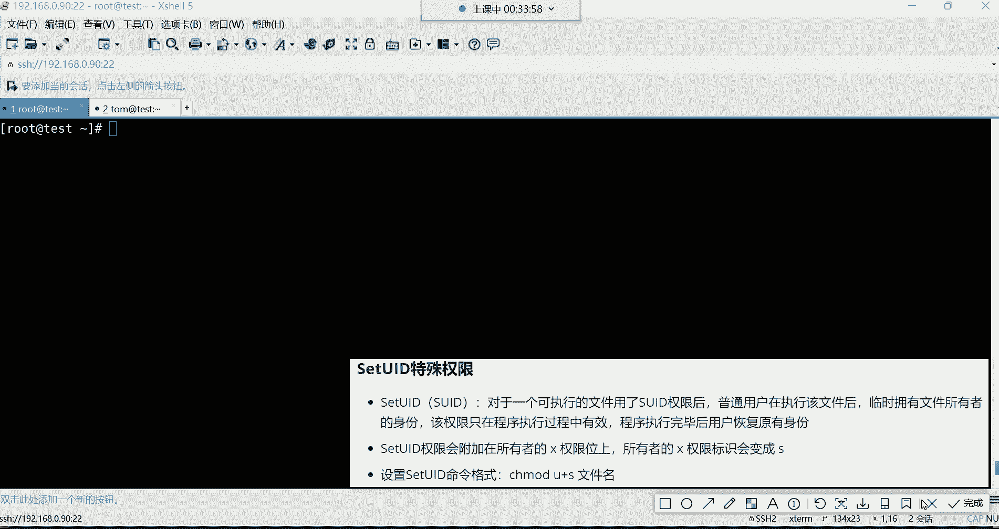

对这大S不是那个什么了吗，不是跟汪小菲最近不是离婚了吗，是吧好，然后这是su id哈，然后做一个简单小总结，主要是针对于可执行的文件，如果我们给他设置一个SUID，就是给它赋予一道什么呢圣旨。

那普通用户在使用这个文件的时候就会干嘛，临时拥有root的身份啊，因为所有的文件都是root的，而这个什么呢，而这个权限只在程序过程中执行，有效程序执行完毕以后呢，好就圣旨一旦执行完了。

这个又恢复到自己的身份了，你不能一直变成皇上，是不是，OK然后呢设置的命令呢，我们前面已经讲过了，就是乘着mod这些命令，OK然后下面呢我们再来说这个，当然这个大家我们平时不需要去设置什么。

S u i d，你知道一下就行哈，用不上我们没有这个需求，一般就是系统，他自己呢会给一些程序文件去设置这些，你知道一下就行，而第二个这个sg id啊，这个呢怎么去看呢，一个是UID是吧。

U代表user用户的意思，G呢就是group组的意思啊，所以说这个呢是针对于组去设置的，但都是针对一些可执行的程序文件，你也是给他设置一个什么呢，SGD以后，那普通用户在执行这个文件的时候。

临时拥有其所属组的权限，这是针对于组的，针对于组哈，然后都是在执行过程中有效执行完毕以后呢，就失效了，恢复到自己的身份了，注意哈，前边是让那些普通用户能够变成谁啊，变成root。

这个呢是能够让这些普通用户变成谁呀，变成我这个文件的组内成员，注意哈，前边是变成文件的所有者root，而这个是针对于什么呢，组可以让他临时拥有其组的权限，你怎么样才能拥有组的选项呢。

就是你变成我组里的成员，你才能继承我组内的权限是吧，没错吧，诶你得变成我组里的成员，你才能继承我的权限。

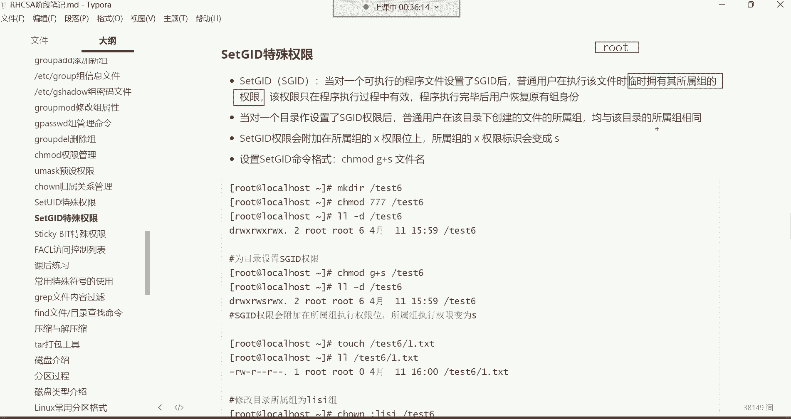

我们昨天讲权限的时候，怎么样才能让一个用户继承组的权限，我们昨天是不是说了，我们CD到根一下的探测目录，这里面这个文件怎么说，这个我们是不是在讲组管理的时候，可以把一个文件的组改成某一个组。

比如说我给它改成，我们就称之owner，给它改成这个嗯，运维组好，运维组对，Hello，这个文件改好以后呢，你再看这个文件，那这个运维组的成员，对这个文件是不是就继承了我这个组的权限呢，没错吧。

那这时候你还可以不希望其他人有权限的话，你乘着mod，你就O等于杠杠杠好，那这时候哈哈，只要在我这个组里面的用户，就全可以继承我的组里的权限，没有在我组里的用户，你也不是文件所有者的话。

你的权限就什么都没有，是不是就在这个框里面吗，那这时候我们就可以干嘛啊，就可以让一个正常情况下，它不是我组里成员的一个用户，可以临时变成我组里的成员，注意哈叫临时，而这个临时是什么临时呢。

就是当他想执行这个文件的时候，我可以让他临时变成我组里的成员，继承我组对这个文件的权限，听懂了吗，听懂的给我刷个一，听懂了，啊没听懂的是二，好，那接下来呢，咱们说为什么也会有这样一个权限存在是吧。

这个有一条命令在这个系统当中，但是这个命令我不知道我们这样安装有没有哈，呃叫做lcat lcat meeting，然后你跟上一个路径跟一个文件啊，没有找到命令啊，这个有些尴尬哈，没有找到命令。

我搜索一下哈，嗯我按一个包啊，叫m cat，因为没有找到命令，我们要把这个包给他安上，然后大家也是哈，你先把这个包给他安上啊，先安上我们啊哈加一个install，把这条命令的执行一下。

如果你们也没有的话，就安装这么一个包哈，只能执行一次，还是退出或者重启之后，是不是就是你想执行什么时候执行都行啊，什么时候什么时候执行都可以哈，我们把这个包给它安装上啊，安装上安装上以后呢。

这时候就有一条叫low cat命令了，LOCAT后面呢你跟上，比如我想在etc下面搜一个文件，这个文件名叫什么呢，比如叫pass w d回车，啊没有这个数据库文件啊，没有这个数据库文件。

哎呦这波操作哎呦。

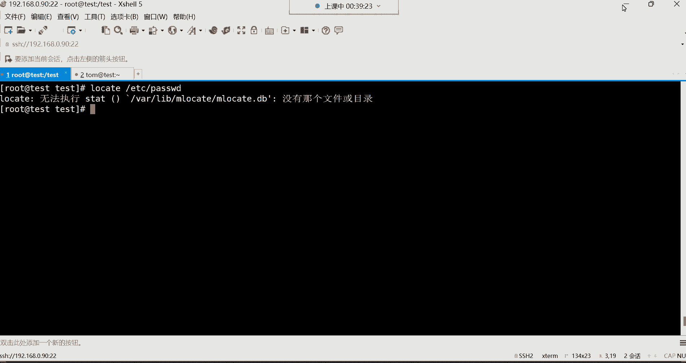

我得去好久的事情了，我得去百度搜一搜哈。

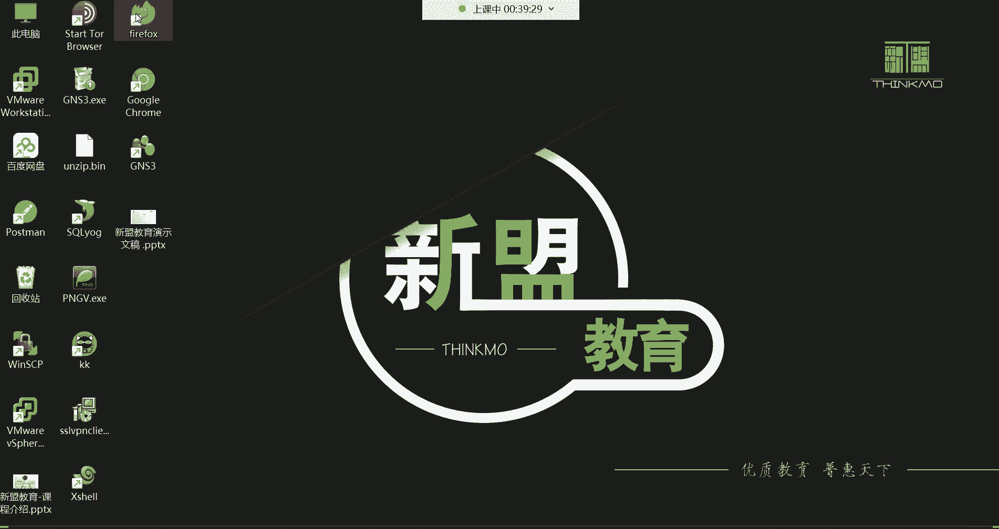

我得去搜一搜，这个这个问题好像是得需要刷新一下。

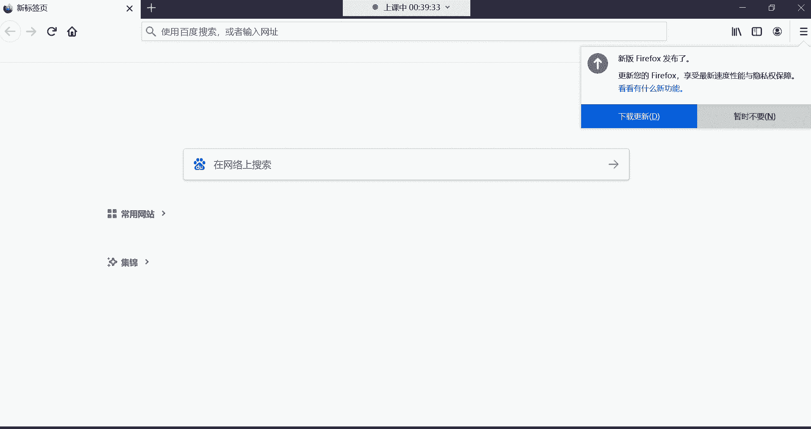

但具体的命令我记不住了，我看这个提示哈。

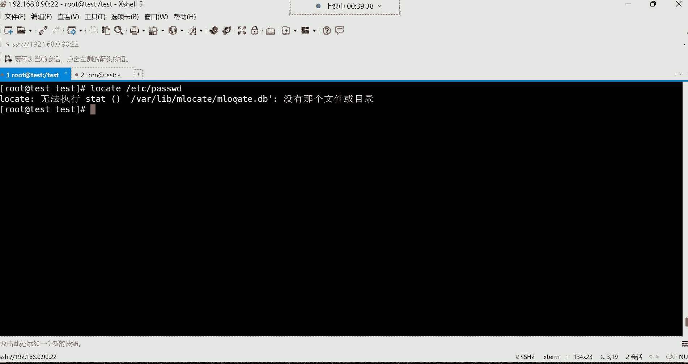

裸开的dB没有这个文件嗯，搜一下哈，没有，这是一个数据库文件，找不到啊，我看一下这个问题哈，这呃呃update dB，我看一下啊，看update update dB回车。

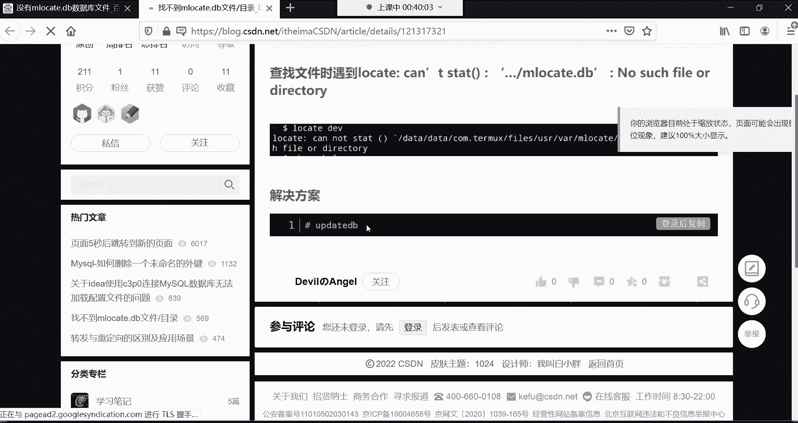

OK然后再试一下哈，好有了有了哈好久了。

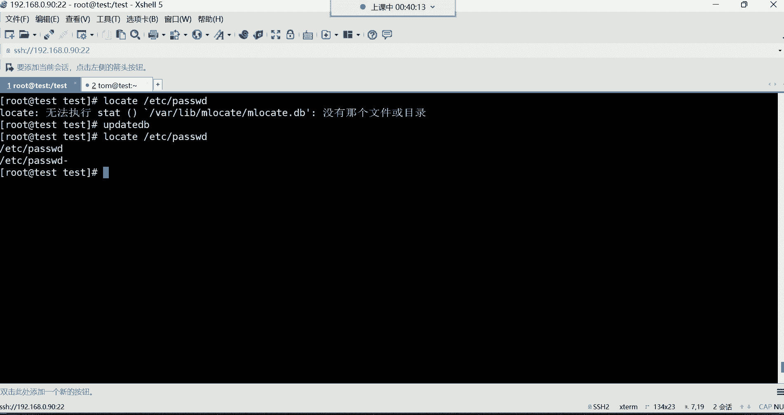

这条命令我已经可能是好几年啊，都没有用这条命令了啊。

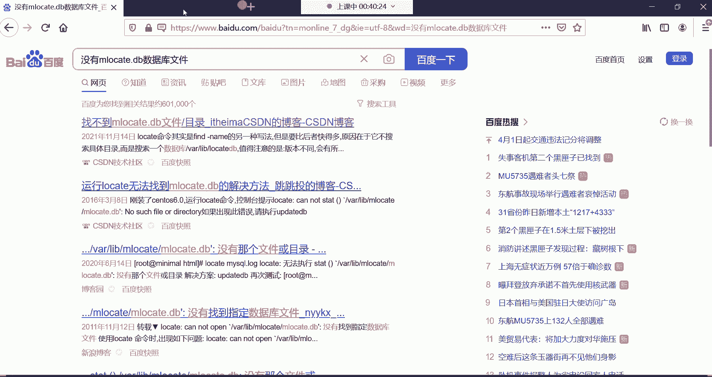

关掉关掉，然后我们主要是给大家讲讲LOK的这条命令啊，百度真是个好东西是吧，百度你一般简单的东西你还可以搜出来，好咱们接下来来说哈，这条命令的普通用户也可以用locate，它也可以搜。

我想在etc下面搜个，比如说文件叫fs table的，可不可以，有没有有看到吗，就是做文件搜索的一条命令，然后呢他这个就跟什么跟泛的find命令差不多，find的也一样，放的也是从这个系统中帮系。

从系统当中帮我们去搜索文件用的，然后呢嗯本质是一样的，只不过这个LCAT这条命令啊，它会从一个数据库文件，哪个文件呢，就刚刚我们说没有找到这个数据库文件，大家可以看一下。

我们看一下VT的lib m l cat这个文件，你看这个数据库文件它有一个特点，什么特点呢，对于权限这个位置，其他人啊，其他人呢你看到了吗，其他人是没有查看权限的，没有查看权限，而我刚刚使用LK。

他命令的时候，你看到了吗，我在etc下面去搜索这个文件，他说没有那个文件或目录，为什么他需要这个文件呢，因为这就是一个数据库文件，这个数据库库文件里面记录了，我们当前系统里面的文件的所在位置。

然后可以用locate这条命令，跑到这个数据库文件里面去搜索啊，去搜索哈去搜索，然后他搜索的话呢，由于我们是刚刚安装啊，所以说呢可能是数据库文件没有更新，然后我们自己手动更新了一下，但没关系哈。

我们现在不说root，我们现在就说为什么tom也可以使用这条命令啊，为什么tom也可以啊，而且tom搜的时候他也是从这个文件里面去搜的，也是从这个数据库文件里面去搜的哈。

但是tom他对这个文件没有查看的权限，他没有查看的权限，它就无法搜索，他无法搜索，无法搜索啊，那怎么办呢，啊你那里没有update，没有update dB是吧，你前面那个包安了吗，这包哈，这包安了吗。

这包得安一下，不安不行啊，这个包，所以问题就出在这个LOK的这条命令，大家看一下，我们搜索一下哈，维持一下LOCAT在这，好我们看颜色，看到颜色了吗，黄颜色的，黄色的背景刚刚是红色的，这是黄色的。

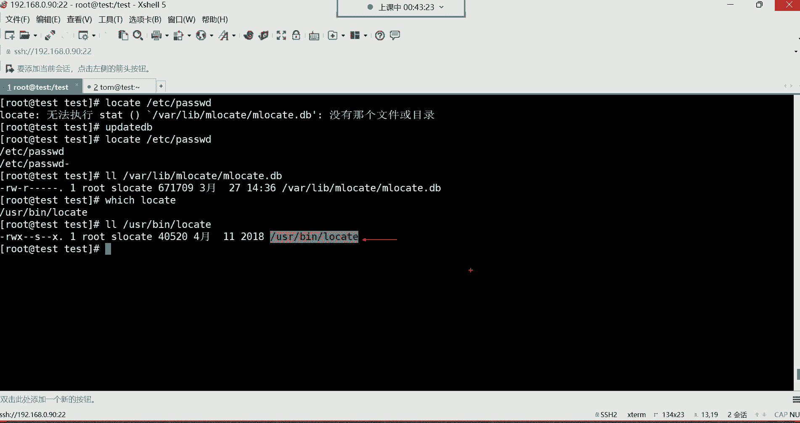

黄色就代表说这个文件拥有什么权限呢，sg id这个特殊权限。

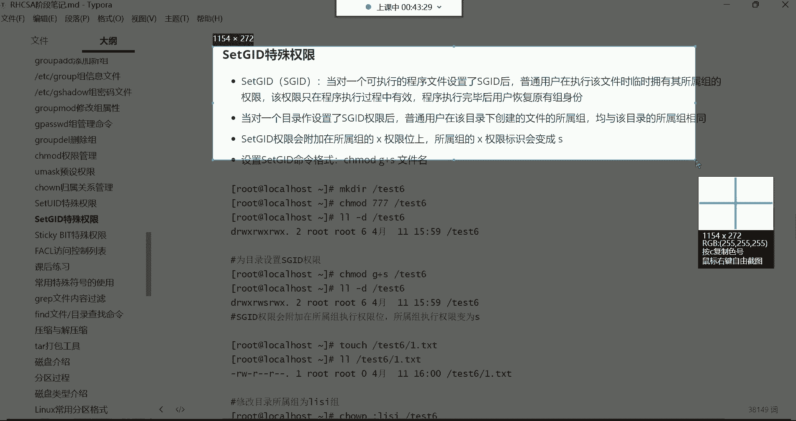

sg id哈用这个权限，而这个权限呢就是针对于这个什么呢，针对于组啊所属组去设置一个权限嗯，滑板甲是吧，嗯哼啊，这时候看看汤姆它在使用这条命令的时候，汤姆在使用这条命令的时候，然后呢他直接变成谁了呢。

直接变成组里的成员了，注意哈，你看就是普通用户在执行该文件时，临时拥有其所属组的权限，你怎么才能拥有这个词组组的权限呢，就是你直接变成我组里的成员就可以了，我让你变成我组里的成员。

你是不是就继承我的权限了呀，没错，OK然后那你一旦变成这个组的成员了，那这个时候你看这个数据库文件，它也是属于叫S楼开的组，你发现都在同一个组里面，而且在我组里边的成员的权限是什么权限呢。

R杠杠首先可以读啊，可以读，所以汤姆才可以使用这个LOCAT这条命令，去搜索谁呢，搜索一个文件的所在位置，并且是从这个数据库里面去搜索啊，这一个数据库文件去搜索，能理解吗啊这就是让用户变成我组里的成员。

可以继承我组对某些文件的权限啊，其实这就是S接力，但是对于我们来讲，这种东西呢我们几乎我们自己是不会用的哈，你知道现在行跟SUID一样，我们自己不会用，然后呢他也会。

那SJD的权限会附加在所有组的执行权限位，看这看到了吗，这条命令哈，这条命令它的执行权限位，你看正常来讲不是RWX吗，但是呢他没有读物，也没有写，就一个小S，但是这里面还有一个执行哈。

有一个执行只不过被挡住了，OK然后所属组的X标识会变成小S，那就证明它是有一个SJID的啊，对于我们来讲没什么太大意义哈，我们不会去设置，知道一下就行，了解一下它的功能就行了。

要让一个用户可以临时变成我组里的成员，继承我组对某些文件的权限啊，这就是SJID怎么设置呢，称之mode g加S，但我们一般用不上这种操作啊，这用不到用不到哈，我们用不到这种操作用不到。

所以了解一下就行。

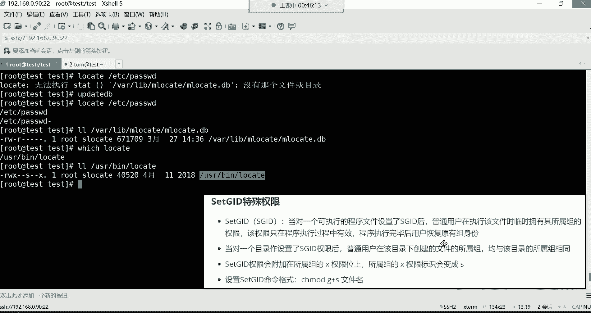

这种东西啊没有什么太多可讲的，那个黄色背景就是SGD，黄色背景就是SJID，红色背景就是SUID这两个特殊权限，一个是这是这这是红的，然后这个呢这是黄的，这是黄的哈，一个红的，一个黄的，JD是黄的。

呃文件你只有WX没有R能不能读呢，不能没有，OK然后我们再来说这个sticky bt啊，啊有黄色和红色背景，就是谁都能看呗，黄色呃不是谁都能看，是谁都能执行，谁都能执行，不是谁都能看哈，谁都可以用。

主要是让普通用户可以进行一个什么呢，类似于提权的这么一种机制，你用的时候呢，你就等于说这个权限变大了，就这意思好，然后接下来呢我们再来说说一个STEAKYBIT，我们简称叫SBIT。

这个的话呢还蛮有用的哈，该权限只针对目录有效，而上面这两个呢都是针对于程序文件的，这个是针对目录的啊，针对目录干什么用呢，我们读一遍哈，你看当普通用户对一个目录拥有读写，执行的权限的时候。

普通用户可以在此目录下拥有增删改的权限，为什么呀。

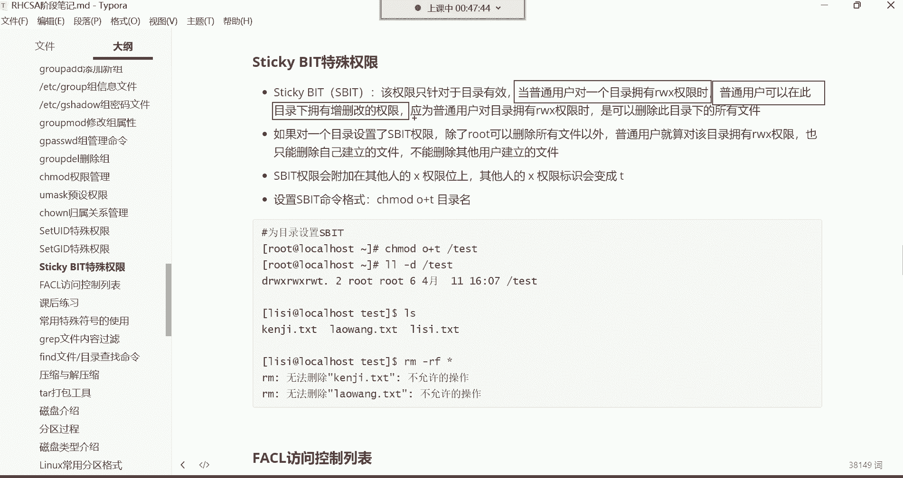

这昨天已经讲过了，你给一个普通，你给一个目录，咱们就拿了一个什么呢，咱们就拿了一个test目录来说，我们LLOL看根下的test目录，我们来看一下这个哈，我们如果说把这个test目录的权限称之mod。

给它改成777好，那以后这个目录是不是谁都可以，在这个目录里边去干嘛了呀，去进行增删改查了呀，啊主要是增删改，想删就删了，是不是想删就删，没错吧，这个tom想删除老王的文件RM杠RF。

老王是不是该删就删的，管谁的呢，创建也可以创建一个tom5点TT是吧，然后我们看看还有哪些用户，啊我们就不用拿太多用户演示了，我id下有还有一个老王，我记得啊，L老王有，咱们用老王登录系统，老王密码。

然后老王的CD到这个test目录进来以后呢，他也创建一个文件叫老王点TT，建好了，你看那老王他现在这文件是他自己的，是不是老王点TT是他自己的，然后这是文件是tom键的。

那老王现在能把tom的文件也给他删掉。

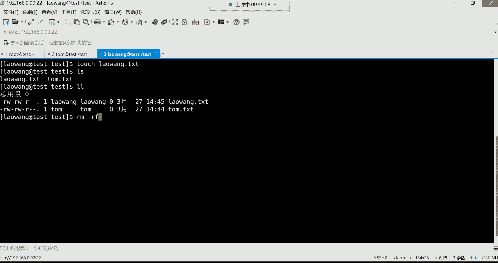

你看是不是删了，是不是没了，为什么能删呢，就是因为啊他们普通，因为普通用户对目录，一旦具备RWS权限的时候，是可以删除目录下所有的文件的，包括root的，他都可以删，这我们昨天也给大家演示了。

讲权限的时候就是可以删。

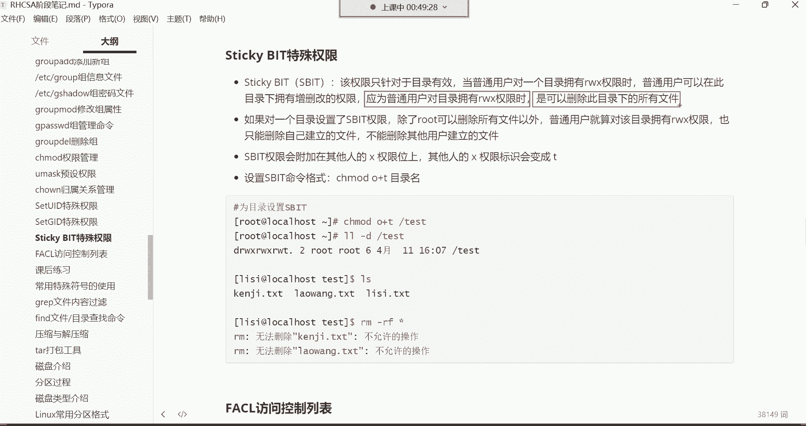

那怎么办，那有的时候我们希望这一个目录，你看我们就拿哪个目录来讲呢，我们来看根下的有一个目录，有个叫TMP这个目录TMP，你看TMP目录它跟别的目录不太一样，你看它的颜色是什么颜色啊。

这些颜色呢没有背景颜色是吧，名字是蓝色的，而这个呢除了名字蓝色以外，还有一个背景的深绿色，是不是深绿色吧，知道这深绿色是代表什么意思吗，这个深绿色就代表这个目录的权限有些大。

你看这个是不是也有一个背景的深绿色呀，是不是也是深绿色，他们两个一样哈，都是深绿色，就是证明什么呢，就证明这个目录啊拥有这个W写权限，注意哈，用W选项test也一样，你看test目录用W写权限。

一旦用W写权限，就证明，普通用户就可以在这个目录下进行什么呢，增删改的操作，谁的文件都可以删了，知道吧，所以系统呢给你这么一个背景颜色提示你一下，就是这个目录啊，这个权限有些太大。

普通用户呢也可以进行增删改啊，所以才会有这么一个背景颜色的TLP也一样，那你看对于TP来讲，你看如果老王进到TP，你看这里面是不是有个HELLU43的，这文件谁的呀，HELLU色三啊。

这个已经不知道谁了，那个用户被我给删了是吧，US3被我们给删了是吧，OK那他给他删掉，看可不可以，你看不允许操作，老王不能删，那不对呀，那不对劲，怎么不对劲呢，权限不对，你看阿拉杠DTMP。

老王对这个目录是拥有W权限的，拥有W权限，那这W写权限呢，那他可以创建文件吗，老王点TT哎，可以你看它可以创建是吧，难道不可以删吗，老王点贴贴诶，可以删呢，是不是把自己的文件也给删了呀。

但是他想删别人的呢，唉你发现不允许的操作是吧，不行这为什么呀，呵呵就是因为这个这个什么呢，这个目录的权限有些特殊，有一个T权限，这多个T看到了吗，多了一个T哈，这T权限就是限制什么呀。

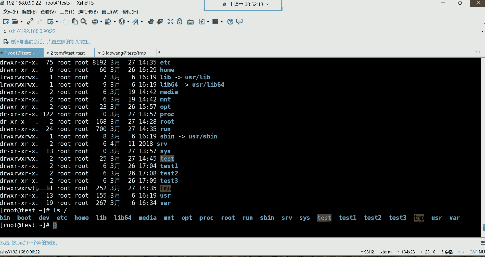

限制的这些用户读一遍，如果对一个目录设置了这个SBIT，我们简称叫T权限，那除了root可以删除这个目录所有的文件以外，普通用户就算对这个目录具备一个完全的权限，它也只能删除自己建立的文件。

不能删除其他用户的文件，也就是说我可以限制你在这个目录。

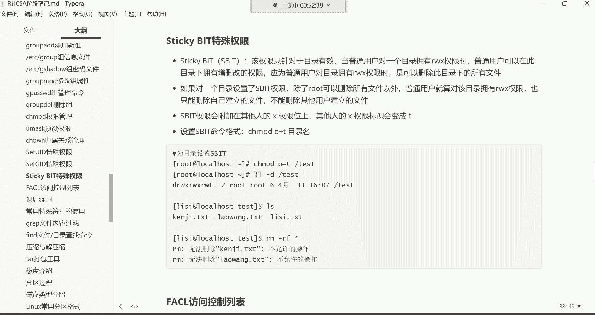

对自己的文件你想干嘛就干嘛，但是别的文件你是不能动的，虽然说我对这个目录的权限，我给了一个完全的权限，不是不是只有TNP可以删，而什么呢，而是对这个目录的权限哪有什么top可以删的，没有什么TLP。

没有什么TMP对于这个目录的权限哈，普通用户是可以在这里面创建修改删除的，但它只能针对自己的文件，只能针对自己的文件哈，你就比如说咱们拿这个test目录，拿这个目录来说，正常来讲，如果说你不加T权限。

汤姆在这里边看汤姆建文件，汤姆点TT老王说删就删呢，是不是RM杠2F汤姆说删就删，是那汤姆一看诶，你把我文件删了是吧，而且你没事还总上我家串门去好，我也删你好，在以后这怎么管理啊，是不是没法管理。

没错吧，这怎么管理啊，是不是，所以我们就针对这种目录权限给的比较放肆啊，你说的意思就是普通用户把TMP文件夹删不了，删不了删不了删不了，因为你如果想删TMP，你得看什么呀，怎么你想删TMP目录。

你得看TMP在哪个目录下边，TMP在根目录呢，在根目录下边是不是有一个TMP，啊有一个TMP，那你说你想删TMP，你是不是得看看你对这个根目录有没有，那个什么呀，W权限呢，没错吧。

如果你对根目录没有W权限，你怎么可能删这个目录下的内容呢，啊那这个时候嗯你怎么办。

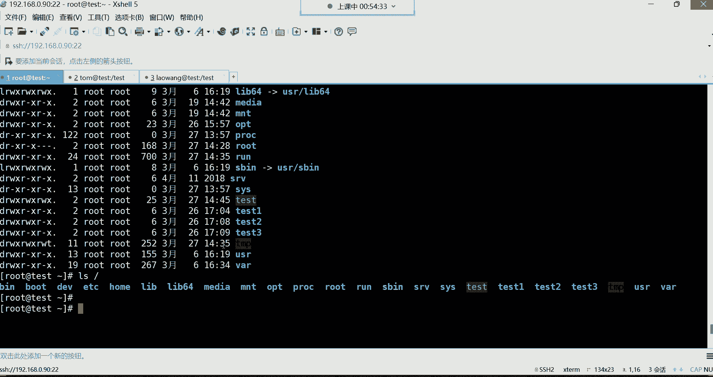

我们就直接这样给他设置这个T权限就可以了，针对这种情况哈。

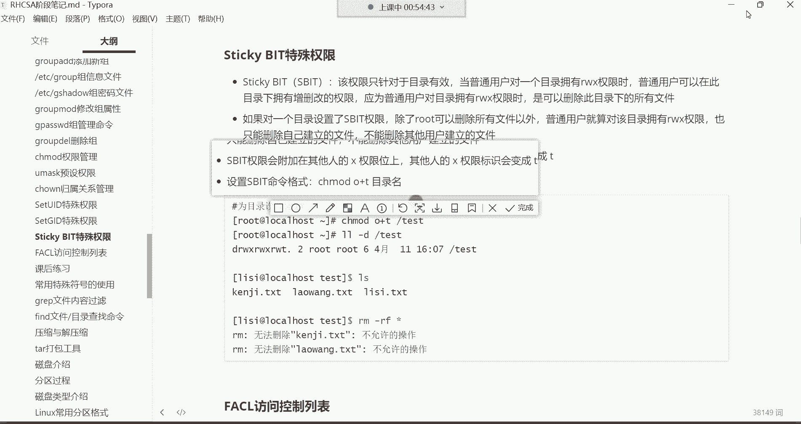

是这个T权限，这样啊称之mod就O注意O啊，就是other的意思啊，其他针对于其他人的O加一个T，对根下的test目录设置好以后呢，我们再来看这个test目录，这颜色你发现跟TP1模一样的。

是不是跟top一样了，等会儿加一个钢地，是不是这两个文件夹的颜色是不是都一样了呀，就证明什么，证明它是有一个T权限的，T权限好了吗，那以后对于这个目录来讲，你只能嗯对你自己的文件进行增删改的操作。

你说这时候tom再建个文件，touch一个tom点TIT是吧，这时候老王呢也在建一个touch一个老网点TT好，那老王一看好tom这小子刚刚删我文件是吧，好我现在要把他文件给他删掉，诶，不允许操作了。

看到了吗，一旦加了T选项，它就它就不行了哈，汤姆这小子呢也一样是吧，你没事儿，总往我家跑是吧，总去我家串门，那我也看到你的文件，我必须得删，那这怎么办，删不了了啊，看到了吗，呵呵是不是没办法是吧。

邻居吗，谁让住我家隔壁呢，哈哈是不是，OK这就是T权限哈，T权限呃，多个普通啊，多个普通用户创建的文件，是统一呈现在LINUX系统里，那设置T权限就是把对应目录下的各个文件，对没错哈，嗯是是没错哈。

可以的可以的哈，这个可以用到不同的用户，不是就针对目录的哈，就针对目录，只针对于这个目录，你在在目录下，剩下谁想干嘛，都会受我的T权限控制啊，除了root以外哈，可以编辑吗，哈不能编辑啊。

当然不能编辑了，你比如说汤姆想编辑老王的文件，你比如往里面写一个哈喽汤姆是吧啊，我是老王，但是我这个我这个中式加英式，哈哈啊，我是老王，然后保存退出，怎么这样低配聊天WQ，那是不是说这是什么只读的呀。

加叹号啊，那就WQ叹号啊，这也不行，看到了吗，那修管道的是不是对，我就去你家修，就是去你家来修管道的，改不了哈哈，改不了哈哈，这就嘿嘿嘿嘿嘿嘿嘿嘿嘿没错，你这修管道你怎么只穿内裤啊，是吧哈哈。

要穿内裤去管道吗，哈哈哈哈哈哈好啦，这就是这就是这个哈哈哈哈。

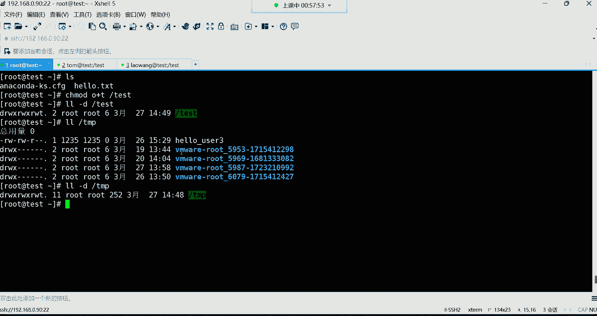

这是我们守着这个T选项啊，OK诶嘿嘿，你说这讲这讲个权限。

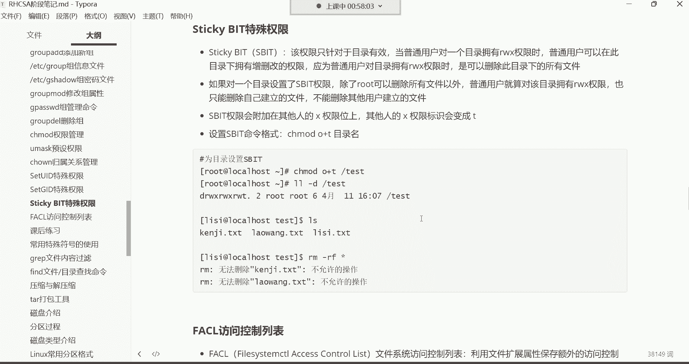

我们这这也能嘿嘿嘿哎呀，也能让我们这么的愉快。

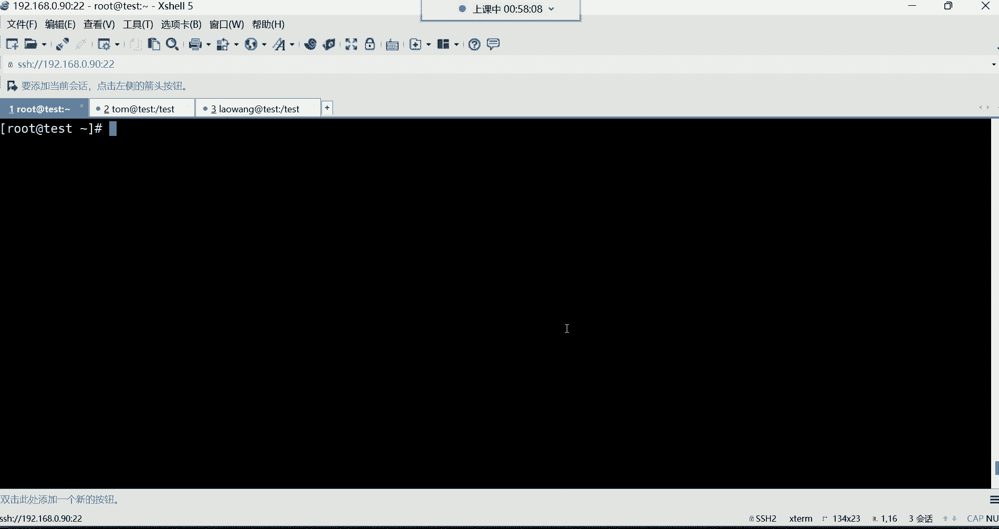

是不是哈哈哈哈哈好了，那下面还有一个还有特殊权限，这是这个cl，这个a cl呢它也不太一样啊，a cl特点是量它的全名叫做FACL啊，其实呢就是一个你看叫file system。

Maccess control list，叫做文件系统访问控制列表，中文的名字，然后呢我们再读一遍哈，功能利用文件的扩展属性，保存一些额外的访问控制，其实这个我给你们通俗翻译一下。

就是可以单独为每一个用户啊，去量身定制一个权限。

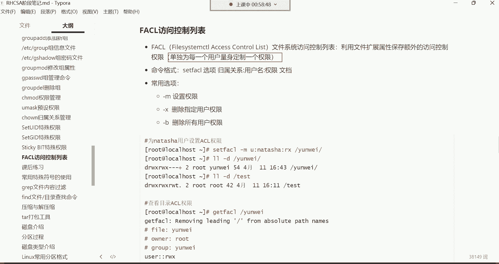

你比如说嗯我们系统当中有一些目录呢，可能说我不希望别人对它的拥有权限，我们建一个目录MDR，我们建一个运维这个目录啊，刚刚那个为什么保存不了，能保存啊，嗯怎怎么保存不了啊，OK哈然后这时候呢我们这样哈。

比如这个运维目录就是我自己运维部门的，是我自己部门的哈，然后我干嘛呀，我一般呢我会对于我这个目录来讲，我不希望别人对这个目录呢有任何的权限嗯，那这个时候怎么办呢，这时候我们一般会亮就我自己部门的目录呢。

我先把它这个组改成我自己部门的组，咱们这里面是不是有个运维组，那我就这样啊，称之O呢，然后把这个组改成运维组，对跟一下的运维这个目录，OK然后我们再来看这个目录，你看这样哈，再看这个目录。

你看现在这个目录是不是就属于运维组的，他的组啊，就是他的这个属于的组，是不是因为这个组了呀，那这个时候呢，我是不是可以把我部门的员工，加到这个组里面去，比如谁啊，老王啊，老王跟汤姆是我自己部门的。

我就可以这样，我就这样这个g pass wd杠A啊，汤姆给它加入到运维组里边去，OK老王也给它加入到运维组里面，老王OK都加进去了，那是不是现在这两个人都属于这个组了呀，那这时候我们再来想一想。

那以后汤姆跟老王这两个人，是不是就可以继承我这个组，对这个目录的权限了呀，汤姆跟老王没错吧，就我这个组对这个目录是什么权限，他们两个就是什么权限了，OK吧，那我这个权限是不是可以给的大一些呀。

比如说RWX，那我就这样称之mod，就是G等于RWX，针对于运维这个目录啊，这是我们再看啊，这样的话再看，那你再看的话，是不是所属组的权限非常放肆了，Rw x，那这时候呢老王跟汤姆啊。

当然由于是改变了归属关系，得退出一下，注意哈，改变归属关系得退出一下才能生效，登录一下汤姆密码，老王我们也退出一下，比如说什么意思呢，为什么要退出，就是你把一个用户重新加入到一个组里面了。

然后呢你得退出，那他这个什么呢，他这个成员才能生效啊，就才真正属于我这个组里的成员了，这时候呢他们再进到这个运维这个目录的话，他进来以后哈，你看老王也一样，cad到这个运维这个目录啊。

运维这个目录进来以后的话呢，呃他们由于对这个目录的权限是一个完全权限，所以他们可以进行增删改啊，自己部门的东西呢随便玩是吧，建一个老网点脚本啊，老王的脚本啊，当然没关系啊，先不用去管它。

这个点SH随便进啊，它是一个汤姆点呃，什么呢，点PY啊，Python脚本就是他们自己是吧，在自己的部门的工作目录里面啊，自己写了一些脚本放在这儿，可以让大家去共享，那这时候呢那别的部门的员工。

比如说我们这服务器里面还有一些成员，有哪些呢，那我我记得有一个小方是吧，没有小方哈，那我们就建一个哈，建一个小李，建议小张吧，建一个小张，小张同志，然后给他设个密码，那阿联一会儿我们一会儿再用阿联哈。

设置个密码，那小张这个同志呢，他对这个对于这个运维呢，它不是你们运维部门的成员啊，小张，那你就不希望它对于你这个部门的运维目录，具备一定的权限是吧，首先他可以看他可以看哈。

他都可以看这个目录下的这个文件内容，我看看老王的资料都可以看啊，只不过这里边是空的嘛，如果你往里面写一句话啊，你VM打开老王的那个文件是吧，你写一个hello，是汤姆是吧，嘿嘿啊哈，今天这去你家修管道。

修管道去了，然后你不在家，哈哈哈哈哈哈哈哈哈哈哈哈啊，然后嗯后边是我们说这个什么叫此处此处，此处我要省略多少呢，省略1万字是吧，省略1万字有点热是吧，保证你这说话，那这时候这小张就能看是吧。

这自己写了一个日记，但是自己的日记，OK呵呵呵呵呵呵啊，那这时候其实我们不希望，但是我们就简单举个例子，我们不希望这个小张能够干嘛呀，能够针对我这个自己的运维部门，这个目录连查看我都不希望他查看。

是不是啊，所以我们一般呢对于小张来讲，我把它权限给他，要要给它毙掉啊，啊把这个呃小张不是属于其他人嘛，所以这时候我一般就这样，就趁着mod有O等于O等于杠杠杠，然后指定运维这个目录好。

那接下来呢这这时候小张就不行了，没有权限了，你看他再打开啊，因为这个目录打不开了吧，进也进不去了，切也切不进去了，是不是因为他不是我部门的呀，是不是啊，不是我部门的。

一般我就不不让他对我这个目录有权限嗯，但有的时候呢，你比如说我还希望什么呢，还希望某些用户谁呢，比如说突然间你们部门，运维部门来了一个比较特殊的成员，比这个小V小V哈，小V是个女孩子。

上你们部门来实习了，那这时候呢你给人建了一个账号，又设了个密码，那这时候小V呢他登录他登录服务器，登录一下哈，小V密码，OK那小微正常来讲，人家得对这个你们部门的运维目录，人家可以去备箱的权限是吧。

但你看他进不去，打也打不开，看到了吗，他打不开，这不行啊，是不是啊，你这都是自己一家人，那我们应该让他具备一定的权限呢是吧，但是呢对于这种呢，比如说这个人比较特殊，身份比较特殊哈。

就我还不希望他具备所有权限，我只希望它具备一部分权限，那怎么办，那你说我一不能给他加到我的组里面，为什么不能加到组里面呢，因为你一旦加到组里面以后啊，你发现这组里面的权太放肆，看到了吗。

组合权限太放肆了，这么放肆的权限你给他吧，嗯其实有些危险，有些危险，一般不靠谱，那万一跟你动不动就三库跑路，是不是啊，那怎么办。

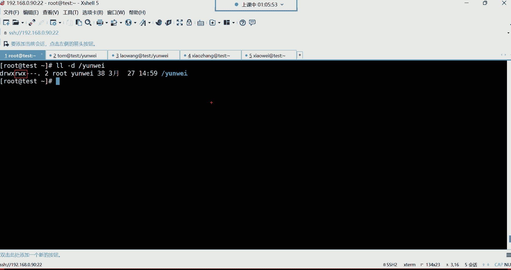

所以呢一般我们干嘛用A4L，可以把这事儿给他搞定。

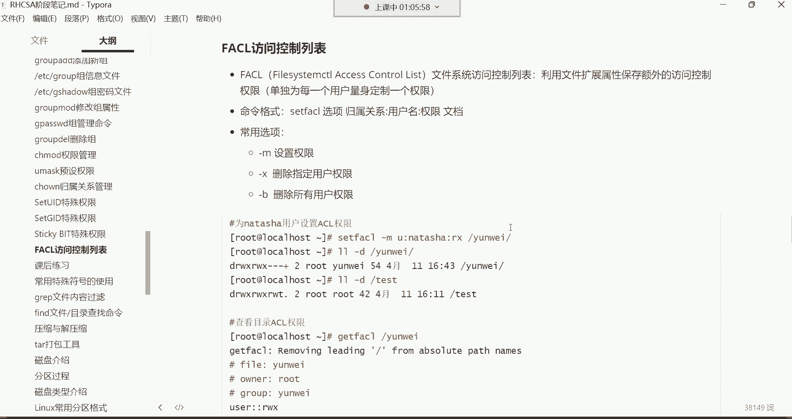

A4L这个东西呢，可以单独为每一个用户量身定制一个权限。

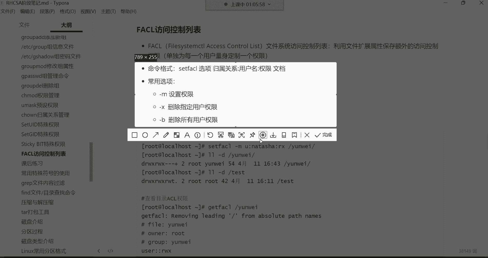

那你这时候你就可以用ACL就这样啊，我们就这样，sf AC l命令格式啊，sf a l然后选项呢杠M叫设置选项，所以这时候呢你就杠M在设置权限的时候，注意哈，要先指定归属关系，在归属关系里面呢。

你可以指定用户，也可以指定组U代表用户谁小V，用户叫小V的权限呢，能读能执行，就是我让你看也让你进去，但是我不给你写权限，没有写选项，它是不是就不会做什么危险的操作呀，删也删不了，删也删不了。

改也改不了是吧，哎好设置好了，设置好之后，那我们怎么看权限呢，叫get FA cl跟这个目录名就行了，这时候你可以看到文件的名字，这file代表文代代表的目录名哈。

那这O呢呢就代表这个目录的所有者是谁啊，是root group呢，就代表这个所属组是谁，user呢就代表所有者的权限，谁呀，就是root的权限哈，root的权限，然后这个group呢。

但是代表所属组的权限，就这个啊这个目录的组的权限是什么，而且你看这多了一个优势，就这个这个优色是谁呀，就小方的权限了，刚刚我们自己设置的，单独针对于这个运维这个目录，给他加了一个什么呢，读跟执行的权限。

但是小芳这个人他跟我这个目录啊，它可既不是目录的所有者，也没有在我的这个目录的组里面的成员啊，也不属于他是一个其他人，但是由于我给他单独设置了一个权限，所以他现在就可以能读，能执行了，知道吧。

而其他人的权限你看到了吗，能列吧，其他人的权限哈，没有任何权限啊，这是那个权限掩码哈，mask好，那接下来咱们就得验证一下小方是小方，现在刚刚是不能打开是吧，但是呢小芳现在仍然是其他人的身份。

小方上针对于这个运维这个目录哈，仍然是其他人的身份诶，你发现这后面多了个加号，看到了吗，是不是多余加号在这哈，这加号就证明了他有一个AACL权限这个目录，而小方现在再打开这个目录诶，没事了。

切换进去也可以看到了吗，这时候可以正常看这里面的文件了，弄裂了吧啊，这就是什么ACL权限啊，那如果你还希望别人有权限，那方法是一样的，是一样的哈，你比如我们再新建几个用户UI，我们建一个什么呢。

harry给harry设置个密码，哼小芳，那你前女友，哈哈哈哈哈哈哈哈哈哈哈哈哈哈哈嘿嘿嘿好，那接下来呢接下来呢我们这个再给这个谁呢，如何查看是吧啊，刚刚不说了吗，Get fa cl，但是目录名要看哈。

看哈哈哈，看到了看cl，然后这时候你可以这样sf AC l嗯，这时候呢在指定U啊，杠M哈杠M，然后指定用户是harry权限能读，能执行对根下的运维这个目录啊，我这个set哈，set好。

那这时候呢我们再看啊，我这个直接get了哈啊这个上面敲错了是吧，get f cl指定运维这个目录，Ok，那你看现在是不是有两个，A4L权限的用户了呀，一个是小微啊，一个是harry，嗯OK嗯好了哈。

这是怎么设置权限，因为修管道促成了一段姻缘是吧，这也挺好也不错哈，嗯好，那接下来呢我们想删除怎么办呢，比如说我现在想把这个小V的特殊权限，给它删掉，那就这样也一样哈，Sf a c l，然后呢杠X啊。

这删除指定用户的权限杠X啊，比如我删除谁呢，那小V回车啊，sorry哈对不是这样玩的哈，U冒号小V权限不用指了，指定对哪个目录回车好了，这样就可以了，get f AC l这样的小V的权限就被你给删了。

现在只剩harry了，看到了吗，你看小V就小V就没了，小V现在如果说他再验证的话，你发现他是不是就打不开了呀，切出去再切进去切进去，切也切不进去了，看到了吗，这就是主要是权限没了哈。

但是harry没有任何问题啊，哈瑞没有问题好，然后他们还可以针对于某一个组去设置，你比如说我如果说有一种需求，你比如说我希望什么呢，希望某一个组的成员都可以具备一个ACL权限，这也没什么问题，哪个组呢。

我看看有嗯，我们这样好吗，Cat etc group，我看有哪些组哈啊，运维组是吧，这里面有三个用户嗯，我们嗯奥特曼我们再建一个组哈，Group add，建一个，叫STUDIP这么一个组。

然后呢我们往里面加点成员，我们把谁呢，咱们建几个用户哈，UI建一个UC1啊，好正的啊，文件也存在啊，那无所谓了哈，他说邮箱文件哈，因为邮箱文件我们并没有删，给他设置密码一一好了，OK啊，再建一个US2。

US2哈，U是2K然后再给他设置密码U2好了，那这时候呢我再这样，我把这个U1给它加入到这个STRIP，这个组里面啊，杠A，加进去UC2呢一个再加进去，加进去以后呢，我们再这样嗯。

直接把这个组给它设置成一个ACL方法一样，sf AC l就直接杠M然后G冒号哪个组，STUGRP这个组好权限能读，能执行，针对哪个目录运维目录，OK这时候你在get f cl，在看这个目录的时候。

你发现诶这里边也有一个组啊，就这个组对于我这个目录，也具备一个A4L选项啊，有时候这个那以后组里的成员是不是就继承组，针对这个目录的权限来呀，是一个含义啊，是一个含义，然后呢想删的话呢。

杠X是删除指定用户的，如果想清除所有，就直接杠B你说对于这个目录来讲，我想把他的所有的A4L权限都给它清除，那就sf AC l杠B不需要指定谁了，只只需要指定目录就行了，因为我要清除所有啊。

我要把这个目录所有的SI全都删掉，所以你就不需要指定什么啊，这个像我前面杠X那种哈，什么哪个用户啊，或者说哪个组啊，不笑了，能点吧，不需要全都清空了，这时候你再看的话，好ACL权限就没了，看到了吗。

没有了哈，没有SL权限，那以上就是我们所说的这个特殊权限里边。

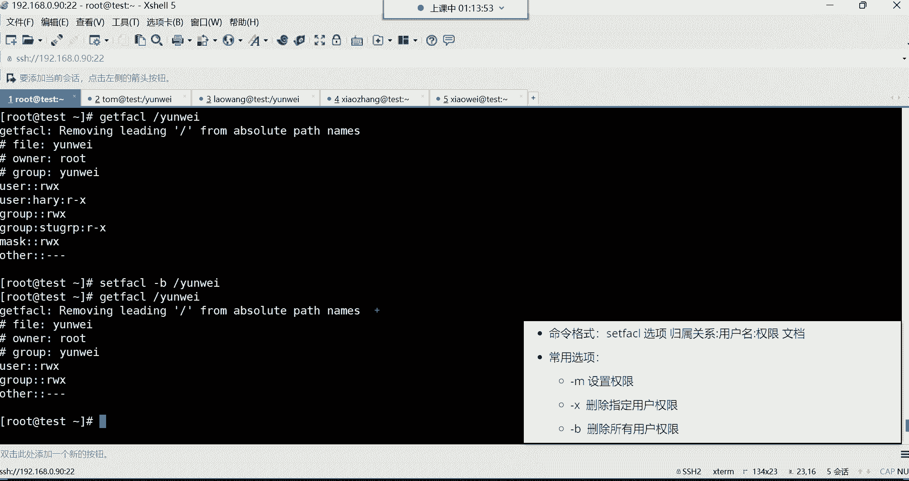

我们常用的都有哪些呢，常用的就是下面这样，下面这两个哈，给单独用户去设置权限，这个呢是针对于什么呢，一个目录，我可以实现叫做用户的一个使用控制的啊，这种机制好了，那这是特殊权限啊，以及前面的基本权限。

那权限内容呢我们也就是讲到这儿了啊，上个厕所是吧，去吧，我们休息一下休息一下哈，休息一下休息一下，我们休息个10分钟，然后呢大家该干嘛干嘛去吧，OK吧，然后我这边就放音乐啊。

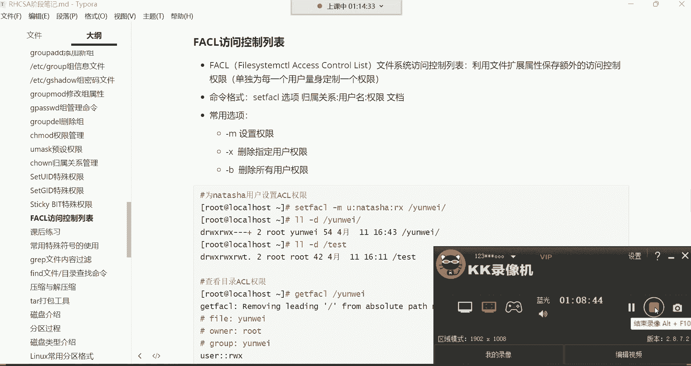