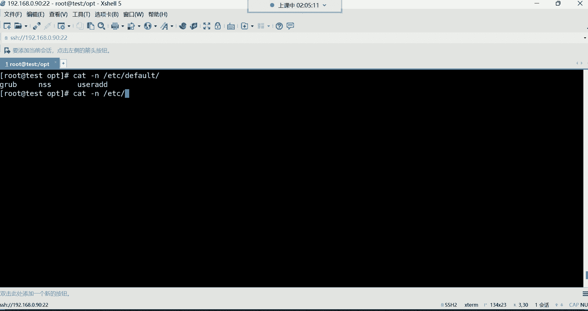
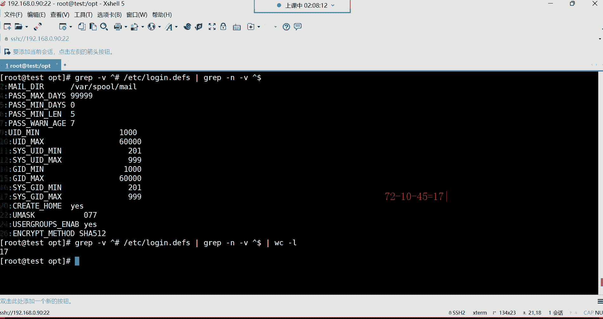
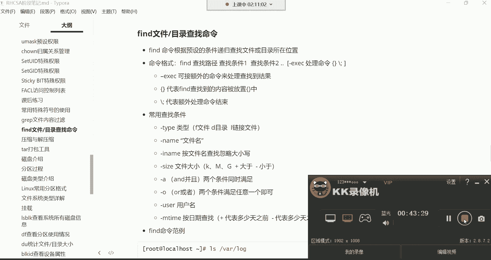

# Linux运维培训教程超全合集，通俗易懂，适合小白，带你从入门到精通1 - P20：红帽RHCSA-20.常用特殊符号的使用、grep文件内容过滤 - 洋洋得IE - BV1qX4y177j1

啊，给我刷波一，我们继续开始好。好，都回来了是吧？嗯，那接下来呢我们给大家讲讲这个常用的特殊符号，容易走神是吧？没关系哈。😊，呃，走神的时候呢掐自己两下啊。😊，然后我们说说这个常用的特殊符号哈。

这个特殊符号我们现在在初级阶段，我们学的呢也就这么几个啊，其实常用的呢。😊，呃，在这里面也就两个，哪两个呢？第一个星。第二个呢，这个大括号啊，这是我们。经常会用到的两个特殊符号哈。

然后下边的这个问号跟这个中括号呢，偶尔啊可能说偶尔会用到哈用的不多啊，所以呢呃你必须要掌握的就是星号跟大括号。然后呢，你如果说实在没有那么多精力，那问号跟中括号呢，可以什么呢？

可以我们说这个可以暂时先作为一个了解啊。😊，那么先说一下，在linux系统下边特殊符号起到了很大的作用。那特殊符号可以完成一些特殊的功能。我得先给你讲讲这个特殊符号都有哪些啊，在我们这个键盘上边注意哈。

你可以看一下，在你键盘上的那个数字键，什么叹号啊，sorry这个哈。

这个叹号。艾特符井号、刀路符、百分号、尖角号、and符、星号。那么大括号小括号什么这这种小于号大于号啊，什么问号啊，这种斜线啊，包括左斜啊，这个左斜线哈，还有这个我们叫什么呢？这种叫反撇，反撇。

还有这种嗯我再想想哈，还有什么呢？差差不多也没了，差不多没了哈。啊，点儿点儿也是。😊，第二也是哈嗯课间睡觉是吧？那，这些呢都属于叫特殊符号。当然还有一个管道符啊，这些都属于特殊符号哈。

每一种特殊符号在我们这个系统当中都是有一定的含义的，都有一定的含义哈。😊，所以说呢我们在这个阶段我们学哪些呢？星号大括号。还有这个问号。还有那个中括号，当然我们再补充一个中括号啊，我们先学这几个呢。

先学这四个就是这个星号大括号，还有这个中括号，还有这个问号啊，其他的话呢，我们后边再学，用到时候再学。啊，那然后咱们一个一个来说。一个一个来说吧，这些。

再来说第一个星号常用的特殊符号，在文件的扩展名上，用来代表任意多个任意字符。这一话呢。

读了一遍跟没读一样是吧？不太适合人类去理解呀。首先呢它肯定是一个特殊符号就对了。然后啊它在文件的名字上注意哈，一看就是应用在文件名上面的那干什么用呢？在文件名上，它可以用来代表任意多个任意字符。

那首先啊这个文件名，甭管是目录还是文件哈，它都可以帮你去什么呢？帮你去代表。那我们先说什么叫任意。😊，什么叫任意啊？这个任意呢就是非常的随意。😡，怎么随意呢？就是你这个名字是123呃，是这个数字也好。

是字母也好，或者说有一些什么特殊符号之类的，什么点儿啊等等等等的。😊，他这叫仁义。所以说这个星号是可以代表什么呢？任意所有的。甭管是什么什么数字啊，字母大写小写。都能代表。啊，就代表所有。

那多个是什么意思呢？多个就是甭管。你这个。名字有多长啊，就长度也不限。呵能理解吧，这个就叫做任意。😊，字符任意长度我都什么呢？我都通配了，所以它叫一个通配符啊，通配符。那么这些东西有什么用啊啊。

大家经常会看到这么一条命令是吧，RM杠RF跟下的星。这个星儿。他就能够在文件的名字上面代表什么呀？代表任意所有。而且。就是什么都能表示，我告诉你什么都能表示。那也就是说它既然能够什么都能表示。

那是不是就代表什么呀？我要删除这个根下的任意所有啊，这个星号就代表任意所有，那它就是删除任意所有，那就删库跑路呗，是不是啊删除所有的意思啊，所以这个星号很给力哈，但是呢我们一般用它干嘛呀。

做一些文件名搜索。比如说我想搜索ETC下面有没有一个文件。😊，呃，是什么？是这个叫pass。WD的，但是名字记不全了，可能说我只记住什么呢？我记只记住以这个PASS开头的结尾记不住了。好，星号。😊。

回撤。看他他给你搜到两个，你看到了吗？搜到两个哈，而这两个文件呢都是以PASS开头的，以pass开头结尾的话呢，你用型号来表示了。那就说这个呀结尾。😊，嗯。结尾的话，那是什么我就任意了。什么WD啊。

还是WD杠啊，这都无所谓了。😡，啊，但是只要是以PASS开头的就可以能列吧啊，包括你把这个东西。做各种匹配，比如有没有FS开头的文件。看到了吗？有啊，结尾以什么结尾的啊，后边你比如说有没有这个以这个。

或者说这种东西你也可以放到中间。比如开头是以什么呢？是以这个s头S开头的。然后呢，结尾呢。😊，嗯，当然就直接这样搜吧哈，就这这样搜。一如果你放放到中间不太好用啊，不是很理想。😊，这种看到吗？

只要是以sin托S开头的结尾啊，叫什么都行，看到了吗？叫什么都行哈。😊，嗯，目录现在可当然可以啊，它可以使各种各各种各样帮你匹配的哈。你比如说我想搜索B下边有没有一个文件名，呃，是叫什么呢？啊。

也是这个。😊，呃PASS开头。PA开头结尾是什么？无所谓，看到了吗？是不是给你搜出来了，这个程序文件没错吧啊，但是还有一个呢，你看PAS开头后边TE结尾的。😊，咱不他不管。

只要是前边符合你的要求就可以了，后边就任意了。

所以这种东西呢还是怎么说呢？蛮好用的哈，蛮好用的。😊，然后你看这里边我给大家举的例子里边哈啊你可以搜索什么一点什么结尾的。😊。

比如说我想咱们说这个在系统的rap的log下边是存放日志文件的是吧？日志文件呢有个特点啊，一般呢就是以这种点log结尾的。😊，那这时候你怎么办？哎，这时候我就可以这样了。就L4Y下的log下以什么呀？

叫星点log结尾。那搜索出来了吧。好，那搜索出来以后呢，我想把这些文件给它做个备份。好，copyCP是不是啊copy。😊，Copy。杠P保持属性不变的拷贝。

把wa的log这些星点log给它拷贝到OPT下边。拷贝到根下的OPT目录。可不可以呢？可以呀，回车阿拉4。你看OPT。是不是给你拷贝过去了呀？对，可以。总之，这个信号它的功能是很强大的，你可以灵活运用。

有这种需求。都可以帮你去匹配。好，这是星号哈，然后它也很灵活，你可以放在开头，也可以放在什么结耦，可以以什么什么呃，你可以让他去帮你去匹配以什么什么开头的。因为你记不住啊啊吧，以什么开头都行。😊。

在结尾呢必须以中点com结尾的，或者说必须得以这个看必须得以这个开头，但结尾是是什么都行，或者说以什么开头无所谓，以什么结尾也无所谓，但中间必须包含SS的都行。😡，那这种就是这种需求比较少见一些哈。

这种需求知道一下。因为对于一个文件名字，其实我们大多数也就是怎么说呢？😊，没有那么难记哈没有那么难记。文建明。啊，这是星号啊，我们后后期呢频繁会用它，所以说呢在用的时候，你别对它感觉陌生哈。

可以代表任意所有。然后第二个这个问号，这个问号它的功能呢主要是干什么用的呢？它也是在文件的名字上面用来代表任意单个。注意哈，首先都是任意。只要是任意。

就说明你这个东西是什么1234还是ABCD还是什么特殊符号。😡，都行，那但是呢。😡，他是只能帮你去匹配一个字符。但你这一个字符是什么，那我就不管了，因为字符是任意的啊，都匹配，而前面不一样，这多个就是。

😡，你长度我也任意，而而下边长度只能是一个，所以这是他们俩个的一个区别哈。啊，那这个东西呢一般用的比较少一些的。你比如说我们想如果按照这例子，大家来看一下哈，这例子我想去搜索一下。😊。

搜索什么搜索这个DEV下边。啊，比如说以什么什么这个。开头的。看看。在DV下边，我想搜索以TTY开头的结尾必须是一一个字符结尾的。一个字符结尾回车。啊，当然这些文件我们后边会介绍哈，先知道一下。

这些就是给我们提供登录终端的这些文件。好，那看到吗？这是不是一个字符啊，但是你甭管是数字还是字母，总之满足我们的条件。😊，能列吧，满那么多条件哈。😊，啊，一个字符。O。那两个字符行吗？必须得一个字符吗？

可以，你再加个问号啊，那就是两个字符啊两个字符结尾了。首先TTY后边你发现都是跟了两个字符。😊，但是这两个字符，你甭管是数字还是字母，它都给你匹配了，因为它任意。能列吧。OK好。这是我们所说的这个问号。

啊，就怎么说呢？可以帮你去匹配一个，注意哈，一个任意字符。呃，三个可不可以呢？也可以啊，但是没有看到吧？他说没有TDY开头的结尾，以三个字符结尾的，没有没有就不不帮你匹配。😊，没有就算了。行，这是问号。

但是不是很常用啊，不是很常用。

嗯，然后下面这个中括号呢。

也是在文件的名字上边帮我们去做匹配的。

他匹配可以匹配什么呢？啊，他可以帮我们匹配一些这个。看代表多个字符或联系范围中的一个。这是什么意思呢？首先它是用来匹配什么数字跟字母的。比如说我想这样去匹配嗯，L莱4哇下的log下边。😊，以什么呢？嗯。

以这个。就是这个文件名字里面包含数字的。😡，那怎么办呢？星。中括号。0-9结尾请注意哈。我这波操作是什么操作？就是。以什么开头无所谓，任意以什么结尾无所谓任意。但是。只要包含。0到9之间的数字就行。

那这时候你看。这个名字里边就是一个文件名字里面只要包含数字的，全给你查出来了。就包含数字的，看到了吗？是不是你看这文件名字后边是不是有数字啊，这是不候123是不是也有数字啊？😊，诶。好。

这就是我们所说的什么叫做。匹配。啊，那你说我只想匹配什么呢？😡，包含字母的数字，我不要A杠Z回撤。有没有呢嗯。然后清控一下。有看到吧？现在呢他给我们查出来了，从这儿开始哈，从这儿。😊，呃。

当然啊这个由于我们是用形来表示的是吧，这没有办法没有办法，这形数字它也给你匹配了。所以这种搜索不是很精致，不是很精确哈，不是很准确。一般这样玩的比较少一些，但是你就知道它它是什么呀。

它是可以帮你代表多个连续的。注意啊，代表多个连续的。连续的哈范围里边的一个。都可以帮你匹配。什么叫范围内啊？就是你比如说我们我们刚刚咱说从0到9是吧，那0到9之间，你只要在我这个零或者9范围内。😡。

都满足我的条件啊，所以这个中括号呢是首先可以帮你匹配一个连续的啊，比如A到Z是吧，0到9之间，但只要有一个匹配上了，那就满足。😊，这是中国号啊，都是应用在文件的扩展名上面啊，帮做一些筛选啊筛选哈。😊。

O。嗯，那这种的话呢用的其实不是很多啊，大家这个知道一下就行。我们后边呢也不是很常用这种中括号，大括号我们一般用的比较多一些。大括号哈，这大括号呢它的功能呢？因为非常的给力，不是说中括号这个不常用。

是中括号功能有瑕疵。你比如说我们把中括号拿过来，我要匹配话下它log下边什么呢？TTY开头，比如说结尾必须什么呢？😊。

0-9。嗯。Y下的log啊TTY然后嗯。啊。不是不是不是搜错了哈啊，这个DV下边哈，然后TTY开头。😊，0-9。回车，你看可以，他把你匹配了是吧？TTY开头的，然后呢。从0到9都帮我们匹配了。

但是呢我我想匹配什么呢？我想从我想匹配15到25。之间结尾的有没有？就是这个文件名字，它的结尾是从15啊到25这个范围内。我想去匹配一下，那就是15。那杠25回车，你发现。不对劲儿。不对劲哈。

怎么匹配个一又匹配个5啊，我们要的是15到25之间是吧这个范围内的。😡，是吧只要是满足条件的。你帮我筛选出来。好，那这时候你看第一位有没有啊，有。😡，他肯定有你看到了吗？这个什么2这个15到25之间。

你看2021223425都都符合条件。但是他没有办法帮我们筛选。是吧但是如果你换大括号呢，你发现它不一样了。同样的操作，咱换个大括号。好好。大括号里边呢用什么？用点点儿点点来表示灰车。😡，哎，你看。

是不是？这文件名字必须TTY开头的结尾。😊，只要是在这个范围内就可以。就可以哈。所以大括号呢也是在文件名上面可以用来代表多组不同的。😊，多组不同的，也就是这个有数字也行。然后呢，字母也行。

比如后边如果包含这个逗号隔开，比如包含这个S的也可以，或者说说大S的也可以回车啊。当然这个可能说这个嗯我看看这这这个。😊，好。这不让匹配吗？嗯，打搜我看看啊嘿。难道？这样。He。嗯。

我记得是逗号隔开的呀，他这个。哦，那算了吧，可能语法不支持。那算了吧，那你可以量，比如说嗯A嗯A，然后后边呢再。被盗贼。嗯，也没有没有哈。算了吧，那就不这样匹配了哈，不这样匹配了，可能是不支持这个语法。

正常来讲呢，它比中国号要它主要是合什么呢？后边跟一些数字数字啊。他这个数字啊比较给力在哪里呢？就是你比如我现在想建个文件。啊，我现在咱们把OPD清空一下。OPT下的星。然后我进到OPT。

我现在想在OPT目录，我想建100个文件，注意我想建100个touch名字叫什么呢？就是让它叫。😡，pa子的开头。然后呢。后边呢。就是以此类推，什么t一，然后t2。太子3。泰测4。3色5之类的啊。

以此类推，我建100个文件。那这种需求。你们有没有想过我们手动去建100个文件吗？现实吗？你说。😡，好像也不太现实。是不是哎这大括号啊，它可以帮你这样玩test后边跟上什么呢？1点点100回车。

你看瞬间100文件出来了。是吧。所以你看这他就什么呢？他就。😡，可以帮你非常适合去做数字方面的去匹配。啊，适合数字。对你说我要建1000个文件。好，没关系。😡，都可以。是吧。嗯。删也可以吗？

当然可以了呀。你比如说我现在要删RM杠RF对，我要删除以太词的开头的，但是啊一点点。😡，51到50就删50个行吧，回车LS，那你看。前50个没了。是吧。

所以说它这个呢一般就是非常适合去做这种数字相关的去匹配啊，这种比较好用哈，比较好用一些。呃所以这个大括号呢，我们后边会在大括号里边去放一些数字啊，后期在学习税务脚本的时候，这个大括号也非常的常用。

非常的常用哈。啊，50到100是不是删删除后面？对你这个数字给多少，他就帮你删多少。给多少删多少啊。好。行了，那。嗯，太词一点点太词。可以。啊，太词一点点太次50啊。😡，太一。啊。泰一点点儿啊。

咱们就t的多少t的51啊，点点60啊，t的60。哎呦，你这我还我我看看哈。😊，不行不行哈不行，你看了吗？他确实不行。是不是啊不行哈，因为有这个有字母，他没有办法帮你去做这种匹配了啊，对，识别不出来了。

语法不支持了。😊，对以这这种就不允许，一般就是大号里边都是放数字。放数字。放字母不太好识别。好。行了，这是这个星括号星。所以大家在学的时候呢，就掌握哪个呢？就星这个星跟大括号，这两个是我们最常用的。

能理解吧啊，是最常用的。但是我这个如果说你不加数字，光用什么呢？光用字母，这没什么问题。你看我们比如说这样。😊。

嗯，LS。我们干嘛呢？嗯。我们就搜啊搜这个文件名字啊，搜ETC下边文件名字。以什么开头无所谓，结尾呢只要包含A逗号BCD我们试试哈。嗯，也行。你看也行哈，但是如果你数字结合字母，它就不行了啊。

但是这样没什么关系。因为只要这个文件名字里面包含这个ABCD啊，任意一个也都可以都满足哈。那文件文件名里面都包含什么A呀，或者说BD是不是啊？嗯，但如果你说我只只要包含A的。😊，啊，那没有。

B呢不可能没有啊。😡，啊，这里啊这这不行哈，这不行。BCD逗号D。啊，这样可以。但是你们没有必要搞那么复杂哈，没有必要搞那么复杂，这种东西不太适合去匹配一些字母，不太适合哈。😊，对。数字用的比较多一些。

好，okK行了，那下面呢我们再来给大家讲讲这个graphve。😊，呃，gra呢这条命令呢，它的功能呢是用于查找文件中符合条件的字符串。什么意思呢？就是我现在有一文件。

哪个文件呢？咱们就拿这个。ETC下的passWD这个文件。来说我们加个选项哈，加个杠N。这个文件来说，我现在想从这个文件里面去搜索一个字符串。啊。但是呢我又不想什么呢？不想一行一行去看。

因为这个内容太多了。

那这怎么办呢？这时候g可以帮你干这事。注意啊，它就是从文件中去查找符合条件的字符串，帮你显示出来，能理了吧。那后期呢可以利用一些什么正则表达式啊，这个大家先不用去管的。

因为正则表达式呢是我们后边会讲的啊，先了解一下。然后呢，他会把匹配到的字符串的行给你打印出来，就是给你显示出来。你只要匹配到了，他就给你显示出来了。语法格式呢gra。咱们来说一说他的语法哈。

这语法还是蛮有意思的。

以及这个选项都挺有意思。

好，来看一下。呃，grape我现在想搜什么呢？我现在想搜，比如说嗯汤姆。汤姆哈啊gra汤姆。然后从哪呢？ETC下的passWD文件里面去过滤。喂，回车看到了吗？

那现在就是我只想从这个文件里面看汤姆的信息，别的我不想看，但是你发现用ca太麻烦是吧？你ca，你直接看，直接把整个文件打开了，然后你再去找汤姆，汤姆在哪儿在这儿呢，我再去看费劲吧，费劲。

是不是我就想看汤姆，别的我都不甘心。😡，是不是哎，那咱就直接过滤汤姆不就完事儿了吗？是吧？他就帮你从这个文件里面。专门去过滤哪一行，他得看好哪一行包含汤姆啊，一看到有哎给你显示出来了。

有的话给你显示出来了哈。😊，哎，那你说这个。这不知道这个载多少行啊，是吧，加个杠N。回车告诉你哈哈这时候加个杠N，告诉你。你要搜索的这个汤姆啊在这个文件里面的多少行呢？第二十行。啊。

然后这是汤姆的这一行。的所有信息都给你列出来了，是不是蛮好用的呀？啊，这就是什么，这是我们所说的这个gra。是不是为什？😡，不是哈，别搞混了。位置是什么？位置是搜搜索一个命令所在的位置。

它可不是搜索文件内容哈。😡，我们现在这个gra是从一个文件里边。去搜索。某一些关键字，你比如说。这个你曾经是吧，就这个什么呢？可能说这个有一个女孩子看上你了，给你写了一封，比如说好几万行的一封情书。

然后呢，你就想从这一封情书里边呢去过滤过滤来看看这个女孩子啊，一共写了多少行，这个包含我爱你这三个字的是吧？然后看一看。同意同意。那这时候。g就可以帮你干这个事儿了啊。从你这个好几万行的一个清书里边。

呃，只帮你过滤包含哎我爱你这三个字是吧？😊，都在这个文件里边的哪一行出现过，对道吧？它是从文件的内容过滤哈，which置是搜索一个文件的所在位置，他们干的活不一样。😊，好，这非常简单吧。

语法是不是啊你看grape加选项，然后跟上你的查找条件，谁是你的查找条件，t姆就是我的查找条件。😊，是吧嗯，然后后面呢就跟上一个文件名就可以了。那你说我想还我还想过虑老王是吧？咱换一个我换老王。

我现在又想看老王的信息了，那叫老王回车。😊，哎，他就把老王的信息给你过滤出来了。说非常好用啊。哎，非常好用哈。我们以后呢会频繁用gra这条命令啊，这这条命令也可以怎么玩的呢？啊，这条命令你可以这样。

比如说我这样if。康飞哥，这条命上不是看网卡吗？是不是是不是看网卡啊，没关系。😡，他也可以干嘛呀结合管道。结合graph。在干嘛呀？在过滤。比如说这条命令把网卡信息显示出来以后，我只过滤什么呢？

包含ENS32的行。graENS32回车。好，只把这一行给你剥滤出来了。看到了吗？你说我只想过滤包含这个。😡，in特的行。好，那这时候咱就这样过滤iner回车。哎，你看。只要是包含intel的。

都给你列出来了吧。😡，是不是？H。😊，啊，这是graphra啊。嗯。好了，这就是gra。然后呢，选选项的话呢，我们给大家说说杠N我们刚刚已经用过了是吧？以行号的形式去显示，告诉你这个内容在多少行。

杠I叫忽略字符串大小写，这个用的比较少一些哈。比如说我想在过滤的时候，我也不知道我要过滤这个东西到底是大写还是小写，忘了。😊，你可以。补一个杠。哎。比如我要过虑一个什么呢？嗯，一个什么DNS的。

没有是吧，没有，那大写有没有呢？我们看一下哈。😊，呃，大写哎嗯大写的话。这个文件里面好像没有大写的。有大写的吗？没有啊没有大写的啊。并没有啊有啊，这U是吧？啊，还这个nobody啊nobody有啊。

对有。system是吧，user那你可以量。就是我想这样过滤啊，过滤什么呢？过滤user。回撤好了，那这时候就是大写也满足，小写呢也满足。但如果你不加杠I的话，你看我们不加这个杠A哈，只过滤有此。

你发现就少了两行，是不是只有这两行吧。😊，但你加了杠完以后，你发现哎这两行大写的也给你过滤出来了。就是有有的时候你记不住到底是大写还是小写，可以哈，王康磊也有是吧？😊，好，这就是杠I用的不是很多哈。

知道一下就行。然后杠V就要显示不包含匹配的行。这是一种排除方法。这种排除啊怎么排除呢？呃，就是咱说排除其实没没有什么用。😡，排除是没什么意义的哈。嗯，我想。从一个文件里面去什么呢？排除某些东西。然后呢。

拍出以后呢，再给我显示可不可以可以gra。😊，杠V是吧，你后面跟root好，那他要干嘛呀？他要把root给你，从这个文件里面给你排除掉了。啊，只要是不包含root的，全都给你显示出来。😡，看到了吗？

这里面哈都没有包含root。你看从这开始，你发现。是不是没有包含root的关键字啊，没有哈没有。😊，没有。但有没有root呢？肯定有啊，你gra rootot rootot就在文件的第一行。

哼肯定有root呀，是不是啊，但是呢由于你由于呢我们杠V啊就排除了。想多加几个搜索，等也可以啊。😡，这得看你看你怎么加。这条件这种东西呢得看你。等一下哈。我这个。我觉得我这个终端现在出问题了哈。😊。

是我这。好，O。好了嗯，键盘问题是吗？😊，行了哈，那我们继续来说这个事情。杠V我们一会儿说说哈，我们先把下边这几个特殊符号给大家讲讲啊，这几个特殊符号呢这是一些我们后期讲正则表达式的时候。

一些常用的符号。第一个呢叫做尖角号，尖角号后边你跟上。😊，一个字符串。比如说我这样哈呃grape，然后呢尖角号后边我跟上一个root。

然后后边再这样啊再跟上那个文件ETC下的passWD我的意思就是我要过滤这个文件里面以root开头的，注意哈，它是匹配以什么什么开头的。但如果你不加这个间角号，你会发现。😊，呃，不加间尾号哈。

再来一遍哈，这加间减号，不加间减号。看效果不一样。看到吗？就是你不加减减号，它是有在这个文件里面是有两行都包含root这个关键字的。看到吗？这行跟这一行。而且上面这一行呢是3个。但如果你加了减减号。

你发现就只有一行是满足你的条件的。这是从一个文件里面过滤了哈，那就啊过滤。😊，我只要以root开头的。😡，这一行在满足的条件不是以root开头，像这种。不满足。能解吧，这种是不满足的哈。

O这匹配什么什么开头匹配什么什么结尾。那我这样，比如说我想看什么呢？我想看看在我这个系统当中有哪些用户使用的解释器是什么呀？是。😊，并一下的拜纸。可不可以可以吧？就直接拜出就可以吧，是吧。

哪些用户是正常的用户？那就以拜事结尾的。A每刀后边跟上ETC下的passWD。哎，你看那也说在我这个系统当中，这么多的用户都是以bitch这个解释器。

就是他们正在用的解释器都是拜ch这bitch这个解释器，就证明他们都是什么呢？哎。普通用户啊可以正常登录系统的。哎，那你说我还想看看哪些用户不能登录系统是吧？😡，对，那这时候咱们就换什么呀。

n log in结尾的。哎，那这些用户都无法登录系统。那你说多少个呀，统统计个数呗，是吧，管道给WC。给你统计一下14个。哪里吧。好。就这种哈就这种。这是以什么什么开头，然后以什么什么结尾的。

然后还有一个叫显示空行。这个尖角号跟美刀呢，他们两个结合到一起就显示空行。怎么显示呢？啊，有的文件里面有些空行啊，哪些文件呢？比如说ETC现在FStable这个文件，我们加一个杠N行号。

这文件总共多少行呢？1一行。对吧，但是呢我们系统当中这个文件有个风格，什么风格呢？如果这个文件的内容它的开头是井号开头的，代表是注释。什么叫注释啊？就是解释不成效的配置。不生锈的配置哈叫注释。

系统不会读的，就是这就告诉我们这个文件是用来干什么用的，就一些解释，就类似于说明书一样。😡，啊，说明书。所以说就不生效。还有什么？你看这文件里面其实还有一个空行，还有一行是空行哈。

那比如说现在我只想看这个文件里面有效的配置，哪些才算有效配置呢？😊，就其实只有三行没有被注释的这三行是有效的配置。那怎办，那我现在。😡，就可以先干嘛呀？咱们学了这些特殊符号以后，我可以先结合这个杠V。

把以井号开头的是不是先给它排除掉啊？没错吧，因为注事嘛。😡，我不想看他啊那我就这样grape先干嘛呀？先杠V是吧？排除以。井号开头的行。ETC下的FS。哎。

那你看这时候是不是没有帮你把那个井井号包含井号的内容给你显示出来，给你排除掉了。😡，啊，就已经排除掉了哈OK。😊，把那排除掉了之后呢。那其实这还有一个空行的，这是个空行。如果你加个杠N。

你就能够看得出来。看到了吗？第一行这个文件的第一行是个空行。知道吧？我也不想要。我也不想要。我就要精准的过滤。只要是我用不到的数据，我坚决不要。😡，啊，一点多余的都不要怎么办？好，那下边。怎么排除空行？

那你说我取反后边我再补一个不就行了吗？是不是再补一个这个尖角号跟美刀。这样是不是就是。代表你把空行给我排除掉啊，因为尖角号跟美道代表是显示空行吗。显示空横啊，那时候你发现。他不对劲儿，他报错了。

他说什么没有那个文件或目录，为什么呀？因为他认为这是一个文件名呢。😡，然后他认为你要从这个文件里面去把这个井号开头的给它取反掉。这有能力吧。他误以为哈。误以为，所以这样语法不行啊，他有点无法识别了。

最终呢可能说理解能力还是有些欠缺啊，那怎么办？那这时候呢？你就可以这样。再结合管道，管道再处理一遍呗，gra再杠为取反取反什么呀？前面这条命令是不是把井号开头给你排除掉了呀？但是呢有一个空行。哎。

我再处理一遍，杠V取反什么呢？空行。回撤。啊。空行哈那不行，又显示出来了是吧？呃，当然杠N就不能放这了啊，这时候杠N有要求了，你得把杠N。😊，杠N啊，这时候放到这儿可以。回撤。哎。看到了吗？这样你发现。

这空行也没了。然后井号开头的注释也没了，现在就是我们要想要的这三行什么呢？😡，数据那啊数据那那这杠N呢如果你结合管道的话，如果你写行号，一般就不能放前面，放前面不行啊。嗯。

那你说这个文件其实还不是很明显，哪个文件呢？😊，呃，在那个。ETC下面有个。啊，有一个。defoult目录有一个什么呢？有一个文件叫不是啊，不是defoult，有一个。文件名我忘了哈，我看一下。

啊，哪一个文件呢呃叫做啊 log in点 default这个文件。好。

来看一下这个文件哈。你看这个文件总共72行。😡，七2行的文件哈。然后呢。这文件里边你发现你往上翻一翻，有很多注释是吧？你看注释其实就是一些解释，没什么用。😡，而且还有很多空行，你看到了吗？

这是不是都是空行啊，空行吧，空行，你说这一文件，说白了你搞这么多空行干嘛呀？这空行没什么用，是吧是？你如果过滤一下呢，你你怎么过滤呢？你可以这样。😡，grape过滤空行尖角号米刀就是匹配空行了。

从这个文件里面去过滤。然后你在管道给WC，你统计一下，你看多少个空行啊。十行啊，这个文件里面有十行是空的。好。还有那如果说是这个井号开头的呢，注释呢。45行，也就说一共是72行的文件，你看一下哈。

72行的文件，你去掉你72行72行，你去掉什么呢？去掉十行是空行的，再去掉45行是注释的。你说真正有效的多少行啊？😡，是不是？哼你自己统我们来统计一下哈，这时候怎么统计呢？grab。😊，首先我第一步。

我先。把那个井号开头的给他取反掉，杠V取反掉以井号开头的。从这个文从这个文件里面哈。ETC校长。捞个印点儿。Dfor。OK取反了。取反以后的话呢，我们再结合管道再gra再杠V，再排除排除谁呢？排除空行。

然后再显示个行号，但这个杠N这个选项呢就放这儿吧。回撤。啊，我再统计个行数。哎，你看真正有效的配置就17号。1个72行的文件啊，这你你们应该也能感受到1个72行的文件去掉十行。空行再去掉45行注释。

真正有效的配置。17行。看到吗？你说这片。对。是不是有些坑爹了？没错吧，啊，大部分其实都没什么用。所以呢像这种东西，你各种筛选，你看有的时候你发现就还是有必要，是不是啊？😊，啊，那筛选出来以后干嘛呀？

你说哎呦我可以给他做一个备份呢，是吧？这些有效的配置我给他保留下来呗。😡，都可以哈WC统计行数统计行数哈。前面都讲过。嗯。

O。啊，这就是我们说的这个graap这条命令啊，过滤文件内容的过滤文件内容哈，还是我们后期会频繁用到哈，会频繁用到。因为它也结合它也可以结合一些什么呢？😊。

命令哈什么ca啊，这个比如说这个结合前面的命令结果，比如说cat，我从看了一个文件啊，当然这种就没有什么太大必要了哈。一般就是比如说我前面来来一个什么呢？命令啊。😊，Free。杠H看内存是吧？好。

看内存的话呢，我只想看什么看。memory啊memory叫memory，那我就可以管到给gpeMEM回车。只显示内存这一行就行了。看到了吗？只显示内存这一行信息哈。啊。

他可以结合就是前边的命令再管道给gra也是可以的。很灵活哈非常灵活的一条命令。😊，然后也可以直接从文件里面过滤，也可以直接把前面的命令结果再交给他，继续去帮你去过滤一遍。很实用。

O。好了，那接下呢我们再讲讲范的，我们我看看哈。😊，犯的。啊，41分钟嗯41分钟，我们要不要休息一下呀，讲这个范的呀。休息一下吧哈，因为f的这f的这条命令啊，也是一个怎么说呢？非常给力的命令哈。

那肯定要是吧啊这个free看它是哪里的内存，就是我们的系统的内存，物理内存物理内存啊，就这虚拟机的物理内存哈free。😊。

嗯，这里边有我们这个虚拟机的总内存，啊，已使用内存还剩余内存。啊，DF啊DF是看分区啊。DF是看看分区的，看你的这个磁盘分区的使用情况，它跟内存没什么关系哈。😊，你比如看我的根分区看到了吗？

根分区的磁盘，当然我们一般会结合一个杠H哈，杠H这我们这面呢后面会讲一先不用去管啊，我们后面会讲的。😊，他们两个因为他他们两个功能不一样。

别搞混了。好呃，今天讲到哪里？我们今天呃能把饭的这条命令讲完。😊，能把饭子讲完哈啊压缩跟假压缩看情况啊踏。😊，我估计也差不多，翻着讲半小时，压缩跟套儿讲半小时啊，我们可以休息一下，大家缓解一下。

一会儿回来呢啊，咱们接下来的一个小时可以说是理论加实操啊，那可以说是都是非常非常给力的哈啊，也都也都是大家非常喜爱的环节啊，就是噼里啪啦敲命令啊啊，休息吧，休息个10分钟。😊。

