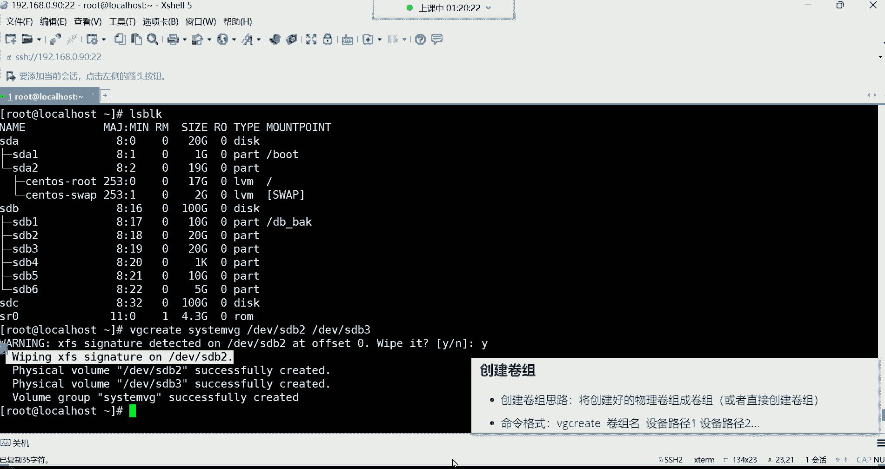
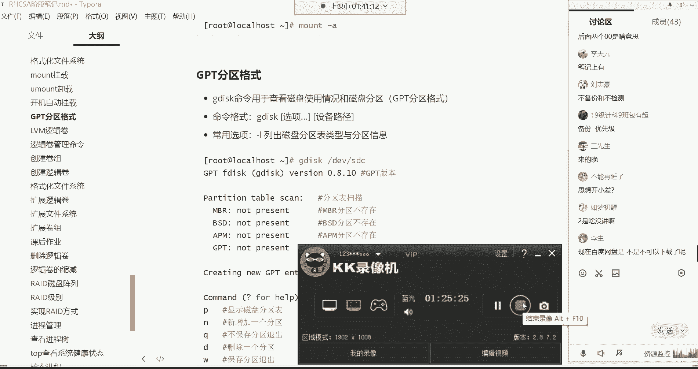

# Linux运维培训教程超全合集，通俗易懂，适合小白，带你从入门到精通1 - P26：红帽RHCSA-26.开机自动挂载、GPT分区、LVM逻辑卷 - 洋洋得IE - BV1qX4y177j1

比如说一个叫虚拟技术，虚拟技术，而最终的数据还得需要底层物理硬盘来支撑，但没关系，后期可以有办法解决，能理解吧，那你先先不用去关心这个物理硬盘的事情，我们现在就说这逻辑卷的空间可以不断变大。

那如果有一天，你说这个增加增加增加已经增加400个G了，那这时候还能增加吗，好像不能了，为什么呢，因为你要知道逻辑卷的空间从哪来啊，逻辑卷的空间是从这个物理硬盘，这400个G的空间里面来的，能练吗。

就是说我们如果想扩容它的空间的话，是可以扩容，但是你得知道这空间从哪儿来的，扩容的这个空间呢，它是从这个虚拟硬盘里面来的，所以如果我们想要对这个逻辑卷的空间，进行扩容的话。

你的虚拟硬盘空间必须得够用才可以，那虚拟硬盘如果不够用呢，虚拟硬盘如果不够用，没关系，咱们还可以怎么玩呢，就是我们可以直接搞一块大的硬盘啊，如果你有需求的话，这是一块物理硬盘。

如果我们要真的是有这种需求，比如说这块硬盘空间多少呢，比如一个T1个T的空间哈，这是物理硬盘，空间一个T，那你还可以只注意，我们可以直接把这一个T的空间给它，扩容到这个虚拟硬盘里面。

也就是说它不一定非得是一个分区，一个分区的往里面扩容，它是可以支持整块硬盘的，那你把这一个T的空间，如果一旦控制到这个虚影盘里面，它的空间是变大了，是不是它就不是一个T了吧，它就不是1024G了吧。

是不是是多少呢，是是1064季了，是不是哈哈哈，那空间它就变大了哈好，那它的空间一旦变大了，那我再想对罗一卷的空间扩容，比如我再给你加500个G可以吗，可不可以，非常容易，是不是，对不需要格式化。

注意啊，这些东西都不需要格式化，什么时候格式化呢，逻辑卷需要格式化，也就是说如果说你一个分区，一个分区往里面增加，没关系，你这个分区用什么，用什么分区格式格式的都无所谓。

因为最终我们要在这这个位置赋予逻辑卷，一个文件系统啊，他需要文件系统哈，他需要一个文件系统，所以这物理硬盘你什么都不用做，你只要把硬盘给它放上去，让服务器一识别，我们就可以把这个物理硬盘或者说分区。

这分区就是你只要给他分了区了就可以了啊，一分区我就给它增加进去就可以，他是这么回事，好这就是我们所说的逻辑卷，你们记住哈，这个没有什么乱不乱的，你就记住，它，主要的特点就是可以实现空间的扩容就可以了。

它主要因为场景就是空间扩容，知道吧好那怎么做逻辑卷，非常简单啊，这里面有一些命令啊。

不是幺四啊，对141424哈，嗯1424原先是原，原先是原先是400个G是吧，不是哈啊，是是142G没错，嘿嘿你这账算的没毛病，那怎么做这个逻辑卷来哈，第一步我们用什么呢，咱们这样吧。

我们怎么给大家演示呢，咱们直接搞一块硬盘，然后再搞几个分区行吗，我们把前面的这这些哈这个挂载给它卸掉卸掉，把配置文件改一改，etc下的fs table，打开文件以后呢，咱们把这个把这个给它删掉，X啊。

直接dd吧删掉，然后保存退出，退了以后呢，给它卸载掉，u mt把web back给它卸掉啊，这时候在DF杠1H看一下，好被我们卸了，卸了以后的话呢，咱们把这块硬盘这几个分区给它删掉删掉哈。

我一会儿把这一整块硬盘给它添加进去，所以我们现在就记D4K，这指定D原先的SDC怎么删呢，删是不是啊，获取一下帮助吧哈，它有个DD这个选项，它就是删除的，像我这个算了，那我就直接给你们解释吧。

你看叫delete分区啊，就删除分区用的，那这时候我们就D然后回车删除第几个呀啊，删除第三个，然后再D删除第二个，在D好，删除第一个好W保存YO，这时候alex block看一下。

那现在这个SDC这个分区，是不是就又恢复到这个最初的状态了呀，没有分区了啊，就一块硬盘好，那接下来呢前面这几个SD2SD3SD5SD6，这是四个分区是吧，SD4不是了，S因为SD4它是扩展分区。

是那个XP的啊，所以我们现在可以有四个分区，加一块硬盘，可以去做这个逻辑卷，那命令格式呢呃在这个图里边哈。

来大家说一下这个图里面的命令呢，这个图片呢到时候没有办法永久保存下来，所以我这个命令啊，咱别用这图了好吧，我们不用这图了哈，逻辑卷的管理命令，像这么像什么扫描这些哈都用不到，Create，创建。

啊display是显示啊，REMO是删除，好接下来扩展，还是ten的，这是扩展这些命令，我们说说啊，这个常用的命令呢，我给大家做一个备注，这是常用的，这也是常用的，创建和扩展是常用的。

然后我们来说一说哈，当然这里边呢什么PV扫描，当然这一步呢我们说这个，还有这个，VG扫描，VG扫描看LV扫描，然后create叫pv create，Vg create，Lv create。

然后显示叫pv display，Vg display，Lv，Display，然后在这个这是删除，这是PVREMO，微纪芮木，Lv remove，然后扩展这里边有VG，X t l v。

XTT这就用不到了哈，这个图的话是什么呢，这个因为因为这个图片哈，这个图片，保存不了到这个笔记里边，所以图片不用了删掉，这是逻辑卷的管理命令，然后在这个里面呢我给大家说一说啊。

他这里面的命令的话呢是分为不同种类型，这里边啊分为这个，在标啊，再给你们标记一下，这个PV是表示物理卷，然后VG表示卷组，LV表示逻辑卷，好，那这个我们怎么去理解，只要你们但凡看到是PV开头的。

都是物理卷的管理命令，但凡看到VG开头的都是卷组的管理命令，但凡看到LV开头的都是逻辑卷的管理命令，可以这边看，我说这个比如说create，这是创建的命令是吧，那如果你看的是pv create。

那就是创建物理卷的命令，如果看到是vg create，那VG开头VG代表是卷组，那后面跟的是create，那就代表是卷组的创建命令，创建卷组的，如果看到是lv create。

那LV开头后面跟create，那就是创建逻辑卷的，所以在这个里边显示呢，这个显示不是很常用哈，我一会儿再跟你说，为什么，那我们常用的有创建，有扩展，那咱们先说这个PV前面好像并没有涉及。

是不是这PV是什么呢，这PV啊在这个图里边，我们如果说想要把这些物理分区，给它组合成一个虚拟的硬盘，这个虚拟的硬盘，其实就是我们所说的那个VG卷组，卷组叫william group的意思，有规律啊。

有规律有规律，像这些物理分区，正常来讲啊，我想给它组合成一个虚拟的硬盘的话，得需要经历什么步骤呢，不得给他们的格式创建成一个叫做PV的格式，这样才可以，但这个为什么前面没有给大家说，这个PV这个概念呢。

是因为在渗透S7里面，47这个系统里边的时候，我们是不需要去手动自己创建这个PV的啊，不需要去自己去创建这个物理卷的，为什么呢，因为系统会自动帮我们创建，所以这条命令大家不用记，能列吧，不用记哈。

我们就直接干嘛呀，就vg create，所以这个逻辑卷呢也非常的简单，我们来看创就直接上上去，有分区就创建卷组。

不需要给他们手动创建成物理卷格式了，所以这个就相对来讲就容易了一些，看一下哈，咱们现在有有几个分区呢，我们现在先拿前面这几个分区，SDBRSDB3这两个分区来说，我想把这两个分区。

他们总共SDB2的空间是多少呢，SDB2是20个G，STP3也是20个G，总共40个G是吧，好，我想把这442个分区的空间，给它组合成一个卷组，那就直接VG。

然后后面跟create这个命令我跟你们讲非常有规律，你们千万不要觉得命运有些多，常用的，我是不是给你们画，是不给你们画出来了，常用的命令再给你们标个重点，加深一下，加粗一下常用的常用的。

他这个命令非常有规律，你咱们就拿这个创建来说，create创建，你看你想创建什么，我想创建卷组就危机create，我想创建逻辑卷9l v create，你看那后边命令永远都是create。

所以这就有规律哈，对如果是since46物理卷，需要提前创建，没错哈，需要提前创建的，所以我们用的是什么七，所以大家就直接省啊，少记一条命令就可以了。

这也是一个比较幸福的事情，就直接危及create指定，当然啊他这格式量子得先取个名，叫卷组名，我们现在不是要创建卷组吗，哎给它取个名，名字自定义，比如我就让它叫什么呢，就让他叫买VG啊。

我的卷子叫什么都行，或者让他叫C4TMVG系统卷组都行，叫什么都可以哈，system vg吧好吧，然后最后后边呢再指定你这个设备路径，这个设备路径就是你的分区的路径，DEV下的SDB2。

SDB1别创建了，为什么SDB1是不是有挂载点了呀，是不是已经被这个目录所用了呀，所以这就不就不能再去把它创建成卷子了啊，然后后边指定DV下的SDB3回车啊，我看一下啊，这里边我们格式化了一下哈。

哪个呢，SDB2它有文件系统，你看了吗，他这个提示就是说。

大体的行业就是你那个SDP2的文件系统，看到了吗，在你的SDP2上面，检测到了那个差FS的签名了。

那检测这个签名的话，就是他要给你抹掉，他要给你抹掉哈，要不要抹掉呢，Y抹掉就可以了好了，因为这个它不需要格式化的，你这个物理分区它不需要这里面有文件系统，因为后期我们再给它创建成逻辑卷的时候。

我们会再去格式化的，所以这一步大家可以给他忽略掉就可以了啊，然后这一步提示。

等一下哈，这翻译官呢。

这翻译官不是很好用啊，看到这个提示哈，他首先呢帮我们把那个SDB2，那个分区上的差FS文件系统给我删掉了，然后接下来呢下边这这些命令，大体行业就是他帮我们创建了两个物理卷，看哈嗯可能这个有些看不懂是吧。

你就看这就可以了啊，看PV这个位置，PV这叫什么，这叫物理卷，叫物理卷哈，因为我们创建卷组的思路是，将创建好的物理卷组成卷组的，但是我们没创建物理卷吧，没创建物理卷不行。

所以说他得需要那个物理卷的格式才可以，而你没创建，没关系，系统自动先帮我们把这两个分区给我们，创建成这个PV格式，想死个思思，fly create就创建成功了，看了吗，就已经给你创建成功了啊。

已经成功了哈，就创建成功的意思，那创建成功以后呢，下面这条命令，下面这个提示就告诉你，你的威朗姆group创建成功了，你的卷组成功创建了，这是我们的卷组名字是吧，叫system vg啊，也是成功创建啊。

successfully成功，create创建成功，创建了啊，然后它这个呢就是前面的首字母，为什么要叫VG啊，看到吗，VG就是威拉姆格鲁普创建成功了，那创建成功以后呢，我们现在是不是有了一个卷子。

我怎么看呢。

咱说这前面有一个叫做显示，我我看你们刚才说老师这显示也是常用吧。

显示的话呢你得看你要干嘛，你看你比如说，我想想什么呢，我想显示这个卷组的信息，那叫vg display，然后后面跟着卷组名C4MVG，这时候他给我们显示好的啊，是看一眼是肯定看啊。

但是它有一个简要的命令，我们一会再说哈，这里面它有什么呢，有这个名字，你这个危机的名称，还有这ID号是吧，没有id，然后这是它的一个格式，LVM2的格式是逻辑卷，他自己独有的格式，这你不用管哈，好。

然后大体原数据区啊，其实就是说你的这个system危机，这个卷组有几个分区组成的，有两个，还有哪些是值得我们关注的呢，嗯这啊这哈咱们说的，你看大小VG的大小是39。99个G，这正常来讲是40个G是吧。

正常来讲是40个G哈，那为什么少那么一丢丢呢，哎这里边也是有一些原数据的，所以这你就别纠结哈，有些原数据，那他这下面有个PE大小，这个P这东西是什么呢，这个P我跟你们讲，他这个其实是PV的格式。

PV的格式，为什么我们要，为什么系统要求，我们要把那个分区创建成这种PV的物理卷格式，因为它是得按照这个P的大小，去帮你去划分这个什么逻辑卷的，但这大家不用去纠结，你不用去纠结哈，因为这种东西。

我们没有人去通过这种方式去计算的系统，它会按照P的大小，你看一个P是四兆，所以他得算算啊，你这两个分区里面就你的SDB1跟SDB2，这两个分区，如果说给它组合成PV的话，如果给它组合成这种物理卷的话。

那总共这里面有多少个P，然后再去给你算大小啊，这就非常麻烦，能理解吧，所以这里面的信息其实对我们来讲，还有一个UID啊，还能看到他一个UID，但对对我们来讲都没有什么用，没什么用。

所以我们一般看这个信息怎么看呢，不用display，有一个叫简要的查看命令，比如说叫VJS回车，这时候他会帮我们显示哪些信息呢，VG这一列代表的是你的卷子的名字，这里面怎么有个渗透S，这个SX怎么来的。

这个SNS是我们安装系统的时候，系统它自动创建的，而下面这个是我们自己创建的，叫CSVG好，然后PV这一列代表的是我们的这个卷组，下边的逻辑啊，这个物理卷就那个PV的数量。

然后在森马斯这个卷组里面是有一个物理卷的，在我们这个里面是有两个，其实就是你的分区数量，它一个分区就是一个物理卷，所以我们就最好的理解方法，就是这里面有几个分区，两个分区组成的一个卷组好。

然后LV这一列下面代表的是你逻辑卷的数量，在你这个卷子里面有几个逻辑卷二，就是两个零，就是一个没有能理解吧，然后后边这个是它的大小，这大小的话啊，v size就是你的总空间是卷组的总空间。

然后微辅瑞呢就是你的剩余空间，好了，那这个卷子就生成了卷子，有了卷组，有了以后呢，那接下来是比较简单创建，其实你发现这格式啊多么简单的，我想创建一个卷组，Vg create。

VG代表卷组create是创建给它取个名，然后最后在指定我要把哪个物理分区给它组，合成这个卷组就可以了，嗯已经给他创建卷组是不是就不能挂载，呃，已经给他创建剧组是不是就不能挂载了。

这话我有点没我有点没太理解哈，不是我有点没太理解这意思啊，SDB2吗，SDB2啊，对哈，就不能再挂载了哈，因为它已经被占用了，就不能再用了哈，嗯他的空间他现在空间都已经没了，它的空间已经划分出去了。

你这么去理解吧，SDB2的空间现在已经属于这个圈子了啊，好那卷子有了以后呢也比较简单是吧。

那下面我们就直接创建逻辑卷，这个逻辑卷的创建也非常的简单。

再看一下哈，命令呢是lv create，诶，你发现啊创建是不是非常有规律啊，那现在lv create，但是这时候在创建的时候，需要通过杠大L指定一个大小，因为我们现在要给它划分空间。

现在我们要创建这个逻辑卷了，逻辑卷最终是要挂载目录存储数据的，所以你得指定，我要给他分配一个多大的空间去存储，这个数据会丢失会丢失哈，SDB2里的数据就没了，因为毕竟他把你的文件系统都给你格式化了吗。

就等于说你对一块硬盘格式化一样，是一个道理啊，数据是没了，所以我们一般在组逻辑卷的时候，这些底层物理分区一般都是空的，如果不空，你说这里的数据我也不想要了啊，没关系，你不想要了哈。

你就咱们就直接给它组成卷子啊，这都可以都可以哈，好那接下来我们要创建这个逻辑卷，好，那现在我要创建逻辑卷的话，命令格式通过更大的，我要指定给它分配多少呢，我们这总共是将近40个G是吧。

那我们就再给它分配20个G吧，给这个逻辑卷哈分分配20个G的空间，这不用通过，不用用，不不需要加号哈，就直接指定20就可以了，然后杠N杠N这个选项是指定逻辑卷的名称的，这个逻辑卷叫什么名字。

你也是得给它取个名，比如说我就让他叫买LV，我的逻辑卷可以哈，最后呢再指定这个逻辑卷的空间，从哪个卷组里面去划分哪个卷子啊，这个system危机这个卷组，好回车，那看到了吗，现在一个什么呢。

现在一个叫logic v拉姆，就是一个LV，一个LV，现在创建成功了啊，创建成功了，好这就是逻辑卷的一个创建，是不是也比较容易，就是创建卷组跟创建逻辑卷，大家只要记只需要记什么呀，记命令格式就行。

只有命令格式你记住了，其余的你比如说我的逻辑卷叫什么名字，空间来源于哪个卷组，这些难吗，就不难了，还有你在创建卷组的时候，你想想你只要把命令格式记住了，先指定卷组名，再指定给哪个分区组成一个卷组。

剩下这不就比较简单了嘛，所以说对于逻辑卷这个位置，需要大家理解的是什么呢，就是这个我们为什么要用这个逻辑卷，它的原理是什么，它的功能是什么，因为在企业里边，对于一个其实这逻辑卷最终就一个分区。

你这么去理解逻辑卷最终就一个分区，你别纠结他的名字，你纠结他的名字是你就容易蒙，你可能会想他为什么要叫逻辑卷，而且你还你还有可能会记，会想前边我们这个位置为什么要叫逻辑分区呢，是不是啊。

所以就不要去纠结这些东西名字，最终就是咱们说这玩意，就像我们这个美这个这名字，这玩意就是很多，就是想怎么起就怎么起，就比如说你妈给你取名的时候，为什么你叫这个名字，可能会有一定的含义，但重要吗，不重要。

就一个名而已，是不是他能决定你的一生吗，他他决定不了，他能决定你以后能干嘛吗，他也决定不了，所以说我们对于名字来讲，不要纠结，就即它主要的功能是什么就行，那逻辑卷创建好以后怎么看呢。

你可以用这个叫lv display，回车，这样呢，它会把所有你当前系统里的逻辑卷，都给你列出来，那如果说我们想看具体我自我，我们刚刚自己建的那个逻辑卷，那怎么看呢啊这时候指定它的所在位置就行了。

他创建好以后在哪儿都在div下边，然后逻辑卷是会生成在那个卷组的目录里边，有时候会在div下面生成一个跟卷组同名的目录，叫system vg，然后在这里边，你就能够找到你那个那个逻辑卷了啊。

这样呢就是可以看我们自己逻辑卷的信息了，有逻辑卷的名字看了吗，这是逻辑卷的名称，然后你的逻辑卷来源于哪个卷组呃，剩下这个逻辑卷的u u id嗯，然后他这个对于一些瑞的格式呢。

这个你先不用去管他们没有没有创建瑞的，还有创建的时间，看到了可ret host time时间什么时候创建的啊，下边还有它的大小20个G的空间，其他的话呢没什么了，其他没什么，还有一个简要命令叫LVS哎。

l vs回车，你看他会简要的帮我们查出这个系统当中，所有的逻辑卷的信息，这里边呢你看LV这一列代表你逻辑卷的名字，这个前面这两个是系统自己创建的，我们一会再给大家介绍哈。

然后下面那个买LV是我们自己创建的，然后VG这一列代表的是你这个逻辑卷，是从哪个卷组里面创建出来的，可以看到了吧，然后在这个位置它的大小，这是它的大小哈啊，其实这个位置是逻辑圈的权限，权限的话呢。

默认就行，都是允许它读写的，允许读写权限，好那现在逻辑卷就有了，逻辑卷有了以后，大家看一下哈，你这个时候再看你的分区的时候，你发现诶我这个SDP2啊，跟我这个SDP3下边。

怎么就多了一个什么system vg，刚买LV啊，这什么意思呢，你发现这个怎么跟前面似曾相识啊，SDB2这个分区下面怎么有一个什么渗透S杠，root杠swap呀，是不是非常的相似啊。

哎这个就是系统的逻辑卷，系统的根分区，你看其实它系统的根目录，它其实就是用这个逻辑卷这个格式，在存储数据的，你看它的类型类型，这个D4K代表的是什么呢，D4K代表的是硬盘。

party parter代表的是分区，你看SDB这个分区SDB2是不是party呀，但是你发现这个渗透S杠root，这就是LYM，这其实就告诉你，这是逻辑卷的格式，这个也一样，是不是都是逻辑卷的格式啊。

而我们建的这个你看怎么是不是都一模一样啊，唉LYM逻辑卷的格式，然而这个逻辑卷创建和创建好了以后，它的名字就是卷组的名字，再结合逻辑卷的名字，那么为什么根分区这根目录。

他怎么在用这个逻辑卷再去存储数据呢，因为可以扩容啊，你想想这根分区如果你不用逻辑卷的话再说，如果他换成一个普通的物理分区，比如哪里SDB5这个分区区挂载到根分区，拿SDB5这个分区挂载到根目录的话。

你们有没有想过什么后果呢，如果有一天你的数据存满了怎么办呢，如果你的如果你的数据存满了，你你想想你的系统还能用了吗，是所有数据，大部分数据都在这个根目录下面存着的呀，没错吧对呀。

那如果有一天你说你的根分区，随着随着你系统不断地运行，它产生的数据大部分都在根目录下边呢，那空间早晚有一天会存满吧，我们要不要对它扩容十个G怎么够啊，你100个G也不一定够啊，所以说怎么办呢。

所以你看这根目录，他就得用这种逻辑卷的机制去存储数据，因为什么呢，因为如果有一天不够用的话，我可以对我的这个根根目录挂的这个分区啊，进行一个扩容，十十七个G，如果不够用的话，没关系，我再给你增加。

看到了吗，啊所以这就是逻辑链创建好以后呢，它这个格式重新挂载不行吗，重新挂在这，这不是这东西，你怎么你挂载的话，你没放，你没没没没有办法挂载呀，它它居然是个目录，目录是个通道。

数据最终在这个分区里面存着呢，分区空间是固定的，你再怎么重新挂载分区空间，你比如最初你就十十，你就19个G是吧，那原先的数据怎么办，原先数据找不到，你想想咱们说咱们就拿了一个根目录，最初你比如我我我。

我就直接给它挂载到哪个目录呢，挂到哪个分区呢，挂载到SDB5吧，是不是随着不断的存储，满了好满了满了以后怎么办呢，你说我再重新挂载不行吗，我把我的根目录挂载到SD6可以吗，可以是不是可以再重新挂载一下。

那数据呢数据原先在SDP5里面放着那样，你数据在在SDP5里面，是吧，这两个分区是相互独立的，没有任何关系的，所以这不行这就不行，对重要的目录一开始就得用逻辑卷，就特别是根目录，要不然满了就没没有办法。

你说重新挂载，重新挂载数据，它原先的分区满了，你数据，现在他也没有办法直接给你放到新分区里面，除非你给他迁移过去吧，那特别费劲，所以像这种目录一开始我们就得用啊，像就拿根目录来说，一开始他就是什么。

一开始它就是逻辑卷嗯，就像这种就可以啊，这就是怎么创建逻辑卷是比较简单的，其实我觉得这种东西，你只要把命令格式记住就可以创建好了，创建好以后你说我怎么用啊，这逻辑卷是有了，我怎么用啊。

那就跟我们前面学的这个分区，你有了一个分区以后，比如我这个甭管用什么格式，什么GPT啊，还是MBR，我划分好一个分区之后，我接下来要干嘛呀，哎格式化文件系统，然后呢挂载点创建挂载。

点开做挂载就可以了，所以这时候我们就这样格式化文件系统，MKFS点差FS，把它格式化成XFS类型的文件系统，后面指定对谁呢，DV下的system vg下的买LV，这不就是你的逻辑卷吗，好回车。

格式化以后，ls block杠F，看一下文件系统是插FS类型的是吧，那接下来创建挂载点啊，我们不用创建挂载点了吧，我记得跟下面有一个叫web back是吧啊，咱们就这样，直接就mt。

把这个逻辑卷挂载到根下的这个web beat，这个目录挂载上去，在DF杠H看一下好，那你看这个目录以后，就用这个逻辑卷再存储数据了，空间总容量20个G，看到了吗，以后你在这个目录创建的所有的文件。

都会存到这个逻辑卷空间里面，OK然后这就可以了，然后开机自动挂载呢，那是不是就etc的f s table吧，写进去，好指定DV下的system vg下的。

买LV这个逻辑卷挂载到根下的web back这个目录，然后文件系统类型差，ifs的挂载参数，defaults不备份文件系统就是零不检测文件，系统顺序也是零保存退出，然后你MONT杠A看一下。

如果没有发现任何的信息的话，就证明挂载成功了，开机自动挂载也成了，如果你写错了，比如你比如你瞎写，你比如说我这样写，我写一个DEV下的C4TMV，接下的买叉叉，我们来看一下哈，比如买叉叉。

这时候你再往他杠一的时候，你发现他说什么，你的这个设备它不存在，为什么呀，因为他挂载的时候，他得去这个路径去看看这个设备有没有，如果有的话，再往这个目录给你去挂，如果你瞎写的话呢，他挂不上，能理解吧。

他挂不上哈，所以这个，在这是不是就不能瞎写了呀，买LV啊，这时候我们在mt杠A，你这样就没有报错，这样就对了啊，这个逻辑卷怎么创建，行，歇会儿歇会儿，然后呢，歇会儿哈，歇会儿你们缓一缓。

然后看看哪里有这个不明白的是吧，到时候可以这个去看看笔记，这笔记不都你们手里面不都有吗，我前面这笔记里面都有，都给你们记录了。

后面两个零是啥意思是吧，零前面不都讲过了吗，这一看就是没注意听课，在讲这个挂载的时候，是不是开机自动挂载的时候，我说我给你们说，我说这个呃，第五个跟第六个，一个是是否对文件系统进行备份，零是不备份。

第六个呢是否检测文件系统的顺序，然后零呢就是不检测顺序，这前面都讲了嗯，每每每次不注意听课，都得回过来再这个反复的问。

