# Linux运维培训教程超全合集，通俗易懂，适合小白，带你从入门到精通1 - P31：红帽RHCSA-31.Linux系统软件包类型介绍、源码包与RPM包特点、RPM命令管理软件包 - 洋洋得IE - BV1qX4y177j1

哈喽哈喽都回来了吗，回来的话我们继续嗯，感觉声音有些小呢，是不是声音有些小啊，你们刚刚我看，喂喂喂喂喂喂好，有些小是吧，嗯等一下哈，现在应该好了，现在应该没有问题了吧，好那我们开始哈。

我们接下来呢来讲这个软件包的管理，这个软件包管理啊，在我们整个的学习阶段呢，可以说是重中之重了哈，啊前面学的东西呢重要吗，其实也重要，但是呢呃这个软件包管理是你必须要掌握的啊，前面你说老师。

那我就不需要我这个有的内容不需要掌握吗，其实也不是不是啊，就是它呢对比前面来讲，它的应用场景会会相对较多一些，为什么要相对较多，你要知道，因为对于任何一个系统来讲，我们想要去学习这个系统就是学习什么呀。

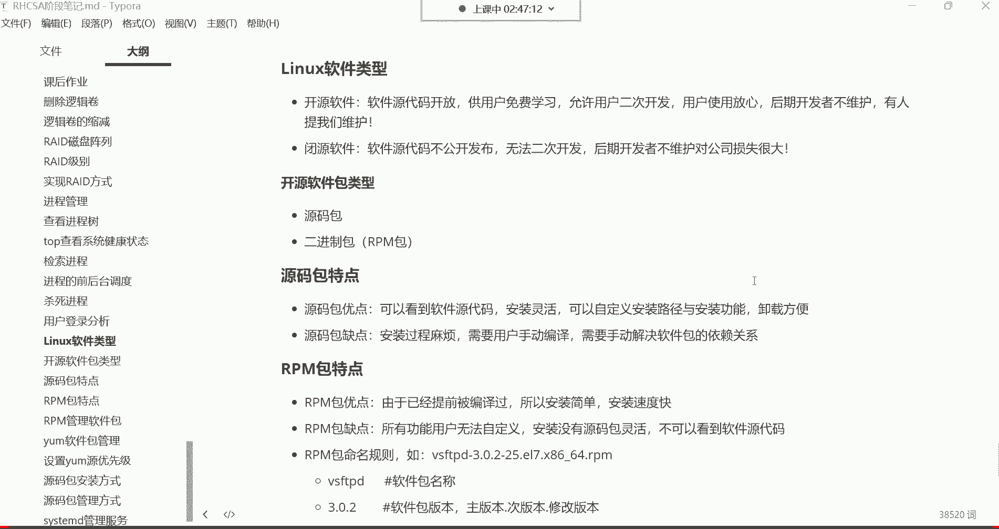

不是说到企业里面就天天敲什么LS，CD cat这些命令，它不是这么回事，主要是我们要去学习，怎么维护服务器里面运行的什么网站啊，数据库啊，这些啊，APD安安APT是乌班图的系统安装命令。

APT你要么是渗透S的系统，安装命令就是针对的系统不一样，所以说我们学习的话呢，就是你得知道我们到企业里面，我们怎么去给服务器去安装，比如说网站数据库存储等等等等，容器怎么给那些软件安装，在系统里面。

怎么去部署它。

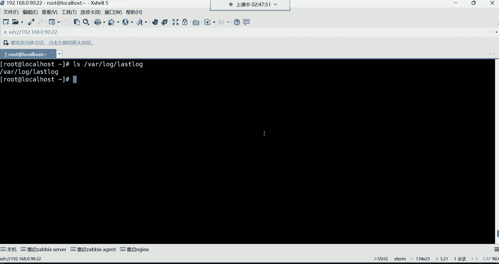

但前提是你是不是得先会安装啊，这玩意儿就像你说我们平时用这个windows一样，如果你用windows电脑的话，你都不知道怎么往windows里面下载软件，你说你这电脑有什么用啊，没什么意义。

就一个废铜烂铁，你用什么功能，他不最终部队通过软件来实现吗，所以我们说这个对于这个软件包的管理呢，就非常的重要啊，是你后期必须要掌握的一个技能好，那接下来呢咱们来说说在LINUX系统下面。

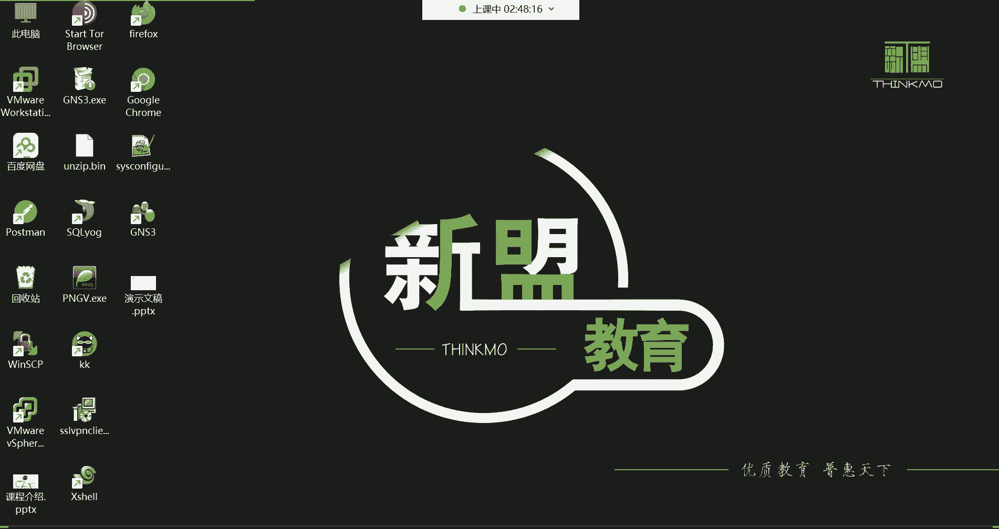

软件包软件包的一个类型，我记得这个我第一天就已经给大家讲过了，我在第一天给大家介绍这个系统内核的时候，我就给大家讲过，什么叫开源，开源呢，就是软件的源代码公开发布出去，用户是可以获取到这个软件的源代码。

允许对这个软件进行二次开发的，就是很多企业呀他自己家用的软件，他觉得这个可能说用别人的软件。

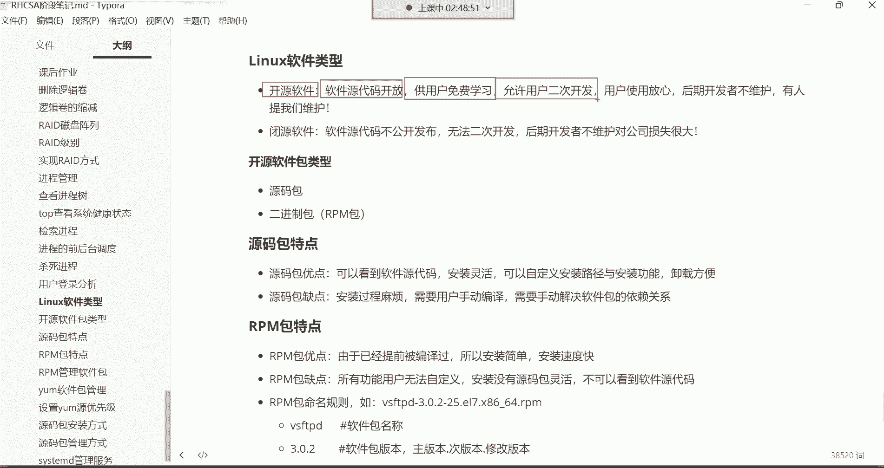

满足不了自己起的需求，你看最典型的就是那个淘宝了，淘宝的话呢。

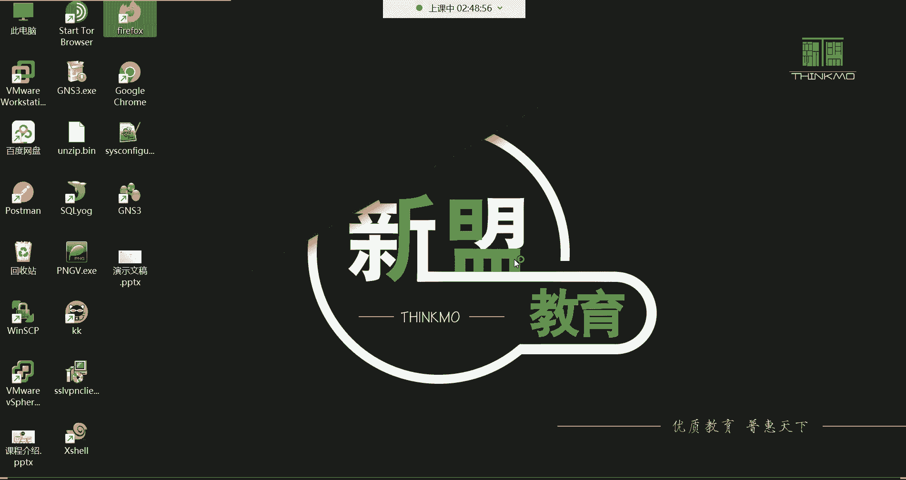

看一下哈，我们去百度去搜一个软件叫做天真，这个天人呢它是一款软件，下面有具体的详细介绍，看了吗，这有个具体的详细介绍啊，我们点进去看一眼百度怎么介绍的，天真是由淘宝网发起的一个web服务器项目。

这个web服务器的后面我们也会学习，他就是一个网站啊，用来搭建网站的一个软件，是在NGX的基础上，针对大访问量网站的需求，添加了很多的高级功能和特性，有时候淘宝现在用的软件叫听诊。

那听诊是在N这个词的基础上二次开发出来的，淘宝觉得NINX不错，但是能满足我，满足不了我自己起的需求，我干嘛呀，哎我在你这个软件的基础上给他改吧，改吧，往里面增加点功能来单独满足我自己的需求，可以吗。

可以哈，所以这个就叫这个我们就叫做二次开发了，所以这种需求呢是非常常见的，但是前提是他想基于别人二次开发，那这个软件得是开源的吧，他也能够看到人家的源代码才可以吧。

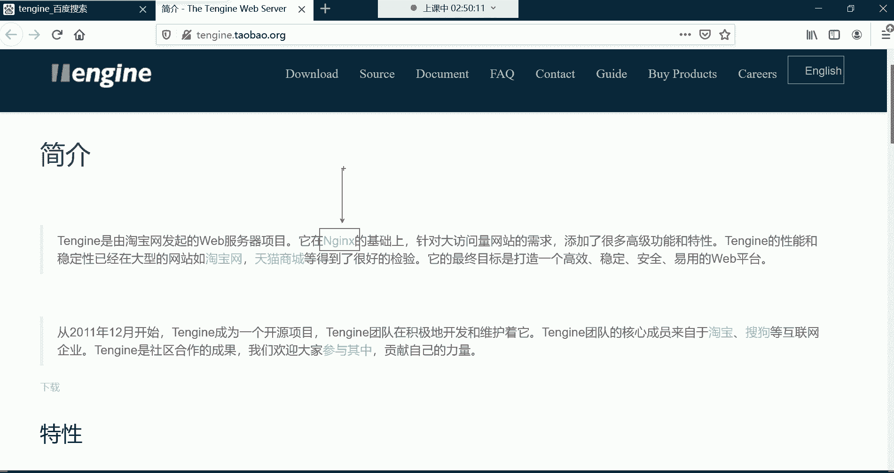

你看不到源代码，你怎么往里面去，比如说对他一些功能进行修改呀。

或者说往里面增加一些新的功能啊，这不太现实了，所以开源软件是允许企业二次开发啊，他把源代码都给你了，就告诉你我这个软件什么语言写的，一行一行的功能，这个用代码怎么实现的，你都可以看得到。

我们后期会学习一款软件叫index ngx。

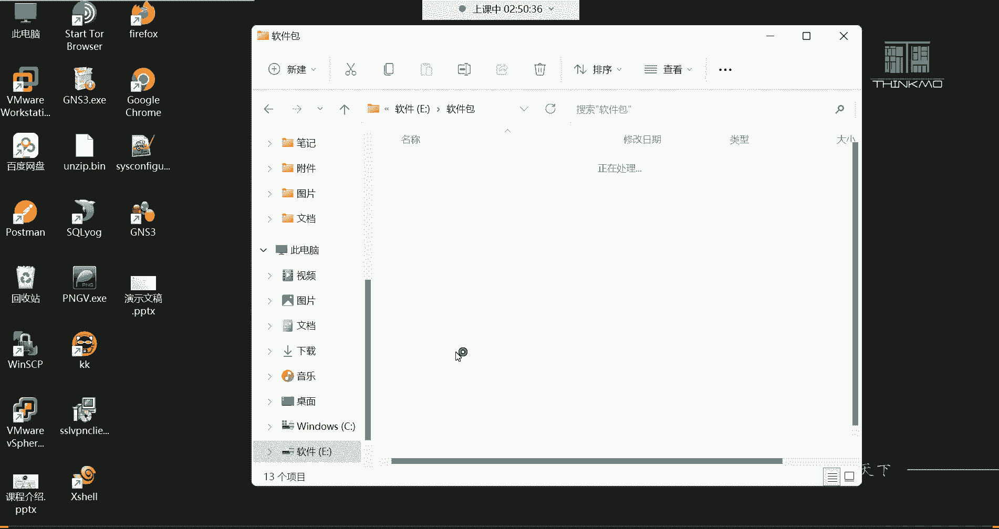

这款软件呢就是我刚刚给你们百度的时候，搜索的，然后我把这个软件呢给他。

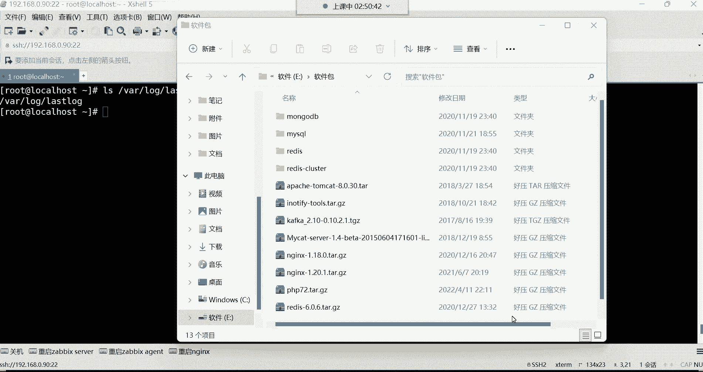

传到我们这个机器里面，index版本呢一叫版本是啊，没传进去是吧，看看现在我想把windows里的文件传到LINUX里面，传不了是吧，YM杠Y，因此安一个包叫LRZSZ，这个软件包。

可以让我们非常方便的，把windows里的文件传到LINUX里面，这是一个跨系统的传输工具。

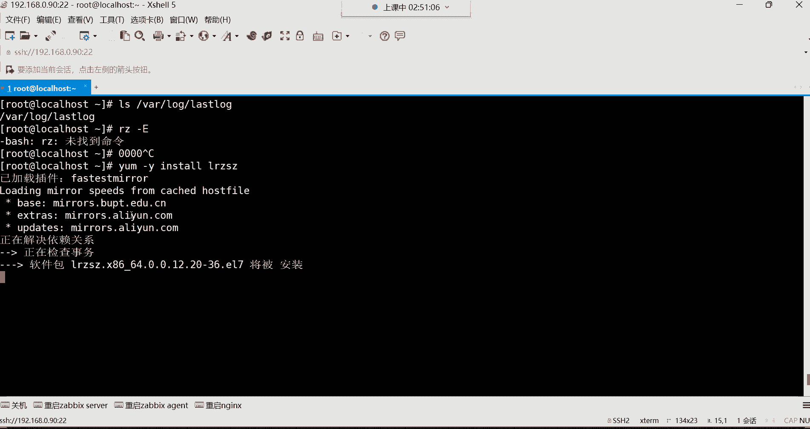

安装一下，安装完了以后呢，我再把这个文件拖进去啊。

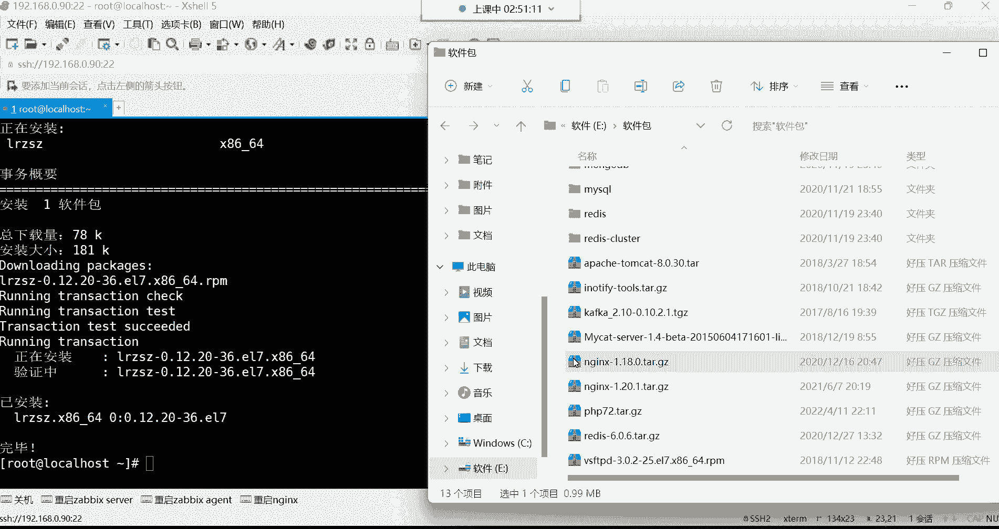

这就进去了，拖进去了哈，然后接下来呢我们来看一下它是一个压缩包，是一个压缩包哈。

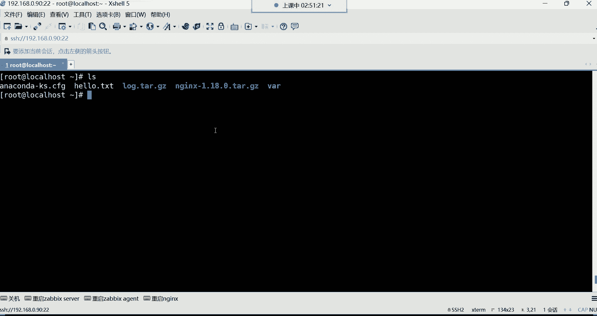

你对你不直接往里拖就行，这玩意儿还需要看吗，直接往里拖呀啊软件包一拽进去了。

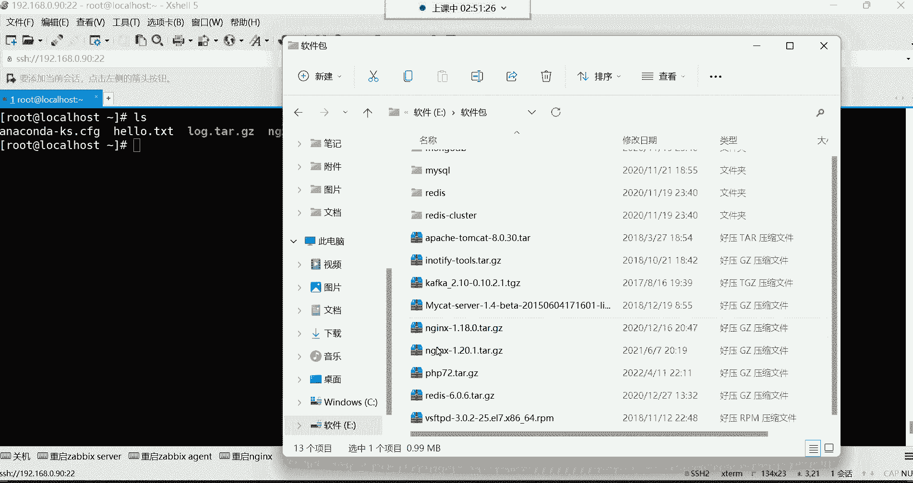

看到了吗，拖进去了哈，看了吗，是不是另外一个1。20。1的，就两个版本不太一样哈，都是压缩包，那是不是得解压呀，前面学过压缩的命令啊，杠XFNDEX指定一八这个版本啊，安装哪个软件，L r c s z。

来给你们发过去，这个包用压安装就可以了哈，解压以后呢，我们进到这个路径里边，CD到index1。18。0啊，进到这个路径之后呢，这个软件是我从官方网站呢下载下来的，那这个软件我在下载的时候。

这里边是有它的源代码的，在SRC这个目录里边，我们CB到SRC这个目录进来以后呢，这里面有非常多的目录，非常多哈，然后我就进到任意一个进到这个call吧，进到这个目录里边进来之后呢。

然后这里面有非常多的文件，大家看一下啊，你看这些文件，你看它的后缀名点C结尾的吧，这个点C就是告诉你，我的这个软件是用C语言开发出来的，ND这款软件是用C语言开发出来的。

那首先我就知道它是用什么语言开发出来的，开发出来了，我已经知道了好，那接下来我看看那这个软件，它的功能怎么实现的呀，当然由于这人家这个项目需要很多文件的哈，所以说这个我们只打开一个文件。

NINX点c vi，厉害啊，那你看到了吗，那这里边你就可以清楚的看到那个开发者，他是怎么用C语言开发的这款软件，以及这个软件里的功能，它是怎么实现的，看到了吗，这就是一行一行的叫源代码了，这就源代码。

这源代码就是ABCD1堆英文字母，对于你来讲，你也不是学开发的，你没有必要去研究它，因为你看不懂能理解吧，啊但是你知道这就是如果对于开发人员来讲，他们能看得懂，他们可以去参考，觉得好。

这段代码实现的功能好像满足不了我的需求，怎么办，我改不改吧，或者说这里面这个软件好像少一些功能，那怎么办呢，好我自己往里面增加一个代码，增加一段代码来满足我自己写的需求，可不可以呢，可以二次开发吗。

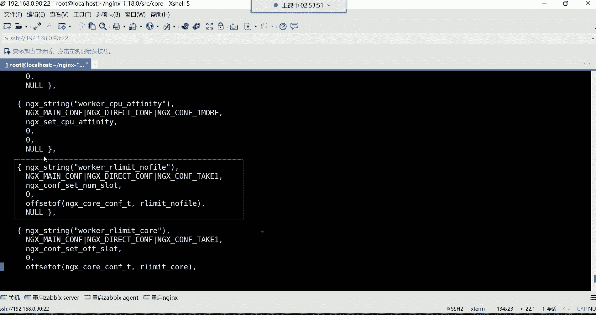

啊这所以说刚刚给你们搜索这个淘宝，他就是这样干的啊，基于N6X基础上二次开发，往里面增加了一些高级的功能，来满足他自己写的需求，能理解吧，这就是开源软件，所以现在开源软件呢我们在整个云计算领域。

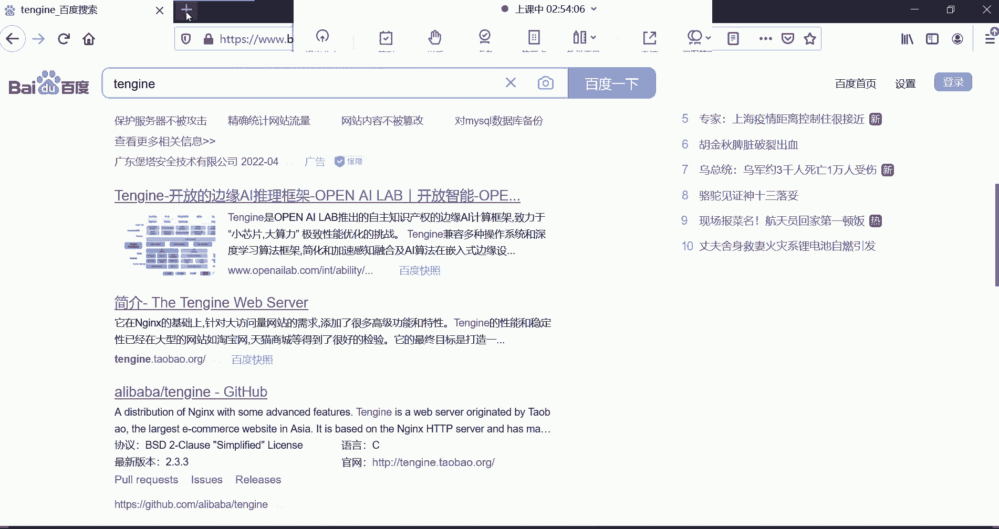

其实大部分也都是学的。

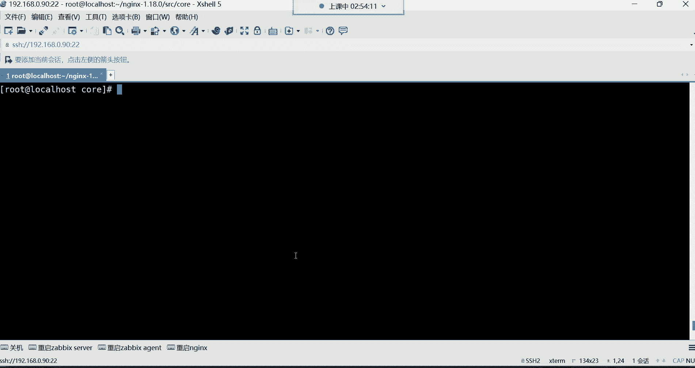

学习的就都是这些开源软件，然后前面我记得我第一天就给你们讲了什么，用户使用放心，后期开发者不维护都有人替我们维护，我觉得这些概念我都给你们讲过，使用放心，就是你不用担心软件的开发者。

往那个软件里面留了一些什么非法代码，比如盗取你服务器资料的，这些都不用担心，为什么呢，因为这种东西啊。

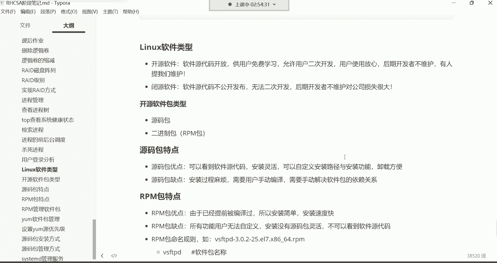

你想别人能够清楚地看到你这个软件，它里面的一行一行代码了，你想想人家这个如果发现这个开发者，往这个软件里面居然放了一条命令，什么命令呢，比如说RM跟RF根下的星啊，你觉得像这种东西，人家看到以后。

那这完全就是破坏我服务器，这个是不是啊哈，所以如果别人发现好，这个软件的开发者，居然往里面留了一些这种代码，那这个消息你想想，他肯定会给他公布到各大的开源社区，那别人一知道这个软件在这个行业就消失了。

能理解吧，所以这也是不用不需要担心的哈，呃有没有专门讲压缩包啊，这个讲过哈，在前面在前面讲过，是上节课上一节课。

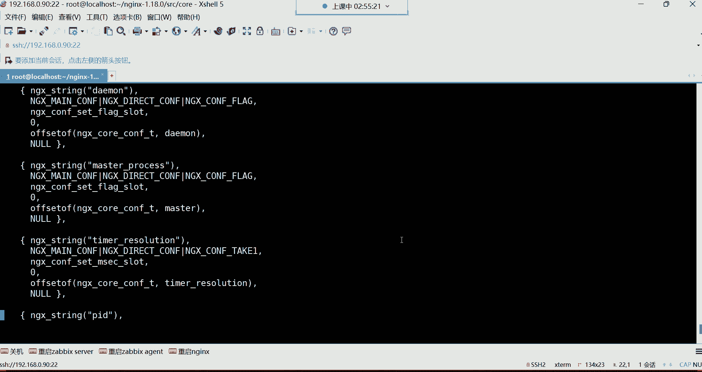

上一节课讲的，你去看一看前面的录屏啊。

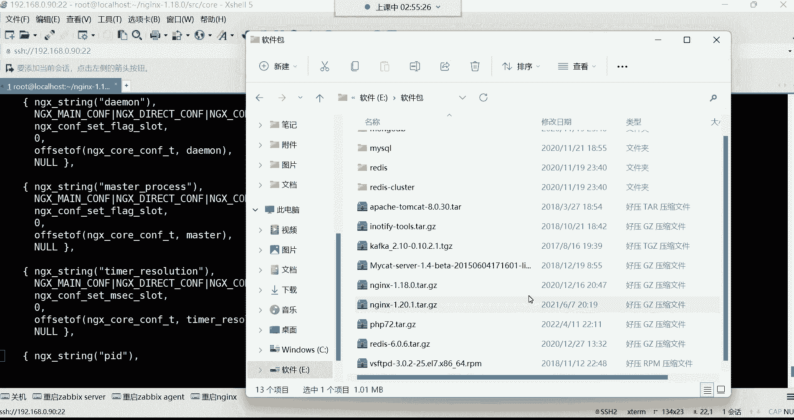

啊这就是我们所说的这个开源软件，而且对于这种开源软件，即便开发者不维护了，是有非常多的，我们说就是爱心人士，他们愿意去对于这种软件做一个什么呢，做一个维护的，比如往里面增加功能，再去发布新的版本。

或者说在对这个这个出现bug，给这个软件去打一些补丁啊，这种都是很正常的，所以这个开源软件的优势非常的多，那还有一类叫B元，B元是谁呢，我们拿这个windows来说。

你们这个你说我们经常用windows，你甭管是win7还是win8，还是win10还是win11，你发现windows系统，你就看不到它的源代码，因为windows是闭源的系统。

没有人知道windows这个系统里面的代码，怎么写出来的，啊可以哈可以用，对于闭源软件呢，一般就是软，它的软件的源代码是不会发布出来的，你就看不到它的源代码，看不到，你就没有办法对他做二次开发。

还有就是后期开发者不维护，对公司来讲，今儿的损失也是蛮大的，怎么大呢，就是说对于这种事情啊，你这个比如说出现问题了，一般呢官方啊他会给你提供一些补丁，但是如果官方说我由于什么原因，这个软件呢我不维护了。

就拿win7来说吧，比如你们公司现在用win7系统，win7出现问题，微软早都不给你推送补丁了，你自己去解决吧，你怎么解决呀，你发现你解决不了，为什么，因为你看不到它的源代码出现问题。

你都没有办法知道是哪个代码出现的问题，你是没有办法去给他打补丁的，嗯讲完了压缩早都讲完了哈，啊没有哈，我们讲到05：30哈，讲到05：30啊，所以说闭源软件呢我们一般用的非常少，闭源软件很少用哈。

大部分都是这些开源的，然后还有个概念，开源和免费，这开源归开源，他有的时候他不一定免费，能理解吧，就是我软件开源，我源代码呢发布出去，但是这个软件呢可能说啊我有一些什么呢，有些功能我需要收费。

你才可以使用的，那这时候呢呃它会有一些收费的项目啊，如果你需要的话，你可以去花钱，能理解吧，OK这就是我们所呃这个我们所说的这个开源，因为有的时候软件开源以后呢，他会给你提供一些技术支持。

就软件我让你用，我给你用，但遇到问题的话，那你需要我的帮助，我会为你提供技术支持，那这时候你就得给我钱了，或者说遇到问题你需要我干嘛呢，我去给你做一些上门服务啊，这时候你就给他一定的报酬啊。

所以说开源有时候它不等于免费哈，所以我们学的话就学习这种开源软件，那对于开源软件来讲呢，它这个软件包啊，又分为源码包跟这种二进制包这两种形式，那源码包什么意思呢，源码包就是那个你们刚刚啊。

我们刚刚看到的这个就是源码包源码包哈。

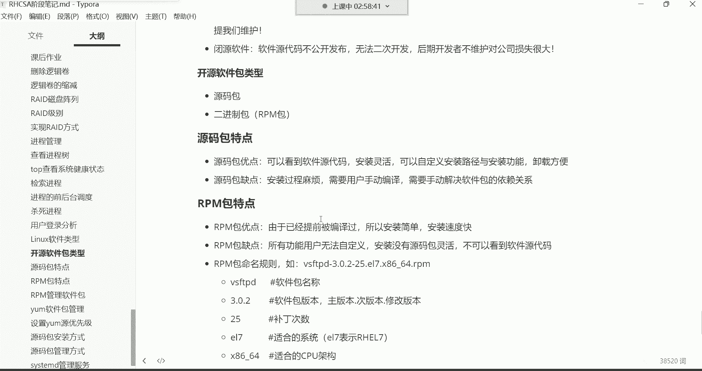

这个源码包的特点就是直接把源代码给你了，直接把源代码连同我，我这个软件相关的需要的什么文件我都给你了，然后你去官网去下载就可以了，这种叫做源码包。

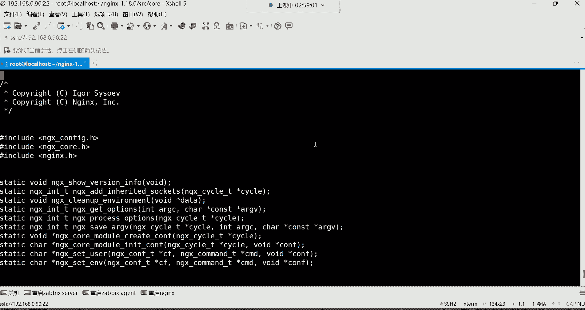

那源码包的特点是什么呢，首先你是可以看到源代码的，因为毕竟一个压缩包里面的这个相关的，比如说源代码啊，还有相关的配置文件都在一个压缩包里面的，你拿过来你解压你就能够看得到了，那安装起来比较灵活一些。

灵活在哪里呢，这源码包啊，它里边首先是这个ABCD这些英文字母的，那最终这些ABCD的英文字母啊，我要给他转换成什么呢，计算机认识的这个010101这二进制数啊，因为最终计算机只认识二进制。

计算机不认识ABCD那些英文字母，而源码包就是大家现在看到的这些。

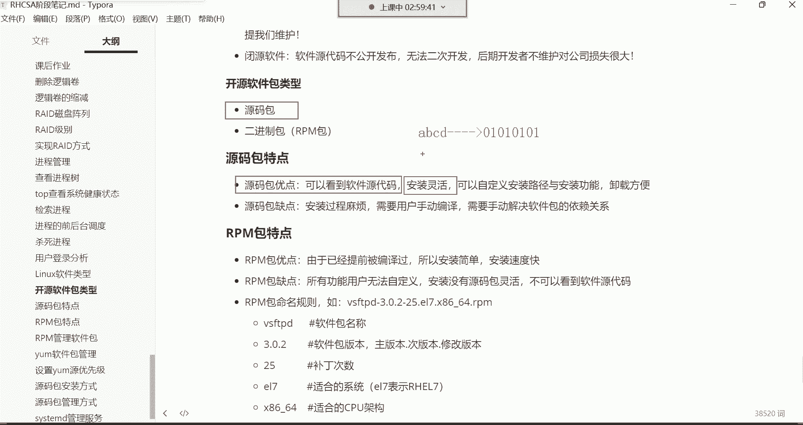

ABCD的英文字母，那计算机不认识，你得给他转换啊。

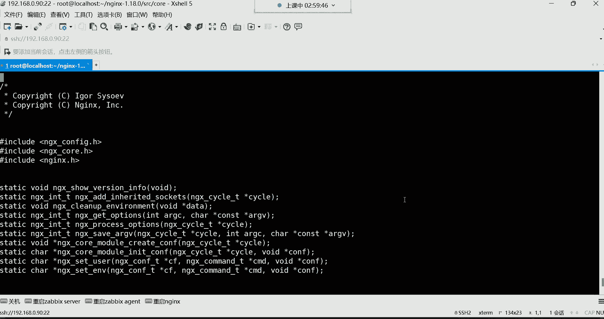

这个转换的过程我们可以干嘛呢，我们可以自定义安装路径与安装功能啊，就是在这个转换的过程中，我就可以指定，我要把这个软件安装在系统的哪个位置，或者说这个软件我用什么功能，我就按什么功能，可不可以呢，可以。

因为毕竟这一个软件，你想想他给你提供的功能非常多，可不是说只有一种功能哈，它那个功能哎可能说成百上千种非常多，但是我们有的时候用不到所有功能啊，用不到怎么办呢，用不到我们就用什么安什么。

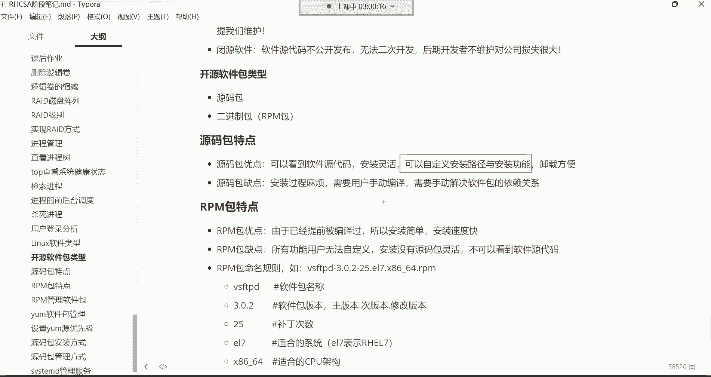

因为在企业里面，你想我们当初在安装这个系统的时候，我就跟你们说过，咱们这个系统如果说我想干嘛呢，我想这个就是对于这个系统来讲，我想让它变得更加清亮一些，我们是不是就是最小化安装的呀，软件包都没有多少。

没错吧，连图形都没有，这叫什么呢，这叫节约资源，节约资源，所以在企业里面，企业服务器也需要节约资源呢，那他节约资源怎么办呢，就是对于一个软件来讲，我都是用什么安什么用不到的，我就不要安了，安它干嘛呀。

是不是用不到，你安排软件一运行好，那它也跟着运行，占用我服务器资源，拖慢我这个呃软件的一个执行效率，是不是就没有必要呀。

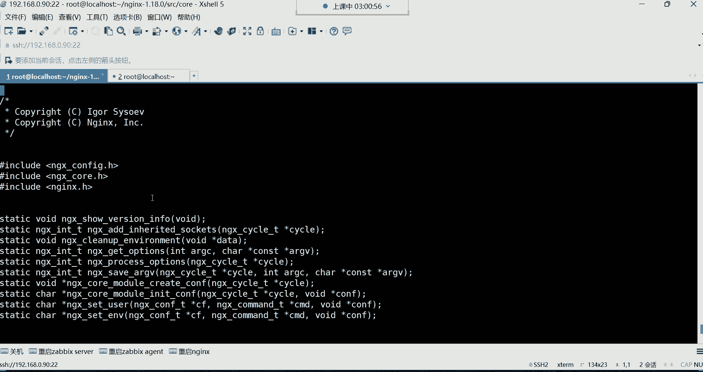

所以一般对于这种情况诶，我们就可以选择这种叫做源码包的安装方式啊，可以自定义安装路径和安装功能，卸载起来也非常的方便。

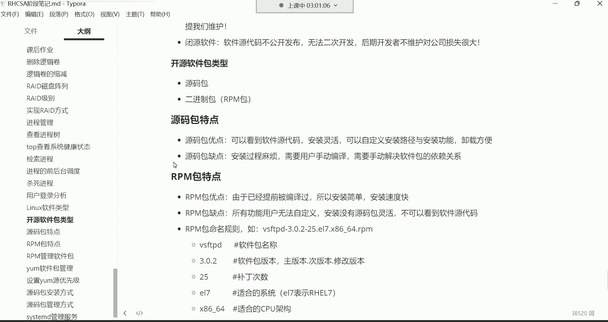

Seed，所以你比如我当初我在安装的时候，我给它安装在哪了呢，我给它安装到我系统的，比如说这个OT目录，我在OT下面建了一个路径，建立一个目录，比如叫NGX，然后呢我就把那个软件安装在这个目录里面了。

那以后我想删的时候，我直接把这个目录一删好，跟这个软件相关的，所有文件就被你删得干干净净，它是没有任何残留的啊，这就指定了安装路径。

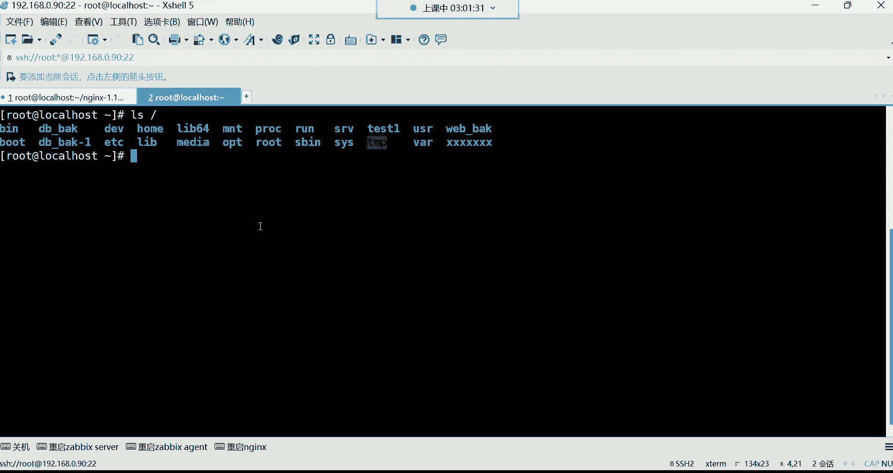

还有安装功能，这是不是很好啊，这就是我们所说的叫做安装灵活一些啊，卸载起来也比较方便了，那缺点是什么，缺点你就安装过程麻烦，就是那个什么呢，这个转换的过程我们叫编译，需要用户手动去编译，它。

就是你把那个AABCD的英文字母。

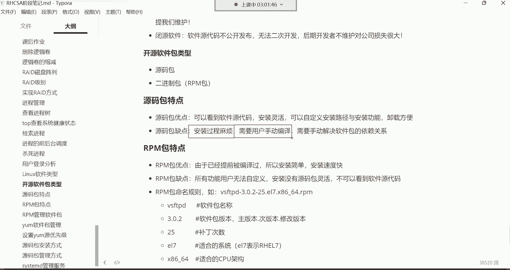

你呢给它编译成计算机，认识那个二进制，这个过程啊，是我们自己解决的啊，是是我们用户自己编译的。

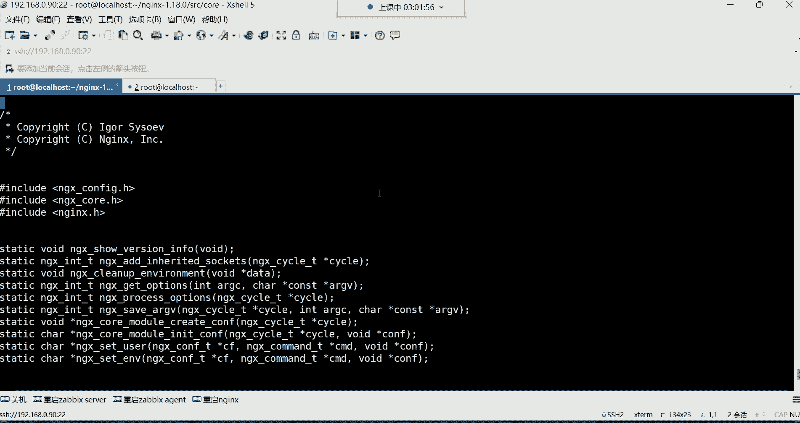

所以编的时候呢，这时候还要解决软件包的一个依赖关系，这依赖关系我稍后再给大家讲啊，软件包软件包有依赖啊，这依赖的得得去自己去解决好，这就是源码包的特点，那接下来呢我们再来说说这个rpm包。

rpm又叫二进制包，二进制又叫RPL包，主要他的二进制包的后缀名，都是二点r pm结尾的，所以有人管它叫rpm包，能理解吧，那什么叫二进制，二进制，不就是已经是这个010101，这个二进制数了吗。

所以说这种东西呢是由于已经提前编译过了，看rpm包优点就是已经提前编译过，安装起来就简单，速度快，谁编译的官方编译的，官方给你编写好了，你拿过来直接安就行了。

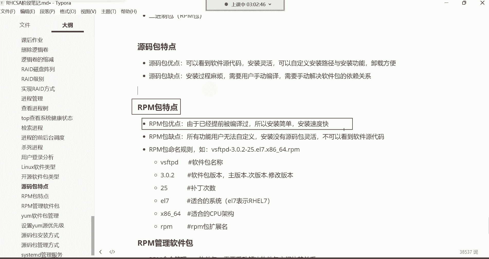

我们前面安装的所有软件包都叫rpm包，我们前面什么在在这个系统里面，什么用YM杠外安装的什么那些软件包，什么LRCSZ这一包都叫rpm包，简单吗，你编译了吗，你没有编译，我们是不是直接YM1键安装了呀。

没错吧，安装完就用了，速度快不快，非常快呀，哼我缺什么，我一搜索，然后我一安装不就可以了吗，这非常的方便的啊，所以这种就是人家提前给你编译好了，几乎所有功能都都有，毕竟人家官方编译的嘛，一个软件。

我们就拿刚刚那个LRZSZ这个包来说，我们刚刚想把windows里的文件传到LINUX里面，那对于这种包的话，我直接安装，是因为这个包啊，它本身就已经是rpm包了二进制了，所以我拿回来这些亚M1键安装。

那我这种安装方式，就是这个软件包里面的功能，几乎就是都有都有啊，因为他考虑大部分人的需求，有的人你说我用这些功能，有的人用那些功能，所以它得满足大部分人的需求，所以就是几乎所有功能都有能理解吧。

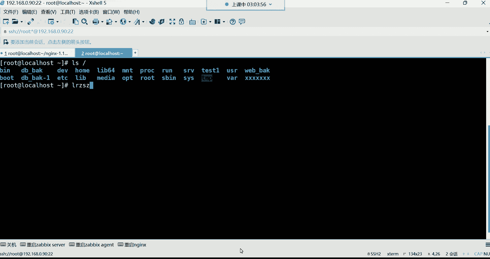

所以这种就是由于已经提前编译过，安装起来简单，安装速度就快了哈，但是缺点就是所有功能无法自定义了，我不能说我想给它安装在我系统上哪个位置。

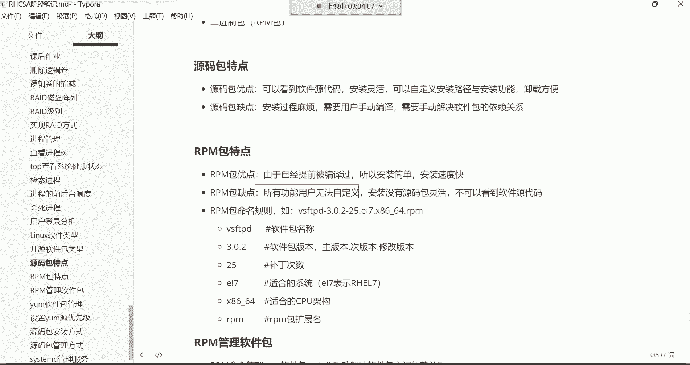

你能自定义吗，你不能，你像我们前面安装的这包，我自定义过，我说我要把这包安装到我系统的哪个路径吗，我没有，我就直接压一键安装了，但是它安装在哪儿了呀，不知道是吧，我也不知道，呵呵呵呵啊。

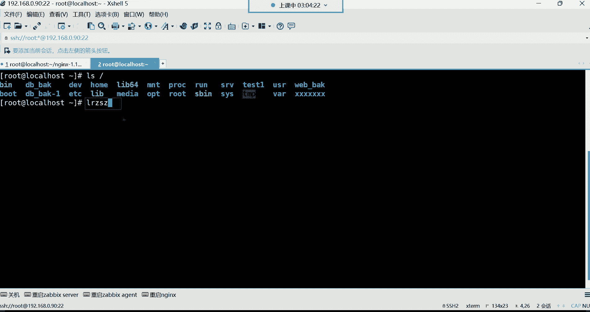

后期可以查赔偿，所以安装起来就不灵活，我不能说我用什么叫安什么，根据我自己的一个人需求去安，可不可以不可以安装路径，你也无法自定义，你也不知道这个软件包，到底安装在我系统的哪个位置了。

而且你还看不到源代码，因为它已经是二进制了，二进制你怎么看呢，010101这些数字你看不到啊，所以说这RPRB的优点跟缺点，是不是跟源码包就不太一样了，那你说老师我到底是安装一个软件包。

到底是源码N还是rpm，用这种rpm的软件包去安装啊，看需求，有的软件呢你就像我们，你像我们比如说我想传个文件。

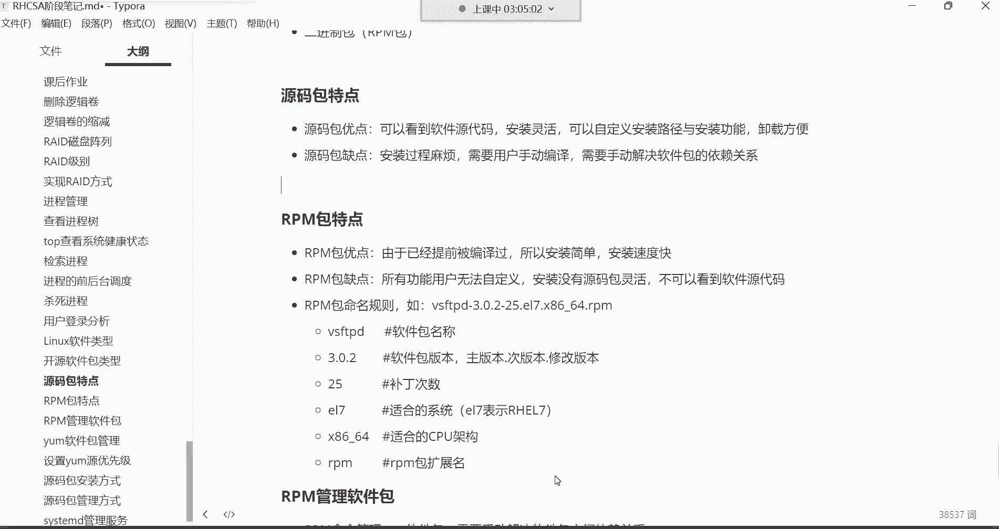

就这么简单的需求，我还在乎是源码编译安装吗，或者说这个rpm安装吗，就一简单的需求，我就需要去传文件，我就快速把包安上不就行了吗，我搞那么麻烦干嘛呀，还手动去编译它，解决依赖关系有必要吗，没有必要吧。

是不是啊，本身这一个软件包它也不大，没错吧，唉但有的时候你像有些软件。

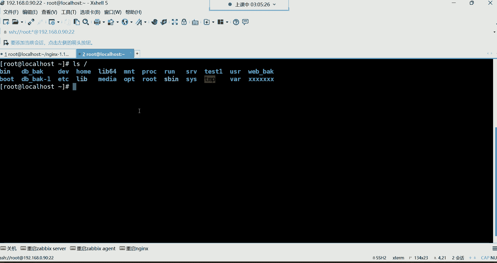

那企业他可能是要求比较严格一些，比如说这个软件，那我就什么呢，我就用这个功能，你就得按这个功能，别的不用，你不要安，你要你就比如拿银行来说，那银行银行的系统就非常严格，银行系统。

你比如说你在部署一些软件的时候，银行系统严格要求我用这个功能，你才能安，不用这个功能，你是坚决不能安的，能理解吧，因为任何一个功能，就都可能导致这个软件出现一些漏洞或者bug。

所以有的企业它要求比较严格的话，你就得去自定义嗯，甚至有的企业我们说延到什么地步呢，我既需要这个功能，但是我不让你，我还不让你安装软件，你说这怎么实现呢，哼哼哼哼，就拿银行，就拿银行系统来说吧。

拿银行系统来讲，我告诉你啊，银行系统有一个什么呢，银行系统是银行系统是最难伺候的，但是也可以理解，毕竟人家需需要提高我这个系统的一个安全嘛，银行的系统，比如说银行现在有一群服务器，我需要干什么。

我我需要你对我这一群服务器做一个维护，但是我不让你往我服务器里面去，安装任何的软件包，因为我们后期学习，比如说一些像什么安师傅之类的，unstable这些之类的，我想去干嘛呢。

我想去对这个服务器做一些维护的话，其实像这种还好办一些，但是如果你要是像那个早期那个骚的萨克，salt这种工具啊，去对服务器做维护，salt这种工具叫salsa，对服务器做批量运维的啊。

可以对服务器进行批量管理啊，比如说我同时给这一群机器安个包啊，就非常的方便哈，叫批量运维工具，那SOUSAG它它是一个什么呢，就是叫做cs架构啊，服务端叫C啊，服务端叫S叫server。

然后这个C呢就是client客户端，这些机器都属于客户机，我要管理的机器，到时候你这个管理机器，你要安装管理端管理的节点的软件包，那这些被管理的节点呢，要安装被管理阶段的软件包，那这时候这些基金。

你如果说不安装那些被管理的，我们叫A证的那个包，你安装你安装不了，你没有办法，没有办法对他进行管理，管理不了你就没有办法进行批量运维，还有后期学习扎贝斯也一样，扎贝斯在这个监控机器上边啊。

有个叫jp server，我要监控我这一群机器，监控他的健康状态，那詹姆斯有有一个特点是什么呢，就我必须得在这些机器上面，每个机器都得安装一个叫java的这么一个程序，不安装，我没有办法对它进行监控。

因为他得基于A着呢去采集这个服务，这个服务器里的数据的，但是银行系统不让你安，银行信，我就不让你安，不让你安，我还得让你给我把这服务器给监控上，你说这怎么监控啊，是不是啊，我本身就依赖于这个A。

真的我才能采集到数据的，但是我压根就不让你按这个包，你采集不了，能理解吧，所以有的企业它就是这样子的，就是我还需要什么呢，哎我还需要你完成这个功能，但是我还不让你安装软件包，这种是最最不好伺候的哈。

那你像我们说这个安装一个包源码包这种唉，我允许你安装包，但是呢我需要用什么功能，按什么功能，这种都算是比较不错的了，所以对于这要求比较严格的企业，可以选择源码安装，如果不严格的无所谓啊，我们就怎么简单。

怎么速度快就怎么来，他是这么回事，能列吧，所以一般就看企业需求哈，很优秀，但是我们呢肯定是两种都得讲，两种都得讲，然后我们先给大家讲这个rpm这种二进制本，我们怎么去管理它，那对于RPR包。

我们先来了解下它的命名规则，那命名规则的话，就比如说啊，当然哈所有的命名规则都一样哈，我们就拿这个VSFTPD来讲，你看这包后面有个后缀名叫RPM，其实看这后缀名，我就知道这包已经是一个编译好的。

二进制的包了，拿过来我可以直接安的哈，所以对于这个包的话呢，我们来了解这个名字代表什么含义呢，这名字啊，我记得我前面也给大家讲过一个软件包的名字，首先有包名叫什么，这就没什么太多可解释，就这包叫什么哈。

然后版本版本的话呢分为主版本，此版本的修改版本前面也讲过，主版本所有的新的功能呃，就是当一个软件有大的改变的时候，它会更新自己的主版本，你就比如说这个王者荣耀啊，当然王者荣耀呢偶尔呢我也去打个一把。

两把的哈，王者荣耀最近不是刚更新吗，那他这次更新的就是自己的主版本，是不是当一个软件有大的改变的时候，他就会更新自己的主版本啊，那是这次这个次版本呢小的改变的时候，它不会更新主版本。

更新字的次版本就行了，修改版本呢，比如我这个软件，我觉得原有的功能啊有些不太合理啊，我对我的原有的功能做改做一些改动啊，他会标到修改版本上面，所以说任何一个软件哈，只要是这种rpm包。

它都是遵循这种规律，主包名，然后呢紧接着就是我这个软件包的版本，主版本，次版本给修改版本版本对于我们来讲呢，你只需要知道就行，它就是代表一个软件，包括一个发展历程，从这个软件诞生到现在为止。

经历了多少个阶段了，然后后面这25代表什么意思呢，这25代表这个软件包打过多少次补丁，出现问题了，我给他做啊，做什么做补丁，然后25次，那后面这点EL7，这个是适合的操作系统，六七啊，当然六七可以。

是不是cs7也可以啊，因为他们两个毕竟都是cs，不是基于这个real克隆过来的吗，好好EL就代表是红帽的real，它的全名叫做什么，叫做red hat enterprise linux。

那红帽企业版的系统而取的是首字母HEL啊，简写成E7了，然后X86614，X86614的话就是CPU架构了，软件包适合什么样的CPU架构，64位的，那现在CPU几乎都是64位的了，然后rpm告诉你。

这就是一个二进制包，所以以上啊我们安装的前面的所有的包，都是遵循的是这个一个规律，都是遵循这个规律哈，所以以后你看所有的RPL包，你就都知道最左侧是包名，然后呢就是版本最后呢适合安装的系统。

然后CPU架构好了，那接下来怎么管理啊，对于这种包我怎么安装啊，好有个依赖的问题，这个依赖的问题，RPR包首先有一条命令叫RPL命令，然后我们在用rpm这条命令，在管理这些二进制包的时候。

注意RPL命令需要我们手动解决，软件包的依赖关系，这个软件包的依赖关系啊，我给大家讲讲什么叫依赖哈，我这里面曾经画过一个图，因为它的依赖分为很多种形式呢，哈哈这依赖分为树形依赖，环形依赖，模块依赖。

我们先来给大家讲讲这个树形依赖，树形依赖就像一个大树的分叉一样，比如我现在我想安装一个软件包，叫A那你这个软件包如果想安装成功，它需要BCD这三个包，那你怎么办，树形依赖，先把依赖包安装上。

再回过头来安装A这个主包，这样才可以，这叫树形依赖，先安依赖，再回过头来安主包，那还有一种叫环形依赖，环形依赖，比如我还是要安装A这个包，但是它的特点什么叫环呢啊，什么叫环形啊。

一个圆我想安装AA说我依赖于什么呢，我依赖于B你得先去安装B好，那你在安装B的时候，注意你永远得是先安装依赖，才能回过头来安装这个主包的，这主包无法直接安装啊，所以你只能先去解决这个依赖。

安装这个B你在安装B的时候呢，B说我也需要依赖，也就是说现在依赖也需要依赖了，他作为一个A的依赖包，它也有依赖包，他说我依赖C，你先把C给我安装上，好像说这个你没有办法，你只能去安装这个C。

你在安装C的时候，C说我也需要依赖，我依赖于D，你先把D安装上吧，你再回复再回过头来安装C，那这叫什么呀，是不是我们说叫做这个有点类似于那个什么呢，环环相扣了吧，那这时候你再安装D的时候。

D说我也需要依赖，我依赖谁呢，我依赖A，你去按照A那你发现这一圈下来，你一直在解决依赖关系，解决来解决去解决到谁了啊，回到原点了，回到原点了，那是不是又得重新来一遍呢，好那D说我依赖A。

你只能去安装A吧，那你再安装A的时候，A说好，我依赖于B，你去安装B吧，你在按B的时候，别说我依赖于C，你得先安装C，你在安装C的时候，C的时候我依赖于D好，然后你在安装D的时候，D说啊。

我需要A你却给我安装A呀，一圈一圈套一圈，有完了吗，没完了，死循环了没错，你发现这一天呢你别的不用干，你就安装包了，安装到最后呢，哪个也没安装成功，是不是啊，所以这种依赖关系就很烦很烦。

还有一种关系叫什么叫模块依赖，这种依赖更烦，需要文件，需要模块文件，这模块文件一般怎么来呢，都是由软件包提供的，就是比如说我安装这个某个包的时候啊，比如我要安装A这个包。

A这个包有可能依赖于一些其他的功能模块，比如什么叉叉点OS这种模块好，那这时候这模块它不像软件包，不像软件包哈，比如说你在按A的时候，A说我依赖B那你去按B就行了，但是如果A说我依赖于一个文件啊。

当然这个叫模块文件，叫叉叉点OS，但是这个模块文件怎么来的呢，这个模块文件最终是由一个软件包提供的，你得先去找到这个模这个模块文件所需要的包，那你得把这个包安装上，它这个包到底是谁呀，你不知道啊。

他不告诉你，他不列告诉你，所以这就是模块文件也很烦，能理解吧，都比较烦哈，所以这RPL命令，所以对于rpm命令大家在学习的时候呃，只需要学什么呢啊，只需要学习他查询的部分就可以了。

查询哈我们后面学的时候再讲，然后接下来我们在接下来呢，我们在学习软软件包管理的时候，有一个有一个问题要给大家先讲清楚啊，就软件包在哪，就会涉及到一个叫软件包的来源，我们在windows里边。

我们在学习这个软件包管理的时候。

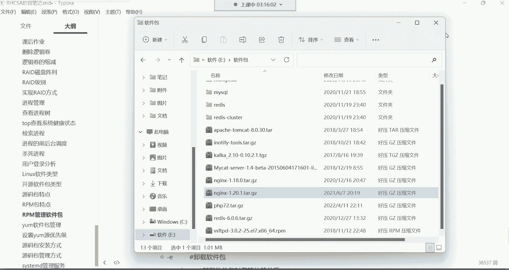

我们说软件从哪下载呢，唉这软件我可以从软件商店里面去下载，软件商店，那非常多什么呃，电脑管家里面就有软件商店是吧，还有这个什么腾讯软件商店啊，非常多，你只要是百度一搜，你发现你想下什么呢。

这都比较简单了，就但是在LINUX里边软件包在哪呢，这软件包的来源呢，它分为网络跟系统，如果是对我们自己系统的话呢，我们系统里面也有一些软件包在哪放着呢，在镜像文件里面，就是我们当初在安装系统的时候。

我们用一个镜像文件，这个镜像文件呢你们是你们手里面都有。

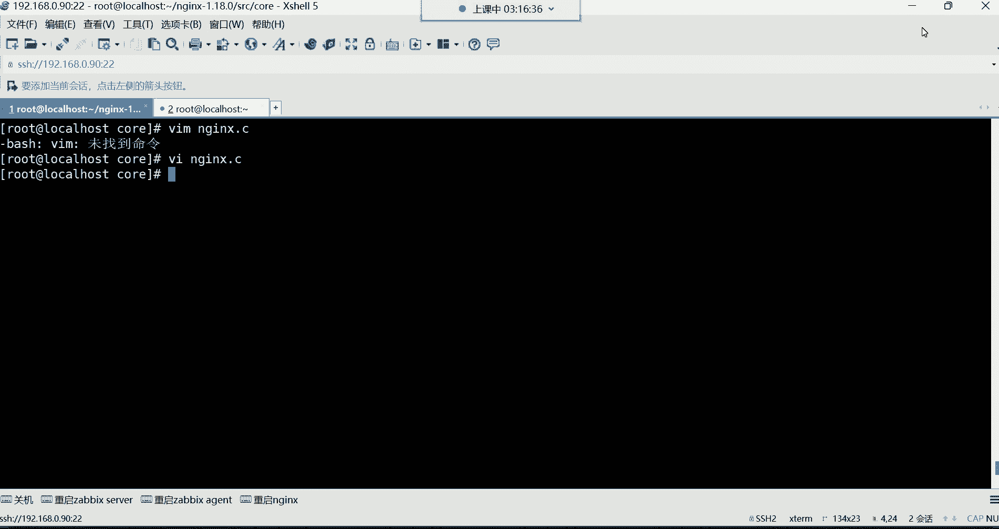

我们安装系统的时候，那个渗透S7那个镜像文件，它的大小是多大的呢，看一下哈，属性这个镜像文件大小是，加上四个多G，这是不是，这是不是我安装系统时用那个4S7，那个镜像文件安装的呀。

然后它的大小是四个G左右啊，大小四个G左右，那你知道在这四个G里面其实大部分是什么吗，如果说光一个系统再加个内核，它占不了多大空间，一个内核才几百兆，一个内核才一一啊，一个内核才几百兆哈。

连1G都没到呢，一个内核一个系统也没有多少啊，那这四个多亿都是软件包，这四个G4个多G都是软件包哈，所以这里面有大量的软件包。

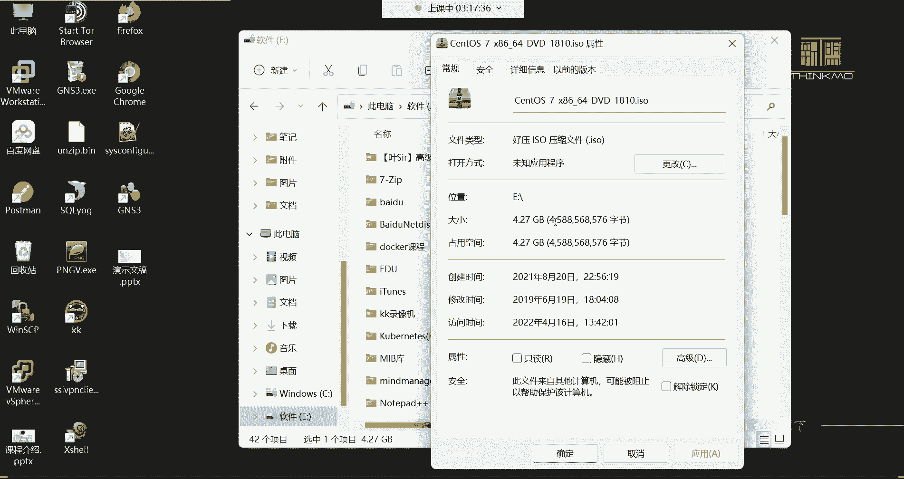

那我们怎么用呢，镜像文件给我们自带了很多软件吗，我怎么用呢。

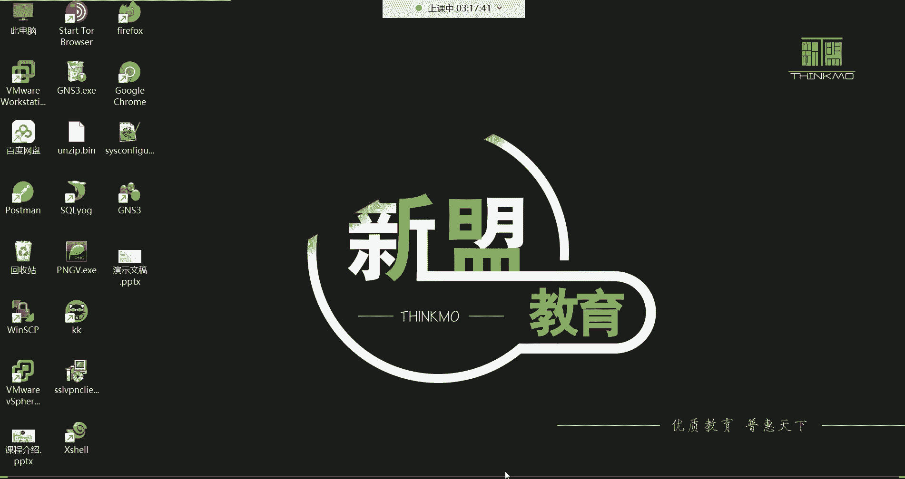

那镜像文件在哪呢，镜像文件是在我们的系统里面的那个DV下边，DV下边是不是有个设备叫做SR0，S r0，它是我们系统的光驱设备，在早期没有虚拟机的时候，那个我们说叫老式的物理机。

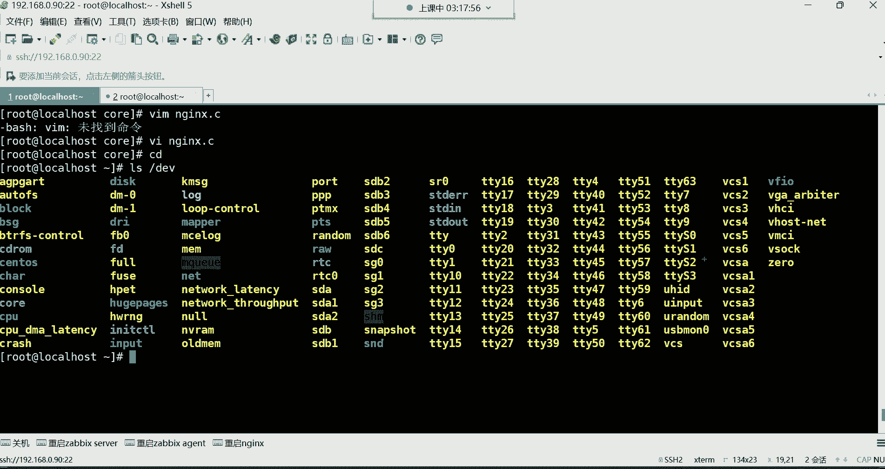

那老式的电脑，它那个机箱里边就有一个让你插光盘的地方。

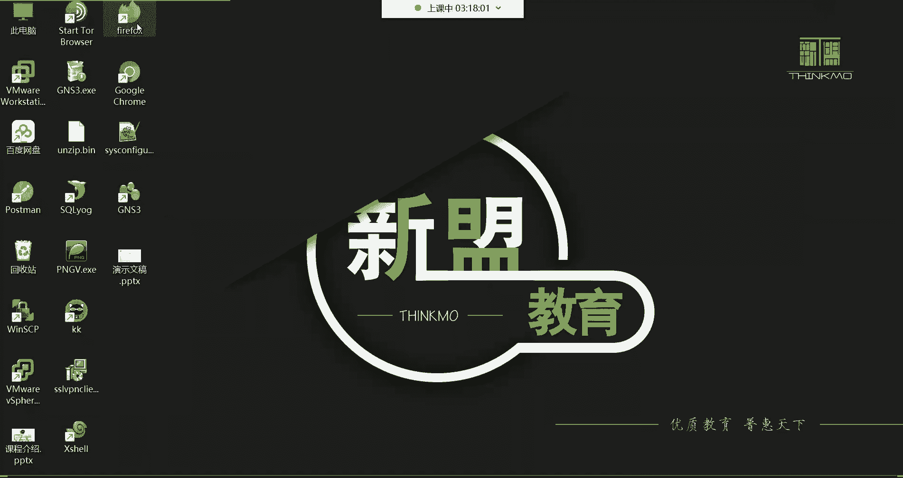

叫光驱。

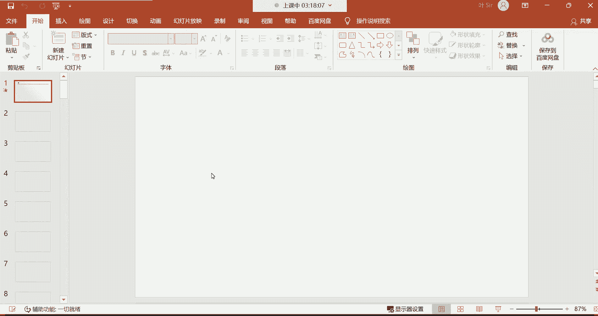

老式的电脑，就是那种，非常古老的那种电脑啥的，它是不是有个机箱，这个机箱这里边，啊我们说这个这些小按钮啊，这些小按钮，老式电脑有一些什么开关小按钮是吧，啊然后还有一些插这个什么耳机的地方。

上边是不是什么有一些插耳机的口啊，没错吧啊除了有一些插耳机的口以外，它其实还有一部是什么呢，我告诉你，还有一个就是一个能够让你插光盘的地方，它有个叫光驱，有叫光驱哈，就在这里边对，就在这个机箱上面。

就在井上面，然后呢他这旁边还有个还有个按钮，不知道在我忘了是在旁边还在上面呢，会有一个按钮，哎这个按钮你按这个光驱就弹出来了，它就弹出来了哈啊它一弹出来，我们就可以把光盘放在这里面，然后给它推回去。

对那光盘里边其实也有很多的软件包啊，系统一识别你就可以用了啊，这是老式的电脑，有这种光驱，但是虚拟机里面的光驱其实也有，但是呢它是什么呀，就是用SR0来表示的，也就是说我们的镜像文件就在SR0里面。

我们的镜像文件就在S20里面，那S20它有个链接文件，软链接叫CDROM，所以你直接看DV下的CDROM，它指向的是不是S20，没错吧，那链接文件是不是跟这个原文件是一样的呀，他们都是相互同步的。

所以你用哪个都行，但是你不能直接访问的，你说我直接，我直接可以直接看这个DV下的CDROM里的内容吗，乱码乱码了，硬件设备看不了，看到了吗，乱码了吧，那你说S20我可以直接看吗，DV加的S20可以吗。

S20可以吗，乱码乱码，不行，所以说这种硬件设备呢就像光，就就就像我们前面那个分区一样，是无法直接使用啊，那怎么办呢，挂载挂载哈，所以创建一个目录一般挂载到哪里呢，系统给我们提供一个叫mt的目录。

这个目录就是给我们提供一些叫做光驱设备，挂载点，所以我们就直接干嘛啊，我们可以直接在mt建个目录去建一个什么呢，比如建一个渗透S目录，建什么都行啊，叫什么名字都行，接下来我就M把DV下的CDROM。

是不是挂载到我当前的目录，是不是可以啊，那这目录里面有没有数据啊，有删掉吧，IM杠F星删了，然后接下来我们就mt，把DV下的CDROM挂载到当前目录过来以后，回头看啊，当然退出，然后再进去直接看吧哈。

mt渗透S是不是这里面看到一些文件啊，跟目录啊啊软件包在哪，软件包在这叫pt，这个能翻译一下吗，这不是看到了吗，package是不是打包的意思啊，就就打包这里边就有很多的软件包。

它把所有的软件包都给打包到这个，packages这个目录里面去了，所以接下来我们就可以针对于这个，这里面的软件包去下载多少个呀，看一下我们CD到mt的这个目录里面，然后打开P。

你看这里边是不是有很多一点，rpm结尾的这个文件呢，这是什么呀，这就是软件包，软件包镜像文件给我们带的好，那多少个呢，我们可以这样啊，统计一下l x s pack，然后WC杠L，4000多个。

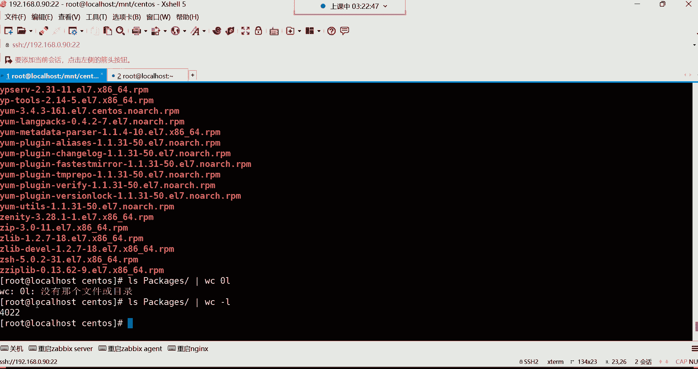

看到了吗，你们现在知道，为什么我们那个镜像文件那么大了吗，为什么它四个多G了吗，这里面有4000多个包啊，4000多个包哈啊，都是软件包，就这还不算最大的，你要去cs官方去下载他那个大的九个多G的。

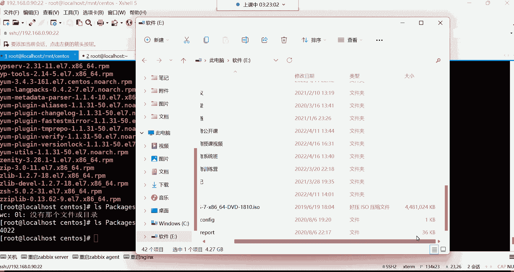

那里面有1万多个包，你比如说就是这个镜像。

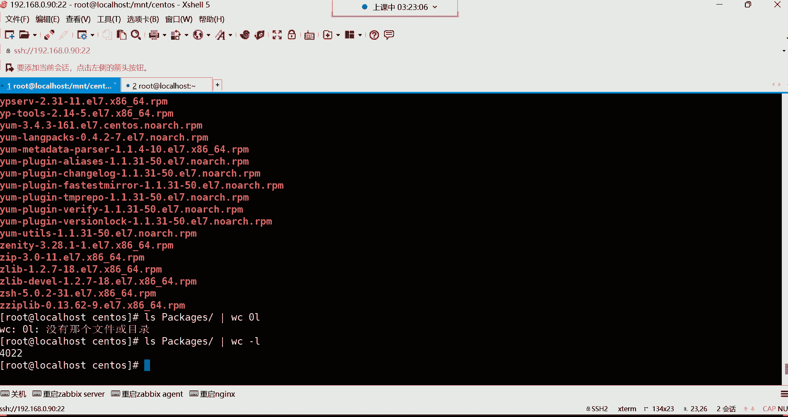

我在下载的时候，我特意挑的一个是什么呢，这种比较小的，有特别大的，在那个森川市官方。

我们去访问一下CENTOS点挂机，我那个镜像文件就从这下的，然后这里面呢你看有个download，download的时候可以下载渗透SLINUX，看到了吗，然后点一下渗透SLINUX看一下哈。

嗯选择是嗯，云啊啊，这是container云的云平台的哦，在哪儿呢，我找一找哈，找一找，翻译一下吧，嗯在页面旧旧版本，我看看原先的旧版本哈，旧版本，IOS获得IRISO。

这现在这官方啊搞得真的是花里胡哨的搞得。

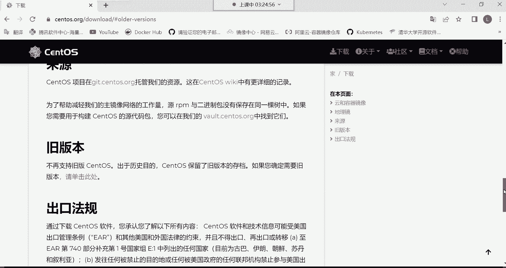

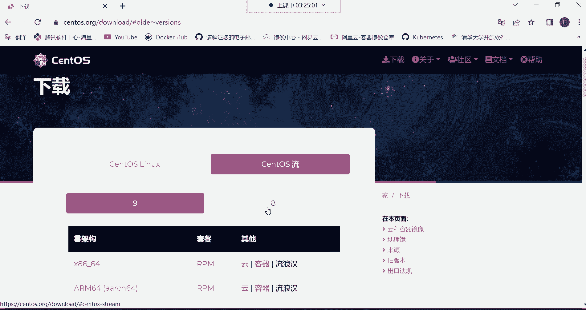

这九都出来了，看了吗，这不是酒哈，那不是九版本哈，太慢了太慢了哈，算了哈，我们就不浪费时间了哈，我们就就不找了哈，有九个多G的哈，你看他那个他那个就九个多G，这九个多G的那里边一呃。

是有1万多个软件包的，那1万多个包，那可以说是几乎涵盖了我们平时工作中，工作或者学习用到的大部分的依赖包了。

可以这么说吧啊所以我还没有下那么大的，因为太浪费时间了，我就选择这个比较小的，比较小的，主要是就是软件包不太一样，你看他这里面还有个镜像，4347的九个多G看了吗，这里面都是软件包，都是软件包哈。

嗯好了哈，然后我们知道软件包了之后呢，我们想下载，那接下来我们为了方便，我们进到这个pg这个目录里面去，进入这个目录进来之后呢。

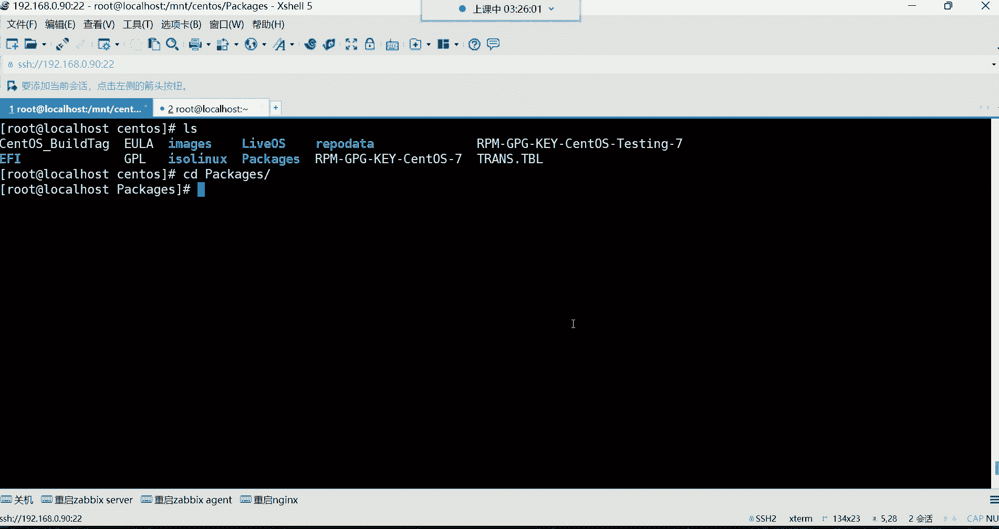

我们说说这个怎么用这个命令格式，那命令格式呢rpm这个命令的选项非常的多，rpm命令本身它就是一个怎么说呢。

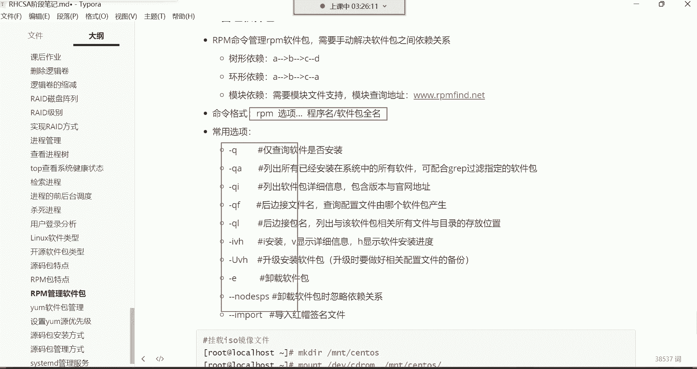

在早期非常重要的一条命令，所以你在慢rpm的时候，然后你在看的时候，你就会觉得这条命令的文档都非常的多哈哈，看选项哈，你看可以获取帮助的选项，看版本的选项啊，这些都是选项了哈，看到了吗，有很多长选项。

有很多短选项，看到了吗，这还没完事呢，你们以为你们以为的看到了吗，这选项看了吗，非常多哈，看到了吗，啊这些例子了哈，这些例子了啊，这是短选项了，这是啊，这是短的了啊，这些短选项。

好没了没了没了嗯啊这是它的一些，这个你看叫database啊，就是数据的意思啊，数据库它有一个数据库，所以说这个命令啊，现在的话就没有应用的那么广泛，我们学的话，那也没有必要去。

比如说把所有选项都给大家讲一遍啊。

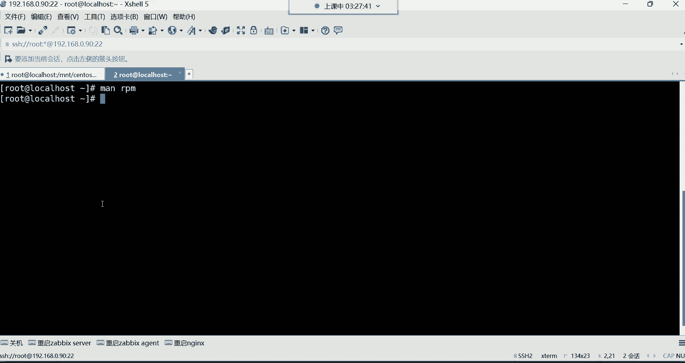

就没有那个必要了哈，所以现在对于这条命令来讲呢，我们我已经给你们列举出来了，最常用的一些选项啊，就这些就这些哈，那命令格式呢我们拿过来。

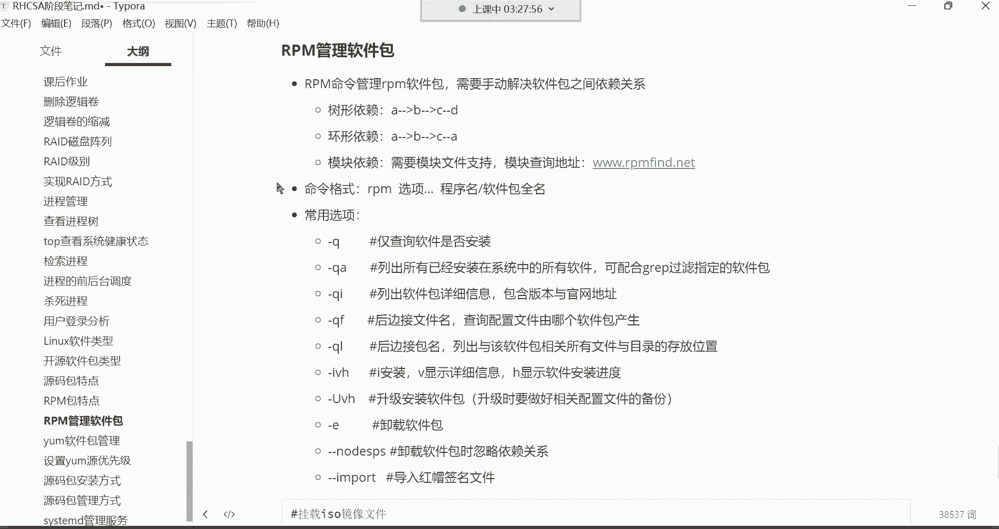

这命令格式呢也非常非常的这个，非常非常的简单，主要就是选项不太好记，因为选项太多了，我们先说这条命令哈，这条命令我们我如果说我想下载软件包的话呢，它的命令格式rpm跟选项，但注意下载的时候。

如果你没有载软件包的所在路径，你这个位置后面要指定软件包的位置哈，它不会自动能够帮你找到这个包在哪，所以你需要指定路径才可以，那如果我们已经在这个软件包的目录里边了，我们是不是就直接想下载什么包。

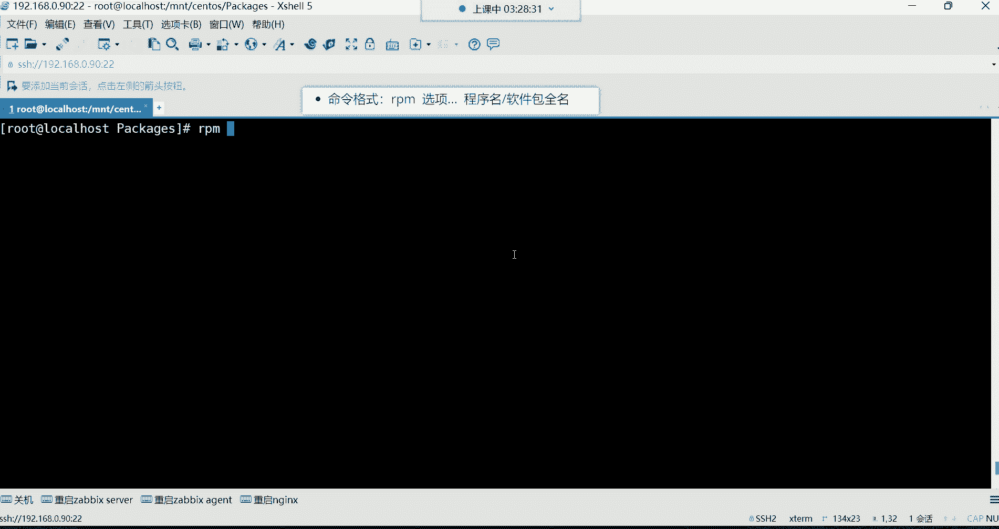

就指定就可以了呀，好但是得先通过选项选项啊，IVH是安装的意思，然后这次是三个选项哈，三个选项合并了，你看杠这个杠I是安装的意思，V是安装的时候显示详细信息，然后H呢是显示一个安装进度。

给你显显示个进度条，所以这三个选项是安装的时候一个叫黄金组合。

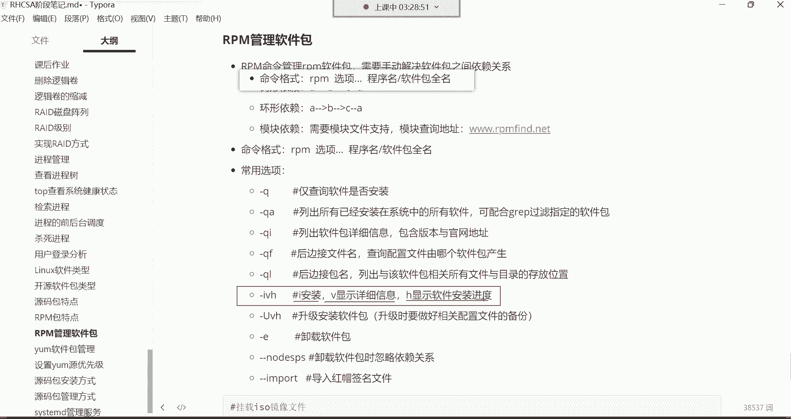

那我们就杠IVH后边呢注意啊，跟上软件包全名，如果我们是安装的话，就一定要跟上全名，你比如说我想安装那个叫VSFTP这个包，我们这个软件包我们后面也会讲哈，你先甭纠结，说哎呦，老师这包干嘛用的呀。

先甭纠结，我们后面会讲这个包的，现在就讲怎么去安排，那你看我们现在对于这个包来讲，我现在想安装回车，你光指包名不行，光指报名是不行啊，他说失败了，他以为这是一个目录呢，看到了吗。

他以为这是一个文件或目录呢，所以这时候你要指定它的全名，那全名你说这谁记得住啊，这一个包名字那么长，包括版本，这都不好记，这谁记得住啊，肯定记不住，所以怎么办呢，tab键补齐。

按tab键tab键就直接给你补齐了，只要是这个包在你当前的这个路径，有的话，它它就能给你补齐，如果没有的话，你就没有办法帮你补齐，但我们能补齐，就证明它已经有了好，那有了之后呢，回车嗯。

安装好了就这么简单，已经安装上了，你发现这个系统安装软件包，它就不像windows，那windows你得得先得先得先选择，我到底是这个高速下载还是普通下载，选完以后呢，啊我得这个下一步下一步确认吗。

确认完成安装，但是你看这个系统呢，你一回车好包已经给你安装上了，没有那么多什么这个那个的就是简单粗暴，效率高是吧，那安装好以后呢，我们怎么办呢，我看呢我怎么查呀，我不能就光看这是这这叫详细信息吗。

其实也算也算详细信息了，再加个进度条，一个简陋的进度条是吧，那我想再确认一下，这到底有没有真的是成功安装啊。

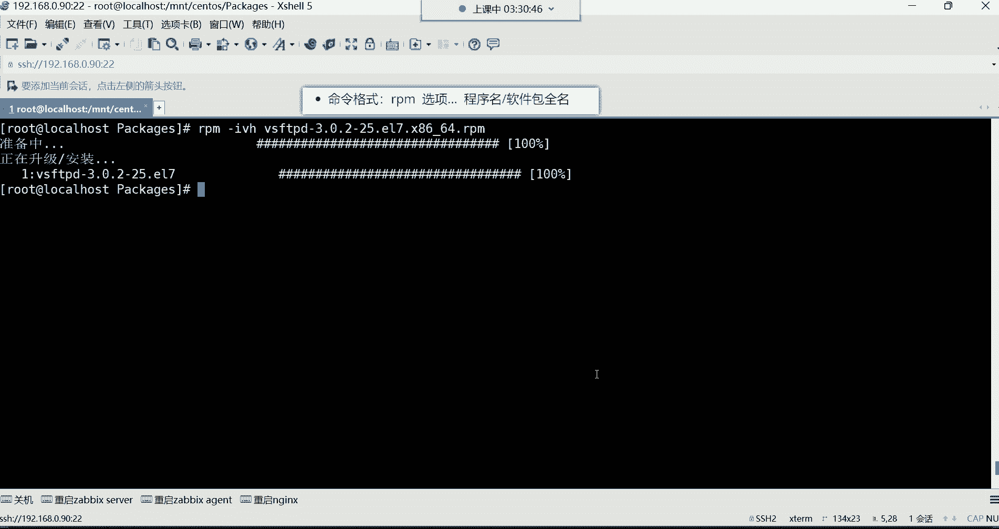

啊查询是它的非常重要的一个功能。

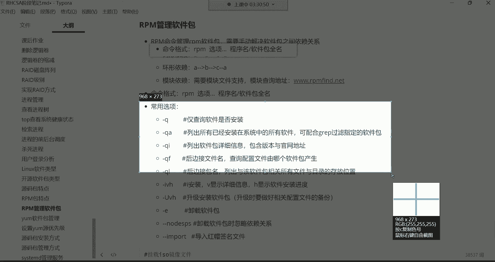

来把这个查询我给他拿过来。

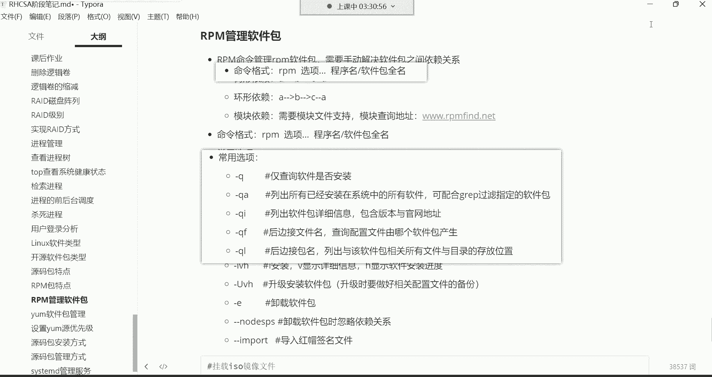

rpm的查询功能非常的强大，这也是大家要掌握的，第一个杠Q叫仅查询软件是否安装，那就rpm杠Q查在哪查都行啊，只要这个包安装在你的系统里面，你在任何路径查都没有问题，好就是我现在要查后面跟着什么呢。

跟上包名vs FTP t回车能查出来吗，能注意，只有在安装的时候才需要指软件包的全名，后期你不是说你比如说我查询我要卸载，只需要跟它的程序名就行了，其实大多数程序名就是它的包名。

啊因为毕竟这包安装在你的电脑里面，就是你电脑里面的应用程序嘛，所以我们我们就习惯管它叫程序名，其实就是它的包名好，那这个时候看到了吗，查出来了吧，查出来以后注意，安装以后就没有那个点rpm了哈。

毕毕竟你只有下载的时候，它有一个点rpm的，安装以后就没有了啊，这是查询杠Q，然后下面还有一个QA啊，当然你这查不一定非得查这个软件包，你说我想查别的，查谁的不用，我想查有没有一个包叫ABCD的，有吗。

没有没有，就证明它没有安装在你的系统里面，没有查出来哈，他说未安装，就证明你系统里面没有这个包，那确实我们没有安装过这个包哈，那还有一个叫rpm杠QA，这是干嘛呢，查询系统里的所有软件已经安装过的。

注意哈，它是列出所有已经安装在系统里的软件包了，就是我系统里面有多少个包已经是安装过的，我可以这样去查，但是查以后呢，你可以先WC统计一下，因为你那样看根本就太乱了，你看我们系统里面322个包啊。

具体的每个包就可以从这看了，你说那我想从这个众多的包里面搜索一下，可以吗，可以啊，你可以这样用grape grape给搜索pp，有没有没有啊啊没有跟P相关的包啊，那有没有那个跟vs f相关的包呢。

回车有，因为它本身是模糊过滤嘛，group本身就是模糊过滤，你输入vs f，只要是这个包名字里面包含这三个字母的，它都给你过滤出来了，你说有没有一个叫SH的包呢，有看到吗，诶open SSH看了吗。

有没有个叫什么JDK的，有没有呢，JDK没有没有哈，好这就是怎么结合杠QA去查，因为有的时候我们真的是记不住一个软件包，它连包名可能说我们有的时候都记不住，有的时候都记不住啊，而且有的包非常变态。

这包名跟程序名不是同一个名字，我跟你们讲，有的包就非常的就非常的变态，你就比如说我们后期会学习一个这个什么呢，一个计划任务啊，不是就玩手叫NTP时间同步这么一个技术。

那NTP呢就是到时候会帮我们做时间同步的，给服务器同步一个标准的时间，那时候我们需要安装软件包，那个包名叫，叫称职running，叫chen running，但是我后期比如我想让这个包运行。

它的程序名可跟包名不是同一个名，它的程序名叫多个D，多个D能列嗯，还有后期包括这个门这个数据库，比如说数据库有个叫叫mia dB的，叫ma dB，但是你在下载包的时候。

它包名叫mara dB杠server，报名哈叫ma DB杠server，版本版本我们就先不说了哈哈，但是后期我想让它运行起来，它的程序名叫玛雅dB，能理解吧，所以有的时候我们记不住一个包。

它具体的程序名是否跟包名是完全一致的，那怎么办，我们就模糊过滤了，模糊过滤了哈，所以这种是比较常用的，因为我记不住，但只要是这个包里面包含这个关键字的，你就给我过滤出来啊，大多数就没有啥问题啊。

这是模糊搜索很常用哈，好那这是QA，既可以看我们系统里面已经安装了所有软件，也可以结合grape做一个叫模糊的过滤好，然后下边QIQI列出软件包相关的详细信息，哎这时候你们可能会纠结了，说老师。

那我这个RPM杠Q跟上一个包名，我难道还还不够详细吗，嗯啊对对对对对对，就是更离谱的，确实有这种，这个这个包名跟程序名完全对不上的，谁呢，叫SBSAMBA，有一个软件包叫sub salba。

它的程序名叫什么呢，程序名我忘了哈，我给你们过滤一下哈，呃RPM杠Q有一个包名啊，当然从从从从里面搜叫那个SAMB，有有没有呢，有看到吗，桑巴哈桑吧，确实有这个包，但是它的程序名叫什么呢，叫做SMB。

你发现这好像没有任何的规律可言吧，那SMB跟summer之间有什么关系吗，啊这就是有的软件包它就这么奇葩，非常的奇葩，因为毕竟很多的软件它在注册的时候，这个名字啊，他得要检查有没有叫同名的。

你这程序名他在注册的时候，他也要检查程序名有没有重名的，不是你卸载的时候要通过程序名写，没有跟包名卸的哈，你在卸载的时候，它可不是卸载软件包，是卸载这个程序，所以指的是程序名哈，不能指定包名。

嗯这就是我们所说的那个掉七八的地方啊，LDP是吧，嗯好写程序名哈，你查的时候也是程序名，你比如我们查的时候，你也不能跟包名，因为包一旦安装以后，这包名就没啥用了，在管理的时候就全都是按程序名去管理了。

好，那下面我们再来说这个杠QI，叫列出软件的更加详细的信息，怎么知道程序员叫什么呢，过滤啊，rpm杠QA啊，过滤啊，你肯定记不住啊，那么多软件你怎么记啊，QA啊，模糊过滤呗，Grip。

比如我当初安的那个包好像叫vs f t v d，但记不住了，记不住了啊，vs f行不行，或者vs可不可以呢，只要是跟vs相关的，就都给你列出来了，列出来了这包名了，这包名是不列出来了呀。

啊那你说我怎么知道程序名是吧，嗯杠QI看的包名哈，Vs ftp，啊其实这就是它的程序名，看到内容了吗，但是你说这样看准吗，这样看也并不是很准确，这样看并不是很准啊，嗯但是呢大多数呢也没啥问题，是。

就是你怎么知道这个包对应的是哪个程序名啊，大多数这样看能看得出来啊，就大多数这就是程序名QI，列出软件包更加详细的信息了，看了吗，name啊，其实，但是很少很少，非常非常的少，我们说有这种情况吗。

有但是非常的少，非常的少，一般就这样就告诉你了，name这个名字其实就是指的是它的程序名啊，我这个程序的版本，我这个程序适合的加的这个CPU架构啊，不是适合的操作系统。

然后我适合的CPU架构这种打过的不定次数，这样看可以QI它可以列出软件包的详细信息，所以这个详细信息里面就可以告诉你，我这个程序名叫什么，还有很多，就是你只能去从官方网站去找官方网站。

到时候他会告诉你以及相关的配置文件啊，等等等等好，然后还有具体的安装时间，看到了吗，安装时间什么时候安装在我的系统里面的，就刚刚安装的这个能翻译一下吗啊，系统环境守护进程，大小以KB为单位的哈。

这是以KB为单位给你显示的大小，但是没有没有多大，还有遵循的协议，软件包遵循的协议啊，就是他的许可，就是遵循那个GPL那个公共的许可协议好，下面还有什么呢，还有软件包的一些密钥好了吗，叫签名。

软件包有签名，那签名这个东西呢，我们后面会讲一个软件包的签名软件，就是一个软件包的一个身份的标识哦，还有啊你看security rpm啊，叫原rpm包，告诉你这个包是个rpm包，嗯构建时间看到了。

这还有什么构建时间，什么时间构建，这边18年看看了吗，这包是18年构建的，构建的主机，哪个主机构建的啊，作为构建主机，这个主机是X86的主机啊，是一个box渗透S啊，下面还有这个这个package啊。

包装名称啊，就这个包的那个名称，这个倒哎呀，很多东西呢就看不懂了哈，很多东西看不懂了，还有这个什么呢，这是什么呢，叫摘要啊，告诉你这个包啊，它具体是实现什么功能的啊，告诉我全名是运行效率也很高。

这哪有叫这个名字，是不是啊，没有哈啊，告诉你这包实现什么功能的，看到了吗，是一个非常安全的FTP守护进程，这是完全从零开始写的这个包哈，详细吗，这就很详细了吧啊，程序名也告诉你了。

然后这包可以实现什么功能的也告诉你了，然后具体的什么官方文档，URL对应的是这个软件包的官方文档，看到吗，这个位置官方就是后期我想升级版本，我想去官方下载啊，这就是它的官方地址。

咱一般在国外很多时候由于网络原因，你还防不了非常详细非常的详细哈，QI然后QFQF后面跟个文件名，可以查询一个文件有哪个包产生的，那这时候你后面随便跟个文件rpm杠QF。

我跟上etc下的pass wd这个文件，他告诉你这个文件是是由这个包产生的，因为我们系统里面，大部分文件都是由软件包提供的，你随便看系统的任何一个目录，拿etc来说吧，在etc下面。

你比如我们就拿这个文件来说，这个文件是哪个包提供的呢，我想知道一下，看一下啊，这直接换文件名就行了，回车告诉你这个文件是由这个包提供的，看到了吗，那再来说一些命令的命令最终也会对应文件吧。

有一条命令叫which，Which，你后面跟上一个命令，他会帮你搜这个命令所在位置，告诉你这个million对应的文件在哪儿，在这儿呢，那这时候我就可以RTM杠QF，跟上USB线下的IOS。

那你看其实这条命令也是由一个包提供的，哪个包呢，这个包，由这个包提供的啊，这报名能翻译一下吗，可以利用啊，不是其实叫核心的意思，那别的命令呢，别的命令最终也会对应一个文件的，比如cat也一样。

你看一下cat，我们维持一下啊，位置命令是查看一个，命令它对应的那个文件的所在位置，注意哈，我想查这个命令对应的那个源文件在哪位置，就可以帮你去查，然后这时候呢我跟着cat。

他帮我查cat这个命令所对应的那个文件，在这呢，那这时候我就可以用了，RPM杠QF，我想看user并下的cat也是用这个包提供的，发好像同一个包是吧，嗯也就是说其实你看IOS命令cat in。

常用的命令都是这包提供的，能理解吧，但是这个包我想看到的信息可以吗，rpm杠QI，你刚刚报名，这是这包的详细信息，看到了吗，详细信息让我们看能不能给它翻译过来哈，看到他一个，这就是属于叫具体描述了。

看到吗，一个软件包的描述，产品描述，这是这些是格怒核心使用程序，这个包是旧的，看了吗，什么叫核心程序啊，就是我这个系统里面一些核心的命令，都有这个包提供的核心程序嘛，核心命令什么是核心呢。

就是命令是核心，所以这个包提供了大量的命令，你说我怎么知道这个包提供了哪些命令啊，QL也可以，QL呢，后面跟个包名，可以列出这个软件包提供了哪些文件，在你的系统的哪个位置，RPM杠QL跟上包名。

唉哟哟哟哟哟哟，那包叫什么来着，这是他报名拿过来rpm杠QL跟报名，看到了吗，这就是查这个包，往我系统的哪个路径安装过哪些文件好，那这时候你你看吧，这就非常多了哈，看到了吗，是非常多呀。

看他们应该看到了吗，CP看到了吗，什么data命令，看到了吧，DF是吧，do命令do echo，是不是都看到了哈哈前面我们讲过的是吧，harder嗯，还有这个LSLN这些软链接的命令。

Make dr r mv，你看到了吗，这些常用的核心命令都是由这包提供的啊，所以说怎么查，你发现这rpm功能真强大是吧，各种查没错啊，这些常用的查询选项非常给力哈。

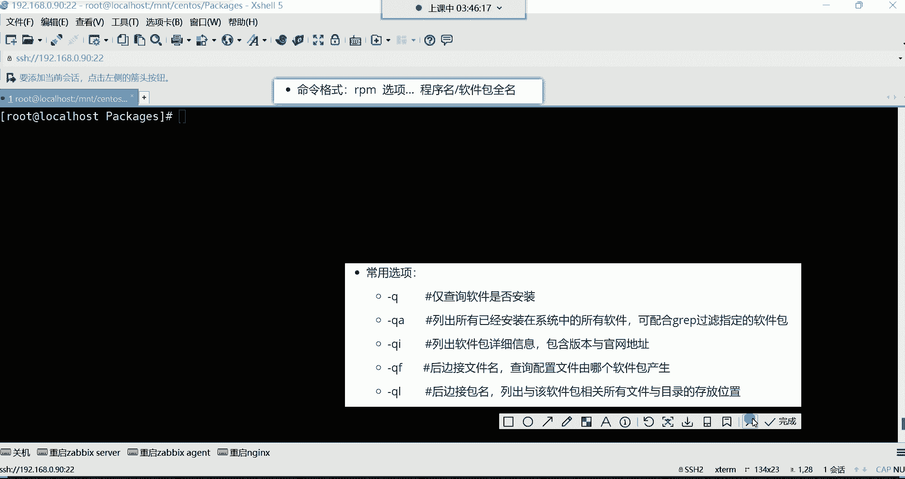

嗯查询选很给力行了，这就是rpm命令，所以大家今天啊可以先去练练他的查询，明天我们再给大家讲讲下边的这些选项，以及我们争取明天把这样给他讲完，OK吧啊今天就先讲到这吧。

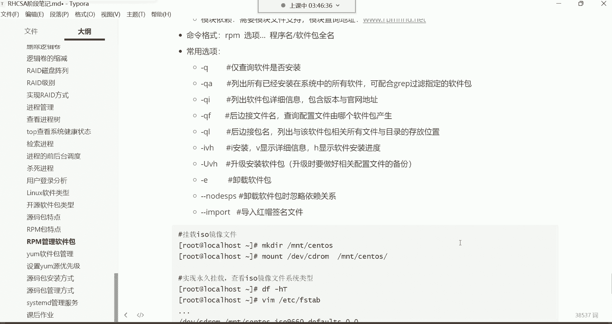

再再讲多，我怕你们hold不住了。