# Linux运维培训教程超全合集，通俗易懂，适合小白，带你从入门到精通1 - P32：红帽RHCSA-32.RPM软件包管理、YUM本地软件仓库搭建、YUM常用命令学习 - 洋洋得IE - BV1qX4y177j1

好我们正式开始哈，喂喂喂，哈喽啊，都正常了，这声音大小也都可以是吧，声音大小OK吗，OK的话，给我刷个一上来声音都不小是吧，好行那咱们就正式开始。

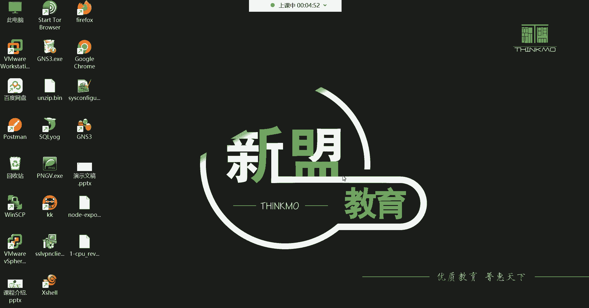

我们昨天给大家讲到哪里了呢，我们昨天给大家讲到了软件包管理，那软件包管理呢我们还并没有给大家讲完，我们是讲了讲到了这个查询的一些功能，讲到这啊，那下边呢安装这个选项呢，我们我们也讲了昨天。

但是呢像下面的升级，还有卸载，我们还并没有讲是吧，好，那我们接下来来按照昨天的这个课程进度，我们继续往下走哈，我们接下来给大家讲讲这个卸载软件啊，这个卸载软件包升级的话呢，我们得需要一些新的版本。

但是呢这个升级啊呃没有什么太多可可演示的，这主要就是升级的一些注意事项，大家只要知道就可以，就是我们在做软件包升级的时候，一定要注意，升级是一定要做好相关配置文件的备份，在企业里面可能说软件升级啊。

可能隔多久呢，隔个啊这个这个东西还不是一些确定性的东西，比如说有的企业这个软件出现这个问题了，觉得有bug有漏洞，需要升级的时候，那升级的时候呢，你得需要对相关的重要的文件做一些备份。

因为升级啊它有一个特点，比如说我们现在有一个软件，用的是1。18。0的，然后呢，企业需要对这个软件给它升级到，1。20。1的一个版本啊，我们拿哪个软件来说呢，就比如说NGX这个软件NYX哈。

这个软件呢从1。18。0，升级到1。20。1的时候，这时候注意啊，我们说软件的升级，他除了版本变成了高的版本以外呢，还有一个就是跟这个软件相关的，所有的配置文件啊，软件会有非常多的配置文件的。

那它也会全都被替换成这个1。2，0。1的这个版本里的相关配置文件，也就是说原先的你所有的旧版本的内容，全都被新版本给覆盖掉了，能理解吧，但是有的时候呢我们是对升级，有些比如说版本我想升级。

但是呢相关的配置文件我们不想升级的话，那你那个文件一定要做好备份，做好备份之后呢，当版本变成高版本之后，再拿你原先的这个旧版本的文件给他放上去啊，就把新版本的那个玩家再给它替换掉。

这个过程其实就等于说我只需要版本升级，但是呢相关的文件我不想生气，但是并不是说所有哈，我是说只是相关的配置文件，一些你觉得比较重要的，我不想去改变的这个配置文件，我们一般就是做好备份。

然后版本一旦变成高分高版本之后呢，再拿原先的这个1。18。0的配置文件，再把高版本的文件给它替换掉就可以了，也就是说配置还是原先的配置，但是呢版本变成高版本了，也就是说这时候高的版本它会有一些新的功能。

也不会有一些什么漏洞啊之类的，是这样子的，而版本升级你只需要去执行这条命令就可以了，执行这条命令时加这个U最主要就是U哈，V跟H我再给大家讲一遍，V跟H是不起到实际的安装作用的，它就是一个什么呢。

就是一个我们说增加我们的体验感，一呢能够显示详细信息，二呢能够显示软件的一个安装进度啊，今天人挺多是吧，嗯确实啊，今天那个人好像比往常要多一些，那具体的原因可能是这个大家由于疫情原因。

没有办法没有办法出去浪，只能是好好在这学习是吧，备份的目的就是把原来的程序配置文件，替换到新版本里面吗，呃对没错，这个备份的目的就是，我哪些东西我不希望改变的话，我要给它保留下来。

因为你不保留新版本的内容，就全都把你原先旧版本的内容给你覆盖了啊，就说你所有的配置全都得再重新来一遍，能理解吧，就非常的麻烦，因为在企业里边，你比如说我们对一款软件。

就比如说对一款软件呢有很多的配置文件，我们都是需要改的，那改配置文件其实最麻烦，你还要去测试你的语法，还要测试这个功能等等等，非常麻烦，所以有的时候我们不希望这个配置文件里的，相关的。

就是我们不希望把我们辛辛苦苦改的那些东西，给它全都给它覆盖掉，我们就对它做备份，除了配置文件还有哪些是需要注意的吗，就配置文件变对于一个服务来讲，你所有的相关的配置都在它的配置文件里面的。

所以别的东西就没有什么可需要你做备份的，就是配置文件啊，因为也只有配置文件最重要，哈哈好，OK那下面我们来讲讲卸载。

卸载的话呢，我们昨天是不是安装一个包叫vs FTP d啊，好那这个包我现在又不想要了，对这个一升级不是说没有了，是把原先的配置文件就给它替换掉了，我们就拿这个vs FTP d来说吧。

这个软件包比如说我们当初的时候用的是三，就现在我们用的是3。0。2的是吧啊，那后期比如说我想对对他版本升级，但是他现在也没有什么最新的版本，比如我后期我希望对他做版本升级，我想给它升级到这个，比如4。

0的4。4。0的版本，4。0。2的版本，那你要知道，比如说原先对于这个vs FTP地址，这个软件包相关的所有的配置，它有很多的配置文件，我们来看一下，昨天不知道怎么查了吗，QL跟上包名。

是不是查这个软件相关的所有的文件呢，然后来看一下哈，在这它的配置文件呢，我们就拿这个文件来说，这是它的主配置文件，我们所有的对他的重要的配置，其实都需要改这个配置文件才可以，就是你对这个软件的所有配置。

都得通过他的配软件，对箱子做箱的修改才可以能理解吧，有时候这个文件是不是就变得非常重要了呀，那可能说对于这个文件我们改了很多行啊，然后经过测试，经过验证啊，都很完美啊，都可以实现我们的目使。

实现我们的目的，然后呢我们我们要对它做版本升级了，给它升级成这个4。0。2的版本了，那你一旦升级成4。0。2的版本了，那你要知道原先3。0。2版本的，相关的所有的文件，注意啊。

就是我们现在查出来的这些所有的文件，全都会被替换成4。0。2的版本，但是呢，我们辛辛苦苦在原先的这个配置文件里面，改的这些配置，是不是，也就全都被新版本的那个，同名的文件给它覆盖掉了呀。

也就是说你一旦升级新版本，新版本里面它也是有一个同名的叫V叫vs FTP，地点康复的文件的，能理解吗，也会有一个一模一样的文件的，那他就会把这个一模一样的文件的内容干嘛呢，替换掉原先旧的内容。

那原先旧的内容不就没了吗，那所有的配置说还得重新去改呀，嗯会不会存在配置文件，替换完新版本的软件会出现啊，有有这种情况肯定会有，但一般什么时候会有这种情况，那版本跨度太大了，我们就拿了一个NGX来说。

比如说NGX，我当初的时候我当初的时候我按啊，这个我的版本比较旧，是这个1。10啊，是NINX1。10。2的版本，然后我直接就给它升级成多少呢，叫1。20。1的1。20点，这版本跨度大不大。

这版本跨度是不是非常的大呀，那版本跨度大，就有可能导致配置文件里面的一些信息不匹配，就你这个旧版本跟新版本的一些相关的配置，它不匹配，所以就可就可能导致这种新版本，它会有一些问题啊，但是不是版本的问题。

就是可能是你原先的什么呢，是你原先的旧的配置的问题，但一般跨度太大，我们这个配置文件就不留了，能听懂我说的意思吧，你跨度太大，你这个配置文件可能说一般我们得重新去改了，因为毕竟你跨这么多，快跨十个版本。

你想想是不是你没有必要再去拿这个，这个是原先的旧版本的文件，再去放到新版本里面去用吧，啊他已经不合时宜了哈，但跨度小的话，一般不会出现这种情况，你比如我跨两三个版本，那一点问题都没有哈哈有两三个版本。

这个配置文件没有什么太多的改变的哈。

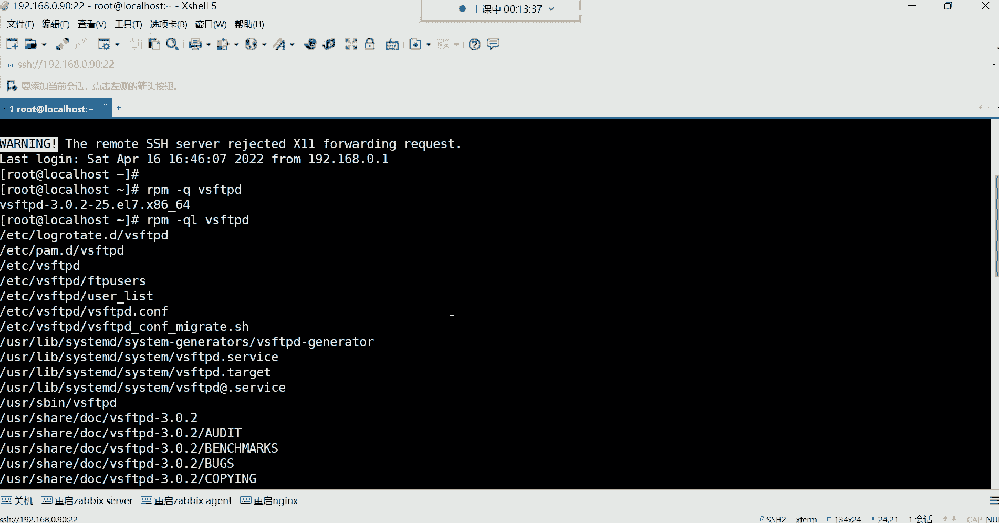

所以这个做备份的时候就是什么，就是做好相关的，你不希望哪些文件被覆盖，你就把那个文件做个备份就行了，其他的就最主要还是配置文件，其他也都没什么了，就是你改过的那些配置文件，一般你都得去给他做个备份。

你没改过的，一般就默认即可能列吧，当然这些我们在学习的时候注意啊，我们这些在学习的时候，比如说我们后期那个你们说老师，那我也不知道对哪些文件做备份呢，后期比如说我们在学习NGINX的时候。

我们学习INX的时候，你对NUX的文件做过哪些修改，你对他的哪些文件做过修改，那你就对他的那个文件做个备份不就行了吗，啊怎么备份，拷贝就CP就行了，CP就行了，你就CP不就备份吗。

就把你你想保留下来的那个文件，给它备份到一个路径下边，然后升级完以后呢，再把这个备份的文件再给它拷贝到原先的位置。

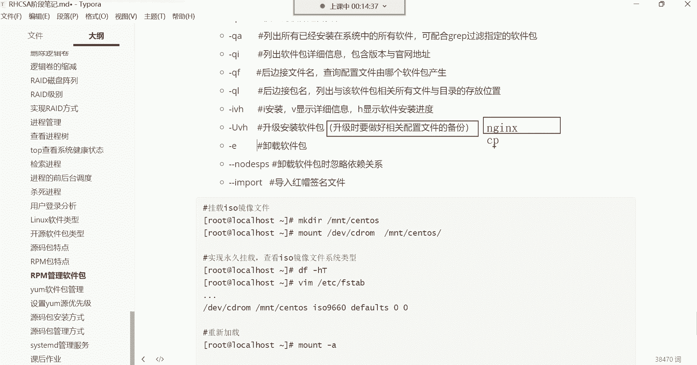

就可以了，就是这样子的，就就备份吗，我给你们演示一下哈，你比如说我们这个做备份，咱们就拿哪个文件来说呢，我们就拿这个，刚刚我给大家看到这个就这文件哈啊，你们来看一下这个文件呢，我给他我我先给他做个备份。

好，是在etc下的vs FTP d下的，那个vs FTP d点cf，我给他备份到系统的OPT目录，我是不是把这个文件做了一个备份啊，那当然了，备份之前呢，你最好看一下它的属性。

其实我们一般备份都怎么备份呢，就是得加个P就属性不变的，去不去做做这种备份啊，就是让它原先是什么属性还是什么属性，那备份完了之后呢，我这时候就开始做升级了，比如RTM杠uh，我们进到那个软件包的路径哈。

我们CD到mt渗透S目录，然后这时候呢我们诶我们挂载点掉了是吧，看到了吗，我们昨天的挂载点掉了，因为我们是临时挂载，注意给大家说一下，我们昨天过来点掉了，我们临时挂载它就掉了，所以直接干嘛呀。

打开etc的fs table文件，做个永久挂载，还没有vim命令，我发现我们这个太难了，就VI吧，然后在这个文件里面做一个永久的挂载，指定把DV下的CDROM挂载到。

昨天我们建好的那个mt下的那个渗透S目录，文件系统，哎这个文件系统我们应该怎么写呢，注意啊，这个CDROM跟分区的文件系统不不一样，这个分区我们前面讲过，用的是XFS类型的文件系统。

那这个系统的镜像文件它是什么文件系统啊，叫ISO9660，这是它的一个型号，你说老师这怎么能记得住啊，那最好的方法你可以这样我跟你讲啊，我告诉你们最笨的方法怎么做呢，就是你先临时挂载一下。

临时挂载它会有自己的默认的文件系统，mt指定把DV的CDROM挂载到mt的渗透S目录，挂载完了以后，你这样DF杠H你就可以看了，但是你这样干，一是看不到是吧，加一个T加一个大写的T。

它会把文件系统也给你列出来，这时候你看到了吗，我们是不是把这个DV现在S20，其实你看他真正挂载的是那个SR0，毕竟我们说那个DV下的CD录吗，它真正的那个语言文件就是这个S20。

所以他挂的时候其实也就是这个SR0，这个SR0这个光驱设备挂载到这个目录上面了，但是呢这里边你发现其实就有它的这个类型，这个类型就是它文件系统IIO的9660，记不住是吧，记不住你就提先临时挂载。

临时挂载呢用DF杠H加个大T，把它的文件系统类型给它列出来，这样你是不是再去写它的配置文件就可以了，这是个好办法哈，然后挂载参数是不是默认参数啊，然后两个零就是不备份文件系统，也不检测文件系统保存退出。

这时候你再MONT杠一下mt杠A好，这是配置文件挂载没有任何问题，那这就永久挂载，接下来呢我们来演示一下，我们啊我们得先退出啊，退出这个路径，然后再进去INT的SLS啊。

这个时候呢我们再来给大家演示一下升级哈，当然我们没有新的版本，我们就直接就直接给大家这样演上RPM杠杠，UVH啊，U就是升级的意思，然后这时候呢指定PC下载，比如v sFTP d tab键补齐补齐啊。

那这时候，比如说我们如果现在升级的是哪个版本的，比如我是这个4。0的版本，4。0第二个版本，注意啊，我在一回车的时候，它就会干嘛呢，他就会把原先的3。0的版本的，所有内容全都覆盖掉了，注意哈。

升级就是一个叫完全的覆盖新的版本，完全覆盖旧的版本所有内容，那是不是覆盖了呀，但没关系，我们是不是前面做好了一个备份呢，怎么备份了呢，我们是不是把我不想被覆盖的文件，放到了OPT目录了呀。

我给它保存下来了吗，这不是拷贝过来了吗，好那这样我就可以升级了，回车升级，升级完以后，这个时候那新的版本，把旧的版本的文件都给覆盖以后，那这个时候我们最好的方法是不是，再把文件给他拷贝回去啊。

因为新的文件已经在etc f s table，这个目录已经生成了，内容都是新版本的内容，那这个时候我最好的方法就是CP，再把OP加个杠P哈，CP杠P，再把OPT下的那个我备份。

原先备份的那个配置文件放到哪儿了，放到ETC下的vs FTP d，调到那个vs f t v点cf，我是不是在拿原先的旧版本的文件，再给它拷贝过去，再把新版本的内容给它覆盖掉。

那是不是这个文件还是我原先的旧版本的文件，但是呢版本却真正的升级了呀，能理解我说的意思吗，覆盖一下就可以了，那其实你是不是也可以把新版本的文件，我再给他干嘛，我再给他做个备份的啊。

不软件包只要在本地就可以，你默认就是升级覆盖，注意啊，你升级默认就是覆盖，什么叫升级啊，升级不就是拿旧版本的东西，把不是拿新版本的东西，把旧版本都给它覆盖掉吗，这不就叫升级了吗，是不是。

但有些东西我不想让它覆盖，那你说做备份的。

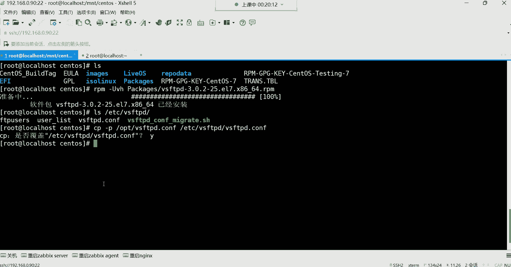

手动给它改变一下不就可以了啊，其实这叫我们说为什么说升级的时候，我说在这位置要做好相关的配置文件备份呢，因为你原先的内容它给你覆盖掉了啊。

这么就说到这了哈，那下边卸载卸载的话呢，我现在想卸载一个包RPM杠，一卸载的时候跟包名就行了，比如我要卸载vs f TFTP d啊，远程咋升级啊，不你只要是有软件包的话，你就可以升级，只要是有包。

只要你有有那个高版本的包，升级的命令无非不就换个选项吗，我说升级，咱说升级差在哪，升级我们不就是换了一个选项而已嘛，我们来看一下哈，我们升级的时候，是不是就多了一个U这个选项啊，好像这是这个卸载。

卸载完以后，我们再查rpm杠Q的时候，你再查，你发现他就是说未安装软件包就生，就说明已经被你给卸掉了，好没有安装，这就是如何卸载，但是我再给大家强调一遍哈。

对于这个我们说这个软件包的卸载。

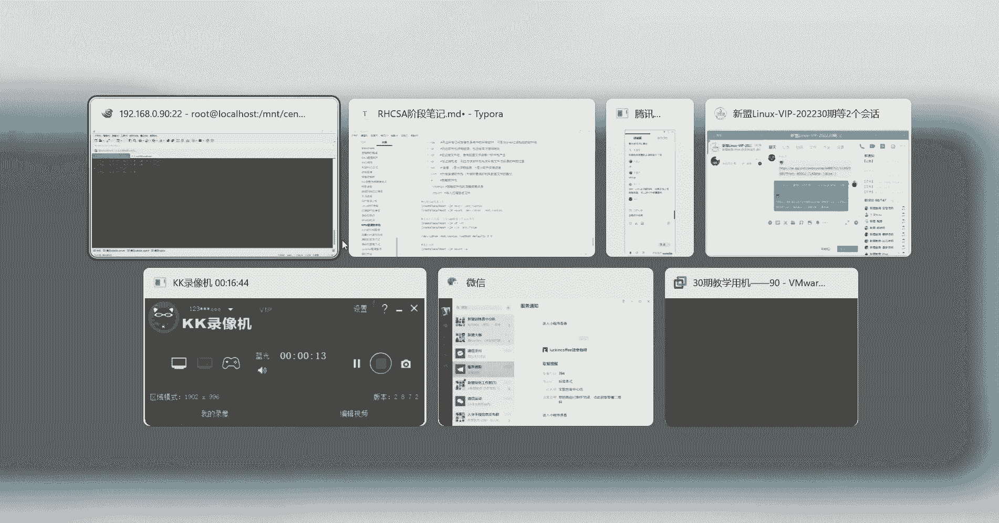

其实我们轻易会卸吗，其实我们轻易不会卸，我们轻易是不会卸载一个软件，因为他如果说我不想用的话，我就把这个服务给它停止掉就行了，一般不会卸，只要是安装在系统里边的，一般就不会卸了，能理解吧。

所以这种几乎在服务器当中是很少很少用的，因为本身对于企业服务器来讲，我一般不用的东西我都不会去乱安装，所以就弹劾卸载呢，一旦安装到服务器里面的这个软件包，那肯定是他能够用得上的，所以一般不细能列吧。

好然后下边还有一个叫怎么了，卸载软件包时忽略依赖关系，这个忽略一啊，忽略依赖关系，这个一般呢有的软件它会出现这种情况。

我们前面要给大家讲依赖关系的时候，我就给大家演示过，有很多种依赖形式是吧。

有这种什么树形依赖，你看我们就假设哈，我们前面在安装A这个包的时候，A说它依赖于B依赖于C，然后呢又依赖于D，那如果说我有一天我想把这个A给它卸掉的话，那它所依赖的这些软件包怎么办呢。

有没有想过这个问题呢，是谢还是不谢呢，有的软件包哈，就是依赖关系特别强的那种，它会出现这种情况，就是我想卸载A这个包的时候，它直接连同它所需的那个依赖也一起帮你卸载，会有这种情况。

所以有的时候呢我们一般在卸的时候，如果一旦出现这种情况的话，大家就要用这个选项，叫卸载的时候，就别把它的依赖给卸掉了，叫忽略它的依赖关系，直线我想卸载的这个包，别的包不要写。

那这时候你们可能又会有疑惑了。

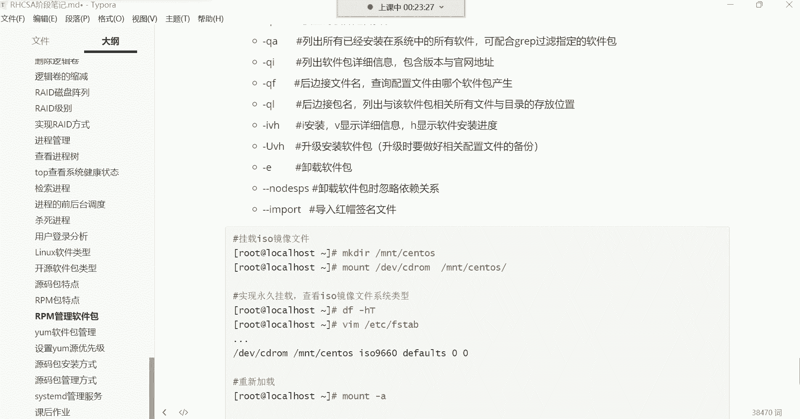

什么疑惑呢，你说那如果说我这个主包都卸了，我留这依赖干嘛呀，你们注意哈，这个依赖包啊，有的时候我们就拿这个B这个依赖来说吧，其实你以为他就光是A这个主包的依赖吗，不是它有可能还是这个其他软件包的依赖。

他有可能比如这还有一个X这个软件，它有可能还是他所需要的依赖，能理解吗，他可能也依赖于这个B，那如果说你在卸载A的时候，你直接把他的这个依赖的，这个B也给它卸载掉的时候，那以后X这个软件在运行的时候。

那它还能正常运行吗，是不是就无法正常运行了呀，所以有的时候你要知道，我们在卸载一个包的时候，一旦涉及到依赖的情况的话，依赖不要写，依赖不要谢哈，就可以通过这个选项去忽略它的依赖关系。

但大多数都不会出现这种情况。

一般情况下，现在啊这个都已经很智能了，很智能哈，你在卸载一个软件的时候，一般他不会连同依赖一起帮你卸掉，所以这种呢用的是非常非常少见的啊，当然在早期是有一些软件确实是有这种情况啊。

但现在很少会出现这种情况好，那下面这个嗯import碰到过一次是吧，啊对对对哈，就是就是这样子的，因为有的依赖包确实是除了它，可能是很多个软件包的依赖，所以这种东西一般不屑，然后下面呢我们来给大家说说。

这个导入红帽签名，这个红包签名是什么东西呢。

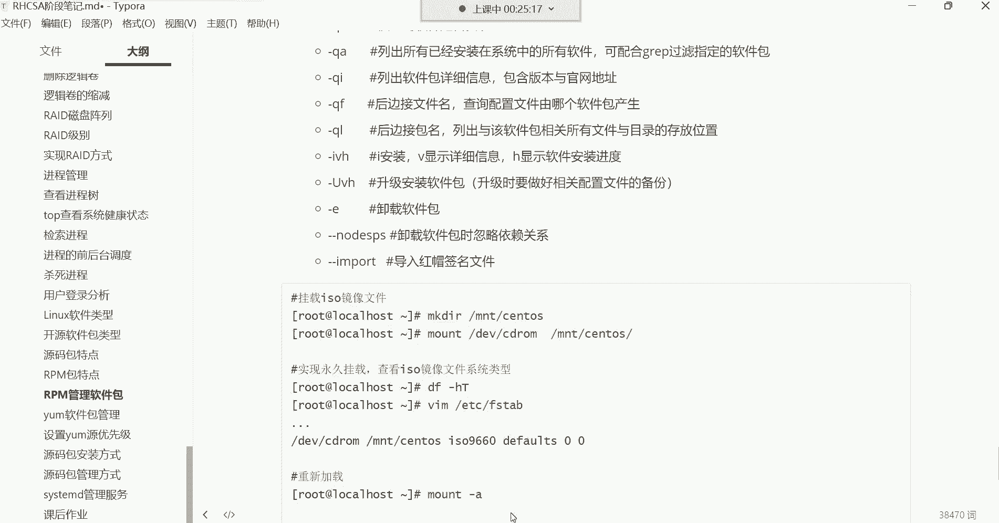

我们来再安装一下，大家注意一下细节哈，我CD到这个pages这个目录，然后大家啊我敲LS干嘛呀，啊我直接安哈杠IVH卸载了没网怎么办，没关系啊，我们后期会带领大家去去，不是卸载了没网，它跟网没关系啊。

我我们现在下载软件包的话是需要网，但是后期呢没有网，我们也可以自己下，我们现在这包不都在自己的本机吗，现在这包也没有在网络当中啊，这不都是在我们的本地吗，我们是不是在本地直接下不就完事了吗。

看到了4000多个包吗，哈哈4000多个，OK然后我们来说一下哈，我现在在安装一个包的时候，大家注意一个细节，什么细节呢，对CDROM里哈，就那个镜像文件里面不就有四呃，4000多个包吗。

我们这个系统镜像文件，诶。

我们做我们昨天打过这个东西吗，什么红帽，前面文件有没有导过，好像没有倒过吧，好像没有倒过哈。

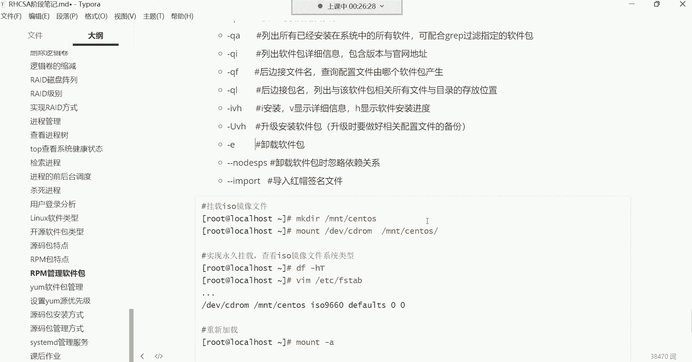

啊没有打过的原因是啊，是这样子的哈，我给大家讲讲，这样我给你们来波操作哈，我们先把e t c e ma，reporter d下面的这些文件给他删掉，把这些文件把这些文件先给它清空，清空了，删掉啊。

删掉之后呢，我再把那个包给它卸掉，重新安一下，啊我是杠一哈杠E给他卸掉，卸载之后，我们再重新安一遍，它已经卸了，我再把这个命令翻过来，tab键补齐，等一下哈，我们这个机器啊，我们这个机器，看看什么。

好被我清空了清空了嗯，对，有些缓存有些缓存的话，我我先清一下吧，好清了哈，我再给你们来一遍哈，再再卸掉，好然后再按上再按来看哈，我从这按RPM杠IVHVSFTPD来看啊。

回车哎呦哎哟哟这个还不是缓存的问题了，现在这这可能是我这个系统。

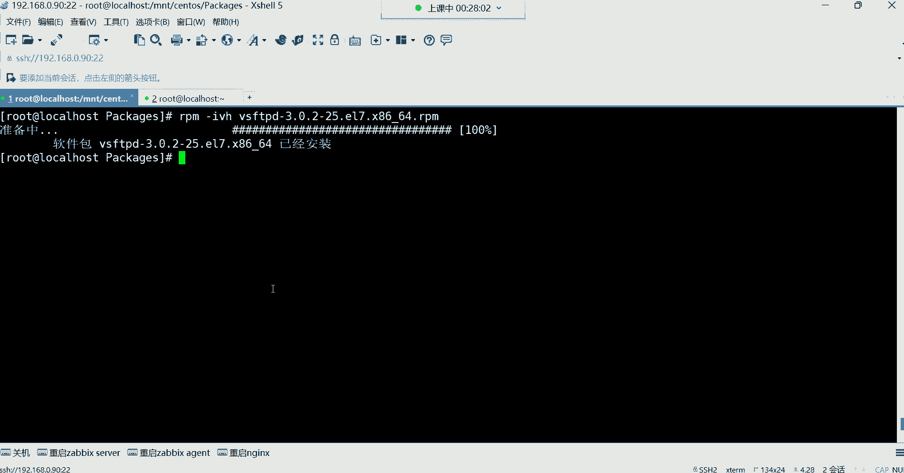

我们经常前面一直安装软件包，它有那个签名文件了，那切不是那签名文件已经倒过去了哈，已经倒过去了。

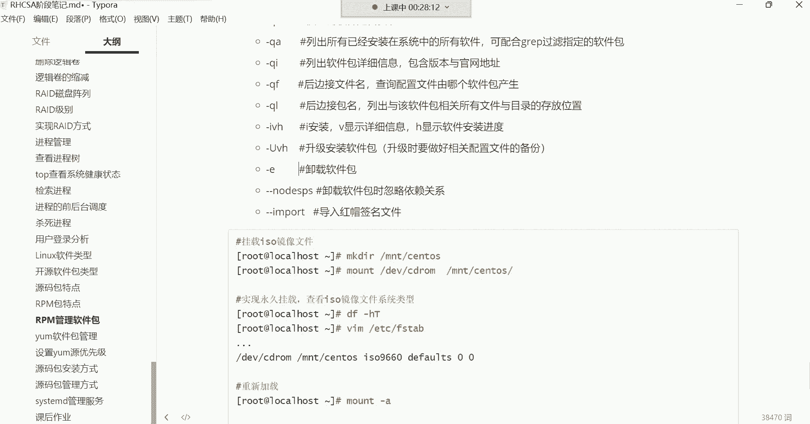

是这样子的，正常来讲的话呢，一个文件里边哈，在一个软件包里面有这么一个东西，大家来看一下哈，杠QI跟上vs f t v d，我们在看这个软件的时候，它是不是有一个叫什么呢，叫做这个叫看这文件哈。

我昨天已经给大家那叫签名是吧，这有有这么一个签名，然后这个签名是一个软件包的一个唯一的id号，就这个软件包它有个唯一的标识，这个我们就叫做签名，这个签名啊，就是我们在安装软件的时候。

如果说你没有导入一个这个啊，看到了吗，这叫r pm杠g pg杠K的这么一个叫密钥文件，叫签名的密钥文件的时候，那安装软件包它会有一个小警告啊，这个警告的话呢，就是说这个软件包系统没有识别到它这里边的。

这个这个密钥，没有识别到这个密钥id哈，那如果一旦你看在安装软件包的时候，如果有一旦有那种提示的话，你就把这个文件给它导一下，怎么导呢，非常简单，哈哈这样导就用那个选项，rpm杠杠i m port。

然后跟上那个文件名就可以了，跟上这个文件名哈回车，这样就把这个文件里的一些密钥，导入到系统里面了，因为这个文件里面是什么呀，我们来看一下哈，杠七这个文件里面都是一堆密钥，看到了吧，这都是软件包的密钥。

所以这些密钥的话呢，你导到系统以后呢，系统就能够识别到这个软件包里边啊，有一个叫做这个密钥的这么一个东西，不然呢它上面有个小警告，这个小警告呢，他就是有点提示说这个软件包没有找到那个MD。

他有点怀疑这个软件包的来源，不是什么正规的渠道，就这么回事哈，所以嗯这个确实还没有出现这种效果哈，没有出现就算了吧。

反正你们就知道这个选项干嘛用的就行了，叫导入签名文件的，那以上就是rpm这条命令常用的一些选项，那这些选项呢大家现在只需要记哪些呢，记上面这几个就可以了没啊，能用没签名也能用，就是它会有一个小警告。

那个警告完全是可以忽略的哈啊小警告啊。

这样我给你们演示一下，可能你们感受不到是吧。

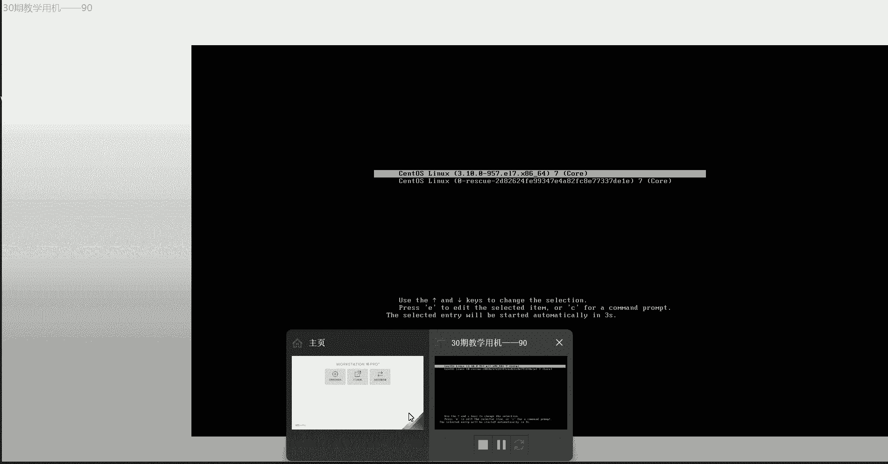

感受不到那些警告，给你们演示一下哈，没关系，换个机器嗯嗯换个机器，恢复一个快照。

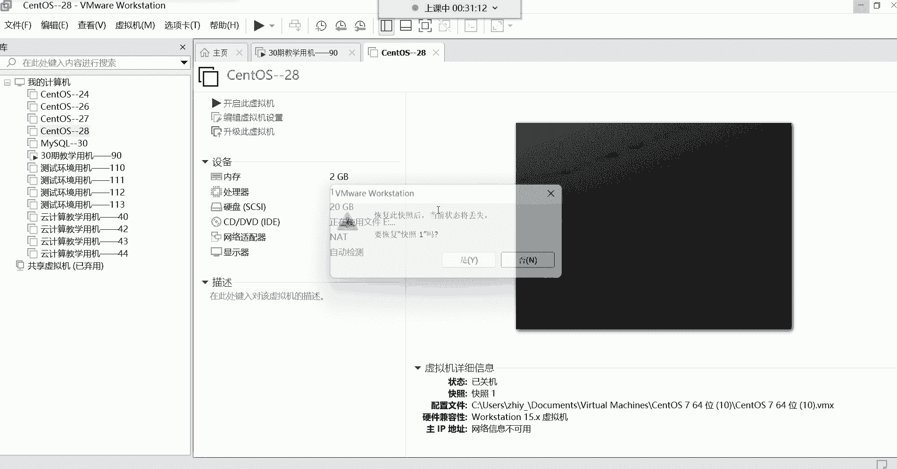

一般啊你如果要是用什么呢，用人家网络的仓库里的软件包，就不会有那个警告，如果你用人家是网络仓库的，是没有那个警告的哈，这个图的话没有没有那种图，那种图那种图我只能给你们演示一遍。

因为我们前面那个机器一直在使用，那个网络仓库在安装软件包，所以那网络仓库它是有签名文件的，有签名文件就没有那种提示。

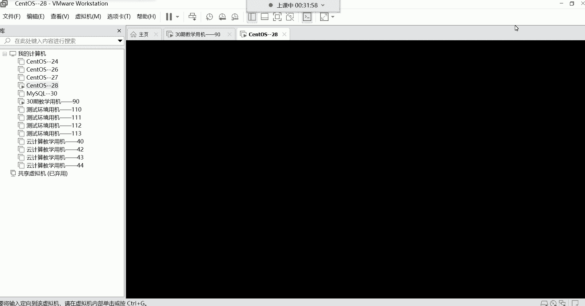

登录一下哈。

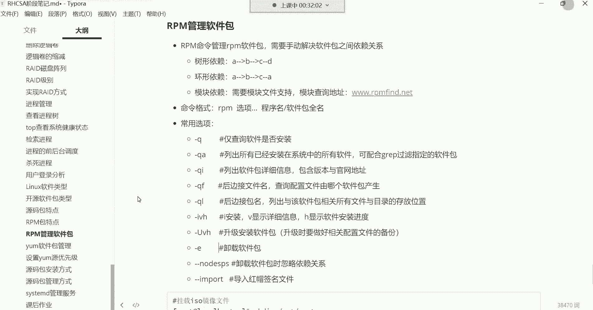

呃我先把这个路径下的那个文件给它删掉，然后看看mt啊，再看看渗透S，你看是不是这个里边也是我们挂载的，那个系统的镜像文件呢，然后软件包在这个里边吧，好那我进到这个路径，我进到这个路径之后呢。

我现在要安装软件包了，rpm杠杠IVH，这时候你来看一下这个，我这时候再按这个vs FTP d的时候，注意看哈，回车哎，它上面有个小警告，就这个小警告哈，这个小警告就是说。

没有找到这个软件的那个密钥id，没有找到MIUID呢，因为软件包它就像什么呢，就像你去超市买一个食品一样，你买的那个食品上面，它会有一个什么国家安全啊，质量安全局盖的那个戳是吧。

告诉你这个商品呢是经过我们这个国家检测的，你可以放心吃，而软件包也一样，软件包里面的这个MIUI其实就是告诉你，我这个软件包啊，是一个经过这个权威的机构检测过的，绝对是没有所谓的那些什么非法代码的。

你可以放心安装的嗯，那对于这个软件包，它的警告说，他并没有发现这个软件包里面有这种mid，所以警告你一下，说没有找到MIUID，哈哈能理解吧，那对于这种情况我们怎么办呢，对于这种情况。

就是你得知道这个软件包的来源，到底是不是从正规途径你去下载的，如果是的话，其实你可以忽略这个警告，因为他毕竟是警告吗，我说警告这东西，他警告就是一个，我们说这是一个善意的建议，就像现在这个。

我们建议年轻人少看一些，那些这个对身心健康不好的一些电影，但是这只是建议而已是吧，你能阻止他看吗，那你说那一个虎狼的一个如狼似虎的年代，还没有女朋友，那你说是不是啊，怎么办呢。

这你只能是建议人家是不是嗯，那该看不还得看吗，该干嘛不还得干嘛吗，是不是，所以说这阻止不了，那你他给你的建议，他也是我们最终下载下来以后，正常用就可以了，但如果你说我就不行，我就看不惯这种东西。

我一定要给它解决掉，我不要让他有这种警告，就这样，rpm杠IVH，把这个我们呢就把这个啊，sorry哈，这叫杠杠，就把这个签名文件给它导进去就可以了，就把这个切片软件往里倒，你把这个切片文件一导入系统。

这时候你再按的时候就不会有这个警告了，你看我们现在在卸哈，再把那包给他卸掉，这时我们再安装上iv h，再按那个vs FTP的时候，注意看啊，现在就没有警告了啊，就这小这小警告。

但最终它不影响你真正的使用感，能理解吧，所以这个就看你个人的一个，你比如说怎么看签名文件，怎么看签名文件在不在啊，你不用看你安装软件的时候，如果出现这个警告，就是你系统里面它没有这签名文件。

如果没有警告，就是你系统里面是有这种签名文件的，而且签名文件一般他会给你放在哪儿呢，呃它会给你放在系统的那个etc目录下面，在etc，这段这得搜一下哈，嗯用find搜一下find，然后，杠我们从哪儿呢。

从etc走，它一般就在etc目录，然后杠name，我们搜这种什么rpm开头的文件，类型是文件的，看在etc啊，叫PKI目录，看到了吗，在这个目录，他会把这个文件给你，导入到系统的这个这个路径下面。

给你导入到这个路径，然后到时候他再去找一个软件包的签名，文件的时候，他就会去这个路径去找了，所以你看我们这个系统，在这个路径有没有这个文件，你就知道他为什么没有那提示了，有文件吗。

你看我们这个系统就是我们刚刚安装的时候，你发现他没有那个什么警告，是因为这个路径下边，压根儿就已经有这些文件了，已经有了，所以我们前面就在这个机器，没有办法更好给大家演示，能理解吧，因为有签名了。

他认识啊，是这么回事啊，这就是我们所说的签名，我们说清楚了是吧，好那这机器我们就给他关掉哈，用不到好，那下边干嘛呢，下面我们就再来给大家说说。

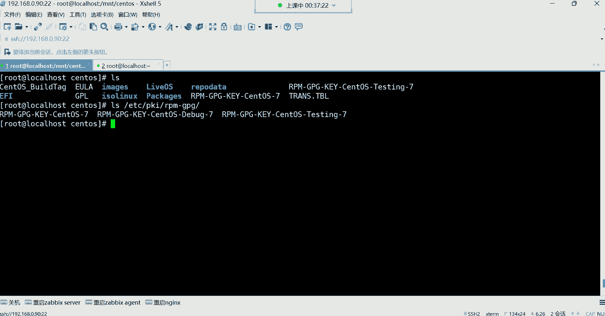

这个rpm命令查询功能还是非常强大的，大家就记查询，那安装就不系吗，你说那我不系安装，我怎么去安装软件包啊，安装很少记，为什么很少记呢，因为这条命令在安装软件包的时候。

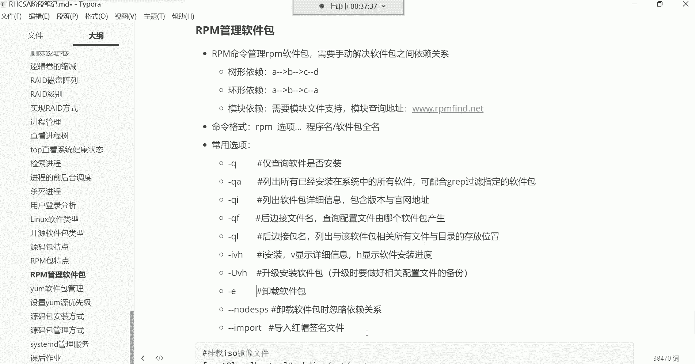

他非常非常非常的痛苦，怎么痛苦呢，我给大家安装另外一个包哈，哪个包呢，RPM杠IVH安装一个HT TP d tab两下哈，因为你tab一下，跟这个HTTPD开头的软件包有好几个呢，看到了吗。

所以他不知道你要得你到底想补全哪个，所以说你多tab两下，他就给你列出来了，所有跟HTTPD开头的包总共有四个，你到底到底要补齐哪个，比如我现在要补齐这个，这是它的主包提供web应用的。

然后这时候呢我就这样杠二，然后再tab键补齐好，这时候就可以了，回车你看现在这个问题就出来了，什么问题呢，叫依赖检测失败，这个什么叫依赖检测失败呀，就是它需要依赖包了。

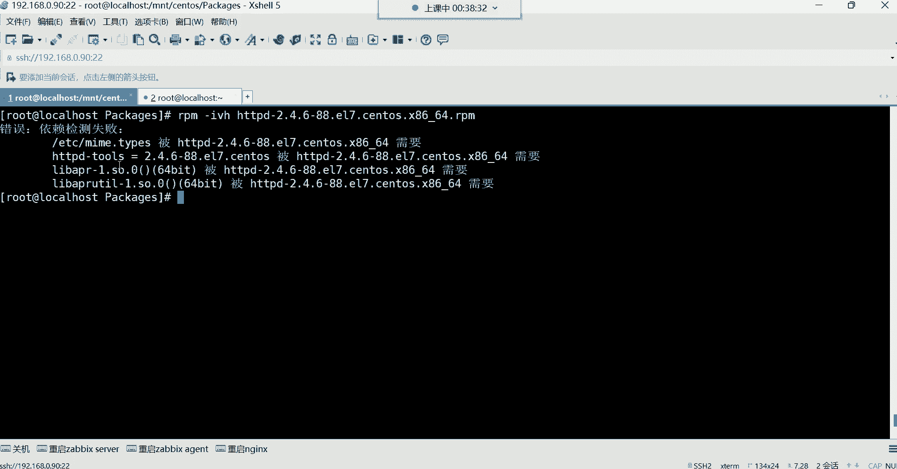

我们前面是不是给大家讲过呀，我说这个依赖这个东西软件包啊。

它有的时候不是说你光安装这一个就行了，有的时候得需要你安装好几个的，能理解吗，有的时候得需要好几个包，但是你光安一个肯定不行啊，是不是你比如我们就在这图里面给他画的，你要按A的时候，他说我需要BCD。

你得把这些包都给我安装上才可以，那现在他就给你要依赖了，那怎么办呢。

要依赖了，所以现在就是跟你要依赖来了，那你说我们怎么办吧，咋办呢，那这时候我们就得解决这些依赖关系，那怎么解决呀，像这种依赖文件的依赖，你看这就是一个普通文件。

他说我需要etc下边的这个文件作为我的依赖，然后还需要这个软件包作为依赖，因为软件包后边是对应版本的，看了吗，这告诉你了，后边我需要的是我需要的版本是哪些版本的，那这些是什么呢。

你看像什么lab a p r这些是什么呀，这种点S的一般叫模块模块，这模块在系统里面就是帮你实现功能的，这这两个模块都是模块，看到了吗，所以说现在我安装这个包的时候，它需要什么呢。

它需要一个普通的文件跟一个软件包，跟两个模块，那我们现在你说我怎么解决它呀，我们好像没有办法，那这种依赖还算是比较少的呢，我再安装另外一个rpm杠IVH，安装一个叫VIM的，我安装一个BM哈，看到了吗。

这都需要依赖，很多包都需要依赖的，还有哪个呢，比如我再安装一个叫open SSL的，看一下哈比VR，看到了吗，是不是都需要依赖呀，然后再安装什么GCC，Gcc，4。8的版本看。

所以你像我们前面安装那个VSFTP，你以为所有的软件包都像vs FTP t一样啊，没有任何的依赖，你上去就安装了呀，那可不是啊，可以说95%的软件包，可都是需要依赖的，那你说需要这依赖，我们怎么解决呀。

那遇到这种问题，你说我们能一个一个手动去解决吗，这是手动解决啊，我跟你讲可以吗，可以，但是但是什么呢，有的软件包需要好几十个依赖，那一旦遇到这种死，我们说叫那种死循环的啊。

一旦一旦遇到遇到那种死循环的依赖，我们是不是就凉凉了呀，这一天不用干别的了，就安装软件包了啊，所以对于rpm命令。

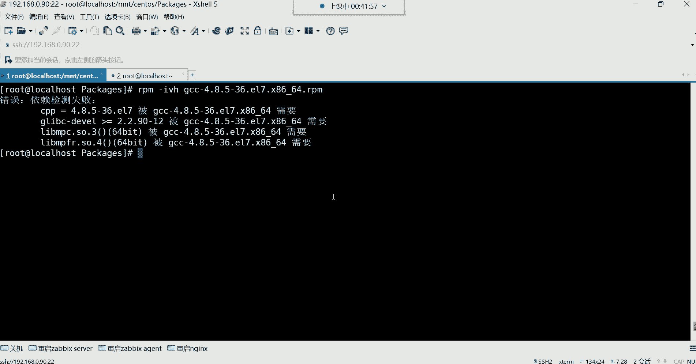

我为什么就说大家不需要去记这种安装的呢，你说你不记吗也不行，但记的话呢一般时髦什么包，我们可以简单直接的就直接用它呢，没有依赖的，就比如那个vs FTP，哎这VSFTPD啊，它不需要依赖。

咱们就直接RPM就直接安装了，但一到涉及到依赖的话，我们就用下面那个叫Y亚目软件包管理，它可以更好的帮我们去叫自动解决软件包之间，复杂的依赖关系，能理解吧，所以对于安装的话呢。

这条命令我们前面已经用过了，我相信哈这条命令我们一点都不陌生了。

我们前面在学习这个系统的时候，我们敲过的很多命令都没有，是不是都没有，那怎么办呢，我们是不是YM杠Y，因此套后面跟包名直接安的呀，但你知道我们在安装前面那些包的时候，那些包也都需要依赖。

那为什么我们没有一个一个去解决呢，我只需要用什么，我叫an什么呢，是因为YM，它本身是可以帮我们自动解决这个依赖关系的，是这么回事，能理解吧，哎，所以这样我们安装软件的时候就比较省事儿了。

你看我们前面用什么安什么，你没有像我们前面用rpm一样，遇到的这种什么啊，我需要这个依赖，需要那需要什么依赖检测设备。

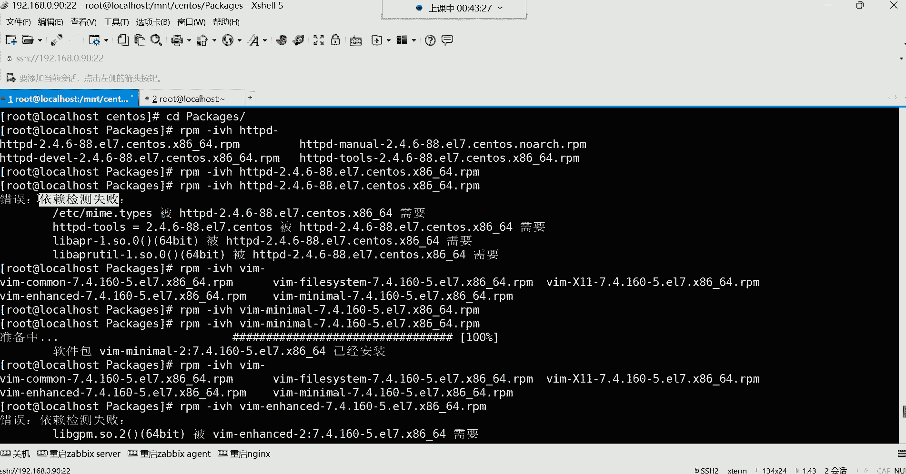

你得去安装吧，我们并没有吧，所以这个呢，大家就其实已经清楚它的一个具体的功能，而这个亚目呢内网能用哈，能用，主要是我们得需要从软件仓库里面去下载，这个软件包，因为要么本身是从仓库里面去下载的。

而RPM呢不是RPM，是你直接指定这个包的所在位置，你看RPMIVH，是不是指定软件包在哪个路径啊，啊包的全名也得需要手动的给他指定，他才知道你要安的这个包是什么，而要么不是要么会从软件仓库里面去搜索。

搜索到了以后呢自动安装，所以它比rpm会更加的符合我们现在的安装，软件的一个这么一种需求，那什么叫软件仓库呢，软件仓库就是提供众多软件包的一个仓库。

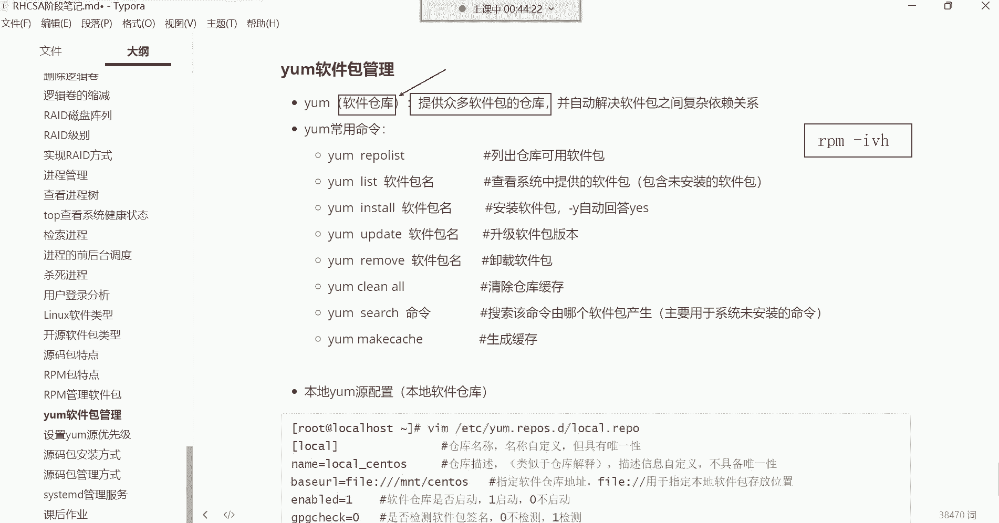

那如果换到windows里边，我告诉你什么叫软件仓库。

我们就拿腾讯软件中心来说吧，在windows里面我们想下载软件包，是不是从这个里面去下载呀，对这不就是软件商店吗，这不就是软件商店吗，只不过叫法不一样，在windows里面我们叫软件商店。

那在LINUX里面呢我们就不叫商店了，我们就叫仓库，叫软件仓库，这里面是不是用了什么，我们直接搜就直接下载就可以了呀，就这么简单，这里面有海量的软件包，让你去下载是吧，有不同类型的，没网咋办。

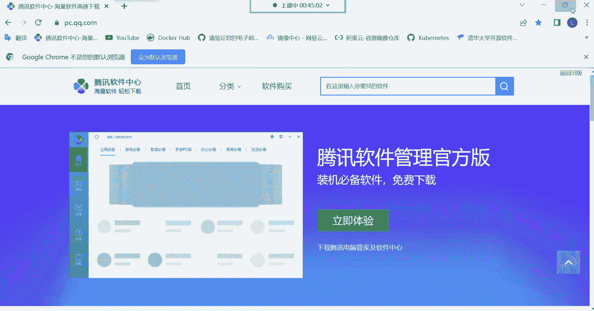

没关系啊，没网我们也有办法，所以接下来呢我要给大家讲的就是这个YM。

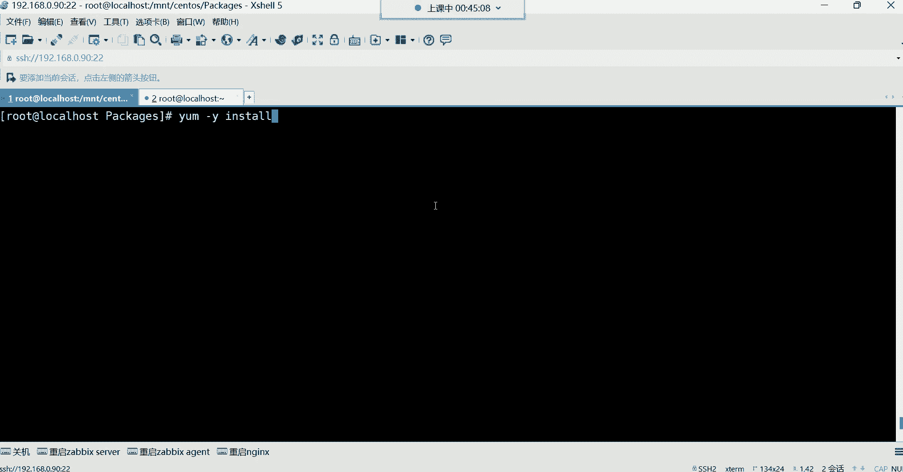

我们怎么去使用它，先来说说这个软件仓库。

软件仓库怎么来的呢。

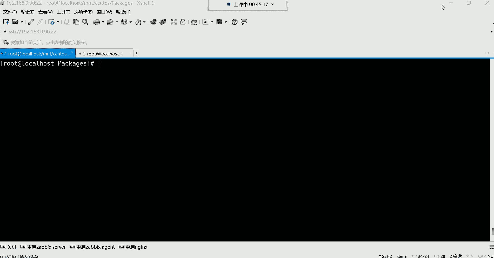

好我先给大家说这个软件仓库怎么来哈。

这个软件仓库啊它分为很多种，大体就分为两种形式，软件仓库，第一种叫什么呢，第一种叫做本地的仓库，第二种呢叫做网络的仓库，本地仓库就是我们自己去搭建的，然后呢，网络仓库呢是比如说网络当中。

有这个阿里的仓库，有这个中科大的，还有这个清华大学的仓库，还有网易的163的仓库等等等等，这些呢叫网络仓库，特点是什么呢，这个本地仓库它的特点，就是你不需要去连接外网，连接外网是软件包，存放在本机的。

就存放在本机某一个目录，而且网络仓库呢它不太一样，网络仓库啊，他得需要你去连接外网才可以，你连不上网，你怎么去跑到阿里去下载软件包啊，就跟我刚刚给你们看的那个，如果你说我们连这个腾讯的软件商店。

我都连不上去，我怎么下载软件包呢是吧，所以这网络仓库的特点得需要连接外网，但是呢我们无需任何的配置就直接使用，直接使用哈，可以直接下载，那本地仓库自己搭建，就是我们自己去创建一个文件。

然后在这个在这个文件里呢去，在这个文件中去配置仓库的一些参数，所以这时候我们对于软件仓库来讲呢，我们是既可以用本地的，又可以用网络的，如果是内网环境就用本地的，如果不是内网环境，可以用网络的。

所以这就是我们所说的这个什么呢。

叫做仓库对，那软件包的话，可以在内网做一台代理，可以啊，当然可以啦，可以哈好了。

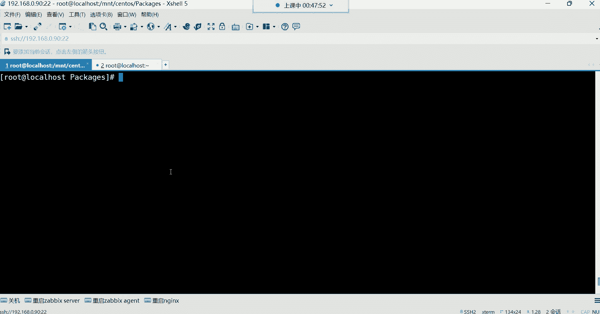