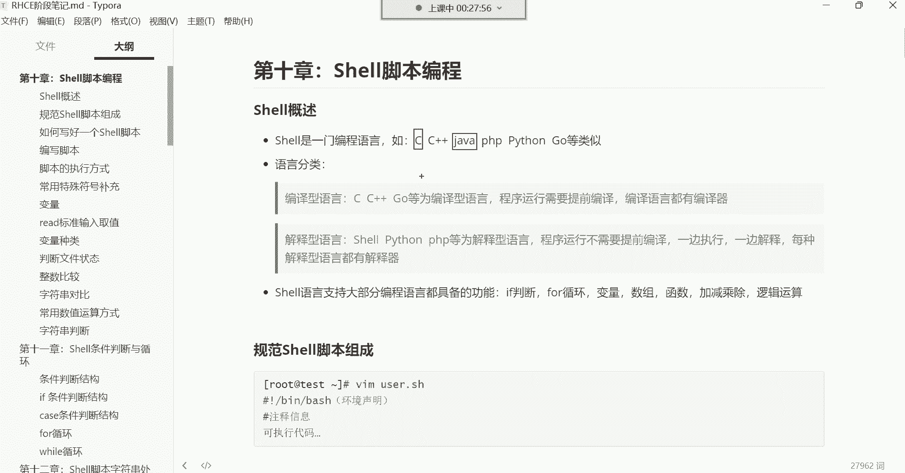
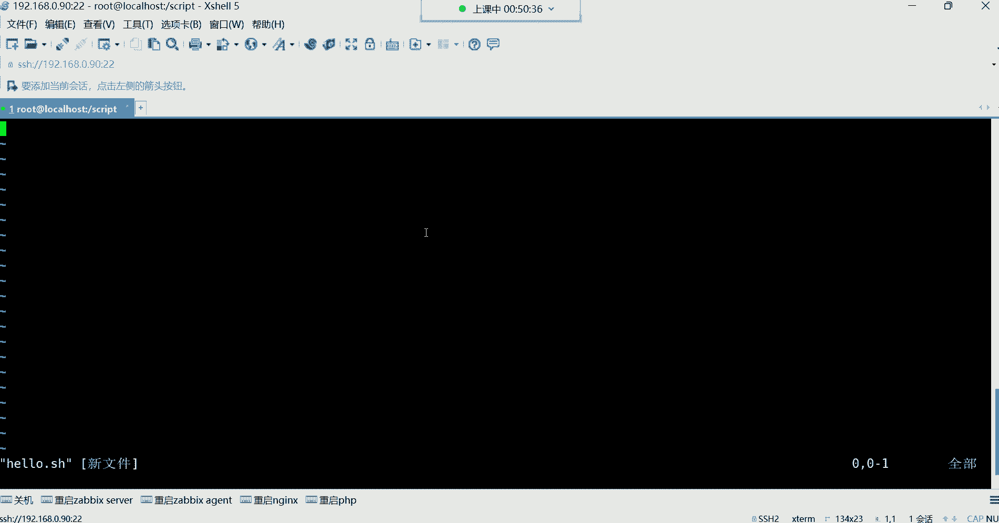
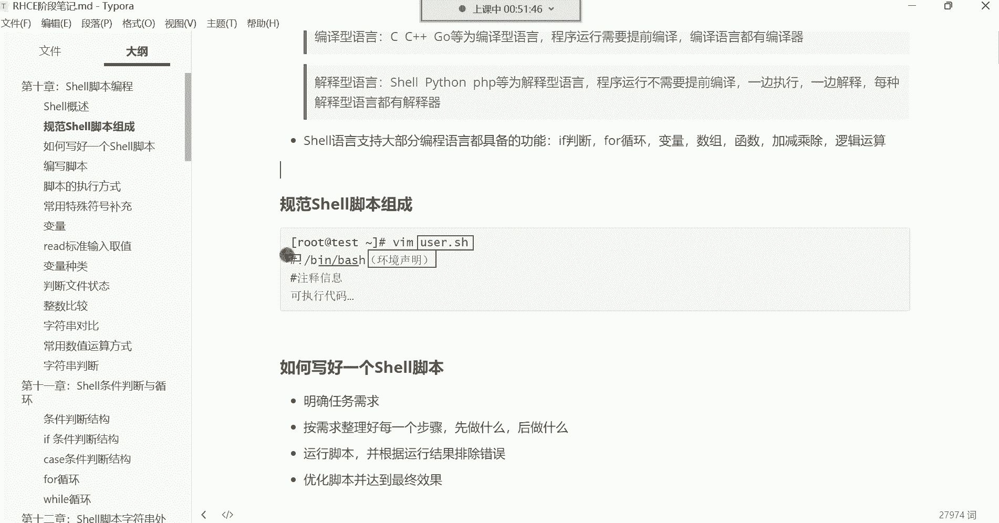

# Linux运维培训教程超全合集，通俗易懂，适合小白，带你从入门到精通1 - P36：红帽RHCE-1.shell脚本概念介绍、脚本编写规范 - 洋洋得IE - BV1qX4y177j1

好，录屏打开，那我们就正式开始上课了。那我们本周呢正式开始了IHCE阶段的内容，然后上周是直接把ICSA我们给结束了。然后有很多CSA的小伙伴呢，我们在这个课堂里面也看不到了。

然后成为我们怀念的一些同学了哈，然后我们这个IHCE阶段呢，前面还没有复习班没有关系啊，我们这个继续讲，然后你们这个有时间再复习哈，我们这个IHCE阶段开始的时候是从室有脚本开始讲，然后一直讲到哪里呢？

我们一直要讲到后边的ible自动化运维的工具。😊。

然后在整个的这个学习过程中呢，室有脚本是我们学习呃在基础阶段吧，可以算可以算是非常非常有难度的一部分内容。它难度体现在哪里呢？就是这个编程啊，这个编程对于很多这个小白啊，是计算机小白来讲啊。

它没有比如说没有一些这个基础经验，没有一些编程的思维逻辑。那确实这个课程就听起来就不太好容易理解。所以说这也是为什么很多人去搞开发的时候，他觉得开发比较难。因为开发就是需要非常强的一个思维逻辑啊。

但是没有办法。对于税有脚本呢，现在这个很多时候不是这个你能够花这个。一天两天，一周两周，一个月、两个月就能够给他学明白的一门技能。能列吧，有PDF笔记吗？有哈，到时候我给大家导成PDF。

大家可以去放到手机里面去看，好吧。好，那接下来呢我们学习实有脚本呢，我可能会从头开始给大家去讲解，所以你们也不要担心啊，我会呃带领大家了解这个实有脚本的相关概念，然后怎么去学习这个实有脚本啊。啊。

这个笔记是这个笔记我到时候会发给大家，好吧，我会发给你们。然后你们到你们到时候来跟我领取啊，注意哈。😊，强调一遍哈，笔记呢我们这个不上传到网盘了，到时候大家来私聊我啊，私聊我来跟我领取笔记哈。

然后录屏我还会照常上传到网盘。😊，之前啊人感觉少了一些是吧？没错哈，为什么呢？因为这个ICSA阶段有很多人嗯。😊，啊，很嗯很多人呢就是为了学点基础啊，就为了学点基础哈。但是呢如果你光学点基础。

对于我来呃，对于对于我在这个行业里边的经验告诉我，那点基础不足以让你能够找到一份工作啊，不足以让你能够在这个行业里边能够混口饭吃啊，那因为那点东西根本就不算什么根本就不算什么，可以这么说吧。😊，嗯，对。

那个IHCS阶段还有很多同学是属于那个免费赠的课啊，免是免费赠他们的。所以说这个。结束了啊结束了。好了，那我们就正式开始课程内容了哈。😊，那。我们对于这个事务脚本来讲，我们先来说说这个。嗯。

什么是shaale，他能做什么？然后我们为什么要学习它？sll它本身是什么呢？它本身是一门编程语言，注意哈它本身是一门编程语言，它就像计算机里边的那些C语言。

C加加java PPpyython go这些编程语言呢类似。那编程语言干嘛的呢？我们说编程语言是跟计算机打交道的。我们人想要去管理这个计算机，想要这个控制这个计算机。

我们得干嘛呀？我们得去说计算机能够听得懂的语言，就是我想跟谁交流，你得说谁能听得懂的语言。你比如说你想跟老外交流，你跟老外交流，你说中国话他听不懂，那你们两个能交流吗？交流不了是不是啊。

你想跟小动物交流，那你那你这个你跟他说中文小动物听不懂那怎么办？啊，你得说小动物能听得懂的语言而计算机也一样，我们想跟计算机交流，那计算机的语言是什么？是二进制010101这些二进制数啊。

你我们别觉得这种二进制数怎么交流啊啊，这嗯，我告诉你啊，计算机就喜欢这东西啊，计算机你跟他说给我创建个文件，你用中文告诉他。😡。

那计算机他可不懂，计算机也不知道你要干嘛。所以呢哎我们得说计算机能听懂能语听得懂的语言，就是这些二进制数。但是呢我们在学习这个系统的时候，我们并没有。通过这种二进制去管理这个计算机呀，是不是啊？

如果这样的话，你看计算机他也不懂，我们都是通过各种命令，什么LS kit之类的，是不是？哎，这为什么呢？😡，为什么我们说这些ABCD的英文字母，计算机它也能认识呢？😡，难道说这ABCD的英文字母？

也可以。不不可以啊，就是英文字母计算机他其实也不认识。他不认识啊，计算机只只认识二音制。那为什么英文字母可以跟计算机交流呢？因为这些英文字母。😡，是属于编程语言里边的能够识别的字母。

所以说这个编程语言它又分为这种编译型语言跟这种解释型的语言。注意哈，我们说这个。编译型语言跟解释性语言的区别是什么呢？你像C语言C加加go这些呢，我们称之为叫编译型语言。

这种编译型语言程序运行之前需要提前编译它。然后编译语言都有自己的编译器。嗯，像这种编形语言。像C语言CI加这一类的，比如说有人用C用这个C语言开发出一款软件这个哈。😊，开发出一款软件。

那我想让这个软件能够运行起来，得干嘛呀？😡，得把这个软件给它编译成。二建制。你不编译计算机最终也不认识。你看我们前面在原我们前面在学习软件包管理的时候，源码包是不是需要我们自己编译？😡。

我我们对于这个N来讲，我们是不是通这个通过那个GCC那个编译器。GCC这个编译器把N给它编译成计算机认识的这些二进制语言。啊，所以说像这种东西呢。呃，典型的就是像C语言CR加购这些就属于这种编译性语言。

当然你说老师那这个很多的软件我没有编译，很多软件你没编译，是别人帮你编译的。你就包括那种RPL包也一样，RPL包二进制包二进制包。比如说人家给你这个转换成二进制的时候，是人家官方给你编译好了。

给你编译成010101这二进制数了。而我们拿过来是直接安装的，能理解吧？但总之都得需要提前编译。😡，不编译，安装不上啊，这最典型的前面N我们安装的时候是不是？安装这个原版包的时候，我们自己编译。

如果安装RPL包呢，呃官方给你编译好了。但是得需要填编译哈，这样才可以。那还有一类语言叫做解释型的语言。像这种解释型的语言，你比如说像sell语言。

pyython语言、PP这些语言就称之为叫解释型的语言。哎，这个解释型语言它的特点是什么呢？就是比如说有人用这个什么呢？用python开发出了一款软件。那这个软件在运行之前。

不需要提前给它编译成计算机认识的那个二进制数。那它是怎么回事呢？是这个软件，它一边自己在执行的时候。他一边解释。然后他通过什么呢？通过解释器，每种解释型语言都有自己的解释器。

那也就是说像这种python PP sale这种语言。他们是一边执行一边解释的。一边执行一边翻译一边执行一边翻译。但这个过程我们看不到，注意哈，这个过程我们是看不到的。😊，那对于我们来讲。

我们学习运维的这个相关的技能。那我们到底用什么语言呢？你说我们一直在跟计算机打交道，没错吧，我们一直在跟这个系统打交道。那我们用的语言是到底是哪个语言呢？😡。

你说我们敲到什么LS命令PWD。

这些命令到底是属于什么语言呢？我告诉你啊，这叫社援。是有语言。也就是说，其实我们也是在不知不觉中啊在学习一门计算机里的编程语言。只不过这门语言呢。它不适合用来去开发一些软件，适合什么呢？呃。

适合去对系统呢做一些维护。能理解吧啊，所以说计算机里面的语言有一门就叫授语。而我们现在学的就是。我们敲的什么LS命令PWD命令，我们前面所有的命令都是属于设语言里边的命令。能理解吧啊。

都是属于是有原理面的命令。所以你们。也学习了一门计算机里的语言了，因为你们也知道怎么跟计算机打交道了呀，是不是啊，这室有脚本是学会自己编写吗？对啊，我们可以通过这门语言自己去编写一些小程序啊。

但是这个小程序呢我们就叫做室有脚本。😊。

那可以干嘛呢？呃，做的事情很多，像sll语言，它支持大部分编程语言里面的都具备的功能。能有哪些呢？你像if附判断复循环、变量数组、函数、加减乘除、逻辑运算等等等等。sell语言都支持。那也就是说。呃。

设务语言功能非常强大非常强大哈那这些语言就什么这些功能，什么异复判断复循环这些功能。😊，那以上这些编程语言都具备，而设呢它也具备。所以我们用设有语言可以做哪些事情呢？啊。

比如说我们对于服务器的一些批量的维护啊，批量的维护，还有比如说一些自动化的部署啊，对于这个软件的自动安装服务器的自动初始化，还有这个比如说自动做一些这个对于系统的一些这个故障检测的一些脚本啊。

然后做一些监控的脚本啊，监控到比如说哪些这个故障的时候，给我触发一个报警通知这些设有脚本都可以实现。所以说设有脚本很强大很强大。只要你。嗯，只要你的。只要你有那个想象力，只要你有那个思维逻辑。

你就是能够通过它实现非常强大的功能。但是呢对于设有语言里边啊对于适有这一门语言，它的众多的编程语言里边，它算是比较什么呢？比较高级的语言。哦，这个什么叫高级语言呢？就是离人。比较近的语言啊。

离人比较近的语言，我们叫高级语言。而你像C语言。像C语言，还有像C加加java这一类语言，我们叫什么呢？我们叫。底层的语言。啊，什么叫底层呢？就离。计算机比较近的语言。那就是比较接近于计算机的硬件了。

这个时候我们就称之为叫低级语言啊，叫底层语言。而像这种shall呢。属于高级语言，就是离我们用户非常近，我们用户用起来非常方便。其实java都不算，java都算是。都算是高级语院。正好都称是高级语言啊。

而C语言呢是偏底层的语言，偏底层语言。你比如说如果你是学习C语言的，你就会发现这种东西根本不适合人类去学习，为什么呢？

你看我我我们现在用sha语言，比如说我想看个文件，好，ca看一个文件内容。

这样没有任何问题吧，直接打开这文件了。但如果说你是学习C语言的，你说我想用C语言看一个文件的内容，你知道你得先干嘛吗？😡，你得先去写一个。像ca这样的程序。通过这个程序，你写出来之后再去看这个文件。

而你看我们学习se的时候，这ca这个程序是你写的吗？😡，不是吧，LS这个程序是你写的吗？PWD程序是你写的吗？不是，如果你要是如果你要是学习C语言呢，你要是学习C语言这些东西你自己去写吧啊。

你要看看目录好，你自己写1个LS的功能。😡，好，我要去看当前的所在位置。好，你自己写一个写1个PW的PWD这种命令的功能去。这就是我们说这个。😊，这个呃C语言是非常非常难的，而java不一样。

java它有很多的内库啊，很多的内裤就是。在java里面，我们叫库。什么叫库呢？就是功能。在java里边，比如说我想实现一个功能哈，调用别人给你写好的那个库就行了啊，它是一个一个的内库。

一个这个内库就是一个一个的小功能，能理解吧？啊，比如说我有比如说我想用java去这个什么呢去实现一些功能，好，调用人家这个小内库就行了。好，那比如说我是学习python的，pyython呢。叫模块。

python叫模块。这个模块是什么呢？模块就是一个一个的小功能。比如我想用python去实现一个功能，好，调用人家给你开发好的现成的模块，直接用就可以了。这些都属于什么？这些都属于叫做。

高级语言就是离人比较近，人用着比较简单。你用什么直接调用就行了。那你的C语言呢好，C语言，我想比如说我想看一个文件，不好意思。😡，你想看文件啊，你自己写一个命令去吧。

那java呢啊我要我要用java语言看文件，你直接调用就可以了。调用人家给你写好的那个内库。😡，能理解吧？那pyon呢我想看文件，调用别人给你写好的那个模块。这剪现成的这叫叫剪现成的了哈。

而se语言不也一样吗？所以为什么说设有语言属于高级语言呢？就是人用起来比较方便简单。很多东西别人给你已经实现了，你拿回来用就行。PIP3是python的吗啊，是python的哈。好。嗯。是呃。

我我们是开始自己写编程脚本了。嗯，没错哈。对对对哈，秀就是别人。干嘛呢？别人别人给你已经准备好了很多东西，你需要的话，你可以给它组合到一起去使用就行了。这就是设有语言。

但是呢你想把千万不要觉得se有这门语言简单。嗯，因为这任何的一门语言都不简单，只不过。啊，像这像这种东西。

它功能也是非常强大的哈强大。😊，呃，所以你看很多人说这个去学编程，学编程，为什么学编程难呢？为什么很多搞开发的说，哎呀，这搞开发的辛苦啊，累呀，掉头发呀，为啥呀？

因为他难呢。就因为他难呢，很多人学着学着都想自杀。😡，嗯，所以这个随这个不断的发展，在企业里边。

不能说他企业吧，是在这个行业里边给程序员。就是想要让程序员提高他的这个代码质量，怎么样才能提高程序员的这种这个比如说对于工作的热情啊，怎么样才能提高他的这个写写代码的效率，提高他的质量呢呃这。

行业当中有一个岗位叫做。程序员古律师。叫程序而鼓励师。程序员鼓律师是个啥职业呢？可能大家都没有见过，也没有听过。这岗位嗯，程学员鼓励师。😊，啊，程序员鼓励师是个啥职业？😊，啊，我们看这个。看到了吗？

看到了吗？这叫程序员鼓律师。这程序员他关键没事，天天在这录代码啊，他录代码，他工作压力大呀。😡，他他压力大的话，你想想，比如说在开发一个新的功能的时候，这新的功能。😊，突然间就没有思路了。😡。

那没有思路了怎么办？那你说比如说企业里边在赶一个项目的时候，就这个项目，人家这个这个要求必须在一个月的时间要把这个项目给我完成。😡，啊，一个月时间要把项目给我完成。

那你你公司里边如果开发人员不够用怎么办？如果开发人员不够用。好，那就用现有的开发人员吧，让他们熬夜加班啊，让他们熬夜加班写代码，是不是？那熬夜加班写代码，那怎么样才能让他们心甘情愿的熬夜加班写代码？😡。

怎么样才能心甘情愿的呢？啊，就是给他们找一些这种啊这个鼓励师。你看像这种鼓励师看到了吗？这标配仨一个成序圈，标配三个三个鼓力师。这个在程序员，比如说这个你看这这。看到了吗？心情没落的时候。

在心情末落的时候，没有思没有思维的时候，不知道这个代码该怎么写了。这个妹子上去给你啊一个给你这个这个揉揉肩，摸摸这儿，摸摸那儿的是吧？然后可能说这瞬间灵感就来了，你看啊，这瞬间灵感不就来了吗？

这可能说这效率直接就翻倍。原先可能说这一个项目得用3月3个月的时间。😊，啊，得用3个月的时间能够给他完成。但是呢由于这个。😊，😀由于这个。😊，古励师，你看这样。你看你看了，你看这样了吗？

都就这样都不愿回家，就都已经熬成这样了，就不愿回家。为什么？因为加班现在已经变成一种幸福了，看到了吗？这种就是都不回家了，这回家干嘛呀，是不是啊？所以我们说这叫什么？这叫不求肤白貌美大长腿，呃。

只求温柔体贴善解人意，这叫程序员鼓励师，所以你看这种在你心情低落的时候，给你谈谈人生谈谈理想，熬成这样了，也不回家，你就必须必须这个熬夜加班录代码，看到了吗？啊，回家干嘛呀？

是不是你看这女程序员看到了吗？看到了吗？这女程序员都有男鼓励师，啊，就比如说这女程序员她也需要鼓励啊，你不能说呃到时候这个女程序员找女程序员去去鼓励她呀，是不是啊啊？女程序员到时候找这种男鼓励师没事。

给他揉揉肩，揉揉背。😊，为的两个人谈谈人生，谈谈理想啊，谈谈生人之类的这种东西相互鼓励一下，是不是这还这谁回家呀？但是这种程序员鼓励是一般你得需要懂点什么呢，你得需要懂点那个就是那那那个呃。😊。

你得懂点你得懂点计算机哈，你不能上去，你你说你如果你如果不懂计算机的话，你跟人程序员，你没话可聊啊。😡，是吧你没有话可聊，你上去你跟人聊聊聊吃喝，聊吃喝玩乐，聊这个什么呀，聊这个这个。😡。

聊一些有的没的这也不行，看到吗？😊，要求是吧。入职条件入职条件就是长相清晰，声线甜美，微笑常在，人见人爱啊，然后善于倾听呃，算不算沟通不重要，但是能忍受IT工程师死来的性格。然后还有什么呀？啊。

耍不耍脾气也不重要，要善于发现每个程序员暖男的天性，要成呃要能够驯服他。啊，还要这个呃了解点。你看他他都说了，要了解点互联网嘛？你不然聊起来云里雾里的这工程师他也容易容易受到打击啊，工程师。

我这一个工作研究不出来。好，你总给我聊一些这个吃的喝的是吧？这他也受不了啊。😊，嗯，所以说这看到了吗？所以这个很多为为什么说搞编程的搞编程的压这个行了。😊，高级是吧？对，所以说为什么说这搞编程的人。

他这个搞编程的人，他这个一般容易掉头发呢，他确实你不安慰一下，他确实容易掉头发哈嗯。😊，😀H。😊，有有没有被服务过，没有啊，没有。😊，没有好了哈嗯。😊，啊。行了，大个我们就继着讲课吧哈，以后这个。😊。

以后你们就知道这个。😊，别往程序员方向发展，这都凹成啥样了，家都不想回，是不是？😊，啊，那接下来我们学习实用脚粉哈，这是这个。😊，你们主要是得知道谁有脚本这个东西，它涉及到编程，一旦涉及到编程。

他可能需要你这个人的思维逻辑非常强，能理解吧？啊，但没关系啊，慢慢来嘛，这个谁也不是天生就有这种思维逻辑的。😊，扛不住是吧，扛不住很正常。😊，嗯。好。

那接下来呢我们那个来这个说说一说这个一个规范的脚本组成。嗯，规范的脚本组成呢。首先呢就是我们写脚本呢，就是其实说白了就是把命令啊给它写到一个文件里边。注意哈，脚本的本质就是一个命令的堆积。啊。

注意我注意我跟你们说的哈，脚本的本质就是命令的堆积。什么意思呢？正常来讲，我们都是把命令写到这个在命令行终端去敲命令。比如说我要做什么事情，我要安包是吧？😊。

安装软件包。这些或者说我要做其他的事情，我们是不是都是在命场上里面敲命令啊啊，那比如说现在有个需求，什么需求呢？我现在希望你。😊，在这台服务器里边给我部署一个。

比如说呃后期大家会学到一个叫做LNMP的这么一个架构平台。啊，架构平台注意，这是一整套平台。这里面涉及的技术有什么呢？有L就是linux的系统，然后N呢就是N的web服务器软件啊，用来搭建网站平台的。

然后M呢是my circlel的数据库。P呢就是PP的解释器啊，可以说是PP，也可以是pyython。啊，我让你同时在这一台服务器给我部署这么一个平台出来。而且这种工作可能说还需要什么呢？

还需要你经常的做。比如说你们公司每次有新的服务器。一投入到生产环境，都需要你在这个服务器里面去给我部署这么一套环境出来。啊，然后再对这个服务器做一些初始化。嗯，那怎么办？你想想那我们应该怎么办呢？

我不能说每次有新的服务器上线好，我自己手动在命令行里面录录一遍这些命令吧。😡，手动录一遍命令，手动录一遍命令可不可以呢？可以，你要想练手速呢，这也没人能阻止的了。但是我们说这没没有必要吧。

你有的时间你还不如跟你们公司那个前台的小姑娘去聊聊天，畅谈畅谈人生，是不是没事，在这撸这些相同的命令，没有任何的意义。所以怎么办呢？哎，写一个把这个部署这个平台的所有命令干嘛写到文件里边。注意哈。

写到文件里边。用什么命令按照一个什么呢？按照一个顺序写到文件里边。然后当你们公司再有新服务器上线，需要你在做这些事情的时候，部署这个平台。好，直接把这个文件拿到服务器上边跑一遍，注意哈。

把文件拿到服务器跑一遍之后干嘛？这文件里面是什么？文件里面不就是一堆命令吗？这个命令可以帮我们部署这么一个平台出来。到时候这文件就会自动帮你去执行这里边的命令，从上到下执行，一条一条执行，效率非常的高。

比你手敲要快多了。那这个时候执行完之后，好，平台出来了，你呢？😡，你都不知道干嘛去了，你早跟人家这个你们公司的小姑娘在一起，是不是？谈谈人生，谈理想，谈未来了，能理解吧？

所以这个是有脚本就是可以让我们的工作效率呢呃提升不知有多少倍啊，能够让我们的工作啊变得更加的幸福一些啊，对，自动化就自动化。所以脚本的本质是什么？脚本的本质就是把一堆命令往文件里面写。

让然后到时候执行文件，文件从上到下帮你执行。而你呢你不用管了，这文件一执行的时候，你干嘛去啊？文件一执行的时候，比如这文件里面有100条命令。😊，好，这100条命令可能说你如果手敲的话。

可能得需要半天时间。没关系啊，让文件自动帮你去执行。而你呢你干嘛去啊，你就该干嘛干嘛，你喝着小咖啡，吹着小空调啊，拿着小手机聊着小妹子，你你爱干嘛干嘛，总之工作也没耽误能列了吧。哎。

这服务气这个平台我也给你部署出来了。而我呢啊。😡，也过得非常的幸福是吧？😊，嗯。又比如说我们在企业里边有一个非常常见的需求，什么对服务器做备份。我们对服务器做备份，一般什么时候备份呢？

一般都是在服务器不忙的时候。在服务器不忙的时候，我们要对这个服务器做备份。哎，什么时候不忙呢？没错，凌晨或者半夜嗯，一般不啊，一般很少周末对他做备份，就是一般在凌晨，你看你们在这个有没有玩过游戏。

什么王者荣耀。什么英雄联盟，那些游戏在更新的时候。你看他什么时间段，他哪个时间段更新的，你看他是大白天的更新吗？你看他是周六周日更新吗？不是。😡，哎，都是12点以后，是不是哎，12点以后我关服了。

干嘛呀？我要维护了，没错吧，哎，所有人都无法上线了。😡，那时候他要维护，为什么呢？因为12点以后人都睡觉了呀。😡，对呀，按照按照我们中国人的这这个作息习惯，12点以后，人大多数都睡觉了。哎，你好。

你们睡觉，我开始对服务器做做一些，比如说数据备份，因为做数据备份，它会严重消耗服务器性能啊。你想想这服务器，如果你一边让用户去访问，一边你在做备份。

那备份它会消耗CPU的那备份不是说就直接这个一点资源都不消耗的，它会消耗CPU去帮计算数据量，然后去做备份，得先你像你做备份，首先CPU会干嘛？CPU会。从硬盘里边把那个数据放到内存里边。

这底层硬盘CPU得从硬盘里面把数据放到内存里边。好，然后还得计算这个内存可以存储出多大的数据量。然后放到内存之后呢，再做备份，然后再给他备份到其他的那个硬盘里边啊但是得先放到这个什么呢？

比如如你往别地方备份得先放到那个内存那个服务器的内存，然后再往这个服务器的硬盘里面去存这之间过程我跟你讲需要很多个步骤的，谁去处理啊，谁去计算呢？CPUCPU去计算呢。那CPU计算。

你想那你CPU又要接受用户访问，又要做备份累死了是吧？哎，一般就是什么呢？哎不忙的时候，你不能影响用户访问的，你你想你这个大白天的用户都在访问服务器呢，在你服服务器里面这个什么呢？

比如说做各种各样的操作呢，那你的服务器。他又忙又做备份，累死了，是不是啊？所以一般呢凌晨做备份，一般都得凌晨后半夜3点。凌晨3点做备份，那凌晨3点做备份，谁备份呢？好，运维做备份，那运维做备份。

你可能在公司里边凌晨3点不回家吗？好，我凌我在公司待到凌晨3点，然后呢，我敲一个拷贝的命令拷贝啊，把这个什么叉叉叉点文件。是吧然后呢拷贝到某一个目录是吧？拷贝到某一个目录，或者拷贝到另外一台服务器上边。

你可能说在凌晨3点去敲这么一条拷贝的命令吗？可能吗？或者说我我这个通过这种压缩方式都行，他命令压缩压缩，把这个文件压缩以后传到别的服务器，传到这种专门的备份服务器，现实吗？也行也可以。那你凌晨3点。

备份完以后呢，你再回家回家之后呢。然后你再睡觉，早上8点起来再上班啊，那这个可能说你比开发还要累了。那确实你应该跟公司的老板申请一个，我也需要一个运维鼓励师啊，我的这个心情也很郁闷。

我的工作量也也很辛苦，是不是啊嗯，但一般这也不太现实啊，是不是啊？老板说，那咋的，你就做个小辈份，还得需要给你配个鼓励师，是不是？所以说这怎么办？😊，所以一所以一般我们就干嘛呢？哎。

我们一般就是通过脚本哈哎通过脚本，就是我把备份的操作写到一个文件里面。这个文件里面就是我所有的备份操作。😊，然后干嘛呀？然后到时候我们后期还会学一个什么呢？叫做计划任务的东西，叫计划任务。

老板娘来鼓励是吗嗯。😊，啊，叫计划任务的这么一个技能。计划任务就像一个闹钟一样。它像一个闹钟可以让我们干嘛呢？哎，可以让我们定时。比如我定时在凌晨3点给我执行这个文件。

那这个文件如果是里边都是备份的命令。好，凌晨3点自动备份。农列吧。但前提是脚本可以帮我实现这个功能。所以知道脚本的这个重要性了吗？对哈，这脚本你不能让老板给你派运维鼓励师啊，你这不太现实，是不是？

所以这脚本还是蛮重要的哈啊，它可以让我们的这个运维的幸福指数啊，可以又提升那么一点点嗯，啊，那脚本怎么写啊？现在你们知道脚本的功能了，是不是啊？那怎么写这个脚本呢？😊。

往文件里面写，这时我们自己去我我们建个目录哈，我们所有的脚本的练习都放在一个目录里边，再跟一下建一个。😊，squiippped啊，就是脚本的意思。共享哈笔记共享给你们，到时候这个注意啊。

你们领取本领取领取笔记的话来私聊我，我把笔记发给大家，好吧，私聊我哈，笔记不上传到网盘了。😊，OK吧。好。然后需要领取笔记到时候来私聊我嗯。嗯。然后呢，我们这个。这个来说一说哈。

我们进到这个目录脚本怎么写？就是通过BNM这种东西去。打开一个文件，就普通文件。他就打开一个普通文件，那这文件叫什么名字呢？前名叫什么都行。😡，但一般见名之一。

比如说我这脚本我就是部署1个LNLP的LLNLP的这么一个呃环境的一个脚本。那一般前面的名字我就让它叫LNLP那后边呢加个后缀点SH。好，那现在重点是为什么要加这个后缀？这个后缀的意义是什么呢？

这个后缀的意义就是我一看这个文件，我就知道是一个s标本。它这个点SH是什么意思呢？就是sha的意思。😡，是这个意思。那后期如果大家学习python的话，你比如说你用python写个脚本。😡。

你比如我用python写个爬虫的脚本。😡，好，那一般前面叫什么无所谓，后边。点二PY结尾的。干嘛呢？给我们自己看。我们自己一看就知道这是一个python的脚本。能理解吗？

我一看就知道这个python写的脚本。好，那如果你是学习java的呢，你如果是学习java的，我就用java语言写了一个什么写了一个程序。那用前面叫什么无所谓，后边点GSP的。😡，Javascript。

嗯。点加S。那如果你是学习C语言的呢，好，我C语言协议脚本啊，就写议程序，前面叫什么？😡，无所谓，你自己怎么开心，你自己怎么叫。能理解吧，你前面叫什么无所谓，但后边点C结尾，让别人一看就知道啊。

这是这个C语言写出来的文件，能理解吧？啊，所以这些后缀名干嘛呀，给我们自己看的这脚本一旦写好了，比如说我自己写一个lamp平台的，可以可以这个通过脚本一键。部署这个l平台的一个脚本。

这脚本如果别人觉得非常不错，哎，羡慕你啊，希望能够干嘛呢？哎，希望能够这个获取你的劳动成果啊，他想拿回去去剪现成的去用，可不可以呢？啊，可以。你把这脚本拿给他，他可以拿过来，直接也可以用了。能列吧？

这个脚本如果说这个你觉得啊这种东西呢可以拿给别人免费去用的话，没关系，你就拿给他。他拿过来一看好，点SH结尾的他就知道啊，这是设语言写出来的，能列吧啊，他一看哎点PY结尾的啊python语言写出来的。

那能理了吧啊，一看哎点PP结尾的。😊，点PP结尾的好，那PP语言写出来的所以这些后缀名都是供我们自己看的。对，让人看的哈。OK那我们一般前面见名之一啊，我们比如说我现在要写一个什么呢？

就是入门级别的脚本。这个入门级别的脚本干嘛呢？就是比如说我想通过脚本呢输出一个hello word。那前面比如说我就让他叫hello点SH可不可以呢？可以，你前边完全是看自己的心情，我想让他叫什么。

他就叫什么，后边也看自己心情，你说那老师，那我写个脚本，我不加这个点SH可以吗？我不想让别人发现我这是秀脚本。😊，可以。也行，你不加也无所谓，能理解吧？你不加也没有关系的，也可以正常去使用它的。😡，嗯。

所以这个看自己哈加也行，不加也行。😊，好，回流嗯回这。好，那接下来。我们就干嘛呢？我们就在这个脚本里边，我们应该怎么写呢？脚本分为这个。😊，很多个步骤。嗯。

但是呢。前面的顺序一定要这样写。第一，脚本里面要有环境的声明。

等一下哈。

好。这个脚本里边啊要有这个环境的声明。什么叫环境的声明？就是咱们说设语言，它有个风格，什么风格呢？我前面是不是给大家说了，这设有语言是属于一种解释型的语言呢？😊，解释型语言一边执行一边解释。

就是说我们敲的什么LSV那个系统不是不认识吗？他得给他得解释成这种二进制，这样才可以。那解释成二进制的话，谁去给他解释啊，谁去解释这个命令啊，解释给计算机听啊，谁去解释呢？哎，解释器。

所以我们在写脚本的时候，你得干嘛呀？在这个文件里边。😡，标记一下用哪个解释器去解释我这个文件里的那一堆命令。😡，能理解吧？所以这环境声明就是指定你的解释器是哪一个。我们一般呢就是并下的外置。

那怎么指定呢？井号叹号连到一起。

井号叹号连到一起叫环境的声明啊，1一个井号，它的语法是注释。井号叹号加一起就要环境的声明了。声明一下，我的解释器是并下的拜ch这个解释器。这个解释器我们前面。有有没有详细讲过呀，有吗？就叫环境声明啊。

这井号叹号连到一起叫环境声明。如果你没有叹号，光有一个井号，这叫注释。能列吧，这叫注释，但你加了叹号了，哎，这就叫环境声明。叹号就代表环境的声明。但是得他们两个连到一起哈。但如果你说我光一个叹号行吗？

并拜事，那不行。😊，那不行。那不行哈，所以这井号叹号连到一起叫环境声明。那节示器都在我们系统的哪个位置存放着呢？😊，啊，载ETC有个slls这个文件，注意这是一个文件。我没有看他来看这文件。

你看这个文件里边。这个。环境说明啥意思？声明我的解释器。解释器哈就解释这个文件里的命令的。比如我后期我往文件里面噼里啪啦写了一堆命令，那这个命令谁去解释？😊，谁去解释哎。

就是这个解释器去给我解释下边的命令。能列解吧，那我们在命令行里面敲了这个命令。😡，你说为什么我没有指定解释器呢？😡，那是因为你在面场里面敲没系统会直接调用。😡，拜着这个解示去去给你解释。能理解吧？

所以在脚本里边我们得指定一下啊，你得指自己指定啊，用哪个解释器去解释里面的命令，到时候系统就会自动去调用这个解释器，帮你解释下边的这一堆命令是这么回事啊，这叫环境的声明。那这个时候。我们这个看哈。😊。

解释器呢像早期的SH这个解释器，这是最古老的解释器了。这个解释器是在哪个系统里面呢？是在这个unux系统里边。😊，现在仍然在使用的一款解释器。大家也没有用过unix，那没关系。

我可以给你们演示一下unix的风格，怎么演示呢？你就直接把这个解释器拿过来。执行一遍回车，这就是unice斯的风格。unit风格是什么风格呢？这就要命令行终端了。它的命令行终端就是这样子的。😡。

SH-4。2。然后来一个小井号。那在这个unux系统里边。你想判断一个用户是不是超级管理员。首先你得看这个及这个命命令提示服的结尾。嗯。得看他的结尾。那，如果是普通用户，他的结尾就是刀了福。

但是因为这个民令行，他不给你显示当前的登录的用户是谁，他也不显示你当前在哪在哪个路径。你比如说我现在切换个路径切换到ETC。😡，你得自己看。嗯，我当前用户是谁，你得自己看。看了吗？ID看自己当前的用户。

然后呢，看自己当前在哪个路径好，敲个LS发现也没颜色。看了吗？啊，没有颜色，我也不知道这些是目录到底是文件怎么办好，用LL看它的属性。啊，还没有LL呢，你得LS杠L啊，看属性吧。好。

我一看这个啊前面是D开头的好，但是它是一个目录。看到了吗？啊，好，横杠开头的这是一个文件，你自己这样去看吧，这就是unic风格。😊，哼而bech的风格呢啊我们退出哈X的退出回到be的风格。

bech的风格你就是敲个LS。😊，它有颜色，最起码我一看就知道这是个目录了是吧？这白色是个文件，这是个压缩包，是不是？所以说这个你们现在能够感受到。ETC的s，你们现在能够感受到这个。解释器了吗？

就是我们当前登录系统的这个命令命令提示时，就是由解释器提供的。好，你一登录好，我给你分配这个解释器，那你敲的所有命令都由这个解释器去负责解释，解释给谁听了？解释给那块听，区分大小写区分大小写啊。

这个系统本身就是严格区分大小写。那就像小写的L跟大写的L。😊，他就是。不是同一个东西啊，严格区问要写哈。OK好，你比如说我这样我用这个bittch帮我解释一个什么呢？L的命令。😊，嗯，无法证行。

sorry哈，这不行，没有这样玩的哈，没有这样玩的。😊，对，这些都是解释器。你看SH的解释器跟besh解释器。那这下边怎么还有一个同名的呀？什么SH跟bech啊，这两个是什么意思呢？😊，路径不一样。

注意哈路径不一样。在B下边的在B这个目录下边的是不是都是那个链接文件呢？你看一下在B下边的那个SH，这是链接。在并下的那个拜齿也是链接。啊，这个变相的是不是链接，那SH是链接，链接的是谁的呢？你看一下。

并下的SH。啊，他就链接的这个bitch啊，但这个bech是其实是在这个user并下的bech。能列了。啊，是这个SR。你们看到了吗？这SH它指向的也是8H。指向的这个指向的也是拜纸。

但是风格还是不太一样哈还是不太一样。😊，有SH的。那右侧并行S是。所以说不同的解释器的风格不一样的话，你就知道别的东西你不用关心，你就知道对于解示器来讲，我们用的是什么呢？是。并写的位置。这个解释器。

这是标准解释器，而这个系统还有很多解释器呢，除了。除了什么SH。拜ch以外还有什么呀？还有像什么CSH。TCSA是。ZSA是。这些都是解释器。哼，都是姐释写哈。😊，还有什么KSH。

这些那你说这么多解示器到底用哪个呀？😡，啊，就默认这个系统用的就是带滞释器。嗯，这个解释器是是谁研究出来的呢？我们可以这样RPM杠QI看一下这个。嗯。看这样可以看吗？可以看拜本身是一个软件包。

大家来看一下。呃，拜出这个解热器。他的名字就叫拜sh，然后呢呃。属于哪一个组织的呢？属于那个葛怒组织的。嗯。这里面我看能不能这哈看到吗？属于格怒这个组织，我把翻译软件打开哈。

葛诺组织研发出来的这个解释器是免费的，就是我我们用的话是免费的。而我前面给你们列举的有一些，你像哪些呢什么。

KSH。啊，那个ZSA这些都是收费的解释器收费的哈。那你说收费跟这个拜这种免费的解释器体现在哪里呢？就是从功能方面来讲，可能说这种会更加的强大一些，功能更强大，让你用起来呢更加的舒服一些。😊。

但是没有必要，大家跟你要钱呢，不是吗？所以我们一般也是不会去太干嘛呢，不会去太纠结。就是拜着节释戏已经很人性化了，已经很人性化了哈。然后是梗度组织。我看一下哈。好。这有个概要啊。

这是属于哪一个组织的这个。要钱的都不舒服。对。😊，好，所以说这个拜式解释器是在红帽。在这个windux系统当中的一个默认警示器。

好的，那这个解示器我们敲的所有名警都是由拜师解释的。包括我们当前登录的终端，你们现在也知道了吧，是谁提供的呢？啊，是拜师提供的。

bach你登录的时候，我给你提供一个bech的解释器的终端。那你切到所有命令，全能用bech帮你解释。那么写脚本。写脚本是不是也也得需要解释，你不解释，那系统他不认识啊。😡，系统他不认识。

就像你跟老外对话一样，你跟老外对话，那老外。😡。

比如说跟你说一句英文，你跟他说一句中文，你发现你你们两个语言不通啊，你们两个语言不通，你这怎么交流啊，是吧？你看到一个老外。😡。

波涛汹涌的，你这个。就想这个聊人家，你一聊人家是不是你说这个hello你好性感。😊，那你老外听不懂啊，是不是？😊。

所以一般怎么办怎么办，你就得说他听得懂的语言嘛。所以那他也听不懂，你你也不会，那怎么办？你你俩之间可以找一个翻译嘛？😊。

是不是？你说这是你。你跟老外之间交流。你说那老外也听不懂你的话。😡，好，那你说哎最好的方法，咱们找一个翻译，是不是？谁是翻译呢？哎，这个中间人就是翻译官。他给你翻译一下，你把你要说的话先干嘛呢？呃。

先先让翻译翻译一遍，翻译知道你要干嘛了，知道你要表达爱意了，然后翻译给他，这不就可以了吗？是不是？啊，所以这个翻译是谁呀？翻译就是那个拜lash。给你翻译的，负责给你翻译的。然后。这个是谁呀？

这个是我们用户。我们用户我们用户敲的所有命令。我们用户敲的所有命令，经过bitch翻译翻译给谁呀，翻译给计算机。翻译给计算机听，计算机就知道你要干嘛了。能列解吧？就比如说我敲1个LS好。

那这时候LS默认计算机是不认识的，计算机怎么知道这个LS它到底要干嘛呀？不认识，那怎么办？bitch把它给直接翻译成。二音制。哎，二进制一旦翻译成二进制，计算机计算机就知道了啊，原来他要看。啊。

他要看文件的那个什么呢，看文件的详细信息了。好，那计算机就帮你去执行这个操作，能理解吧？哎，这是他们之间的关系。所以知道这个拜扯的功能了吗？好，😊。

呃，接下来呢我们这个写脚本，你是不是得指定我的解释器是谁呀？谁给我翻译命令啊，那不然计算机他也不知道你这个一堆命令到底要干什么事情啊。😊，所以这时候得翻译。那翻译的话。我们指定完了之后。

我的翻译官就是并行的拜事。这个翻译官。好，那接下来敲命令啊，这个是直些敲命令吗？也不是啊，可以加一些注释。这个注释信息井号开头。

井号开头代表注释，这个注释完全就是看你的心情写。比如说呃这个作者。是谁？作者整哒叉哒哒，然后艾特留留个联系方式嗯，163点comM。可不可以啊，然后再加个注释啊，具体的功能。啊，比如说这个。随便写啊。

支持中文。注释不生效，在这个文件里面注释是不生效的。你想怎么写就怎么写，中文也行。😡，英文也行，无所谓的。你比如说啊具体的功能啊是这个。输出。输出。Hello world。可不可以也可以。

这注释可以写很多行啊，你们知道吗？在在开发的在这个企业当中，比如说你是搞开发的。😡，如果你是搞开发的，你写代码。😡，这注释是非常重要的。为什么呢？这注释就是解释。就是解释解释什么呢？就是用来解释。

比如说我接下来的这个。代码它可以实现什么功能？我们来看看系统里面的一些配置文件哈。比如我打开那个。😊，ETCFS table这个文件，大家看一下这个文件里面有有多少行解释，1234有4行解释。

他就会他就会解释一下这个文件。就来干嘛的？啊，这是由谁你看到吗？这个文件是做挂载的，然后是由谁谁谁创建的。看了吗？然后这个还告诉你这个文件可以可访问的文件系统被维护在哪一个目录下边，然后查看手册页。

就是看一些帮助，可以了解更多的信息。这些东西叫什么呢？叫。描述信息。描述一下我这个文件的功能。这个文件可以做什么用？因为在企业里面搞开发也一样。你在企业里面，你你比如说那些开发是写代码。

他妈的可能说这个由于这个。😡，精神上边非常的这个什么呢？非非常的这个已经是被安慰的，非常非常的满足了。然后这个一一夜之间撸了好几撸了好几千行代码，但是呢就没写注释，这代码可以用吗？不可以用。为什么呢？

因为这个对于代码来讲。都有严格的要求的。几行代码。要加注释，知道吧？就你这个多少行代码一定要就加注释了。而且在这个就是代码量里边。必须得有。多少行注释存在才行，有严格要求。

不是说你就直接把代码往里面写就行了。不是的，因为这种东西后期要让别人去看的。😡，不是说光你自己懂就行，别人也要懂。能列解吧。所以注释对开发来讲是必须要写的啊，就几号代码就得加注释，几号代码就得加注释。

人人家是有严格要求的。不是说你开心，看你心情，我想加就加，我不想加就不加了，他不是那么回事。😀Ha。😊，啊，所以加注释呢是个好习惯。你比如说我们需求非常多，我自己写脚本写了好几百行啊。

那里好几好好好几百行的代码。我如果说来个注释的话，以后是不是自己看也可以。😊。

嗯你比如说我现在我给你们看一看我们后边会用到的一些脚本。

嗯。给大家找一个哈找一个。

哪个脚本？

就拿这个脚板来说吧。😡，我们就拿这个脚本来说哈。😊，你看啊桌面这脚本拖进来。这个脚本的话呢。注意啊，它是一个普通的文件，看到了吗？但是它是点SH作为结尾的这点SH作为结尾的，我一看就知道这个室有脚本。

好，那一看是个室有脚本，那这个脚本干嘛用的呢？啊，一般前面界名之一啊叫做s confi啊，就是呃配置系统环境的啊，但是这种名字你自己随便起，你自己写的东西，你还不是想想怎么取名就怎么取名啊，是不是？

打开他看一眼。你看这里边上来呢做个环境声明，说明什么呢？说明一下我的解释器是哪一个。接下来呢我还在脚本里面输出了一些信息呢，我并没有加入释，但是我呢会通过icle输出一信息，输出一些信息。

这个信息一输出这个会显示在屏幕上面的，会显示在我们当前的这个。屏幕上边啊，如果它一执行，第一步它就挨le这个叫系统初始化环境脚本。然后接下来看哈，接下来第二步就开始做一些事情，然后做哪些事情，看到吗？

然后接下来都会都会让别人知道这个脚本做了哪些事情啊，再往下翻一翻。啊啊，看到吗？这些做了哪些事情都会清楚的告诉我们的。如果这个脚本我拿过来一执行，大家来感受一下哈。比如我现在想执行的。😊，怎么执行呢？

这是一个普通文件哈，得需要给他一个执行权限。我给它移动到哪呢？给它移动到跟下的script的这个目录，好吧。😊，移过去，我们把所有的脚本都放到这个目录。啊，这个移动的话呢，纯属是为了归类哈。

纯属就是为了归类。这样以后所有的脚本我都来到系统的这个目录去找不就行了吗？是吧用什么找什么。😊，然后接下来呢，我就给他一个执行权限，因为他需要执行权限啊，趁着modode加一个X。好，变绿了吧。

已经变绿了哈。那我这样加的执行权限，是不是任何人都可以执行了呀？啊，没关系哈，那我就直接点杠，这点杠代表当前的路径。这脚本你想执行。😊，第一步，你如果已经在这个脚本路径了，如果已经在这个路径了。

你可以直接这样点杠。点是不是代表当前路径，这杠呢是当前路径的一个分割符，后边指定哎，哪个文件名？如果你不止，你说我直接输入文件名可以吗？不好用。😡，你如果注直接输入文件名，我问你。😡，系统会认为什么呀？

系统是不是会识别它是一个命，它是一个命令啊？因为只有命令才可以这样执行。😡，是不是？对，是指定解示器哈，不在当前路径怎么执行，不在当前路径就就指定它的绝对路径。如果在当前路径，就指定点杠就行了。

通过点杠来指定。但是你坚决不能这样指，你坚决不能直接指脚本的名字。如果你直接指脚本名字，就像我们敲L一样，能理解吧？系统会认为这是一条命令，因为这也只有命令才可以这样执行，而它是命令吗？各位。😡。

我问你他是吗？他不是命令吧。他是不是一个文件呢？好，所以怎么办？怎么样才能让系统知道他这个文件呢？哎，点杠代表当前路径哎，当前路径的这个文件干嘛呀？一回车他就给执行了。哎，一回车。

你看是不是告诉别人这脚本做什么事情，叫系统数始化环境。😡，叫系统环境初始化脚本。接下来呢做了什么事情，关闭防火墙，创建阿里仓库。看到吗？一步一步说。非常幸福啊。幸不幸福呢？这种脚本。啊。

看接来设置时区了，看到吗？设置时区了并同步时间了开始。好。看到了吗？这一步一步先做什么，再做什么。😡，是不是非常的有有规律呀？好。O。好，接下来们看这哈这种叫设置系统最大打开文件数量。

系统内核优化看到了吧？这些什么减少swap的使用。😊，好，安装系统性能分析工具及其他好，看到了吗？这脚本是不是拿过来，别人一看就知道哎。做了哪些事情啊？即便说这个里边你不加注释。

最起码你把你你把这个你做的事情是不是告诉给别人了呀，那别人是不是就知道这个脚本做了哪些事情了？😡，没错吧。对。

这叫什么？这叫脚本。就是说以后有了这种功能了，比如说你你们公司。有这么一堆服务器。你们公司现在有这么一堆服务器，他他要干嘛呢？哎，他要让你。给每一台服务器都给我做相同的事情，干嘛？就像刚刚那样。

我们刚刚做了哪些事情，是不是？呃，服务器初始化，然后又什么创建阿里仓库内核优化这个那个的做了好多事情是吧？

那你想想，如果给你这么一堆服务器。如果说给你一这么一堆福器，让你去做。相同的事情。你能说在每个服务器这边都敲一遍这个命令吗？啊，你们能说都挨个敲一遍命令吗？那里面命令可不少啊。😡，那里边的命令非常多。

啊，一个服务器敲一遍，一个服务器敲一遍。那可能说如果这活换做会写脚本的人。如果人家会写脚本，可能说就这样活啊，人家5分钟就搞定了，而你呢干一天。😡，那你这你你这一天就疯狂敲命令。

那别人呢别人一天就是就就是拿着手机是吧？😡，呃，喝着小咖啡，跟你们公司的前台的小妹子在一起聊天了。而你呢在这苦逼哈哈的在这敲命令。是不是这叫啥呀？😊，这不就是怎么说这幸福指数严重下降，塑身嗯。😊。

Sure。😊，嗯。不啊，同样的活啊，就同样的活。😡，就对结果你还能敲错啊，你手你手动敲兵，你还容易敲错呢？关键是是不是那怎么办？啊，脚本脚本不会错呀，是不是对呀，等你敲呢，人家妹子也忽悠到手了。

是不是人家下班出去吃饭去了，而你呢你可能还没敲完呢，😊，是不是。😊，😀H。😊。

所以说我们说这脚本是不是能够让我们的这个运维的工作变得更加幸福一些呀？对你看你经常叫唆命令吧。所以你看像这种东西，哎，事儿干完了，我就5分钟的事儿。😊，就5分钟，别人干一天。😡，嗯。那你剩下的时间。

你是不是写是不是？😡，想干嘛就干嘛了呀。😊，呵呵。😊，嗯。所以说这种东西是不是非常幸福啊，这就脚本嘛。所以对脚本来讲，我们说这注释一般你写上也行，不写也行，但最主要是下边的什么呢？命令。😊，啊。

最主要是下面的命令。对，这就脚本的魅力啊。然后你说老师那脚本我不行啊，我这个好多命令都不会写不出来呀，就跟那个谁说的，是不是，关键是这这么多脚本里的命令都不会啊。😡，这得学嘛。

哪有人哪有人天生下来就会的，这你得学，你不学怎么可能会呀，是不是？😡，这种东西写脚本的人也不是天生就会的。😡，Yeah。😊，就是。😊，啊，对，脚本不能补钱，脚本不能用t键哈，脚本里边面令都是手敲的。

知道吧？你比如说我我要关防火墙啊，当然我们还没有学习防火墙。你比如说我建个文件好，踏实一个文件。😊，或者说我做什么事情，我安装个包，这里边没有推不件哈，完全得靠你记命硬了。😊，安装一个包。

接下来呢给它起伏。啊，就得，然后在事儿服随机自起。完全得靠你手翘了哈，这就是这就考验你平时单身的手速练的快慢了啊。如果你自己啊还单身，你还不练手速，那确实没有办法了。😊，明天有课啊明天有课。😊，O。嗯。

对，icle就相当于输出。哎，那你比如说现在我要做什么事情，我我想通过脚本在屏幕给我搜出一个什么呢？hello word。😡，那正常来讲，我们说其实脚本的本质是一个命令的堆积。😡。

脚脚本的本质是命令堆积的话，我现在想通过脚本输出一个hello world，你得知道在屏幕怎么输出。是不eical hello world就可以了呀。你ele什么？你ele ABCD。

它是你输出ABCD，你ele1234给你输出1234，你eical。叉叉O，他也给你输出叉叉O，是不是？哎，那你说我们想通过脚本实验这个功能怎么办？是不是命令往里面写icical hello word。

😊，没错吧。这这就写好了，注意哈。就把命令往脚本里面写就行了，看到吗？你在命令行里面，你想实现什么功能，咱们是不是命令就直接写到文件里面了呀。原先是在命令行里面敲的，现在呢是往是现在是往文件里面写的。

😡，嗯。就这么简单，脚本就这么简单，保存退出就行了。保存退出它是一个普通文件。普通文件。你如果说我点杠hello点SH行吗？不行，因为它没有执行权限。😡，没有执行权限哈。那怎么办？哎。

得给他加一个执行权限。如果你说我就希望所有者可以执行，那就U加X。如果你希望所有人都可以执行，那就加X就代表所有了。然后。回车接下来呢。你看一下它变绿了吗？是不是变绿了，那变绿之后就点杠。

指定hello点SH飞车。哎，看到了吗？是不是给我输出hello world了呀？😡，就这么简单。这就是所谓的脚本。啊，这所谓的脚本。这是不是本质是个命令的堆积呀？你注意啊。

你们看一下它的本质是不是命令的堆积。😡，没错吧。

Mmhm。好，大家可以思考一下啊，可以思考一下这脚本，哎，先思考一下okK吧，让我们稍稍作休息。😊。

我们稍作休息哈。😊。