# Linux运维培训教程超全合集，通俗易懂，适合小白，带你从入门到精通1 - P38：红帽RHCE-3.编写脚本、脚本执行方式 - 洋洋得IE - BV1qX4y177j1

就是让它执行得慢一点儿，这样慢一点啊，唉这样是不是可以啊，你不然像这种命令执行很快的，这种命令执行的非常快，唰一下子就给你显示出来，那你要刷一下，显示出来你这种东西，这你都不知道从哪儿开始看了。

是不是啊，唉都不知道从哪看起了啊，自己得回去翻一翻啊，这个这个脚本能做到什么事情是吧啊，可以哈，他这注释不区分英文跟中文注释不不区分哈，不区分中文也是可以的嗯，时间慢加sleep就加这种东西哈。

sleep让它休眠，就执行完这条语句，给我休眠几秒钟，而再执行下面的语句，sleep就是休眠，它不是慢，它不是执行慢，是执行完这个语句，等待三秒钟休眠嘛，等待三秒钟，然后再去干嘛呢，执行下面的语句。

执行完以后再等待啊，这样让别人看起来的时候呢，就是能够有一个什么，有一个停停顿的这种时间啊，别人知道这个事情呢，别人知道这脚本啊，他的每一步在干嘛，他干嘛给，不然毫无体验抽啥，那这时候。

这时候大家就可以能够看得懂这些命令了吧，但是很多命令呢像什么防火墙呢，我们现在没被我们很多防火墙，我们现在还没有讲呢，防火墙的命令还没有讲，所以这个位置呢大家在这个脚本里边可能说啊，会有很多看不懂的。

都没关系，挑能看得懂的，看下边这种干嘛呀，创建了阿里仓库，创建阿里仓库，这里边我们第一步2M杠2F清空了一下，这个路径是吧，好接下来呢怎么创建阿里仓库啊，就是你只需要能够把那个阿里仓库的文件。

下载下来不就行了吗，这是命令复制粘贴进不就行了吗，阿里仓库的地址是我前面都给你们看了呀。

阿里仓库你想去找阿里的地址。

你想找阿里的地址啊，不是这儿哈，客户看了说太慢是吧，然后花钱优化sleep10，哈哈哈哈哈啊，可以啊，阿里的地址是不是点进去，这是不是就是地址，你拿过来复制粘贴就可以了呀。

是不是我们前面讲网络仓库的时候，就这种东西，比如我希望创建阿里仓库，是不是复制粘贴啊，没错吧啊这种东西是复制粘贴过来的。

你只要把这个命令放到脚本里面就可以了，复制复制粘贴到脚本里边，是不是不需要你做什么事情嘛，然后你看YM杠Y因此安装一个包，安装一个w get，因为接下来他需要w get呀，我们没有没有的话。

然后就用接下来先下一个，下一个之后呢，然后再去下载阿里的另外一个仓库，然后接下来在设置时区，这些东西我们还没有讲呢，还没有讲，没关系啊，这东西你们先不用管，接下来呢包括系统的内核，一些优化等等等等这些。

其实现在这些大家大多数也都能看得懂，也都能看得懂，那如果让我们自己写搭建本地仓库，我们脚本怎么写，VM就让它叫什么呢，叫local点啊，local然后呢什么YM点SH可不可以啊。

叫本地的YM是不是可以名字叫什么，是不是完全靠我们自己的心情啊，然后接下来文件里面井号叹号杠变一下的batch，你可以试一下，你可以看看那个扣可不可以哈，因为这个我一般还真没有那样尝试过。

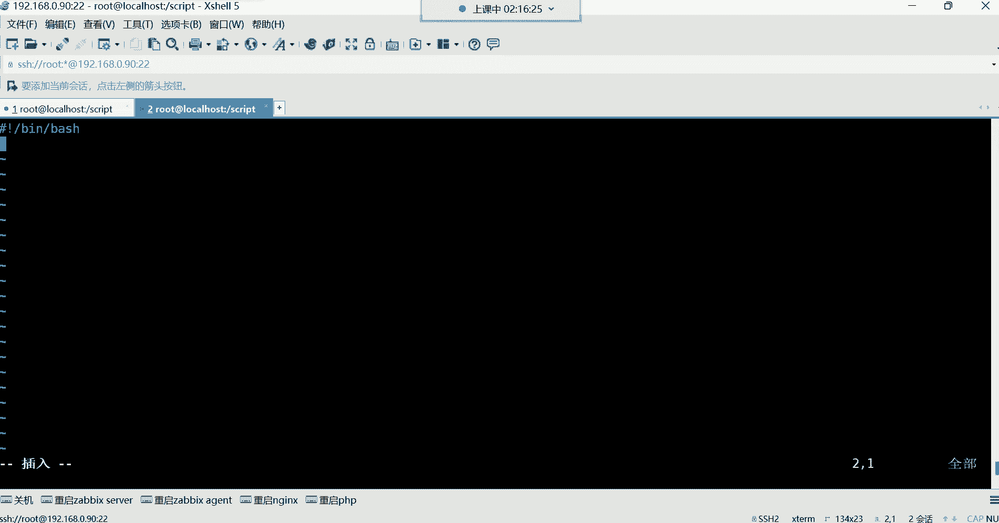

但应该是没有问题，应该用Q也可以，可以哈。

好那接下来我们第一步干什么事情呢，如果没有挂载，是不是应该先挂载呀，mount是把DV的CDROM挂载一下呀，当然我们前面好像挂载过啊，我们看mt的SX目录是挂载过呀，我先给它卸掉，U want。

卸掉哈，卸了以后干净了吧哈，接下来我们放到脚本里面，让它自己帮我挂，把第一位的CDROM挂在了mt的渗透S目录，好做个挂载，接下来正常来讲，我们会清空一下亚目仓库的路径的，把这里的文件都给它删掉。

如果是本地的哈，如果是本地，我们会给它删掉，因为如果你服务器在局域网里边，你搞那些这个网络仓库是没有意义的，所以一般如果我们是自建，这种局域网的仓库的话，我们会把这个路径的那些文件给它什么呢。

来给它删掉，所以一般还会亮RM rf etc em点REPORD，如果记不住也不想记，是不是可以复制啊，是不是在面试行里边复制，是不是可以，那像这种叉叉我都比较简单，比如说我选择这种叫瓷砖排列。

瓷砖排列是吧，左边用于什么呢，用于我的这个一些演示啊，一些这个左边用于tab键，右边呢啊我就写脚本呗，好那接下来在干嘛呢，再开始去创建这种仓库文件，创建仓库文件是不是应该这样啊。

VM在etc要么点reporter d下编写一个仓库文件呢，要local点rap啊是吧，然后把仓库的配置往里面写，是这样的，仓库的名字，local仓库的描述，local随便写SRS描述吗。

Base url，这就不能乱写了吧，等于本地的话就是用file冒号，两个斜杠来指定在哪呢，本地是不是在mt的4S目录啊，软件包唉拿过去是吧，然后接下来jpg check等于零不检测签名啊。

那enable呢也得写一个enable，等一启用仓库不仅的签名，是不是啊，那接下来这个是不是可以粘贴到这里面的，是不是当我们是写脚本啊，这种东西就是为了给大家演示，这边我不保存是吧，好那现在问题来了。

如果换到脚本里边，我不用VNM，我怎么把这个仓库里面的内容，给它放到这个文件里面呢，如果换到脚本，第一可以使用echo echo可以实现这个功能，不是这种一般不用C的C的，太麻烦。

echo可以echo结合这种重定向的方法，你看你EQ什么，比如echo a b CD重定向到一个文件里面，比如一点TT，你看一点TT是不是进去了，那你说我现在是不是可以echo什么呢。

echo仓库的这些配置啊，我可以这样echo中括号，仓库的名称放到一点TT里面，一点TT里面是不是可以，那这个一点ta t是不是就仓库的名字，接下来我再EQ一个仓库的描述local。

然后也给他放到这个一点TT里面，我再看一点TTP好，原先的没了是吧，哼原先EQ的没了，所以怎么办，还得用两个大于号，因为一一个大于号是覆盖，两个大于号是追加，是不是啊，所以这时候我们得先得先这样。

先把这里的内容给它清空一下，怎么清空呢，叫echo直接这样一点TT可不可以呢，可以那里边的内容就空了，为什么空了呢，为什么会空呢，因为我什么都没echo，我什么都没有echo，那这里面就是一个空行。

知道吗，一个空行echo是啥意思嗯，echo是一个输出的命令，这些前面不都讲过吗，前面都讲过哈，在HCC笔记里面有好，然后那我还就得这样呗，echo是不是啊，比如说echo一个仓库的名称，那就是中括号。

然后追加到哪呢，当你第一次你不需要追加，如果是第一行的话，你可以这样覆盖也无所谓，因为毕竟是第一行嘛，嗯当然一般情况下我们对于这种文件来讲，它里边有空行也不行，有空行也不行，所以把文件给它删掉。

我们再重新演示一下，echo好，仓库的名称，local放到一点TT好，这个一点TT里面是不是有仓库的名字了，接下来echo仓库的描述local追加到一点TT里面，那这时候一点TT里面就两行了啊。

在echo仓库的软件包的位置，在哪儿啊，是不是本地的MT的渗透S啊，啊追加到这个文件里面，那这时候这个文件是不是就三行了呀，软件包的位置也进去了，是不是啊，在echo以able等于一启用仓库的配置。

也给他追加到这个文件里面，是不是也可以啊，啊那几行了，1234再echo jpg check等于零，再追加到这个文件里面，是不是也可以啊，好五行，那我可以这样写吗，我是不是可以按照这种方法。

按照命令行这种方法一行一行的EQ过去，但是太low了，如果这样写一点水平都谈不上了啊，如果这样写这脚本千万别拿给别人看，如果你这样写的话，你这我告诉你哈，你这里边什么效果呢，echo啊，仓库的名字是吧。

追加到哪个路径啊，是不是etc em点repulse，点D下边，然后让他放到local点rap文件里面好，那接下来是不是还得继续，Echo，没错吧啊，echo然后再这样追加文件名路径，是不是还得放上去。

接下来再EQ，是吧哈哈，然后再追加放在文件里面，然后再这样再EQ再追加是吧，这样再echo再追加，你们你们知道我咋粘贴的吗，粘贴在叉烧里边有一个功能。

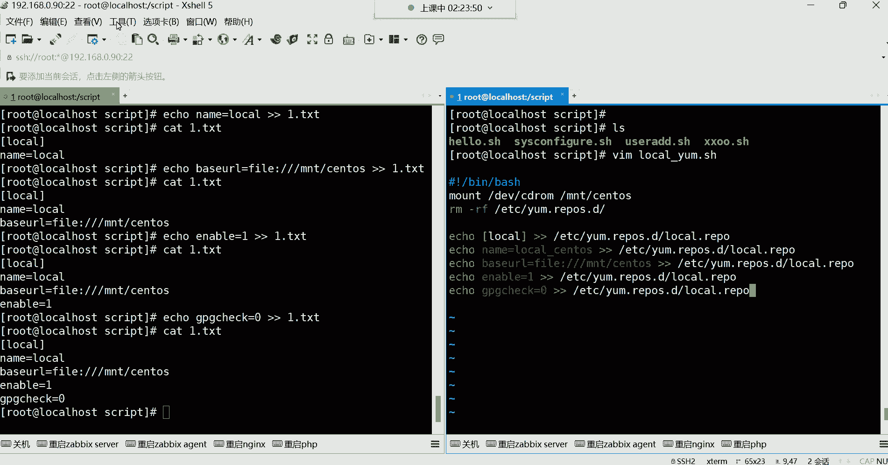

在工具里边选项，鼠标跟键盘看了吗，我的复制粘贴都是都是插销里的一些那个，快捷键啊，比如说我复制，为什么我一滑可以复制呢，因为啊里面就有个功能叫，将选定的文本自动复制到剪贴板，我一勾选这个我滑。

只要是我华中的任何的内容都被自动复制，那我粘贴的时候我怎么粘的呢，有个粘贴的操作，不是我粘贴，是按鼠标的那个滚轮，一按就可以粘贴啊，鼠标滚轮。

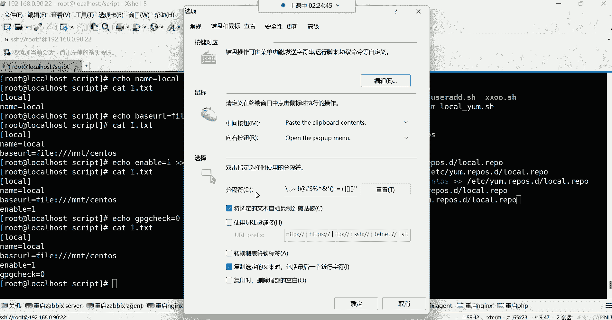

这是在哪个里面来着，好像是在，编辑嘛，啊啊对对对啊，对中间按钮哈，对对对啊，就这哈工具选项看到吗。

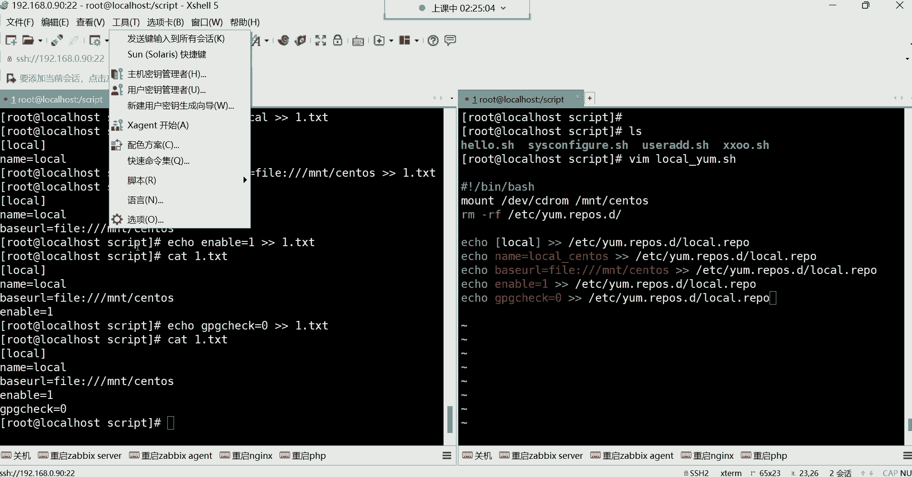

中间按钮这就是一个粘贴的操作，就是就是一个粘贴啊，唉这是嗯向右按钮是粘贴是吧。

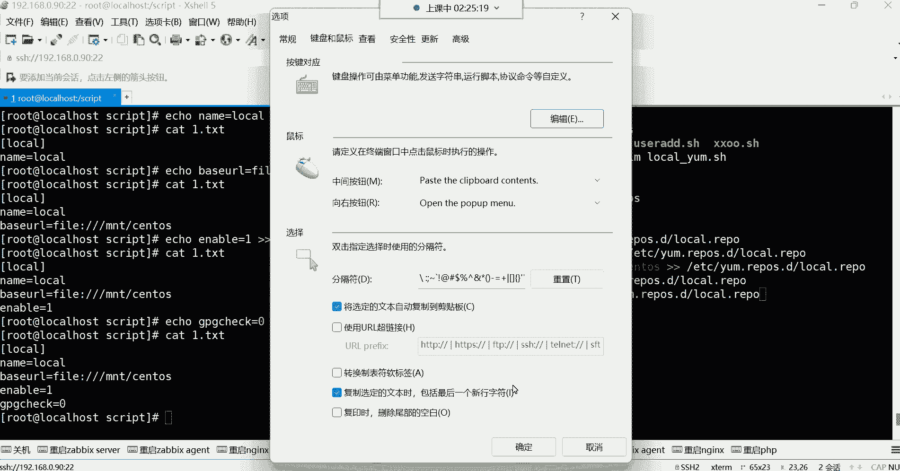

中间按钮，对就是就是那样的哈，所以说这种东西可以让我更加方便的去，在在在这里面进行复制粘贴啊，你们可以自己研究研究。

这种东西，可以百度搜，你比如说x shell，如果说你你们哈你们不知道的话。

这种东西可以去问百度，简单的问题，百度还是蛮实用的，你比如说这样插cell如何自动，啊如何叫做一键粘贴，看到了吗，这里边打开叉叉L选项，弹出设置框进行设置，这里边属啊键盘和鼠标中键按钮啊。

这嗯什么实现复制粘贴，要粘贴的内容，点击右键，然后在里面可以自己去搜哈啊，这种方法告诉你们。

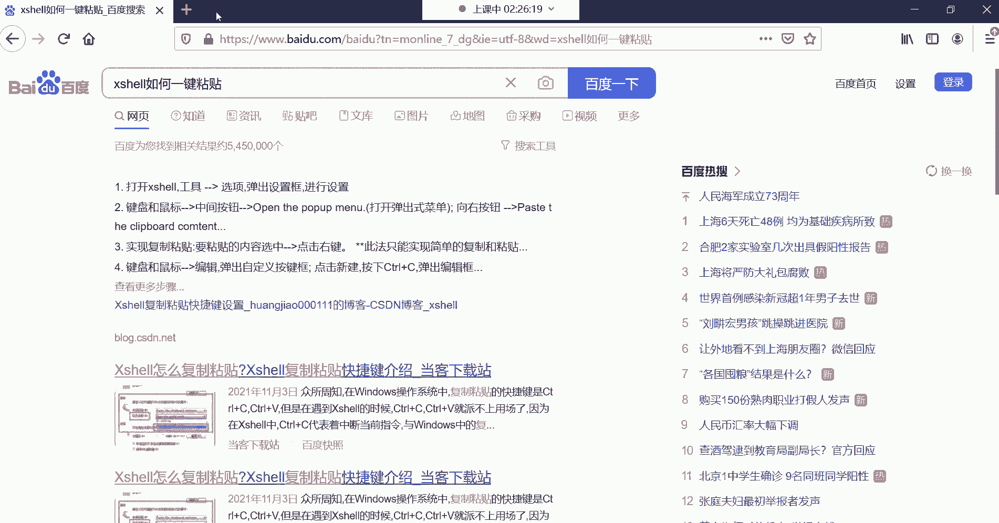

你们自己去研究就可以了哈，自己研究哈，三然后你们别到时候说我在这边操作呢。

然后你说这老，你说这老师怎么这个操作这么溜啊，别在背后骂我哈，这种东西是不是都跟你们说，前还有前面很多东西都跟你们说过啊，对对对，就是这个很多东西哈，嗯这种快捷操作啊，包括我快速调用的时候。

是不是我都是跟你们讲过ESC加点，是不是ESC加点，是不是快快速调用上一条命令的执行对象了，没错吧，前面都讲过哈啊那你说我们这样写可以吗，我们如果这样写的话，可以啊，可以哈，这都给你们讲过哈可以。

但是当然什么的这种脚本不能拿给别人看的，如果别人一看你这脚本简直一点水平都没有，一点水平都没有哈，所以我们一般像这种方法呀，就别这么玩了，删掉啊，几行123455dd，就这东西一旦我们有了思路了。

cat是不是可以实现这个功能啊，cat是不是cat是不是重定，可以结合这种重定向的输入符号，没错吧，前面给大家讲过cat这种重定向输入，你可以直接把内容输入到一个文件里面去，然后它的语法是怎么样用的呢。

你看我这个我在这个脚本里面就用了，太看了吗，cat这种重电量输入的方法就可以对，所以我们就这样哎，在这边就这样，cat这种重量输入的方法是得先结合重定向输出，然后呢再指定输出到哪个文件去看。

etc ym点repulse，点D下边放到local，点rapper文件里面，然后再输入输入什么呀，哎这时候你要输入内容了，这时候他就会把，他就会把我们接下来写的内容给你。

给我们输出到这个路径下的文件里面，所以这时候你要输入什么唉，EOF开始写写什么呢，仓库的名字，仓库的描述，软件包的位置，是不mt下的渗透S啊，接下来enable等于一，GB check等于零。

然后呢EF结束了，这时候他就会把我在EOF开头，跟EOF结尾的这些内容干嘛，给我输入到这个文件里面，然后保存退出，啊我们可以在命令行里面先实验一下，可不可以是吧，Cat，然后指定随便写个文件哈。

比如说这个叉叉点TT，然后接下来重定向输入啊，E o f，接下来呢仓库的名字，仓库的描述，软件包的位置，mt的渗透S，然后启用仓库GBT等于零，接下来EF结尾回车好看，这个文件叉叉点叉叉点TT。

是不是可以啊，是不是直接我一条命令结合一些这种，比如说重定向输入诶，嗯EOF是固定的语法，哎EOF是固定的语法，就是我在使用这种重量输入的时候，要在EF里边写，我要输入的内容，能理解吧。

这EOF是固定的语法，没有为什么这样，就像你说他为什么他的父母会给他取名叫老王，为什么你一听到一听到老王这个名字，你就觉得他住的离你家不远，这没有，为什么，这就是一个格式，而已，你就知道这个格式。

可以让我们把我想往文件里面写的内容给给我，输入进去就行，能理解吧，好那有了这个机制了，我们是不是就可以对于脚本来讲，比如说我想往文件里面写内容，cat是不是就可以替换vim了呀，没错吧。

是不是cat我就可以拿来替换VM了，对没错，不是不是输入到脚本里，是输入到文件里面，我现在是想把仓库的内容，注意这几行不是仓库的配置吗，我想把这些内容给它写入到这个文件里面。

但是由于VIM不能往脚本里面写，所以我只能用这种方法，这种方法是非交互的开头，他会把EF里面的内容给我，重定向到这个文件里面去，是这么回事好，那接下来呢我们最后再这样ym report list。

验证一下到底有没有软件包，是不可以啦，好保存退出，接下来来试验一下哈，给他个执行权限，local点要么点价格执行权限，脚本里没有回车，没有回车啊，它一行一行把你执行，然后我们就直接看看执行它。

但是local回车好，报错了，看了吗啊，什么啊，Low，第五行没有那个文件或目录，etc repord local点rap，没有那个文件或目录嗯，我看一下哪里的问题哈，看到了吗，报错了吧。

etc em点REPORD，啊这个写错了吗，啊不是哈，那也不是这个哈，他和这个没有关系啊，就是没有文件不啊，他这个可以创建文件的，它可以创建文件的哈，这个文件压根也不存在。

它这种重定向是可以创建文件的呃，我看一下第五行嗯，他给我提示，Cat etc，要么点reporter d local的rapper，让我们看有没有那个文件哈，啊没有这个目录啊，不是哈，哎呦哎呦。

你们看这哈，各位啊看到了吗，不是哈，跟那没关系啊，是这目录被我给删了，它可以创建文件，但是它不能创建目录，我这删除的操作有些大意了哈，是不是应该加个星啊，如果不加星，是不是上面目录直接删了呀。

所以你看我这边我推不见的时候，发现没有推不出来，没有推不出来哈，所以建个目录去，目录被我给删了，etc建一个YM点reporter d这个目录啊，这样就好了啊，所以这个删除是删除这个目录下的内容。

你不能把整个目录删了吧，是不是你删目录好，那他怎么在一个不存在的目录去，给你创建一个文件呢，是不是不太现实吗，所以这时候再执行就可以了，local点压么，点SHA走，你，还可以了，看了吗。

是不是也可以看到软件包的数量了呀，那前面说什么挂载这个什么忙之类的，没关系，由于他已经挂载上了，又重复挂，你看现在在那个mt sent目录是不是有内容了，那如果你再重复挂载。

你看mn mt把DV的CDROM，如果再挂载到这个目录的话，他就提了个，他就提示说你已经挂载了，已经有了，就不要再重复挂载了，因为这个目录已经是在忙碌的状态了，就不要再重复挂载，所以这一步不算报错。

能点吧啊，所以这个脚本已经挂载了，是不是这波可以删掉了呀，哎删掉啊啊是不是脚本现在可以了呀，那这个脚本如果说我们想搭建一个本地仓库。

如果说以后我要给所有的机器，都建一个本地仓库，那这脚本一旦写好了，我能不能把这脚本给它保留下来。

保留下来之后，我哪个机器需要的话，我是不是就给他传到哪个机器，是不是就可以了，没错吧，我不需要再去手动去敲一遍吧，200个机器。

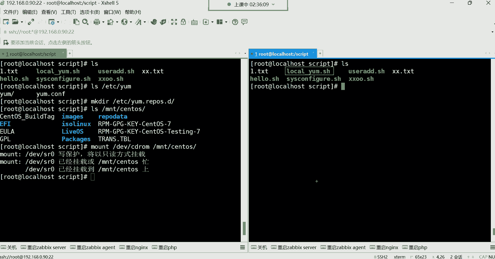

200个机器都需要你做这种同样的操作啊，我们先说我，我我们先不说我们那个脚本的那种同样的操作，就哪怕有一些需要你经常做的事情，你感觉很烦，浪费你的时间，而且还没有必要。

你是不是都可以给他写到一个脚本里面，以后再需要做这种事情的时候，把脚本拿上去跑一遍啊，把脚本拿上去跑一遍，把脚本拿上去跑一遍，是不是可以，我干嘛每次都得重复去敲啊。

没有必要，所以像这种东西呢，一旦写好了诶，我就可以什么时候有需求，什么时候我就拿回去，能有那么多服务器吗，很少见啊，当然有了，很正常啊，200多个机器怎么同时执行这个脚本，不然还是重复240是吧啊。

这个后期会有方法的哈，后期呢我们会学会学一些自动化的手段啊，自动化的手段只需要你去干嘛呀。

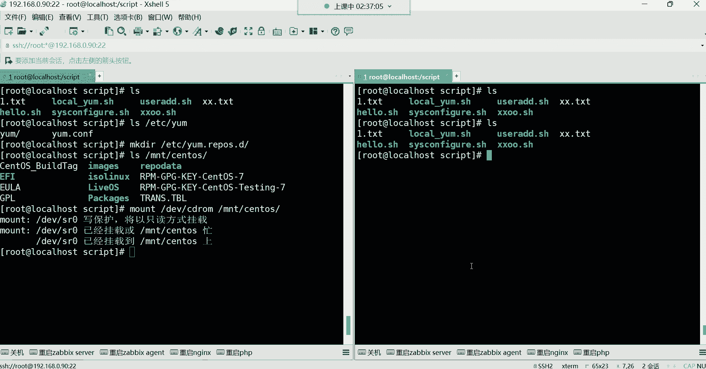

只需要你一个脚本，你都不需要拿到这200台机器上面去，你都不需要拷贝过去，你只需要有一份脚本，然后呢你去执行一遍，它可以同时对这200台机器批量的执行，唉安斯伯后期可以实现这个功能，安怎么可以哈。

不是unstable，后期可以帮我们去干嘛呢，执行这个脚本，但是我只需要去敲一条命令，我敲一条命令执行这个脚本好，他对所有的极其生效，你都不需要拷贝，你都不需要说哎呦。

我还要把每个脚本拷贝到这个机器上面去吗，而且这种事情都不需要不用，能力吧，能列吧，唉对，不是开多个窗口跟窗口没关系，你就是你如果是200个机器，我开我，你能开200个窗口吗。

是不是你不可能去开200个窗口吧。

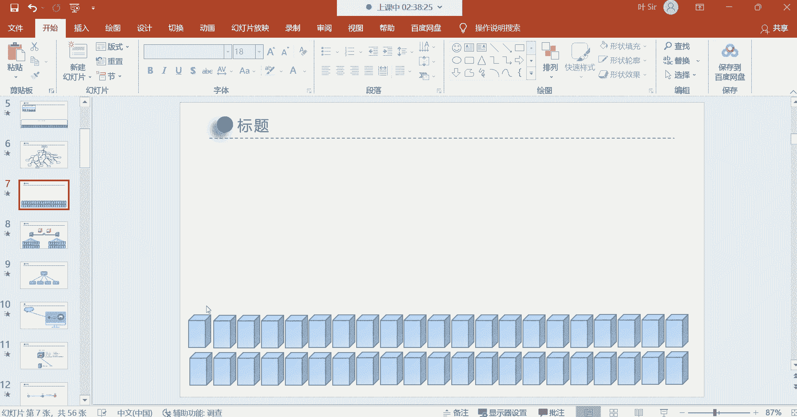

你看200个窗口，你想想这现实吗，现实吗啊最多你的界面它能容下几个，它能容容下几个终端的关键是是不是，你看你再开吗，还能开吗，也能开是吧，也能开，但是你再开的话就没有必要了，是不是啊，咱们不需要不需要。

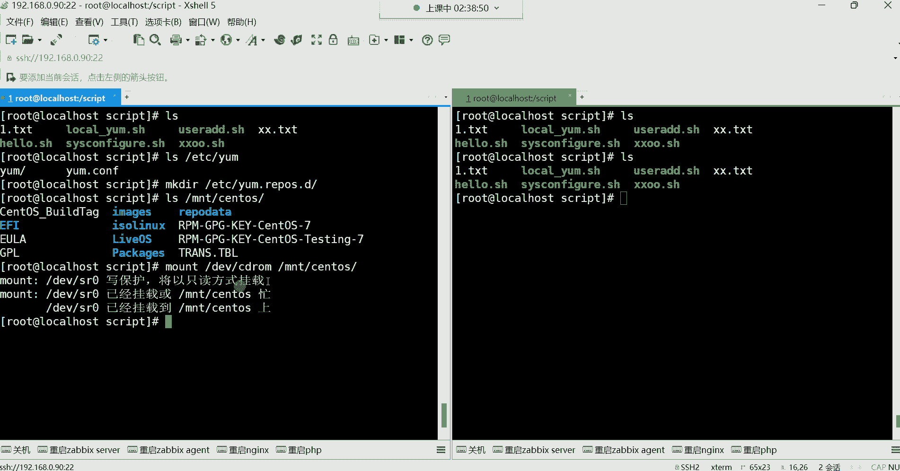

啊有那后期再说哈，那后期我们再说，后期学学到的时候，你自然而然就知道了，这种东西非常的简单，非常的简单啊。

现在你说我们想写一个脚本是不是非常简单呢，诶我想干什么事情，你发现我们用到的知识都是哪些知识，都是我们前边学过的知识，这只是新的吗，它不是都学过啊，那你说这个脚本我想让它更加人性化一些，可不可以啊。

都认识对，我想变得更加人性化一些，那你是不是可以加一些元素在里面的，什么元素呢，上来告诉别人这脚本在干嘛，说你EQ一个EQ什么呀，比如说这个脚本，正在搭建本地的软件仓库，是不是可以。

然后下边当执行到这里的时候，再这样EO一个什么呢，正在验证软件包的数量可不可以，但是停一下，这是停一下啊，不然它特别快特别快哈，sleep3秒钟是不是可以保存退出，然后再执行看看哈。

你发现这脚本一直行啊，我知道他我知道他在干嘛，诶是不是可以了，是不是哎你搭建完成也行，怎么着都行，最起码是不是，最起码你能知道他干了什么事情呢，嗯那你说我能不能再去优化优化这脚本。

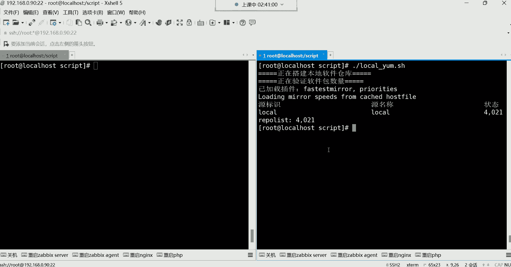

我们说脚本这些东西都是得去不断的优化。

你比如说对于这这个脚本来讲，我想优化优化，我怎么优化呢，我觉得这脚本呢有很多东西我觉得没有必要，你什么一加载插件这些东西我要它干嘛呀，我有必要留它吗，我是不是就想看总共有多少个包就行了呀，是不是可以。

所以怎么办，这玩意儿再优化一下，但是优化的时候，你得你得知道我应该优化谁，这个输出怎么来的，就这个输出是怎么来的，哪条命令产生的，你才能有具体的优化哪些命令啊，是不是ym report list。

就这玩意啊，已加载插件，是不是啊，那怎么办啊，我不想看所有的，我就想看最后一行怎么办，管道给还有杠铃，可不可以，是不可以，对啊，group也行，我用grab是不是也可以，Grp。

我只过滤包含rap list的行，是不是可以好，那下边这脚本是不是就可以这样了啊，让他信息输出的更加这个简洁准确一些，无用的就不要了，那就grape repolice，直过过滤包含这个关键词的行。

保存退出，这时候我再执行没抽，诶诶，这是不是就感觉就不太一样了，是不是感觉就高大上那么一点点，没错吧，唉这最起码这脚本拿给别人可以用了啊，你这个脚本现在你让别人看啊，别人也知道这脚本干了什么事儿了。

是吧啊，那如果后期，EF符号没有空格要求，没有空格的要求哈，EF没有空格要求，这个EF，在这，他们两个之间没有空格要求，但是这个符号跟这个之间要不要要不要加空格，这一般加空格，一般加空格，不加空格。

是不是他们两个变变成一个整体了呀，那不行啊，所以这个位置呢UF跟他们之间有没有空格，无所谓哈，加也行，不加也行，好保存退出，嗯需要加这个吗，能知道是本地仓库还是亚马仓库啊，不用加不用加加那种东西干嘛呀。

不用加啊，这就是我们所说的这个脚本，是不是现在给我的感觉就不一样了，那后期如果那后期如果我们在学AWK呢，如果再学AWK，我还可以这样玩呢，前边过滤之后是不是啊，我能不能只过滤这个数啊，group不行。

group没有办法，所以我还可以这样，我用AWK是不是直接可以AWK，不用grip，然后这时候，当然这些操作呢你们先不用去管哈，因为我们还没有学AWK，所以这时候我还可以这样打印它的第二列，可不可以。

我只过滤这个数，前面那个的我我都不要了，你说前面这个我都不要了，那怎么办，那你让光让别人看这个输入行吗，其实也行，正在验证软件包的数量是吧，唉那我还可以这样啊，就告诉别人有多少个包不就行了吗。

所以这时候我们还可以，如果想玩得更加的人性化的时候，是不是可以这样了，一行行也折行啊，这时候如果再看的话，来看哈回车，诶可不可以呢，嘿嘿是不是可以，当然AWK我们现在还没有讲。

所以这一步可能说你们无法理解它的一个格式，这一步你们可能无法理解它的格式哈，但是这样是不是也可以了呀，是不是啊，这样也可以了哈，就是我们不学AWK，你说我们学grab是不是GRAP也可以啊。

也不一定非得用A，也不一定非得用AWK吗，我就GRP不就行了吗，我就过滤，只要自己能看懂就行，这玩意也不是给别人看是吧，我自己能看懂，我自己知道这个代表什么意思就行了啊，软件包的数量。

那如果你说我觉得这个还不够，再还不够人性的话，我再想优化一下，可不可以呢，那这个就复杂了。

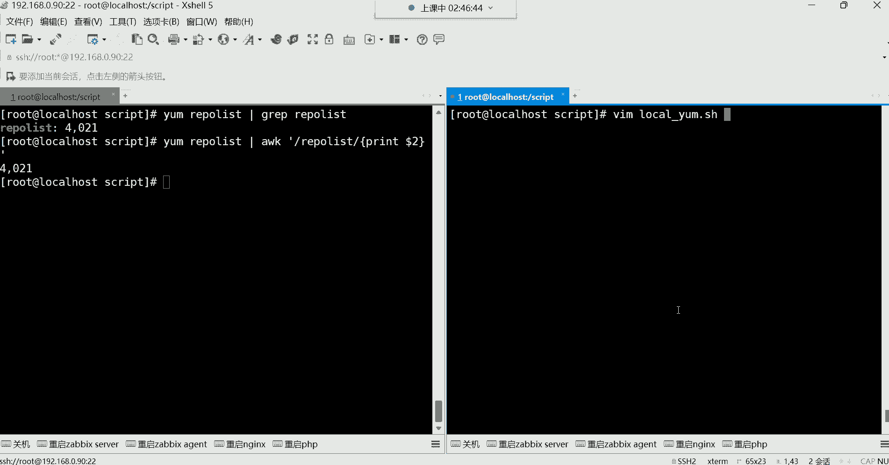

如果你这样优化，我这个笔记里边有一段配置嗯，太简洁了。

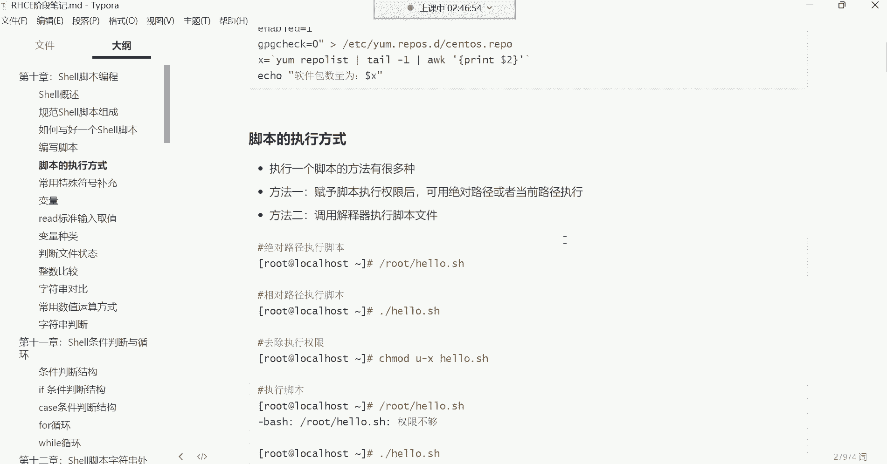

不了解的是不是看到这页面会蒙圈不，这简洁的输出都是有用的输出，除非他不认识中文，除非他不认识中文，他看不懂这几个字的含义，能理解吧，他只要但凡能能能他只要但凡识字的话。

我觉得这些东西应该都理解的是什么含义吧，是不是没错吧，那如果你说他真的不理解好，后期我们还可以想方设法，我们可以想方设法给它搞得更加简洁一些啊，啊不能说更加简洁，是更加的人性化。

你说好老板这人呢他除了虾以外呢，他还不愿意动脑子好，那这时候我们可以这样啊，我们后期学一个叫变量的东西，我们可以把我们这个命令给它，定义成一个变量啊，再结合一个叫反撇号的东西。

这时候ym rap list管道给AWK，这个时候我们还可以这样玩啊，他不看不懂吗，是吧，好没关系，那这时候定一个变量好，变量定义完了之后干嘛呢，给大家看，当然这操作你们先不用管哈。

好这个这个X里面存的就是我的软件包的数量，是通过这条命令取出来的这个值啊，通过这条命令把我的软件包的数量取出来，存到这个X里面存进去了，存进去之后干嘛，echo你不看不懂是吧，软件包总数量为看不懂是吧。

好这回我必须能让你看懂，这样能看懂吗，这样能看懂吗，那如果这样的话，我们就，就这样定义变量，然后把这个命令拿过来，我就问你如果这样去执行脚本的话，能不能看懂，除非他真的是没文化，除非他连除非他连阿拉他。

除非他连这个我们中国的这个字他都不认识，这时候应该能看懂了吧。

是不是，如果你说好，老板还要求点体验感，说你这脚本写的太low啊，说你这脚本写的太low了，好没关系，干嘛呢啊，我们再来来个这个叫给你增加个体验感，你不是嫌没有体验感是吧，好那这还有个带进度条的呢。

下面给你来个小进度条，让你感受一下它的安装过程。

上边在这儿先告诉你，我这脚本在干嘛，然后呢，我给你来个体验感，这时候，再执行啊，这样诶诶看到了吗，嗯是不是可以，或者说，这这是不是就可以了，你说诶是吧，给你来个小进度条，让你感受它的安装过程。

这老板觉得诶可以啊，这还嗯还有个小进度条是吧，是吧啊，所以说这种东西呢嗯你可以不断的去什么呢，不断的去优化它，呵呵老老实正是花里胡哨的是吧，嘿你说你这花里胡哨的，你说他妈大爷不伺候你了。

嗯你说你自己干去吧，是不是这也不行，那也不行啊，天天找茬，是不是啊，呵呵你问你自己干吧，这这这就可以了，是不是唉这就可以了，但是这进度条这里边涉及的内容啊。

这里边有变量啊，有for循环，还有一些这个判断之类的，这个呢我们我们现在没有办法给大家去讲，能理解吧，所以你们呢先不用去纠结，但是这东西它是一个固定的格式，注意啊，你们如果后期需要。

比如说我要来一个进度条，如果你后期需要来一个进度条的话，那这个是可以直接拿过去用的，任何的脚本，如果你想加一个进度条都可以直接调用啊。

这没有任何问题，它是一个固定的格式，它它的主要的功能就是给你干嘛呢，就是给你来一个这个就是给你增加个这个东西，能理解吧，对我说叫装逼利器啊，好那这就是脚本，虚拟的虚拟的哈。

它不会根据你的一个整体的一个一个这个，比如说这个代码真的是这个具体的执行进度，去给你显示这个进度条的，不会的，他就是上去我先给你先给你来个体验感，假的假的，我上去先给你走走，一个进度条。

下边呢我再执行下面的命令，能列了吧，哼因为它里面并没有涉及到一些判断之类的，并没有假的，但是没关系啊，但是没有关系，这种东西唉，其实我们可以这样，这种东西你如果想让它变得更加简洁嗯。

这种东西你可以给它删掉，删掉就直接一直行，你看就这样搭建仓库是吧，软件包数量是不是可以，对这种东西给别人看的哈，花里胡哨的东西嘛，花里胡哨的东西是给别人看的，是不是那别人的喜欢呢，是不是啊。

那也没有办法呀，你就跟现在那个啥似的，就是你找那个女孩子一样，你找女孩子人家都喜欢那种嗲嗲的，是不是张口闭口管你叫哥哥，是不是那谁喜欢那种那个走路带风，谁都不，一股老爷们儿的呀是吧。

喜欢的不就是这感觉吗，是不是要的是这种感觉，那你说如果你找女朋友，你就为了用我擦，我就为了用，那你那你还在乎什么体验感吗是吧，你还你你还在乎他长什么样，你还在乎他体重的那个到底是90斤还是100。

90斤吧，你为了不就是用吗是吧，把灯一关，脸一蒙是吧，你这呵呵呵呵，其实最终不也一样吗，是不是啊，但是你不就是为了一个那个体验感嘛是吧，你想找那种啊温柔体贴的呃，说呃那个说话呢还得是这个捏声细语的。

是不是啊，然后嘿嘿嘿嘿嘿，你们要的不就是这个感觉吗，是不是，所以说这叫体验感啊，这叫体验感，这体验感很重要啊，这体验感是非常的重要，哈哈哈哈哈哈哈哈哈好了，歇会儿吧，歇会儿吧，要是20分钟了吧。

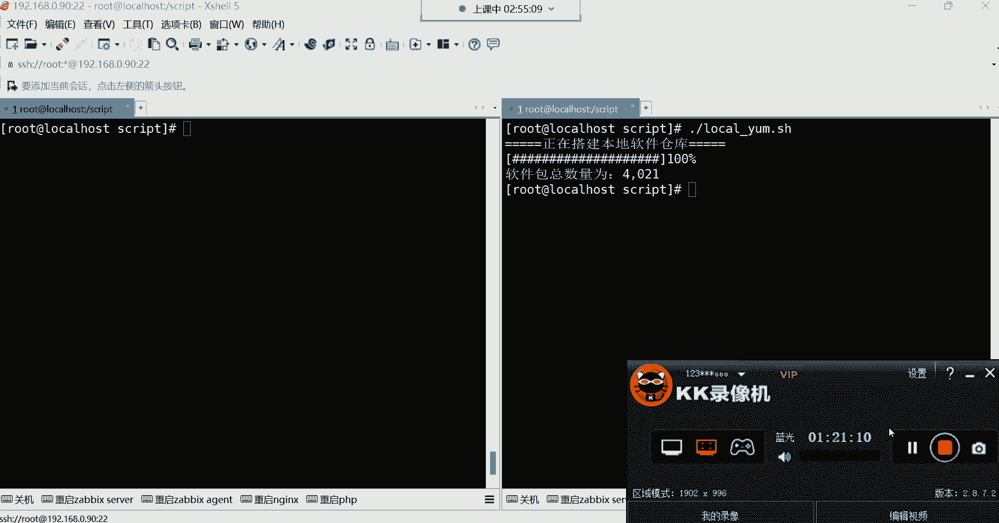