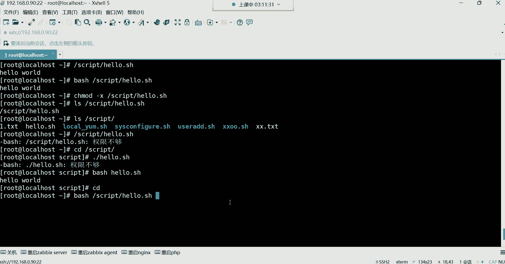

# Linux运维培训教程超全合集，通俗易懂，适合小白，带你从入门到精通1 - P39：红帽RHCE-4.常用特殊符号补充 - 洋洋得IE - BV1qX4y177j1

好各位同学，我们继续吧，都回来了吗，回来的话给我刷波一好，可以是吧行，那咱们继续讲解啊，我们这个室友脚本，我们接下来呢要学习几个shell脚本当中。

我们经常会用到的一些什么呢，这个我们先讲执行方式，一会儿再讲几个特殊符号，这个脚本的执行方式，就是我们前边我们写好脚本了，我想去运行它，让他帮我们去执行里面的命令。

那这时候执行方式第一呢赋予脚本的执行权限，这也是我们前面一直在用的，赋予执行权限之后呢，我们就可以用这种绝对路径或，相对路径去执行了，好那这个给大家演示一下。

相对路径一定要什么呢，加这种点杠，不加点杠，你写这样，你比如说我要执行它，系统不会认为这是一个脚本文件，他会认为这是一条命令，所以你看他给你提了什么，他说未找到命令能理解吧。

所以你怎么让系统知道这是一个脚本呢，唉点杠点代表当前路径，斜杠代表当前路径下的什么呢，这个文件回车这样就可以了，那系统就知道啊，原来你想运行的是这个路径下的这个文件呢，是这么回事，好那这是第一种。

那这是相对路径得有执行权限啊，那绝对路径呢，比如我没有在这个脚本路径怎么办呢，好那就指定这个脚本的所在位置在哪儿呢，在跟一下的script下边有一个文件名叫hello，点ISH，我想执行他回车。

这样也可以，那绝对路径还需要加点吗，如果你要加点儿，你就是回家种地去吧，绝对路径加点干嘛，绝对路径，那你加点就就代表当前路径了，能列吧，就不能加点儿了哈，所以绝对路径就直接指定脚本的所在位置啊。

这点这点思考如果都没有的话，那我就建议你别往这个方向发展啊，嗯啊这是执行方式啊，绝对路径怎么执行。

相对路径怎么执行，接下来第二种方法。

调用解释器去执行脚本，这种调用解释器啊，一般用的比较少嗯，调用解释器，我们可以直接这样用BH解释器去帮我执行的啊，对中低都不认识苗，如果调解释器，我们来给大家演示一下哈，啊解释器BT直接指定啊。

这样也可以，但这种呢一般如果这脚本你不给他执行权限，如果你不能执行权限，那解释器也可以执行，那我给你们演示一下，比如说我现在趁着mod，我把它的执行权给它去除掉，现在这个脚本是没有执行权限的，看到了吗。

看了他现在是没有执行权限呢，没有执行权限，如果我这样，甭管是绝对路径还是相对路径，或者我进到这个进到这个进到这个目录，我以相对路径的方式去执行的，你发现都提示权限不够，都不行好，那怎么办。

我还不想给他执行权限，我还想执行的，我既不想给他执行权限，我还想执行它，那BT就可以帮你实现这种需求啊，不需要执行权限，用batch直接指定，这是可以的，那这种呢也是绝对路径，相对路径都通用。

你就BH指定这个路径下载这个脚本。

这种都可以能理解吧，所以对于这种东西的话，就是执行方法有很多种，但是常用的肯定是赋予脚本执行权限，剩下的就是绝对路径和相对路径，看你自己的需求，调用解释器呢一般比较少一些啊，所以这是执行方式。

那下面呢常用的特殊符号，常用的特殊符号引号，我们接下来要给大家讲讲这引号，双眼跟单眼，跟单眼哈，双眼跟单眼，这都是叫特殊符号，那这种特殊符号，它在系统当中的功能到底是什么呢，这个我们先来给大家说说。

他们的功能都可以引整体叫引用整体。

什么叫引用整体呢，就比如说啊我在echo1些内容的时候，就拿那个仓库来讲哈，我们前边是不是echo有仓库的名称啊，好然后呢放到这个文件里面去，但是我想同时echo很多行的话，那怎么实现呢。

这种一次只能EQ1行是吧，我想同时EQ很多行，我想让它变成一个整体，什么叫整体呢，是引号双引开头，然后回车，这是第二行了，注意啊，这是我EQ的第一行啊，但是呢由于我这个整体呢有很多行。

我这个整体是很多行哈，所以这时候怎么办呢，哎我回车没关系，你发现这命令行没有结束，他还在干嘛呢，还在等着我输入内容呢，所以这时候我在name等于仓库的名字再回车，你说我能够一直回车到什么时候呢。

只要是他没有看到他的另一半好，你可以一直去写你写的所有东西，只要在这个中括号里边啊，在这个单引号，在这个引号里边都叫一个整体，啊这叫啥啊，当你写完了好引号括回他，是不是看到他的另一半了呀。

啊那这时候这就是一个整体，你回车看到了，他给我输出这个引号里边的这几行，这个整体还有什么呢，还有我在建文件的时候，我建个文件，我希望这个文件的名字叫A空格，可不可以，如果你这样建不行。

这样建它就是两个文件，就是A跟B你这样看的时候，你看你看一下它就是两个文件，A跟B是吧，好我想让它变成一个文件，可不可以，A跟B是一个整体，我不想让它分开好，那touch引号引起来A空格回撤。

你发现诶这怎么看不出来效果呢是吧，是你如果对于你来讲，你这样看，你发现诶这怎么同名了呢，你看有两个文件叫A，两个文件叫B啊，这不太现实啊，这文件同名还能同时存在吗，是不是。

或者我再讲个文件踏实引起来空格hello，点TT诶，你再看哎哟很奇怪，奇怪在哪里呢，这同一个目录下怎么可能有两个同名的文件呢，是不是，这引号它可以帮你干嘛呢，引整体就空格。

也是属于我的这个整体里的一部分，能理解吧，这叫整体，那你删的时候你发现好，我想删hello，点TT可以删啊，我再想删hello，点TT，你看诶这怎么退不出来了呢，你发现我这里面明明有一个文件。

你看明明有个文件叫hello，点TT，但是我在删的时候，RM杠f hello，第二天提一分诶，没删掉，看到了吗，这不对啊，你发现这明明这文件名它就叫这名字，为什么我就删不掉它呢，这很奇怪呀是吗。

还有这A的文件也一样好，我想删A啊，回车好，A没了哎，不对，这还有一个A是吧，我这样删2M杠2FAA不对，这删了半天怎么还在呢，是不是我想删B好啊，少了一个B，那我再删，我再删那个A回车，你发现删不掉。

哎怀疑人生了是吧，哎这不对劲啊，这文件都删不掉是吧，那如果这样看一看呢哈哎你这样看，你发现就是如果你不仔细看的话，你你是发现不了这种问题的，你是发现不了这前面还有个空格的，知道吗。

你不会在意谁会在意这种东西啊，是不是啊，但是它就删不掉啊，就这种啊，这种还算是什么呢，哎你那你说我加个空格删它，这样可以吗，不行诶，你看你说你看你看我光标，我加个空格，hello点TT，删得了吗。

删不了删不了，为什么呢，你这个空格系统可不会认为，跟这个文件名是个整体的，能理解吗啊这种比较搞心态是吧，再来给你搞，再给你说一个更搞心态的，它是一个，Hello，点TT，这样搞不好心态，你这更坑。

你这根本就看不出来，你这更看不出来呢，其实他后面还有两个空格呢，它后面还有两个空格哈，啊看到了吗啊，你退不见的时候，哎，退不出来了，这后面啊两根斜杠告诉你，这有两个空格啊，这样可以这样可以哈。

但是这种搞心态你是一般不会发现的，这种搞心态你一般发不现，没有办法发现，是不是谁会去仔细看诶，这前面还有个空格，为什么它不对齐呢，所以是什么，什么叫整体啊，这就叫整体，只要在我这个引号里的东西。

你甭管它是个啥，它就是一个整体啊，甭管它是个啥，你是空格也好，还是什么特殊字符也好，它都是整体，你知道吧，都是整体，如果有一天你发现这文件删不掉，哎你就得好好看看这文件啊，是不是有些猫腻。

因为你删了半天，你发现删不掉啊，哈哈哈哈好。

第二整体哈整体，然后单引号也是一样，效果都一样，都一样，都可以引整体啊，所以单引号就不显示了，但是区别就在于说这个单引号啊，它在引用整体的时候，可以取消所有特殊字符的含义。

啊它可以取消一些特殊字符啊，在这个系统当中有很多的特殊字符。

我看你我看我这里面有没有好的例子哈，就拿这个我们后面会学会学习一些变量，我们后期会学一些变量哈。

这个是什么叫变量，后面也在给大家解释啊，就是什么呢，一个名字里面可以存一些东西啊，就比如说我们前面定义的那个什么呢，那个X，看到了吗，这个X里边这个字母里面呢，我们前面是存了软件包的数量了啊。

软件包的数量哈，然后这个软软件包的数量存到这里面之后，我可以这样，我是不是可以这样，软件包数量为，每到X是不可以，但如果我把这引号换成单引号，不好意思，它没有办法识别每刀没有办法识别刀了符。

你看它成什么了啊，等会儿如果我换成单引号的话，大家看效果吧，软件包的数量就是没到X，他并不会认为这个dollar符是具有特殊功能的，它给你屏蔽掉了它的特殊功能，能理解吗啊有你就记住这两个的区别。

都是引用整体，只要是在我这个引号里边的，它是一个整体啊，他们是一起的，说白了对他们是一起的，但是呢，如果你这个整体里面包含一些特殊符号的话，你想让它发挥自己本身的特殊功能，就不能用单引号。

因为单引号就给你屏蔽掉了这个特殊的功能了，而双引号它就不会给你屏蔽它的特殊功能，双引号会让这个特殊符号，发挥它本身的特殊功效，所以这就是它们的区别，但是都可以让它们变成一个整体，变成整体。

好这是我们所说的双眼和单眼的区别啊。

后期会频繁用的，你就知道他们两个都是眼整体，但是呢具体的区别是什么就行了啊，一个是不取消特殊符号的功能，一个是取消特殊符号的功能，下面四则运算，四则运算，什么叫四则运算呢。

就是计算器里边的加减乘除在计算器里边，比如说我想做一些看看加减乘除，这叫四则运算，那这个四则运算在LINUX里面怎么用诶，很多种方法，第一种，每到中国号就可以帮我们做这种加减乘除。

怎么玩呢，非常简单，每刀中括号1+1啊，它没识别到，为什么呢，因为他认为这是一条命令看了吗，但是压根儿也没有一个这么奇葩的命令啊，如果怎么样才能让他帮我去做计算呢。

唉输出echo echo在脚本领域是非常牛逼的，这条命令，你别看他说EQ什么就给你输出什么感觉，他没什么意义，但是在脚本里面没有他这脚本呢就不行啊，这时候我想做个加减乘除的运算好。

这时候echo把它的结果给我输出出来，这时候就再做1+1=1，加一等于几等于二好，那接下来这是加法吧，比较简单减啊，我这2-12减一等于几等于一是吧，然后我再做乘法啊，2×2星号代表层，注意哈。

这个在这个命令行里边，信号代表乘它不像我们计算器里边，你说那个乘号不一样哈，不一样，这里面星号就是代表乘2×2和四好，那除呢除怎么样，它也不是我们在那个在那个计算器里边的，那种方法，这样他不是这样。

它是斜杠，就是根目录的那个什么呢，那个斜杠是除，比如说10÷3，三三得九是吧，10÷3还得三，10÷2得五，251十，5÷0试试你，你你怎么算，看你自己，总之他能帮你算5÷0。

这凑的哈哈哈哈哈哈啊哈哈嗯嗯，这错误符号是吧，这零这零咋除啊，这零除不了啊，但是你说5÷1可以一五得五，这零怎么除啊，哪有这种逻辑啊，这就直接给计算机整蒙了哈啊，这这直接给计算机整蒙了，你这零能被除吗。

哈哈哈哈好，这是加减乘除，这比较简单吧，小学里边的十以内的加减乘除啊，这没有什么太多可介绍的了哈哈，没有什么太多可介绍的好，那接下来我们说说这个还有一个叫曲取百分号，叫取，什么叫取，你看我们说10÷3。

这10÷3=3是吧，那就三三得九，其实它有个余数，余己呢于一没除开嘛，余一了，所以我想看一些除法的余数啊，就算没除开的余数，我想看一下10÷3余几呀，飞车于一，哎你看就我想看一下，除不开的情况下。

10÷3，正常来讲他肯定除不开，但他余了几了呢，唉娱乐一了啊，那如果取干嘛呀，哎这取于后边现在没什么用，但是后期呢，我们对于它的用处是非常非常大的啊，可以控制一些数字的范围，你先知道怎么取。

用百分号就可以取除法没除开的那个余数啊，没除开的余数。

用百分号给它取出来，那你不能光这样自己去除，然后自己去算吧，那最好的方法就是用这种符号去取它的余数，就可以了，然后下边啊这个四则运算的话呢，我们后期还会讲啊，先知道一下。

每到中括号四则运算加减乘除比较简单。

你比如说我们后期想你在学习这个系统的时候，哎比如说遇到一些这个算数算不开了，比如我的薪资啊，我算一算这个这个月hr怎么给我算的薪资，不太对呢，啊明明是这个我要这个明明是这个8000块钱啊。

然后我的再加上我的加班费是多少呢，我明明是3200的加班费是吧，但是明明少了一些啊，你可以自己算一算，是不是啊，这明明应该开这么多钱，但是少二少200块钱啊，那你说这不是考验我的加减法的吗。

是不是可以算一算，那你说这种东西我能不能后面再接呀，比如说三啊，这8000+3200，然后我再去这个减一些可不可以呢，啊可以你可以无限算下去啊，大可不必说口算就行。

然后这种东西呢，我们这个当然这这种东西，我是没有去这么玩的哈，我只是给大家举个例子哈，哈举个例子大可不必啊，然后接下来呢还有这个预算，工资扣社保2500是吧，越算越难受啊，还有这个每刀小括号。

将命令的输出结果作为参数。

什么意思呢，将命令的结果作为参数啊，结果作为参数，比如说我想建个文件啊，我建个文件呢，我想让这个文件呢附带一下当前的系统时间啊，我当前的系统时间是这个什么呢啊，比如说我加一个D百分号，大写的F。

那前面还有个加号哈，你看当前我想建个文件，附带我当前的系统时间啊，甚至是连比如说小时分钟秒都给我附带一下，那就再来一个百分号的H，可不可以呢，4月4月二号，然后这是，嗯几点啊，是这个嗯。

4月23号17点，那这样哈，就是加个杠，然后再来一个百分号小时，再来个杠分钟嗯，百分号M秒杠，百分号S啊，我记得我记得有个大X哈，小时分钟秒大X诶，是嗯是大X吗，是大X是吧，加号百分号大X嗯。

它怎么没有识别呢，嘿邪了门了哈嗯4月23号小时分钟秒，是我说错了吗，这不用加号，我记得他们两个之间不需要用加号的呀，不需要加号哈啊这样可以这样可以哈，哎那前面为什么同样的命令他这个你看一下啊。

那百分号大F，百分号大X为什么这个位置你看百啊，多多了一个百分号是吧啊，我说的嘛，我说这这系统怎么还有些不太开心吗，不应该呀是吧，这样可以哈，我想建个文件啊，我就想让文件给我附带一下。

当前这个年月日小时分钟秒怎么办呢，怎么样才能附带呢，touch这时候比如文件名叫ABC点TT，那我能直接这样吗，把这个拿过来，放到后边，这成啥了呀，这成啥了，你看呃。

他他认为你想建一个文件名叫ABC点t t date，是不是出来了啊，另外一个文件叫什么，叫叫这个名字的，是不是也出来了，他认为这是两个文件，他认为这是两个文件哈，那你说那不行啊，这是一个文件呢。

我给他用引号引起来可不可以呢，引起来啊，让它变成一个整体回车，那它确实变成一个整体了，那就说这个文件的名字确实叫这个名字了，没错，一点毛病没有看到吗，变成整体了，但是这不对呀。

时间呢这时间呢我要的是时间呢，我想取这个它的结果，你说我要这东西干嘛，什么百分号F百分号X我要它干嘛，我要的是里面的结果，里面再加个引号啊，不行，你看加引号也没用，加引号也不是我想要的这个结果。

你就比如说好，我要做数据备份，我要做数据备份哈，现在我做数据备份的话，这个备份的操作是什么时间备份的，我想去记录一下，我这样我踏杠CCZF，我对嗯，备份以后呢，比如我让他叫这个log点踏点GZ。

但是我想标记一下这个时间对谁呢，对Rush的log下的星点log作为分好，那你说我怎么样，才能让他把我刚刚现在的这条命令给我，记录下来，我什么我什么时间做的这个备份操作，这个就难了，这个就难了哈。

你说我把这个命令直接D对啊，加个引号是吧，能这样玩吗，data加号百分号F百分号，派克，可以吗，不可以不可以，没用单引号是吧，好单引，你啥眼也没用，有有这么玩儿的吗，关键是有有这么玩儿的吗。

有这么玩的吗，他确实给我背了，看到了吗，什么log点踏点JZ，然后data加，这这确实给我背了就背了，但是时间呢取不出来，我最终我想娶她的时间，这引号它的功能只是引整体注意啊，你甭管双引号单引。

它只是为了引整体告诉你这是一个整体，但是我要的是它的结果，我要的是date这条命令的结果取不出来，那怎么办，这就无法满足我的需求，是不是，所以这个时候看哈，我建个文件返撇，然后干嘛呢。

就是文件名叫什么呢，文件名比如说让他叫嗯叉叉点TXT，然后后面跟上什么呢，文这前面是文件名吧，后面是什么呀，data加号百分号大F百分号大X，回城文件名是不是还是还是叫这个名字呀，但是后边是什么呀。

是不是这条命令的结果取没取出来，取出来了，没错吧，把它的结果给它取出来了，结果看到了吗，我们要的是啥，最终是不是我们要的是它的结果呀，那如果你说我觉得这结果不行，中间要加一个小横杠，可不可以可以。

那这个文件名字这个看到吗，中间就多了一个小横杠，但总之是把结果取出来哎，取出来了，那我如果有了这种方法，我做备份TGCZF好，我要对什么呢，对那个文件作弊文叫什么名字，让他叫log点差点GZ。

但是后边附带系统时间，什么时间备份的，给我记录一下什么时间呢，不知道哎，反正是什么时间，你给我就取消本地的时间就行了，data加北方大F，加个空格行吗，加个空格，这时候就得用引号引起来了。

唉然后百分号X如果你不加空格，这个位置注意啊，如果你加空格了，但是你不引起来它这个效果可以吗，不可以先演示一下哈，这时候如果不配合这个引号的话啊，我直接加空格，我们就先不备份。

我们就直接把这个命令直接拿过来执行一遍，你看什么效果，看到吗，就是你data你加百分号大F没毛病，但如果你贴上也没毛病，它能识别，但是你一旦加了空格了，他认为什么呢，后边的这个它无法识别了。

它无法识别后面那个百分号X是个啥，因为什么，因为前面没有data命令，因为data命令后面只跟了什么呢，这个F所以你这样，它就识别不了你怎么样，怎么样能让它识别呢，引起来，可不可以告诉他告诉这条命令。

这是一个整体，他俩是一个整体，都帮我去执行，那这时候是不是就中间多了一个空格啊，没错吧，你看这就比较细节了吧，就非常细节了哈，这得看你自己去用思考，那你得去思考一下，那现在有了这种方法。

我在做备份的时候，我TGCZF。

我在取命令结果的时候，反撇号，注意哈，叫将命令的输出结果作为参数了。

说白了就是将命令结果给它取出来，取出来以后作为我的这条命令的参数，我这条命令做备份，那那个结果就是我的这条命令的备份的，那个参数啊，我要对那个命令的结果去执行，所以这时候再加个引号。

这里边是不能用单引的，各位能用单引吗，就不能用单引呢，如果用单引，他是把这个什么百分号，这个特殊功能都给它屏蔽掉了呀，如果你用单引的话，啊也没事儿，也没有屏蔽啊，那可能是这个有些部分的符号它屏蔽。

但是尽量一旦涉及到一些特殊符号的话，就别用单引能列吧，别用单引双双眼就行，那这时候TGCZF，然后先把命令结果取出来，我这个命令结果就是date加号百分号大F，主要这里面有空格，我才用引号的哈。

没有空格就没有必要了，然后再百分号X好，那叫什么名字叫log点差点GZ后边附带时间，加个下划线作为一个风格，你要说前面是我的文件名字，后面就是我的备份的时间，对齐备份对RA下的log下的新的log文件。

等你啊，未找到命令看一下啊，他没有找到哪个命令呢，百分之X，黑，不让这样取吗，我看一下哈，我先清空一下哈，不是哈，它取结果放里边非常麻烦吧，这我跟你讲，这都算啥呀，这都这都不算啥，又不能上这个哈。

嗯我们换个目录吧，各位，我觉得这个目录已经被我们给祸害的不行了，把当前路径下删删掉，哈哈TDOWN，首先这个命令没有问题，我们先演示一下哈D，加号百分号大F百分号X没有问题好，接下来。

我现在建个文件也没有问题，然后我现在tgc cf，然后先把结果啊，名字叫log点差点GZ，后边把结果取出来，这个命令我直接粘进去，哦我知道了，我前面那格式错错在哪，错在这了。

我把data也放到那个引号里面了，我前面的格式错在这了哈，我发现了，我把data也引起来了，看到了吗，date不能引哈，嗯这太细节了，你们看到了吗，有没有发现date要放双引号外面，这样就可以啊。

那就很细节，然后下边名字后边对谁对，RA下的log下的星点log好可以了，啊什么意思啊，小时分钟秒无法start，没有那个文件或目录，杠这是这是年月日啊，但是小时分钟秒并没有给我去什么呢，啊去记录是吧。

那我这样可不可以啊，log点塔点JZ，嗯这样可以，但是一般我们怎么玩呢，你发现如果这样做不行，格式啊，好像不是一个压缩格式，看一下哈，你看它格式不像是一个压缩格式啊，是压缩格式，就是没有颜色而已。

是压缩格式，这里面确实有很多的压缩文件，有哈有，但是如果我我希望它是一个颜色，是一眼我就知道是个压缩包的话，我们怎么办呢，我们是不是让他这个名字放在后边呢，时间放在前面呢，可不可以呢。

前面是时间data，很好，加号百分号F空格百分号X名字log点塔点JZ，诶不行，啊这样哎哟这不行啊这不行，这得用双眼，各种套啊，我试验一下哈，各种套啊，这样可以这样可以啊，看到了吗，这样就识别了各种套。

麻烦吗，不备份需要时间哈，备份的话，如果你不加时间，你想想它会出现什么问题，比如说好，我们今天需要对这个一些日志文件做个备份啊，如果你不加时间的话，比如说第一天你备份的时候就是这个名字呢。

一般我就让它叫点塔log，点ta点JZ了，我们通过脚本备份是吧，通过脚本没关系，第一天备份脚本自动帮你执行，然后备份文件的名字叫这个名字好，第二天比如说又帮你备份，那第二天备份的时候呢。

脚本呢没有变呢是吧，一直帮你备份，那第二天文件名字叫什么呀，第一天叫log点踏点JZ，第二天又备份了，又叫log点差点GZ，第三天又备份了，又叫log点差点GZ，手动加时间，你手动加时间。

哪有系统时间准确呀，啊那你没有必要啊，你这样去加个，如果我们通过脚本的话，我如果我们通过脚本，脚本会更会更加智能一些呀，你放到脚本里面，让脚本自动给你备份，那你脚本里边只要写好了这条命令。

是不是他每次帮你备份的时候，这文件名会重吗，不会重，不会重复，为什么呀，因为时间在变呢，你看我现在我备份的文件叫这个名字是吧，我再备份，看到了吗，差在哪儿呢，小时分钟秒小时分钟秒精确不精确。

我现在如果再备份，放心，这每每一个备份的文件都不会被被重复覆盖的，但如果你同一个名字嗯，所有的文件名字都叫什么log点差点JZ好，第一天背，第二天背，第三天背，背了一个礼拜啊，从第二天34567好。

背了一个礼拜，回头一看诶，这压缩包文件只有第几天的备份呢，只有最后一天了，前面的呢好被覆盖了，是不是这样的情况啊，你想你都是叫同一个名字，你今天备份了哈，你觉得这事你干了啊，你心里挺踏实。

第二天他又给你执行脚本了哈，又备份了好，那第二天呢被覆盖了，那第二天备份的内容都没了，好那第第三天你也觉得你备份了哈，那又开始备份，那第四天呢好，又把第三天内给你覆盖了啊，以此类推，到第七天。

你想看看第二天的备份数据，发现没了，只有第七天的备份数据了，是不是名字一直在重复啊，是不是啊，怎么样才能让名字不重复这个语法，这个语法哈。

不得不说不得不说那个语法，哈哈哈哈哈哈啊，不得不说这个语法哈还是非常变态的，是不是啊，你看这个语法，变态吧，怎么会有这么变态的语法呀，是吧，完事儿了，今天就讲到特殊符号嗯，不讲了不讲了哈。

roll嘛其实也还行也还行哈，主要是你得理解这双引号跟反撇号，那每到小括号呢也一样，他们两个功能都一样，对这是人能想出来的东西吗，不是不是，行了各位就讲这么多吧，再讲。

我估计你们那可能对生活都会失去信心，再讲的话你们就觉得这个呵呵看外面的，看外面的天气都是黯淡无光的，看不到希望了，是不是啊。

