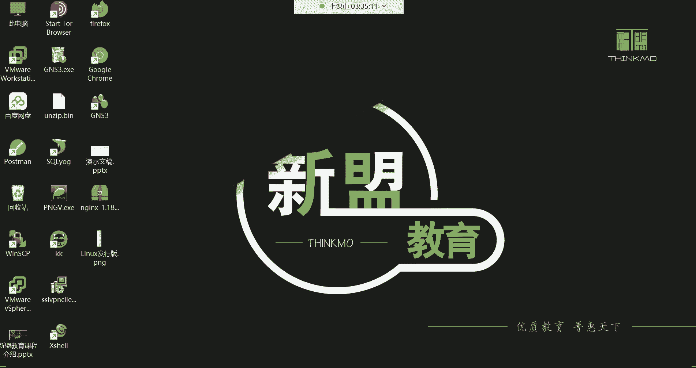

# Linux运维培训教程超全合集，通俗易懂，适合小白，带你从入门到精通1 - P3：红帽RHCSA-3.虚拟机网络配置、远程连接、Linux岗位介绍 - 洋洋得IE - BV1qX4y177j1

喂喂喂，哈喽哈喽，都回来了吗，回来的话我们来看一下哈，我们这个回来先给我刷波，一上来哈，然后都来了是吧好，那我们先来看一下这个系统，现在已经安装好了是吧，那安装好以后呢，这个位置啊我们选择重启。

选择这个重启哈，就重新启动一下啊，让它重启一下，点进去点重启好，啊你们有的系统都已经安装好了是吧，对这个最小安装速度就很快呃，最小安装就是包的话比较少，300多个，如果你要是带图形化界面，你知道吗。

他1300多个包，呵呵如果我们选择带图形化界面的话，就直接多了1000多个包，安装在这个系统里面，如果不选择在图形安装，最小安装就300多个，那所以对于企业来讲，企业一般他为什么不喜欢图形化界面呢。

就是因为他用不到图形化界面，而且呢啊你的就1300多个是吧，对他用不到图形化界面的话，就你看看这个就直接节约资源了呗，是不是啊啊节约了一千一千一千多个软件包，你现在上不了外网是吧，没关系啊，安装好以后。

你看我们现在面对的是这样一个界面，看到没，是在这个界面里面可以干嘛呢，嗯它叫local host login啊，就让我们登录了，那这时候又由于是没有图形的，没有图形啊，未授权咋办。

啊如果你选择在图形化界面安装的话呢，它会确实你看像啊，看一下啊，像他这种，啊点一下哈，你点进去啊，未接受许可是吧，你点进去打个勾就可以了哈，这种东西就是你用人家的东西，你得遵循人家的一个什么呢。

一个个各种各样的一些这个使用规则嗯，点击打个勾就可以了，然后接下来呢你看我们在这登录哈，啊就不用跳过去打个勾哈，你跳过去不行，打个勾在这输入root看了吗，把鼠标点击一下，输入ROT啊。

root就是我们要用root用户登录这个系统，然后回车，那这时候输入root的密码，密码是多少一哎，回车注意我现在密码已经输入了，只不过它不显示啊，他是为了什么呢，就是保护这个密码的安全性啊。

不被别人所看到，所以呢他是不显示这个密码的，但是我已经输入好了，拍回车就行了，回车好，那我现在就已经登录到这个系统上面来了，你们看啊，现在啊我的这个名字变成什么名字，叫这个名字了，是不是啊。

好那连上了以后呢，由于我们这个哎呀，由于我们这个IP地址啊，那个DNS改的不对，这DNS改的不对的话，怎么办呢，你们千万注意啊，你们如果把DNS也改错的话，哎呀一定要像我这样哈，叫vi啊。

然后呢在这里边编辑一个文件，etc cs config network啊，杠script这个路径非常长哈，啊这个路径非常长，哎呀我改一下哈，我我先改一下，因为这个DNS有问题啊，呃114就不用改了哈。

我要把这改一改，但是这这波操作呢对于你们现在呀，你们现在根本不会用这波操作呀是吧，我还得重启一下网络，所以你们在改的时候注意D1定要别改错了，改错的话，你你你们不会用，你们现在这个阶段啊。

没有办法像我一样去改它的配置文件啊，通过配置文件去把这个DNS再给改回来，你们现在还没达到这个水平，所以呢你们今天要去干嘛呢。

去直接一次性配对哈，然后你看我们这个机器啊。

现在是在一个黑压压的界面里面，是不是，但是现在呢这个黑压压的界面你不用管，我们干嘛呢，我们通过一个远程连接工具。

远程连接工具查shell啊，这叉叉cl都在VIP大礼包里边。

然后你们也可以自己去下，你们如果说啊。

你说我想自己去下载，可以吗，可以哈，那腾讯软件中心里面就有，在这个里面直接搜啊，X shell，看到了吗，搜看到了吗，到时候你们点进去，然后直接下载，这个也可以选普通下载哈，选择普通下载就可以了。

然后一步一步给它安装上就可以用了。

接下来呢我们来说一说哈，现在这个插件工具展开啊，打开哈，打开以后呢。

它也是一个黑压压的界面哈，同样哈都是一个黑鸭的界面，但是这个黑鸭界面我们用起来比较舒服一些啊，因为这个在企业里边，你像这个机器有，一般是没有跟我们在同一个位置，因为在企业里面。

这个你比如说现在的云主机啊，如果你们企业里面是租的是别人的云主机，怎么办呢，那这个云主机你想想，你根本是没有办法像我们虚拟机一样啊，通过这个虚拟机直接登录到里面，是不是云主机，你就花钱租了以后。

人家就给你个IP地址，知道吧，至于基于这个云主机放在哪儿，你不知道你只需要干嘛呢啊。

像我们这样啊，通过这个像什么XCEL这一个要远程连接工具，哎你就这样啊。

叫SSH空格，然后呢后面跟上那个IP地址就可以了，192。168。0。90，那我们前面那个虚拟机配的IP是不是九零呢，那这时候推车，注意哈，但正常来讲你们第一次连，你们是不会出现这样的情况的。

你们第一次连哼，你们是连不上去的，你们不可能说出现像我这样的一个提示，我这样是已经能够连上去了，知道吧，那正常来讲你们连的话，你们连之前注意哈，在虚拟机里边左边这有什么呢，叫做网络编辑器。

看虚拟机左边这个叫编辑啊，这里面有叫网络编辑器啊，点这个虚拟网络编辑器要配配什么呢。

配配虚拟机里边的这个一些信息啊，这网络信息这里面我们可以看到有一个什么呢，有敲击模式是吧，有仅主机模式，有NAT模式，那我们用的是不是这个呀，NAT模式啊，没错吧，好那NAT模式，这是怎么回事呢。

在这儿把你的这个选项选到at，它变蓝了以后，下边哈，正常来讲你们是这样子的哈哈，然后你们是这两个选项都是打对勾了，知道吧，打对勾，然后你要把下面这个叫使用本地的DRCP，这个选项给它取消掉，什么意思呢。

如果你勾选这个选项的话，它会给你自动分配IP地址，而且每次给你虚拟机自动分配一个IP，但是IP发生变化了，那你到时候你不知道这个IP是多少，你就没有办法连接，能理解吧，所以把这个取消掉啊。

就是我们一直用我们手动设置的那个IP地址，OK那上面这个呢就不用管了哈，你看将主机将主机虚拟适配器连接到此网络啊，这我们用的就是外面的塔吧哈啊，那这个呢就不用管，然后接下来呢这个子网这个位置注意哈。

子网这个位置我要把这个界面给你们截个图啊，虚拟虚拟网络编辑器，这里边我告诉你这个，这个位置取消嗯，取消勾选，啊这个呢要选择为MNET，选择选择到这个vm net8，然后子网地址我们用这个用这个网段的。

注意这个子网IP就是呃，你选择你的这个虚拟机里的网络，用哪一个网段的地址啊，1920168。0。0，这个网段的OK好好，子网掩码三个2551个零，那这时候啊再标记一下，这是一，然后这是二，嗯别急下哈。

啊选择这个叫取消勾选，嗯取消勾选，在这儿哈二，然后下边这三，三哈呃指定地址段，地址对，然后这个四嗯指定子网掩码，我就直接掩码哈，设定掩码好，然后接下来呢五注意哈，在这儿哈，这是五了，选择啊。

在这主要是什么叫设置网关的，啊设置网关，这好，诶嗯到时候呢先发到群里面哈啊先发到这儿，然后再发到群里面，把这个图保存一下，虚拟网络编辑器啊，怎么配，然后选择NAT设置吧，在这里边看，谁呢，就他，网关嗯。

这个地址一定要设置成跟我那个地址是一样的，地址哈，192。18。0。254哈，然后选择啊确定就可以了，选择，来发过去，这个位置一定要保证跟我配的是一样子哈，你因为你只有这样配完以后。

我们的远程连接工具才能连到虚拟机上边啊，确定，然后呢应用，应用上。

然后再确定，那这一步配好以后呢还不行，注意哈，还要去配VM内TM的网卡。

在这网络编辑器里编，在这里面能找到你的那个VM，那他把那块网卡，当然啊你们那个可能跟我这系统不太一样啊，我这是win11啊，然后你们那个可能是win10是吧，找到你自己的那个VMT8这块网卡。

双击它选择属性，注意哈，然后选择协议版本四，点进去哈，就把这个IP地址呢我们要给他配一配哈，这个地址的话呢给它配成什么呢，首先呢在这个界面啊。

vm net8网卡，写一下，这个是vm net8网卡，配置一个地址，地址哈，然后，第一呢要选择这个哈，叫使用下面的地址，然后这把这个地址配成这个地址，192。168。0。1嗯，然后子网掩码哈哈。

网关配置的跟我的一模一样啊，因为我们的这个虚拟机，跟这个就是我我们的这个网卡，跟虚拟机里的网卡是在同一个地址段的，然后网关指向同一个网关，0。254，这样呢我们的虚拟机啊，通过这块网卡就可以干嘛呢。

跟我们的真机通信能理解吧，所以这个网卡跟虚拟在同一个网段，那我们的真机呢没关系，就通过问问那他八成网卡跟他虚拟机通信了，然后这个网关不能指错，指错也没有办法通信好D啊，223。5。5。5。

然后选择啊，我给你们截图哈，现在是，你网卡没了，啊OK好确定啊确定，唉只有把这个网络编辑器。

还有VMT8网卡都配置完了以后，这个时候呢你再像我这样看哈，就这样哈，就就这样哈，SH连192。168。0。90的时候，你们才是这样才是这个样子，不然你是连不上去的哈，那这时候连接的话呢。

由于是远程登录啊，所以说呢啊他要让我们接受主机密钥嘛，我们选择接受并保存就可以了，OK然后在这个位置输入用户名ROT啊，就是我们这个系统的那个root那个账号，然后回车就能在这的输入密码看到了吗。

密码一确定，我们现在是通过远程连接工具，登录到了我们这台虚拟机里面，知道了吧，唉那以后我对这个机器的所有操作，都在哪操作呀，就在这个界面去操作，然注意啊，这时候就按住CTRL键，再按L叫清平啊。

再重复一遍啊，叫CTRL加L，现在，啊CTRL，然后再加L键，那可以清屏，清屏清屏就让我这个屏幕呢变得更加整洁，看到了吗，是啊就是什么都没有，OK那我们现在看到这个叫什么呢，叫做命令行啊。

今后所有的学习都在这个命令行界面去敲命令，去管理这个系统，那至于命令怎么去敲，怎么学，唉我们明天再说啊，今天不用急，那系统到此为止，安装好了。

网络也配置好了，那接下来我们做什么事呢，啊接下来我要给大家介绍一下嗯。

调一下这个LINUX的应用领域啊，然后还有呢一些相关问题，一个好好的学习方式，我先给大家说说一个好的学习方式好吧，明天几点上课哈啊明天上课还是两点唉，明天明天不上课哈，明天不是礼拜一吗，啊下周哈。

下周6日哈两点对我们说说好的学习方式哈，好的学习方式的话呢，嗯第一呢就是上课呢啊认真听讲就可以了好吧，然后呢不要跟着我做，不要跟着我去做，嗯为什么呢，因为你跟着我做呀，你跟不上。

知道吧啊一呢你跟不上二呢，那老师呢他也不可能等你一个人，是不是啊，所以呢你就上课就先听啊，先以理解为主，嗯听完以后呢，自己啊课后呢去练习，哎你课后练习，咱们这边你想有录屏是吧，有笔记有课件。

你呢去按照这些资料啊去干嘛呢，去慢慢去复习它就可以了，也不用急好，主要是你如果前面啊你跟着我做的话，就会导致什么呢，你跟不上我的节奏，我这边讲了是吧，你没跟上，然后你这边呢就发现你有些这个慌张。

是慌张的话呢，那可能是我再继续讲呢，你就不会再去什么的再去听了啊，你非得把这问题给他搞清楚是吧，这样不行啊，就是会导致你这些课是跟也没跟上，听也没听明白啊，所以这课就白听了，能理解吧，所以上课认真听。

课后认真练习就可以了，OK吧，然后遇到问题嗯，遇到问题呢，一般呢前期吧怎么说呢，嗯也啊不需要大家有那个什么，有这个排错的能力，为什么，因为前期你也没有排错的能力啊，你是不是你对这个系统一无所知。

你也不可能去知道怎么排错是吧，那嗯前期遇到问题呢怎么说呢，遇到问题去问老师哈，嗯问老师啊，咱们群里面都有专门的答疑老师啊，而且我也在群里边，只不过如果我平时上课的话呢，我看不到好吧，有专门的答疑老师。

你艾特打野老师，然后呃后期呢那后期遇到问题呢，哎后期遇到问题啊，去自己先去什么呢，先去思考，别一遇到问题就想着要先问老师啊，一遇到问题就先想着哎呀老师，我这问题出在哪了等等等，自己先思考哈啊思考思考。

那你这个思考无非怎么思考，就是说白了查呗是吧，遇到问题先百度嘛，百度谷歌之类的，多搜一搜，多搜一搜哈，后期遇到问题自己思考去排错行吧，嗯还有呢就是现在呢我们我们大家呀，就是都是这个系统的学习。

嗯都是系统学习的话呢啊怎么说呢，都是一家人了哈，这就不能像以前啊在公开课上边啊，这个想听就听，不想听就拉倒了，毕竟大家也都是花了钱进来的是吧，也都是希望以后呢通过学习，能够找到一份像样的工作。

提升自己的生活水平，所以呢系统学习的话，那就认真对待这件事情啊，毕竟咱们说给谁的钱都不是大风刮来的是吧，嗯所以呢就好好学好吧，然后我也希望你们大家在一起呢，如果大家是遇到了问题都可以什么呢。

就是都可以相互的去帮助一下，这个相互帮助，注意有的时候你不一定是在帮助别人，我们说帮助帮助嘛，就是你在帮助别人的同时，那你也在帮助你自己，为什么呀，你比如说咱们这个班里有个同学遇到一个问题。

然后他把这个问题呢发到群里面了，那这个时候你一看到这个问题，你说哎这问题我会啊，这他不会是吧，哎这这人可真笨，然后你就在背后偷摸的笑是吧，你说哎呀，我不会告诉你是吧，你自己去研究吧。

呵呵有的人可能会有这种心态哈，嗯但是我告诉你哈，可能说有的有的时候你觉得这个问题你会嗯，那如果说你能够清晰明了地把这个问题诶，给别人解决了，你这才叫真的贵，但如果你发现诶这东西你会。

但是呢唉你想清晰明了的告诉别人这个问题，你发现你说不清，说不清道不明的，那这个就证明你还没真的会能理解吧，哎所以说你在帮助别人的时候，你可能也是在间接的帮助你自己啊，你如果说不清楚这问题，你就知道。

哎呀，我对这个东西的理解可能也是唉稀里糊涂的，含糊不清的，是不是啊，所以说啊互帮互助哈，互相帮助啊，毕竟大多数人也都是这个，从这个小白过来的是吧，所以说你们哎呀在这个行业里边呢。

可能说以后就是还有可能是同事的是吧。

就这个好的学习方式哈。

来咱们，把这个呢也给它记录下来哈啊最重要的是什么，最重要的是第一条哈啊最重要的是第一条，这个呢一定要注意啊，一定要注意，OK了行，说清楚这些事情了呢，接下来啊咱们嗯。

下面呢咱们说说这个LINUX的应用领域吧，好吧啊，学到第几阶段可以开始找工作是吧，嗯会有笔记的，看看笔记，嗯嗯我看下啊，学到第几阶段可以开始找工作，当然是学到第四阶段的，那你不第四阶段你不学完。

你怎么去找工作，是不，因为大部分企业都得要求，你会一些像什么监控啊，啊K8S容器啊，那些都在第四阶段的，所以你第四阶段得学好，接下来呢我要给大家说一说哈，就是我们学习这个LINUX，他现在应用的领域啊。

希望能找到工作是吧，呃只要你好好学啊，只要你好好学啊，是没有任何问题的，毕竟我们现在这个行业还是非常的缺人，嗯在我们这个LINUX这个领域哈，你看它已经涉及到我们生活的一个方，方面面了啊。

什么制造交通金融政务医疗通信物流，石油科研军事，农业是工业能源，这些东西，你发现好像跟我们的生活都是息息相关的，是不是啊，你像这个在这个现在比较热门的大数据产业，还有云计算领域啊，人工智能领域。

还有这个开发领域，我跟你讲哈，呃都离不开LINUX，都有这个LINUX的身影，那这些呢大家其实没有什么强烈的感受，是不是啊，你说这些东西我好像也都不知道他是干嘛的，没错吧，但是我告诉你哈，这个在啊。

可能这个你们看起来也是有一脸懵逼哈，啊也一脸懵逼，你看什么这个世界超算500强，这个就是在这个世界上有那个500来啊，运行最快的计算机叫超级计算机，然后这个超级计算机呢你们可以看一下啊。

在16年的一组数据里边，那LINUX就已经排到了400，在这500台那边就占了498台，然后UNIX呢是占了两台，嗯两台哈，别的没有了，所以你看对于LINUX这个系统，它的应用领域啊，在超算领域啊。

都可以说是这个遥遥领先的啊，啊还有那在这个超算领域呢，这个你像我们中国也是非常不错的哈，我们中国是有这个呃两台比较啊，不错的超算啊，超级计算机啊，一个叫什么叫神威太湖之光，一个叫天河2号啊。

这里面用的系统叫麒麟LINUX，叫麒麟LINUX，但也是基于LINUX2次开发的，那这两个系统它在16年的时候，神威太湖之光排在第一，是天河2号呢是排在第二啊，这是我们中国的哈。

啊也也算是在这个计计算领域吧，哈我们中国也算是非常不错的哈，非常牛逼的哈，行了就是那你说这些好像跟我们也没什么关系，你说这超算领域是吧，我们都不知道他干嘛了是吧啊，一般做科研用的，做科研哈科学研发。

但这些你都不知道的话，那咱说点跟我们生活息息相关的，是不是啊，你说我们生活当中，比如说啊点个外卖是吧，出门打个车啊，订个飞机票，旅个游啥的，是不是还没事聊天啊，什么微信啊，QQ啊，陌陌之类的。

是不是啊啊这些还有那个平时的充值缴费，你想充个话费，充个水费，充个电费啊，现在几乎都可以是从网上去实现这些功能了，是不是啊，我告诉你啊，哎呀这些功能在以前你想都不要想，在以前你们知道你想充个话费。

你知道去哪儿通吗，叫营业厅，你得去营业厅去冲，为什么去营业厅呢，因为他的那套系统，是他妈一个专线啊，是营业厅的专线，你只有在专项上面，人家才能帮你把这话费给你充上好吧，而现在呢它不是专线。

是把这东西移动到哪儿呢，移动到云平台上面了，那移动到云平台就大家都可以自己去干嘛呢，哎通过app按，然后连接到它的那个云服务器，然后我们自己去充值，知道吧，对，所以呢，你看现在你比如说你现在。

你这个就包括我们充个水费吧，比如你在家里面洗洗澡呢啊，你这洗着澡突然间发现停水了，这以前你知道你冲水费去哪儿听啊，自来水公司啊，你得跑到他那个自来水公司，那个那个是那块儿去冲这个水费哈。

但是现在你需要去跑到资料室公司吗，是不是啊，你打开app小程序直接上水费不就冲了吗，对啊，那是因为以前那自来水公司的那套系统，就在他自己的那个站点儿啊，外界的用户根本是连不到他的那个什么呢。

它的内部系统的，而现在呢啊都迁移到云平台了，切到云平台，现在呢我们想自己充水费，哎，你通过app就直接能够连到云平台的，他的那个他的那个什么呢，他的那个小程序了啊，直接就自己去冲了，咋办唉。

现在方不方便啊，包括网上购物是吧，你像你比如说买个衣服，买个化妆品，是买个鞋子啊等等等等，买什么东西，你发现你都可以从这个什么淘宝，京东之类的去买，是不是啊，多方便呢，哎还有什么呀，现在娱听歌的。

看电影的娱乐软件，打游戏的王者荣耀，英雄联盟，你知道这些东西，我们生活中就是每天都在用的东西，它们的背后这些软件在背后，这软件不是天上掉下来，让我们用的这软件，它背后的运行在什么呢。

哎一个操作系统上边啊，这个软件只有运行起来我们才能用，是不是啊，那它的背后就是什么一台一台的LINUX的服务器啊，这些软件就运行在这个LINUX服务器上边，哎就是长年累月的不关机不重启。

让我们一直可以使用这些软件，你看你在这个去这个，比如说使用一些软件的时候啊，你看这些软，你看这些软件，它有这个，能够让你这个使用不了的时候吗，没有吧，你包括微信，你发现微信这东西。

它你几乎常年累月你都可以用，它，是不是他没有，他没有停下来的时候，什么时候打开，后半夜打开，跟你跟你跟你女朋友聊聊天是吧，嗯没有啥问题是吧，长年累月的都是一台一台的LINUX服务器，在后面默默的运行啊。

然后让给我们提供这些服务，手机系统也是这个开发的吧，当然了，手机系统安卓，安卓系统，苹果系统啊，苹果系统的底层是LINUX，苹果系统的底层是LINUX，安卓系统的底层是LINUX，哈哈能理解了吧。

他你看我们生活息息相关的手机啊，每每个人都在用吧，甭管是安卓还是苹果，是不是他都得基于这个东西在运行的，是不是，那这些东西，你看它应用的领域数就非常的广泛了啊，非常的广泛哈啊那你们学完这个系统以后。

那你们就去找工作，运维工程师，容器K8S运维工程师，云平台运维工程师，DBA数据库管理员啊，存储运维自动化，运维架构师等等等等，但是刚开始先找这个运维工程师这个岗位哈，这岗位一个月挣多少钱呢。

一个月8000起步吧，8000起步，然后平均也要在1万左右块钱，现在游戏还需要停服维护吗，这一般得看情况，那有的时候他做，有的时候他在做一些，比如说啊，更新的内容非常多的话，一般他就得需要停服务器哈。

他不是停服务器，是把这服务停下来，好小更新不需要啊，小更新就直接叫热更新，热更新，什么叫热更新呢，就是这个游戏啊，用户呢边玩我可以对它进行一个更新就可以了，没有叫热更新啊，冷更新啊。

就把这个呃这个什么呢，把这个游戏啊给他停停下来，大家都不能使用了啊，然后呢我再对它进行一个更新啊，只有管理员才能进得去啊，对它进行一个维护好啊，这是你们以后可以从事的岗位啊，先从这个岗位入门啊。

系统运维工程师入门，后期呢呃像容器运维啊，数据库管理员啊，后期你们到公司里边，比如说你到公司以后，你发现这公司啊数据库用的特别多，哎然后你平时接触数据库呢，你比较熟练了，等以后再往这个数据库方向发展。

如果到公司以后，你发现这个公司的容器用的比较比较多啊，你每天都接触容器啊，容器的这个业务非常熟练，那以后就往容器方向发展啊，如果你发现你们公司是搞什么呢，搞私有云的，那以后就往云平台方向发展。

比如你们公司搞存储的，你往存储方向发展，是不是搞自动化，就往自动化方向发展，这架构师呢一般得需要懂开发了哈，懂开发才行啊，以上这都是你们可以去找的工作啊，然后去哪儿找呢，去boss直聘啊。

智联拉钩都可以啊，去直接就搜这个岗位就行，OK这是你们可以从事的岗位，然后还有一些没有技术含量的岗位，这个我还要给大家说一说，毕竟你们如果刚开始接触这个行业的话，其实呃在找工作的时候啊。

你们要知道哪些岗位啊，尽量不要去做。

卡卡顿了一下是吧，哪些岗位尽量不要去做呢，嗯你就比如说像什么IDC运维呀，监控运维啊，技术支持这些岗位尽量不要去做，为什么呢，你看比如说IDC运维，它是一个没有技术含量的岗位，干什么工作呢。

叫机房巡检嗯，机房巡检的话主要就是嗯，像咱们说不是有一个数据中心嘛是吧，数据中心里面放的不都是服务器吗，这服务器呢得需要人，每天比如说去干嘛，去这个对机房里的什么温度啊，湿度啊，网络啊，电力啊。

通风度啊等等等等做一系列的巡检呃，然后发送这个巡检报告啊，这就是他一天的工作，那工作非常轻松哈，嗯但是呢嗯白班夜班两班倒这种活，就是因为机房嘛，那这种东西都是常年都不能离开人的哈，机房里边都是必须。

那什么时间都要有人，逢年过节都得有人在那看着，知道吧，对那跟零四没啥关系，确实没啥关系哈，呃但是这种岗位呢一般的第三方外包，注意哈，这种岗位就是第三方外包外包的话呢，就是你比如说如果说阿里阿里阿里云。

阿里的数据中心，他需要这种这个IDC运维去给他做做巡检，那阿里不直招阿里干嘛呢，阿里把这个活儿哎，再转给一个第三方的外包公司，然后这个外包公司呢帮阿里去招这个人，那这个人属于谁的呢。

这个人不是属于阿里的，那阿里的所有的福利待遇跟这个人没关系，能理解吧，那这个人就属于第三方公司的，所以说这这第三方公司叫什么呀，叫中间商，中间商干什么呀，中间商就赚差价，是不是啊。

就是这个中间商他主要干的活，就是他把阿里啊给你发的工资，中间再给你扒一层啊，就是他干的活能力了吧啊，所以这种活呢嗯挣不了多少钱啊，主要也得不到任何的提升，知道吧，所以这种IDC能不干就尽量不要干哈。

得不到任何的提升啊，没什么意思哈，然后第二个叫监控运维，没什么技术含量，干嘛呀，看守监控系统的，在企业里边的，有那种专门的监控服务器，就监控你企业里的监控，企业里的其他的服务器的啊。

然后呢呃那对着这种岗位呢，你主要干的活就是发送告警消息，就比如说啊这个监控服务器，监控到我们企业的这个哪个机器啊，就是比如说关机了，那这时候你就得把这个消息干嘛呀，唉发送给企业的技术人员。

让技术人员去解决这个问题，而你是干嘛用的呢，你就是发送告警报告的啊，给人家发邮件或者发短信或者打电话都行，那这种岗位白班夜班两班倒，因为也是都是不能离开人的，能理解吧，那没什么技术含量就不用说了吧。

也是第三方外包啊，人家公司都不会执着哈，好然后接下来呢就是技术支持，基础知识也没什么技术含量，一般像哪些地方会招这种基础知识呢，像云厂商啊，云厂商，你比如像什么阿里云，阿里云的话。

就有那种技术支持的岗位，然后这种岗位的话呢就是类似于一个客服啊，类似于客服叫处理客户工单的什么意思呢，比如你从阿里云租了一台云服务器哈，但是这云服务器呢你就可能说啊，遇在使用的时候遇到一些问题。

你自己也处理不了啊，或者这个云服务器出现一些扣费啊，你不是很清楚啊，这个费怎么扣的是吧，哎那时候你怎么办呢，你就得去找这个阿里云去理论，是不是嗯，那这时候你找谁呀，啊你就得找这个叫做技术支持。

他就接你的电话啊，问你先生是吧，有有什么问题吗，嗯然后呢有什么需要帮助的吗，那你这时候你就要把你的问题告诉他，然后如果一旦涉及到一些技术方面的问题，他们就解决不了了啊，他们干嘛呢，啊他们让你说啊。

那你把你的问题写到一个工单里边吧，啊我呢把这个工单啊转给谁呢，转给我们的专业的技术人员，然后呢让他们帮您去处理，然后到时候呢我再把这个工单啊再返回给您，这就是所谓的技术支持岗位对吧。

嗯没什么技术含量哈啊这种也是白眼两边老哈，然后也是第三方外包，所以这些呢就没太多，没有什么太多可说的了哈，没有太多可说的了哈，这个唉唉跑哪儿去了，啊这哈OK都说了，是不是啊，嗯嗯这些。

然后接下来呢咱们就说一说，这个我们在这个行业里边哈，你比如说前面我跟你们讲了，那些是没有技术含量的岗位吧，那接下来呢咱们再说一说啊，我们这个运维岗位怎么样是吧，还有这个开发岗位，测试岗位。

他们呢都分别怎么样，那这个呢也给你们介绍介绍，毕竟有的人呢他不是很了解这个行业，是不是因为大多都是转行过来的嘛，所以咱们就先把这个行业呢给大家说清楚啊，以后最起码你们在这个行业里面最起码知道啊。

你们应该往哪个方向发展啊，嗯好了，那接下来呢咱们先说开发岗位，开发岗位呢，那毋庸置疑哈，我说叫挣钱啊，一说到开发开发挣钱呢，没错吧，一个月好几万块钱啊，事儿是这么回事哈，呃但是呢我给大家说说啊。

它门槛高啊，搞开发的，搞开发一般对于你的学历来讲啊，都是要求比较高的，还有什么呢，还有你的专业呢，呃也必须得对口，就是你的学历至少得是个本科，你的专业呢啊，你得是计算机专业的。

你才能往这个开发方向去发展，知道吧，那图呃呃如果这些你都能满足的话，对于开发来讲，你还有一个叫技术的天赋，知道吧，这技术天赋是什么意思呢，因为搞开发要看你这个人的思维逻辑唉，所以说你的思维逻辑强。

你才能去搞开发，你思维逻辑如果不强的话，你也干不了这开发，而且搞开发的人一般得能耐得住寂寞啊，我们说忍受得住孤独，耐得住寂寞是吧，为什么呀，因为开发这活儿他妈的这就跟跟计算机交流啊，时间长。

你发现你不爱跟人交流了，是不是啊，在这敲着键盘，呵呵笑乐起来了啊，敲键盘自己敲乐了，这别人一看他们这人傻了，是不是哈哈，但其实不是是吧，哈哈哈哈啊，这这是啥呢，就是呃就是呃叫程序员的快乐是吧。

程序员的快乐就是别人理解不了的，是不是你要是敲定命运啊，特别开心，哈哈哈哈啊，但是呢那个苦恼的时候呢，就没事薅薅头发，为啥呢，要搞开发嘛，是这个功能开发不出来啊，可能说你卡在这卡一个礼拜了。

这功能我都实现不了，怎么办呢，哎呀那你没事就薅头发，没事就薅头发，是不是啊，那这头发薅着薅着，你发现不知不觉诶变少了，不知不觉诶啊变成地中海发型了，这就是我们说这个开发的特点嘛，是不是啊。

桌面因为小白可以干嘛，可以干啊，桌面认为小白当然可以干了，所以说对于开发这些呃，它主要是压力大哈，压力大，而且这个节奏也快嘛，啊，咱们说毕竟嗯开发嘛是需要你不断的去创新啊，不断去开发新的功能嗯。

而且还要随着现在这个社会的需求啊，这个所以节奏就比较快，嗯然后但是呢有个致命的缺点，就是职业寿命比较短啊，这是他的致命缺点哈，一般搞开发搞到35岁啊，基本上就差不多了，为什么呢，就是因为节奏快，压力大。

年纪大了根本就不适合去干开发了，嗯所以说我们说就是至于这种嗯，搞开发呢你得考虑35岁转行，你不转行的，一般你企业你比如你三十五六岁，你去找去找一个开发岗位，你发现一般人不爱用你嗯，不用你哈。

所以一般搞开发职业寿命比较短，那测试岗位怎么样呢，那对测试来讲呢，咱们所以说呃需要有一些编程的基础啊，你们千万不要觉得测试这个岗位，他没什么技术含量，我问你这个岗位，恰巧呢它确实有技术含量。

而且对你的技术含量要求还不低呢，你们知道吗，这一个测试啊，它是等于半个开发了嗯，一个测试等于范围开发，为什么呀，因为它的测试工具得需要自己去开发，你比如说人家开发人员啊，开发人员写好了一个程序。

那这时候呢你让你对这个程序进行测试的时候，人家说你给我测试一下，我这个程序跟数据库这个的链接啊，那这时候你怎么办，你就得去测试吧，好那你怎么测试啊，你自己去写，自己去写哈，自己去写这个测试工具。

所以对这种东西呢，我还是那句话，嗯测试呢如果你没有编程基础的话，那我就也不建议你，直接去往这个测试方向去发展，因为这活你也干不了，而且这都不是最重要的哈，嗯嗯懂数据库，这都不是最重要的。

熬夜加班也不是最重要的，最重要是小公司没有这个岗位，知道吧，小公司不需要测试，为什么呀，小公司谁去测试呢，小公司开发自己测试，那小公司一个人顶号，一个人干，是不是啊，哎所以说这种东西呢不像大公司。

大公司呢会招这种专门的测试人员啊，大公司有哈，但像大公司他招这测人员，大公司门槛高啊，没错吧，大公司对你的要求，那你说你学历得达标，二他专业得对口吧，如果你说你学历也不够，专业也专，专业也也不对。

你说我你说你的专业是研究这个什么呢啊，研究养殖的啊，研究养研究养猪鸡，猪猪鸡鸭狗的，那人家发现你这根本就不是计算机专业是吧，你搞什么开发呀，唉专业不对口，所以这是测试岗位，哎呀这就发现挺难的，是不是。

那接下来运维呢，哎运维的话呢它不需要你有编程基础了，所以呢你们选的这个运维行业呢还是蛮轻松的，可以这么说吧哈一般都是零基础就能够入门，一般哈零基础入门几乎都是零基础入门了，可以这么说吧。

所以说这个基本上刚开始入门的时候呢，咱们就学一些系统里的常用的命令啊，只要你肯吃苦，你只要是能够什么呢，唉能够坚持下去，唉把这个把这个几个月给他熬过去就可以了，好吧，所以可以零基础入门哈。

而且对于我们这个学历要求呢还不是很高，你比如说你这个大专啊，大专轻轻松松知道吧，大专大专在这个行业轻轻松松哈，还有这个最主要是职业寿命也蛮长的嘛，嗯像我们这个行业，哎呀你干个几十年没啥问题。

因为这个只要是公司，他就需要这种维护人员，所以这个行业呢职业寿命也蛮长啊，还有一个岗位需求量大，需求量大，就是你找工作就比较容易呗，好那以上就是我们所说的这个运维这个行业啊，但是呢前提是什么呀。

前提是这得坚持住啊，得坚持下去哈，嗯坚持不下去，说啥都白扯啊，干什么行业呢，如果说三天打鱼两天晒网的，那刚开始呢很多人都是哎呀这个行业真不错呀，挣钱呢啊我一定要挣钱是吧，兴致勃勃的融入到这个行业了。

但是呢发现啊刚这个刚开始进来的时候呢，唉可能说还有一些这个什么呢新鲜感啊，去这个去学习啊，啊去这个去研究一些东西啊，坚能坚持得住，但是呢随着时间一长，可能说哎呀这个耐心被磨没了啊，就开始什么呢啊。

就开始那个就是属于嗯哎呀，就是可学可不学了啊，就把自己的耐心磨没了，我说人嘛是吧，人就是有惰性，有疲劳期是吧，学着学着呢就学不下去了，坚持不住了，所以对于这种情况的话呢，就不能有。

就不可能有一个好的结果，所以你们现在在这个行业呢干什么事儿啊，年轻人要有一个好的结果，就得啥呀，就得坚持住，就得坚持住哈行了，那我们今天呢该讲的也都讲的差不多了，是吧嗯，挺不错的哈，然后。

接下来呢我们就今天就讲到这儿吧，OK吧，然后讲到这儿的话再讲再讲，就是下周的事了哈，下周6日啊，我们还是那个什么呢，还是在这个腾讯课堂哈，然后上课时间嗯也都是两点哈，也都是两点，好OK，行了。

你们看看有没有什么问题，是吧，哈你五点下班啊，没关系啊，咱有录屏哈，咱有录屏，中间对，中间这几天晚上没课哈，呃这两天晚上没课怎么办呢，呃没课的话，这样吧，你们如果说哎没什么事干，我给你发几节啊。

我给你发几什么呢，发几节以前讲过的那个录屏行吧，先复习着啊，可以先预习预习吗，没没什么事，干一周时间，毕竟我们这这周呢就安装个系统，是不是啊，没什么事干，所以呢有精力的啊，可以先预习预习，OK好嗯。

剩下没有什么问题了吧，啊这个指周6日上课的话上多久啊，就前两个阶段周6日上课，后边不是周6日了哈，因为前两个阶段哎主要是考虑到你们基础弱，给你们留了一周时间复习，李元芳行了。

那接下来要是没什么事情的话呢，没关系啊，你们这个啊课程表在哪儿是吧，呃课程表的话，课程表，课程表就是我们会学到哪些技术吗。

你说这个吗，还是说我们这个上课的时间表啊，具体上课时间呢。

啊退伍啊。

啊课程大纲是吧啊，课程大纲啊，就是讲哪些东西是吧啊。

课程蛋糕，我一会给你们发群里面哈，我一会儿发到群里面。

好来看看，看到吗，这儿呢大纲诶在这哈，啊我也上传到哪呢，上传到这个群文件好吧，上传到群文件，到时候你们也可以从啊，后期记不住，也可以从群文件里面去看一看，啊这有哈看了吗有哈，这有嗯有。

然后一会儿呢给你们发几下前面讲过的录屏，你们看一看啊，可以预习预习前面的命令，OK吧。

行了，没有什么问题的话，来给我刷波六是吧，我们就下课好吧，然后在上课呢我会提前给大家发上课链接啊，会提前在群里面通知大家好。

