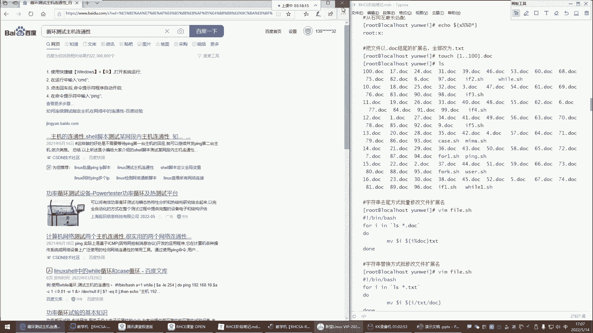
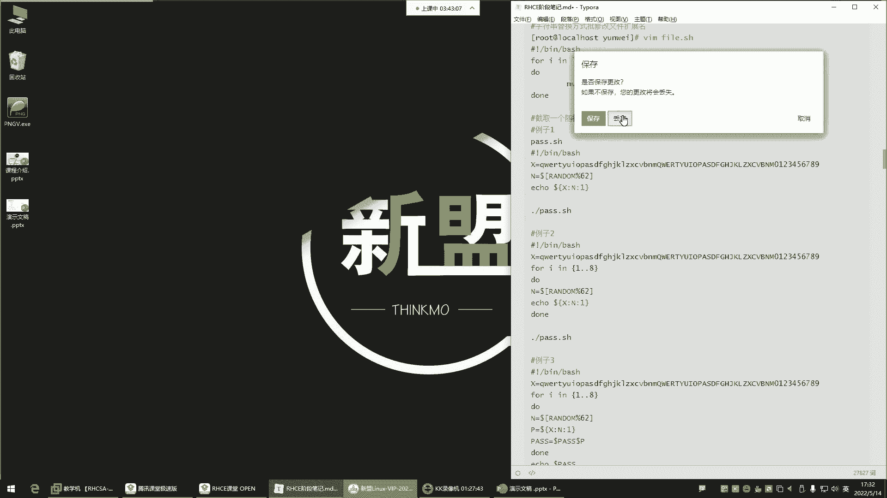

# Linux运维培训教程超全合集，通俗易懂，适合小白，带你从入门到精通1 - P46：红帽RHCE-11.shell函数、脚本中断及退出、字符串处理 - 洋洋得IE - BV1qX4y177j1

是谁会用呢，搞数据分析的，他们会用这玩意儿啊，截取过滤，截取过滤啊，他们会搞这些东西哈，所以你知道一下啊，我想截后四位，起始位从哪开始起呢，后四位我想吉，我想吉5678，那你得数数啊啊从零开始。

那01234567，起始位置是从七开始接四位，从七开始接四位，三四回车，5678，看到了吗，这就截取，那这玩意你想咋结，你想怎么接就怎么接，也不一定非得是截这种数字，截一些这个什么。

就是截取一些这个文件的内容，也都可以解文件的内容哈，嗯这不太好记，这玩意不用记，你了解一下就行，你知道shell里面有这个功能，你想想shell是一门脚本语言，一它是一门计算机里的编程语言。

它是支持所有的编程语言里的功能的，就像什么for循环，if判断case语句，while循环数组函数变量都支持，所以这些大家用不到，你简单知道知道一下就行，能理解吧，知道就行。

你知道怎么知道有这个功能就行哈，但是这里边唉，有的时候比如说需要你截取一个随机的八密码，饿了是吧啊，那我们来演示一下，这玩意儿可以可以这样帮你截取个密码，我们来说一说这玩意儿演示的时候怎么玩啊，有密码。

密码点SH井号叹号杠变向的外甥，其实这个东西我跟你讲，如果你们工作中有这种需求，哎呀就这玩意儿都不需要去自己写，比如说你们工作中需要你啊，我们每我们这个什么呢啊，需要去随机分配一些密码的话。

这个可以实现，我们先执行一下，看效果就行了啊，batch脚本名回车几位，12345678回车，随机八位，每次都是随机八位是吧，没有任何的没有任何的规律所言吧是吧，你看每次都没有任何规律是吧。

那这种东西百度一搜一大堆，嗯就是，脚本生成随机八位密码，有需求的时候看一下，搜一搜，这里面不需要自己写，你很多东西哎呀。

有的时候啊很多东西他不是说靠你一个人，你这个也得会，那个也得会的，能理解吧，看一看哈，他这玩意儿诶发现跟我那个套路是一样的呢，这人是不是抄袭我的呀，啊你看一样的哈，随机八密码怎么玩呢。

这里边首先我想截取随机的八密码，那这里边首先随机就不能有规律，所以说那随机里面肯定是有ABCD，是不是那些英文字母，还有数字，所以这里边把这个你键盘的62位，不是啊，是你的这个26个英文字母。

26个英文字母，前面是小写，前面是小写哈，后边呢是大写，都给他定到这个变量里面，然后后面还有0~9的阿拉伯数字，这总共是62位，62位哈，那没有任何规律写，写进以后存到这个里边。

接下来的for循环循环几次，循环八次，循环八次的时候，那是不是每次循环执行都跟当地的语句啊，好那接下来你这里的语句就是第一我要干嘛呢，从这62位随机数里边，我要去干嘛呢，却对它趋于为什么取，你不取的话。

random里面每次的数太大了，所以要对60取余好，那我对这62取以后，我这个数存到这个变量里面，存到这个里边以后，那这个变量里边每次取的值都是小于62的，知道吧好，那我为什么每次都要取小于62的值呢。

因为我要把这个值给他，看下面这个变量哈，下面这个变量这里边有一个number啊，这number里边还有一个变量XX是它，也就是说每次我要把这个number里面取出来，那个随机的值它肯定是小于62位的啊。

然后干嘛呢，截取这不是截取的语法吗，X变量名是吧，截取从哪截呀，哎从这62位里边的那个随机数去决去去解，能理解了吧，因为你看这个里面是不是总共是六，是62位啊，62倍的话，你每次产生随机数。

我对62取于它的数肯定是小于62的，所以就是说把这个数控制到了62以内，那这个62就是给我的这个一堆的什么呢，一堆的这个密码去准备等，然后接下来对我这62取X是我的变量。

你看那这个语法里面就是是不是它的语法，就是取截取的时候变量名，然后呢起始为止，起始位置我也不知道，因为它是随机的嘛，所以就是从这里面取出来多少随机，就是多少接几位接一位，每次截一位，截完一位以后干嘛呢。

哎我再搞一个变量，那这个变量里边是什么呢，就是每次它截取出来的密码是存到这个里面了，是不是啊，那接下来每到pass跟每到top，就是我每次截取出来的数，他这里面不是只能存一个吗，那不行干嘛呢。

哎我给他拼一下，每次截取出来的数，我再去存到这个pass变量里面，然后最后呢每次再用pass变量，再结合这个tap里的那个最后组成八位，把总共八页面给我挨个处理，这我也饿了，我也有点饿了哈。

但这个思路可能就不太好理解了，但是你也不需要理解，你不需要理解哈，你如果没有那个能力，你就去网上找，有这种需求，我们说就现在这个运维的行业里边，哎呦哪有虚，其实很少会有一些需要你自己能够什么呢。

能够写的脚本了，因为大多数别人已经用过了，别人已经已经写过了，所以你用的时候你去网上搜一搜就行了，就这玩意拿过来可以直接用哈哈。

那比如说我把我的那个给你们删掉哈，把里面那种删掉一样的，其实滴滴滴滴滴滴滴滴dd站进去啊，什么这玩意删掉还原文，估计是抄袭我的保存退出，然后执行回车，那是不是不一样的，是不是就这玩意儿就这玩意儿啊。

所以说哎呀，有的时候用到的时候就去网上找一找，网上找一找，比你自己在那扣着半天还憋不出来个屁，要强多了是吧，你自己写写不出来，你还总跟自己较劲，你这就没有必要是吧，而且也没有那个必要，说白了多麻烦呢。

你一个人能你一个人的能力终究是有限的啊，你不可能说哎我这个领域也擅长，那个领域我也擅长，是不是，所以有的时候你在你不擅长的领域，你去用用别人的东西，他也不丢人，对你不用为难自己。

因为你想想有的人人家天生思维逻辑就清晰，人家就这个底子也好，所以说人家擅长的东西，人家拿到网上让你用，你就用现成的不就行了吗，是不是你非得说不行，我就要自己写，写不出来，我这就不行，没有必要。

都啥年代了，是不是，那阿里巴巴的那阿里巴巴的CTO啊，那叫首席技术专家，人家的很多的东西也都是用别人现成的是吧，那包括阿里巴巴的淘宝网站平台，不也是基于别人的去什么呢，去改吧，改吧吗。

他也不是自己开发的，是不是啊，你去看阿里巴巴，阿里巴巴那个叫tan天真天真是什么呢，来看一下天真是嗯对。

忘了自己以前抄作业的时候了是吧。

你看天然是阿里基于大名鼎鼎的NGINX，修改的HTTP服务器，这句话就是说他也是在人家的基础上改不改吧，他也不是自己开发的能力吧，人家为什么呢，因为你想这种东西有能力的人，人家写出来了，你改吧。

改吧不就行了吗，非得不行，我就要自己开发一个比他牛逼的软件，你这不较劲吗，是不是，你那跟自己过不去啊，你这是没有那必要吗，你是被抄那个是吧，没关系啊，我们说我们这个生活在这个社会当中是吧。

我们本来就是一个团体，是不是啊，哎每个人的能力都有限，是你在你的领域，你有你擅长的这个你你有你擅长的本事，别人在别人的领域，他有他擅长的本事，你们之间相互借鉴，咱又不是说一个自己狗屁不是一事无成是吧。

那如果真是这样，你说那我还会抄呢，是不是我也会抄啊，是不是啊，这不也挺，这也是这也是一种本事啊，你抄出来它能够实现功能了。

这也是不是什么丢人的事。

所以说没有必要，很多东西要纠结，哎呀不行，我必须自己写，没有必要哈，嗯对呀，所以你像什么字符串替换字符串，掐头去尾啊，其实我觉得这些东西最终都是为了什么呢，啊想让大家了解一下，就是啊。

这东西可以实现帮你截取一个随机密码啊，字符串替换可以帮你后期使用一个什么功能，可以帮你实现，就是这种比如说这个把这个批量替换，替换一些文件的扩展名，啊其实这种唉很多东西呢就是你可以感兴趣。

你可以自己去了解了解，可以自己了解，自己了解了解哈，但是其实我觉得大多数啊是很多东西，你们是这个不需要去什么呢，去自己我必须得给他记住啊，必须要熟悉它的语法，这个那个的哈，没有那个必要了，现在没有必要。

都饿了是吧，嗯啊关键是得知道抄是吧，对你得知道抄这个很重要哈，就是咱们说这个你不会写行，你不会写，你得会抄，嘿嘿嘿，这个是一种本事哈，抄这个东西的话呢，你得去搜。

一般你需要什么功能，一般你去网上搜就行了，是不是你想你比如说啊我要这个什么呢啊，你比如说你如果说你不会写一个，测试主机连通性的脚本啊，你自己搜测试主机连通性能，唉反正我也不知道怎么写是吧。

看看别人有没有写好的，哎告诉你拼命令测试主机之间的网络连通性，点进去啊，看看别人怎么写的啊，那他在里边看一眼哈不行，这不是脚本哈，他是不是脚本，还是里边是贫域名的是吧，唉叫，循环测试主机联动性。

看秀脚本测试某个网站看一眼哈，这里边哎你看他怎么写的，我们甭管怎么样，拿过来先跑一遍。

看行不行，是不是管他372 11呢，先跑它一遍，把我的那个will点SH删掉，粘上去是吧，管他行不行呢，保存退出，有点错是吧，有点挫哈，那还得杀杀进程，看看哪里不行哪里不行，你再改诶，嘿就上来先跑一遍。

不行好不行，再改，那大体先简单看一眼，别上去，就确实确实是像我这样直接就直接就执行哈，先看一看，你得跟你的环境符合才行，我们刚刚有点这个什么呢啊，有点草率了哈，刚刚确实有点草率了哈哈。

先把进程杀掉哈啊PPT，然后呃管道给杠AP杠AP管道A个人过滤谁呢，过滤拼啊，这个进程先给他干掉，Q杠九结束掉啊，没有那个进程，撇子脆看一眼啊，这不还执行着呢吗，是不是啊，脚本PSTAPGRAP，诶。

怎么没有，怎么没有过滤出那个脚本的那个命令呢，那这样吧哈Q2杠9P看一眼还没杀死，那脚本命令没没有过滤出来，你们看到了吗，那个脚本叫will啊，是过滤BTCH，看一眼哈，哎这呢看到了吗，你过滤不出来。

你直行的时候执行的BH命令啊，在这呢BH杀他上大号砂糖，你别杀上面那个掰扯啊，你这一刹你退出终端了，知道吧，你别杀错了，我们是这也是我们的什么呢，这个登录系统的BT环境，我们在这个登录系统的环境里面。

又通过BH运行了这个什么呢，运行的是这个脚本，你把那一刹你退出去了，直接，Q杠九哎你得有方法看了吧，你看我和很多东西，你看我记不住是吧，我记不住，但是我可以有方法杀掉它，这边杀死了，是不是。

杀死之后我们再看看哪里有问题，哪里的问题呢啊他是只拼这一个IP了，IQ这一个IP地址啊，192。168。4点啊，网段不对啊，有点草率了，是不是啊，你看咱们是零网段，它是四网段，这不搞笑呢吗。

哎零点美到I，然后这这确实应该看一看哈，我们有点鲁莽了哈，有点鲁莽，哎，0。5的I，然后接下来这时候就没有问题了啊，这杠1Q这个杠有问题，是这个杠看了吧，对这我觉得你看他这杠什么情况啊。

故意的，这是故意的看了吧，这人挺坏呀，那前面的杠跟那个杠是完全不一样的，所以你看有的时候还得懂点，你还不懂，你还不知道呢，看不出来，他故意的看到了吧。

所以哈哈哈哈对他就是故意的哈，他这杠他怎么打出来的呢，哎这样看了吗，哎嘿嘿，就是这样哈，就是这样的，你看了吗，一个中文的，然后你再这样，他给你删了一个，你看这是真狗是吧，嘿嘿嘿，你要看不出来。

不仔细看还不行呢，呵呵呵呵对，这时候再执行回车，哎可以了，你看1234，这样可以是吧，呵呵你说这人是有点意思啊，再给他杀掉哈，杀掉是不可以啊，你这拿过来不就用了吗，你这还需要你自己写吗。

很多时候你自己写，你发现哎呀一堆报错，我们说就是很多时候呢我们都是相互借鉴啊，我们不能说抄袭我就借鉴杀掉哈，Q杠九把这个杀掉，因为你想你的能力终究是摆在那儿呢，是不是啊，哎所以说有的时候这个行业里面。

抄袭是一种什么呢，唉能够提升你最快的一个捷径，不需要你，但是你说那我难道我自己啥都不需要掌握，就需要抄吗，不是你得抄，你得能抄明白，就像我们刚刚一样，刚刚咱们自己是不是能看出来哪里是问题啊。

是不是啊，你像你就像它一样是吧，他里面给你动点小手脚，是不是啊，哎你能看得出来就行，所以我们学的那些基本的东西，就是为了让大家能够什么呢，以后在抄的时候，哎你你能抄明白喽。

嘿嘿你别到时候你说你抄都抄不明白，这有点过分了，哈哈哈哈哈对呀哈哈哈哈哈，这就可以了对啊，就是学完脚本。

不是说让你直接噼里啪啦，自己就能够自己写一个啊，相应的脚本出来了，不现实不现实啊，哎呀有点饿了是吧，我也有点饿了啊，这些的话呢简单演示演示行吧，我们不行，我们还得演示演示，因为这个东西的话呢。

你看我们前面讲的字符串的截取是吧，格式就是每刀大括号，然后呢变量名起始为止加长度，然后这个东西呢我们在结的时候啊，就是你截什么都行，结主要还是以变量里的值为主去截取的，嗯对抄得抄好人的哈。

然后下边字符串替换也演示一下字符串替换，这里边啊它的语法格式是这样子的，美的也是美到大括号，但里面是用这个斜线来表示的，哎这贴换我们在VM里面也有替换，我不知道大家还记不记得哈，比如我现在写个文件啊。

不用写文件，哪个文件呢，啊就是拿这个这个will点SH来给大家说说，我们VM里面是不是有替换呢，比如我现在想把这个文件里的，所有的192。168。0给他替换一下，怎么替换呢，好英文的冒号下边是百分号。

S代表替换是吧，然后替换符你用什么都行，井号也行，斜线也行，无所谓，这时候我们用斜线，我要替换什么呢，先写旧内容，192。168。0放到这啊，这是分隔符，替换分隔符，再写新内容，我给192。168。

0替换成点四啊，然后这时候替换符结束了哈，那我想全文替换就小写的G回车，直接是不是所有的192。168。0，就变成点四了，没错吧啊这种是VM里的替换好，那我们再来说说这个变量。

我想对变量里的值做替换也可以啊，我们就拿了一个什么呢，刚刚我们自己定的那个变量来说，echo美刀，我现在想把这个文件里的这个中间四位，1234给它替换成什么呢，四个星看星星星星可不可以。

不让你看中间四位可以，那这玩意就是echo，然后每刀大括号变量名不变哈，都是先写变量名缝，然后斜线代表替换符，替换什么，那我要替换这里边的，你能直接写1234吗，不行。

你要数注意它替换的时候是你要数它的位置的，起始位置从哪开始起始啊，这是你看啊，我看一下从第几个呢，123，啊不是可以这样玩哈，我们来试试啊，1234替换成多少呢，星星星星，这个星星星星演示一下哈。

还可以可以哈啊，这个不需要去数它的这个什么起始位置，其实我觉得这比较合理，你要数起始位置，这可能就有点复杂了，这嗯就已经很不错了哈，对你看这时候是吧，我们就把这个字符串里的指定的1234哎。

你看他跟VM其实是一样的，就你想替换你指定你要替换的旧内容，再写新内容就行了，是不是啊，我想那你想替换你就这样玩啊，但是他这里边哈，实质是没有改变的啊，没有改变，你再替换，1234替换成叉叉O。

是不是就变成叉叉O了呀，唉就这意思啊，这是替换，然后他在替换的时候，这斜线不一样啊，如果你是一根斜线，如果你是一根形象，是只替换第一个匹配的结果，什么意思呢，我们就拿这个三来说，这里面有几个三呢。

有一个三两个三是吧，我现在想把这个啊，数字里的所有的三都给他替换，那第一步你这样替换不行的，echo每刀大功号，你比如说变量名缝，然后斜线三替换成几呢，星回车，你发现只有第一个三变了是吧。

如果你想替换全部两根斜线回车，这样就可以了，就多加一根斜线，所以这样的话呢就要替换全部，这里面是多了一根斜线，好啊，这是替换掐头去尾，掐头去尾的话呢，这个我们一般也用，也几乎用不到。

但是简单了解一下它的语法吧，行吧，那这玩意儿就是你比如说我掐头跟去尾的话啊，我们就还拿刚刚那个变啊，还拿刚刚的那个变量来演示，看行不行啊，我现在想这个什么叫掐头去尾，先给大家说一下掐头echo米刀。

比如说我想把这138给它掐掉，这从左往右叫掐头啊，我想把678给它掐掉，从右往左叫去尾啊，这段掐头去尾，你想删哪一部分，我想扇头部跟尾部啊，这叫掐头，这叫曲尾，那这时候来看一下掐头掐头就是从左往右啊。

然后这个变格式echo每到大括号里面标了名缝，然后注意啊，井号井号它代表的是从左往右掐啊，百分号是从右往左掐，所以这里面的符号不太一样，这就是编程，说白了这就是编程，呵呵可以只替换第二个三也行。

前面的那个来看啊，凤现在我要掐了，掐谁啊，恰啊恰恰恰，从左往右嗯，我看一下这是怎么掐的呀，啊掐1381掐138，然后回车唉不是嗯，138呢还在是吧，变量名，128吗，138回车，138没了吧。

3838没了，看到了吧，这三跟八没了，是不是不是138没了，真没了哈，12345678是不是前面138没了，掐没了哈，1。8看的不是很清楚哈，138，那这玩意儿他你看他是给你掐了，是不是啊，这叫掐头。

叫掐头，然后它还分为什么最短和最长，那这里面主要有个这个星号，给大家说一下，这个星号回车看不出来，那还是这样吧，X等于，等于什么呢，等于grab root。

root从etc pass wd里面过滤过滤你到X，呃这怎么两个用户呢，哦这里面都包含root了，那不行，是以root开头的，echo美刀X好，来就拿这个就拿这个root的这个基本信息来掐。

这样应该能显示出来，现在掐echo，没到，大括号啊啊当然这一部分不是什么重要内容哈，不是什么重要内容，然后X是变量名，然后井号代表从左往右掐掐谁掐root回车，那root掐没了是吧。

你看左边是不是没签之前有root吧，掐完以后说没了好，那接下来那如果加星是什么意思呢，回车好像没什么太大变化呀，啊这星，这个星这个星啊，我们换一个换零掐那个零，加零不加星之前回车零呢，怎么没掐掉啊。

你看掐零是吧，零没掐掉，为什么呢，因为零没有在开头开头是root，所以说你不加星，他不会认为什么呢，啊不会认为这个你掐的是中间这部分的这个零，他永远都是从左往右给你匹配，第一个知道吧，第一个给你下。

所以你加星以后就代表啊，前面任意所有遇到零再给我掐，是不是就少一个零这个位置是吧，这零没了，剩剩剩这个零了啊，所以新生代表哎，我这个零前边任意所有都掐掉啊，啊遇到零，假设我掐的一部分掐头啊。

这只是那你说为什么第二个零没掐呢，因为这个只是最短匹配，叫最短的删除，你如果两个井号就是最长匹配，所以这时候你再来一个，再来一个井，再来个井号，就是只要有零，我就给你掐，你看两个零都没了，是不是啊。

原先还有一个零，这时候两个零都没了，那我如果换成什么呢，换成root的话，你应该就有感触了啊，我只恰如果说我只掐一个root啊，不行嗯，回车啊，可以啊，那这样是遇到root就掐了。

那第一个root没了是吧，那后边还有两个root呢，还在呀，好加星，不是再加个井，最长匹配，最长匹配，你看那最后一个root也没了，就是这样子的能力吧，好那这是第一个啊，然后嗯，迷了是吧，迷了很正常啊。

这是从左向右啊，叫做掐头去尾就调过来了，去尾换符号变量名不变，去尾是百分号，百分号，这星要要放哪呢，要放到百分号的这个什么呢，要放到你的关键词的尾部，比如我现在要掐谁要掐root回车。

root怎么没掐呢啊，是因为你没有加星，比如说哎从右往左遇到第一个root，你就给我从这儿往这儿掐掉，这叫去尾，你不加星的话，root在这那前边它无法匹配它，因为它永远只匹配开头的加星啊，这样就可以了。

是不是把root从这开始掐没了，是不是啊，那还剩里面这部分里面这部分哈，OK然后那如果说我想恰到，这个所有的root都掐没了，那我们用零来演示，如果都掐没就没了，知道吧，我们用零啊，零然后回车。

那这还有一个零是不行，只要有零都掐掉，再来一个百分号啊，这叫最长匹配的区尾啊，俩人都可能，是不是啊，只要是有零都给我掐掉，遇到敌人就给掐了，比较趣味，那这玩意儿后期可以这样玩。

把文件的扩展名进行批量修改，我们现在这里面我建了test，一点点100点TT100个文件好，这100个文件我想干嘛呢，我想把它的文件名嗯啊这现在不给你演示了吗，比如说现在有一种需求啊。

让你把文件名给我替换掉啊，但是文件名有点多，那怎么办，你可以用它写个小脚本啊，比如说这个什么呢，TT替换成什么呢，doc的点SH井号叹号杠B下的掰扯，这玩意儿就比较简单了，你看怎么实现的呢。

用for循环，for循环，For i in，然后干嘛呢，你怎么样才能够获取到这些文件呢，你说得看他呀，是不是啊，哎就看他来看谁，你要怎么替换，现在这些文件是点TT结尾的，那你就看点TT，但是看多少啊。

叫星点TT，看哪个路径指定一下也行，哪个路径呢，就是我当前的更新的script这个路径下的新点TT，哎这样的话你看我这个命令里的值是什么呢，是不是新点TT啊，那我这里面总共有100个点TT文件。

它是不是就看100次啊，那它是不是就是会帮你循环100次，是看一次循环一次嘛，看一次循环一次，好，循环100次，那循环以后do down，接下来改名啊，改谁改，美刀挨改成什么，这个你要用什么呢。

你要替换方法最简单，替换方法最简单，这个有点不太好理解，那就是干嘛呀，对这个变量名里的什么呢，你看首先我要改这个改这个变量名，这个变量名不就是什么呢，不就是我看的所有的那些文件吗，是不是啊。

然后我要改它把它改成什么，给它改成这里边就是变量名，对变量名的那什么呢，那个结尾给它掐掉，签了以后换成TT在我这里面是调过来了，这样我第一种方法就是我把这个文件，现在给它做什么呢，做去尾啊。

那把这个所有的点TT的文件，然后我用去尾的方法把它的尾巴去掉，它的尾巴是TT是吧，踢完以后换成什么呢，换成doc，说你MV你要把这个文件改成什么，你后面跟上就可以了，啊全都变成doc了，看了吗。

是不是好，我要再给他改回来，再给他改回成TT好，那我还不用这种方法了呢，这种方法看什么呢，哎不好用，用什么呢，替换替换最简单好，把这个文件他是看了吗，我对这个文件做替换是替换什么，把它TT替换成doc。

啧啧是不是就内容啊，当然反了哈，为什么反了呢，因为你现在文件名已经叫DOC了，是不是，那你现在要替换的是什么呀，是不是把DC替换成TT啊，是不是你要看星点DC了，因为你的文件名现在变成DC了啊。

把所有的DC干嘛呢，我用替换的方法唉，这个这里面是我要改的文件名，是不是改成什么好，前边不变，前边叫什么，那还叫什么，就是把这个文件里边只要是有doc的，都给它替换成T，好又回到了，看到了我。

这就是这就是这玩意儿，你发现诶很多东西结合起来，你就知道它可以干嘛用的嗯，对只要是叫，只要是叫这个名字都替换你，比如说我现在这个跟你们，这玩意替换的话就非常的TSTDC，我现在想替换什么呢。

我现在想替换哪个文件里的那个什么呢，啊我就想替换文件名里面包含，比如说88的，给它替换成叉叉O，那这时候是不是他又回到TT了，好回车，BT回车，啊88的啊，什么什么同一个文件是吧啊一般没有那么玩的。

说白了没有这样玩的啊，因为他后面还有名字呢，他88后面有名字，他不是他不是光叫八八哈，这有点逻辑不对了，不应该这样玩哈，不应该这样玩，不应该这样逻辑不对嗯，好你就知道这玩意儿可以实现这个功能啊。

但是如果你遇到这种需求了，还是你们公司让你批量修改文件扩展名好，shell脚本，批量修改文件扩展名，用shell脚本批量修改文件扩展名，好来看一下哎看到了吗，哎他是改的是什么呢。

什么图片是g pg这种类型的图片，然后接下来呢for循环啊，当然咱们好像没有g pg的这些图片是吧，然后它这里边看一下哈啊，GPG的图片，鸡皮鸡鸡皮鸡，然后路径路径，就是你看他是因为环境变量是PWD。

当前路径改的是改的是当前路径，然后for循环文件文件在哪，文件在IOS看当前路径是不是DRDR，不就是你的他不是定义当前路径吗，然后group过滤过滤什么呀，哎过滤这个变量，这个变量里存的是什么呢。

哎大写的g pg，也就是说过滤所有的JPG这个文件过了以后呢，内蒙等于name又又搞了一个变量是吧，变量IOS看文件，然后做排序，他说排序cut给文件排序，排序以后MV改名啊，把这个文件的名字看到吗。

也是通过这种什么呢啊它是name也是哈啊，他这个每到name点啊，它是通过变量名，通过变量名哈替换成什么呢，替换成一个小小的GBG了啊，他就说那改这个文件名，那这个文件名它是通过变量定义的呀。

好那哪个哪个变量呢，上面这个变量，这个变量就是看了所有的上面的那个谁呢，那个对这个文件做了一个排序啊，大写的g pg做了排序了，然后接下来他对这个变量里的，所有的大写的g pg给他改成什么呢。

改成这个变量里的名字，那就是小写的JPG，好循环结束告诉你JPG已经替换成JPG，看cut排序，cut是排序哈，这个可以可以百度看一看cut命令做个排序，你不用排也行，这个命令这个这个位置有点多余了。

有点多余了哈，有点多余了，不用排序，只要是这个文件名叫JDG的，这有点脱裤子放屁了，就多此一举排，排什么序啊啊叫这名字就都替换呗，他还来来个排序，这有点花里胡哨了哈。

没有必要，就像我们刚刚一样，你刚刚你替换文件扩展名，你要排序吗，是不是需要排序吗，只要叫这个扩展名字，我都给你替换掉不就行了吗，是不是排程序啊。

这排序不就有点多此一举了吗。

咱们看看能不能引用一下，我们是现在文件名叫T，TT替换成OP t好路径，当前路径pd好文件名DR，排毛序啊，他这里面多此一举啊，试下执行，他现在是把TXT替换成OP t哈，来走，你嘿嘿啊。

但是echo错了是吧，P换成吗啊，跳着OPT了是吧啊，我们是写的OPT吗，哈看一眼啊，我记得不是OPT啊，啊是OPT啊啊是OPT，那不行，把OPTOPT替换成doc是吧，Echo echo，谁呀。

OPTOPT替换成doc，是不是来执行一下好总结是吧，OP d DC回车，听完了，是不是。

你看那你说这玩意儿你还要去现学一学，哎呦我怎么截取吗，是不是啊，你看有很多种方法都可以实现这个功能。

很多种方法哈，所以这玩意我们说什么能力是最强大的呀，你们现在能感受得到吗，是你写脚本的能力最强大吗，不是是你改别人的，写好的东西最强大，别人写好了。

你拿过来是不是啊，我说叫前人种树，后人乘凉，唉你用的时候哎，那以后有这种需求了，好改，是不是得看懂就行了，看懂知道怎么改，这是脚本的精髓所在，还什么自己写脚本，噼里啪啦吧啊，头发都头发都头发都掉了。

你也写不出一个线上脚本来就改啊，改变的这就是我们所说的脚本啊，这你看我现在就是把我这个哼把我写，就是很多时候我也不写，我也去找别人的，对你就自己出来，你写不出来，太傻了，那你想想那里面的逻辑多了去了。

哎呦，那别人有现成的，你为啥不用呢是吧，你这不是跟自己较劲的吗，完全没有必要吗，是不是会改，是一种能力，你看我把我的这个学习方法都教给你们了。

那你们你想想是不是对于脚本这个方面，你也知道就得哎这个东西啊，你就是你学的不是自己怎么去写，你学的是唉，你看懂这个语法，你知道怎么去改就可以，实在看不懂的命令。

百度搜一下，你说哎呀，它里面用cut了，cut干嘛用的呀，好cut，是吧，然后cut你得加个命令哈，cut命令哎，你看cut命令什么，当然啊它它里面是什么，可以功能非常强大，是不是啊。

它主要是可以排序的，这里面可以排序，看这里面有很多的cut啊，每行从开头算起看了吧，数字啊，一到几几这种哈排序的。

到时候看不懂的，那百度一下不很正常吗，是不是啊，怎么说叫精髓，精髓所在是什么呀。

是不是，就排序，行了，录屏呢给大家停掉了哈，这样这样精髓可别外传啊，我告诉你们啊。

这精髓别外传。