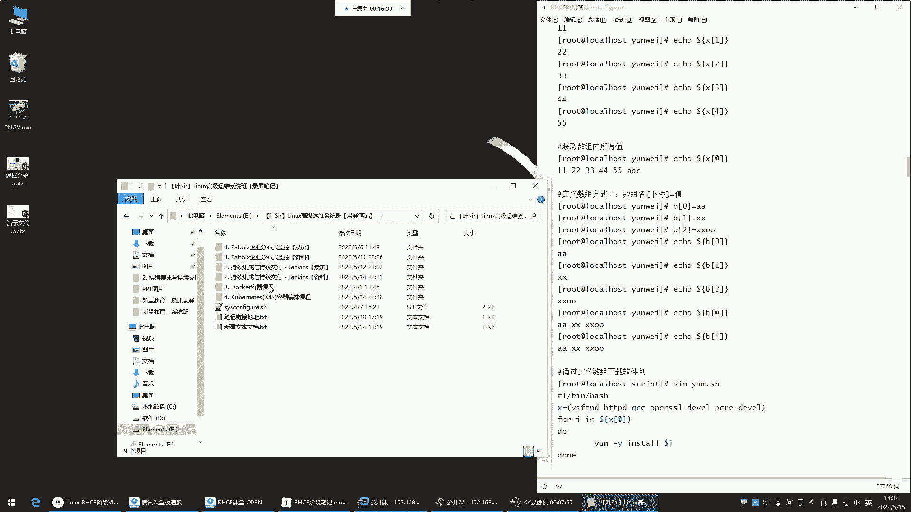
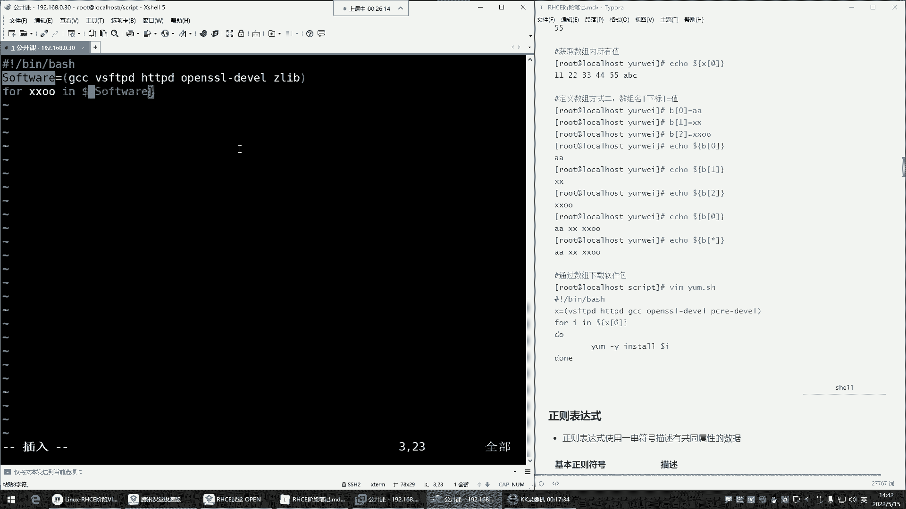

# Linux运维培训教程超全合集，通俗易懂，适合小白，带你从入门到精通1 - P47：红帽RHCE-12.Shell数组、正则表达式 - 洋洋得IE - BV1qX4y177j1

喂喂喂，OK。啊，我们来这个读一遍上课前呃，这个读读一遍上课前的一个励志短句，看哈。没呃，等一下啊，我把这个哎打开一下好，来看一下哈，看这句话，没有一个冬天不可逾越，没有一个春天不会来临啊。

最慢的步伐不是归步，而是你在那无尽的徘徊。所以说最快的脚步不是冲刺，而是坚持，是吧？同学们，所以我们呢现在也一样，哎，我们每天进步一点点。那在未来哎都会变成我们人生中的一个什么呢？啊你要经不住是吧？

未来都会变成我们人生中的一个这个让我们一个美好的回忆啊，这是我们这个开始上课了哈。然后那我们这个上节课。😊。

上一课讲到哪儿了？我们上节课是讲到了来看一下哈。我们上一课是不是讲到了这个。😊，把这一部分给他讲完了呀，这一部分包括这个字串啊，不是哈，在这儿哎，这儿哈我说呢在这儿哈，我们把这把这部分给讲完了。

是不是啊对。😊，那接下来呢我们这个就正式开始啊，正式开始这个讲。这个正则表达式跟这个室有试验课里面的这些内容了啊，这些的话呢也是后期比较常用的，我把这个给它关掉哈。好。😊，那么们先来看看是有数组吧。

这个数组的话呢，是今后你在看别人脚本的时候，你会经常去这个遇到是有数这个数组。那什么叫数组呢？在这里边我并没有给一个具体的解释，是不是啊？那这个数组啊，其实啊它就是那个那一个变量的另外一种形式。

什么意思呢？就是这个数组这个东西，它是可以就是在一个变量名里边定义很多个值。我们前面在学习变量的时候，是不是A等于叉叉OO，然后回车啊，这样我们就把这个变量里的值给它输出出来，是不是啊？

哎这一个变量里面定义一个值。但是如果说我现在呀有些需求，这一个变量里面一个值啊无法满足了。那接下来怎么办呢？接下来我们就不能用变量了，用什么呢？用数组，这玩意儿它比变量的功能啊要强大一些。

你看定义数组的方法，我们来看一眼哈。第一就是你看它跟变量的方式是一样的啊，数组名，你可以把它理解成这个变量名。😊，好，然后等于号你看是不是格式是一样的呀？没错。

那里边的值这时候因为数组是允许你定义很多个值的。如果你定义一个值，它不叫数组，它叫变量。😊，那如果我想定义很多个值，它就叫数组。哎，那这个时候哎你看你定义多个值的时候，用小括号括起来。

然后里边写很多个值。哎，那你看方法跟变量一样啊，B等于等于什么呢？哎，小括号里面，比如说这个小方。😊，然后空格隔开，第二个值小V空格隔开，然后9妹。空制隔开阿莲啊。

我们中国四大村花回车定好了icical每到B回车。哎，对输出的时候它不一样了。它取值的时候怎么取呢？它取值的时候，你发现它并不是把这里的所有值给你取出来了，它是取了谁呢？它是取了这个里边的第一个值了。

能列解吧？那为什么只取第一个呢？因为啊它这里边你看好几个值，它也不知道你到底想取哪个值，所以在这里边啊，它就默认给你只取这里边的第一个值。😊，那你如果想取后面的值怎么取啊？哎，那这个数组啊。

它是按照下标去指定的那什么叫下标呢？下标就是数组里的。值啊，我们称之为叫下标啊，然后这时候呢在数组里边，这第一个值我们称之为是第一个下标。第二个值是第二个下标。但是它这个下标在数组里边注意啊。

是以零起始哎，这零就是里的里边的第一个下标，第一就是第二个下标啊，其实说白就是值啊，然后二就是第三个值然后三就是第四个值。所以你明白哈，它这个它里边取值的时候是从零开始取啊。

零就是里边的第一个值一就是第二个值，二，第三个值是这样玩的。所以这时候你想取值的时候，你就得ecle然后啥呀？哎，每当数组名。😊，输个名哈，但是你取值的时候，你后边中括号跟个下标几呢？看一回车。

不对劲儿，这怎么多个一是不是啊，把小芳取出来还多了一个一，所以数组取值不量取。注意啊，数组取值是要套个大括号。😊，你发现这玩意儿真的不太适合人类学习了，是吧？哎，这样就可以了。小V取出来了，看到吗？哎。

你套个大括号，这样就把小V给取出来了，这是取第几个值啊，注意啊，这一就是数组里的第二个值二呢就是第三个值，你就记住哎，你在取值的时候，你想取第几个，它是从零开始的。好，那我想取1234第四个值。

那是不是就是三呢？所以你在取值的时候，你记住哎，永远比你要取的那个值干嘛呢？哎，少写一位就行了。😊，它在这个数字里面的值是第四位，你就输入三好，取出来了，叫阿莲取出来了。嗯，那这个就是我们所说的数组。

那现在我问一下大家，这个数组理解了吗？数组是什么呀？是不是就是。就是它也是一种变量啊，然后呢就是里边可以定义多个值了。然后你想取哪个值，哎，看情况。能列了吗？裂的话，给我刷个一上来。嗯。

能明白这个数组的含义了吗？这个速度。能理解是吧？所以它这玩意儿啊就跟变量没啥差别。哎，你就知道它这玩意就是呃比变量功能会强大一些，这里面可以存很多个值了。哎，变量是一个里边一个值是不是？哎。

那有了这玩意儿了，那你想想这个时候嗯我们可以用它干嘛呀？😊，哎，这玩意儿就跟变量一样，变量怎么用，数组就怎么用啊，我们一会儿再说。那接下来呢我们再来说它另外一种形式。偶尔有回音是吧？偶尔有回音。啊。

喂喂喂，看一眼。啊，喂喂喂，这声音声音还是蛮清晰的，是吧？这声音调不大。嗯。对，让你的可操作性它变高了。

对。啊，在这儿我看一眼哈。这声音还可以，是不是？声音还是非常清晰的。

其实就调这了。好，O。🎼喂喂喂喂喂喂喂喂喂喂喂好。那接下来呢。😊，我们再来哈我们再来说说第二种定义方法，这取值，你看按照下标去取值，下标从零取始零就是数字里的第一个值。那接来嗯。

我们呢如果想取里面的所有值来怎么取啊，艾特符，艾特符是取所有的值的，来看一眼哈。我想把里的所有值取出来，就不要输入数字了。哎，艾特符。爱特夫。回车，你看把所有值取出来。那这时候大家肯定会产生疑问了。

说这玩意它用在哪儿是不是用在哪儿？那我给大家来看一个，我昨天刚刚讲过的1个K8S的一个脚本。😊。

这个脚本大家应该都能看得懂，所以呢我来给大家来说一说这玩意儿它可以用在哪儿。

啊，昨天在讲KS的时候。

在这。昨天在讲K8的时候呢，我其中就用到了数组。在在这儿。往下翻。看看。我昨天呢用数组干嘛了呢？哎，定义了一堆叫做镜像列表。这个镜像列表可能大家现在呀没接触过啊。嗯嗯，这个呢星可以吗？不行，用不了星哈。

它不支持。这玩意儿它可以干嘛用来看一下哈，你们看哈对这个。😊，这玩意儿可以放在脚本里面。在脚本里面怎么玩呢？看这玩意儿我先比如说我现在需要下载很多个东西，哪些呢？啊就下载这些东西，你可以把它列成软件包。

我现在想下载非常多的软件，1234567个软件。好，我想下载这7个软件包。😊，那这7个软件包。😡，啊，可以可以放命令哈可以防命令。😊，那但一般我们不放命令，就像你会啊这个一般我们放命令也也会取它的结果。

能理解吧？就像变量一样，你说我们不是直接在变量里面放命令干嘛呢？哎，我如果真的是需要的话，我是变量里面把命令引起来啊，比如说S等等等等啊，等等等，叉叉叉给它取它的结果可以哈可以。😊。

你看我这里边我要需要下载非常多的软件包。那这时候这包太多了，然后怎么办呢？哎，我通过数组的方式给它定义了一下。你看数组名，然后呢，等于号是不是刚刚格式是一样的呀？然后接下来呢小括号小括号开头小括号结尾。

这里边是我定义了一个什么呢一个数组，那这时候我定义了这些就是里边的东西就是我要下载的。那接下来怎么下哎，用负循环去帮我循环去下载啊，我不想手动一个一个去下了，哎，负循环去帮我下载负循环。

我们昨天讲到这个复循环的时候，是F，然后呢，这时候这叫什么呀？这叫变量名是吧？变量名，这变列名是不是我们可以随便写呀，哎，我可以让它是叉头是不是啊哎变量名，就是你随便定义变量名。

然后接下来呢印印后边是什么呀？印后边的值从哪来，从数组里边来。😊，从数组里面取值。那这时候你怎么取数组里的这些所有的值呢？怎么取啊？哎，在这儿每到画括号花括号里边是什么呀？是数组名。

这个数组名是不是对应的上面这个image啊啊一模一样的是吧？数组名，但是我想取所有at特符代表是数组里的所有值取所有值。你看它取所有值就是每取一次，是不是这个值就放到变量里面了呀？

放到变量里面干嘛开始循环度跟当里的语句了。那这时候我风循环是在命令行里面用的。😊，执行多根当理的语句能理解吧？那这玩意儿你是可以放在脚本里的啊，直接粘贴到脚本里就可以了，不在命令行里边。

然后接下来我们就干嘛呢？开始帮我去执行里面的语句了。那这里面的语句做什么操作，那是不是就看具体的情况啊，给我去下载是吧？给我下载数组里的这些定义的这些软件包，是不是啊哎，帮我去下载，看到吧？哎。

docker铺啊，铺就是拉取的意思，给我去这个位置，去这个地址，给我拉取什么呢？拉取这个变量名里边的那个。😊，软件包这个变量名是不是就它呀？哎，这里的软件包给我拉取下来，那他就给我拉取到本地。哎。

他是把你看每取一个值放到变量里面，他就给我执行这里面的语句是吧？拉取。哎，然循环完了以后呢，再把第二个值就数组里的第二个值，它不是以此类推嘛？第一个值，第二个值再给我放到变量里面，再去给我干嘛呢？哎。

再去给我执行这里面的语句。哎，这个我问一下大家能看懂吗？😊，哎，就这一部分能不能看懂，能看懂的来给我刷个衣上来。😡，是不是我们昨天都学过了复兴环，然后再加上今天的数组。😊，好，能看懂是吧？

那你看这玩意儿它用在哪儿，你现在知道了吧？哎，这玩意儿啊。怎么用都行。怎么用都行啊，下载一些东西。都可以创建一些文件，创建目录什么的。哎，你都可以用数字来实现。你定义什么啊，看懂三成，看懂三成啊。

那你得去看看前面的复循环了。主要你我觉得你是看不懂复循环的语法再加上数组的这种方式啊，数组取值就是固定的就是每刀画括号，然后里边数组名啊，然后里边数组名，你取什么值，这就是看里面的具体的下标啊。

大大概意思能明白是吧？那就可以了。所以你知道现在你能明白就行，我也不是要求说啊，大家必须得什么呢？得给我记下来，熟练掌握不是你只要能看懂就行。这种东西以后一旦出现的话，你看懂它是啥啊。

以昧置变量名自己起的名。😊。

自己起的名上。好，那这玩意儿我们怎么用，你想想我们怎么用啊，这玩意儿你想怎么用就怎么用啊，比如说我要安装一些软件包来看一下哈，安包啊，我们通过定义数，我们通过数组去下载软件包。😊。

那就跟我前面的那个是一样的。比如说我现在来个数组啊，当然我们可以写在脚本里边哈。我们当然这个机器呢是一个。😊，Makeake点儿。昨天那个机器我给删了，我昨天不是创一个虚拟机嘛，然后我给删了。

我今天又用一个新的机器。因为昨天那机器我觉得它有问题。😊，啊，拼一下3W点百度点儿com。哎，你看这个没有问题，昨天那机器有毛病给删了哈，然后我又重新建个目录，这里边是空的是吧？VM然后什么呢？哎。

我就让它叫什么呢？叫。😊，🎼F，然后。数组点SH。不是数据数组点SH然后在这里边看井号叹号杠并下的拜。因为我现在想下载一些软件包，哎，我干嘛呢？对，艾特是全部的意思，没错，是全部哈。

我现在想下载一些软件包，但包比较多，干嘛呢？哎，我就这样定个数组。😊，Softtware。嗯，sft。soft softofft是sofft是sofft是怎么拼的呀嗯。😊，Soft。软件。是吧不是。

Softt威尔。算了，翻一下吧，靠你们也不行的。软件软件啊，这个sofft威尔对对对。😊，来好soft等于等于什么呢？等于这是我的书组名是吧？数组名叫什么都可以，是不是啊？

然后小括号里边我要下载哪些包呢？比如说GCC。😊，看VSFTBD啊，HTTBD。还有什么呢？还有这些软件包。接来吧。等等等等啊，这些软件包这些软件包现在还没有学是吧？没关系，先甭管它是干嘛用的。

就是我先我现在就要下载它定义一下。😊，嗯，是这样写的吗？我看一下哈。哎，没错，就这玩意儿，就他这就是数组哈。😊，看内部等于这不就数组吗？数组里边干嘛呀？哎，你说他这数组怎么这样玩的呀，是吧？😡。

怎么这样定义呢？注意啊，它这里边是直接给下它这玩意儿啊定义的有点啰嗦了，有点啰嗦了哈。其实你不用指定数组名，你不用去什么呢？不用指啊，我看它啊它是这样。😊，哦，可以可以哈，他这样玩也行。

那数组里边定了什么呢？哎，定了一个名字跟下标，我这个下下下标里边存的是这个同学的名称好吧，这这是第几个下标，是不是零代表数组里的第一个下标啊，那其实就是第一个值。😊。

零代表数组里的第一个值一代表数组里的第二个值啊，那这个名字叫什么呀？啊，这个数组里面的名字啊，叫内蒙叫内某啊，内某零后者你你稍后取值的时候取的是谁呢？取这个名字啊，这个内目一里的值是他张三啊。

李四王五这样取值的。就就这样取值。然后像这种东西的话呢，到时候它调用的时候，它就怎么说呢？比较方便了。怎么调用呢？你看它这样那eic谁呀，ic每刀数组名是吧？这是不是一个数组名啊。

那这个数组名里边还有什么呢？还有这个哎里边的name名字，那name零是谁呀？ name幕零到时候就给你ic。😊，这个这个同学的名称。啊，然后呃。

它这玩意儿你看其实就是通过数组方式定义的这我相信大家应该多多少少能看懂点。能看懂点，下边不也是吗？是吧？数组里面呢定义的一个名字，啊后这个零代表是第一个下标，下标里面存的是15是吧？啊后这是1219。

那这玩意儿我觉得还比较简单比较简单。那我们自己来演示一下，选的更离谱嘛？没错，有点离谱哈。😊，那接下来咱们来看一眼哈，我现在也是定了一个数组，这里边有非常多的软件包是吧？那这么多软件包，我想下载的话。

我用复循文去给我下载复，然后变量名叫什么都行，叉叉 in。😊，哎，印后边是跟谁呀？后面跟数组名。每刀画括号里边数个名。数子名儿拿过来。

啊把这个复制翻译给它关掉，不然每次我一滑，它就开始给我翻译了。啊，接下来哈software，然后接下来呢干嘛呢？中括号取值取谁呢？取所有艾特符代表所有值。😊。

🎼好，然后度噔。干嘛呀？那是不是只要是这个数组里面的值，注意啊，我这艾特符是不是曲里的所有值啊？那这时候第一次循环的时候，这里面的值是谁呢？是它。😊，是它它就会放到这个叉叉O里边。那接下来他会干嘛呢？

哎，我就y么给我去安特亚么杠外insta安谁呢？哎，就安。软件包哪个软件包啊？哎，美刀叉XO叉叉O是谁？叉。🎼刀乐夫每刀叉刀。叉叉O是谁？叉叉O是不是就是这数组里的第一个值。

是不是循环第一次的时候就按这个包，第二次就按它，然后按完以后还干嘛呢？啊，这就别起伏了哈，不用起伏。😊，多起伏，那这时候就是给我安装它。安装他。开启录屏了开启了哈，看到吗？已经18分钟了哈。😊，O。

然后接下来呢保存退出保存退出以后，我们来执行一下，看效果是吧？ch执行这个。脚本。回车ele后面的。🎼这个根号啥意思？哪个根号icical。嗯。啊，他那张图里边是吧，他那张图里边。

iccle最后那个跟转移符转移符哈啊，不是这它这是一个转移符。就是因为它什么呢？它是敲了很多条命令，这玩意儿就是比如说我想在命令行里面敲很多呃，输入很多个值ecle啊，那这时候值比较多，叉抄O是吧？好。

但是我这个值呢我不想放在一行哎，左斜线回车ABCD好然，左斜线回车。😊，1234。啊，左切线回车看到吗？啊，噼里啪啦的回车，哎，这时候就这样放在一行了，看到吗？😊，这玩意儿啊误了，是不是啊啊。

就是这条命令我不想放在一行。😊，啊。那接下来。你看我给你们讲的多通俗啊，是不是是不是是不是太清晰了，突然间发现哎这玩意儿能看懂了，是不是啊？哎，感觉哎写的是比较高大上。但是呢哎经过我们这一拆解。

你发现哎呀，其实也没啥，是不是啊？啊，到时候不就把你的这个名字给你们输出出来了嘛？是不是？😊，好。啊，接下来。我们就这个执行一下哈，执行这个for。数组点SH哎，规车，你看他干嘛呢？给我下载软件包。

你看开始下了啊，开始下载这个软件包。😊，现在软进门了。

都是手打嘛？没错，都是手打的啊。😡。

你看是不是就把这些软件包给我下载下来了呀，已安装没错吧啊，作为依赖的其他包呢，其他包也安上了，其他包断了哈。😊。

其他包呢作为依赖。来，我看一眼哈。😊，啊，其他包都有。

啊，你看这包都有是不是啊那杠QVSFTBD啊，都安装上了，是不是啊HTBDHTTPD好，都安装上了。对。好，那接下来那我们这个是不是啊，对，就能跟得上。😊，你啊，那接下来呢我们这个。😊。

这个数组这玩意儿你发现它是不是就跟变量一样啊，哎，它就是变量，你把里你你需要存多少值，你就往里面存就行了。这玩意比较简单。啊，下面还有一个定义数组的方式，第二种方式是什么呢？

第二种方式是直接就是我这数组已经存在了，我想再往里边去再增加值，可不可以？😊，啊，但是这种一般很少用很少用哈。哎像这种你看啊它是这样玩的。比如说我们在命令行里面那个哪个数组呢？😊，这个。

那个A是不是啊A。这里面就一个值吗？😡，是B啊，B里边。你看我刚刚挨过A的时候，是不是也把这里的值取出来了？😡，呃，信号不行哈，你把里边放信号，你看行回车哎。😊，这信号这怎么又好好用了呢？

这信号怎么又可以了呢？我曾经。😊，我曾经用的是我试验过呀，它不行啊，但为什么这又可以了呢？😡，哎，诡诡异了是吧，诡异了哈，你也试了，可以是吧？哎，我原先试过不行，那可能是。😊，有点说不清了是吧？😊，对。

有点说不清了哈，这玩意儿呃可能是版本的问题。没错，有可能啊，但是这玩意儿尽量别用星号，尽量别用星号，嗯，尽量用艾特符。因为这玩意儿它有的时候真的是因为我曾经试过放心他你想你们想的问题，我肯定都想过呀。

是吧？我曾经试验过它不行。😊，所以呢尽量不用醒。那我们现在来给大家说一说啊，你看我现在把数组里的所有值都给它输出来了，是吧？那我现在我觉得这里的值有点少，我想再往里面增加一个。😊，啊，再增加两个人啊。

现在什么小微小芳，我觉得现在有点忙不过来了啊，我再往里面增加两个人啊，增加什么呢？增加一个波多，那怎么办呢？哎这时候。😊，你最笨的方法就是重新定义一下啊，B等于重新定义一下。那定义一下。

它就把原原先的值给你重新覆盖了。但是你不用这样不用哈。如果你这里面值比较多，你再向往里面增加，你就可以向第二种方法啊，把这个名字拿过来指定下标就行了。然后等于多少值这样玩啊，这个B。😊，好。

那你要数一下下标，这里的下标，你看这是。0123是吧？那我现在哎再往里边增加的话，那是不是应该第四个了呀？哎，第四哎，下标第四就往我要往第四个下标里边增加个值，值等于多少值等于哎不多。啊，波多回车。

那这时候我们再icical回车，你看是不是就增加进去了呀，就是怎么再往数组里面赋值啊，对，这时候那我再想往里面增加怎么办？那这时候你如果看如果再往第四个下标负值，那是不是波多就会被覆盖了呀？😊。

是不是啊你比如说啊这波多比较累了，换成小方啊，不是小芳了，是谁呢？小苍老师小苍啊。回车，那这时候你看上就变成小苍了，是不是？哎，对，比较累。那那如果你说我再往里面啊，再增加一个人呢，哎，5是吧？

那这时候这时候谁呢？这时候增加一个。😊，🎼小泽小泽回车。那这时候你看。是不是嗯。就是怎么往数组里边去增加值啊，前面是定义啊，这词用的是吧？😊，嗯，我这词用的比较隐晦是吧？好。

那这是怎么再往书组里面复制O。😊，然后下边怎么用这玩意儿，是不是啊，它这个玩意就是一个变量，就就是变量哈嗯。😊，对，提神这玩意儿OK那接下来呢我们说是一个正能表达式吧啊。

数组现在其实就是变量的一个什么呢？一个高级版，一个高级版哈。所以你们呢就知道一下啊，它里面可以存很多个值，取值的时候怎么取就可以了。OK。😊，那下面呢我们来说说正能表达式。

这个正能表达式呢对于大家来讲也是一个比较痛苦的一个什么呢？一个。😊，技术内容为什么呢？因为这玩意儿就一堆符号啊，就一堆符号。😡，这就是正的表达式。那这玩意儿啊你看它是你它既然是叫正则表达式。

他就是想通过这些符号想表达一些什么呢？哎，想表达一些具体的功能。嗯，这玩意就是通过这些特殊符号，哎，想表达一些功能。那这些特殊符号是几乎在任何一个编程语言语言里边都有的。你比如说这个什么C语言。

还有这个java。啊，python。等等等等哈，这些都有这些玩意儿。😊，都有正则表达式的符号。然后他们在任何一个编程语言里边，这个符号的功能都类似。

比如说这个符号在设有语言里边是用来帮你匹配横首的那在Cjavapyython里面也是匹配横首的。啊，所以像这种东西的话呢，它是一个通用的符号啊，在任何一个编程语言里面都比较通用。

那以后你看到这个其他的编程语言里面，如果发现这些符号的话，那这玩意儿它都是类似功能类似。所以什么叫正则呢？正则表达式就使用一串。让我们无法理解的符号去描述一些我们无法理解的事情啊，这叫正格表达式。

😀Yeah。那来演示一下这上怎么用。第一个尖角号。😊，呃，它是干嘛的呢？它是匹配行首的，怎么匹配？我想过滤一个文件啊，gra我想过滤文件的root。好，那这个时候你看啊这个过滤的时候发现哎过滤出了两行。

因为这两行里面都包含root，是不是啊啊，只要有一个你搜索的关键词，它都给你过滤出来了。那接下来大家想象一下，我就想要什么呢？就想要。😊，开头包含root的行，注意啊。

这行里面只有开头包含root才是我想过滤的那个数据，中间包含末尾包含都不是我想要的那这个时候。你就加个间角号。注意一定要在前面加，别加后边啊，加到前面代表开头。开头。这个间角号怎么打出来，知道吗？

按住你键盘的shift，再按你的这个键盘的那个几呢？6啊，数字6。回车。那你看是不是有区别了呀？就是只把开头包含root的嗯。给我匹配到了啊后那这一行是不是就没有显示出来呀？哎，这就是用来匹配什么呢？

哎，以什么什么开头，其实我们前面也学了，前面就学过这玩意儿学grab的时候，我前面就给大家讲过匹匹配以什么什么开头，还记得吧？😊，graph的时候啊，没有在这个笔记里面是吧？在那个笔记里面呢。对。

用多了就好了。对，RHCS里IHCS里边，那这玩意儿。😊，就是用于干嘛呢？其实主要还是用的数据过滤。数据过滤哈，你需要过滤的时候，你就可以去什么呢？啊去匹配匹配。然后。😊，那。还有这个美刀美刀是什么呢？

每刀是以什么什么结尾，是不是？哎，那我们试试把它放到这儿可不可以？你看放到这儿不行，是不是？他无法理解的这以什么开头啊，是不是这以什么开头啊，一空啊，你这啥都没有，是不是啊一空啊，所以这不行哈。😊。

这不行。那接下来我们说说以什么什么结尾道乐福啊，道乐福。😊，如果你结合graphpe用的话，那它就不是帮你去过滤变量了啊。你前面给他一个。

比如说呃我想看看我系统里面有哪些用户用的是这个bach解释器的那这时候直接bach结尾。啊，以拜事结尾的给我布列出来。哎，就两个看到吗？我这系统里面就两个用户，说白了可以登录系统。😊，是不是啊？

那其他用户呢啊那我想我还想看看哪些用户是以no log in，就那个不能登录系统的no。😊，烙个印。啊，这用户都是无法登录系统的用户，看到了吧？这是以什么开头，然后以什么什么结尾就过滤。

用于数据过滤的这玩。那中括号，哎这个中括号我们前面用过是吧，哎，再讲一些什么条件判断啊，杠F判断文件是不是啊啊，这玩意儿是文件吗？看看问它是吧？这个哈杠F。杠F在中文号里面做条件判断的。

我问他这个ETC下的pass打D，它是文件吗？然后iccle每到问号啊，是吗？是返回是零，就是代表是结果是正确的。没错吧，哎，做条件判断。那在正则里边，它的功能啊还可以干嘛呢？还可以去帮你做一个匹配。

啊，叫匹配中括号里的任意单个字符。嗯。什么意思呢？😡，就是我呀有很多个字符。嗯我可以给他什么呢？哎，放到中号里面要过滤，就我要过滤。那这时候但是呢我不确定这个字符在这个文件里面存不存在，那我就这样过滤。

Cect吧。然后。哎，中括号里边随便写。123。ABCD。root叉叉。啊，这是我要过滤的内容哈。唉，那在这里边注意哈。😊，它叫什么呢？它叫任意单个。什么意思呢？这任意就是你是什么都行啊，单个注意哎。

这里面主要是以单个为重点，就是这里面注意啊，一是单个字符，A也是单个字符，能理解吧啊，就是他们之间啊，你就这么理解这一个英文字母就是单个的意思啊，一个一也是单个的意思，它们之间没有任何关系啊。

不是连续的哈啊，这不是一个单词，所以他们之间没有任何关系，过滤什么呢？哎，从ETC下的housesWD过滤。那你看这时候它给你过滤了什么呢？你发现怎么这么多东西啊。😊，也就是说你看他给你顾虑了。

只要是你这里边有的东西。😡，我在这文件里面给你找到了，我就给你显示出来就匹配了，看到吗？你看一有没有有是不是？😊，它并不是说必须得匹配这一个连续的哈，它们之间没有没有任何关系，这不是连续的哎，一也行。

二也行，三也行。只要有的话，我都给你找出来，都符合我的条件。这做数据过滤。😊，做出一过滤哈，这玩意儿唉，那你说这玩意儿它后期可以用在哪里呢？😊，这玩意儿后期啊大家如果学习anible的时候。

哎anible。😊，🎼我给大家安个包哈，y杠外ins到安包。大家在学习aner的时候呢，anser里边会用会用到这个东西啊。ensible杠杠version看一下版本。啊。

然后在啊这个其实其实你们不用管哈，它在哪儿呢？在ETC有个anerible目录，在目录里边有一个叫ho的文件，就这个哈这文件。然后我们干嘛呢？打开这个文件。😊，打开文间以后。

它这里边就用到了这个正则表达式的这个符号。在这儿这个中国号。这个中号它干嘛用了呢？😡，哎，我们来分析一下哈，它是这样子，就是在这文件里边，你看001冒号006。啊，它这冒号呢是做了一个分割符，分割符哈。

然后在这里边它是就是用的这个中国号去匹配了啊，是匹配了什么呢？匹配了主机名，就是这个主机名，前面是3W开头。😊，而中间这个主机名包含，只要是001或者006。

但是它这是个它这里面是匹配连续的冒号代表是就是001一直到006的意思。啊，这就正额表达式在里边啊吧就是这个主机名是3W001，然后后边以这个结尾。对他的名字可以用，可以匹配到。可以在这边做一个匹配。

怎么匹配呢？就是。哎，3W，然后001。点儿。一个三步点com啊，第二个3W哎002点儿。一个赞布点com我。但是呢他想同时匹配6台，他把这个0011直到006哎，我就放到中号号里面了啊。

代表0011直到006。啊，品配了6台机器。这玩意儿。你看就是它可以放到配置文件里面。那我们呢也可以用它做数据过滤，你把那个东西放在这个里边，然后呢。你是想过滤还是想干嘛？这就看你的情况，看你的需求。

啊，下边哈这是中括号啊，认识一下就行哈，认识一下就行。你就是到时候你看到一些文件里面，如果有这种中国号，你就知道它是去匹配的，匹配中括号里的内容。啊，这个就是先知道一下它干嘛用的。可以做匹配。

然后下边还有什么呢？还有这些这个点啊，还有这个中号里面，如果你放个尖角号，要对集合取反。这个这个尖角号是匹配行首是吧？但是如果你放到这个中号里了，那它这玩意儿就叫对集合取反。什么叫对集合取反呢？

就是我现在还是过滤gra。但是我现在想顾虑的时候是想。叫做排除某些内容。那间井号。这里面放个键号，你不放，是不是就直接给你过滤了，比如root。😊，冒号。呃。太惨了。ETC。怕さ。WD。

你看这里连帽号也给你过滤出来了是吧？那我们这种过滤没办法，只要你这里边有什么，他都给你过滤。嗯，那这时候如果。我们把冒号去掉啊，就是么root这些都过过虑这哈这儿。过れ吧。什吧root。入ot。

这里面还可以放什么放一根书线。太死了。ETC的。WD啊，不行，不支持出现了吗？两根儿。哎。这也不支持了。不支持了啊，不匹配是吧？他说不行，那算了，就这样吧。那它这里边。

这样过滤的话，你发现哎呦这只要是包含的都给你过滤出来了，是不是啊？那我现在我不想看什么呢？不想看包含这些。😊，字符的取范肩9号。针减号。加点号。回车。那你看你发现这些给你排除了，你看是不是root呀。

它没有加一个高亮显示。给你排除了看了root排除了ts问吗，你在这看，你发现ts也排除了是吧？只要在这里边的都给你排除掉了，在这位置。😊，这叫取反取反，其实说白了就是排除啊，我不想看到这些东西。

不要给我显示。啊，需要杠加杠E是吧？对，需要加杠E哈加杠E那一会儿再说啊，你。😊，🎼不加钢印也行啊，叫igraig也可以。中国号，然后。Root。或者pa词的。这样也可以啊，唉这也不行啊。🎼唉。

这不对哈，那这得小个号可以，小号可以啊，但是你们。😊，え？奇怪了啊。算了，先先不管它了，这玩意儿。不好用不好用啊。这是对集合取法，这是中括号里边，哎，我们干嘛呢？想排除某些数据啊，可以用尖角号来表示。

然后点儿点儿的话这个。我们前面讲过干嘛用的呢？啊，这个点儿啊阿S点儿回车。看当前目录。🎼啊，这点永远代表你当前在哪个目录，是不是啊啊，我拷贝文件拷贝把ETC下的FSTV啊。

或者passWD拷贝到我当前的目录。😊，怎么实现呢？点儿回车。哎，拷贝过来了。这点儿代表是当前路径的意思好，那。这个点儿。啊他还可以去帮你匹配呢。啊，如果你结合grarab用的话。

这个点儿就可以帮你去匹配一些什么呢？哎，匹配一些字符。grab，我现在。要你看。匹配什么呢？点儿代表单个儿。单个任意字符。任意就是你这东西是ABCD还有1234。都行，任意啊，不管是数字还是字母。

我都可以帮你匹配单个就是它只能匹配一个。嗯，点儿OT。ETC的passWD。哎。点儿OT是什么意思？就OT前边是什么都行。你是R也行，是啥都行。但是呢只帮你匹配一个，就这玩意儿。看到吗？星。

星匹配前一个字符出现的任意次数，这玩意儿干嘛用的？换个星。回车。哎。不对劲儿是吧，啥都没有呢。😊，好。放到这儿先回车。这样可以这样可以啊，你看给你匹配了。😊，前一个字符啊，这里边匹配了什么呢？OT啊。

OT在这文件里面出现了多少次呢？任意次都行。其实就是这个文件里面有多少个OT都给我显示出来，这星要放到你要过滤的这个单词的右侧。放到左侧。放到左侧，他以为你要匹配空呢。放到这儿，他以为这前面啥都没有啊。

我帮你匹配啥呀，是不是？😡，所以要放到后边。这玩意儿。做数据过滤用数据过滤。我想看这文件里边这个OT的，其实你发现那这玩意儿我直接这样不可以吗？OT是不是这怎么感觉有点多此一举了呢？😊，是不是啊？😊。

是不可以？但是它不太一样，你发现这O它也给你匹配，这是O也给你匹配。😊，看到吧？OAT你这种的话只是给你匹配OT。所以他这个就是你这里面是O也行，T也行。都可以都给你匹配。做是一过滤啊，这玩意。

如果你需要过滤一个文一些文件的话，那个我要过滤文件，过滤什么呢？比如过滤一个。80。从内文件呢从ETC的sice。これ？嗯。这不是80嘛，是吧？只要包含80的都给你过滤出来了。

那如果说哎我的要求比较苛刻了那。加个点儿。哎，好像也没太大差别是吧？其实还是一有还是。确实没啥差别啊，因为它也只要有80就给你显示出来了，没有太大差别。就数据过滤哈，这玩意儿数据过滤。

然后这玩意儿啊大括号里面什么NM，这玩意儿叫匹配前移个字符，N到M4，这玩意儿我们我们用不到，我们几乎用不到啊，做运维这种东西。其实你都不用去什么呢？不用去浪费自己的脑细胞。所以在正则里边就这玩意儿。

完全没有必要去浪费时间去讲它。表格删除删除，我们学就学一些能够常用的就可以。那为什么把那删了呢？因为下边有一种更简洁的方法。什么叫N到M4？嗯，还有什么加号，哎呦问号这些东西。😊，大家简单过一遍就行啊。

这个因为我们平时几乎用用不到这玩意儿。呃，先说这个N到M4。干嘛用的？我现在过我现在就想过滤了啊，因为这些flow都这主要还是用用在过滤哈，就是就是做数据过滤。😊，然后呃我现在想过滤过滤什么呢？啊。

过滤一个文件啊，过滤过滤一些这个关键字，在文件里面出现的次数。比如说。这个80啊，那这时候从ETC的44文件里面过滤非常多，是不是啊？那这时候。嗯。Oで요。大括号。这个80逗号。呃，出多少次呢？啊。

不是啊。🎼就玩儿。80的外边哈要过虑80然，这里面放段侧啊，出现一逗号2。大份。是不是这样玩的？我看看啊，大家看啊，但这是得引起来，代表是个整体。回车。那不对呀。一栋2。一。啊，没有效果是吧？为啥呢？

因为少了个亿。少了个E哈，加个E。一逗号。2、回车。哎。这玩意儿。哦。还不能有括号，不是还不能有空格，看到了吗？这位置我前面这个80跟大括号加空格，它无法识别。无耳识别。那这是干嘛呢？什么一逗号2啊。

就是在这文件里面，如果说这个80日出现过。😡，1到2次。都可以。那这里边你看都是80，是不是啊啊但这玩意也看不出啥效果来，我发现看不出效果哈，这太多了太多了哈，所以这玩意儿。😊。

不太好掩饰，就是不太好掩饰，大家掌握也没也没有啥意义。我觉得这种东西表格删掉。

掉什么最多匹配一次，这玩意儿，哎呀，我觉得真的是没啥。很少用这玩意儿。I you。嗯，这个小括号的话呢，哎我们可以给大家说一说这玩意干嘛用的呢？啊，还有刚刚我加的那个E是干嘛用的。呃。

这个我们前面讲的叫基本政策。正额表达示。综合表达是这些符号啊是属于基本正则。后期呢这个开发者觉得哎这些符号啊不好用啊，然后这个语法呢也复杂，人们也不好记忆。然后他呢又搞了一个叫扩展政策。

这些属于扩展政策。扩展政策呢其实就是你用前面的符号也可以。但是你如果使用有些符号的话，你得加叫earap。加个E。啊，E这是可以使用一些。就是如果你发现就像我前面那样，哎，你看我不加E的时候。

不加一的时候，你发现怎么没有效果呢？😊，但这个符号是因为它不识别吗？也不是是因为它呀就是不识别啊，加个E会车，这就可以了，看到了吗？这样就可以了哈。所以说这玩意儿就是有的时候你发现哎我过滤了。

为什么没有效果呢？可能是这个符号，你用普通的gra，它真的是不认识。😊，🎼还有你可能会看到别人会干嘛呢？这样graap加一个杠大E啊，其实也是同一个效果，是同一个意思。就是。我们把这个杠大意，我不想写。

就给它写改成e就行了。能点吧，一来吧。啊，都是扩展政策的意思。啊，然后宽中的里面这个小括号这玩意儿。😊，用的也不多，简单了解一下。什么组合为整体。这玩意儿也是做数据过滤的。比如我现在要过滤了。

但是它是要加个E个right，那我就要过滤文件里面的root跟什么呢？test。那这时候啊你我们前面无法实现中括号的话，你发现过滤完以后成什么呢？什么root test。😊，ETC的。帕子W不D。

这放的有空格。你看它是只要是这里面的单个字符。都给你匹配到了，是不是？看到吧？单个字符，但是我就想顾虑的是一个什么呢？是一个整体，注意啊是一个整体root跟t的这种整体。那这时候就不能用中括号了。

用小括号。😊，小括号。回车哎。什么。😡，呃。附件语法有误是吧？为什么呢？不太对劲儿啊，我看看哈。😊，你当。呀加个引号吗？😊，推车哎，还真是他得需引号，看了吗？不加引号不行。😊，那左整体为什么没有显示呢？

因为没有一个整体叫这个名字的。😡，你可以。加个竖线，这竖线啥意思呢？叫或者。叫或者什么叫或者呀？就是root或者test都行啊，但是他们是个整体只要有的话给我过滤一下，就告诉这个命令。

有的话给我过滤一下，说就已经过滤出来了呀。roottest过滤出来了，然后这个其他的也没了啊，就是只要常用的就是这个如果你想做数据过滤，就是这个小括号跟中括号是比较常用的。

中括号就是你里面写啥的给你过滤啥啊。但是它是单个字符的过滤，不是整体，想整体就是小括号啊，小括号给你。😊，P过滤整体。啊，这个整体如果内容比较多的话，就加个竖线，竖线代表或者。这儿呢过来。啊。

这是比较常用的。我前面删的那些是有点不太适合人类学习了，所以那些东西也不常用，能列吧。那这些呢是算是比较常用的，但是什么这个匹配任意单个字符这些啊。也不是很常用，说白了不是很常用哈。好。

然后当然这个正额表达式普遍还是应用在数据过滤。所以大家要搞清楚这玩意儿。结合gra是用的最多的。啊，还有后期我们会学的那个一些这个AWKAWK也是那也是做数据过滤的，但是它比gra要强大一些。

这个主要是结合这些特殊符号会用得到。保留。嗯。有复制。🎼复制哈这它还有一个除了这个整合为整体以外，还。可以复制。组合为整体，还可以复制。

那这个复制怎么用呢？我忘了我忘了哈，我们去看看百度。😊，正格表达式。小括号。哎，小括号。复制。功能。正策表达式。嗯哎对，需要。直接来复制，哎，不是啊。你看就这些符号哈。

不但适合人不太适合人类去理解了这些。😊，嗯。看到吗？这你看是不是不但是个人类利一，啥意思啊？这些能看懂吗？😊，啊。能你们能看懂吗？这玩意儿。这玩意儿。尖角号能看懂什么开头是不是A到Z，这什么意思呢？

A到Z就是ABCD这个英文小写的26个字母A到Z。啊，啊那这个大A到Z什么意思啊？就是对大写的A到ZABCD。😊，啊，就是26个英文字母大写的，就是它这里面过虑的就是小写的加大写的。😊，26英文字母。

然后对这个0到9呢0到9这个数字，0一直到9123456789。那也说它这个中文号里面匹配的就是什么呢？就是。26个字母26个字母加这个数字，但是字母是大写小写。都包含了。啊啊加号。爱德福爱德福。

艾的符代表所有。然后这个又是是不是啊，还有一些透殊支符，你看到吗？这里面特字符。没啥没啥，这玩意不太适合人类去学习哈。😊，啊这个或者你看获者了在那边竖线。小括号里面是吧，或者。

或者这个问号问号代表三个字符。加号。加号代表是唉我前面给删了是吧，被我给删了。嗯，加号代表是这个上一个字符出现一次。又给删了啊，但是这种东西我们用不到。谁会用到呢？

就是那些搞数据挖掘的数据分析的会用会用这玩意儿。哎，这玩意儿嗯。对，这玩意儿对于他们来讲还是非常重要的哈。😊，为啥呢？因为呀他们搞数据分析，他就是得从数文件里面去过滤他想分析的那些数据。

如果他过虑不出来，他就没有办法分析，是不是啊？所以说他这玩意儿就搞一些数据分析师，他们会用到的东西。😡，哎，这小括号小括号怎么用来着？小括号。正额表达是的小号。看看啊。正额表达式。哎，他这里边有。

小括号用法。小括号。小括号呢。对，如果你们想如果你们后期如果真的能这个真的是用到这玩意儿了，你可以去这个菜鸟教程。就你看我刚刚搜的是不是这个菜鸟教程啊，哎，它这玩意儿写的还是这个比较适合初学者学的。

它里边哎正则表达式的简介。😊，啊，你可以看一看什么是正则表达式啊，除非您以前使用过正则表达式，否则您可能不熟悉一些术语，但是毫无疑问，你已经使用过啊，不涉及什么脚本的这些是吧啊这些特殊符号啊。

具体的你看它里边。给你这些啊这。语法是吧，语法。等等一系列的东西哈，可以看一看。但是这小括号呢，这儿呢标记一个子表达式的开始和结束啊，它这个他这表他这解释的有点专业了哈，有点专业了，有点听不懂了。

看到吧？😊，你看没有我这通俗是吧，就组合为整体，还有一个复制功能，那复制这玩意儿咋用呢？复制粘贴他在玩意就是。嗯，在里边。哎，没有没有算了吧哈，也用不到。其实。

7。我跟你讲，这玩意功能可强大了，就这种符号，你以为它就光可以组合为整体，可以复制吗？也不是还有其他功能的，功能可强大了。然后啊这个杠B杠B叫单词链接嗯。写写过个笔记。

哪玩意啊？一不来吧。嗯。猴子。Overer， boy。Or the boy。然后。or the boy e过滤。Go the boy。Oder boy。嗯ん。小括号。不是它这过滤了。它是过滤了叹号。

过滤叹号或者加波浪号是吧？你看这里面不就是过滤叹号或者波浪号吗，是吧，然后。加了一条命令system control啊，system control。包含波浪号或者叹号的，然后从这个文件里面去过滤。

然后就过滤了是吧？s to controltl叹号。也匹配了，拨同号也匹配了啊，一个是小括号加一个是中号。哎，这玩意儿你看都是做数据过滤的，你们能理解吗？这玩意儿那这玩意我们用用的不多。

你知道一下就行啊，用的不多。所以正常表达式是一个比较痛苦的东西。😊。

我们用不到就别折磨自己。就你。折磨自己，后期还用不到，这就是一个怎么说呢？就是一个自虐的一种行为啊，我们不要有这种行为。然后接下来单词边界杠B杠B干嘛用呢？这玩意儿就是。

他这玩意儿就是去匹配单词边界的啊，单词边界。什么叫单词边界呢？我们来搞一个文件。😊，打开一个这个什么呢？哪个文件呢？呃，呃，开。Fook。啊啊，我们就拿这个文件来说啊，就拿这个脚本来说啊，我们过滤一下。

😊，哎，这个用ea啊 e，然后什么叫单词边界？我想过滤这个文件的什么呢？😊，有没有？包含y的。那这时候我们可以怎么过滤啊？啊，当然呃这个一般你看这里边都得放引放引号啊，你甭管是双引还是单引，你不放。

它告报你语法错。你看我如果不放的话，就像我们前面那样啊，过滤压么。或者啊是这个什么呢叉叉O的。从哪个文件呢？从这个fo这个文件里面过滤。你看他说你附件语法有误，为什么呢？因为你没有放引号里边。

它这些特殊符号。计算机无法理解。所以你放个引号。他就理解了，看到了吧？他就理解了哈那这个时候啊我过虑的时候，我希望。😊，这个。啊，希望这个亚么。它的右侧啊，我来演示一下这玩意儿哈。🎼单词边界可奇葩了。

也用不到，其实说白了。加一个杠臂回车。回唱。不能放这儿。这个钢闭不려。어。不行，这玩意演是不出来。就拿这个来说吧，这个可以演示出来。啊，什么叫单词连界？这么欺负。这么奇怪的东西。来哈。

我要过滤这个文件里的啥呢？这个这个文件什么ABB是吧？我要过滤这个文件里的栏。😊，人。那你就一过来跑过滤。这个。THE。THE啊。这样。没有给文件哈。哪个文键能插插的贴梯啊。

那这不是是不是每一行里面都有一个然呢，是不是过滤出来了呀？但是我希望这个我过虑这个单词，它的左边是不能有数据的。而这个左边是挨着1个ABC，是不是啊？也就说我希望这个然的左侧是个空，这叫边界啊。

左侧的边界是个空，那你就杠B。😊，杠B回车。是不是左侧没有数据匹配出来了是吧？那这个咱左侧没有数据也匹配出来了，它也符合，但是这个就不符合，为什么呢？因为它的左侧有ABC贴上了，贴上不行，只要有数据。

就是我的边界是不能有数据的，看了吗？那你就这为啥符合呀？因为它左侧没有数据啊，顶头也顶顶头也算。然后那我希望它右侧不能有数据，那你就把杠B放到右侧。😊，当B回车你看是不是啊哎，这个就匹配了，谁呢？

这个匹配了，这个右侧没有数据吧，是不是啊，这叫单词边界。匹配数据的过滤数据。但是我们用不到。是不是用不到讲了半天是吧干嘛呀？这是折磨自己嘛？这不是啊所以说简单聊一下就行了。

下面这个我们用得到这个呢我们到时候呢好好讲讲。😊，前面那个。对。歇会儿一小时了是吧？歇会儿。

