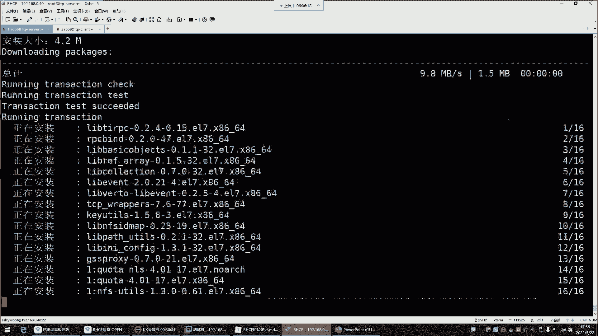
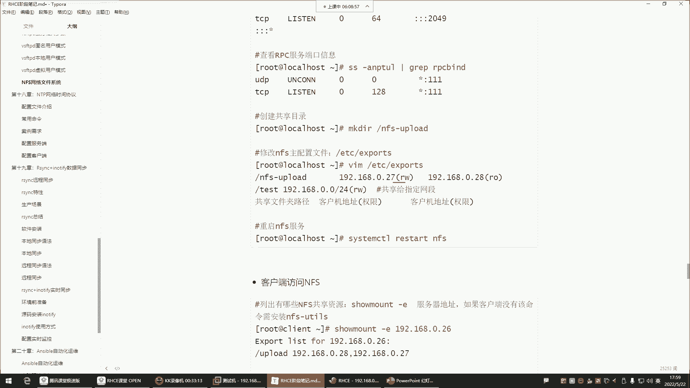

# Linux运维培训教程超全合集，通俗易懂，适合小白，带你从入门到精通1 - P58：红帽RHCE-22.vsftpd本地用户访问模式、NFS网络附加存储 - 洋洋得IE - BV1qX4y177j1

啊，喂喂喂好。那咱们接下来呢。讲什么呢？接下来我们这个前面是给大家讲的是什么呢？叫做。😊，匿名用户哈，我们前面是VSFTPD的匿名用户的模式。那匿名用户呢就是比较宽泛一些。

就是谁都可以使用那个匿名方式去访问这个服务器。但是有的企业呢他可能说哎呀我们需要做一个本地用户，就只允许这些用户去访问，那怎么办呢？那他就不开启匿名用户了，他一般呢就让你把匿名用户给他禁掉，怎么进呢？

就是打开他的配置键ETC。😊。

VSFTBDVSFTPD点com把这个注释掉就可以了。把这个哈。😊，看到了吗？这个这默认不是匿名账号的访问吗？注释掉就可以了。注掉。或者说你不注视，给它改成no。No。然后。其实你不能注释。

因为注释默认就是匿名。😡，给大家说一下哈，这位置尽量别注事，他这里面说了。😊，嗯。他说注意，如果你注释掉他默认是允许的。看到了吗？所以别注释。如果说你不希望匿名用户访问这位置改成no。

不然你会发现我注释了，为什么匿名还可以访问呢？其实它默认就是允许的，能理解吧？所以这位置哎改成no，然后重启服务。😊，那这边你这时候它再敲命令就完了啊，退出X的再连。40S开到吗？

这就是匿名用户现在就连就已经连不上去了，连不上去了哈。😊，啊，这叫怎么进用这种匿名用户模式，那它只能退出。OK所以有的企他说哎呀，咱们别什么呢，别这个用匿名了，觉得这个匿名啊这个太宽泛了。

我们就是只允许哪些用户访问，咱们呢就用这种本地用户来实现就行了。我希望哪个账号访问，咱们就给他建个账号就可以。所以这种就比如说拿FTP这个账号来讲。你比如说。😊。

我们希望FTP这个账号这个可以去访我的服务器。那咱们就在本地给他建个账号，然后让其他的人去使用这个账号去访问也可以吗？其实也可以。

可以哈，那这时候呢我们账号是不是借了呀？IDFTP。😊，us色用户建好了。那接下来呢我们就得说说那其他的人怎么使用这个FTP user色去访问呢？一样LFTP指定用户名。😊，杠U用户名是LFTP。

或者是FTPus色。好，然后接下来呢。指定IP地址192。168。0。40回车。口令口令是谁呢？就是这个账号的密码。这个账号在服务端的密码是多少，你得输入密码一推车，这就连上来了。L拉4。哎。

阿莱斯怎么什么都没有呢？😊，阿莱斯看了吗？这怎么什么都没有呢？😊，我告诉你哈，他为什么什么都没有哈，你要知道他连上去以后，他跑哪去了呢？😊，他量去以后，他是跑到了根下的。home下的FTPus目录了。

你看这目录有数据吗？没有，所以他在这边啥也看不到，啥也看不到哈。所以说由此可见，对于这个FTP来讲，你就算是本地我们用的是本地用户去访问，然后输入这个用户名跟密码。那你知道那我们连上去以后进到哪了吗？

进到了这个用户在这个服务器的那个他的家目录了。😊。

那如果现在我们去这个。他在加盟中给他建个文件，你看我们现在。去了加目录建一个，比如说建一个什么呢？建一个hello。好，那这时候他再看。你看就能看到这个hello文件了。是这样子的哈。

所以本地用户他也一样，都是进到了他的加目录。你用谁登录的就进到了谁的加目录了。你想给他共享什么东西，就把数据放到他的加目就行了。那这时候FTPus色就可以get下载了，下载hello文件到本地。😊。

下载了吗？看一下。看到吗？hello文件下载下来了。😊，能领了吧啊，这就是本地用户。那本地用户来讲。那你说我们如果希望他具备一些权限的话，那怎么办呢？那这个权限。

本地用户的配在本地用户在配置文件里面，它的相关参数就比较多一些。但这些的话呢。大体来讲。呃，你甭管是什么用户，我还是那句话，就是他跟这种匿名用户啊，你说他能差在哪啊，差不了哪儿。

本地用户我们也是希望他干嘛呀？就说白了默认权限。就是只可以进行。下载跟查看。

那默认情况下，他想上传可不可以呢？哎，我们可以看一下哈。😊，P。诶。可以。看到了吗？他想创建makeDR太s哎，可以。他想改名等等一系列的东西，他都能操作，想删除。山竹hello。回车。

你看那为什么本地用户的权限怎么这么放肆呢？😡，对本地用户房子是自己资源。那你发现为什么他这么放肆呢？😡，啊，你看他配文件就行了。首先我们要知道，你想想本地用户，他首先就是在自己家里面做的操作。没错吧。

你看他的你看本地用户他是进到自己家了，他自己家的目录，你这个权限是不是就不需要去做额外的改动了呀？😊，本身。这个加目录就是他自己的，他自己的权限就是RWX是不是啊？目录权限默认人家具备了。

那还有一个就是配文件的权限。😊，那这个配置文件的权限。😊，那我们也没给啊。😡，这个不用你给。啊，在这个文件里边。叫取消注释，已允许本地用户登录。那这个注释取消了吗？取消了呀，默认就没有注释。

所以这就locco代表本地的意思，以内部就是启用本地启用，就是现在默认就是。啊哈当SC04强制检查时啊，它已经提示了说这个S0可能说会影响。强SC04如果强制检查时，可能说。好，当S104强制模式下。

它会检查什么呢？它的FTP的home的加目录。所以给它关掉就行了哈。😊，所以默认本地用户就已经开启了。开启以后的话呢，那本地用户的权限。取消注释已启用任何形式的FTP斜面令。这个权限是针对于本地用户的。

被个哈。wite enable等于意思，就是写权限。为什么它可以具备什么创建修改删除的操作？是因为默认本地用户就具备这种w写写的权限。啊，然后这是权限的掩码，这个掩码的话。

就跟我们前面讲那个U mask是没啥区别的。U mask掩码。目录的言吧有。musask回车啊，什么0022002什么意思啊？就代表。对于所有者来讲，他的特殊权限没有去除。是不是啊？然后呢。

这第一个是特殊权限，第二是所有者的权限，没有做任何的去除。然后这个呢是搜出组权限去二去二是哪个呀？二不就是那个W吗？写权限。啊，这个也是其他人也去到了一个二权限，这个作为了解就行哈。

这个you must。😊，不用去动它。然后其他的。还有哪些呢？在这个配置文件里面，对于本地用户来讲哈，本本地用户他它有个特点，什么特点呢？他量了以后啊，他可以随便看。😊，2莱斯跟你看。对，本地用户啊。

他就是这样不好，就是他可以在这个系统里面随便的进行一个叫什么呢？叫做游走。比如他现在看到了跟目录有这么多的目录是吧，他想切换可不可以呢？可以，你看他可以直接CD到任何一个目录CD到哪儿呢？OPT。😊。

你看他现在就已经在OPT目录了，是不是跟下的OPT他想切换到哪儿呢？他看OPT有数据啊，他想切换到ETC你看他就在ETC他可以看ETC下的所有内容。😊，哎，他想看什么事？现在没有控制他的。

现在是不受控制哈。😊，所以对于这种情况下呢，你说我们希望他这样吗？如果真的是用本地如果真的是开启这种本地用户模式，我们还真不希望他这样。不希望。为什么不需要呢？因为对于这种情况。如果是本地用户。

我希望他的活动范围是哪是哪儿，是不是就有他自己的家呀，自己的家目录是不是啊啊，所以我们可以干嘛呢？就是对，可以控制它的活动范围哈。如果你想控制控制它的活动范围，在配置文件里面有叫抻入它。

抻入它抻入它就是切根的意思。😊。

掺入它是切根。

切根哈。这条命令可能大家没有玩过。沉入的对命令哈，我给你们建个目录，makeDR随便建一个，再跟一下建一个。嗯，apple建一个app load目录。煎以后抻至root。ROOT指定。陈入他哎。

衬 rootot。

嗯。

这怎么用不了呢？fair command失败了，没有这个命令，命令只能失败啊，没有这个目录。啊，我先C到CD到这个upload里边啊。沉入他们。指定跟写的。怕不怕漏的。哎。这命令好久不用了哈，算了。

不玩了。这命令哈好久不用了，它切根啊，它可以把你的根给改变了。正常态下我们的根目录是不是不是这个斜线呢？呃，但嵌入的可以改变一个用户的根目录的。😊，而且成而这个就是他一旦改变了跟目录了。

就是你进到系统以后。你你的根。的范围就是在根下边，随以说抻入它，我们也可以改变那些普通用户的家。或者说它的根目录，它的根目录我如果说就是最大给它给它扩限到哪里呢？最大我也得宽限到它的加目录。

那他最多只能看自己加目录的下面的内容。就像我们在系统里边，我们的根目录是这根斜线，那我们能看的东西只是这根根目录下的所有内容，是不是？那如果我把用户的加目录，我给它局限到哪呢？

就它自己的加目录home下的FTBus。😊，那是不是就等于说他以后再看只能看自己加目录下的那些内容了呀，而他加目录以上的那些目录，他能看吗？他不能看了。是不是啊啊，就你的活动范围只在你的加目录下边。

所以称着root是可以改变它的根目录的。嗯。咱这命令好久没用了，但是正常来讲，就那样切没有没没有任何问题，不知道为啥切不了了。😡，OK那接来呢咱们就。😊，来说说哈这个衬root。

我怎么控制它的活动范围？在里边呢就是是否允许本地用户切换目录。yes是不允许no是允许，就等于说哎它允不允许，就是控制它活动范围了，沉入它在下边。

在多少行呢？搜索一下哈。这呢。看到吗？这哈然后。😊，啊。好，来看一眼。现在呢这个。衬 root，然后local user说白了就是限制它本地的什么呢？一个。

活动范围在这里边你给它注释取消就行了。把注释取消哈，就是是否允许本地用户切换目录。yes是不允许，它本身不就是yes吗？yes就是不允许他切换目录了，但是呢它是被注释了，所以你把注释删掉就行了，删掉。

哎，删错了哈，删井号，然后保存退出。😊。

重启服务。好，重启服务以后，这边。他刚刚还能无限的游走是吧？现在拉4拉4跟不行，它得退出，再重新登录。啊，他这是再重新登录L拉4。哎，不行。你发现他又出提示了，他说什么。😡，嗯。

拒绝chroot中使用可可写跟运行，什么意思呢？这个提示可能说。呃，你一旦是就是限制了用户的活动范围了。那就说他的活动范围里面是不允许他具备那个写权限的。就他在他的那个。

这个根目录是不应该让他具备这种写权限。那这个权限得从哪看呢？你得看它的加目录，你看。home下加个杠D哈。home下，然后FTPus色。默认情况下，FTP它对这个目录是具备写权限的。

所以说他说你如果一旦是让它的活动范围，它的根变成了这个目录的那这个目录是不应该让他拥有写权限。😊，🎼那怎么办呢？哎，你把权写全给它去掉就行了，就是是U减W。对这个目录剪完以后的话呢。这时候他再敲面定。

哎，你看就可以了，看到了吧。这里面都是权限把控的非常的严格，而且很多东西都是让你摸不着头脑。所以你看很多事情，如果你自己去看这种报错，你可能说哎呦，这为什么会出现这样的报错呀？你说白了你就是。😡。

你把头发薅没了，你都想不到啊，原来是不让他对自己的家目录拥有写权限。看到了吧？是不是很奇葩，那你说不让他拥有血权限，那这玩意儿怎么玩啊？😡，其实他就跟我们前面所说的那个。

下的FTP这个共享目录其实是一个道理。为什么我前面并没有说直接让这个FTP的账号具备对FTP这个共享目录拥有这种写权限呢？你一旦让他拥有血权了，FTB0呢也是这也是刚刚的效果。😡。

也是就直接告诉你登就直接登录失败了。😡，所以说FTP呢它的这个限制就是任何的账号。都不让他对他的一个什么呢？加目录具备这种W权限。所以你看对于Y下FTP，你也不能干嘛呢？你也不能直接。给他写权限。

刚地行。root写权限没事，但是FTB是不能用写权限的。所以说那他这种特点就是什么呢？就是你还是如果希望那个匿名用户具备一定的权限，你就进到这个目录，再给他建一个共享目录就行了。能解吧。

比如说给它建一个makeDIR建一个什么呢？建一个uple load。啊，或者QB。PUB就是public的意思。PUBplic LIC。public建好以后，这个目录谁建的就属于谁。那不行啊。啊。

我CD到那个哎建哪去了啊，阿拉乐杠D。错了是吧，名字错了，改个名。这玩意儿谁谁建的就属于谁，但是属于root不行啊，属于root。那你到时候我们用FTP这个账号，你连进去。😊，他也没权限，你登上去。

🎼密码EL，你给他搞一个pub link这个目录，那他进到这个目录，他也没权限呢，是吧？他想建文件，比如makeDRR建目录，或者说呃他想做一些上传的时候put的时候。他也没权限，没有创建的权限。

那这个权限你发现哎，这怎么跟前边的那个SElin一模一样啊，不允许创建是吧？是因为这个。他是属于root的，所以他没权限。然后这时候呢，你再把这个目录它的归属关系改成FTP优侧就行了。

所以这时候称至own。FTP。优瑟FTP优er。回车。这样就可以了。这时候他就对这个目录是具备一个所有者的权限，具备所有者权限。那他就现在在这儿。想创建就可以了，上传啊，这样可以看到了吗？这样可以的。

想建目录makeDR建一个叉叉叉叉叉也都可以，看到吗？想删叉叉叉叉也可以都可以。🎼所以在这里边是什们？在这里边就是你要明白他这个本地用户最终注意事项就是。

你想限制它的活动范围，就把它的嵌入它干嘛呢？给它开启。啊，这样一开启的话，就他就不允许他什么呢？不允许他来回的切换，来回的游走了。但是呢你一旦把称入的开启了。那他首次连接。或者说你如果开启以后。

他对自己的加目录，他一旦具备写权限，那也不行。也不行。所以呢把它的加目录显项先给它去掉，然后呢再去干嘛呢？哎再去给他单独建一个共享目录，让他们去做一些操作。这样才可以。那剩下就什么呢？

剩下就跟那种这个我们所说的这个匿名用户其实就差不多了。

差不多了。后期项限任他的权限。你就可以在这个。配置文件里面去控制它。一旦掺入它了是啊？啊，剩下你控制什么权限，那你就比如说我不希望他具备写权限是吧，把显限给他注理掉。不让他就被写权限。改名。

ABC点SH看到吧？没有权限了，删除。删了吗？没有。建不住呢。斯没有看到了吧？就是你想控你想控制这些匿名账号的权限。就直接就改一个配置就行，就这个。Wite。以那不懂意思。但是他能下摆吗？能啊。

他能下载哈，因为我们并没有并没有控制它下载，你想他都能查看，他可能能下载。所以这边呢你把这个把本地的这文件删掉，你再看看它能不能给它下载下来。😊，啊，ge。啊，下载没有问题。下载哈，这是可以的。

删了又有了是吧，下载下来了。能列了吧，这是本地用户哈。所以本地用户如果你想开启的话，你得知道怎么限制它。😊。

在里边是否允许本地用户拥用写权限？如果你不希望的具备，就像匿名用户一样，我就允许你看，允许你下载，那是不是就把这个给它注释掉啊？其他没什么了。

其他就是配其他的就是这个配置文件里面一些这个呃一些什么毫无相关的一些内容。这个啊啊还有一些这个黑名单，黑名单跟白名单，黑名单白名单的话，这个一般用不到。用不到哈，为什么用不到呢？因为对于这个FTP来讲。

就是你允许谁访问，你就给人去建账号就行了。如果你说你不允许他访问，你这个账号直接删掉就行。所以一般用不到这个黑白名单。

所以这个大家注意了解一下啊，它哪个是黑白名单呢？在它的。😊，ETCVSFTBD这个路径。这个是它的黑名单文件，你只要是把账号写到这个文件里边了，这账号就不能访问了。所以你看这文件里面都有谁呢？😊。

第一个就root。哈是不允许root访问的哈。😊，下边就是一些系统账号了。都不能他们都不能访问。为什么root不让访问呢？因为root权限太大了。入的弦有点大。大家不允许通过FTP登录的用户看到吗？

就这个就全全都在这里边，不让你登录。不允许通过FTP登录的用户。这是黑名单文件。那需要动吗？不用动，还有一个uslist。us势list。这个文件。看。他。只允许此文件中的用户访问。啊。

永远不允许用户进入这个文件。什么意思呢？就这个文件我告诉你。😡，他呢可是。可以既当黑名单，又可以当白名单使用的一个文件。

如果说这个文件你想让它当什么呢？

我想让他当黑名单，那也是说在这个文件里的账号。在这个文件里的账号就不能访问了，那这个文件就变成黑名单了。那怎么样才能让它变成黑名单呢？就是让你去把这个参数写到配置文件里面。

这个参数复制粘贴到配置文件里面。看了吗？比如说我希望那个user list文件是黑名单文件。那。

你要在配置文件里边启用它。他里面并没有告诉你怎么启用。

但是呢我这笔记里边，到时候你把这个us list的以内部等yes给它开启。啊，不是这个配置文件里面就有这个参数哈，默认就有VM。😊。

ETCVVSFTPDVSFTP点儿com。拉到最后。看了吗？user list以内不等于y思这个文件默认就开启了，默认已经开启了。但是这文件开启以后，那这文件到底是黑名单还是白名单，你得自己指定。

我希望它是。😊，这个us色里 denyy等于no。

那他到底是什么名单呢？如果说底net得弄，就是。叫拒绝这个文件中的用户登录，那它就变成黑名单了。注意哈，如果这个us色 list的 denyy等于no。啊，又意思是拒绝哈no是允许no变成白名词人了。

所以这里边。一旦名の no。告诉你，这样只允许此文件中的用户访问。如果变成y呢，变成y，就是永远不允许这个文件中的用户访问。所以如果你希望这个文件变成黑名字2，那就把这个放放进去，把这个删掉。

🎼但是有那个必要吗？没啥必要，能理吧，没有必要，因为他因为它已经有一个黑名单文件了，所以你就不用再去多此一举了，就不用这个就不用去指定这个名单，到底是黑名单还是白名单了，能理解吧？所以这个就不用动。

所以这玩意儿一般也不用配它，你知道一下就行。啊，然后剩下就是配配剩下就是这个配置软件里面一些哎可可有可无的大家作为了解的参数就行了。其他没啥。呃，然后下边这个是NFS嗯，NFS这个内容的话呢，我们。啊。

可以直接就绍给他讲了吧啊。嗯，NFS这个它跟FTP哈啊，先等一下，我问一下你们啊，就是对于我们前面的FTP这个内容有没有什么疑问嗯？没有疑问的，给我刷波一，我们讲NFS。有疑问吗？你问。动木了是吧。

马上结束了哈。对。😊，嗯。FTP的话呢，你们只需要不，我跟你们讲哈。😊，对FTP现在你们只需要知道它是一个文件共享服务就行了。我们可以使用FTP给企业里面搭建一台文件共享服务器。你到企业里边。

因为很多企业它已经有这个服务器了，就不用你搭建了。如果没有的话，那很多企业说啊咱们不用这东西，我们可以用其他方法，那没关系。那这东西也不用你搭建。但如果真的有一天你到企业里边。

人家说咱们就需要一台自建的FTP服务器。那这个你就得知道哎，你可以用哪些软件去搭建它，就没有说非得让你现在必须把它给掌握了。因为这东西你即便现在掌握了，你时间长不用，你也记不住。😊，能理解吧。

你现在主要是知道有这个东西就行，这个东西能帮你实现什么功能，这是主要的哈。不是说让你现在必须得这个拼了命的把它给学会，不是哈。😊，对，忘是很正常哈，你什么东西你学一遍，你你包括你学两遍，你也记不住啊。

是不是啊？所以就现在是了解这个行业里边有这个技术能干嘛就可以。然后下边NFS网络文件系统。嗯，NFS呢。我看看啊。啊NFS我们快哈，我估计10分钟能讲完。那NFS呢，它跟FTP也差不多。N啊这个NFS。

他也是做文件共享的，注意哈，你看它主要的功能就是文件共享服务FTP也一样。都差不多。只不过N啊这个只不过这个NFS呢，它主要应用场景用用在哪儿呢？用在数据备份方向，数据备份领域比较喜欢用NFS。

FTP呢用于做文件共享，但是FTP也可以做文件备份，只不过呢大家比较喜欢用NFS。因为N因为NF做数据备份非常简单。FDP呢它有点麻烦，权限比较多。所以这时候呢我们对于NF来讲呢，它主要是应用在什么呢？

在数据备份领域概念性的东西没有什么太多可介绍的啊，噼里啪啪搞搞这么一大堆概念没用。咱们就说这东西它怎么用端口呢，大家也不用去管它，也不用去配它，也不用改它。首先软件包呢系统自带的叫NFS啊。

UT服务名就叫NFS这个包的话系统有没有呢？你看一眼包名。

这包如果没有，你自己安一下。我还是拿了个机器。来给大家演示。像这种就是搭件类型的技术。就是你上去就得配，然后再了解它的一些原理，这种东西没有必要去太多搞它的理论，你上去开整就行。你搞废话一大堆。

搞那个理搞那些理论没用。上来呢看包。NFS杠。🎼UT有吗？没有没有就安一个。

按完以后起服务，它的服务名就叫NFS。看状态。让进了好。

那接下来呢。这玩意儿怎么用啊啊，端口的话呢，你也不用改端口2049，然后还有一个叫RPCRPC这个东西呢，大家简单了解一下叫做什么呢？RPC这玩意儿叫做。哎，RPC叫过程调用机制啊。

叫远远程的过程调用机制。这玩意儿就是帮NFS去什么呢？去传输数据的。他们两个关系你就这样理解就行了。NFS本身不具备数据，它本身不具备数据传输能力，它只能帮你去存储文件。只能帮你存储文件。

而RPC呢是帮你实现远程的存取的。他们两个一个是存，一个是帮你存文件，一个是呢帮你做文件之间的一个传输。他们两个是这个什么呢？你只要把NF安装好，那RPC也有了。所以你到时候你过虑RPC的时候。

它包名叫RPC半的。

PM杠Q嗯RPC。🎼的看到吗？这就自带了哈，自带了，所以它的端口是111，它的端口是111，到时候你可以自己去过滤看一看。然后接下来呢怎么用呢？直接创建目录就行了，创建个共享目录。

make DRR跟一下创建一个比如NF4下划线apple loadapple lOAD回车建好了，建好以后就直接打开，就直接干嘛呢？把共享的文件放到这个目录就行了。😊。

或者你不用放文件也行，你就直接把目录共享给别人，别人就可以用了。怎么共享呢？找它的配置文件ETCEXport4，这是它的配文件。打开以后你就可以共享了，怎么共享指定本地跟下的NFS。😊，U漏的。好。

共享给谁，共享给哪个机器，192点168点0点多少？呃，那是10。这个机器地址。是10哈10啊吧？啊，也就是说我要把我本地的这个文件夹共享给这台主机，让他可以去用存储数据。

所以说NF为什么它因为在数据备份的领域呢？因为非常简单呢。😊，看，那我把这个文件夹共享给他他的权限是什么权限？在这里边。😊。

要加一个什么呢？加一个。RW代表读写权限。

🎼好啊，在里面就加一个小括号指定权限那RW独野权限。我希望它具备一个独野权限，然后保存退出好了。这就把自己本地的文件夹共享给别人了。这个。那这时候你发现它有点像windows的共享文件夹。干嘛呢？

把我本机的一个文件夹干嘛呀共享给别人。😡，这个文件夹是我电脑里边的，能理解吧？是我电脑里边的文件夹。那我把我的文件夹共享给别人了，那别人干嘛呀？可以往我的文件夹里面存储数据。😡，知道吧？

那他把数据存到我的文件夹了，占用的是我这个机器里的存储空间。😡，而并没有占用他的存储空间。知道吧？这就叫什么呢？这叫。网络附加存储。网络附加存储就像那百度网盘一样。你把数据存到百度网盘了。

那占用的是你电脑空间吗？不是是不是啊？这不就是网络附加存储吗？啊，额外附加的附加到哪儿呢？附加在网络当中，只要你能联网，只要你能够跟我这个服务器能够连通，我你就可以用我给你共享的这个文件夹。

那这时候他比如说这个机器他想要去干嘛，想要使用那个文件夹。🎼那怎么用呢？这时候用命令叫smount杠E。🎼看啊，没有调交命令，没有命令就安一个包y杠Y。

因此到安NFS杠UTlistUTIL安这个包只是为了获取这个命令，不用起服务，能理解吧，不用起服务啊，只是为了获取那个命令而已。

好，获取到命令之后，你看你把这个包安上以后，什么RPC办的这里面都有了。🎼好，然后包括那个管理命令也都有了。这些的话呢，你现在就可以这样叫showmount杠E指定。192。168。0。40，你指定谁。

就是看谁给你共享的那个什么呢？文件夹。啊，list的列出吗？so mount杠E1。2。18。0。40是这样玩的呀。

啊。

是我没有起伏吗？不是。瑞taNFS。这边。s mount杠1192。168。0。40啊，看到了哈，没起户杠。没有重启服务，这时候看哈硕磨套杠一也就是列出这个机器给我共享的什么呢？可挂载的那些文件夹。

注意NFS它是可以直接把这个文件夹挂载到自己本地的。这有点给力了哈，挂的到本地就等于。😊，🎼像使用自己本地的目录一样，就这么方便。所以它用于数据备份比较什么呢？比较方便一些，就直接干嘛呢？

看就直接挂载mon它。🎼mount挂载谁呀？挂载1922点168。0。40啊，当然你得先去准备一个目录哈，mDR咱们在OPT再建一个目录啊，尽量建同名的目录NF。嗯，后边直接再跟下键吧。

makeDR跟下键一个Nipad4。叫apple load。好，然后再过来mountt。192见同门的目录是不是见面之翼啊啊，就是目录，你不一定非得叫他名字，但为了见名之意啊。

192点168点0点多少呢啊点0。40。😊，我要挂载它的哪个目录，它下边的那个NF4，然后appleroot目录到我本地的跟下的这个目录回车。挂了了吧，挂了以后DF杠H看一下。我现在就一个远端的什么呢？

远端的挂载。看到吗？我是把这个地址的这个目录挂载到我的本机了，那挂载到我自己本机以后，那以后我往这个目录里面存数据，我问一下。这个数据是占用我的本地的存储空间吗？不是。你把数据往这儿存。

间接性的就是放到了这个服务器的这个目录里。而你本地是不会占用存储空间的。所以为什么NFS比较适合做数据备份呢？它方便呢？你在企业里面做备份，搞一台NF服务器是吧？然后呢，直接安个包，然后呢创建个文件夹。

然后再给这个文件夹单独挂载个分区。挂载个分区以后，这个文件夹就可以共享给别人了。共享给你的那些其他服务器，其他服务器把那个文件夹挂载到自己本机。挂载本机以后，它往这个目录里面存储数据。

这个数据就等于是存在远端的NF服务器了。你本地是不会占用存储空间的。不挂载跟挂载使用有什么区别？你不挂载，你用不了啊，你不挂载，你只能看呢。😡，你不挂单，你数据存不进去啊。😡，能理吧。你得挂得到本地。

你才能干嘛呢？才能往里面存呢。😊，对不挂载载用这功能啊，重启还有吗？重启没了，但是得开机挂载哈，ETCF4table。😊，开机中挂载开机中挂载怎么写啊？一样，1922点。68点儿。🎼0。

40下的NF4Sup load挂在到我本地的根下的NFS，然后下划线uple load。文件系统就是NFS，然后。呃，挂载参数是吧，default。defa，但是不要忘了后面再加一个点，叫net。

DVnetDV。是在的第一位我忘了哈。

嗯，啊这个哈叫net第一为下划线啊下划线。🎼下划线netDV，然后00这个netDV是什么意思呢？net DV代表这是这个我我的这个挂载是一个网络设备。就这个设备是网络设备。就是告诉告诉我这个机器。

这个东西它并没有在我的本地。为什么要告诉他并没有在本地呢？因为对于这种网络的这种文件系统挂载。你要明白，如果这个机器它关机的话怎么办呢？如果这个机器关机，你这个挂载就失败了，是不是啊？

这个机器关机文件夹你是不是就看不到了呀，就直接挂载不上了哈。那如果说挂载不上，那对这个开机文件的话，这是一个什么呢？就是你系统一开机系统呢它会检测这个文件，帮你把根分区不分区挂上。😊，好。

那但是他检测到这个位置的时候，如果说远端的NFS没有开机，那这步挂载失败的话，挂载失败我告诉你这个系统就一直卡在这了。就起不来了。即便是起来，他也是那种什么呢？不太正常的那种状态。

所以对于这种网络设备挂载没关系，他如果说他挂载的时候发现挂载不上，他可以给他什么呢跳过去。跳过去系统正常进入启动流程。不影响，所以要加一个叫netDV后边是不是都一样啊，没什么区别了吧。

然后你这样你mountt杠A看一下语法没毛病。🎼OK然后那其他的话呢，我们得说说，那现在文件夹都挂载到我的本地了，是不是啊NF upload我现在进的这个目录NF upload我进来以后。

我就可以在里边去。😊，说白了把我想备份的文件放到这个目录了呀。比如说CP把ETC把。怎么呢把我ETC下的pasWD文件拷贝到我的当前。8。对，有点问题有点问题哈。你看这怎么说什么无法创建普通文件。

什么权限不够是吧？😡，嗯，这也可以理解。😊，为什么可以理解呢？因为这个文件夹。你挂载的是远端的。这个文件系统是在远端。所以这权限的话呢。这个权限。默认情况下NF4，你说那我用root建的还不行吗？

我告诉你默认NF4是不允许root去什么呢？去访问它的，也不允许root去使用它。最主要是不允许入它去使用它。所以我现在建的文件。提示权限不够，你要明白，并不是以root的身份在往这个数据里面存储。

而是1与而是以这个服务器里边有一个账号叫NFS。再什么呢？在存储数据。看了吗？有一个NFS nobody。这个用户就是给NFS准备的。但是这个用户对于共享目录有权限吗？没有。

但是NI但是呢NFS是可以允许用户去访问的。或者说允许用户去使用它。所以我们一般如果是root使用，一般怎么配呢？如果是root使用的话，我们一般就是把root权限给它打开。所以你在共享文件夹的时候。

在ETCX。port文件里边。这个里边还要加一个。权限逗号什么呢？

啊，把这个写进去叫做no rootcra。

这个no rootot快事。是什么意思呢？就是。不挤压root的权限，否则root权限是受阻碍的，能理解吧。然后保存退出重启服务。好，重启以后，那这个时候root在里边，我再拷贝回车，你看就可以了。

那这个文件你看远端有没有远端的跟下的NX upload是不是有？那这是root是吧？那如果系统里边我其他的用户呢，普通用户呢？假设哈如果是有普通用户呢，比如说泰斯用户。😊，那如果是ts用户。

他想使用那个NF这个什么呢？就是想往这个里面存储出去可以吗？也可以。对建个文件叫探测点KT。但他们的权限不够。他权限不够怎么办呢？他也是以远端的这个NFS这个用户身份再访问。那也不行，没权限。😡。

所以没权限呢，如果真是希望有这种普通用户的话。我们一般就得干嘛呢？就得它有个要求，你说我能不能把这个共享目录的权限给它改成这个叫NF nobody啊？或者我直接把这个权给它开放一点，我们试试哈。😊。

看根目录称着木的，我们这样777可不可以？跟一下的NF4 uploadload。啊，这样可以。这样可以，因为你一旦777了，那你想想是不是那他也可以了。这种也可以哈这种可以这种就比较简单的操作。

毕竟是备份。这样就可以了。但其实还有一这种比较麻烦的，比较麻烦的话呢，你得搞ACL权限。内容就太麻烦了。那种没有必要了就。

O。这就可以了，这就是在企业里边NFS这玩意儿咋咋用啊，备份非常非常简单。你们看看我我给你们演示了N这个NFS，我是不是就安个包起个服务？😊。

建个文件夹，然后呢在配在配置文件里边把这个文件夹共享出去了。是不是啊共享出以后呢，这帮人别的机器就可以干嘛呢？就可以挂载我的文件夹到他的本地，然后往里面存数据了，这么简单。哼。没啥了。

NFS。然后Nip呢，它这种网络附加存储跟FTP都一样。这种网络附加存储。有伤吧。FTB还有NFS这种都是网络附加存储，也都支持跨平台，就是windows跟linux之间都可以用跨平台。

这种我们称之为叫做nas存储。nas统称为网络附加存储。注意，nas不是一个软件，nas是在这个存储模型里面的一种什么呢？一种存储方式。

只不过这种方式我们可以通过s巴这个软件来实现FTP这个软件来实现NF这个软件来实现。所以它的特点就是什么呢？就是。😊，他们都是文他们都是文件夹的共享服务，把自己本地的文件夹共享给别人了。

而还有一种存储叫做大s。这种大肆存储叫直连存储。直连存储比好理解。就比如说我们附加在电脑的那个硬盘，或者说你直接插在你电脑的USB机，你直接插在你电脑的那个USB接口的那个什么呢移动硬盘。

U盘都属于直连存储。这比较好理解是吧？还有叫散存储，散存储是怎么存储的呢？啊，比较典型的叫s。sep存储。啊，还有叫scarysy怎么拼，我忘了哈SCICS好像是scary。忘了哈，好像是SISCsy。

啊，忘了这种是可以实现干嘛呢？叫块级别的存储。什么意思呢？你那前面NFS是不是把自己的文把自己的文件夹。共享出去了呀。而这个散存储像s跟saxy这种直接把自己的本地的硬盘。共享给别人。

别人直接使用它的硬盘。直接去什么呢？格式化，就把自己电脑的硬盘共享给别人了，别人直接挂载他的硬盘，挂载它的硬盘，就像在使用自己本地的硬盘一样。只不过这个数据是存储在远端的存储服务器了。

这种就网络常见的这种三种存储模型，nas大s还有s。但是最终你想要去使用这种方法去实现的话，要学习具体的技术。比如说我们学的这像什么哎这个FTP跟NFS都属于nas存储里边的一种实现方式。

那后期像s存储，s存储这种就是通过sep scar之类的，都可以实现s的存储，就是把自己的硬盘共享给别人。大s呢大s这种存储，就是你买你买硬盘直接怼到电脑那边就行了，这没什么技术含量。😡，呵呵。😊。

这存储哈存储。好了，我们今天是终于这个。😊，啊，没少讲是吧？我们今天一直讲到这儿。😊，讲到这儿行了，下节课我们就争争取把这样都差不多了，一节课啊能讲完。好，然后看看还有没有什么问题啊。嗯，没有什么问题。

今天就给大家这个讲到这儿吧，好吧，需要好几天消化是吗？嗯。正常正常哈可以理解。那没有问题，录屏听到了哈，录屏给大家关掉。😊。

