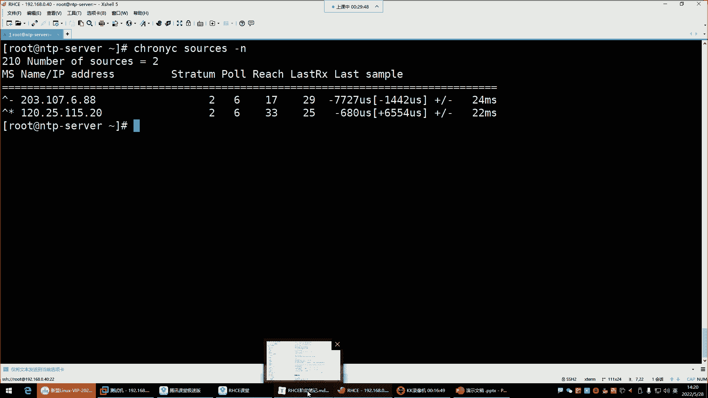
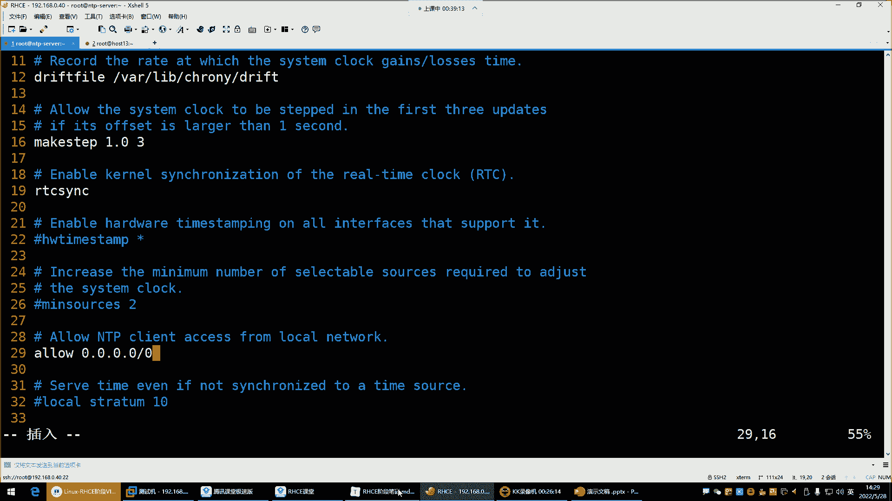

# Linux运维培训教程超全合集，通俗易懂，适合小白，带你从入门到精通1 - P59：红帽RHCE-23.NTP时间同步 - 洋洋得IE - BV1qX4y177j1

喂喂喂，好，录屏也OK那接下来咱们就正式开始发车了。我们今天呢是IGCE我准备要给它结束的一天。那我们今天这节课呢讲的内容呢可以说是也是这个非常的多。呃，而且呢也是大家今后在工作中。

你是必须会用到的一些内容了。所以这个大家好好听哈，这节课前面的一些基础命令，那个的话呢慢慢敲慢慢练这个位置呢就是你到工作里面，你可能会接触。那什么呢？就是这个NTP网络时间协议。😊。

这个NTP啊也是今后大家在学习这个集群管理的时候，你们也会什么呢？也会接触到这个NTP他是干什么的呢？看哈NTP。等一下哈。好，来看NTP。NTP呢我们直接说中文哈叫做网络的时间协议。

那这个网络时间协议它是实现一个叫做时间同步的。啊，我们说说为什么要做这种时间同步哈因为下边这些东西太官方了，我们呢就不去啰嗦的了哈，这种东西有点不太好理解。咱们就说说为什么要用NTP去做这种时间同步。

还有这个时间同步给谁去同步。好，那。😊。

现在企业环境是什么环境呢？叫做集群环境。那在企业的集群环境下边，我现在有一群机器。

这一群服务器啊是提供什么呢？提供我们公司的一个网站的啊，有这一群几十台上百台。右边这群服务器呢是提供数据库业务的。好，也是几十台上百台。那我们现在来看一下，那这么一群服务器。

你如果想要让他能够在一起协同工作。啊，集群集群就是一群机器组成的群体，然后呢同时去对外提供你们公司的网站这个服务。好，那这一群机器，你想让它能够协同的工作，一起去干活。那前提是什么呢？

就是得保证每个机器的时间，他们得是一样的你不能说我这个机器的时间活在2018年这个机器的时间活在2019年，这个机器的时间活在2022年，那你说他们每台机器它都不活在同一个时间段，他们怎么干活啊。

是不是啊？哎就没有办法去同时的去协同工作了，所以我们要干嘛呢？保证每个服务器的时间都得是一个叫做标准的时间。那我们怎么样才能让它保证是在标准的时间。内呢啊或者说处于一个标准时间呢。

那最好的方法不是我们手动的去给它通过date命令去配时间，能理解吧？你手动配的时间是不准确的。

好，那这个NTP就可以帮我们实践实现什么？叫做时间的自动同步。这个自动同步哈，这个自动同步就是我们去找一个服务器，这个服务器呢就是NTP的服务器，就这个服务器里边有1个NTP这么一个服务。

然后这个服务呢，它可以让你去同步时间，或者说它给你提供一个标准的时间，那这个就比较好理解了。哎NTP它本身是给你提供一个标准的时间。然后呢，我们干嘛呀？哎我们让我们自己的服务器啊去跟这个服务器去同步。

就是你的这个NTP给我提供什么样的时间，那我的服务器就处于一个什么样的时间，这个比较好理解了吧。哎，那也说只要是说我的每台我的每台机器。😊，的时间都去跟你去同步的话。

那这样的好处是不是每台服务器他们的时间就都保持一致了呀？那这样的话，他们是不是就都活在同一个时间点了呀，就可以去同时去协同工作了。而且像这种好处是什么呢？

像这种的好处就是NTP这个服务器它的时间是非常非常准确的。😊，它准确到什么地步呢？据说哈。好几百年都不会差一秒的，就准确到这种地步。所以说我们在企业里边跟他去同步时间，呃，比你手动配的要强。好。

那接下来呢咱们就说说NTP我们怎么去同步别人的时间呢？还有说这个NTP服务器都有哪些呢？可以让我们同步呢？啊这个非常多有这个阿里的，有渗透IS的，有清华大学的，有中科大的，有腾讯的，有网易的哎。

就是都给你提供这种NTP服务器，就看你喜欢同步谁了啊，就这个但是呢啊就别雨露均沾，用一家就行了。那接下来我们说说在我们这个渗透S里边跟里边那我们可以使用哪个NTP呢？

叫是一个网络时间协议的NTP实现方式，就是说我想通过NTP这个协议。NTP本身是个协议哈，是一个时间同步的协议。我想使用这个协议去跟别人同步时间。那首先。😊，你得去安装一个软件。

这个软件呢它就是基于NTP这个协议去帮你去同步时间的。所以说chan这个软件是一个开源的自由软件。在re期s s7操作系统里面是默认安装的服务。那注意它默认安装的话，你就不用手动去再额外安装了。

那它能保持系统的时间与NTP时间服务器的时间是一致的，让你的时间保持同步。那我们看一下我们系统里面有没有这么个东西，把这个拿过来。

杠Q。趁着runing。嗯。我这里面怎么没有这包呢？杠QA管道gra。陈志庄年。哎，没有安啊，没有安哈。由于我们这个系统啊为什么没有安呢？是因为我们是最小化安装的那最小化安装的没有办法。

那我们就自己手动安一下了啊，但是我们这个主机名改一下哈，这个主机名不能让它叫FTPso了。😊，我们让它叫什么呢？让它叫这个NTPserver。NTB server杠。4味。好。

回车然后退出重新登录一下X。重新连接。NTP杠serv是吧？好，那这个NTP杠serv小写的是吧？行，小写就小写吧。我我们改的时候是大写的是吧，我改的时候大写的，然后他这个没支持大写啊。

得加选项才可以哈，算了，就这样吧，就NTP server。😊，好，那现在呢我要安装这个包了，ym杠外inser，然后趁这装紧回车。嗯，CE讲完后边是其他老师带，然后到第三阶段是其他老师带哈。

然后到什么时候呢？到这个第四阶段啊，就又是我了。😊，What。挂哪一下。这个镜像掉了哈，大门T然后再按一下。呃，对，大体是四个阶段，就是那个第四个阶段里面呢有45674567哈。

但是这个整体就是第四大阶段里面包含几个小阶段。😊，好，那接下来我们就来看看啊包安装好以后呢，我们对于它的服务名叫趁着装紧，后面有个D，那把它服务起来star。趁着装进D回车起来以后呢，看到的状态。好。

装进了吧，运行了。那接下来呢我们这个对于这个服务来讲，我告诉你哈，你只要是把它一安装，它就自动帮你同步时间去了。就是你不需要对它做一些额外的配置，这玩意儿就这么简单。😊，啊。

就简单到你把这个软件包一安装，它就帮你同步时间。那时候我怎么知道呢？我们先看我们当前时间是一个标准时间吧，14点12分06秒是吧？这个是时区，这个CST代表是中国的标准时区，还有一个还有叫。

还有一个是什么那个东坝区，东坝区的话呢，那个叫什么，我忘了哈。😊。

啊，你去搜一下叫CST时区。时区。好，看一下哈这个。

我们这是CST哈CST啊可视为美国、澳大利亚、古巴或中国的标准时间。然后呢，我们中国的话呢用的也是这个CST。那还有一个叫UTC。😊。

那，还还有一个时区叫什么？我给忘了哈那个因因为我们用不到，那是国外的格雷威治的时区。😊，1个CST，还有一个嗯什么CDT看到了吗？还有什么这个CD题，这都是不同的时区哈。所以一般呢我们中国就是CST。

这大家知道一就行。😊，那接下来呢我们这个主要说什么呢？主要是说它的这个。

配置文件。我们先不打开我我啊我们先不打开它的配文键，我们先干嘛呢？我们先把时间给它改一改。😊，怎么改呢？就是现在的这个时间是14点12分是吧？现在是时间比较准确的，我改一下date杠S。

我把年月日小1分钟秒都改掉啊，我给它改成2021年，然后杠06。杠6月25号，然后小呃这个小时分钟秒，比如说改成18时，然后0000秒回车。那你看现在这个时间是不是改了呀？2021年了。

你发现这个是不是跟我们当前的时间已经是不准确了呀？好，那接下来。哈哈接下来你再敲data。😊，再瞧da塔哈data。Dataデ。他需他需要个时间哈。哎。怎么还没过来呢？还没过来，没关系。

我重启一下服务重启谁呢？那个陈志装你。😊，瑞ス他。趁着装景回车。加个D回车。好，这时候再敲dta回车。😊，等一会儿。哎，看这儿。来看哈，你发现这时间是不是？😊，这时间啊它怎么自动又回来了呢？

我们刚刚是不是自己改的，改成2021年了呀，但你看现在他自己又回来了，他为什么自己回来了呢？😊，他为什么呢？是因为啊。他发现你当前的时间跟那个NTP服务器的时间不一致。啊，所以他把你同步了一下。

同步成一个当前的标准时间了。那你说现在这个问题就是哎。你说我们现在这种时间，哎呦你说我这个改的这个时间。😊，呃，就是他给你改的这时间跟谁同步的呢？这你要看他的配准件ETC。😊，陈志庄念点儿com复。

这是它的主配文件。打开文件以后呢，这文件呢。😊，看一下哈。他这也有一些解释。🎼叫polo polo的公共服务器。看到了吗？他说使用polo点net点ORG项目中的公共服务器。

那这个项目中的公共服务器都有哪些呢？哎，是渗头S的，看了吗？这一个serverer就是一台服务器，这个服务器就是它的NTP服务器。那这个文件它是给你。啊，他是给你。呃，给你指定了几台NTP服务器呢。

它是给你指定了4台1234。啊，然后呢，这是NTP服务器的主机名。这是主机名哈。然后呢，他就帮我去跟这四台服务器去同步时间。那他同步时间的时候就是从上到下先找第一台服务器。如果第一台服务器。

他发现连不上去，或是没有给他一个时间。那这时候他就再找第二台服务器。然后以此类推，只要跟哪个服务器能够同步到时间，他以后就一直跟这个服务器去同步时间了，能理解吧？这就是它自动就帮你去同步了。

这是不是没有什么太多可配的呀？也不需要。那对于我们来讲，我们需要对这个NTP我们需要搞什么呢？就是这个你要知道这服务器在国外，它跟s透S去同步时间。那stoS服务器放在国外是不是太远了呀？

所以我们一般干嘛呢？我们一般把这个时间给它改成我们国内的阿里的。😊。

改成阿里的。那阿里的NTP地址在哪儿呢？阿里的NTP地址。嗯。阿里的NTP服务器的地址。嗯，哎，我这笔记里面放了阿里的。不它是他不是说只同步一次哈。😊，他隔一会儿就跟你同步一次，隔一会儿就跟你同步一次。

哎，阿里的呢。阿里的。靠这阿里的哪儿去了？这儿呢哈。找了半天。改成微软的不行吗？微软的不行在国外吗？😊，阿里的不是在国内吗？😡，所以来看这儿哈，这是我们可以干嘛呢？我们可以。😊。

把这个地址给它换成阿里的，阿里的大家来看一下哈，NTP点阿里云点comMNTP1点阿里云点com这阿里给我们提供的NTP服务器。这个呢就是在国内。😊。

你在国内的话，你想想跟在国外说不一样，所以这几个给它注释一下。😊，主持一下。在这儿。在这儿加一个井号，井号井号井号不是。你不是你不是没见别人的电脑时间不准确，是如果你在企业的集群环境下。

你这个时间不同步，它就会出现时间不准确的问题。这不是跟我们个人电脑同步哈，这是给服务器同步。你知道每个服务器它的时间都保持一个一致的状态，这样的话就不会有任何问题，因为有的时候如果时间不一致。

你这个服务啊，它会受到影响。😡，好，那接下来我们就保存退出。那现在是不是给它改成阿里的了呀？那重启一下服务。瑞ta它的服务叫。陈志庄你弟。好，重启了。那重启以后。

我怎么知道它是跟阿里的服务器去同步时间了呢？好，来哈看这条命令叫chan着ron紧s杠N。😊。

回车。这趁着让进。control吧。啊，加个C。这是他给你提供的管理命令。这命令好久不用了，来看一下哈，就是我怎么知道。😊，它真的是跟阿里的同步的呢，你看它这里边哈有一些什么呢？

有一些这个什么星啊之类的，这个我们怎么看呢？😊。

上面。在这儿。

这儿哈你看哈在S那个字符的下边。S字符下边是不是有个星啊？好，这个星就代表说它现在是正在跟这个服务器去同步的时间。那这个服务器你就得看看它是不是阿里的了呀。星表示趁着装你当前同步的源啊。

加号表示可以接受的来源，就是我也可以接受谁呢？哎，我也可以接啊，当然没有加号了是吧？如果有的话啊，他用加号来告诉你了。😊。

啊，那我怎么知道这个地址它真的是阿里的呢？那你就得自己去解析了，你拼拼谁呢？拼刚刚我们那个地址。😊，就是你在文件里面配了两个，一个是NTP点儿阿里云点儿comM是吧？好，那这个地址是谁呢？

这个地址是第一个，是不是你看这个名字对应的是不是是不是这地址？😊，那这地址是第一个哈。那第一个看来它没有同步没有同步成功。好，那我们就看第二个。那是NTPE点20点com。哎，看对上了吧。

是不是你看NTP1点阿里云点com，是这个地址，120的这个。😊，哎，这就是它现在就跟阿里云这个服务器在同步时间了。啊，那这玩意儿就比较简单，其实这东西没有什么可讲的。你就知道你在企业的集群环境下。

每台机器都要去配这种时间同步。😊，如果你要是嫌麻烦的话。啊，如果你嫌麻烦的话，你就不用改阿里云的，就跟那个森团似，就是那个默认的文件里面给的服务器去同步也没毛病。没毛病哈。怎么看是阿里的呢？

我这不这不刚刚不给你拼了吗？😡，这不刚给你拼完吗？这拼着IP了吗？这我拼的是这个域名，是不是我拼这域名，这域名不就对应是IP吗？你你们怎么不听课呢？我刚说完。😡，还还没过5秒钟呢，就给忘了啊。😡。

这不是域名吗？我现在不是拼的这个域名吗？阿里NTPE点阿里云点com。然后这个星不就代表说它正当前正在同步的服务器地址吗？这个地址跟这地址是是不是一模一样的呀？😡，嗯，是不是一模一样的呀？

那这个地址对应的域名是谁呀？是不是这域名啊？😊，啊，是是吧？是不是啊？看哈域名对的IP。😊，你就知道啊，现在是跟这个NTP1点阿里云点com在同步了。那接下来。嗯。啊。你只看到了地址部署，应该啊。对。

如果如果你不如果你不知道他现在跟哪个服务器在同步事线，你就拼一下，拼那个域名就行了。你拼这个IP的话呢，一般。不一定能拼通呢。也能拼通啊，但是你PIP的话，他不告诉你域名，或者你自己解析一下。

tost它。😡，NTPNTPE点儿阿里云点com。我这里面还没有后色命令。安个包哈。🎼host一下NTP11点儿阿里云点儿com。啊。没有找到。啊，是NTP。看了吗？就是你解析一下不就行了吗？

他告诉你这个域名。😡，对应的地址，这不就是120点25点115点啥吗？是不是啊你。趁认ron C。你看你解析完以后，是不是你是解析的这个域名啊，这个域名是不是对应的这IP啊？

那这个IP是不是你当前正在同步的那个IP呀？😊，这这些命令前面是不是跟你们讲过呀，这个你们都估计忘了这种命令用的不多也可以理解哈，用的不多呢，就估计就忘了。好，那这是。😊。

是不是比较简单，这玩意儿啊你就直接把一个什么呢？把一个地址给它。😡，换成你想同步的那个服务器不就行了吗？那现在有个小需求啊，这个需求呢就是这个有人说的，那如果我服务器在内网怎么办呢？是不是啊在内网。

那公司需要你搞1个NTP服务器给你企业的集群去同步，那这后怎么办呢？你一可以选择自己搭建。😊，自己搭建呢比较麻烦。所以呢我们有一个非常好的一种方案，什么呢？就是你找一台服务器去同步阿里云的时间。😊。

能理解吧，你找一个服务器去同步阿里云的，然后呢，你让其他的服务器同步你这台服务器的时间，确保申间一致就行了。当阿里云不可用时使用本地时间，这个其实不需要。阿里云没有不可用的时候。

所以你这个我们就等于说在这个图里面怎么玩呢？这是阿里的时间服务器。阿里云的。NTP。好，那由于呢我这个企业内部的服务器啊，他没有办法去跟阿里云同步，是不是啊？那你也别同步了，别跟直别跟他直接同步了。

干嘛呢？我们自己。😡，搞了一个服务器。这个服务器呢是我企业内部的NTP服务器。好，那这个NTP服务器干嘛呢？就让他能联网就行了，其他服务器不用联网哈，就他能联网。然后接来呢让他去跟阿里云去同步时间去。

😊，那他跟阿里云同步时间，那他的时间是不是就阿里云的时间呢？那接下来呢那这个服务器是不是可以让你企业内部其他的机器来跟我同步啊，那这个方法是不是就非常好了，你也不用自己去搭建了啊。

所以这种方法还是比较好用的哈。😊，比较好用。所以我们接下来就来给大家演示咱们怎么这么玩儿。😊，那接下来呢就等于说我们自己搭个桥，让这个桥呢给我去什么呢？间接性的去同步时间。啊。

内网跟外网服务器之间怎么同步呢？你这个服务器它得能连外网哈，你得你必须得有一台服务器能够连到外网去。😊，然后呢呃那这个服务器可以是谁呢？这服务器可以是你们公司的负载均衡。😊。

你们公司的就你在负载均衡之上，你搞一个什么呢？搞1个NTP就安装这个就安装一个这个软件就行了。😡。

然后呢呃接接下来呢，让你们公司的所有服务器都指向负载均衡就可以了。负载均衡肯定是跟外面是通的。然后接下来呢我们。再搞一台机器，谁呢？就是这个13。好，我们就拿这机器放大点。

我们要我我们现在就假设这个机器是我企业内部的机器。😊，让它叫host。host多少呢？hos13。啊，这是企业内部的机器。那企业内部的机器呢，它的时间现在跟谁同步呢？跟我企业的NTP这个服务器同步。

那我企业内部这个NTP服务器，它现在是不是已经跟阿里云同步了呀？啊，那我们现在啊怎么改呢？就这样。😊。

我们要在服务端的配置文件里边去添加一个叫allow。Hello。0。0。0。0叫允许所有网站的客户端进行时间同步，跟谁同步呢？跟我同步。

ETC称着ron点com在里边呃我看他有没有allo哈默认。这儿呢看到了吗？配置软件里面是不是就有啊？😊，多少行呢？29行左右注释一删，把这个IP地址都给它改成什么呢？4个0就0。0。0。0。

这是什么意思呢？给大家说说啊，就是说。😡，你改成4个零以后。

你的这个机器就是一台什么呢？你企业内部的它。😡，这个汤NTP服务气了。然后呢，我那个改成4个0，就是任何网段的服务器都可以来跟我同步时间啊，我允许允许他们跟我同步时间。

所以这4个0的IP啊保存退出就可以了啊，其他的话呢不用改哈不用改这个什么NTP服务器不可用时，采用本地时间去作为。😊，同步标准就这一步你不用做，为什么呢？因为NTV服务器没有不可用的时候，你放心吧。

好几百年也没停机过一次。好，那接下来呢啊这步呢就不用做，就添加这一行就行了哈，注意添加就这一行啊，接下来呢你就重启啊，趁着装紧。😊。

好，重启以后呢，我们这个机器现在要安装沉热装件，这个机器是谁呢？就是我企业内部的这些。😊。

看哈。😊，内部服务器了，内部服务器跟你企业的这个NTP服务器是可以通信的那接下来呢我们就对于他来讲。

要安装称重装紧。这个包。啊，这个机器有这个机器有的话，我们就直接改它的文件ETCchan点com for。然后在这里边干嘛呀？把这注释掉，注意哈，默认它是不是去找sinS的NTP去同步啊。

那它在内网是不是找不到啊，所以接下来。😊，注释掉注释掉以后干嘛自己写一个。😡，复制这格式在这写一个，那这个写的时候地址要改谁呢？是不是你跟谁同步就改谁地址啊，哎，改成192。168。0。40。哎。

我去跟这个机器去同步时间去。它是我的NTP。那也就是说在这个图里面，就是我们刚刚呢哎那个host13。😊。

host的13就是我企业内部的机器。然后我这个企业内部机器，我跟谁同步时间呢？哎，跟我企业内部的这个NTP192。168。0。40。那0。40是跟阿里云服务器同步时间。

那也就是说它的时间就是阿里云的时间，而我跟他同步，是不是我也就是间接性的是跟阿里云去同步时间了呀？😊。

哎，那接下来在这儿就。保存退出保存退出，把服务起来。好，看状态。但这个要设置成随机自起啊，给大家说一下。😊，再切里边。run进了run进以后。趁着让你C，然后干嘛呢？ss一下。杠N回车。哎，你看。哎。

等会儿啊这个。Yeah。这个怎么有点不太对劲儿呢？

那DS2点儿。我看看是不是我配错了呀。客户端。嗯。是没毛病哈没毛病。

那这个地址这地址怎么变成这个名字了呢？😊，我再打开配文件看一眼哈。😊，Soer。🎼就把地址192。168。0。40，那么这个机器0。40啊，然后我先看一下我这边。啊，它是。啊，他现在又跟这个同步去了。

又跟这203就同步去了。那他跟203同步，那我们呢还是让他同步。再重启一下。我觉得刚刚服可能说是。他已经起过了，我应该重启一下。我就直接看吧哈。😊，哎，这对了。刚刚那服务是它已经启动了，然后呢。

我应该给它重启一下就生效了。这时候就对的，你看这个星就代表说它当前正在同步的服务器是谁，谁呢？192的168。0。40。那40跟谁同步呢？40跟阿里的这个服务器同步，那我们就间接性的实现了什么呢？

就是企业内部这些机器想同步时间，你随便找个机器，只要这个机器能够妨问外网，那。😊。

就可以什么呢？你就可以去让他去同步外网的时间。

好。啊，NTP写错了吗？我NTV写错了吗？😊，是配文件吗？骗人家我可没有手写过哈，s。😊，好，okK是不是看到效果了呀？😊。

啊。行，这就是怎么实现一个叫做内部服务器，实现一个实间同步，比较简单吧。好，比较简单。这就没有什么太多可讲的了哈。😊，啊，接下来呢我们来看看那个i think啊，我们先把这录屏给大家听一下。

