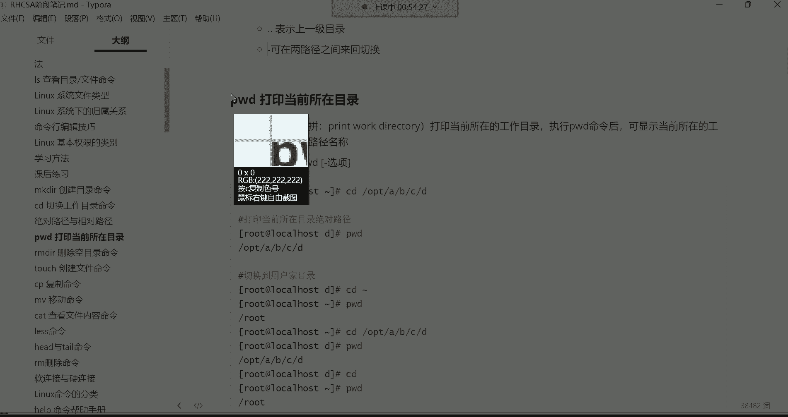
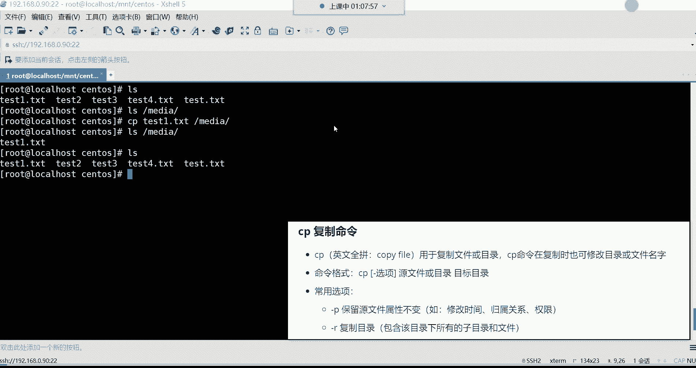

# Linux运维培训教程超全合集，通俗易懂，适合小白，带你从入门到精通1 - P7：红帽RHCSA-7.mkdir、cd、pwd、rmdir、touch、cp命令学习 - 洋洋得IE - BV1qX4y177j1

哈喽哈喽，大家能听到我这边的声音吗，听到我这边声音的讨论区刷波，一开始我们今天的课程好，没有问题是吧好，那我们就开始上课，今天少了一些人是吧，我看了这个得少了十多号人。

这个十多号人可能是由于是周末的原因，可能是哎呀按耐不住自己的这个躁动了是吧，必须得出去溜达溜达散散心啊，即便是没有女朋友的人呢，他也是闲不住，也得看着看看外面的花花世界啊，花花草草的。

呵呵毕竟马上春天就到来了啊，春天到来的话呢，呃会看到像各种各样的花花草草啊，而且还是非常嗯那种比较性感的是吧，看看别人的女朋友没错，呵呵呵呵哎呀，夏天来了，又又到了那种什么季节呢啊就是嗯思春的季节。

你是没有啥看的，是哎呀，深圳已经夏天了是吗，没错啊，这个什么呃小丝袜啊，什么这个小什么这个装那个装的啊，是吧嗯就开始都嗯都上来了。

但是呢我们不用理会这些，我们作为一个什么呢，作为作为一个走在成功路上的一个人，我们不能被这些什么花花草草啊，成为我们成功路上的绊脚石，所以呢我们只谈学习，我们不谈爱情是什么，爱情不爱情的狗屁是吧，好了。

然后昨天呢讲了入门的一些必备概念，以及这个IOS这条命令啊啊，然后呢简单做一个回顾哈，阿拉斯这条命令是用于查看目录下的内容，以及目录和文件的详细属性的，然后这三个选项是最常用的。

大家呢也是一定要给他牢牢的给它记录了好吧，后期呢在不断的学习的时候呢，你们在干嘛呀，你们再根据自己的需求啊，再去这个自己去扩展就可以了，但是常用的这三个啊，肯定是能够满足我们平时的一个需求了。

然后我们就开始看看这个课后练习哈，这个课后练习呢就是对于我们昨天讲解的内容，给大家做一个整体的一个回顾好吧，第一啊就是命令行啊，我们昨天讲的命令行的格式，如果以每刀作为结尾呢，就代表这个账号是普通账号。

那如果是井号作为结尾呢，嗯井号作为结尾是不是就是超级管理员，OK好，请写出LINUX系统一般的命令格式，那命令格式呢最常见的就是有命令，然后呢有选项，还有参数，但是呢这只是一般的哈。

如果针对于一些比较灵活的命令，或者说我的需求不一样啊，你就得灵活运用它了，OK然后第三个在LINUX系统下面，如何辨别目录与文件啊，如何辨别目录与及其他的文件，我们主要就是通过什么呢，通过颜色去辨别。

白色是文件，蓝色是目录，浅，蓝色是链接，然后呢绿色是可执行的，红色是压缩文件，红色闪动的是链接文件不可用，然后呢黄色的就是设备文件，众多的设备硬件设备，好然后第四道题如何查看一个文件的详细属性。

那IOS呢是查看文件的，但是呢，杠L这个选项，是可以帮我们查看一个文件的详细属性的，好下边啊如何查看一个目录本身的相应属性，注意啊，现在是看目录本身了，那就要加这个杠D这个选项啊，港币是仅看本身啊。

然后不不显示目录下的内容，OK但是也不要忘了要结合这个L这个选项，然后第六道题查看文件详细属性，并且以这种K兆G的方式显示文件的大小，那K兆G的方式，其中是不是H这个选项是人性化的显示啊。

所以说不要忘了加这个H但L也不能少，为什么呢，因为L是显示详细属性的，最后呢有了详细属性，才能以这种K招G的方式，来给你显示它的大小啊，第七个题，如何查看一个文件的i node号，那就是杠I这个选项。

这个用的比较少，大家注意了解就行，第八题请写，请写出LINUX下文件和目录的三个归属关系啊，这三个归属关系呢我们后面也会什么呢，深入的去讲解，所以现在你就知道一下，有所有者所属组跟其他人啊。

这个分别呢首字母啊，UGO代表啊来表示U就是UC的意思啊，U就是user，而G是什么呢，G就是group啊，英文里面就是组的意思，O呢啊就是other，其他的意思就是他们的一个首字母哈，你看UGO好。

然后我们再来说啊，第九道题，请写出LINUX下基本权限的表示方法，那基本权限呢三个啊，R就是read啊，代表是读取W就是Y的啊，就是写入X代表是执行啊，这RWX啊代表是一个基本权限，好，那第十道题啊。

第十道题命令行以井号作为结尾的，表示什么含义诶，超级管理员好了，那以上就是你看我们这几道题，我们如果说你都能够我清楚的能够什么呢，能够给它做出来，那是不是我们上节课讲的东西，你就基本上也就掌握了呀。

因为这个题不就是针对于我们上节课讲的内容，做了一个整体的一个总结与回顾嘛，好那接下来我们就开始这个今天的技术讲解啊，今天就全都是学习命令了，然后呢呃在学习命令的时候呢。

也会不断的去涉及到系统的一些必备概念啊。

所以说呢进理论与实操都是结合着去讲解。

那机器呢先给他开机啊，把我这个昨天的虚拟机给他开机。

打开以后呢就不用管了，用这个远程连接工具。

然后连到我们昨天的机器里边啊，九零连到我们这个九零机器root用户名，好密码一回车，然后CTRL清个屏好了。

那接下来先来看第一条命令叫做midi r啊。

这条命令。

啊这条命令干什么用的呢，这条命令是创看哈，在这哈来看一下，Ok。

来看一下哈，好make dr这条命令呢英文的全拼叫做make directory，然后呢是用于创建新目录的，创建新的目录，什么意思呢，我们呀昨天使用IOS命令啊，可以看系统的根目录。

下边啊有非常多的目录是吧，那这些目录呢都是这个我们安装好系统之后啊，系统呢它自动给我们创建的，然后里边存储的数据呢，也都是系统在运行的过程中啊，所必须啊会用到的一些数据。

但是呢我们在学习过程中或者是在工作中啊，我们需要什么呢，需要自己去创建一些目录啊，存储一些我们比如说服务器里边的，产生的一些数据等等等等，这就这种需求就类似于什么呢。

就是我们平时在windows里面我自己建一个文件夹，然后呢唉存储一些数据能理解吧，哎所以这就是创建目录好呢，创建文件夹呢，这不用说了哈，windows里边你右击就可以了。

这个呢没什么可讲的，那在LINUX里面我们怎么自己去创建一个目录呢，啊去存储一些数据呢，那make dr干的事就这个事创建新的目录的，然后命令格式呢你看make dr这条命令啊，有选项。

然后呢选项我是放到中括号里面的，就是你可以加选项，也可以不加选项，是不是，那后面目录的名字我并没有放到中括号里面，就是说你使用这条命令，你后面必须得加这个参数啊，就是你在创建目录。

你得指定这个目录叫什么名字，OK然后常用的选项有一个叫杠P叫递归，创建多个目录啊，一会儿呢我们再来说好吧，那这条命令呢非常的简单，make dr空格啊，直接指定目录的名字，比如说test回车。

那你看这条命令执行以后，他就没有任何的返回信息是吧，那有没有创建成功呢，我们自己ALICES看一下啊，可以看到在我们当前的家目录，你看我现在是不是在自己的家目录啊，啊波浪号代表是家目录。

然后呢在自己的家目录下边就有一个蓝色的test，那这个目录就是我们刚刚使用MDR这条命令啊，创建出来的，那由于我在创建这个目录的时候，我并没有指定把这个test目录给它，创建在哪一个目录下边。

那默认情况下就是你在哪儿，那这个目录呢就创建在你当前的所在目录，你看我当前在自己的家，那这个目录呢就创建在我的家目录下边了，能理解吧，OK这是test啊，这make dr命令创建新目录的好。

那么这个Mac d r d命令呢，也可以同时创建多个目录，比如我现在有个需求，我需要同时创建很多个目录，那make点空格隔开指定我再创建一个探测一，然后再空格隔开test2，空格隔开test3。

空格隔开test4回车，看到了吗，是不是也没有报任何的错误啊，阿拉斯看一下好，那现在你看test一一直到test4啊，这四个目录呢就全都创建好了，OK这就是什么呢，这就是用于啊。

可以帮你同时创建多个目录，那这种情况下我们是怎么回事呢，是在指定额，是在自己的家目录啊，也是当前目录创建的是吧，那比如现在我有需求，我要干嘛，我要在OPT目录去创建，怎么办呢。

那这时候你就得指定它的路径了，怎么指定呢啊我先清一下平行，这样make dr空格隔开，指定我要在根下的OP t下边创建一个目录，那斜线作为一个分隔符，这根斜线就是用于指定OPT目录下边的。

那这时候我在创建的时候，我就可以创建了，比如说创建一个test，我们不叫test吧，我们叫什么呢，叫T1，好吧啊，这个幕后名字就叫T1，OK回车，然后这时候呢，我们阿拉斯打开OPT这个目录回车。

那这时候呢你看在OPT下面，是不是有一个目录叫T啊啊，这种情况下，就是指定在某一个目录下边去创建这个目录啊，但是你得指定它的一个路径哈，指定它的路径，OK那我如果想在OPT下面同时创建多个呢。

make dr在OPT下面，比如我再创建一个T2，那空格隔开，在指定我在OPT下面创建一个T3，空格隔开，在指定在OPT下面创建一个T4啊，回车，那这时候IOS打开OP。

你看他T1到T4就全都创建好了啊，T2到T4这三个目录就全都创建成功了，是不是啊，这就是也可以哈，指定在这个目录啊，同时创建多个目录，但这种情况下你在创建的时候，你可不要这样。

你比如这样make dr啊，我在OPT下面创建一个T5，然后空格跟开T6T7T八可以吗，回车它也没有报错，但没有报错，你发现啊，你在打开OPT的时候，它不太一样，它只有一个什么呢。

只有一个T5创建成功了，看到了吗，只有这个T5串线成功，那别的呢T6T7T八跑哪去了呀，由于你并没有指定他要创建在哪个目录，所以说它创建在了你当前的所在目录，看了吗，T6T7T八啊，在你的家目录下边呢。

为什么呀，因为他们前面你并没有指定要给他创建的，OPT目录，所以说系统呢并没有那么智能，它能够理解你的真正的含义，所以他只会认为啊，你并没有指定要把T6T7T八，创建在哪个目录。

那我就给你创建在你的家目录吧，啊你锁在哪儿，你当前在那我就给你创建到哪里吧，能力吧，所以如果你是如果你是这种情况的话，比如你并没有在OPT目录里边，然后呢，你还需要在OPT目录同时创建多个目录的话。

那每一个目录的前面都要指定什么呢，它的一个呃一个完整的路径啊，这样才可以能理解吗，来理解的，给我刷个一上来啊，等你们两秒钟反应反应，好理解是吧，那接下来呢我们在干嘛呢，那我们下午犯困容易走神是吧。

没关系哈，学习永远是枯燥的对啊，没有办法，谁，我什么时候不哭闹呢，呃只有当你那个开工资的时候，你是不枯燥的，当你花钱的时候，你是不枯燥的，但是你在吸收知识的时候啊，他不会向你看那个什么这个直播的小姐姐。

给你跳段舞啊是吧，然后给你给你穿个丝袜，扭一下那种来的提神哈，但是没有办法哈哈，毕竟呢你看别人给你这个扭个腰窝，是不是啊，他毕竟不能给你带来实际的收入，只会让你掏腰包，给你刷个礼物啥的。

所以说呢我们啊想要什么呢啊，想要获得这种更高级的这种这个放纵啊，我们就得要吃点苦是吧，这样才可以，所以说犯困的时候怎么办呢，犯困的时候就唉呀嗯嗯我告诉你们告我，我告诉你们个方法哈，如果你们要是犯困。

你们怎么办，你们啊不用风油精，你们就在讨论区就刷点东西啊，刷什么你刷个一也行，刷个花也行，刷什么都行，总之你要觉得你犯困了，你就在讨论区打个一，然后呢发出来打个一发出来，哎你发现哎这种有提神的功效啊。

有提神的功效啊，哈哈好行了，那接下来呢我们就再说说这个杠P这个选项，这个选项因为对于MDR这条命令哈，就本身呢用起来非常简单，就等于说创建一个目录，就跟你在windows里面建个文件夹一样。

这没有什么太多可讲的好，那接下来呢我们说说这个杠P这个选项，比如我现在有个需求，我想干嘛呀，我想在这个OPT下边，T1这个目录里边再建一个什么呢，再创建一个目录结构啊，创建目录要保存不。

它自动就保存下来了，用它自动就是永久保存哈，来看哈，我现在要在这个T目录下面，我要创建一个层级结构，什么意思呢，这个层级结构是量子啊，首先啊这是一个啊，我们说说这是一个T1目录T1哈嗯。

然后我想在T1下边我再创建什么呢，再创建一个，比如说这个叉叉这个目录啊，然后在叉叉这个目录下边我再创建一个目录啊，比如说这个创建OO啊，OO我就想创建这么一个层级结构，注意啊。

我这个层级结构是希望创建在T1目录下边啊，创建一个叉叉，在叉叉下面再创建一个OO，这是不是一个层级结构了呀，那这时候呢我们正常来讲怎么创建呢，你看我给你演示一下，这样我得指定啊。

Make make dr，指定在OPT下边的T1下边创建一个叉叉，回车，然后这时候呢我们再打开OP t下边的T1下，边看看有没有这个叉叉，有是吧，好那叉叉生成以后呢，我还要干嘛呀，咱们把命令翻上来。

我要在叉叉下边再创建一个O啊，回车啊，这是我们在打开什么呢啊调用吧哈调用嗯，EC加点调用一下，回车，那OPT下的T1下的叉叉，下边是不是有一个OO啊，没错吧啊这个目录就创建好了。

那这个目录创建好了之后呢，那你看我是一层一层创建的，没错吧，得先把这个叉叉啊给他创建出来，然后再创建这个OO是吧，那我能不能一条命令给他搞定啊，可不可以呢，就比如我现在想在这个T2目录下边创建一个。

比如说X1啊，在S1下边再创建一个什么呢，创建一个X2，然后再在S2下面创建一个X3，可不可以呢，我们来看看效果哈，一条命令能不能搞定，MDR在OPT下的T2下边创建一个X1。

然后呢嗯在X1下边我再创建一个X2，在X下边再创建X3，S3下边创建个X4，你发现这就报错了，说我们无法创建目录，那如果这样创建的话，你得想干嘛呀，现在T2下边把S1给他创建出来，然后再干嘛呀。

再再就是你得一层一层去创建哈，你一条命令的无法干嘛，要把这么多的层级关系同时创建出来，不允许啊，主要是这条命令本身没有那么强大的功能，所以这时候你怎么办呢，所以这时候你得加个杠P选项命令翻上来啊。

啊CTRLA把你的光标移动到最左边，然后往右挪一挪，空格杠A杠P杠P的话，它叫什么呢，它叫递归创建多个目录，注意哈，它这个目录结构就是什么呢，就是可以帮我们在T2下边再创建一个X1，在X1下边啊。

就X1里面再创建一个X2，然后在X2里面创建一个X3，所以它这个关系就是能够，满足我们刚刚那个需求，哪个需求呢，嗯我现在就是啊这个需求就是OP t下边啊，我要来一个什么呀，来在T2里边，嘿等会啊。

好在这个T2里边呢，我来一个层级结构T2，下边给我创建一个X1，啊这个X1，然后在X1下边呢，在干嘛要再创建一个X2，哦是这样子的，这X2然后在S2下边啊，三四是这样子的哈，这个层级结构是吧。

那回车你看这时候他就并没有报错，为什么并没有报错呢，啊因为杠P叫做递归，创建多个目录，哎这个递归可以帮我们做这种需求，如果你不加递归的话，他是没有办法帮你在一个不存在的目录下边，去再去创建新的目录的。

为什么呢，因为你想想哈，我想创建这么多个层级结构的目录，首先X1这个目录它压根就不存在是吧，然后呢，我又想在这个X1，这个本身就不存在的目录下边，再去创建一个X2，然后我又想在一个本身又不存在的。

这个X2目录下边再去创建S3S4，哎呦，这就有些费劲了，他就无法帮你完成，所以这时候呢这个层级结构，如果你真想去做这种事情，杠P可以帮我们达到这个效果，所以这时候我们LS干嘛呀。

来看OP t下边的T2是不是有个X1样，但这时候就不要这样看了哈，我们把光标移动最左侧啊，CTRLA然后呢加个杠大R这个选项，杠大R这个选项昨天讲的是什么呀，昨天讲的是递归查看是吧，那回车。

那这时候呢他就把DV打开了T2这个目录，那这时候我们就可以看到，他这个层级结构了是吧，那在这个T2下边有一个什么，有一个X1是吧，然后在这个X1下边有个什么呀，有一个X2，然后在这个X2下边有个什么呀。

X3是吧，然后在X3下边有一个X4，那这个层级结构是不是通过杠P这个选项，就给我们创建出来了，哎就是所谓的叫做递归啊，第一位，那如果你有这种需求的话，你说我就需要这么一个层级结构。

那你知道是可以通过杠P这个选项来完成的，好了，那对于MDR这个命令呢，我们就暂时告一段落啊，对这就叫做目录数哈，哈这个有一个层级结构的目录数好，那下面呢在创建目录的时候啊，也不光是创建目录哈。

以后创建文件的时候注意事项呢，大家知道一下这个目不管是目录还是文件啊，它的这个名字啊，你在创建的时候，除了以这个斜线以外的任意名称，你都可以用，为什么呢，你比如说我想创建一个目录MAD r。

我想创建一个名字叫斜线，可以吗，回车你发现无法创建，为什么呀，因为这个斜线是根目录，注意它是根目录哈，那根目录已经存在了，已经存在的话，你再去重复创建，他不是不是就告诉你这个东西已经存在了呀。

啊不能再重复创建了，就等于说现在我已经有一个这个同名的，这个一个目录，那你再创建它就不允许，OK吧，那你说那我这样创建不允许，那我这样我make dr，我在OPT下边，我创建一个可以吗。

比如说来一个这个斜线，啊回车也不允许知道吧，也不允许哈哈因为他还是认为啊你要干嘛啊，你这这个东西是想创建一个根目录，所以他不允许哈，对你除了这个斜线以外的名字，你可以任意去创建啊，因为它一是这个根目录。

二是路径分隔符啊，压压这压根是不允许这样去创建的，文件也一样，文件也不允许这样创建，还有名字的话呢，啊不管是文件或目录的名字，长度不能超过255个字符啊，这个嗯，我们在创建文件根目录的时候。

不会去闲的无聊，闲得蛋疼，去搞这么长的一个名字的，是不是啊，这个注意事项大家知道一下啊，这是make dr这条命令啊。

然后下面是这条命令的众多的什么众多的演示。

而我们再来说这个CD这条命令，Cd。

CD这条命令是干什么用的呢，叫切换目录用的啊，切换工作目录啊，大小写必须区分吧啊当然区分大小写了，因为它是严格区分大小写哈，好那接下来我们再来说这个CD这条命令哈，CD啊切换的嗯，为什么要切换呢。

就是我们刚刚在OPT下边，我们创建了很多个目录，是不是啊，而且呢在OPT下边，在这个T2这个目录里边，我们还创建了很多的层级结构呢，是不是好，那现在我想切换到这个X4这个目录里边，这怎么切换呢。

因为我现在是在自己的家目录啊是吧，我想进到这个S4这个目录里面，那这时候CD命令看哈，英文的全篇叫做change directory，然后是专门用于帮你切换目录的，然后这条命令格式你看CD啊。

这条命令你看有点意思，这条命令呢，我把选项根目录名都放到中括号里面，是一个可选的，那难道这条命令可以什么都不加，可以单独使用吗，那首先这条命令确实可以单独使用啊，你回车诶，你看CD回车啊。

CD回车没什么问题是吧，哎那也可以这样cad空啊，空格指定我要进到OP t下的什么呢，嗯T2下的X1下的X2下的X3下的X4，这个目录回车诶，你看我是不是已经，我你看我当前所在的这个什么呢。

位置是不是变成S4了呀，哎切换进来了哈，然后这时候呢切换进来以后，我就已经宰了这么长的一个路径下面了啊，非常的深非常深哈，那这时候我再敲CD，注意哈，回车你发现我又回哪去了呢。

哎直接又回到了自己的家目录，是不是，你看小波浪号代表是自己的家目录，我又回到了自己的家目录了，唉这就有点意思是吧，你要说CD这条命令啊，是这样子的，看目录名称可以是绝对路径或相对路径。

这句话可能不太理解，没关系哈，看后面这句话，看后面这句话，如果不指定目录名称，则切换到当前用户的家目录啊，也就是说我你甭管在这个系统当中的哪个位置，你看我已经，刚刚已经切换到这么深的一个目录里边了是吧。

然后我直接敲了一个CD，我就直接干嘛啊，直接回家了，是这么回事，所以这条命令也可以单独去使用它，那下面这句话，你看目录的名称可以是绝对路径或相对路径，这又是什么意思呢，什么叫做绝对路径。

什么又叫做相对路径。

那这个我们把下边的这个概念。

来给大家说清楚啊，绝对路径。

绝对路径和相对路径讲一讲什么叫绝对路径啊，啊这里面我写的也很清晰啊，绝对路径就是以根为起点，那最终到达你想去的那个目标目录，我们称之为叫绝对路径呃，就刚刚这波操作，就是属于一个叫绝对路径的一个切换啊。

它是以什么为起点呢，以根目录作为我的起点，然后呢我经过一层一层一层一层的目录啊，最终达到了我想要去的这个目标目录X4，这就叫做绝对路径，那什么叫做相对路径呢，就是以当前路径为起点，到达你想去的目标问路。

什么叫做当前，比如说我现在还是想进到X4这个目录里面去，但是如果我当前已经在哪呢，我已经在在这个，你看我先切换到OPT，如果我现在已经在OPT目录的话，那我就可以干嘛呀，就指定唉。

我以OT目录作为我的起点了，就不需要再去指定什么呢，不需要再去指定根作为起点了，因为什么呢，因为本身这个X这个X4这个目录，它就在OPT的下边，是不是，那我是不是就可以指定以OPT为起点，然后呢。

那我就进到干嘛呀，我就先进到我自己的这个目录下边的CD哎，切换到我的T2下边，然后这时候再指定路径分隔符，那T2下边有一个X1是吧，然后有个X2X3X四，这样啊，X4哈X4，这样是不是也可以啊。

唉那你看跟前面如果做对比的话，这个呢是以跟为起点，这个呢就是以当前的OPT目录作为起点，这就是所谓的绝对与相对啊，能听懂吗，听懂的刷个一，听不懂的刷个二没关系啊，懂就懂，不懂就刷二，都可以是吧。

嗯不懂也不丢人哈，如果你不懂的话呢，我会再给你这个解释解释啊，但如果都懂了的话，那以后咱们再进行就是路径切换的时候，你就别犯蒙圈，什么叫别犯蒙圈呢，比如你当前你看我们现在回到自己的家。

比如你当前明明是在自己的家目录呢，然后你想切换到这个X4这个目录里面，那你就不要这样啊，C a d x4，很多同学刚开始可能会有这种情况，C t x4，但是你要明白这系统可没有那么智能啊。

系统不会觉得你是想进到OPT下边的，这个X4这个目录里边，能理解吧，系统只会认为啊你想切换到哪呢，你想切换到你自己家目录下边的这个X4，这个目录里面，但是在你的家里边，他又没有这个目录的名字叫X4。

所以他就说没有找到，能理解吧，而且你也不能这样CD啊，比如说T2下的X1下的X2下的S3S4，你这样也不行，为什么呢，因为这个T2本身也没有在你的家目录，他在那儿，他在OPT目录对。

所以咱们说相对路径啊，必须要保证在同一个，从下边啊哈，所以这样才能够以相对路径作为起点。

所以这时候呢啊这句话呢可以再补充一下，这种相对路径，你必须要保证在同一层，目录中才可以，而这种绝对路径呢，你发现你在哪儿都行，是不是你甭管是在家目录还是在别的目录，因为以根为起点嘛。

这怎么切换都不会报错的，好了，那这是绝对路径与相对路径，那讲清楚这个。

那这CD命令就没有什么太多可说的了哈，你想怎么切换，比如说我现在想切换到你看啊，咱们啊我现我现在看根目录哈，打开根目录，我现在想切换到根下的etc，那就CDETC，我现在想切换到根下的OPT啊。

那就OPT我想切换到根下的mt，那就mt看到我想切换到根下的嗯，run啊，那就run，我想CD到别的目录啊，sex那就SESE看到吗，爱了四能理解吧，所以想怎么切换就怎么切换，让你直接敲CDCD好。

那你就直接回家了，那这条命令呢还有一个呃什么呢，还有很多的快捷操作啊。

快捷操作在这呢。

这个快捷操作有点意思哈，我们来看第一个快捷操作啊，这个波浪号表示为加目录，什么意思呢，比如我现在切换到OPT下的T2下的，X1下的X2下的S3S好，我现在这个路径里面的，那这然后接下来呢我再切换到这样。

我直接这样啊，CD波浪号空格波浪号回车，你看我现在在哪了，我现在就回到自己的家了啊，波兰号不是代表家目录吗，所以你也可以这样，但是没有必要哈，没有必要，这个我们说叫脱裤子放屁，多此一举。

咱们就直接CD不是也直接回家吗，你看把上面那个命令调过来哈，CTRLA把中把光标调到行首，然后我先切换进去，那这个时候呢我直接敲CD，我不也是回家吗，所以这个呢那就没有必要了哈。

但你知道一下有这个功能可以还有一个点啊，这个点是什么意思呢，点跟点点，你看我们L4杠A的时候，你们会发现这个有一个点跟点点是吧啊，我们说说这个点，它表示的是当前目录，当前目录啊，这个在切换的时候呢。

一般用不到，因为你切换的话，我们怎么会有这种需求呢，你看比如我现在又这个切换到哪儿啊，我把命令翻上来哈，又在这个S4这个目录里边的，那你看比如我现在CD点，你发现我没有任何的变化，是不是啊。

我还是在这个S这个目录里面，这代表什么意思呢，就是点代表当前路径，就是我要还是啊切换到当前的路径，所以这种没有需求，但一般什么时候会有这种需求呢，就比如说我们在执行后期学习这个呃，脚本的时候。

我们一般会用到这个点啊，我们点跟杠联合到一起代表是什么呢，当前什么意思呢，就是呃后期学习脚本，我要执行这个脚本的话啊，那点杠啊，后面跟脚本名啊，就执行当前路径的这个文件啊，这先知道一下。

而且这个点呢也不一定，非得是这个在执行的时候可以用，我们后期再学习，比如说拷贝命令啊，拷贝命令，移动命令啊都可以用哈，到时候再讲，然后下面再说这个点点表示上一级目录啊。

这个你看这个点点叫上一级什么意思呢，我现在是不是在这个X4这个目录里面，我想切换到S3怎么办呢，CD空格点点，你看我当前这个位置变成S3了是吧，那我还想切换到S3的上一层目录，S2这个目录里面怎么办呢。

CD一点点，那我再想往上切换，切换到S1CD一点点，我再想往上切换CD一点点，然后跑到T2了，是不是啊，我再往上切换CD一点点OPT了，我再往上切换CD一点点啊，根目录了，我再往上切换来，我问你们。

我应该切换到哪里去了，如果在CD点点呢，啊，表示上一级目录我应该切换到哪去了，嗯知道吗，啊在CD点点切换到哪里去，是切换到自己的家里面去吗，会切换到自己的家目录吗，CD点点翻上来，CD点点点点点点点点。

你发现没什么变化，还是在哪啊，还是在这个根目录，是不是为什么呀，为什么不，为什么不直接切换到自己家呢，因为你想想你的家在哪啊，在根下有个目录叫做root，这儿呢是不是啊，这超级管理员的加吗。

在根下边有个目录叫root，那你想你现在都已经在根目录下边了，你还能再怎么切换呢，哼还能再怎么往上切换吧，那根的上一层目录是谁呀，跟的上一层还有目录吗，没有了，所有的目录都在跟下边，是不是。

所以你没有办法再往上切换了哈。

所以这个一定要搞清楚哈，啊我们打开一个PPT啊。

用于呃方便画图。

那我们继续哈，然后下边呢还有一个这个小横杠，可在两个路径之间来回切换，比如我现在啊，我现在切换到OP t下的T2下的，X1下的X2下的S3N4，在这里面呢，我现在又切换到etc下的。

this is config network w tab键补齐杠，tab键补齐啊，我现在又切换到这个路径了，阿拉斯打开一下啊，这个路径呢，后期是我们在修改网卡IP地址的时候啊。

会来到这个路径去找到这个网卡文件好，那现在比如说啊我现在又想回到哪呢，我现在又想回到这个这个路径啊，又想回到这个路径，那这时候你可以这样CD空格小杠回车，你看我现在是不是又回到了哪了。

是不是这个X这个X4这个路径了呀，没错吧，然后呢，我现在在CD杠，我现在又回到哪了呢，我现在是不是又回到了这个路径了呀，就这个路径看到，所以这个CD杠是可以在两个路径之间，来回切换的，看到了吗啊。

来回帮你进行一个快速的切换，如果有这种需求的话，那大家就可以去什么去使用它啊，以上就是这个CD啊。

这些都叫懒人操作啊，所谓的快捷操作都叫懒人操作，箭头也可以吧，CD杠新讲的那对新讲的哈，新讲的啊，以上这些叫做快点操作好。

那接下来呢我们再来说说这个PWD这条命令。

那对于PWD这条命令啊。

它是干嘛用的呢，它是这个叫做看看PWD啊，叫做print worker directory，打印当前所在的工作目录，这条命令啊，直接敲直接敲哈，PWD回车，你看他干了什么事呢。

他就直接把你当前所在的这个路径，以及前边的一个完整的路径的名字啊，就给你列出来了，给你打印出来了，就显示出来了的意思，看到了吗，所以他可以打印你当前所在的工作目录，你执行PWDN命令以后。

可显示当前所在的工作目录的一个绝对路径啊，其实就是一个完整的路径的名字了，能理解吧，你比如我们像前面咱们这个在哪儿，在这个X4这个目录是吧，但是我们这个命令好像只显示这个，你当前的目录名字。

但如果我想看X4这个目录，它的一个完整的路径，你就可以这样叫PWD看到吗啊这样就可以了，你看PWD啊，这样就可以了，所以这条命令就没有什么太多可讲的了哈，就是打印当前的所在目录啊。

命命令格式也非常简单，那你看现在这三个命令格式，你看这三个命令MAD r CD e p w d这玩意儿。

你看比如说我现在我们CD先回到自己的家，比如我现在这样make dr，我在mt创建一个渗透OS目录，那我现在我想进到这个目录，我就cad空格干嘛呀，ESC加点，把上一条命令的参数给它调取过来啊。

直接切换进来，是不是切换进来了好了，切换进来以后干嘛呢，我们在PWD回车，打印一下，我们当前所在的一个完整的路径的名字，那就创建目录切换路径，然后呢打印一个目录的完整的名称，这三条命令都比较常用是吧。

OK好了，那接下来呢我们再来讲一个不常用的命令啊。

叫做瑞mod i r叫删除空目录的啊。

这个REMODR这条命令啊啊就是用的非常少哈，你看它是删除空目录，什么叫空目录啊，就是你这个目录里面不能有任何的数据，什么意思呢，比如我现在想把OP t下边的这个T2，以及T2下边的一个什么呢。

阿拉斯杠大纲啊，把minute调取过来，以及T2下边这个所有的层级结构，我都想给他删掉啊，就把T2以及T2这个目录里边的锁，就这个哈T2里边的所有都删掉，那这怎么办呢，这时候如果你用主mod r的话。

你看效果哈，RM dr啊，直接把这个OPT给他调取过来，OPTT2回车，你发现他说删除OPT下的T2失败，为什么呢，因为这个目录啊非空是吧，目录非空，也就是说这个目录下边有数据，他不让你删，那怎么办呢。

如果我就想把T2都给它删掉啊，包括目录下边的所有的东西都给他删除的话，那你如果用REMODR的话，你得先这样remove dr啊，把这个参数给它调取过来哈，调取过来你得指定T2下的X1下的。

X2下的S3S，你得先把这个目录最底层的这个X4给它删掉，那这样才不会报错，然后你在干嘛呢，然后你再REMODR再把这个S3给它删掉，然后你再把这个命令调过来啊，把参数调过来，然后再把这个S2给它删掉。

然后再这样一层一层的去删，也就是说你在创建的时候，它这个结构是一层一层的是吧，那你删的时候得从下往上哎，一层一层的去删，对就是这么麻烦，就这么麻烦，但有的时候，你比如说我们在这个做一些删除操作的时候。

可能说对于一个目录下边可能会有啊，上百个文件啊，甚至上千个文件在同一个这个目录下边，那如果我真的是不想要了，我就想给它删掉，那如果有那么多文件的话，你怎么办呢，那这时候REMODR就不实用不实用啊。

所以我说这条命令呢大家注意了解就行，作为了解就行哈，它只适合删除空的啊，只要是有数据就不能删，那怎么办呢，我们后期会学习一条删除的命令啊。

是非常给力的啊，是在这个位置叫RM啊，这个呢是后期可以帮你实现这个，非常给力的删除操作的哈，就甭管你这个目录下面下边有没有数据，它都能帮你删，对这个删的快啊，这个能把整个系统都给你删掉，呵呵好。

所以这个REMODR大家注意了解。

接下来说说这个touch这条命令。

touch啊，touch我先清个屏啊，CTRLL清屏呃，创建文件的命令啊，这条命令用于创建新的空白文件啊。

新的空白文件什么意思呢，啊，其实就等于说我们在windows里面右击新建文本文档，就这个操作啊，建一个空白的文件出来。

然后在这个里边你就得用touch啊，你看我们现在在哪PWD打印一下，我们现在在mt的CTOS目录是吧，好我想在这个森啊渗透S目录下面，我想建一个什么呢，我想建一个文件。

那这时候touch比如说这个test点TE好，创建好了，ALEX打开看一下，那是不是这个文件就生成了呀，好，那这条TCH命令跟MDR，他们两个的用法是完全一样的，完全一样哈，你看我现在在干嘛。

我想创建多创建几个文件啊，别说test一点tat，然后test的2test3test四点TT，还称爱丽丝，你看是不是也是一条命令，同时创建了多个文件呢，那这时候呢可能很多同学就会纳闷。

说A创建文件后面补个TT干什么用啊，没什么用，补不补都行啊，因为你有没有这个扩展名的都无所谓，只不过如果你创建这个文件，你后期需要拿到windows里边，让windows能够认识这个文件的话呢。

哎你加个TT，后期你拿到windows里边，那windows也知道了啊，能能能够认得出来这个文件，用记事本可以帮你打开，知道吧，好，那这个就是什么呢，就是创建文件，然后如果我想在别的目录创建呢。

比如说我想在opt目录去建文件，那你就指定它的一个路径就可以了，touch指定我在OPT下边，我要创建一个test1空格，在指定OPT下边test2空格，OPT下面test3回车。

那就是再看这个OT目录回撤，看到吗，那test123是不是就创建成功了呀，哎这样就也是在指定的路径，这是我指定的路径是吧，然后呢创建多个文件啊，创建多个文件，好了。

那这条命令呢跟那个MDR都是非常的简单啊，就没有太多可强调的。

就是说白了在windows里边不就是建个文件吗，是不是。

那剩下这个文件建到哪个目录，就看你自己的一个需求呗，你说我想在T3目录去建个文件，那你就踏实在指定它的路径，OPT下的T3下的什么呢，就是叉叉，叉叉是阿拉斯，打开OP t下的T3，你就可以看到这个文件。

是不是，这不就等于说你在windows里边啊，你在哪个文件夹建的文件，你就进到哪个文件夹里面不就可以了吗，是不是，但是我们这边呢，就你只需要指定这个路径就可以了，他就给你创建的这个路径下边啊。

是这么回事啊，这touch创建文件的命令格式的用法，跟这个make dr都是一模一样的，就没有太多可讲的，那我们再来说这个CP命令，CP命令这个呢在windows里边是什么操作呢。

哈哈这个在windows里边啊，就是右击哈哈复制，然后我在干嘛呀。

比如说我在跑到某一个文件夹里边，进到我的C盘，然后比如说跑到用户里边啊，然后右击，然后呢粘贴看到了吗，能看懂这波操作吗，什么叫复制啊，就是右击复制，右击粘啊，就是这是什么叫拷贝，拷贝就是右击复制。

右击粘贴，对CTRLCCTRLV是不是好给它删掉，删掉。

所以这就叫CP啊，这可不是你们想的那个CP什么。

很多同学玩游戏一听啊CP啊，这不搞对象吗是吧，这可不是搞对象的CP哈，哎这是拷贝的啊，用于你看用于复制文件或目录的啊，英文名叫copy fail，就拷贝文件的，然后这CP命令在复制时也可以具备。

修改目录或文件的名字的功能啊，有时候它除了拷贝以外呢，还可以具备改名好，来看看这种东西怎么玩儿啊，我现在想干嘛呢，那现在在我们当前路径有很多文件，是不是啊，我想给它拷贝到哪了，拷贝到我的。

拷贝到我的家目录取阿拉斯，打开更新的root，我现在想嗯不行，这个名字有重复的，那不行，呃，我看看哈哪个目录啊，那我们现在看看跟下面哪个目录还比较清闲，还没有被我们给什么呢，给这个糟蹋啊。

mt打开mt好，就这个mt啊哈哈这个PWD我们当前在哪儿，我们当前就在mt下的渗透四目录是吧，也就是我们现在就在这个渗透S目录里面的好，那咱们这样吧，咱们看看这个media这个目录吧，好吧。

打开根下的media这个目录，这个目录很很清闲呢，里面什么都没有啊，那现在我们这样，我要把我这个当前的这个当前目录下，这几个文件我要给他拷贝到那个根系的media目录，根下的media这个目录。

那现在就copy命令格式哈哈CP等等，先指定源文件或目录，再指定目标目录，那这个时候什么意思呢，什么叫圆啊，先给大家讲清楚，圆就是你要拷贝的文件就叫做语言文件，什么叫目标。

目标就是你要把这个文件拷贝到哪里，这就是所谓的目标啊，你的目标，那接下来我的源文件是谁呢，就是test一点TT我要把它test一点TT啊，tab键补齐啊，这种东西就补齐了啊，test test1补齐。

OK好，那我现在要把这个文件拷贝到根下的，media这个目录，好回车，然后阿拉斯打开media，回头看到了吗，你看说这个文件就直接拷贝过去了，让他拷贝过去，我们在阿拉斯看看我们当前的目录啊。

sent s这个目录，你发现这个test1这个文件仍然还在是吧，仍然还在哈，CP不加杠不加杠啊，这个文件仍然还在，为什么呢，因为拷贝嘛，拷贝也不会导致你的源文件消失，就是说我刚刚做这个操作，哪个操作啊。

就是我把这个文件拷贝到某一个文件夹。

那个文件也不会消失，是不是啊啊拷贝就等于说对它做了一个备份啊，做了一个备份啊。

就它了，它有一个一模一样的副本文件了，是这么回事儿啊，这是copy，然后这条命令也可以帮你同时拷贝多个，比如现在CP指定，我要把再把test2空格隔开，test3空格隔开，test4空格隔开。

test点TT同时拷贝到media目录ES加点调取，调取调取啊，不行调取不出来了，那就自己敲吧，米莉亚这个目录回车，然后ALEX在EC加点调取过来，回车看到了吗，那是不是就同时把这些文件都给他。

拷贝到这个目录下面去了呀，哎这也可以同时拷贝多个，同时拷贝多个哈，然后他这个使用的方法，比如说我现在在渗透S目录呢，我现在想干嘛呢，哎我现在想把OPT目录这几个，什么T1T2T3T4。

这个目录也给他拷贝到media目录去，那怎么办呢，哎CP你就得指定它的一个完整的路径了吧，因为你没有在这个OPT目录啊，所以你觉得指定我要拷贝OPT下边的哎，指定下面的时候得斜线隔开了。

那这时候呢哎T1提议给他拷贝到哪了，ESC加点，给它调取过来，拷贝到media目录回撤，那这时候你发现它就提示说什么略过目录，什么叫略过目录啊，有没有拷贝成功啊，LSES加点没有拷贝过去。

没有拷贝过去啊，看到了吗，还在呢，是不是啊，不是没在没有在这个media目录，为什么呀，注意哈啊，这个如果我想在使用CP拷贝目录的时候，要加一个叫做杠R啊，杠杆是用来拷贝目录的。

然后它是包含目录下所有的子目录和文件，这个也比较好理解，如果我把T2这个目录给他，拷贝到这个media这个目录的话，你想想在T2这个目录里边的，如果有哪些数据的话，是不是也跟着一起过去了啊。

这个很好理解啊，那这时候你看我们就CP空格杠R指定，我把OPT下的T2这个目录，拷贝到media目录回车，这时候再打开media目录，看到了吗，这T2是不是就过去了，那在T2里边的。

啊被我们给删了是吧啊，如果有的话，是不是也一同给他拷贝过来的啊，这是如果你想拷贝目录，千万不要忘了加一个杠R这个选项告诉你，学姐好，然后那我们再来说这个杠P啊，这个杠P这个选项叫保留原文件属性不变。

什么叫语言文件属性看啊，我们来拿这个test2这个文件来说吧，我们ALEX空格杠L，看一下test2这个文件详细属性呃，我们主要是看他当前的什么呢，这个文件的最后一次的修改时间吧，看这个位置是几点。

是14。48，没错吧，那现在是几点呢，是14：58分是吧，现在是你们看看你自己的点，是14：58分好，那我现在要做一个操作，什么操作呢，我想对于这个文件做一个拷贝啊，就是拷贝就等于备份的意思啊。

把这个文件呢做一个备份，备份到哪里呢啊，备份到哪里都行，但是我现在想备份的时候，我希望这个文件原先的属性是什么属性，那备份以后呢，它的属性呢不要发生改变，这种叫做什么呢，叫做属性不变的。

我要对它做一个备份啊，做一个拷贝，那这个怎么样才能实现呢，如果你就普通的拷贝的话，不加这个杠P选项，我们来看效果哈，我们不加杠皮，我先给他拷贝到哪儿呢，我先给他拷贝到，OP t下的，我们打开OP t啊。

我我在拷贝OP t下的T目录吧，我们看看这个TE目录里面有个叉叉是吧，好那就给他拷贝到T下边CP我要把注意哈，我现在已经在sins目录里面了是吧，我现在要把我当前目录下的哪个呢，TT2这个文件空格隔开。

拷贝到根下的OP t下的T2，这个目录什么都没有加是吧，那S4杠L这时候，指定T2下的test文件，看到的详细属性啊，我清个屏回车，那你看它的时间变成什么呢，变成当前拷贝的时间了。

但是原先那个文件ALEX杠L我们看test这个啊，test2这件你看它的就是这是属于原文件哈，在渗透S这个目录下边啊，这是原文件，然后呢这个在OPT这个T2下边，这个属于就备份文件了是吧。

那你看原文件它的时间是什么呢，14。48分，但是我这个做了拷贝以后，他的时间就发生变化了，变成当前拷贝的那个时间了，这就属于什么呢，叫属性发生变化了，但有的时候我们在做数据备份的时候。

我们是不希望这个属性发生改变的，哎这个文件原先的属性以及它的权限，什么归属关系是什么都不要发生变化啊，一模一样的给我拷贝过去，那这个时候我们就得加杠P啊，那时候咱们再来演示的话。

我们换个目录OPT下边的T1吧，OPT下的T1啊，这这里面有个叉叉是吧，好，那接下来呢我们就这样CP杠P指定，我要把当前下的test2，这个文件拷贝到OPT下的T这个目录下边，去回车。

啊这时候我们在阿拉斯杠L看OP t下的，T1下的test2这个文件啊，你看这是我刚刚加了杠P这个选项拷贝过来的，文件的属性是什么呢，时间你看都没有发生变化，还是14。48分，是不是跟我这个源文件啊。

在渗透S这个目录下边的这个源文件，它的属性是一模一样的呀，没错吧，哎这就叫什么，这就叫做保留原文件的属性不变啊，一般在做备份的时候会有这种需求，OK能列了吧，哎这是杠P这条命令，就是拷贝文件或目录的。

那改名怎么改呢，就你在拷贝的时候，你可以这样改哈哈，比如说我现在要拷贝谁呢，我现在要拷贝这个test的一点TTCP啊，杠P保持属性不变拷贝，但是改个名，我要把这个test一点TT。

拷贝到OP t下边的那个T1目录，下边叫什么名字呢，叫ABC点TT回车，那这时候我们再打开OP t下的T1这个目录，你发现这个名字就不叫什么就不叫什么了呢，不叫test一点TT了，哎。

而是叫ABC点听一听呢，所以你在拷贝文件的时候，你想改名的话，你就在这个你想拷贝的那个目标目录的后边，给它加一个新的名字就可以了，如果你不想改名，那只需要指定，我要给它拷贝到哪个目录里边就可以了。

后边就什么都不要加，什么都不加，就是什么呢，唉原先叫什么名字，拷贝过去以后呢，仍然叫什么名字，那这时候问题来了，我们改了名以后，那属性会不会发生变化呀，T1下子ABC点TTCTRLA啊。

移动一下光标杠A回车啊，Sorry，不是杠A啊，CTRLA啊，杠L，啊只是名字发生变化了，但是别的属性呢也不会发生任何的改变啊，好这就是他拷贝的时候可以改名，你甭管是拷贝目录还是拷贝文件。

想改名都可以改，OK这是CP啊。

拷贝命令好了，休息一下吧，休息一下，你看我们讲的这些基本命令是不是啊，然后你们如果有什么疑问啊，可以发到讨论区。

然后呢休息一会儿。