# Linux运维实战技巧：104：自动化运维之Ansible安装教程 - P1

## 概述
在本节课中，我们将要学习自动化运维工具Ansible。我们将了解Ansible的基本特点、核心组件以及其工作原理，为后续的安装和使用打下基础。

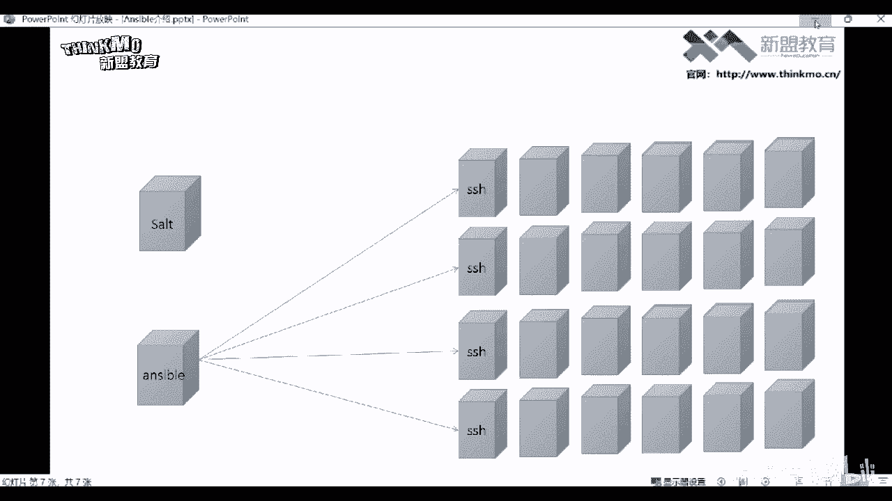

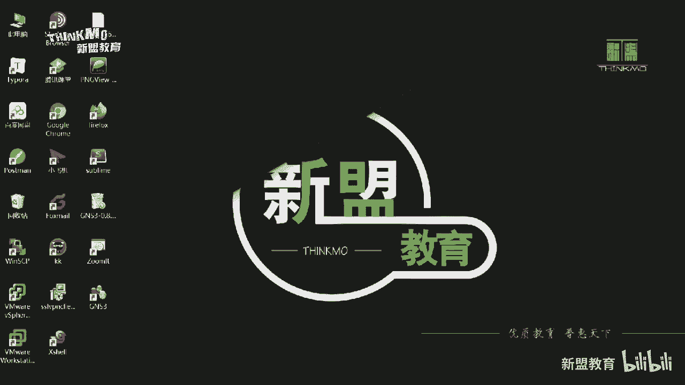

---

## Ansible简介与特点

Ansible是一款于2013年推出的IT自动化软件，它基于Python语言开发，并于2015年被红帽公司收购。它是一款开源且免费的软件。

Ansible基于Paramiko模块实现SSH协议连接。Paramiko是Python语言中的一个功能模块，主要功能是实现SSH远程连接，并且支持批量连接。只要被管理节点开启了SSH服务，Ansible就可以对其进行管理。因此，使用Ansible时无需在客户端主机上安装任何代理程序。

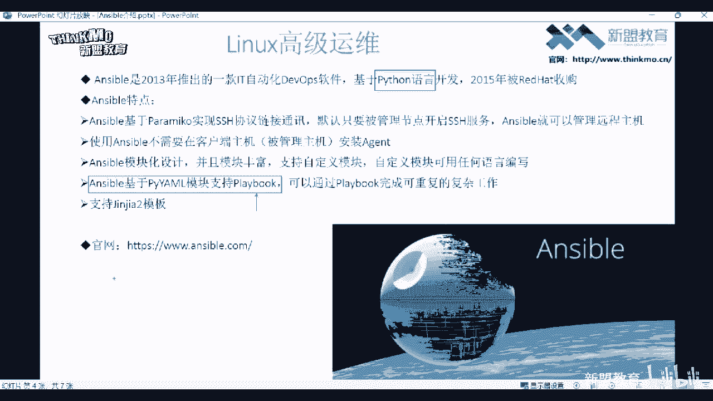

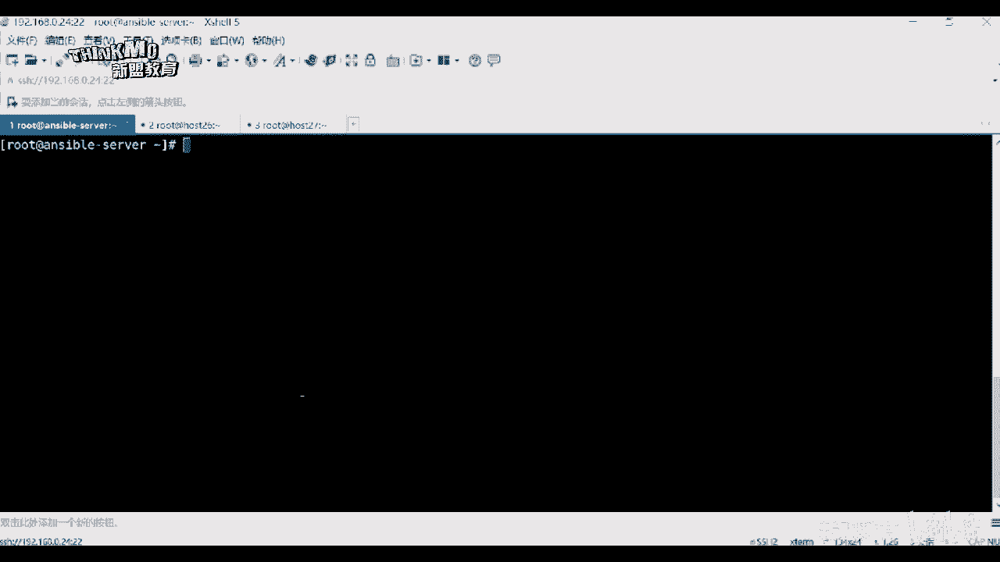

以下是Ansible的主要特点：

*   **无需客户端**：只要目标主机开启SSH服务，Ansible即可直接连接并执行命令。SSH协议在服务器中通常是默认启动的。
*   **模块化设计**：Ansible的所有功能都通过模块实现。模块就是具体功能的封装。例如，拷贝文件需要调用拷贝模块，安装软件包需要调用相应的软件包管理模块。Ansible拥有超过3000个模块，但运维工作中常用的模块通常在20个以内。
*   **支持自定义模块**：如果Ansible提供的模块无法满足特定需求，用户可以自行开发模块。自定义模块支持使用任何编程语言编写，包括Shell脚本。
*   **支持Playbook**：Playbook是Ansible的“剧本”，它类似于脚本，是多个Ansible命令的集合。通过编写Playbook，可以将复杂的、重复性的工作编排到一个文件中，然后统一执行。Playbook遵循YAML语法格式。
*   **支持Jinja2模板**：Ansible也支持使用Jinja2模板语言来编写Playbook，但这种语法相对不够直观，通常不推荐初学者使用。

上一节我们介绍了Ansible的基本特点，本节中我们来看看它的核心组件。

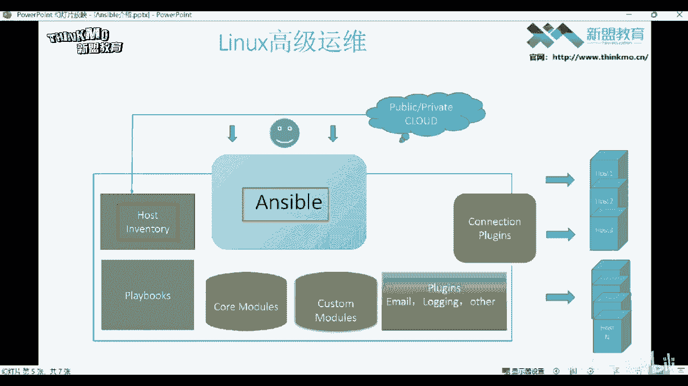

---

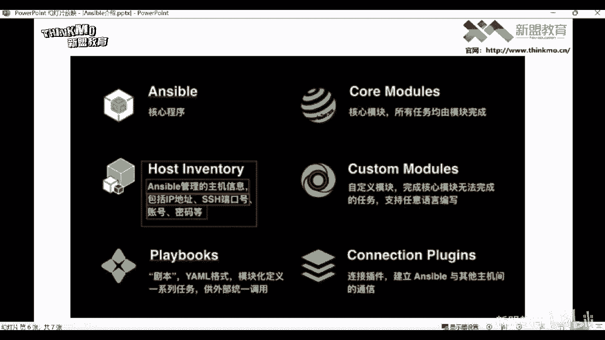

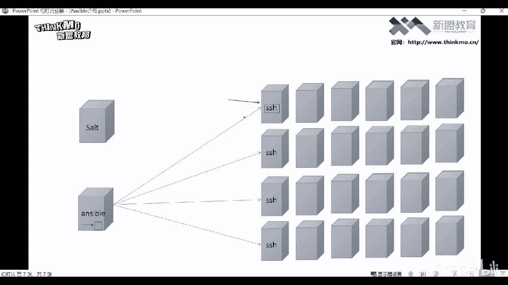

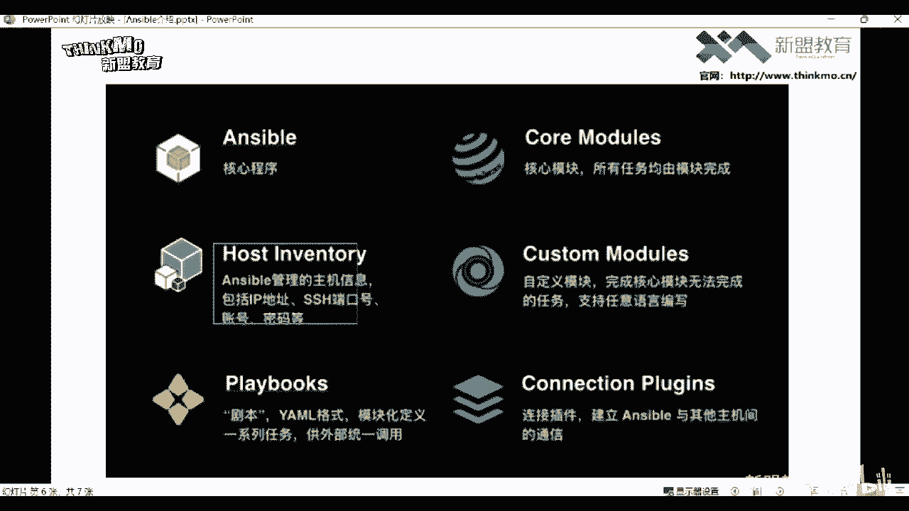

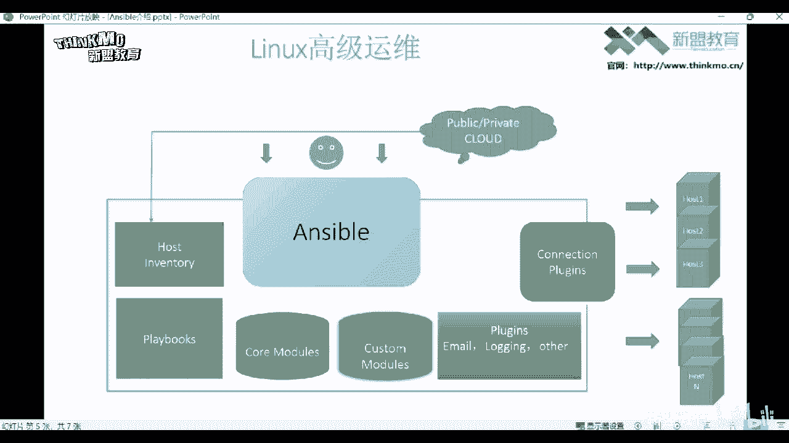

## Ansible核心组件

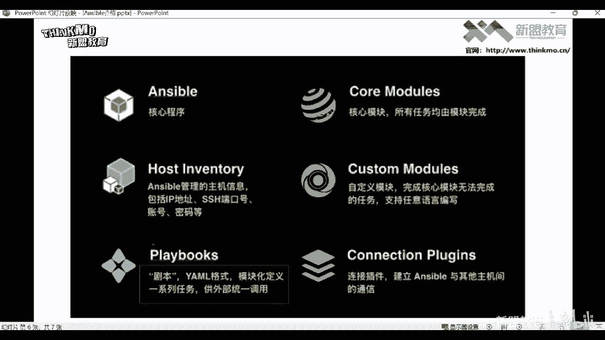

Ansible的架构主要由以下几个核心组件构成：

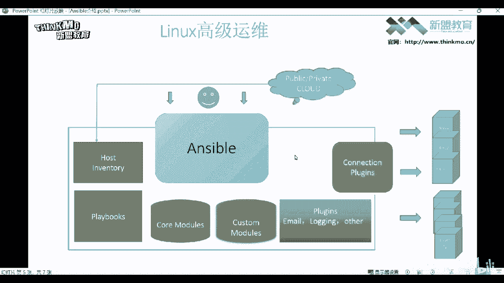

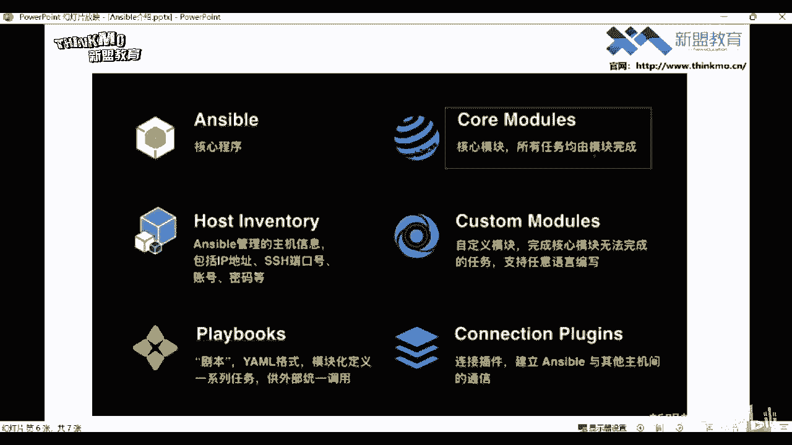

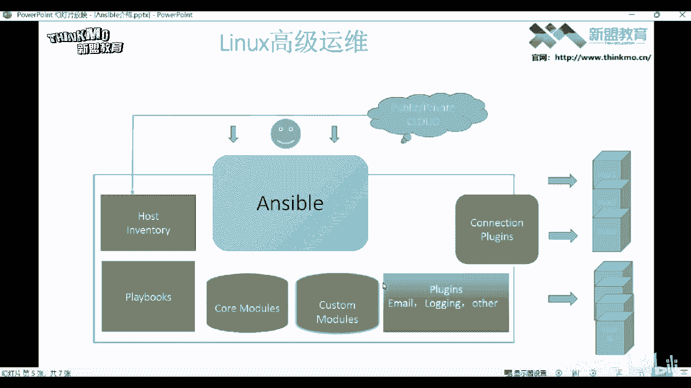

*   **Ansible Core**：Ansible软件本身。
*   **Host Inventory**：清单文件。这个文件用于定义Ansible需要管理的所有主机信息，包括主机的IP地址、SSH端口、用户名和密码等。Ansible通过读取此文件来获知需要连接和管理哪些主机。
*   **Playbook**：剧本文件。遵循YAML语法格式，用于模块化地定义一系列任务。用户将需要执行的Ansible模块编写到Playbook中，然后执行该文件即可完成复杂工作，无需在命令行逐条输入命令。
*   **Core Modules**：核心模块。Ansible的所有功能都是通过其模块完成的。用户根据需求调用相应的模块来实现特定操作。
*   **Custom Modules**：自定义模块。用于完成核心模块无法实现的功能，由用户自行开发。
*   **Plugins**：插件。Ansible拥有丰富的插件来扩展其功能。例如，`connection`插件用于实现与主机的连接。插件也支持自定义开发，但自定义插件必须使用Python语言编写。

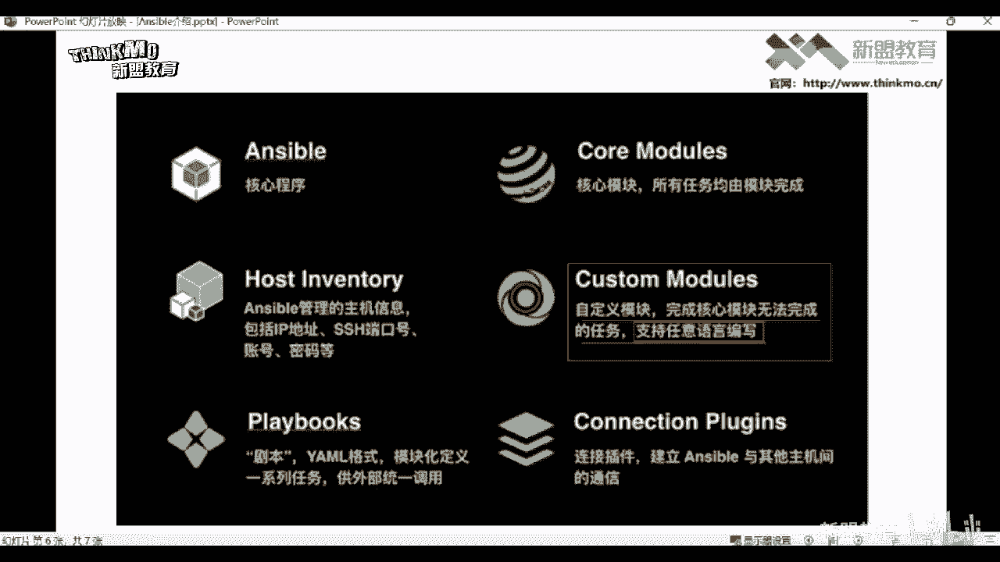

---

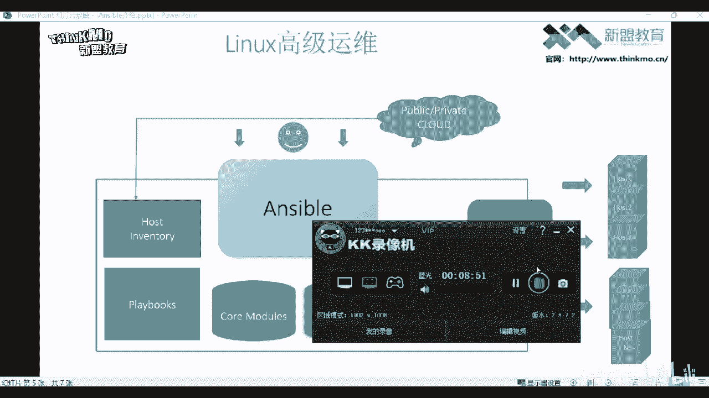

## 总结
本节课中我们一起学习了自动化运维工具Ansible。我们了解了Ansible是一款基于Python、无需客户端、采用模块化设计的强大工具。我们还介绍了它的核心组件，包括清单文件（Host Inventory）、剧本（Playbook）、核心模块（Core Modules）等，这些组件共同协作，实现了高效的批量自动化管理。下一节课，我们将开始学习如何安装Ansible管理工具。