# Linux运维实战技巧-104.自动化运维之Ansible安装教程 - P1 - 新盟教育 - BV1cT4y1Z7An

好，那接下来呢我们来给大家介绍介绍一下这个ible它的一个具体的一个特点哈。来看一下ible这款软件是2013年推出的一款啊IT自动化，它是符合这个思想的一款软件哈，然后是基于这个python语言开发。

2015年被红帽给收购了，它现在是属于这个红帽公司的。然后当初被红帽收购的时候，大约是花了将近1亿美金啊，但是没有关系啊，对于我们来讲呢，它是一个开源前免费的一个软件。我们用是不需要花钱的。😊。

那对它的特点呢，ible基于primi实现SSH这个协议链接的通信。对这个primi它是这个python语言里边的一个功能模块啊，它主要的功能就是能够帮我们实现这个SSH远程连接到那些被管理的主机上面。

并且是一个批量连接。那默认呢只要被管理节点开启这个SSH这个服务的话，那安ible呢就可以管理远程的主机。所以我们使用安是不需要在客户端主机上面安装那个at呢。

这就一个所谓的那个呃客户端程序哈那用安的时候，它的一个具体的特点在这位置。比如说我想用安ible管理这一群机器。那只要是这一群机器开启这个SSH远程连接协议的话。

安斯伯就可以直接连上去就可以对它执行命令。而这个SSH这个协议呢，在服务器里边默认都是随机自起的啊，因为我们平时不管是在工作中还是在学习的时候啊，我们都是通过一些呃像这种远程连接工具。

你比如像叉CRT之类的这些呢去连接到服务器上面的啊，但是你在连接的时候都是通过那个SSH那个协议去连接的啊，所以在服务器上面必须要起的，就是这个SSH那只要这个协议起安伯就可以去批量连接到这些主机啊。

😊。

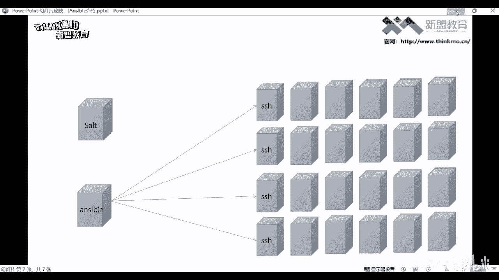

所以它叫无需客户端。那还有anible是模块化设计。那这个所谓模块化设计模块是什么东西呢？模块就是功能哈。你就比如说我想用ensible干什么事情呢？比如说我想。😊。

将一个文件啊同时拷贝到这些服务器上边。那这个时候你就得调用安傅他给你提供的那个拷贝模块，才能把这个文件给它拷贝过去。那如果说我想在这些主机上面，我想去安装软件包啊，或者搭建一个亚麻仓库。😊。

那这个时候你就得调用它专门给你提供那个功能的模块才可以。就是其实所有的功能都通过模块来实现的这就是所谓的模块化设计啊，并且模块丰富这个模块多少个呢？模块的话，3000多个模块吧，这3000多个模块。

当然大家也不要担心啊，你说这3000多个模块我怎么去记呀，是吧？呃，没关系哈，就是我们作为一个运维来讲呢，其实平时在工作中常用的模块20个以内就够了。所以大家也不要觉得这个模块太多，记不住啊，学不会。

因为安斯伯除了运维可以使用以外，你像开发测试，还有网络工程师都可以用啊。所以这个对于运维来讲呢，呃只是呃完成一些运维相关的工作啊。然后它还支持这种自定义模块。

这个所谓自定义模块就是允许我们自己去开发它的模块。如果你觉得安斯伯他给你提供那个那个模块啊，功能不完善，或者说没有办法实现你想要的那个功能，你可以自己去开发。而且他在开发的时候是支持用任何语言去编写的。

包括sha有语言也都可以啊，这就所谓的自定义模块。那基本上这个需求呢很少哈，基本上他那么多模块能够满足我们工作中的99%的需求了。😊。

那还有下边基于这个模块支持playbook它也是python语言里边的一个针对于某语言的一个功能模块。然后我们通过这个模块可以去编写这个playbook。

那这个playbook它翻译过来就是剧本的意思这个剧这个playbook剧本，它是类似于脚本的一个命令的堆积，就是正常来讲我们在使用的时候，我们是就是在命令行里边一条命令一条命令去执行。

比如说我要将一个文件啊拷贝到那些被过列主机。那就时候你就在在命令行里面敲一条那些拷贝的命令。那如果有时候我们会比如说遇到一些每天都要执行的啊，或者说你一些复杂的工作。

那这个时候呢你就不适合在命令行里面敲了干嘛呢？😊。

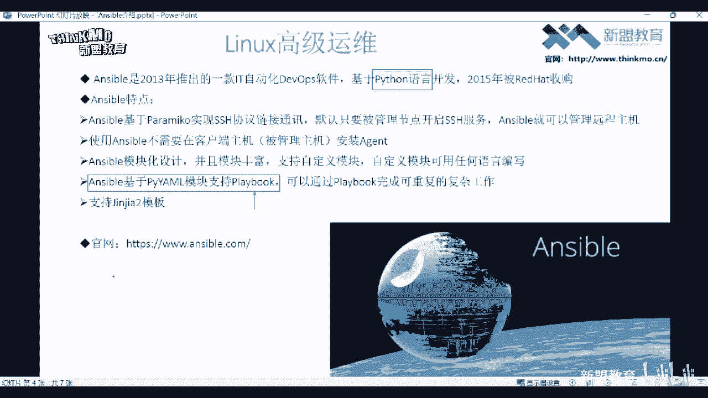

你就把安伯的那个模块给它写到一个文件里边。然后呢，你想要实现这个功能的时候，你就直接去执行这个文件就可以了。这不就类似于一个s脚本嘛啊，就是一个命令的堆积哈。😊，好，这是所谓的普雷 book。

然后它遵循的这个语法是这个压墨的语法格式。

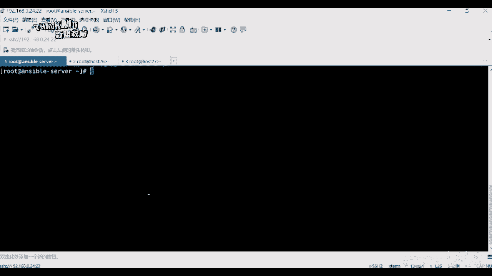

然后对于压毛语法的话呢，我们有机会再给大家讲哈呃怎么说呢？它要求比较严格，特别是对于一些初学者来讲啊，这个语法它真的是比较难学啊，因为要求一般相同的属性呢得对齐啊做好缩进。😊。

然后我们通过这个playbook呢，可以完成一些也就重复的一些复杂的工作。这是playbook剧本。当然我现在大家先作为了解，毕竟还没有写呢，没有写的话，这种东西我说的再清楚呢。

其实你对于你的理解也并不是很直观啊，你先知道它有这么一个功能，而且它支持这种尖加的模板。是th语言里面的一个模板语言。然后我们也可以把这个playbook写成这的一个语法格式。

但这种语法格式特别的不人性化哈，不推荐大家去学习啊，作为了解即可。以上就是的一个具体的一个特点。那下边呢是它的官方网站。那官方网站大家可以自己去访问一下，然后我呢接下来再给大家说一下的一些这个组件啊。

首先呢就是本身啊，这个没什么可介绍的了哈，就是它的一个本身。😊，啊，第二个组成部分是host inventoryvent。这个host inventoryvent是ible的清单文件干什么用的呢？

来看一下哈，host inventoryvent就是ible要管理的那些主机的信息，以及就是这个信息的IP地址，还有SSH的端口号，还有每个主机上面的这个用户以及密码呢？你都要写到这个清单文件里边啊。

为什么要写清单文件呢？你就比如说ible它可以通过SSH这个协议可以连接到这个主机上面，但是他怎么知道我要连接哪一台主机，没错吧，所以你想用管理哪些主机，你就要把哪个主机的，比如这个主机它的IP地址。

还有呢这个主机上面的这个用户名，就root用户，还有root的密码，你要给他写到ible指定的那个文件里边。到时候就去读这个文件，那他就知道了啊，我要管理的主机是哪一个，然后他就直接去连啊。

对它去执行一些操作。😊。

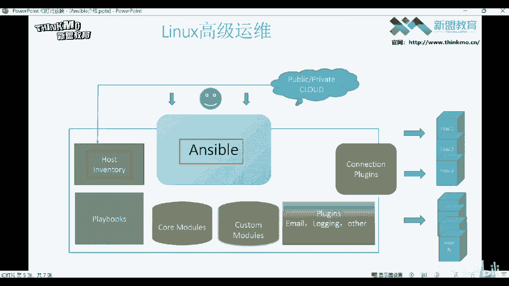

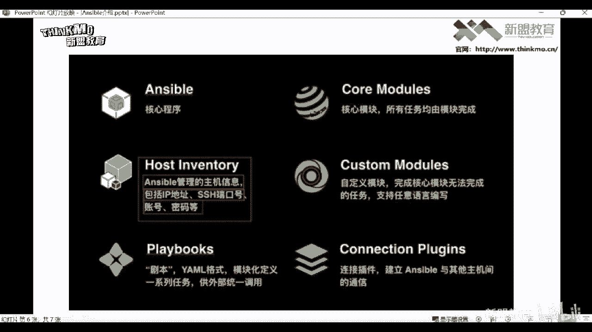

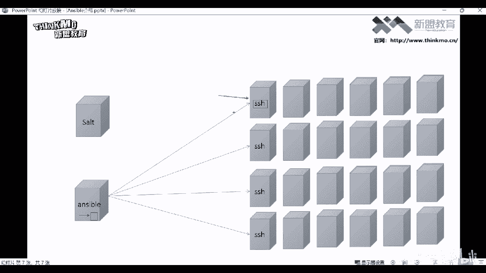

这就是这个清单文件的一个作用，就是用来定义你被管理主机的一些信息的。

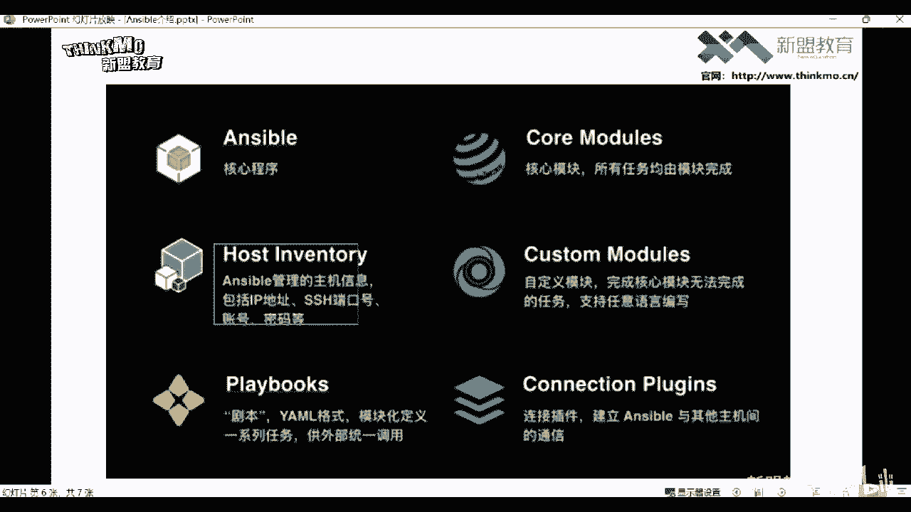

然后playbookplaybook呢，这个就是前面给大家讲的那个剧本了，就是。

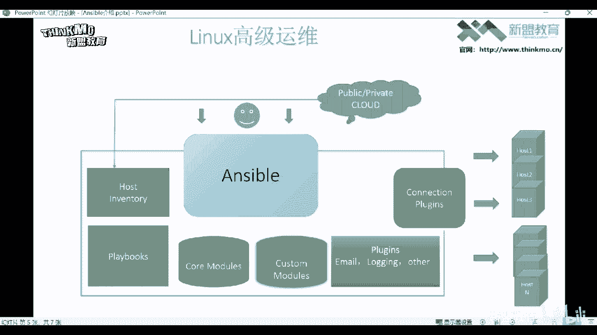

在这哈 book剧本遵循的是格式模块化定义。然后就是你只需要把an的那些模块给它写到这个剧本里边，到时候执行这个剧本就可以了，帮我们完成功能啊，就不需要在命堂里面去执行这个命令了啊。

然后我们再来说这个 core models这个co models呢是的核心模块，所有的功能都是通过它的模块来帮我们完成的啊。你用是想实现什么功能就调用它的那个模块就可以了。然后除了核心模块以外呢。

还有这个自定义模块，这个cust models。😊。

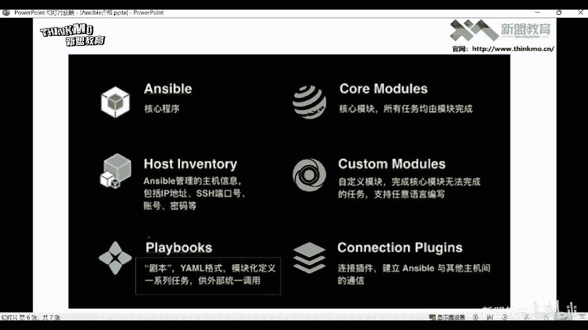

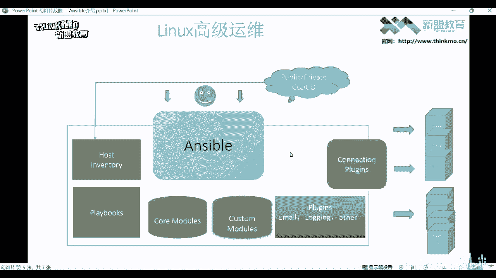

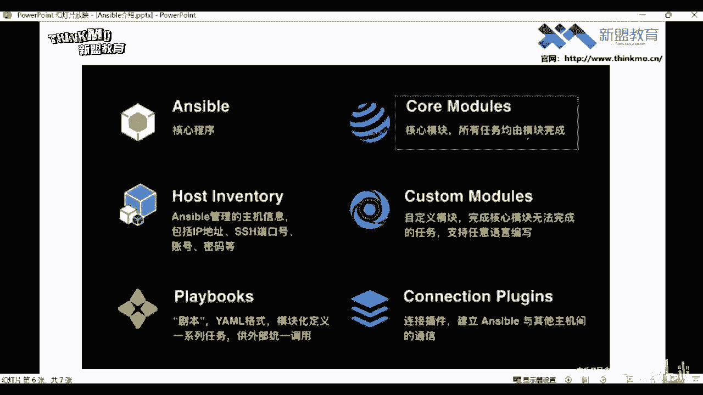

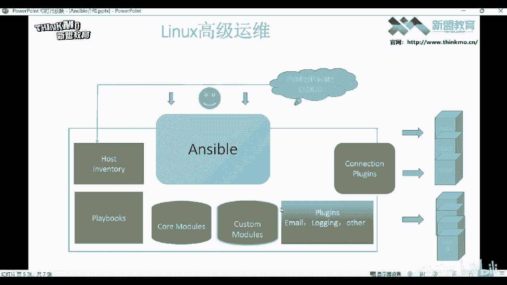

像这个自定义模块就是可以帮我们完成一些核心模块无法完成的任务啊或者功能。其实说白了就是你自己去开发的那个模块，而且它支持使用任何语言去编写，也包括是有语言。当然这种需求看情况吧啊。

如果你觉得它能够满足你的需求，你就没有必要去开发新的模块啊。

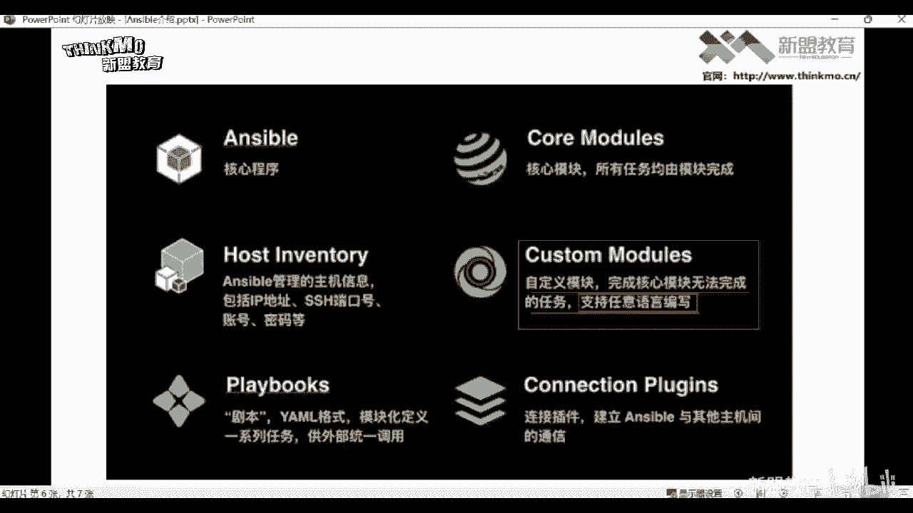

cus还有这个pls，这个呢是它的一些插件，它的插件非常多哈。😊，然后呢呃我们就比如说这个connection这个插件，这个插件它实现的功能就是我们最终想管理这些主机，然后呢经过定义清单。然后呢。

我可以通过把这个模块啊编排在play book剧本里边，然后执行这个剧本，最终呢通过这个连接插件就能够连接到这个主机去对他们执行操作啊，插件非常多，而且它还支持这种azer叫自定义插件，这种自定义插件。

如果你觉得有些功能呢，它不能帮你实现，你可以自己去开发它的这个功能插件也可以。但是它的这个插件，你必须得使用python语源去开发啊，不能使用其他语言哈。

因为它本身就是基于python语面开发的一款工具。😊，好，那以上就是安伯的一些特点了啊，然后呢我们下节课呢给大家讲讲怎么去安装这个安伯这个管理工具。好，那我们这一期呢就给大家讲到这里啊。

我是新蒙教育的yess，我们下期再见。😊。

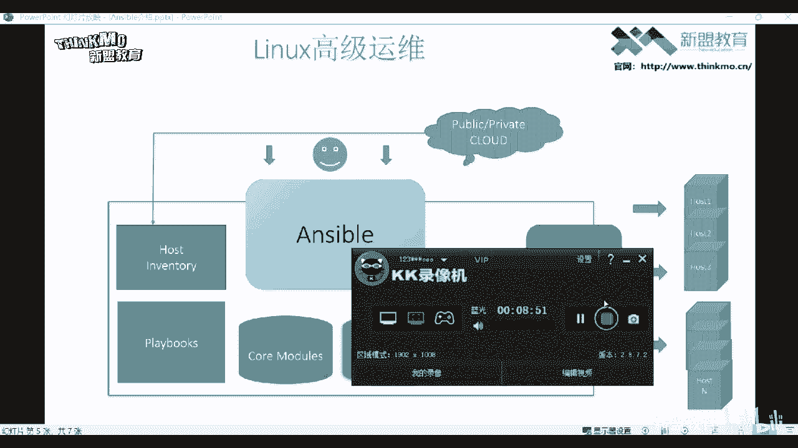

点击下方链接，获取更多学习内容。