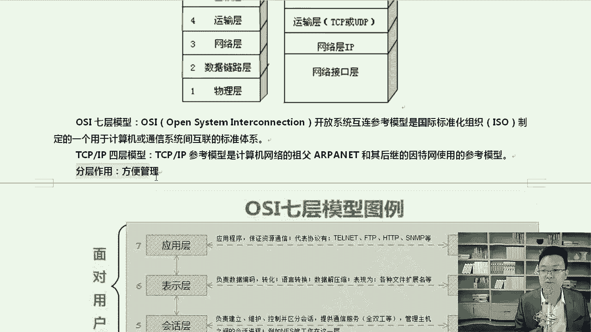
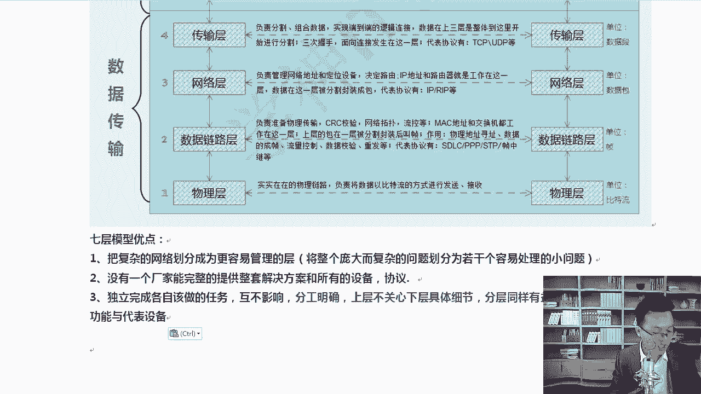
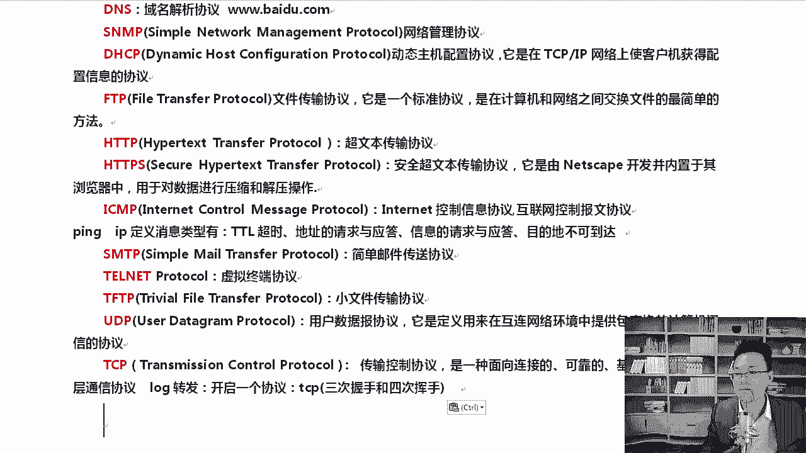
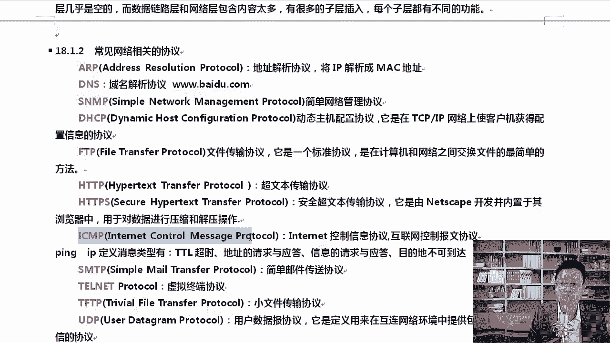
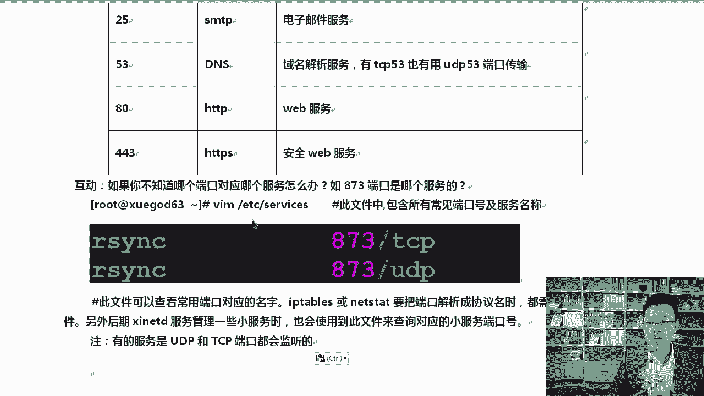
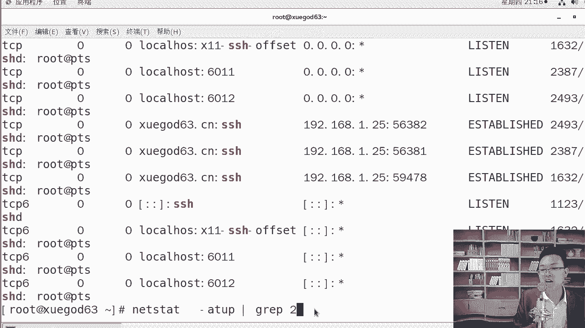
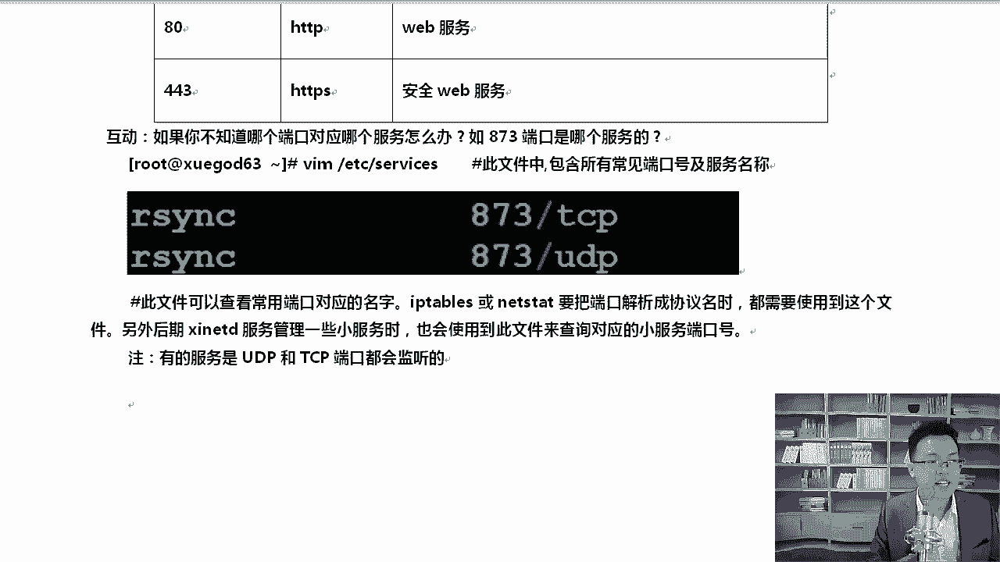
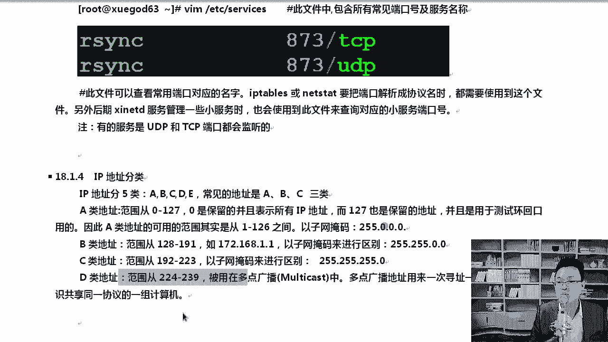
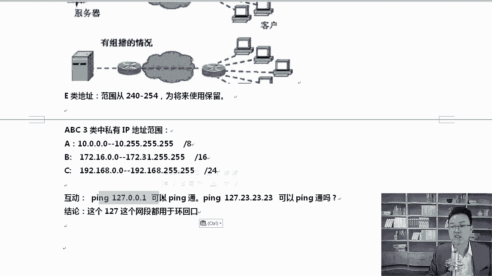
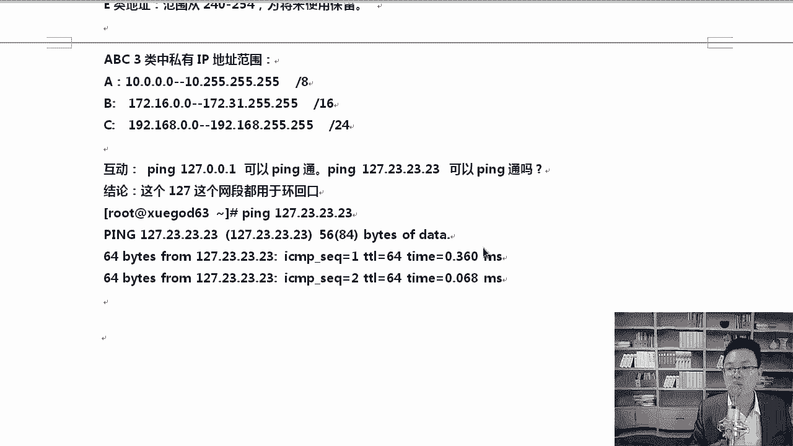

# Linux网络基础：1：OSI七层模型与TCP/IP四层模型

在本节课中，我们将要学习计算机网络的基础模型——OSI七层模型和TCP/IP四层模型。理解这些模型是掌握Linux网络管理、进行故障排查和应对技术面试的必备知识。我们将从模型的分层结构讲起，逐步深入到各层的功能、常见协议以及它们在实际中的应用。

## OSI七层模型概述



上一节我们介绍了课程的整体内容，本节中我们来看看网络通信的经典理论框架——OSI七层模型。

OSI七层模型，全称为开放系统互联参考模型，是一个理论上的网络通信模型。它将复杂的网络通信过程划分为七个层次，以便于理解和设计。



以下是OSI七层模型从底层到高层的名称：
*   **物理层**：负责在物理媒介上传输原始的比特流。
*   **数据链路层**：负责在相邻节点之间可靠地传输数据帧。
*   **网络层**：负责在不同网络之间进行寻址和路由，传输数据包。
*   **传输层**：负责端到端的通信，提供可靠或不可靠的数据传输服务。
*   **会话层**：负责建立、管理和终止应用程序之间的会话。
*   **表示层**：负责数据的格式转换、加密与解密。
*   **应用层**：为应用程序提供网络服务接口。

分层的主要作用是将复杂的网络系统划分为更容易管理的模块。这类似于国家的行政区划，分层而治使得管理更高效。此外，分层允许不同厂商专注于特定层的产品开发，上层无需关心下层的具体实现，分工明确，互不影响。

每一层处理的数据单位也不同：
*   物理层：**比特流**
*   数据链路层：**帧**
*   网络层：**数据包**
*   传输层：**数据段**

## TCP/IP四层模型概述

理解了理论上的OSI模型后，本节我们来看看实践中广泛使用的TCP/IP四层模型。



TCP/IP四层模型是互联网实际使用的协议栈模型。它比OSI模型更简洁，将OSI的某些层次进行了合并。

以下是TCP/IP四层模型与OSI七层模型的对应关系：
*   **网络接口层**：对应OSI的**物理层**和**数据链路层**。
*   **网络层**：对应OSI的**网络层**。
*   **传输层**：对应OSI的**传输层**。
*   **应用层**：对应OSI的**会话层**、**表示层**和**应用层**。



为什么实际中更多使用TCP/IP四层模型？因为OSI模型虽然理论严谨，但分层有些冗余（如会话层、表示层在实际中很少独立实现），且过于复杂。TCP/IP模型更贴合实际应用，例如将物理层和数据链路层合并为网络接口层，直接对应网卡、交换机等设备，更加实用。

## 常见网络协议

在了解了分层模型后，我们需要认识在各层中工作的具体协议。以下是网络管理中必须掌握的常见协议：

*   **ARP**：地址解析协议，用于将IP地址解析为MAC地址。
*   **DNS**：域名解析协议，用于将域名解析为IP地址。
*   **SNMP**：简单网络管理协议，用于管理网络设备。
*   **DHCP**：动态主机配置协议，用于自动分配IP地址。
*   **FTP**：文件传输协议。
*   **HTTP**：超文本传输协议。
*   **HTTPS**：安全的超文本传输协议。
*   **SMTP**：简单邮件传输协议。
*   **Telnet**：虚拟终端协议。
*   **TFTP**：简单文件传输协议。
*   **UDP**：用户数据报协议。
*   **TCP**：传输控制协议。

## TCP与UDP协议对比

在传输层，TCP和UDP是最重要的两个协议。面试中经常被问到它们的区别。

TCP是面向连接的、可靠的传输协议。在收发数据前，必须通过“三次握手”与对方建立可靠连接。其特点是数据传输准确、有序，但建立和维护连接需要更多系统资源，头部开销较大（通常20字节），速度相对较慢。

UDP是无连接的、不可靠的传输协议。它直接发送数据，不建立连接，不保证数据包的顺序和可达性。其特点是头部开销小（仅8字节），传输速度快，但可能丢包。

选择TCP还是UDP取决于应用场景：
*   使用**TCP**的场景：要求数据完整、顺序正确的应用，如网页浏览（HTTP/HTTPS）、文件传输（FTP）、电子邮件（SMTP）。
*   使用**UDP**的场景：可以容忍少量数据丢失，但要求实时性高的应用，如视频流、语音通话、DNS查询。UDP的可靠性问题可以由应用层协议来弥补。

## 常用端口号与查询方法



网络服务通过端口号进行标识。以下是一些必须记住的常用端口：

*   `21`：FTP
*   `22`：SSH
*   `23`：Telnet
*   `25`：SMTP
*   `53`：DNS
*   `80`：HTTP
*   `443`：HTTPS



如果遇到不熟悉的端口号，在Linux系统中可以通过查看 `/etc/services` 文件来查询。
```bash
cat /etc/services | grep 873
```
此文件被 `netstat`、`iptables` 等命令用来将端口号解析为服务名称。



## IP地址基础



最后，我们来梳理一下网络层的基础——IP地址。IP地址分为A、B、C、D、E五类，最常用的是A、B、C三类。

*   **A类**：范围 `1.0.0.0` 到 `126.255.255.255`，子网掩码 `255.0.0.0`
*   **B类**：范围 `128.0.0.0` 到 `191.255.255.255`，子网掩码 `255.255.0.0`
*   **C类**：范围 `192.0.0.0` 到 `223.255.255.255`，子网掩码 `255.255.255.0`
*   **D类**：组播地址，范围 `224.0.0.0` 到 `239.255.255.255`
*   **E类**：保留地址

其中，有一部分地址被规定为私有IP地址，用于内部网络，不能在公网上直接路由：

*   A类私有地址：`10.0.0.0/8`
*   B类私有地址：`172.16.0.0/12`
*   C类私有地址：`192.168.0.0/16`

此外，`127.0.0.0/8` 整个网段是环回地址，用于本机内部通信和测试，其中最常用的是 `127.0.0.1`。




---



本节课中我们一起学习了计算机网络的核心基础。我们首先探讨了理论上的OSI七层模型及其各层功能，然后对比了实践中使用的TCP/IP四层模型。我们认识了关键的传输层协议TCP与UDP的区别及其应用场景，记住了常见的网络协议与端口号，并掌握了IP地址的分类与私有地址范围。这些知识是后续学习Linux网络配置、服务部署和故障排查的基石。