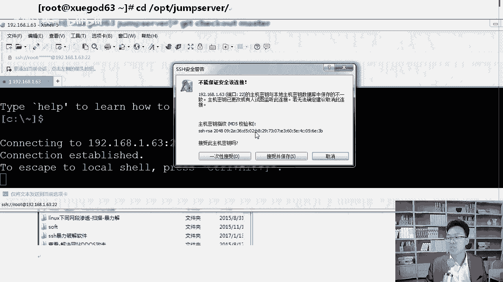

# Linux运维／RHCE／红帽认证／云计算-1-jumpserver概述和安装 - P1：e-13-1-jumpserver概述和安装 - 学神科技 - BV16K4y1s7En

好，那个大家好，我是学生IT讲师MK啊。那么接下来MK分享给你一个jamer jumpmper server这样一个跳板机或者堡垒机这样一个啊服务。这个服务呢在工作中用的还是非常多的，好不好？

首先呢我们所讲的内容是第一个啊我们搭一个jamer server。

跳板机。OK然后呢，我们在stoOS7。4上去搭这个服务，使用jaer server来管理王者荣耀数万台服务器。那今天这个内容还挺重要，所以你呢一定要认真的去听好不好？那我们来开始了啊。

来我们把这个音乐关掉。

首先呢我们来了解一下云啊，就是堡垒机啊，虽然这里是云堡垒机是吧？堡垒机有什么特性啊，常见的堡垒机的特性。第一个操作啊，审计功能，云端录像功能，还有访问控制啊，管理账号、指令检测和资源授权啊。

都有这个功能，好不好？都有这样的功能。那么我们来先说一下啊，有同学说老师我跳板机都不知道是什么。比如说堡垒机了，那么堡垒跳板机是什么呢？啊，跳板机就是一台服务器好不好？

那么开发人员还有我们的管理人员在维护的过程中，首先先登录到这一台啊服务器上，然后再登录到目标设备上，然后进行操作啊，这个就是我们要做的这个东西我们画一张图让大家看一下，好不好？

画一张图，让大家看一下这个大概的这样的一个过程。它这个过程是这样的，那么画一张图来。

看一下啊，在这个地方是这样的，这个叫做。开发人员好不好？那么开发人员会干嘛呢？开发人员一般都通过公网连到我们的堡垒机上，堡垒机再连到我们光环新网的某台服务器上。就我们所要干的这些所有的事是吧。

都需要这样去操作啊，我把这个麦克往上调一调啊。往左根放一放，好不好？这样的话大家听的声音会更大一些，好不好啊？这样的话大家听起来会更好一些啊。好，在这个地方。那么知道这个以后呢。

我们接着来看跳板机就是一台服务器。开发人员或运维人员在维护的过程中，首先先登录到这一台服务器上，然后呢再登录到目标主机上进行维护，这就是这样一个过程，你懂了吗？啊，那么堡垒机有什么啊，有什么好处呢？

来看一下跳板猪跳板机有一个问题就是什么呢？出了事故是吧，很难定责任。

啊，因为他没有审计的这样一个过程。好不好？对，这是这样一个过程啊，我们来把这个给大家整理到这儿。来。在这里大家要知道啊，讲到这儿。

我们来看一下。跳板机就是这样一个问题啊，一旦出了问题以后，很难去定到啊定到每一个责任身啊。一旦出了事故以后，很难快速定位责任人。还有原因这一块，因为你不知道谁是谁操作的每个人都能跳一下嘛，都登上去是吧？

万一谁干了什么事是吧，很难定。那么这个时候堡垒机就可以了，堡垒机就比它多了，这个审计功能了。那么在一定其实我们应用的过程中，什么跳板机跟堡垒机呃，它的功能很像的啊，好吧，所以有时候我们在说堡垒机的时候。

也称他是跳板机。😡，啊，其实跳板机堡垒机要比跳板机多了审计相关的一些功能。好，堡垒机也可以做一次跳转啊，看这儿堡垒机在特定的网络环境下，为了保障网络和数据不受来自于外部和内部入侵。好吧。

堡垒同时从内部入侵的然后呢，运用各种手段，实时它可以实时收集监控网络中的每一个组成部分的状态，还有事件等等都可以啊，而且能够及时处理，还能提交审计功能审计定则是谁的，就是谁的。因为什么？

因为我知道是你登上去的。好吧，我一下子就能看到这是不是你登上去的。好，知道这个我们来看一下这个堡垒机啊，堡垒机这个地方是这样的啊，简单来看一下堡垒机比跳板机多了实时收集啊，监控网络这一块的no你。

好不好？来知道了这个以后呢，我们来把今天的男主角啊请出来，就是谁呢？就是这个jump server啊，jamp server是一款使用python加江狗开发的一个做为一个什么开源的一个跳码机系统啊。

为互联网企业提供了认证授授权审计等等很多功能。我们来看一下啊，它的官方网址是什么呢？在这里。

老师给大家看一下3W jumpers点儿ORG。好不好？对他是哎很荣幸呢是他是一个中国的一个开源项目。好不好？因为很多情况下，我说到开源的时候，大家都觉得哦，这是外国的是吧？好，那么来知道师他以后呢。

我们说那么多，不如我们做一做是吧？😊，来MK呢我带着你做一个跳板机，好吧？搭建ja server，我们来搭一次啊，我们来做一下好不好？在7。4运行起来，你最新的7。4系统我已经运行好了，调一下窗口啊。

好，那么调完以后呢，我们来快速的看一下这个操作啊。在这里啊在哪里呢？在这里在这里我们先做一下。第一个你需要get下载一下啊，我们CD的OPT下吧。😊。

啊，找一个空路。来在这里呢我们需要getge，大家知道什么意思吗？gatet就像SV1样，可以把数据从外网上嘛拉下来，好不好啊，可以拉下来啊。那么我们来看一下这个操作啊，第一个是gatet克隆。😊。

Lei。啊，Gt克隆HTTPgithub jumper server。3点get，这样的话可以从上往下下载一下啊。好不好？这样的话他可以下来下来，我们来等他下来下来啊。😊，好，我们来等一下啊。

拿到这个东西，我们来看一下CD你看正正从外往上接收呢。啊，速度有一兆左右还可以啊，800多K吗？Hao。那么下载下来以后，我们CD进去，我们先把代码先荡下来啊。啊，很快了啊，80%多。好。

这边让它慢慢下载下来。好，然后呢在你当前目录下就会多一个东西，多一个什么样的东西呢？多一个jamper server这样目录我们可以进去啊。

jamper server cD进来在这里啊CD到insstore下，你可以看一下，这里只有 examplele点sha脚本，它本来应该是存安装相关的东西的。但是现在没有没有的话怎么办呢？啊，没有的话。

我们可退出一下啊，在这里重新取出一下啊，叫做gatet checkck out。好不好啊，check out你不会写，可以按table补器，好不？master版本。主版本啊，我们快速把它当下来啊。

荡下来一下啊。😊，好，当完了以后呢，int这个地方，自然它其实多了一些东西啊。好吧，你看多了一些，尤其是这些。那么我们现在登录到inst下面，接下来我们就可以进行安装了，好不好？在安装之前呢。

我自然先把笔记给你整理一下啊。好，安装gatet，然后呢我们克隆一下啊克隆。然后呢CD到这个目录下啊，gatet check out取出master这样的一个远程的一个分支。哦，取到这里一面以后呢。

我们把jamer server相关的包。因为jamva server在安装的过程中很需要很多东西。比如说买呃数据库等等这些东西它都需要，好不好？

所以呢在这里我们在本地把下载好的jamer server相关的包传上去，这样的话节约点时间啊。

一般上传的时候，你们用什么啊？我喜欢用叉C，我不知道大家你们是不是跟我一样的喜欢啊。叉CL以前有个漏洞是吧？叉CL5啊。😡。

你修复了吗？叉125以前是有一个漏洞的啊，大家要更新到最新版本上。

啊，你点帮助检查更新就行。我当前那个版本已经没有了。

好吧，对我已经是build123啊1243版本了，我的已经没有问题了啊。

你你没有更新的话是吧，你自己去更一下啊。好，拿到这个东西以后，我们快速的把它传上去啊来。

咱们把这个传上去啊。呃。jumer server点开它好啊。这个地方在OPT目录下。我们把这个阿片包给他拉过来。这样的话别看只有26兆，有时候下来的时候，你从外往下也挺慢。啊。

那么拿到它我们进行安装一下，安装的时候是这样。

来。在这里呢我们来看一下啊呃CD到jamer server下。好吧，杠 up钱包。拿到它有这么多阿片包怎么安装？怎么安装一个一安装依赖关系应该如何解决呢？对不对？这医赖关系怎么解决呢？😡，啊。

这个解决方法我跟大家说一下啊，你可以这样RPM杠MVH好吧，新点RPM一下就行了。啊，一下这样的话就可以安装上，它自动就能把之前那些全都给你装上了。这位大家清楚了吧？啊，这样的话。

因为因为我当时下载的时候，我就以样目方式把它下载下来的啊。来。好，这个叫安装这个地方，这叫安装对应的依赖包。好，我跟你说一声啊。好，我们安装jamer server相关的依赖包，好不好？

如果我给大家那个包里面多了个什么Eport releasease好，这是Eport圆的1个upPM包。如果多一个这样的包的话，你自己把它删一删啊。好，如果说这个包多了是吧，你们自己把它删掉好不好？行。

这个地方我们清楚了啊。那么知道了以后呢，咱们再往下继续。😊，好不好？行，这地方我们清楚了，咱们往下继续啊，PM包结束了。接下来我们开始安装一下这个啊运行jamper server安装脚本。啊。

那么这个脚本是如何安装的呢？拿到这个地方。安装完这些包以后，CD退出啊。我们还进到OPT目下的。Jer扫下有inst。在这里你执行一下这个它的安装还是很容易的啊，就是一个inst点PY就行。

因为这个版本里这个脚本里面已经把相关的东西给你弄好了。啊，比如说他要安装一下什么一泡源等等这些东西。他已经提前把那些东西给你弄好了啊。好，咱们接着往下。让他运行一下啊。好，运行一点样，大家听过课啊，来。

我把这个笔记给你整理一下啊。CDOPT下面啊CDinstorethon installstore点PY啊，我们okKO了以后呢，你稍微等它一会儿啊，他会跟你弹个消息。

点点点表示有很多啊很很多省里弹出的消息啊，在这里你也能看到，反正啊这不是弹了好多嘛，他会正常他因为安装很多的包的啊。你看。对他正常要安装很多包，我们已经替他装过了。

你看这些包已经安装已安装已是最新版。啊，接下来安装呃依赖的pape包，安装依赖的pa包。啊，安装江狗，江狗需要稍微安装一下，江狗是python的一个框架啊，是python的一个框架。Hao。

让他慢慢装着吧。好不好？对，让他装一下啊。好的。一步一步来啊别慌啊一步一步来，咱们别慌。好，很快了啊，它安装完了以后呢。😊。

让他等等。uncable是吧，他也帮你装上了啊。

python are notify是吧？所以装这个东西的时候，你需要在线的一个环境啊，能上网。Hao。还是比较快的啊，其实搭一个jamer server还是比较容易的啊。😊，后期用的时候是吧，大家也。

啊，我好好给你讲一讲，也不是很难。现在已经开始inst了啊。刚才已经把很多包都上了下来了，对吧？现在我们来开始安装一下啊。😊，你稍等等。他一会儿是吧，会告诉你，请输入您的服务器IP地址。好吧。

用户可以访问，默认是1。63，你就用这个就行。自动安装完了以后，问你打算在哪个服务器节点上进行安装。Hao。我们来看看那个脚本吧。对吧。你可以别家打开来看一下啊，在这个脚本。

你看跟我们的shall脚本一样啊，我分我们shall那个地方写的是并下的bash。或者并下的SH，他这个地方写的是什么python。啊，然后相关的一些。

其实我们做lininux的同学应该把pyython也学一学。好吧，同样你搞python的同学应该把lininux学一学。因为你们开发的那些自动化工具都在啊都在咱们lininux上运行的，好不好？好。好。

这个地方请输入您的IP地址啊，喝口水啊。直接回车就行啊。是否安装新的maac circle是。默认密码是吧，是这个啊。继续啊。然后呢，请连接数据库是吧？他会让你看看你的数据库啊，我的数据库是什么呢？

我的数据库是这个啊。SMTP啊，这叫邮件。发邮件的一个服务啊。SMTP好不好，点儿163点com。然后呢，SMTP端口号是25。来这个OK了以后，请输入账号啊，GN键。163点comM啊，输入这个以后。

请输入你的密码，这个我们就不能让你看了，知道为什么？因为它是铭文的。啊，你要给我来一串星星星星星，这样还行是吧？它是铭文的，我得悄悄拉到一边啊。先暂时不让大家看见行不行？然后输个密码，然后回车以后是吧？

嗯。稍等啊，我来输一下这个密码，好不好，这个东西就不让大家看见了啊。😊，S。我把我的密码悄悄的输一下啊。你自己输对啊，因为这样的话，他能给你发邮件，好不好？好，我来看一下啊。好像网易邮箱不让我发邮件了。

我最后试一下啊，它提示关闭了。好，是我刚才把。刚才把用户名写错了啊，都写了个A。

来可以了啊。你只是没看到密码啊，其他的你都能看到啊。

刚才在干嘛呢？刚才在这个地方啊。嗯。来让大家看一下啊，刚才他不是。他提出来是是这个啊。他让你输入你的这个邮箱，跟这个干嘛使呢？后期他会给你发一些什么发一些账号，好吧，SMTP163点com好不好？

25端口直接回车。啊，直接回车接下来输入你的邮箱啊啊，输入你的邮箱，然后再输入你的密码好吧，请登录邮箱查收邮件，然后确认是否继续安装。如果收到了，那我就选择Y。我收到了吗？好吧，我还真收到了。

等一会儿你真能收到邮箱，自己要把自己。163那个邮箱就是SMTP和Pop3功能要打开。啊，你要打开，否则你是无法通过这种客户端去发送邮件的。知道了吗？就像foxmail。

你想用你的fooxmail来收你的163邮箱一样。等一会儿呢，你就能收到你自己的这个邮件。OK收到以后呢。😊，那么接下来这就是他给我做了一个测试的邮件啊，证明我现在。没有问题。

因为稍后他要拿我这个邮箱是吧，去给别人发一些账号和密码，请输入管理员用户名，用户名是多少？是at命吧啊，回撤啊，是ad命。然后呢，管理员的密码是多少呢？是123456。好不好？再来啊，123456。好。

密码成功了以后呢，咱们继续好吧。😊，staring ja server service启动了对应的服务，然后请登录80端口啊，8000端口IP加8000正常使用。到现在为止。

我们就可以愉快的使用这个东西了。OK我们来用一下啊。我们打开这个浏览器。啊，来，我来稍微总结一下。谈完这个消息。输入你自己的这个123456这个名字，然后呢登录这个啊你自己的IP我是1。63，知道了吧？

你要登自己的啊，那么jaer server堡垒机就安装成功了，你就可以会心一笑了，呵呵。

来吧，我们来开始。啊，我们来运行一下啊，1。63192。

好，我先跑一下啊。

1。63是访问不了的，但是我们冒号以后跟上9000就可以了啊。因为我的单口号监听的是9000。还是不行，那怎么办呢？是因为我的防火墙的问题吧。清空一下啊。192168。1。64，冒号9000。嗯。

他显示不行是吧？网号8000啊，不好意思啊。大家要认真听啊。好不好？刚才网院里弹了个美女，稍微分了点食啊。来这个地方啊是8000端口啊。😊，看到了吧，明明是8000嘛，哪来的9000？啊。

是8000端口啊，在这里啊，我们登上去以后。登上去以后是是我端口写错了啊，addmin好吧，密码是123456。啊，123456，然后呢我们点loing，别看这个是英文界面的，登上去以后你就高兴了啊。

因为登上去以后，你看到的是。😊。

正常的一个界面。好，那么到这儿为止，我们的这个jamper server就算安装成功了。你看你还有什么问题没有？这个就算安装成功了啊。稍后我们来用一下它好不好？O。用户管理、资产管理、授权管理日志审计。

这是大家最想要的。啊，某个人实时监控着他是吧，他都干了哪些事儿。啊，这里都有对应的记录，甚至我还可以给你的操作录个像。

知道了吧？好，我们来一会儿来看一下啊。😊。