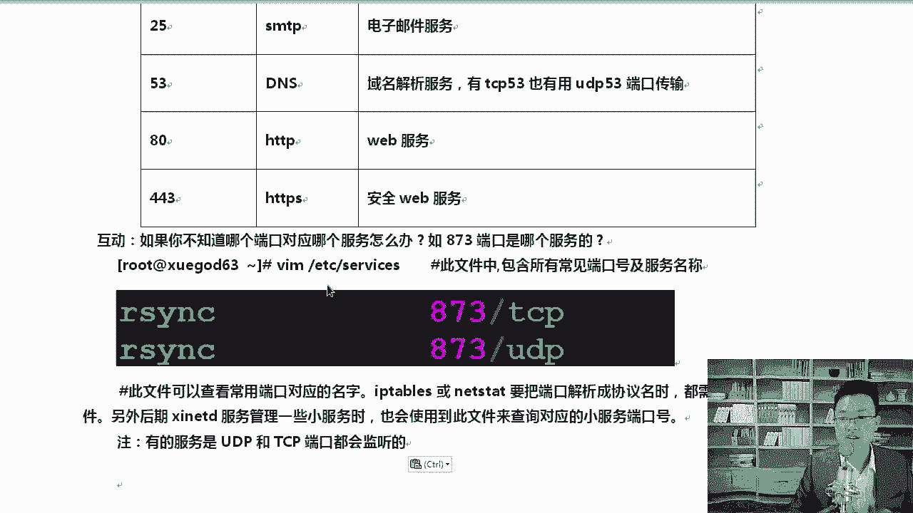

# Linux运维／RHCE／红帽认证／云计算-Linux教程-OSI七层模型和TCPIP四层模型（Linux运维必备）／RHCE／红帽认证／运维工程师／ - P1：linux入门视频教-OSI七层模型和TCPIP四层模型 - 学神科技 - BV1bW411Z7Wc

好，我们今天一块分享一下linux网络管理相关的内容。那么首先呢我们先讲一下这个最这个东西大家都应该知道，就是OSI7层模型和TCP的4次模型，好不好？

那么这个地方首先我们说一下啊OSI7层模型和TCP4层模型。然后说说lininux网络相关的调试命令。那么再一个就是实战在局域网里面使用AWL伪装m克啊，进行什么多线程SN洪水攻击。

那么这里面包含了TCP34握手的内容，好不好？对，这里面有TCP3swa的内容。好，说到这个地方以后呢，我们来看一下，好吧，OSI7层模型它是什么呢？啊，它是这样的啊。呃，在这里OSI的7层模型。

这个要记住好不好？对，这个要记住啊，还有TCP好不，参考的三四层模型，物理层、数据链路层、网络层、运输层或者叫传输层都行，好吧，绘画层表示层和应用层清楚了吧。😊，面试的时候啊。

一般有时候他可能会问一下哈七层模型和四层模型从下到上依次都是什么？好，我记得我当年上学的时候是吧，有一套考题就是什么OSI7层模型从下到上，你别从写成从上到下了，那样就错了。所以面试的时候。

大家也要注意一下这个东西，这个东西要记得住啊。😊，好不好？对，这个你要记住啊。然后接下来OSI7层模型好不好？缩写就是这个叫做开放系统互联参考模型。这个要记住啊，这是搞IT，你也要需要记一些基本的概念。

好不好？OK那么TCP4层模型TCP4层模型，这个大家也知道啊，好吧，它是一个四层模型。😊，呃，分层的作用是什么呢？分层的作用有几个好处啊，我把这几个好处给大家说一说。😊，好，在这里看一下啊。😊。

分层啊分层主要的作用就是方便我们的管理。好，我们这里画一张图啊，这个图我觉得还不错啊，所以我就给大家写到这儿了，好不好？OSI7层模型的一个图例好，那么在这里我们来看一下。对，这是分层的作用。

或者说分层主要是方便管理啊。然后呢，七层模型的这个物理层这一块主要是数据传输的相关的第一层到第四层。如果大家不是搞网络的话，你记一下这些概念就行了。好吧好？绘画层表示层和应用层。

那么对应的数据传输的单位也不一样啊，比如说最物理层就是最底层的，你像这个比特流啊，就是电的这个信号是吧？然后上边数据链路层主要是帧好吧，再往上是数据包，再往上是数据段。

好不好？OK我们说我们抓一个包，能抓包就在网络层这个地方。好不好？这块上面就是表示层应用层绘画层。那么基层模型它有什么优点呢？对啊，网络为什么要分下层呢？是因为这样的啊，同学们。呃。

因为咱们不是就是咱们这个课程跟网络的课程。对，我们来先看一下吧，把网络这个知识好不好？你网络技术差的同学，你要更应该用心的去记这个东西了，好不好？基层模型的优点是这样的啊。

可以把网复杂的网络怎么样划分成更容易管理的一些层，清楚了吧？对，分层而至是吧？就像国家一样会分成很多省省下再分很多市，这样的话，管理起来才方便，你要都毁成一个，那就那就乱了。😊，好吧。

也还有一个就是没有一个厂商能够提供一套完整的解决方案。就像华为这么牛的厂商，他也不能把所有的应用是吧都搞定。清楚啊，比如聊天的软件，那华为是吧就没有对吧？但是华为可以搞什么搞网络啊，路由器交换机这一块。

对吧？好，那么独立啊他们可以怎么样独立完成各自的任务，互不影响，分工明确，上层不需要关心下层的事儿。各自忙各自的这个事儿。好不好？好，这是这个啊，那么对应的每一层上边的这个设备，这些东西呢。

说真的啊，你要真的想成为一个高手，你应该记一下。除了记这个有机会的话，大家应该把C增至少C3A那个那个层面的技术水平，你应该拥有啊，或者你应该学会。😊，好不好？因为CNA就像一个什么。

就像一个最基础的一个东西一样，大家要会啊。那么物理层它上面工作了哪些设备呢？集线器集限器这个已经过期了。好不好，已经没人在用了啊，所以现在已经很少用了。所以接下来接下来就是二层啊，二层交换机网卡好吧。

其实网卡。😊，你说它是二层也行，说它是一层也行。因为网卡也走物物物理信号嘛，还有三层交换机路由器，我们称为网络层的设备。防火墙这一块成为传输层的设备，好吧，QQIE浏览器等等这些东西。

这都是属于6567，好吧，这几层所代表的这些数据。ok。😊，好，那么知道了这个以后呢，我们来往下继续啊。再一个二层跟三层有什么区？二层交换机没有路由功能，三层交换机有路由功能。清楚了吧。啊，好的。

那我们知道这个地方以后，我问大家个问题啊，什么问题呢？这个为什么现在网络通信模型中，我们用的TCPIP4层模型要多一些。而O不是OSI7层模型。对啊，为什么用这个多一些呢？😡，想一想。他是这样的啊。

因为什么？因为这个七层啊虽然好，但是它是理论上的，而且它太复杂了。OSI7层模型是理论性的一个模型，一般用于理论上的研究，好不好？而且它的分层有点冗余啊，实际中我们更多的用的是四层模型。😊，好吧。

而且OSI它也有一些自身的缺陷。😊，清楚了吧。ok。呃，是这样的，你比如说绘画层表示层这几个。这几个就没有对应的什么？你就不能说我单纯的拿一个服务，或者拿一个软件在绘画层工作，没有这样的东西。清楚了吧。

绘画层表示层是吧？其实直接给你合成到应用层里了，就像QQ1样。😊，啊，这个地方有什么绘画层表示层全部都封装到一起了。你们做开发的时候也不可能单独开发出来绘画层的一个设备，都是一起的啊。

所以这几层几乎是空的，而数据链路层和网络层有时候又报的信息太多，清楚了吧？所以说不实用啊，理论上那一套还好好不好？但是实际上它并不实用。😊，好，那么知道了这个以后呢，它们对应的关系你知道了吗？

就这儿你看。😊，TCP4层模型就没有任何问题了啊。啊，你看物理层跟数据链累层，这两个直接给你合成一个什么叫网络接口层。😊，实际上这个才真正的符合我们的需求。啊，你像以前最以前是吧，有极限器。

这种设备被淘汰了。😊，好吧，我们直接把什么？其实现在也就直接把数据链路层跟物理层合到一起了，直接就用交换机网卡。你也不用非得说网卡是一层二层，实际上我们用的过程中什么呀？对它都合到一起了，对上这就很好。

网络接构层肯定是什么网卡或者说啊二层交换机。网络层的话直接就是路由器。😊，是吧TCP基于是吧TCPUDP传输层这一块，这个很明确啊，设备是吧？基于应用的防火墙。😊，对吧然后各种各样的协议啦。

应用层这块QQ软件啊等等。对，实际上以这个为标准啊。好，知道了这个我们来聊聊什么，聊聊这个东西啊，就是常见的好不好？常见的什么呢？常见的这个啊，我们来看一下。😊。

在这里有。呃，常见的网络相关的协议。就强调一件事儿，这几个东西它代表的是什么，你都记住。好不好？对你都要记住啊，你像ARP好不好？地址解析协议。这是我们搞IT比会的这个东西，明白吧？我把这个过一遍啊。

其实一般情况下大家应该都比较熟悉啊，ARP叫地址解析协议。好吧，IP解析成mike干这个使用的BNS是域名解析协议，好吧，SMPNMP网络管理协议好，应该写全的话，应该叫做。简单。啊，对。

这个地方应该叫。把这个也写上去啊，simple嘛，simple network managerproto简单网络管理协议。管理网络设备一般走这个DHCP动态主机配置协议好不好？FTP文件传输协议。

HDDP超文本传输协议。啊，安全的超文本传输协议SAMP啊，天天都在用pin的时候我们经常用这个东西，对吧？😊。

OK然后还有一个是SMMTP，这是什么简单邮件传输协议。我们平常发邮箱的时候是吧，经常会用这个东西啊，各位。😊，发邮件的时候经常会用，还有tnet好不好？虚拟终端协议TFTP。好不好？

OK选小文件传输协议啊，比FTP更简单一些。UDP啊叫用户数据报协议betagram。proto好吧，还有传输控制协议TCP这几个都是必会的啊。对，我们都需要知道。知道以后呢，有一件事啊。

面试的时候问一些理论上的知识，也经常会问TCP跟UTP有什么区别？好吧，这个事也经常会问啊。能说一说吗？假如说你现在就是面试啊，面被面的人，我就是面试官是吧？问同学TCPUTP有啥区别？

咱们的服务应该用TCP还是UDP呢？你得能说道说道啊。好不好？对，最他是这样的啊，先解释一下他们啊PCP协议是啥，它是面向链接的，在收发数据前必须要和对方建立可靠的链接。

首先那它就可靠UDP呢UDP是这样的啊，中文名字叫做数据报啊协议啊，数据报协议是一种无链接的什么传输层协议啊，提供面向什么事物的简单不可靠传输。😊，有同学说不可靠就不好了，那也不一定，好吧。

所以我们要把。😊，啊，我们要把什么呢？要把这个给大家写写一下，总结一下。这个东西要记啊啊，我已经把。他俩有什么区别呢？你就这样回答啊，TCP是基于链接的啊，UDP是基于无链接的好不好？

所以呢TCP更安全更可靠。就这样，然后呢，对于系统资源的要求来说呢，TCP要多一些，UDP要少一些，为啥呢？你看因为UDP程序的数据结构简单，UDP报文信息的标题一般都很短。

只有8个字节相对于TCP20个字节信息的额外开销来说呢很小，我8个你20个，对吧？你比我多好多，所以呢，所以传输速度可以更快，好不好？😊，对我们的UDP协议传输的数据速度会更快一些。

TCP保障了数据的正确性。UDP可能丢包，好不好？啊，TCP可保证数据的顺序，UDP保证不了。明白了，各位。TCP。好不好。啊，UDP好吧，它呢它是。无连接的。啊，TCBG链接更可靠。清楚了吧。对。

一个是更可靠一些啊。好的。那么这个地方呢。基于无连接不太可靠啊，也不能说人家不可靠。那基于TCP无连接是吧，它有点不可靠，那你怎么解决这个问题呢？😡，对啊，万一TUDB可能丢包，是不是就一无是处了？啊。

是不是也不一定啊。清楚了吧。呃，这个地方所以我们说一下啊，这个地方场景。好不好。你比如说场景是什么样的情况，你允许你丢包啊，比如说咱俩视频着视频要求速度要什么快。

那视频的时候偶尔丢了一个丢了一个画面有问题吗？没有问题，丢了一帧有问题吗？没有问题。所以视频这种还有语音就可以使用UDP。😡，清楚了吧。对视频或者语音。好吧，通信。可以是吧？

因为这个需要速度要要求速度要快一些嘛。使用什么对UDP。好吧，传输文件就不行了啊。清楚了吧？使用对，使用UDP或什么或你的网络环境很好。清楚啊。对，网络环境很好，比如内蒙。啊。

我们说局域网说的更专业一些，好吧。对你比如说局域网。啊，通信局域网中的通信可以什么？对，这个要看具，但是这个要到具体的什么，具体情况，具体分享。好吧，然后呢。呃，TCP这个地方好不好？比如说传输文件。

你传文件的时候，少一个东西是不是打不开了？是吧。OK数据正确率要求高一些。完整性。对，要求高啊。这种需要用TCP的啊，然后呢，UDP并不是说大家工作中好像感觉并不是说UDP就是一无是处了啊。

UDP也非常常用。比如说DNS域名解析。😊，啊，第一次我没给你没给你，你再找我要一次就行了，就这么简单。😡，那么UDP的完整性，UDP数据的什么数据传输的，它不是会丢光吗？

那么UDP数据传输的完整性怎么解决的？所以说。你怎么能解决它的完整性呢？可以通过什么？对，通过应用层的软件来解决。应用层可以做个校验吗？哪个包没发的是吧，你再发一下，清楚了吧？😊。

对你拿这个来校对就行了啊。就弥补了这个事了。好的，这个地方大家能理解吧。好，这个地方我们清楚了啊。当然其实我们生活中是吧，更多的还是你像这里面很多协议是吧。

比如说SNMP和DHCPHDDP他们我们生活中一般用的都是基于TCP的。😊，好吧，还有SS远程连接。是吧这都是啊。啊，对，我们一般用的还是要。就是。TCP要多一些的啊，场景里面。啊。

因为现在这个网络环境或者带宽的要求。是吧带宽越来越宽了，所以我们怎么样，我们宁可保证什么稍微牺牲一点带宽是吧？也要保证数据的完整性。清楚了吧，因为现在带宽很快了嘛，以前。😊，就是以前带宽比较窄的时候。

UDP还有一些它的优势。你像现在是吧？5G的速度，哇，那太快了，几秒钟就下载下来了，丢两个包又又能怎么样呢？对不对？或者说什么4G。😊，是吧那个家里是吧，小区动辄是吧，百兆贷宽。好吧，往前推十年。

100兆的带宽想都不敢想。真的。MK刚到北京的时候是吧，也是群租房嘛，是吧？一栋楼里面两兆贷宽。聊个QQ是吧，都不敢发图像。好，我们说一下啊TCPUDP常用的端口号，这个要记住21FTP22。

SSH23tnet25SMTP还有什么53DNSDNS有自己的TCP的53通行端口，也有UDP的啊。80是web443是HTTPS。对吧。好，那么有同学说老师万一有个人我不知道呢。

比如说这个如果你不知道那个端口号对应哪个服务该怎么办？比如说啊873端口是哪个服务？瞬间就懵了是吧？哎，还有这样的端口吗？怎么办？给你个思考时间行不行？这个地方我们可以有一个小办法啊，比如说什么呢？

来我们来看一下啊，873端口你想知道是什么是吧？我们可以打开linux，我帮你查一下。好飘逸啊。来在这里啊，我们VI打开ETC好吧，service。打开这个文件以后，在这里好。

比如说875或者873端口都能看到。啊，873端口，你看在这里写的是RSNC。而且是吧既有TCP又UDP。当然你也可以。啊，光标移动到最上面，好吧，我们去搜索一下80。这个文档里是吧，他会帮你记一下啊。

搜一下啊80端口。那你可以看一下TCPHDDP的80端口是吧？还有什么？还有UDP的80端口是不是都有超文本传输协议。好，还有web。对不对？都有啊，包十包括22。好嘛。定位到最上面。

就是你忘了哪个端口的时候，你都可以去看你会发现SSH有既有TCP的，也有UDP的。😊，好吧，当然我们现在用的是什么PCP的，包括我们前一段时间讲日志的时候，我们搜514514的时候是不是也有啊？😊。

对啊，5要4。RNLRCslog这个地方对你既可以用TCP的，也可以用UDP的。好，那么我们清楚了，这是一个小技巧啊。对吧。好的。总结到这里，在这里大家看一下啊，我应然打开这个地方，好吧。

此文件即可以查看我们常用的端口号，好吧，IP tables或者netstate。😊。

清楚了吧。这两个大家知道吗？一会儿我们讲的SA的。😊，whatnet state他怎么就知道80端口对应的是HDDP呢？或者22端口。好吧，没明白我说的啥意思是吧？😊，啊，我先带着你读一遍。

你看一下啊IP tables或者是nett state。要把我们的端口解析成是吧？名字的时候，那么都要用到这个文件。好吧，他会去找80A对应的是谁？另外后面的CnetD符好，管理一些小服务的时候。

也需要用到此文件里啊，来查询小服务对应的端口号。而且有的服务是UDP和TDP都有的。明白了吧。Night state。好，next date后面跟上这个地方，我们以前经常加N，这次我不加N。呵。

你看这个地方22端口。是吧。他不加那个还弹不出来22，为什么呢？那么不加的时候，应该搜SSH。看到了吧，他怎么知道。😮，你能看懂吗？他怎么知道你的22对应的是SSH。想过这个问题吗？

对吧n data怎么知道呢？他就去servvicice里面去找了。好吧，所以你有时候搜不定22的时候是吧？

对，我们一般情况下也不需要它A解析啊，所以我们就输入N了。明白了吧？好的。在这个地方我们知道了这些东西，我们把什么呢？把路由啊，把IP地址说一说啊，这些东西都需要大家备注备的啊。

IP地址我们的IP地址其实是分类的啊，主要分ABC啊，ABCDE5类啊，常见的分5类五类分别是什么呢？

A类、B类、C类、D类还有E好吧，那么最常用的是什么呢？最常用的是ABC好不好？那么A类的地址范围是0到127，你最好记一下，我呢就记住了，好不好？你也记住一下，这个我真记住了啊，上大学的时候是吧？

网络那块考试天天考这几个。好吧，那么127是保留地址，对吧？1270。0。1。啊，主要用于测试回环口专用，清楚了吧？啊，所以真正能用的话是什么？1到1126子网掩码255，1个255是吧？

B类地址是128到191。好不好？比如说172。68，这就是一个典型的B类地址，字码掩码是2个25。C类的话是192到223记一下啊，这个地方3个25。好，D类的地址范围是24到239。好。

那么还有一个是什么？还有一个是主播，主播的话大家知道一下啊。

D类地址主要是主播好吧，主播地址是224到239。呃，被用在多点广播中，好吧，多点广播用来什么一次寻址啊，一组计算机。好吧，这个协议。用的少。好吧，现有的其实现有我们应用里面更多的全部都是什么？

全部都是正常的点对点的播放啊。你看啊如果有主播的情况下是这样的。看一下这个图。你比如说服务器是吧，服务器正常，比如说有这么多客户端，我要每个人都给他们发一下。好吧，如果有主播的情况下。

服务器把信号发到什么，发到这一组路由器上，路由器就直接帮你什么分给他们了，这是主播。好吧，但现然而我们现在是吧，更多的还是主播还是用的很少啊，因为你必须让要让什么。

要让供应商的路由器支持你这一条信息才行。😊，啊，但是一般供应商的路由器人家不管你这事这个事儿，除非你再交钱。明白了吧。好，对，除非你交钱啊。所以大家你们IP你们你们跟你自己网段去配IP的时候。

你要注意一下啊，你的范围你不可以随便写的啊，到254啊就可以了。一类保留用的，你也不可能给你的机器配个240多少段这样的网段。😡，好不好？好，那么往下我们接下来好，我们举个例子啊。

你像这个同学说了一件是什么呢？说老师ABCD都有私有地址。😊，好吧，这就要搞笑了。😊，清楚了吧？所以为什么要让你记这个东西，你一这样面试的时候，直接出来这样的结果，直接就把你pass掉了。😡，好吧。

所以我说你要是。😊，这个同学你就应该学一学什么呢？学一学CNA相关的课程体系啊。😊，私有地址好吧，前面我们说的这都是什么公网地址，然后在公网地址里好吧，ABC3类里面都有自己的私有IP就是我画出来A段。

作为私有网段。什么呢？A类里边的有个10。010。0这个叫私有地址啊，B类的话，172。16到172。31。记住。记到脑子里啊。等我下了课以后，你应该记住。那么C类地址是19216800到什么25。

好吧，到这里面，这是我们的C类私有地址范围，好不好？😊，好，这个地方这是ABC类啊，ABC好吧，三类啊，我写个三吧，三类中私有IP地址范围好吧，这个写的更准确一些啊，都到255好吧。

咱们经常用的就是192。168。1点多或者0点多G。对吧。那么IP地址分类了以后有什么好处啊？这个有好处啊，方便做那个路由条目的是吧？收敛。啊，方便做路由条目啊，的规划啊。好的，那我们知道了啊。

如果这个东西大家有问题的话，那。有机会你得补补那个CCNA的那个知识，好不好？那个CCNA也就没有多少，也就大概30天左右。啊，不不30个小时左右啊。😊，看一看好不好，尤其是大家不是从计算机出来的学生。

呃，要去补一补这一块的知识，好不好？

好，我们来看一下这个地方啊，什么意思？我们去拼1270。0。1能拼通吗？那么拼这个呢？

看一下啊。1270。0。1，这个大家都知道是吧？对我们拼0。1能平通。好不好，因为什么呢？因为我们的回关口。if configure figure回环口上写的很清楚，LO回环口的IP是1270。0。1。

好吧，回环口这个网卡是这个网卡接口是不当的，一直有。那我凭这个呢？想过吗？这个能拼通吗？看一下一样可以听。也就是127这个网络里，你其实你拼谁都能通好，即即便你没有什么。😡，可能大家没有注意过这个事啊。

听楚了吧？127整个网段里面，你随便写个IP。他拼的都能拼动啊，这个倒没有什么意义，只是告诉你有这么一回事。😡，好不好，别哪一天突然间觉得不对劲儿。好。那么拿到这个以后，我们往下继续，好不好？

说说linux网络相关的命令。

